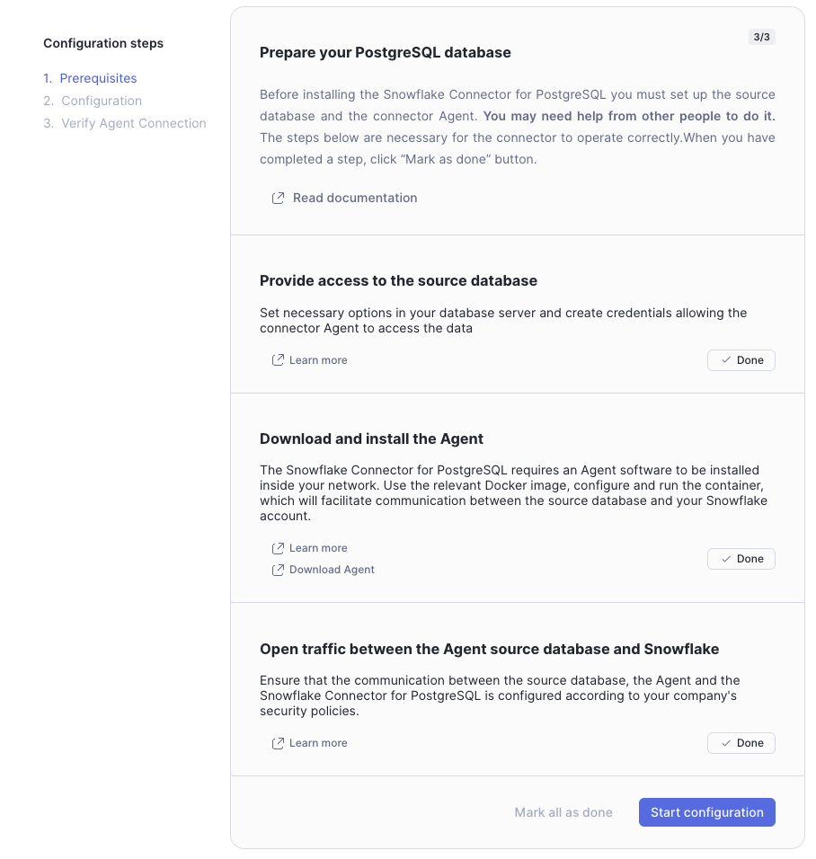
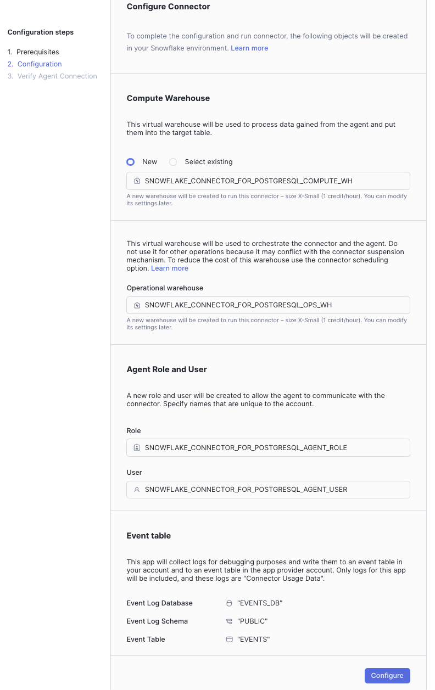
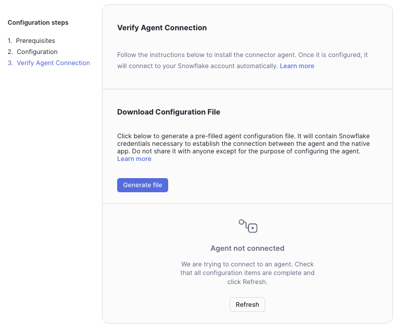
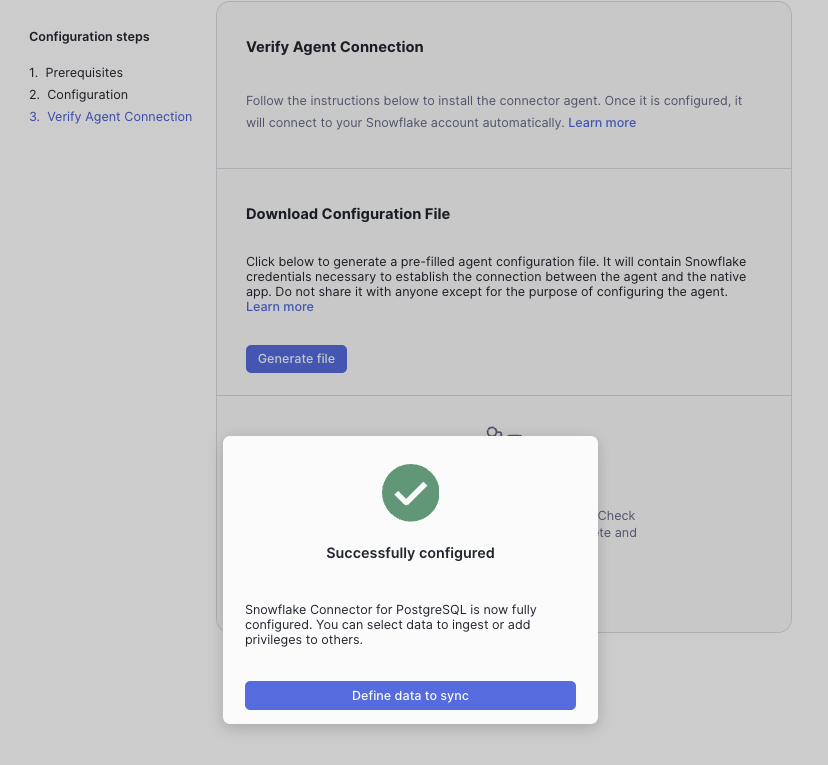

author: Joviane Bellegarde
id: connectors-postgres-cdc
categories: snowflake-site:taxonomy/solution-center/certification/quickstart, snowflake-site:taxonomy/solution-center/certification/community-sourced, snowflake-site:taxonomy/solution-center/includes/architecture, snowflake-site:taxonomy/industry/financial-services, snowflake-site:taxonomy/product/platform, snowflake-site:taxonomy/snowflake-feature/transformation
language: en
summary: Build real-time financial dashboards using Change Data Capture from PostgreSQL to Snowflake with Dynamic Tables and Streamlit.
environments: web
status: Published
feedback link: https://github.com/Snowflake-Labs/sfguides/issues


# Real-Time Financial Insights Using Change Data Capture (CDC) with the Snowflake Connector for PostgreSQL and Dynamic Tables
<!-- ------------------------ -->
## Overview


In this Quickstart, we will investigate how a financial company builds a BI dashboard using customer transactional data housed on a PostgreSQL database. The data is brought into Snowflake via the Snowflake Connector for PostgreSQL. The main idea is gain insights on potential ways to increase customer spending with promotions.

### What You Will Build
- Visualize customer data and gain insights ingesting data from PostgreSQL DB to Snowflake using the Snowflake Connector for PostgreSQL Native App and Dynamic Tables

### What You Will Learn
- How to connect PostgreSQL data to Snowflake using the [Snowflake Connector for PostgreSQL](https://other-docs.snowflake.com/en/connectors/postgres6/about)
- How to visualize data using [Dynamic Tables](https://docs.snowflake.com/en/user-guide/dynamic-tables-about) and display visualizations within [Streamlit in Snowflake (SiS)](https://docs.snowflake.com/en/developer-guide/streamlit/about-streamlit)

### Prerequisites
- [Docker](https://www.docker.com/products/docker-desktop/) installed on your local machine
- A tool available for connecting to the PostgreSQL database
  - This can be a database-specific tool or a general-purpose tool such as Visual Studio Code or PyCharm
- Familiarity with basic Python and SQL
- Familiarity with data science notebooks
- Go to the [Snowflake](https://signup.snowflake.com/?utm_source=snowflake-devrel&utm_medium=developer-guides&utm_cta=developer-guides) sign-up page and register for a free account. After registration, you will receive an email containing a link that will take you to Snowflake, where you can sign in.

<!-- ------------------------ -->
## Snowflake Environment

### Overview
You will use [Snowsight](https://docs.snowflake.com/en/user-guide/ui-snowsight.html#), the Snowflake web interface to create Snowflake objects (warehouse, database, schema, role).

#### Creating Objects and Loading Data
1. Navigate to Worksheets, click `+` in the top-right corner to create a new Worksheet, and choose **SQL Worksheet**

2. Copy and paste the following code to create Snowflake objects (warehouse, database, schema) and click **Run All** at the top of the Worksheet
```
USE ROLE accountadmin;

/*---------------------------*/
-- Create our Database
/*---------------------------*/
CREATE OR REPLACE DATABASE cdc_prod;

/*---------------------------*/
-- Create our Schema
/*---------------------------*/
CREATE OR REPLACE SCHEMA cdc_prod.analytics;

/*---------------------------*/
-- Create our Warehouse
/*---------------------------*/

-- data science warehouse
CREATE OR REPLACE WAREHOUSE cdc_ds_wh
   WAREHOUSE_SIZE = 'xsmall'
   WAREHOUSE_TYPE = 'standard'
   AUTO_SUSPEND = 60
   AUTO_RESUME = TRUE
   INITIALLY_SUSPENDED = TRUE
   COMMENT = 'data science warehouse for cdc';

-- Use our Warehouse
USE WAREHOUSE cdc_ds_wh;
/*---------------------------*/
-- sql completion note
/*---------------------------*/
SELECT 'cdc sql is now complete' AS note;
```

<!-- ------------------------ -->
## PostgreSQL Environment

### Overview
In this section, we will set up a PostgreSQL database and create tables to simulate a financial company's customer transactional data.

#### Starting the Database Instance
Before getting started with this step, make sure that you have Docker Desktop installed for either [Mac](https://docs.docker.com/desktop/install/mac-install/), [Windows](https://docs.docker.com/desktop/install/windows-install/), or [Linux](https://docs.docker.com/desktop/install/linux/). Ensure that you have [Docker Compose](https://docs.docker.com/compose/install/) installed on your machine. 

1. To initiate the PostgreSQL database using Docker, you'll need to create a file called **docker-compose.yaml**. This file will contain the configuration for the PostgreSQL database. If you have another container client, spin up the container and use the PostgreSQL image below. 

2. Open the IDE of your choice to copy and paste this file by copy and pasting the following:
```
services:
  postgres:
    image: "postgres:17"
    container_name: "postgres17"
    environment:
      POSTGRES_DB: 'postgres'
      POSTGRES_USER: 'postgres'
      POSTGRES_PASSWORD: 'postgres'
    ports:
      - "5432:5432"
    command:
      - "postgres"
      - "-c"
      - "wal_level=logical"
    volumes:
      - ./postgres-data:/var/lib/postgresql/data
```

3. Open a terminal and navigate to the directory where the **docker-compose.yaml** file is located. Run the following command to start the PostgreSQL database:

```
docker-compose up -d
```
After running this command, you should see one Docker container actively running the source database.

#### Connecting to the Database
To connect to the pre-configured databases using Visual Studio Code or PyCharm, or whichever IDE you choose for a database connection, perform the following steps with the provided credentials:
1. Open your tool of choice for connecting to the PostgreSQL database
   - For VSCode, you can use the [PostgreSQL extension](https://marketplace.visualstudio.com/items?itemName=cweijan.vscode-postgresql-client2)
   - For PyCharm, you can use the [Database Tools and SQL plugin](https://www.jetbrains.com/help/pycharm/database-tool-window.html)
2. Click the `+` sign or similar to add data source
3. Use these connection parameters:
    - **User:** `postgres`
    - **Password:** `postgres`
    - **URL:** `jdbc:postgresql://localhost:5432/`
4. Test the connection and save

#### Loading Data
1. Run the following **postgres** script in the PostgreSQL to create the database, schema, and tables:

```
CREATE SCHEMA raw_cdc;
SET search_path TO raw_cdc;

DROP TABLE IF EXISTS postgres.raw_cdc.customers;
DROP TABLE IF EXISTS postgres.raw_cdc.merchants;
DROP TABLE IF EXISTS postgres.raw_cdc.products;
DROP TABLE IF EXISTS postgres.raw_cdc.transactions;

CREATE TABLE postgres.raw_cdc.customers (
   customer_id INTEGER PRIMARY KEY,
   firstname VARCHAR,
   lastname VARCHAR,
   age INTEGER,
   email VARCHAR,
   phone_number VARCHAR
);

CREATE TABLE postgres.raw_cdc.merchants (
   merchant_id integer PRIMARY KEY,
   merchant_name VARCHAR,
   merchant_category VARCHAR
);

CREATE TABLE postgres.raw_cdc.products (
   product_id INTEGER PRIMARY KEY,
   product_name VARCHAR,
   product_category VARCHAR,
   price DOUBLE PRECISION
);

CREATE TABLE postgres.raw_cdc.transactions (
   transaction_id VARCHAR PRIMARY KEY,
   customer_id INTEGER,
   product_id INTEGER,
   merchant_id INTEGER,
   transaction_date DATE,
   transaction_time VARCHAR,
   quantity INTEGER,
   total_price DOUBLE PRECISION,
   transaction_card VARCHAR,
   transaction_category VARCHAR
);
```

2. Download and save these csv files in a directory on your local machine: 
    - [customers.csv](https://github.com/Snowflake-Labs/sfguide-intro-to-cdc-using-snowflake-postgres-connector-dynamic-tables/blob/main/scripts/postgres_csv/customers.csv)
    - [merchants.csv](https://github.com/Snowflake-Labs/sfguide-intro-to-cdc-using-snowflake-postgres-connector-dynamic-tables/blob/main/scripts/postgres_csv/merchants.csv)
    - [products.csv](https://github.com/Snowflake-Labs/sfguide-intro-to-cdc-using-snowflake-postgres-connector-dynamic-tables/blob/main/scripts/postgres_csv/products.csv)
    - [transactions.csv](https://github.com/Snowflake-Labs/sfguide-intro-to-cdc-using-snowflake-postgres-connector-dynamic-tables/blob/main/scripts/postgres_csv/transactions.csv)

3. We'll need to move the files from the local computer to the Docker container before loading the data into the PostgreSQL database.

4. Navigate to your terminal to get the Docker container ID with this command:
```
docker ps
```
5. To copy the CSV files to the container, run these commands in your terminal, replacing the file path with your actual file path,m and replacing `container_id` with your actual container ID from the previous command: 
```
docker cp /Users/your_username/Downloads/customers.csv container_id:/tmp/customers.csv
docker cp /Users/your_username/Downloads/merchants.csv container_id:/tmp/merchants.csv
docker cp /Users/your_username/Downloads/products.csv container_id:/tmp/products.csv
docker cp /Users/your_username/Downloads/transactions.csv container_id:/tmp/transactions.csv
```

6. Back in your PostgreSQL console, run these SQL commands to load the files from the container to the PostgreSQL tables:
```
COPY postgres.raw_cdc.customers FROM '/tmp/customers.csv' DELIMITER ',' CSV HEADER;
COPY postgres.raw_cdc.merchants FROM '/tmp/merchants.csv' DELIMITER ',' CSV HEADER;
COPY postgres.raw_cdc.products FROM '/tmp/products.csv' DELIMITER ',' CSV HEADER;
COPY postgres.raw_cdc.transactions FROM '/tmp/transactions.csv' DELIMITER ',' CSV HEADER;
```

7. Next, make sure to run the `CREATE PUBLICATION` command to enable the logical replication for the tables in the `raw_cdc` schema. This will allow the Snowflake Connector for PostgreSQL to capture the changes made to the tables in the PostgreSQL database:
```
CREATE PUBLICATION agent_postgres_publication FOR ALL TABLES;
```

8. Lastly, check that the tables have been loaded correctly by running the following SQL commands:
```
SELECT * FROM postgres.raw_cdc.customers;
SELECT * FROM postgres.raw_cdc.merchants;
SELECT * FROM postgres.raw_cdc.products;
SELECT * FROM postgres.raw_cdc.transactions;
```

<!-- ------------------------ -->
## Snowflake Connector

### Overview
During this step, you will install and configure the Snowflake Connector for PostgreSQL Native App to capture changes made to the PostgreSQL database tables.

#### Install the Snowflake Connector for PostgreSQL Native App
Navigate to [Snowsight](https://docs.snowflake.com/en/user-guide/ui-snowsight.html#): 
1. Navigate to the **Data Products** then to the **Marketplace** section
2. Search for the **Snowflake Connector for PostgreSQL** Native App and install the application
3. You should find your installed Native App under **Data Products**, **Apps** section

#### Configure the Snowflake Connector for PostgreSQL Native App
1. On your Snowflake Account, navigate to the **Data Products**, **Apps** section
2. Open the application
3. Select **Mark all as done** as we will create our source databases from scratch.



4. Click **Start configuration**
5. If you have Event Tables already activated in your account, the **Event Log Database**, **Event Log Schema**, and **Event Table** will populate automatically with what is active. The names of the **Event Log Database**, **Event Log Schema**, and **Event Table** could be slightly different from what is shown.
6. On the **Configure Connector** screen, select **Configure**



7. On the **Verify Agent Connection** screen select **Generate file** to download the Agent Configuration file. The downloaded file name should resemble **snowflake.json**. Save this file for use during the Agent configuration section.



<!-- ------------------------ -->
## Agent Configuration

### Overview
During this section, you will configure the Agent that will operate alongside our Source Databases.

### Configure the Agents
The first step is to create the **agent-postgresql** directory. In this directory, you will create 2 directories named **agent-keys** and **configuration**.

#### Creating Configuration Files
You will fill the configuration files for each agent to operate correctly. The configuration files include **snowflake.json** file to connect to Snowflake, **datasources.json** file to connect to the Source Databases, and **postgresql.conf** file with additional Agent Environment Variables.

Here's how the file structure should look like in the beginning:

Directory Structure
<ul>
  <li>agent-postgresql
    <ul>
      <li>agent-keys
      </li>
      <li>configuration
        <ul>
          <li>datasources.json</li>
          <li>postgresql.conf</li>
          <li>snowflake.json</li>
        </ul>
      </li>
      <li>docker-compose.yaml</li>
    </ul>
  </li>
</ul>

1. Navigate to the directory called **agent-postgresql**
2. Create the docker-compose file named **docker-compose.yaml** in the **agent-postgresql** directory with the following content:
```
services:
  postgresql-agent:
    container_name: postgresql-agent
    image: snowflakedb/database-connector-agent:latest
    volumes:
      - ./agent-keys:/home/agent/.ssh
      - ./configuration/snowflake.json:/home/agent/snowflake.json
      - ./configuration/datasources.json:/home/agent/datasources.json
    env_file:
      - configuration/postgresql.conf
    mem_limit: 6g
```

3. Put the previously downloaded **snowflake.json** file in the **configuration** directory folder
4. Create the file named **datasources.json** in the **configuration** directory with the following content:
```
{
  "PSQLDS1": {
    "url": "jdbc:postgresql://host.docker.internal:5432/postgres",
    "username": "postgres",
    "password": "postgres",
    "publication": "agent_postgres_publication",
    "ssl": false
  }
}
```

5. Create the file named **postgresql.conf** in the **configuration** directory with the following content:
```
JAVA_OPTS=-Xmx5g
```

6. Navigating to the **agent-postgresql** directory in your terminal, start the agent using the following command. The agent should generate public/private key for authorization to Snowflake.
```
docker-compose up -d
```
After running the `docker-compose up -d` command, you will see in your file structure that the **agent-keys** directory has been populated with the private and public keys. At the end, your directory structure should resemble the following.

Directory Structure
<ul>
  <li>agent-postgresql
    <ul>
      <li>agent-keys
        <ul>
          <li>database-connector-agent-app-private-key.p8</li>
          <li>database-connector-agent-app-public-key.pub</li>
        </ul>
      </li>
      <li>configuration
        <ul>
          <li>datasources.json</li>
          <li>postgresql.conf</li>
          <li>snowflake.json</li>
        </ul>
      </li>
      <li>docker-compose.yaml</li>
    </ul>
  </li>
</ul>

#### Verifying Connection with Snowflake
Navigate to Snowsight to your previously created Snowflake Connector for PostgreSQL Native App. Click on the **Refresh** button in the Agent Connection Section. When successfully configured, you should see the "Successfully configured" message. Click "Define data to sync".



<!-- ------------------------ -->
## Replication Process

### Overview
In this step, we will instruct the Connector to begin replicating the selected tables.

### Configure Data Ingestion
1. Change the role to **ACCOUNTADMIN**
2. Download the [Snowflake Notebook](https://github.com/Snowflake-Labs/sfguide-intro-to-cdc-using-snowflake-postgres-connector-dynamic-tables/blob/main/notebooks/0_start_here.ipynb) and import it into Snowflake by navigating to Snowsight and going to **Notebooks** and to using the `Import .ipynb file` button. 
3. Select the **CDC_PROD** for the database, **ANALYTICS** for the schema, and **CDC_DS_WH** for the warehouse. This Notebook includes the SQL scripts needed to create the destination database for table replication of the PostgreSQL tables into Snowflake and monitor the replication process.
4. Run the first 3 cells in the Notebook labeled **create_db_objects**, **table_replication**, and **check_replication_state**.
5. Run the cell labeled **check_replication_state** until the output indicates successful replication as indicated in the Notebook.
6. Once the replication process is complete, you can run the rest of the Notebook.
7. Notice the Dynamic Table, **cdc_prod.analytics.customer_purchase_summary**, is created in the last cell labeled **create_dynamic_table**. This table will be used to visualize the data in the **Customer Spending Dashboard** Streamlit app.

<!-- ------------------------ -->
## Streamlit App

### Overview
In this section, we will create a Streamlit in Snowflake application to visualize the customer purchase summary data.

### Create the Streamlit in Snowflake Application
1. Change the role to **ACCOUNTADMIN**
2. Navigate to Snowsight and go to **Projects** then **Streamlit**
3. Click on the **+ Streamlit App** to create a new Streamlit application
4. For the **App Title**, enter **Customer Spending Dashboard**
5. For the **App location**, enter **CDC_PROD** for the database and **ANALYTICS** for the schema
6. For the **App warehouse**, choose the **CDC_DS_WH** warehouse and click **Create**
7. Copy and paste the contents of the [customer_purchase_summary.py](https://github.com/Snowflake-Labs/sfguide-intro-to-cdc-using-snowflake-postgres-connector-dynamic-tables/blob/main/scripts/customer_spending_dashboard.py) file into the Streamlit app code editor
8. Here, we can view the purchase summary for all or selected customers by selecting various filter for dates, customer IDs, and product categories and more

<!-- ------------------------ -->
## CDC

### Overview
In this section, we will ingest new transaction data from PostgreSQL into Snowflake.

### Ingest New Data
Navigate to your PostgreSQL console and run the following SQL command to create a stored procedure that inserts 1000 new records into the `transactions` table every minute:
```
CREATE OR REPLACE PROCEDURE insert_transactions()
LANGUAGE plpgsql
AS $$
DECLARE
    v_new_transaction_id TEXT;
    v_customer_id INT;
    v_product_id INT;
    v_merchant_id INT;
    v_transaction_date DATE;
    v_transaction_time TEXT;
    v_quantity INT;
    v_product_price DOUBLE PRECISION;
    v_total_price DOUBLE PRECISION;
    v_existing_customer RECORD;
    v_existing_product RECORD;
    v_existing_merchant RECORD;
    v_transaction_card TEXT;
    v_transaction_category TEXT;
BEGIN
    -- Loop for 30 minutes (inserting 1000 records every minute)
    FOR i IN 1..30 LOOP
        FOR j IN 1..1000 LOOP
            -- Select random valid customer, product, and merchant from existing tables
            SELECT * INTO v_existing_customer
            FROM postgres.raw_cdc.customers
            ORDER BY RANDOM()
            LIMIT 1;

            SELECT * INTO v_existing_product
            FROM postgres.raw_cdc.products
            ORDER BY RANDOM()
            LIMIT 1;

            SELECT * INTO v_existing_merchant
            FROM postgres.raw_cdc.merchants
            ORDER BY RANDOM()
            LIMIT 1;

            -- Generate new transaction ID (unique)
            v_new_transaction_id := 'TX' || EXTRACT(EPOCH FROM NOW())::TEXT || j::TEXT;

            -- Generate current date and time in New York time zone
            v_transaction_date := (CURRENT_TIMESTAMP AT TIME ZONE 'America/New_York')::DATE;
            v_transaction_time := TO_CHAR(CURRENT_TIMESTAMP AT TIME ZONE 'America/New_York', 'HH24:MI:SS');

            -- Generate random quantity between 1 and 7
            v_quantity := FLOOR(RANDOM() * 7 + 1);

            -- Get product price and calculate total price
            v_product_price := v_existing_product.price;
            v_total_price := v_product_price * v_quantity;

            v_transaction_card := (ARRAY['American Express', 'Visa', 'Mastercard', 'Discover'])[FLOOR(RANDOM() * 4 + 1)];
            v_transaction_category := CASE WHEN RANDOM() < 0.8 THEN 'Purchase' ELSE 'Refund' END;

            -- Insert new transaction into the transactions table
            INSERT INTO postgres.raw_cdc.transactions (
                transaction_id, customer_id, product_id, merchant_id, transaction_date, transaction_time, quantity, total_price, transaction_card, transaction_category
            )
            VALUES (
                v_new_transaction_id, v_existing_customer.customer_id, v_existing_product.product_id,
                v_existing_merchant.merchant_id, v_transaction_date, v_transaction_time,
                v_quantity, v_total_price, v_transaction_card, v_transaction_category
            );
        END LOOP;

        -- Commit after every batch of 1000 rows
        COMMIT;

        -- Wait for 30 seconds before inserting the next batch
        PERFORM pg_sleep(30);
    END LOOP;
END;
$$;
```

To run the stored procedure, execute the following SQL command:
```
CALL insert_transactions();
```

Navigate to the Streamlit dashboard and refresh the page by clicking on **Refresh** to view the new data.

<!-- ------------------------ -->
## Clean Up

### Overview
When you're finished with this Quickstart, you can clean up the objects created in Snowflake.

### Clean Up Script
Navigate to the last cell in the Snowflake Notebook to uncomment and run the last cell labeled **clean_up** to drop the connector objects created in this Quickstart.

<!-- ------------------------ -->
## Conclusion and Resources
### Congrats! You're reached the end of this Quickstart!

### What You Learned
With the completion of this Quickstart, you have now delved into:
- How to connect PostgreSQL data to Snowflake using the Snowflake Connector for PostgreSQL
- Visualize data using Dynamic Tables and display visualizations within Streamlit in Snowflake (SiS)

### Resources
- [Snowflake Connector for PostgreSQL](https://other-docs.snowflake.com/en/connectors/postgres6/about)
- [Snowflake Dynamic Tables](https://docs.snowflake.com/en/user-guide/dynamic-tables-about)
- [Snowflake Notebooks](https://docs.snowflake.com/en/user-guide/ui-snowsight/notebooks)
- [Snowpark API](https://docs.snowflake.com/en/developer-guide/snowpark/index)
- [Streamlit in Snowflake](https://docs.snowflake.com/en/developer-guide/streamlit/about-streamlit)
- [Fork Repo on Github](https://github.com/Snowflake-Labs/sfguide-intro-to-cdc-using-snowflake-postgres-connector-dynamic-tables/tree/main)
- [Download Reference Architecture](/content/dam/snowflake-site/developers/2024/10/Real-Time-Financial-Insights-Using-CDC-Architecture.png)
- [Read the Blog](https://medium.com/snowflake/real-time-financial-insights-using-cdc-with-the-snowflake-connector-for-postgresql-and-dynamic-989c2911c393)
- [Watch the Demo](https://youtu.be/M77Aun9ke7I?list=TLGGUvQ7ij03_TUyNDA5MjAyNQ)
