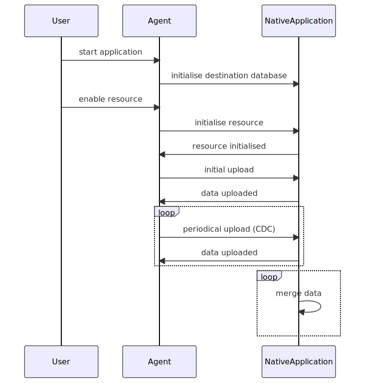
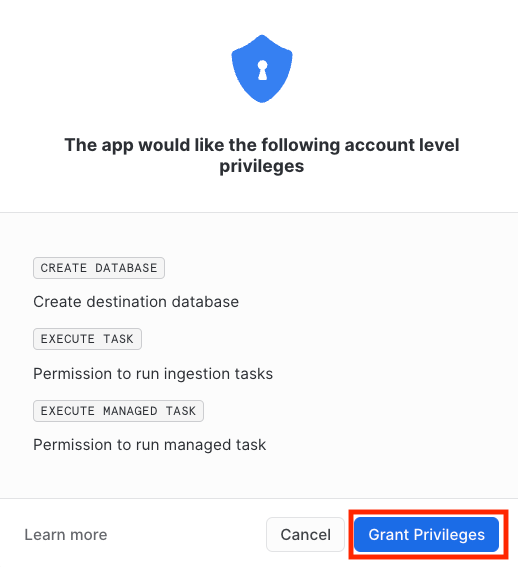
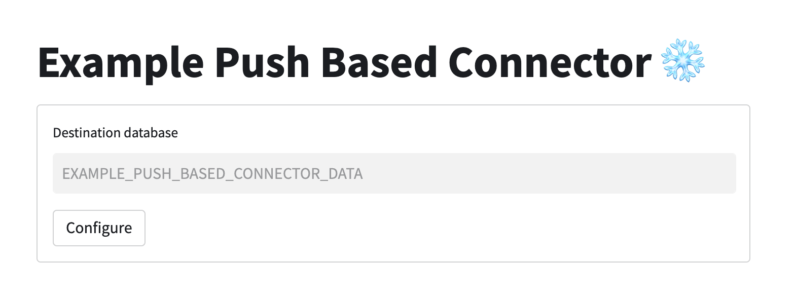
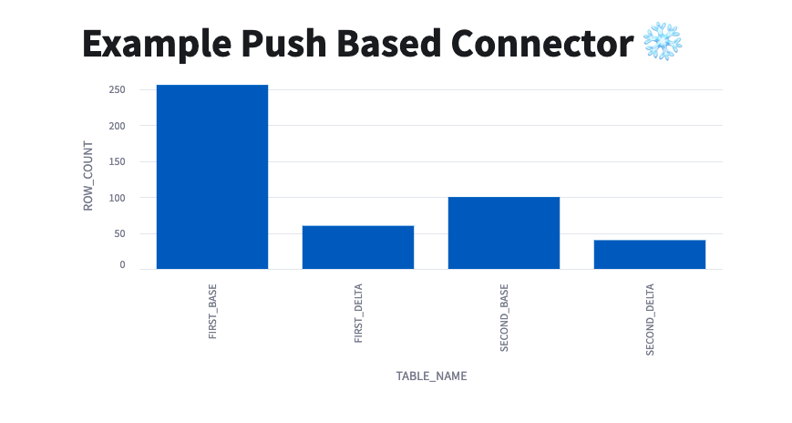

author: Piotr Hachaj
id: connectors_example_push_based_java
summary: Overview of building Snowflake push based connectors using Java and Native Apps.
categories: connectors,solution-examples,partner-integrations
environments: web
status: Published
feedback link: https://github.com/Snowflake-Labs/sfguides/issues
tags: Connectors, Native Apps

# Snowflake example push based Java connector

## Overview
Duration: 1

In this tutorial you will learn how to build a native Snowflake push based connector.
In the following steps we will cover what constitutes a connector, how to build and deploy it and how to build
an application UI using Streamlit.

### Prerequisites
Duration: 1

- Basic knowledge of [Snowflake Native Apps](https://docs.snowflake.com/en/developer-guide/native-apps/native-apps-about)
- Basic knowledge of Java
- Snowflake user with `accountadmin` role

### You will learn
Duration: 1

- Creating Native Applications in Snowflake
- Ingesting data to Snowflake using snowflake-ingestion-sdk
- Running Snowflake procedures using snowflake-jdbc
- How to optimize merge for the CDC scenario using [deferred merge approach](img/75ce96e228ff90d2.pdf)


### Prepare your local environment
Duration: 5

- Install Java 11 or later
- Install [snowsql](https://docs.snowflake.com/en/user-guide/snowsql)
- Configure snowsql to allow using [variables](https://docs.snowflake.com/en/user-guide/snowsql-use#enabling-variable-substitution) (`variable_substitution = True`)
- Configure snowsql to [exit on first error](https://docs.snowflake.com/en/user-guide/snowsql-config#exit-on-error) (`exit_on_error = True`)
- Clone the [connectors-native-sdk repository](https://github.com/Snowflake-Labs/connectors-native-sdk) and go to `./examples/example-push-based-java-connector`

## Connector overview
Duration: 4

This connector consist of Java Agent and Native Application.
Java Agent acts as an application which is close to the data source, it fetches data from the data source and pushes it to Snowflake.



### Native Application
- runs [natively](https://docs.snowflake.com/en/developer-guide/native-apps/native-apps-about) in Snowflake
- contains a [stored procedure](https://docs.snowflake.com/en/sql-reference/stored-procedures-overview) which 
initializes resources by creating all objects in the database needed for the deferred merge
- contains [Streamlit](https://docs.streamlit.io/) UI which visualises data
- contains the following database elements:
  - schemas:
    - `PUBLIC` - versioned, used to store all public procedures
    - `TASKS` - stateful, used for tasks
  - procedures:
    - `INIT_DESTINATION_DATABASE` - procedure which is used to create a destination database for the resources
    - `INIT_RESOURCE` - procedure which initializes a resource, it creates the following elements in the destination database:
      - base table
      - delta table
      - view which contains merged data from the base and delta tables
      - task which periodically merges the data from the delta to the base table
  - destination database - a database for all the resource data, it is created outside the Native Application by the `INIT_DESTINATION_DATABASE` procedure

### Java Agent
- a simple Java application
- connects to the Native Application
- runs `INIT_DESTINATION_DATABASE` procedure on startup
- initializes a new resources using the Native Application's procedure `INIT_RESOURCE`
  - uses [snowflake-jdbc](https://docs.snowflake.com/en/developer-guide/jdbc/jdbc) library for calling stored procedure
- ingests the data to Snowflake
  - uses [snowflake-ingest-sdk](https://docs.snowflake.com/en/user-guide/data-load-snowpipe-streaming-overview) library for ingesting the data
- contains a CLI for enabling new resources

## Project structure
Duration: 3

### Native Application module
Contains files which are needed to create a native application in Snowflake
- `manifest.yml` - Manifest file required by the native apps model.
- `setup.sql` - This script includes definition of all components that constitute the connector including procedures, schemas and tables.
- `streamlit_app.py` - File which contains the UI of the connector.
- `deploy.sql` - Script which uploads `manifest.yml`, `setup.sql` and `streamlit_app.py` to Snowflake.
- `install.sql` - Script which creates a native application from the files uploaded by `deploy.sql` script.

### Java Agent module
Contains java files that constitute the Agent application and gradle files that are needed to build this application.

### Application logs
Duration: 2

Example application logs various operations during runtime. By default, those logs are not stored anywhere. To enable log storing please refer to [enable loging](https://other-docs.snowflake.com/en/native-apps/consumer-enable-logging) documentation.

## Connector configuration
Duration: 6

### Snowsql configuration
This quickstart uses some convenience scripts for running necessary commands. Those scripts use snowsql. Before
proceeding you need to configure snowsql connection to your Snowflake account according to [documentation](https://docs.snowflake.com/en/user-guide/snowsql-start#using-named-connections).

### Generating Pubic and Private Keys
Java Agent uses `snowflake-ingestion-sdk` library which uses [key pair authentication](https://docs.snowflake.com/en/user-guide/key-pair-auth).
In order to set up the connection you need to generate Public and Private Keys. To achieve it, run the following commands:
```sh
openssl genrsa 2048 | openssl pkcs8 -topk8 -inform PEM -out rsa_key.p8 -nocrypt
openssl rsa -in rsa_key.p8 -pubout -out rsa_key.pub
```
The commands will create 2 files with a public key (`rsa_key.pub`) and a private key (`rsa_key.p8`). The keys will be used in the following steps.

### Configure user in Snowflake
Configure a public key for your user by running the following sql command in your Snowflake worksheet. Use the public key generated in the previous step.
Key inside the query should not have any whitespaces and should be a one-line string.
```sql
ALTER USER <your_user> SET RSA_PUBLIC_KEY='<Your Public Key>';
```

If your user does not have a password configured, run the following command to set the password.
```sql
ALTER USER <your_user> SET PASSWORD = '<Your Password>' MUST_CHANGE_PASSWORD = FALSE;
```
The password will be needed for the Java Agent to connect to the Native Application using `snowflake-jdbc`.

### Native application configuration
In order to create a native application you need to adjust the value in the `Makefile` script for:
- `CONNECTION` - a name of snowsql connection defined in previous step

You can also change the rest of the properties:
- `APP_NAME`
- `APP_VERSION` 
- `STAGE_DB`
- `STAGE_NAME`

Those values will be used by all scripts used in this quickstart.

Note: After changing `APP_NAME` you will need to adjust `native_application.database_name` property in the `Java agent configuration` step below.

### Java agent configuration
In order to build the Java Agent and connect it to Snowflake you need to edit the following properties in `/example-push-based-java-connector-agent/src/main/resources/connector.properties`:
- `account` - Snowflake account name
- `user` - Snowflake username
- `jdbc.password` - Snowflake password for given user, it will be used to connect to Snowflake via jdbc
- `warehouse` - warehouse which you want to use
- `ingestion.host` - Snowflake host
- `ingestion.private_key` - private key generated in previous step with removed whitespaces (one-line string). To make sure that your private key property does not contain any whitespace at the beginning and at the end you can wrap it with quotes.
- `jdbc.url` - jdbc url which should contain correct Snowflake host 
- `native_application.database_name` - this property has to be changed if `APP_NAME` in Makefile was changed, it should have `APP_NAME` value with `_INSTANCE` suffix

Example file with all the necessary properties looks like this:

```properties
account=myaccount
user=myuser
role=accountadmin
warehouse=mywarehouse

native_application.database_name=EXAMPLE_PUSH_BASED_CONNECTOR_TEST_INSTANCE
native_application.schema_name=PUBLIC
destination_database.database_name=EXAMPLE_PUSH_BASED_CONNECTOR_DATA
destination_database.schema_name=PUBLIC

ingestion.host=myaccount.snowflakecomputing.com
ingestion.scheme=https
ingestion.port=443
ingestion.private_key="MIIEvQIBADANBgkqhkiG9w0BAQEFAASCBKcwggSjAgEAAoIBAQCsm5SOTkt/I0K5(...)"
jdbc.password=mypassword
jdbc.url=jdbc:snowflake://myaccount.snowflakecomputing.com

upload.initial.record-count=100
upload.periodical.record-count=20
upload.periodical.interval-seconds=10
upload.scheduler.pool-size=3
```

## Connector logic
Duration: 5

When user starts the Java Agent application, it connects to the Native Application and runs the `INIT_DESTINATION_DATABASE` procedure.
Then the CLI is launched and user can enable and disable resources using appropriate commands.
When a resource is enabled, Java Agent performs the following steps:
- Initializes the resource - connects to the Native App and runs `INIT_RESOURCE` procedure
- Runs initial upload - loads some records from the data source and uploads them to the base table
- Schedules periodical upload (CDC) - loads and uploads some records to the delta table every 1 minute

In the meantime, on the Native App side, the merge task is invoked. It merges the data from the delta to the base table.

### Simplified sequence diagram



### Detailed sequence diagram


## Build the connector
Duration: 2

### Overview
Build step for the app consist of:
1. Creating a new `sf_build` directory on the local machine for the Native App artifacts
2. Creating a new `sf_build_java` directory on local machine for the Java Agent artifacts
3. Copying of the `Agent.jar` to the `sf_build_java` folder
4. Copying of the `manifest.yml` to the `sf_build` folder
5. Copying of the `setup.sql` to the `sf_build` folder
6. Copying of the `streamlit_app.py` to the `sf_build` folder

The `sf_build` directory serves as the source of truth about the Native Application definition.

### Building
To build the connector execute a convenience script:
```sh
make build
```

## Deploy the connector
Duration: 2

In this step we will deploy the connector to the Snowflake account.

### Overview

Deployment step consists of:
1. Creating a database and stage for the app artifacts
2. Uploading the `sf_build` contents to the newly created stage
3. Creating an application package using the data from the stage

### Deploy the app
To deploy the connector execute a convenience script:
```sh
make deploy
```

## Installing the connector
Duration: 2

In this step you will install the connector. The installation is encapsulated in a convenience script `install.sql`.

### Overview

The installation step consists of:
1. Creating a new application using the application package which was created in the previous step
2. Granting the necessary privileges to the application

### Running the installation script

To install the connector using the convenience script run the following command:
```shell
make install
```

## Grant privileges and create sink database
Duration: 3

To configure the connector and grant the rest of the necessary privileges log into Snowflake and go to the `Apps` tab.

### Grant privileges
When accessing the Streamlit dashboard of the connector for the first time a permissions pop-up will be displayed.
The requested privileges must be granted for the connector to work properly.



### Create a sink database
Agent that provides the data to the Native App requires a database to work. This database is created by the Native App.
To create it just enter the database name in the input box and press `Configure` button.

Keep in mind that the same database name needs to be entered here and in `native_application.database_name` property
inside `connector.properties` file in the agent part of the example.



## Using Java Agent to enable a resources
Duration: 3

To run the Java Agent run the following command:
```shell
make run_agent
```

This command runs the agent's command line interface. The following commands are available to use:
- `enable {resource_name}` - initializes a resource and runs the initial and the periodical upload, example usage: `enable first_resource`
- `disable {resource_name}` - disables periodical upload of a given resource, example usage: `disable first_resource`
- `quit` - disables all the active resources and quits the application

## Using Streamlit app to visualise data
Duration: 2
Navigate to the Apps tab in Snowflake, then find and open the application with your application name.
If a resource was enabled using Java Agent, you will see a bar chart with count of the elements in all the tables.



You can check the `Refresh automatically` checkbox to enable a periodical refresh of the page - this way you will see rising charts when the data is being ingested.

## Run integration test
Duration: 4

Example-push-based-java-connector repository contains a module with an integration test.

### Overview
This test checks if the whole application flow works as expected. It performs the following steps:
- builds the connector
- deploys the connector
- installs the connector
- initializes the destination database
- initializes a new resource
- performs the initial upload
- performs a single iteration of the periodical upload
- executes the merge task
- drops the connector application and all the database elements that were created

### Running the test
The integration test can be run using a simple make command:
```shell
make test
```

## Conclusion
Duration: 0

**Congratulations! You have successfully completed these Labs**

In this guide, you have learned how to:
- create a push based connector
- create Native Applications in Snowflake
- use `snowflake-ingestion-sdk` to ingest the data to Snowflake 
- use `snowflake-jdbc` to run Snowflake procedures
- optimize merge for the CDC scenario using the deferred merge approach
