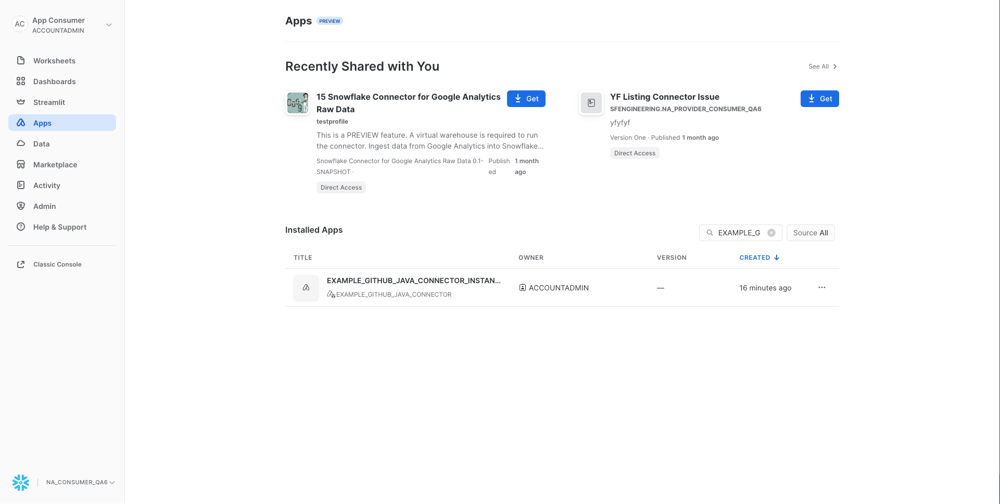
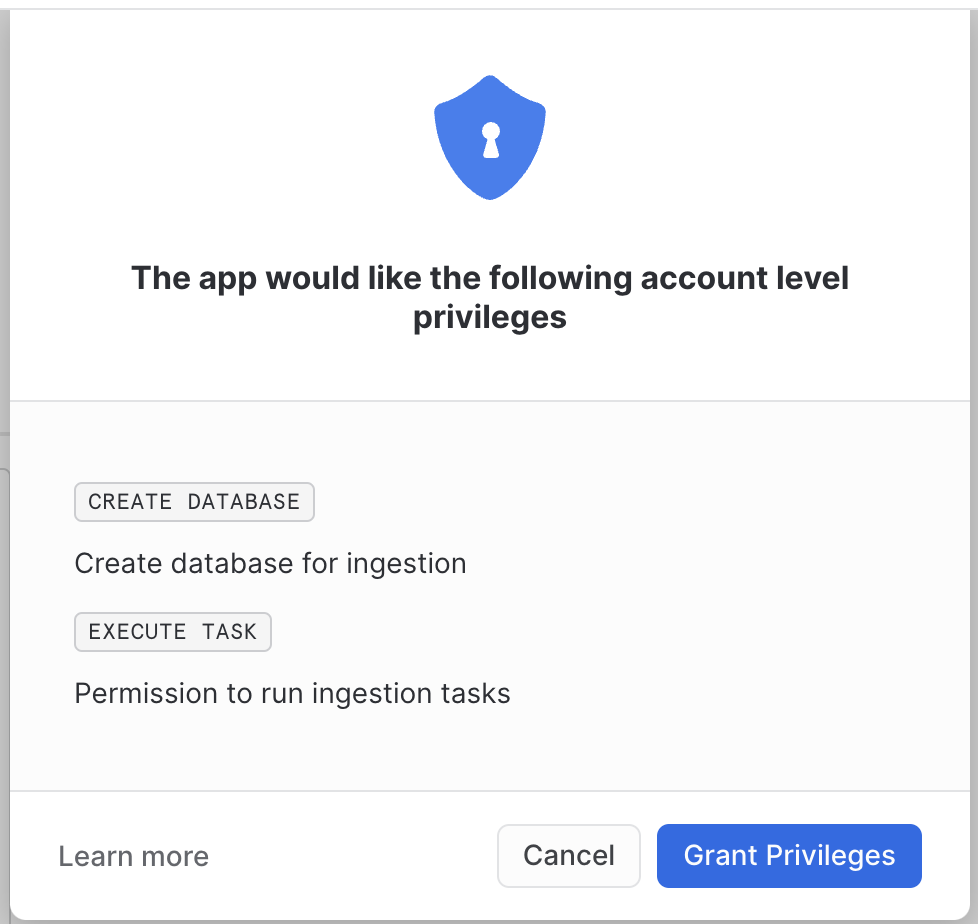
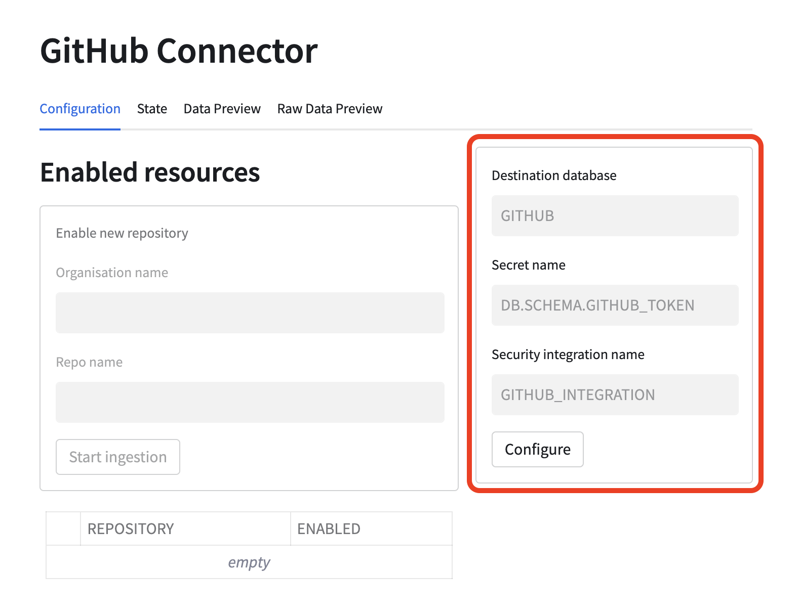
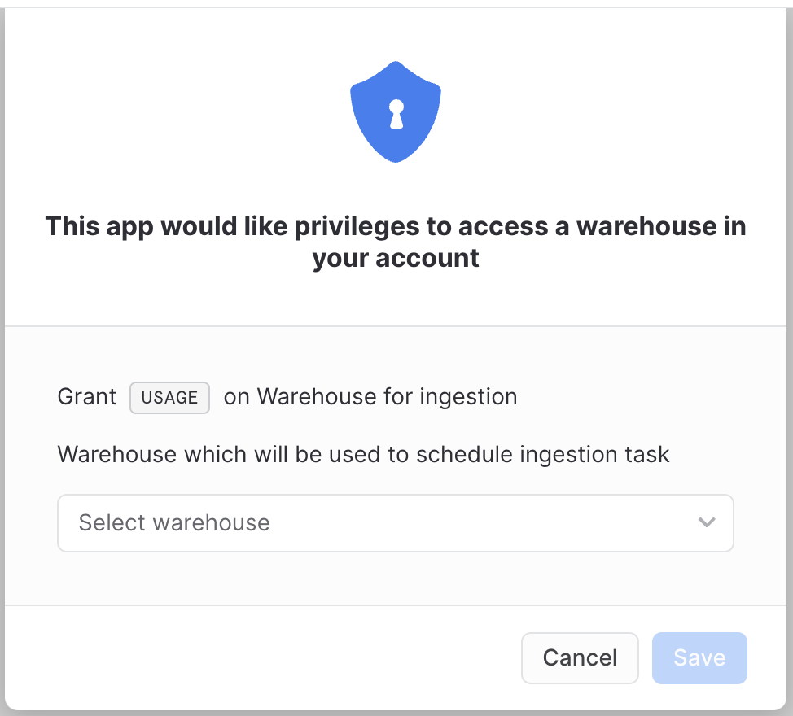
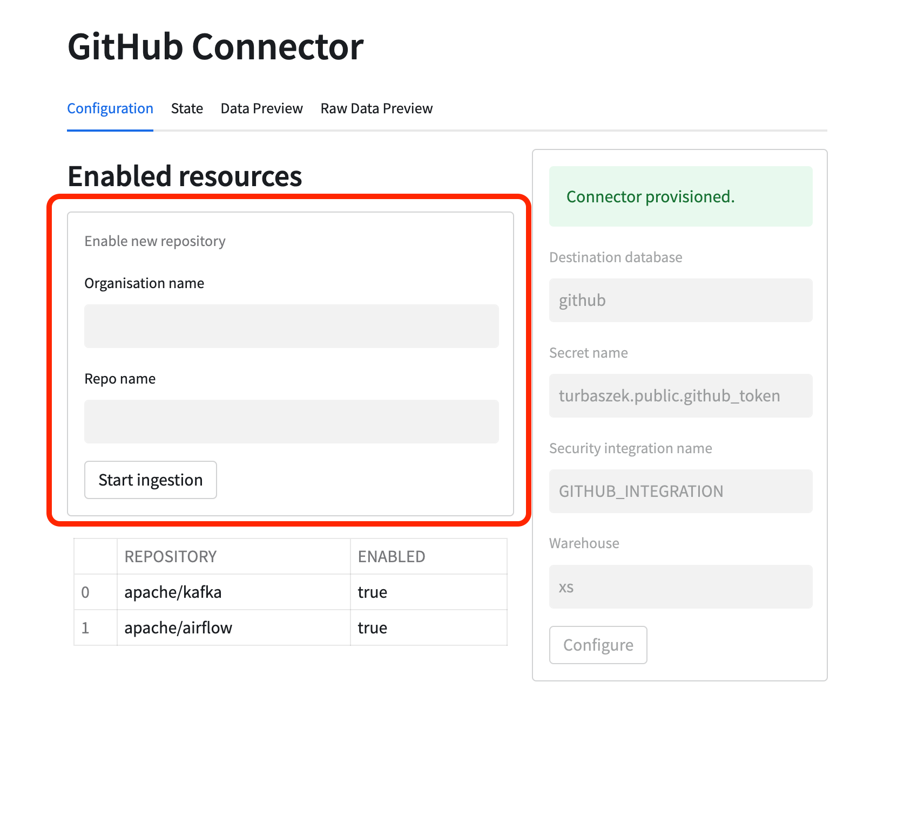
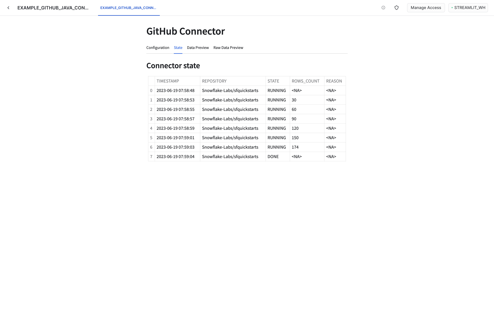
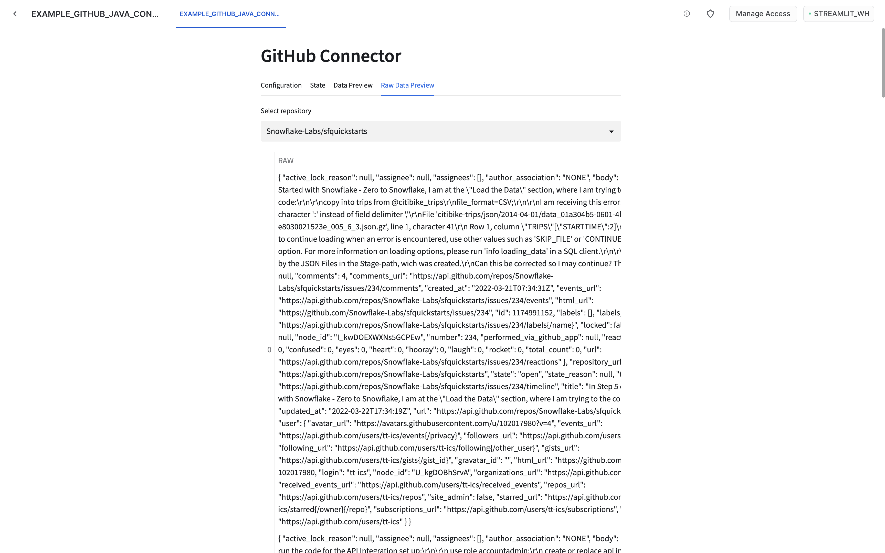

author: Maciej Bukalo
id: connectors_github_java
summary: Overview of building Snowflake native connectors using Java snowpark and Native Apps. Example connector connects to GitHub issues API. 
categories: connectors,solution-examples,partner-integrations
environments: web
status: Published
feedback link: https://github.com/Snowflake-Labs/sfguides/issues
tags: Connectors, Native Apps, External connectivity

# Native Connector - Java (Pull Based)

## Overview
Duration: 1

In this tutorial you will learn how to build native Snowflake connectors. This example uses GitHub issues API as the source
of the data. In the next steps we will cover what constitutes a connector, how to build and deploy it and how to build
an application UI using Streamlit.

## Prerequisites
Duration: 1

- Basic knowledge of [Snowflake Native Apps](https://docs.snowflake.com/en/developer-guide/native-apps/native-apps-about)
- Basic knowledge of Java
- Snowflake user with `accountadmin` role
- GitHub account with [access token](https://docs.github.com/en/authentication/keeping-your-account-and-data-secure/creating-a-personal-access-token)
- macOS or Linux machine to build a project and run deployment scripts

## You will learn
Duration: 1

- How to build a native connector
- How to achieve external connectivity
- How to use secrets

## Prepare your local environment
Duration: 5

- Install Java 11
- Install [snowsql](https://docs.snowflake.com/en/user-guide/snowsql)
- Configure snowsql to allow using [variables](https://docs.snowflake.com/en/user-guide/snowsql-use#enabling-variable-substitution) (`variable_substitution = True`)
- Configure snowsql to [exit on first error](https://docs.snowflake.com/en/user-guide/snowsql-config#exit-on-error) (`exit_on_error = True`)
- Clone the [connectors-native-sdk repository](https://github.com/Snowflake-Labs/connectors-native-sdk) and go to `./examples/example-github-java-connector`

## Connector overview
Duration: 2

The native connector is built using only Snowflake primitives. The business logic is written in Java using
[Snowpark library](https://docs.snowflake.com/en/developer-guide/snowpark/java/index)
and encapsulated in [stored procedures](https://docs.snowflake.com/en/sql-reference/stored-procedures-java).
The procedures constitute the interface of the connector.

To facilitate recurring ingestion of the resources the connector uses [task](https://docs.snowflake.com/en/user-guide/tasks-intro) on configurable schedule.

The connector consists of the following elements:
- schemas
    - `PUBLIC` - versioned, used to store all the public procedures
    - `STATE` - stateful, used for all the stateful objects like tables
    - `TASKS` - stateful, used for the tasks
- tables
    - `STATE.APP_CONFIGURATION` - application configuration (details will be covered in next steps)
    - `STATE.RESOURCE_CONFIGURATION` - resource configuration (details will be covered in next steps)
    - `STATE.APP_STATE` - application state (details will be covered in next steps)
- procedures
    - `PUBLIC.PROVISION_CONNECTOR` - configures the connector
    - `PUBLIC.ENABLE_RESOURCE` - enables a repository for the ingestion
    - `PUBLIC.INGEST_DATA` - used by the tasks running the ingestion

Only selected objects will be visible to customer who installed the app. See: [docs](https://docs.snowflake.com/en/developer-guide/native-apps/creating-setup-script#visibility-of-objects-created-in-the-setup-script-to-consumers).

## Project structure
Duration: 3

Let's take a look at the structure of this connector.
```text
├── Makefile
├── README.md
├── example-github-connector-java-module
│    ├── build.gradle
│    └── src
│        ├── main
│        └── test
├── integration-test
├── java-module
├── manifest.yml
├── scripts
├── setup.sql
├── sf_build.sh
└── streamlit_app.py
```
### Example Java module

The `example-github-connector-java-module/src/main` is a Java program containing all the execution
logic of the connector. This program
is separated into four modules:

- `api` a package that contains definitions of all the user facing procedures
- `application` a package that includes the application constants
- `common` a package that includes reusable elements
- `ingestion` a package that contains the ingestion logic (external connectivity with GitHub)

### Integration tests
Basic example of application workflow containing building, deploying and installing application on test environment.

### Streamlit dashboard

Additionally, the connector has a UI build in Streamlit. The Streamlit dashboard is defined
in `streamlit_app.py` file.
Thanks to it the connector can be configured and monitored using Streamlit in Snowflake.
Additionally, some privileges required by the application can be requested through a pop-up in Streamlit.

### setup.sql script

[Setup script](https://docs.snowflake.com/en/developer-guide/native-apps/creating-setup-script) defines objects which are created and needed inside the application.
This includes procedures, schemas, tables etc.

### manifest.yml file

Manifest file is required by the Native Apps framework. This file specifies properties of an application.
Privileges and references required by the application can be
specified inside the manifest file. For more information check [manifest docs](https://docs.snowflake.com/en/developer-guide/native-apps/creating-manifest) 
and [requesting privileges docs](https://docs.snowflake.com/en/developer-guide/native-apps/requesting-about).

## Connector configuration
Duration: 3

The connector configuration is split into two domains:
- connector level configuration
- resource level configuration

### Configuring connector
Connector level configuration lives in the `STATE.APP_CONFIGURATION` table. This table is meant to keep information
like API integration name used by the connector and secret name used for authentication in GitHub.

The table is a key-value table.

### Ingestion resource configuration
Next to the global configuration the connector also stores a configuration for every enabled resource. In case of this example
a single resource is represented as `org_name/repo_name`.

The table is a key-value table.

## Connector state
Duration: 2

Apart from configuration table, the connector uses `STATE.APP_STATE` table to persist a state of any
ongoing ingestion.

The state table is a key-value table with an additional timestamp column. To improve the performance
the table is an append only table.
This means that creating or updating a value inserts a new row into the table. Reading a key is done
by retrieving the
newest row with the given key.

## External access
Duration: 2

Data from GitHub is ingested using [external access](https://docs.snowflake.com/en/developer-guide/external-network-access/external-network-access-overview) capabilities of Snowflake.

### Direct external access

[Direct external access](https://docs.snowflake.com/en/developer-guide/external-network-access/external-network-access-overview) is a public preview feature of Snowflake.

## Application logs
Duration: 2

Example application logs various operations during runtime. By default, those logs are not stored anywhere. To enable log storing please refer to [enable loging](https://other-docs.snowflake.com/en/native-apps/consumer-enable-logging) documentation.

## Ingestion logic
Duration: 2

When a repository is enabled the following objects are created:
- a sink table for raw data ingested from GitHub API
- a view over sink table that flattens the raw JSON data
- a task responsible for ingestion

The task runs every 30 minutes and every repository has a dedicated task.

The ingestion task calls `INGEST_DATA` procedure which does the following:
1. reads the GitHub Token from secret
2. sends a request to GitHub issues API with authorization headers
3. merges fetched data into sink table
4. checks for a next page link in the response headers
5. if the link is present it repeats the steps from 2 onward
6. if the link is not present the procedure exits

In this approach all the data for a given repository is fetched every time. The data is merged, meaning that
the new records are added, while the changed records are updated in the sink table.

## Build the connector
Duration: 3

As we have learnt in previous sections the project consists of the three main components:
- code module
- manifest.yml
- setup.sql

All of those components have to be uploaded to Snowflake prior to creating the app.

### Overview
Build step for the app consist of:
1. Creating jar artifact
2. Creating a new `sf_build` directory on the local machine
3. Copying of the `jar file` to the `sf_build` folder
4. Copying of the `manifest.yml` to the `sf_build` folder
5. Copying of the `install.sql` to the `sf_build` folder
6. Copying of the `streamlit_app.py` to the `sf_build` folder

The `sf_build` directory serves as the source of truth about the app definition and its content.

### Building
To build the connector execute a convenience script:
```sh
make build
```

Once the `sf_build` folder is created you can follow to the next step where we will deploy the connector.

## Deploy the connector
Duration: 3

In this step we will deploy the connector to a Snowflake account.

### Overview

Deployment step consists of:
1. Creating a database and stage for app artifacts
2. Uploading the `sf_build` contents to the newly created stage
3. Creating an application package using the data from the stage

### Connection and app setup

This quickstart uses some convenience scripts for running necessary commands. Those scripts use [snowsql](https://docs.snowflake.com/en/user-guide/snowsql).
Before proceeding you need to configure snowsql connection to your Snowflake account.

1. Configure snowsql connection according to the [documentation](https://docs.snowflake.com/en/user-guide/snowsql-start#using-named-connections).
2. Export the name of your connection in the terminal `export CONNECTION=<your connection name>`
3. Adjust values for APP_NAME, APP_VERSION, STAGE_DB, STAGE_NAME, WAREHOUSE in the `Makefile` script. Those values
   will be used by all the scripts used in this quickstart.

### Deploy the app
To deploy the connector execute a convenience script:
```sh
make deploy
```

Now an application package should be created on your account, and you can follow to the next step where
you will create a new instance of the connector.

## Installing the connector
Duration: 5

In this step you will install the connector. The installation is encapsulated in a convenience script.

### Creating external access integration and secrets

In order to  access external resources the connector requires 3 objects to be configured:
- [network rule](https://docs.snowflake.com/en/LIMITEDACCESS/creating-using-external-network-access#label-creating-using-external-access-integration-network-rule)
- [secrets](https://docs.snowflake.com/en/sql-reference/sql/create-secret)
- [external access integration](https://docs.snowflake.com/en/LIMITEDACCESS/create-external-access-integration)

The script will run commands like the following ones to bootstrap all necessary objects:

```snowflake
CREATE DATABASE GITHUB_SECRETS;

CREATE OR REPLACE NETWORK RULE GH_RULE
MODE = EGRESS
TYPE = HOST_PORT
VALUE_LIST=('api.github.com:443');

CREATE OR REPLACE SECRET $SECRET_NAME TYPE=GENERIC_STRING SECRET_STRING='< PASTE API TOKEN >';

SET CREATE_INTEGRATION = 'CREATE OR REPLACE EXTERNAL ACCESS INTEGRATION ' || $INTEGRATION_NAME || '
ALLOWED_NETWORK_RULES = (GH_RULE)
ALLOWED_AUTHENTICATION_SECRETS = (''' || $SECRET_NAME || ''')
ENABLED = TRUE';
```

### Granting privileges to the application

The script will grant some of the required privileges to the application. 
The rest of the privileges will be requested later through the Streamlit pop-up.
The application requires the following privileges:
- usage on the external access integration you created in the previous step
- usage on the database and the schema with the secrets
- read on the secret itself

This translates to queries like those:
```snowflake
GRANT USAGE ON INTEGRATION IDENTIFIER($INTEGRATION_NAME) TO APPLICATION IDENTIFIER($APP_INSTANCE_NAME);

GRANT USAGE ON DATABASE IDENTIFIER($SECRETS_DB) TO APPLICATION IDENTIFIER($APP_INSTANCE_NAME);
GRANT USAGE ON SCHEMA IDENTIFIER($SECRETS_SCHEMA)  TO APPLICATION IDENTIFIER($APP_INSTANCE_NAME);
GRANT READ ON SECRET IDENTIFIER($SECRET_NAME) TO APPLICATION IDENTIFIER($APP_INSTANCE_NAME);
```

The following privileges will be granted using pop-ups inside Streamlit:
- `create database` to create destination database
- `execute task` to create and run ingestion tasks
- `usage on warehouse` that will be used by the connector

### Running the installation script

To install the connector using the convenience script run the following:
```shell
export GITHUB_TOKEN=<your secret token>
make install
```

## Configuring the connector
Duration: 5

To start the data ingestion you need to configure the connector. To do this go to the Apps tab inside Snowflake and select your connector.



### Grant privileges
When your connector is loaded by Streamlit a pop-up will be displayed. It will always be displayed at the start of the application,
as long as any of the privileges are missing.



Currently, there is a bug related to granting privileges. After granting privileges we need to refresh the web page in the browser to make them visible.
If we skip that, we will see an error during enabling ingestion, saying that we don't have permission to run tasks.

After granting privileges - refresh the page.

### Configure the connector

First you need to specify what database should be used for storing the ingested data. This database will be created,
it should have a name that is not used by any other database. Furthermore, a secret and integration that should be
used by the connector need to be specified. Use names of the objects you created previously. 
Names of the objects will be visible in the execution log of the convenience scripts run in the previous steps.
By default, created values are the following:
- Secret name: `{APP_NAME}_SECRETS.PUBLIC.GITHUB_TOKEN>`
- Integration name: `GITHUB_INTEGRATION`

Please note that the grey values visible in the form are just tooltips and are not used as the default values.



### Warehouse privilege
After pressing the `Configure` button another pop-up will be displayed. It requires the user to choose a warehouse that will
be used to schedule the ingestion task. Granting this privilege is necessary for the connector to work properly.



After granting privileges - refresh the page.

### Enable data ingestion

Next you can enable a repository for ingestion. You can try `Snowflake-Labs/sfquickstarts`. Put `Snowflake-Labs` as an organization name
and `sfquickstarts` as a repository name in the form marked red in the below picture. Once `Start ingestion` button is pressed
a task will be scheduled and the ingestion will start. Configured repository will be visible in the table below the form.
More than one repository can be configured.



### Monitor the ingestion

Once the ingestion is started you can monitor its state using state and data preview tabs. It might take some time before
any data is visible. If multiple repositories were configured,
the visible data can be changed using the selection box.




