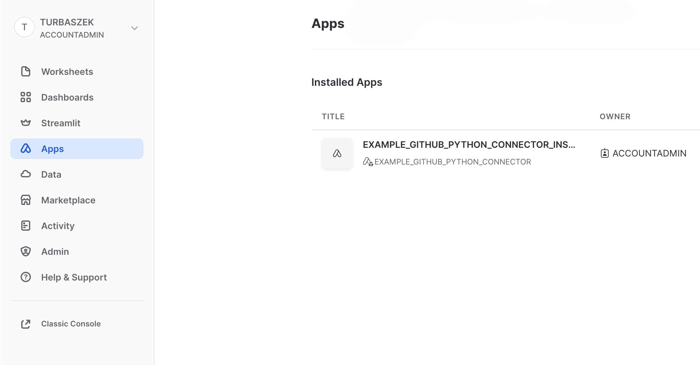
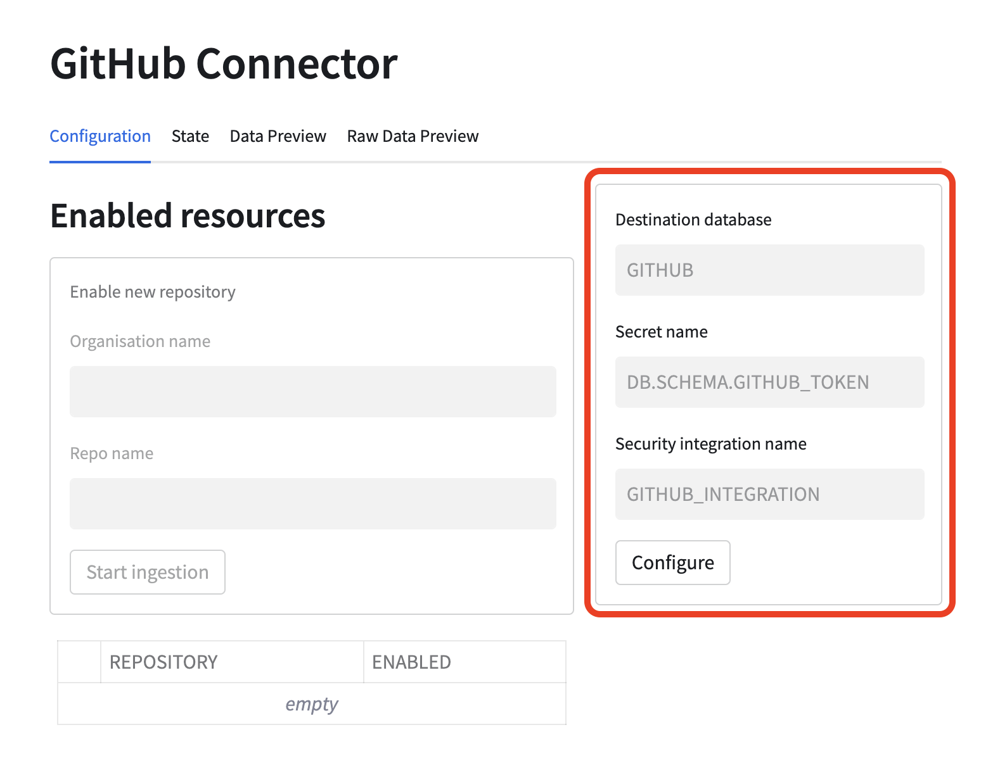
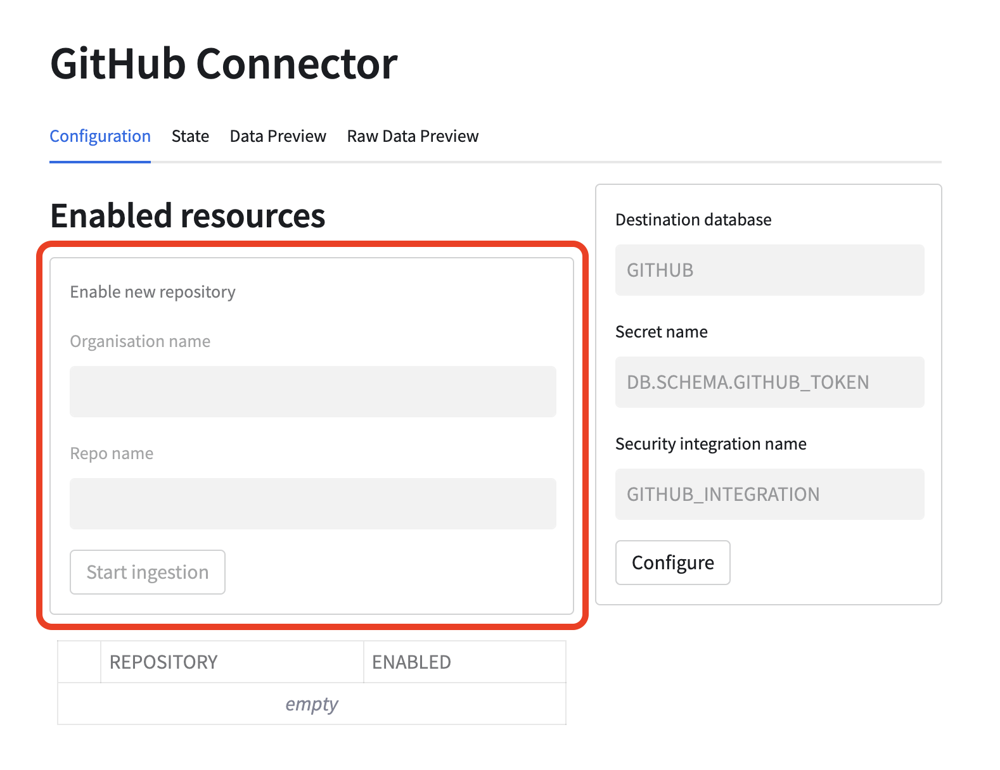
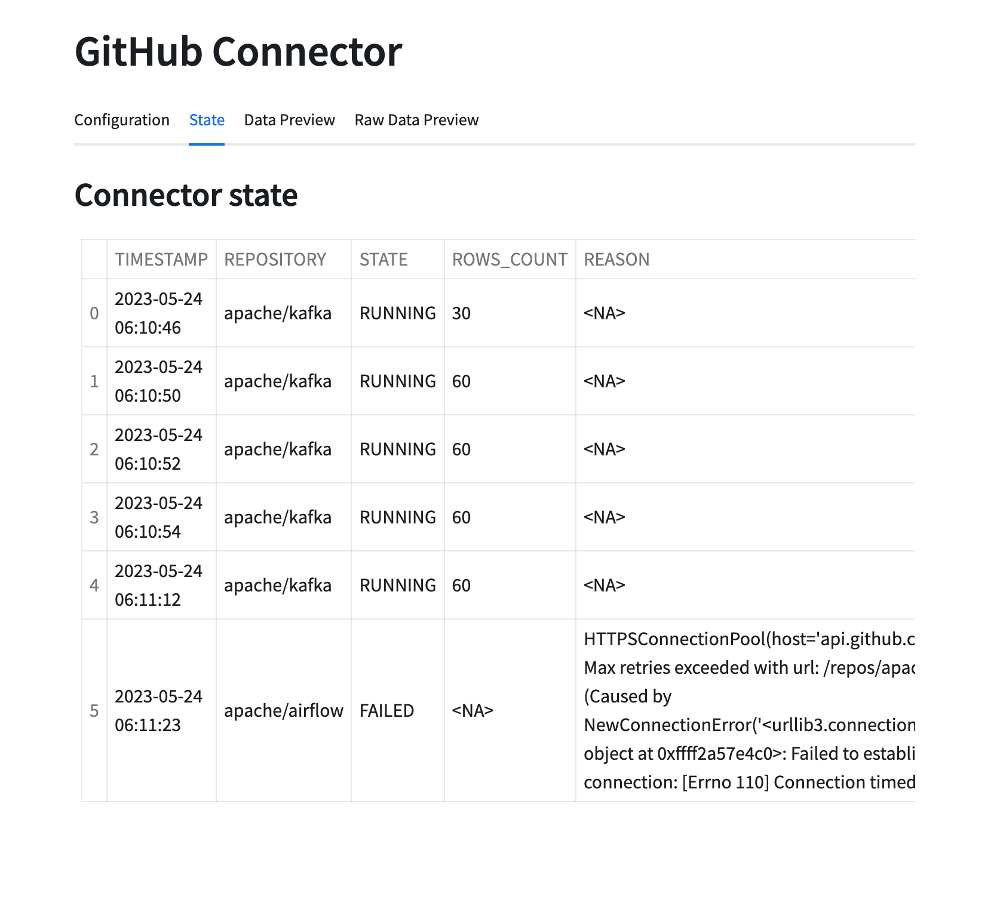
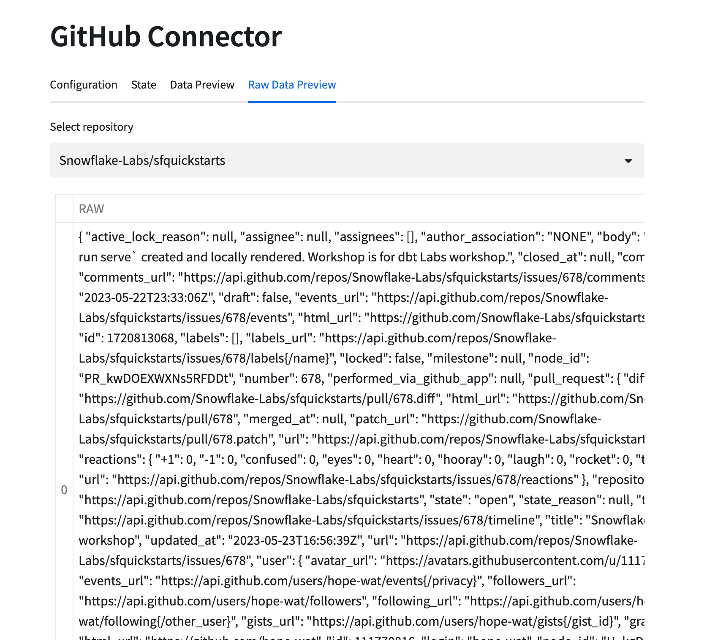

author: Tomasz Urbaszek
id: connectors_github_python
summary: Overview of building Snowflake native connectors using Python snowpark and Native Apps. Example connector connects to GitHub issues API. 
categories: connectors,solution-examples,partner-integrations
environments: web
status: Hidden
feedback link: https://github.com/Snowflake-Labs/sfguides/issues
tags: Connectors, Native Apps, External connectivity

# Native GitHub Connector (Python)

## Overview
Duration: 1

In this tutorial you will learn how to build native Snowflake connectors. This example uses GitHub issues API as the source
of the data. In the next steps we will cover what constitutes a connector, how to build and deploy it and how to build
application UI using Streamlit.

## Prerequisites
Duration: 1

- Basic knowledge of Snowflake Native Apps
- Basic knowledge of Python
- Snowflake user with `accountadmin` role
- GitHub account with [access token](https://docs.github.com/en/authentication/keeping-your-account-and-data-secure/creating-a-personal-access-token)

## You will learn
Duration: 1

- How to build native connector
- How to achieve external connectivity
- How to use secrets

## Prepare your local environment
Duration: 5

- Install Python 3.8
- Install `build` package using `pip install build`
- Install [snowsql](https://docs.snowflake.com/en/user-guide/snowsql)
- Configure snowsql to allow using [variables](https://docs.snowflake.com/en/user-guide/snowsql-use#enabling-variable-substitution) (`variable_substitution = True`)
- Configure snowsql to [exit on first error](https://docs.snowflake.com/en/user-guide/snowsql-config#exit-on-error) (`exit_on_error = True`)
- Clone example-github-python-connector repository

## Connector overview
Duration: 2
The native connector is build using only Snowflake primitives. The business logic is written in Python using
[Snowpark library](https://docs.snowflake.com/en/developer-guide/snowpark/python/index)
and encapsulated in [stored procedures](https://docs.snowflake.com/en/sql-reference/stored-procedures-python).
The procedures constitute the interface to the connector.

To facilitate recurring ingestion of resources the connector uses [task](https://docs.snowflake.com/en/user-guide/tasks-intro) on configurable schedule.

The connector consists of the following elements:
- schemas
    - `PUBLIC` - versioned, used to store all public procedures
    - `STATE` - stateful, used for all stateful objects like tables
    - `TASKS` - stateful, use for tasks
- tables
    - `STATE.APP_CONFIGURATION` - application configuration (details will be covered in next steps)
    - `STATE.RESOURCE_CONFIGURATION` - resource configuration (details will be covered in next steps)
    - `STATE.APP_STATE` - application state (details will be covered in next steps)
- procedures
    - `PUBLIC.PROVISION_CONNECTOR` - configures the connectors
    - `PUBLIC.ENABLE_RESOURCE` - enables a repository for ingestion
    - `PUBLIC.INGEST_DATA` - used by tasks running the ingestion


## Project structure
Duration: 3

Let's take a look at the structure of this connector.

### Python module

The `src/snowflake_github_connector` is a python package containing all the execution logic of the connector. This package
is separated into three modules:
- `procedures` module that contains definitions of all connector procedures
- `ingestion` module that contains the ingestion logic (external connectivity with GitHub)
- `common` that includes reusable elements

### Streamlit dashboard

Additionally, the connector has a UI build in streamlit. The streamlit dashboard is defined in `streamlit_app.py` file.
Thanks to it the connector can be configured and monitored using Streamlit in Snowflake.

### setup.sql script

Is the script defining the application (link to native apps). This script includes definition of all components that
constitutes the connector including procedures, schemas and tables.

### manifest.yml file

Manifest file required by the native apps model.

## Connector configuration
Duration: 3

The connector configuration is split into two domains:
- connector level configuration
- resource level configuration

### Configuring connector
Connector level configuration lives in `STATE.APP_CONFIGURATION` table. This table is meant to keep information
like API integration name used by the connector or secret name used for authentication to GitHub.

The table is a key-value table.

### Ingestion resource configuration
Next to global configuration the connector also stores configuration for every enabled resource. In case of this example
a single resource is represented as `org_name/repo_name`.

The table is a key-value table.

## Connector state
Duration: 2

Apart from configuration table, the connector uses `STATE.APP_STATE` table for persisting state of ongoing ingestions.

The state table is key-value table with additional timestamp column. To improve the perfomance the table is an append only table.
This means that creating or updating a value inserts a new row into the table. Reading a key is done by retrieving the
newest row with given key.

## External access
Duration: 2

Data from Github is ingested using external access capabilities of Snowflake.

### Direct external access

If you are part of direct external access Private Preview you can continue to next step. If not then please
follow additional necessary steps from the next paragraph.

## Ingestion logic
Duration: 2

When a repository is enabled following oject are created:
- sink table for raw data ingested from GitHub API
- a view over sink table that flattens the raw JSON data
- a task responsible for ingestion

The task runs every 30 minutes and every repository has a dedicated task.

The ingestion task calls `INGEST_DATA` procedure which does the following:
1. reads the GitHub Token from secret
2. sends a request to GitHub issues API with authorization headers
3. merges fetched data into sink table
4. checks for next page link in response headers
5. if link is present it repeats steps from 2 onward
6. if link is not present the procedure exits

In this approach all data for given repository is fetched every time. New records are added and updated
records get updated in the sink table.

## Build the connector
Duration: 3

As we've learnt in previous sections the project consists of three components:
- code module
- manifest.yml
- setup.sql

All those components have to be uploaded to Snowflake prior creating the app.

### Overview
Build step for the app consist of:
1. Creating a new `sf_build` directory on local machine
2. Creating wheel artifact (for python we additionally rename `whl` file to `zip`) and putting it in `sf_build` folder
3. Copying of `manifest.yml` to `sf_build` folder
4. Copying of `install.sql` to `sf_build` folder
5. Copying of `streamlit_app.py` to `sf_build` folder

The `sf_build` serves as the source of truth about the app definition and content.

### Building
To build the connector execute a convenience script:
```sh
make build
```

Once `sf_build` folder is created you can follow to the next step where we will deploy the connector.

## Deploy the connector
Duration: 3
In this step we will deploy the connector to a Snowflake account.

### Overview

Deployment step consists of:
1. Creating a database and stage for app artifacts
2. Uploading the `sf_build` content to the newly created stage
3. Creating an application package using the data from the stage

### Connection and app setup

This quickstarts uses some convenience scripts for running necessary commands. Those scripts use snowsql. Before
proceeding further you need to configure snowsql connection to your environment.

1. Configure snowsql connection according to [documentation](https://docs.snowflake.com/en/user-guide/snowsql-start#using-named-connections).
2. Export the name of your connection in terminal `export CONNECTION=<your connection name>`
3. Adjust values for APP_NAME, APP_VERSION, STAGE_DB, STAGE_NAME, WAREHOUSE in `Makefile` script. Those values
   will be used by all scripts used in this quickstart.

### Deploy the app
To deploy the connector execute a convenience script:
```sh
make deploy
```

Now an application package should be created on your account, and you can follow to the next step where
you will create a new instance of the connector.

## Installing the connector
Duration: 5

In this step you will install the connector. The installation is encapsulated in a convenience script.

### Creating external access integration and secrets

In order to  access external resources the connector requires 3 objects to be configured:
- [network rule](https://docs.snowflake.com/en/LIMITEDACCESS/creating-using-external-network-access#label-creating-using-external-access-integration-network-rule)
- [secrets](https://docs.snowflake.com/en/sql-reference/sql/create-secret)
- [external access integration](https://docs.snowflake.com/en/LIMITEDACCESS/create-external-access-integration)

The script will run commands like the following ones to bootstrap all necessary objects:

```snowflake
CREATE DATABASE GITHUB_SECRETS;

CREATE OR REPLACE NETWORK RULE GH_RULE
MODE = EGRESS
TYPE = HOST_PORT
VALUE_LIST=('api.github.com:443');

CREATE OR REPLACE SECRET GITHUB_TOKEN TYPE=GENERIC_STRING SECRET_STRING='< PASTE API TOKEN >';

CREATE OR REPLACE EXTERNAL ACCESS INTEGRATION GITHUB_INTEGRATION
ALLOWED_NETWORK_RULES = (GH_RULE)
ALLOWED_AUTHENTICATION_SECRETS = ('GITHUB_SECRETS.PUBLIC.GITHUB_TOKEN')
ENABLED = TRUE;
```

### Granting privileges to the application

Also the script will grant the application required privileges. The application requires the following privileges:
- usage on external access integration you created in previous step
- usage on database and schema of the secrets
- read on the secret itself
- create database to create destination database
- execute task to create and run ingestion tasks
- usage on warehouse that will be used by the connector

This translates to queries like this one:
```snowflake
GRANT USAGE ON INTEGRATION GITHUB_INTEGRATION TO APPLICATION GITHUB_CONNECTOR;

GRANT USAGE ON DATABASE DB_NAME TO APPLICATION GITHUB_CONNECTOR;
GRANT USAGE ON SCHEMA DB_NAME.PUBLIC TO APPLICATION GITHUB_CONNECTOR;
GRANT READ ON SECRET DB_NAME.PUBLIC.GITHUB_TOKEN TO APPLICATION GITHUB_CONNECTOR;

GRANT CREATE DATABASE ON ACCOUNT TO APPLICATION GITHUB_CONNECTOR;
GRANT EXECUTE TASK ON ACCOUNT TO APPLICATION GITHUB_CONNECTOR;

GRANT USAGE ON WAREHOUSE XS TO APPLICATION GITHUB_CONNECTOR;
```

### Running the installation script

To install the connector using the convenience script run the following:
```shell
export GITHUB_TOKEN=<your secret token>
make install
```

## Configuring the connector
Duration: 3

To start the data ingestion you need to configure the connector. To do this go to Apps tab and select your connector.



### Configure the connector

First you need to specify what database should be use for storing the ingested data and what secret, integration and warehouse
should be use by the connector. Use names of the objects you created previously.



### Enable data ingestion

Next you can enable a repository for ingestion. You can try `Snowflake-Labs/sfquickstarts`. Put `Snowflake-Labs` as organization name
and `sfquickstarts` as repository name in the form marked red on below picture.



### Monitor the ingestion

Once the ingestion is started you can monitor its state using state and data preview tabs.






## Conclusion & next steps
Duration: 0

To be done
