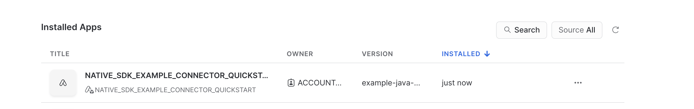
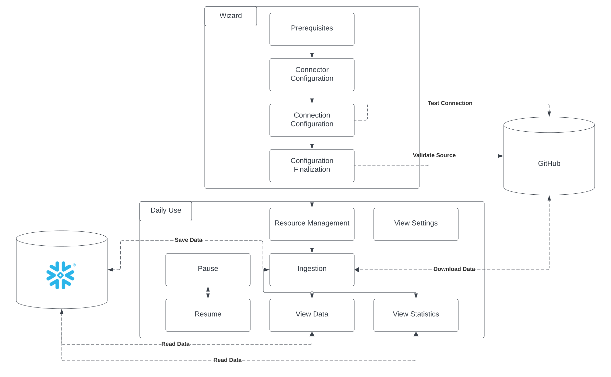
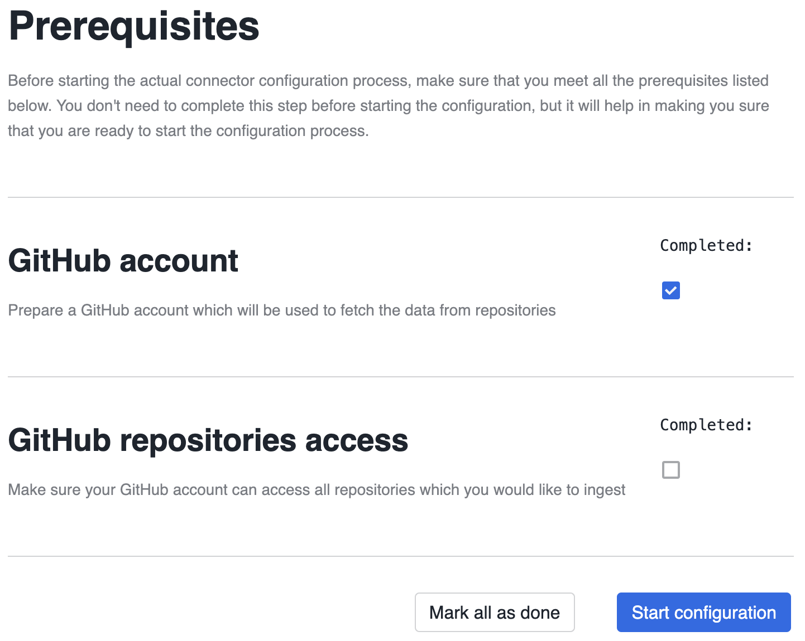
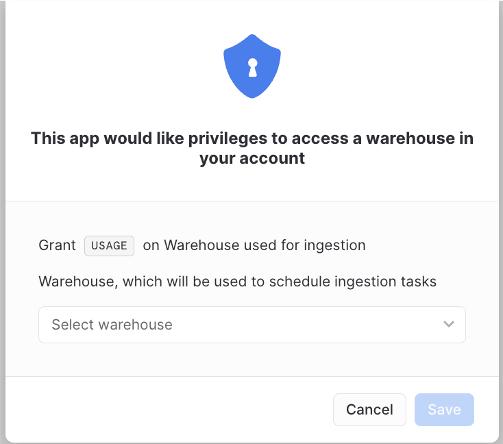
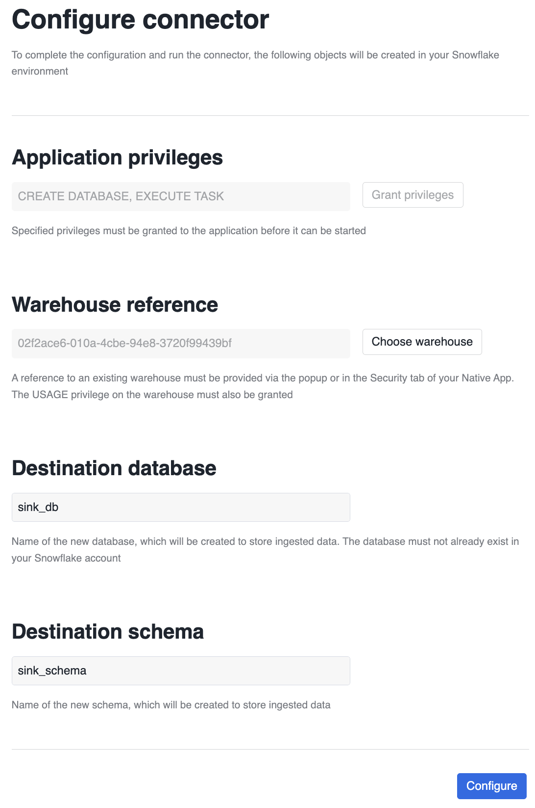

author: Robert Sawicki
id: connectors_native_sdk_java_example
summary: Example usage of the Connectors Native SDK Java to build a connector for GitHub public API. 
This quickstart provides and explanation how it works along with provided example, 
which is Native Application ready to be deployed in Snowflake.
categories: connectors,solution-examples,partner-integrations
environments: web
status: Hidden
feedback link: https://github.com/Snowflake-Labs/sfguides/issues
tags: Connectors, Native Apps, External connectivity, Connectors Native SDK

# Connector Native Java SDK example

## Overview
Duration: 4

### Summary
In this tutorial you will learn how to build and deploy a connector using Native Apps framework in Snowflake and Native Connectors SDK Java. 
Provided example application connects to the GitHub API to pull information about issues, pull requests etc. from the desired repositories.
The following steps will guide you through the whole process starting with the source files 
and finishing with working and configured application inside Snowflake.

### Prerequisites
Before starting this tutorial please be sure that below prerequisites are satisfied:
- Basic knowledge of [Snowflake Native Apps](https://docs.snowflake.com/en/developer-guide/native-apps/native-apps-about)
- Basic knowledge of Java
- Snowflake user with `accountadmin` role
- GitHub account with [access token](https://docs.github.com/en/authentication/keeping-your-account-and-data-secure/creating-a-personal-access-token)
- MacOS or Linux machine to build a project and run deployment scripts
- Basic knowledge on Pull Based Connectors: [Java](https://quickstarts.snowflake.com/guide/connectors_github_java), [Python](https://quickstarts.snowflake.com/guide/connectors_github_python)

### You will learn
- How to build and deploy Native App based on Connectors Native SDK Java
- How to use features provided by Connectors Native SDK Java

## Prepare your local environment
Duration: 3

- Install Java 11
- Install [snowsql](https://docs.snowflake.com/en/user-guide/snowsql)
- Configure `snowsql` to allow using [variables](https://docs.snowflake.com/en/user-guide/snowsql-use#enabling-variable-substitution) (`variable_substitution = True`)
- Configure `snowsql` to [exit on first error](https://docs.snowflake.com/en/user-guide/snowsql-config#exit-on-error) (`exit_on_error = True`)
- 
[//]: # (TODO add link to repo, add path where to go)
- Clone the ... repository, and go to ... directory

## Project structure
Duration: 6

The project contains multiple subdirectories which will be shortly described in the following section.

### Connectors Native SDK Java
This directory contains all the Native SDK Java code along with unit tests for the components. 
Because of the nature of the Native Apps inside Snowflake this means not only Java code, but also sql code, which is necessary to create a working application.
The definitions of the database objects can be found inside `src/main/resources` directory. 
Those files are used while creating an application to customize what objects will be available inside the application. 
For this example purposes we will be using `all.sql` file, which creates objects for all the available features.
General idea how those files are used will be explained in this tutorial, but for the more information it's better to check usage documentation.
For now this code is not available as jar archive that can be used as a dependency in java project and has to be included as source files.

### Example Java GitHub connector
This directory `app/` contains all the files needed to run the Native App. The `streamlit/` directory 
inside contains source files necessary to run the streamlit ui. The `setup.sql` 
file is run during the application installation and is responsible for creating the necessary database objects.
The `manifest.yml` is the manifest of the Native App and is necessary to create application package and then the application itself. 
This file specifies application properties as well as permissions needed by the application.

Other files in the `example-java-github-connector/` directory are gradle related files, the `Makefile` contains build,
deploy and installation convenience scripts, which will be described in the next step of this tutorial.

### Connectors Native SDK Java test
This directory contains source code of a helper library used in unit tests to mock some of the components.
It allows to write unit test more easily. Those files are not used for the deployment and are here just for the development and testing purposes.

### Connectors Native SDK Java integration tests
This directory contains the integration tests of the application using Connectors Native SDK Java. 
Those tests are performing whole process of building and deploying a simple application to Snowflake and then automatically going through the whole setup process.
Because of the nature of those tests they require Snowflake credentials and need some time to finish.

### Example Native SDK app
This application is only used by the integration tests. It does not have streamlit sources and contains no custom code. 
It is just an application built from Connectors Native SDK Java sources exclusively.

## Build and publish locally the sdk code
Duration: 2

As mentioned before the project currently contains Connectors Native SDK Java as source files and is not available in maven repositories. 
For that reason it needs to be built and published to local repository locally. This step might seem unnecessary,
but will show the future experience we are aiming for when the artifacts are available in public maven repositories.
To achieve this go to `connectors-native-sdk-java/` directory and execute the following command:
```shell
./gradlew publishToMavenLocal
```

## Build, deploy and installation
Duration: 10

The `Makefile` in the `example-java-github-connector/` directory contains convenience scripts to build, deploy and install the connector. 
Those scripts execute specific gradle tasks, execute some shell scripts and run sql commands in Snowflake. 
They require a `snowsql` connection to be defined on the local machine. 
The name of the connection should be provided in the `CONNECTION` environmental variable at the top of the `Makefile`.
Reminder: Connection needs to use `accountadmin` role.

To perform all the needed scripts, one of the 2 commands below will be enough, 
however the following sections will go deeper to explain the whole process and what is happening under the hood.

```shell
make complex_create_app_instance_from_app_version
```

```shell
make complex_create_app_instance_from_version_dir
```

### Build
Building a Native App is a little bit different from building a usual Java application. 
There are some things that must be done except just building the jar archives from the sources.
Building the application contains the following steps:
- copying sdk components to the target directory
- copying custom internal components to the target directory

#### Copying sdk components
This step consists of 2 things. First of all it copies the Connectors Native SDK Java artifact to the target directory, by default - `sf_build`. 
Secondly, it extracts the bundled sql files from the jar archive to the target directory. 
Using those sql files allows user to customize which provided objects will be created during the application installation.
For the first time users customization is not recommended, because omitting objects may cause some features to fail if done incorrectly.
The provided example application uses `all.sql` file, which creates all the provided objects. 
For more information about the features and which sql files are needed please check the documentation.
To execute this step independently of the whole process execute the following command:
```shell
make copy_sdk_components
```

This step can be executed to get familiarized with the provided sql files, 
however because Connectors Native SDK Java is currently provided as source code, 
this can be done by going through the source files in the `connectors-native-sdk-java/main/resources/` directory.

#### Copying internal components
This step builds and copies the artifacts from the custom-built code along with all the streamlit files, manifest, and setup files to the target directory. 
This step can be run independently of other steps by running:
```shell
make copy_internal_components
```

### Deployment
To deploy a Native App an application package needs to be created inside Snowflake. 
Then all the files from the target build directory (`sf_build`) need to be copied there. 
Then based on those files a version of the Native App can be created.

Note: Creating version is optional, because development mode allows for creating an application from the stage files directly.

#### Preparing application package
The first part of the deployment is creation of the application package if it does not exist yet. 
Then schema and stage are created inside. Performing this step by itself does not upload any files yet, 
but is a good opportunity to check whether the connection to Snowflake was configured correctly.

```shell
make prepare_app_package
```

#### Deploying files
This step copies all the files and subdirectories recursively from the `sf_build` directory to the stage created in the previous step.
The tree structure of the directory is kept and prefixed with the version of the application that is specified in the `Makefile`.
This process might take a moment especially for bigger apps with a lot of custom code and big artifacts, that need to be uploaded.

```shell
make deploy_connector
```

#### Creating version
This step is optional, but depending on whether it was executed or not, different commands must be executed during the installation.
The result of the following command is creation of the version inside the application package.
During the development, when deploy and installation happen more often, 
it is simply faster to skip creating version and then create application instance using the files directly.

```shell
make create_new_version
```

### Installation
Installation of the application is the last step of the process. 
It creates an application from the application package created previously.
If the version was not created then the following command must be used:
```shell
make create_app_instance_from_version_dir
```

If the version was created then another command is available, however both of those commands should work:
```shell
make create_app_instance_from_app_version
````

#### After the installation
After application is installed successfully it should be visible in the Apps tab inside Snowflake.



## Connector flow
Duration: 5

Before we dig into configuring the connector and ingesting the data let's have a quick look at how the connector actually works.
Below you can see all the steps that will be completed in the following parts of this quickstart.



## Wizard
Duration: 15
 
After entering the application the Wizard streamlit page will be opened. 
The connector needs some information provided by the user before it can start ingesting data. 
The Wizard will guide you through all the required steps in the application itself, 
but also on the whole Snowflake account and sometimes even the external system that will be the source of the ingested data, in this case GitHub.
After all those steps are finished the connector will be ready to start ingesting the data.

### Prerequisites
The first step of the Wizard is Prerequisites step. This step will provide you a list of things that must be configured outside the Native App.
Completing the prerequisites is not required, 
but it is recommended to ensure smoother configuration process later.
In the case of the example GitHub connector there are 3 things that need to be taken care of before going further:
- preparing a GitHub account
- creating a personal access token for that GitHub account
- configuring external access integration inside Snowflake

For the GitHub related prerequisites please check the [documentation](https://docs.github.com/en/authentication/keeping-your-account-and-data-secure/creating-a-personal-access-token).



#### External Access
Setting up external connectivity objects inside Snowflake requires the GitHub prerequisites to be completed. 
External connectivity objects have to be created on the account level by the `accountadmin`.

In order to access external resources the connector requires 3 objects to be configured:
- [network rule](https://docs.snowflake.com/en/developer-guide/external-network-access/creating-using-external-network-access#creating-a-network-rule-to-represent-the-external-network-location)
- [secrets](https://docs.snowflake.com/en/sql-reference/sql/create-secret)
- [external access integration](https://docs.snowflake.com/en/developer-guide/external-network-access/creating-using-external-network-access)

The following commands create necessary objects. Names can be customized and will be needed during connector wizard phase later.

```snowflake
CREATE DATABASE GITHUB_SECRETS;

CREATE OR REPLACE NETWORK RULE GH_RULE
MODE = EGRESS
TYPE = HOST_PORT
VALUE_LIST=('api.github.com:443');

CREATE OR REPLACE SECRET GITHUB_TOKEN TYPE=GENERIC_STRING SECRET_STRING='< PASTE API TOKEN >';

CREATE OR REPLACE EXTERNAL ACCESS INTEGRATION GITHUB_INTEGRATION
ALLOWED_NETWORK_RULES = (GH_RULE)
ALLOWED_AUTHENTICATION_SECRETS = ('GITHUB_SECRETS.PUBLIC.GITHUB_TOKEN')
ENABLED = TRUE;
```

#### Granting privileges to the application

The application needs to have usage the following privileges on the created objects:
- usage on the external access integration
- usage on the database and the schema with the secrets
- read on the secret itself
To know the application instance name please check the `Makefile` or logs from the installation process.

This translates to queries like those:
```snowflake
GRANT USAGE ON INTEGRATION GITHUB_INTEGRATION TO APPLICATION < application name >;

GRANT USAGE ON DATABASE GITHUB_SECRETS TO APPLICATION < application name >;
GRANT USAGE ON SCHEMA GITHUB_SECRETS.PUBLIC TO APPLICATION < application name >;
GRANT READ ON SECRET GITHUB_SECRETS.PUBLIC.GITHUB_TOKEN TO APPLICATION < application name >;
```

### Connector Configuration
Next step of the Wizard is connector configuration. 
This step allows user to grant to application privileges that can be requested through the permissions sdk, 
choose warehouse which will be referenced in the queries that require it,
and choose destination database and schema for the data that will be ingested.

#### Permissions
Application requires 2 account level permissions to operate: `CREATE DATABASE` and `EXECUTE TASK`. 
The first one is needed to create a destination database for the ingested data. 
This database should be created outside the application package, so that the ingested data can be left intact after application is uninstalled.
Although, this example does not support this feature.
The second one is needed to schedule periodic tasks that will fetch the data from GitHub and save it.

Granting those privileges can be done using the security tab or by pressing the `Grant privileges` button in the connector configuration screen.
The latter one will result in a popup appearing on the screen.


#### Warehouse reference
Connector requires a warehouse to run and schedule tasks.
Application will use a warehouse through a reference.
It can be created using the security tab the same as the privileges above or by pressing the `Choose warehouse` button. 
This will result in another popup.



#### Database and schema
As mentioned before connector requires a database to store ingested data. This database will be created with the schema specified by the user.
Name of the database is up to the user as long as it is unique inside the account.

The completed connector configuration screen will look similar to this one:


### Connection Configuration
Next step of the Wizard is connection configuration. 
This step allows user to provide names of the external access integration and secret that were created during the Prerequisites step of the Wizard.
Once the names of the objects are provided in the designated fields, 
pressing a confirmation button will trigger TEST_CONNECTION procedure inside the connector.
This procedure will try to access a public repository in GitHub to check if the external connectivity was configured correctly.
When it succeeds application will proceed into finalization step.

[//]: # (todo add screenshot)

### Configuration Finalization
Finalization is the last step of the Wizard. In this step you will be asked to provide organisation and repository name. 
This repository should be some repository that was configured to be accessible using the provided GitHub API token.
For now, it will be used only for connection validation purposes. 
This is a bit different from the previous step, because test connection procedure only check if the external access is configured properly. 
This step ensures that repository provided by user is accessible with the provided GitHub API token. 
It will fail if the token does not have required permissions to access the repository, for example if the repository is private.

Additionally, during this step the database and schema specified in connector configuration phase will be created.

[//]: # (todo add screenshot)

## Daily Use
Duration: 15

After Wizard is completed successfully it is possible to start the regular use of the connector. 
This part will explain:
- how to configure resources to ingest the data
- how the ingestion process works
- how to view statistics of the ingested records
- how to view ingested data
- how to pause and resume connector

### Configuring resources
To configure resources got to the `Data Sync` tab. 
Usually there should be the list of the already configured resources, but right now it should be empty.
To configure resource press the `Add resource` button, this should display a popup (or not).
Input the organisation name and repository name of the GitHub repository you wish to get the data from in the designated fields.
For example:

By default, newly added resource is disabled (or not). It has to be enabled manually. 
Each resource can be enabled and disabled individually, but all of them will follow a global schedule for processing.

[//]: # (todo update when the ui is done)

### Ingestion process
Ingestion is managed by a scheduler task which adds the resources to the dispatcher queue according to the global schedule.
Items from that queue are then spread among the workers that perform actual ingestion. 
This connector fetches all the data on every run, saves completely new records and updates old records.
The ingested data contains issues, pull requests and commits from the specified repository.

### Viewing statistics
The daily use screen contains a chart with the information about recent ingestion. The data is based on the internal connector view called `AGGREGATED_CONNECTOR_STUTS`. 
The view itself aggregates the data by hour, but it can be always aggregated by wider timeframes.

### Viewing ingested data
The ingested data is not visible in the streamlit ui. 
To view the data you have to go to the worksheets inside Snowflake and just query the database that was configured as the sink during the connector configuration step.
The structure of tables is as follows:

[//]: # (todo after ingestion is implemented)

### Pausing and resuming
The connector can be paused and resumed, whenever desired. To do so just click the `pause` button in the daily use screen. 
When pausing is triggered the underlying scheduling and work execution mechanism is disabled. 
It won't happen instantaneously, because currently processing tasks must finish. 
However, nothing new will be triggered during this transition period.

To resume the connector you just have to press `resume` button that will be displayed in place of the `pause` button. 
This will resume the scheduling process which will start triggering new workloads.

## Customization
Duration: 2

Connectors Native SDK Java provides components to build a fully customizable application. 
Currently, it is possible to customize the behavior of the application in 2 ways:
- overwriting internal sql procedures
- using builders to overwrite whole `Handlers` with custom implementations of the underlying interfaces

For more information on those approaches please check the documentation.

## Cleanup
Duration: 2

After the tutorial is completed you can either pause the connector as explained in the Daily Use section 
or completely remove it using the convenience script
```shell
make drop_application
```
If this part is skipped then even the example connector will generate cost.

## Integration tests
Duration: 2

Connectors Native SDK Java module comes with integration tests bundled. 
Those tests build the SDK module and deploy it using mocked empty application from the `example-native-sdk-app/` directory.
The test cases are taking significant time to complete and can be quite costly,
because of that they mostly cover only happy paths.
To run those test go into `connectors-native-sdk-integration-tests/` directory. 
In the `Makefile` specify a path to a file with Snowflake credentials, this path should be in the `SNOWSQL_CONFIG_FILE` environmental variable at the top.
This file should follow snowsql format and the connection will be used to perform the tests.
When the connection files is provided run:
```shell
make test
```
