author: J.J. Mason-Anselmi
id: cordial-bidirectional-data-share
categories: snowflake-site:taxonomy/solution-center/certification/quickstart, snowflake-site:taxonomy/solution-center/certification/partner-solution, snowflake-site:taxonomy/solution-center/includes/architecture, snowflake-site:taxonomy/product/platform, snowflake-site:taxonomy/product/data-engineering, snowflake-site:taxonomy/snowflake-feature/transformation, snowflake-site:taxonomy/snowflake-feature/external-collaboration
language: en
summary: Enable secure bidirectional data sharing between Cordial and Snowflake for unified marketing activation.
environments: web
status: Published
feedback link: https://github.com/Snowflake-Labs/sfguides/issues


# Create a Bidirectional Data Share with Cordial
<!-- ------------------------ -->
## Overview

Easy access to real-time customer data is crucial in marketers’ efforts to send messages that resonate. Marketers  also need to leverage that data to understand customer behavior and shape strategy. The bidirectional data integration between Cordial and Snowflake unlocks this potential.

Using Cordial, data-driven marketing teams create personalized email, SMS, mobile, and website experiences for enterprise audiences, loading dynamic content tailored to message and site behavior, product affinity, seasonal deals, and more. With its industry leading data storage, Snowflake naturally complements what marketers can do with Cordial’s marketing platform.

In this Quickstart, Cordial and Snowflake walk you through how to set up a bidirectional data share between platforms so you can leverage your Snowflake customer data in Cordial and vice versa.

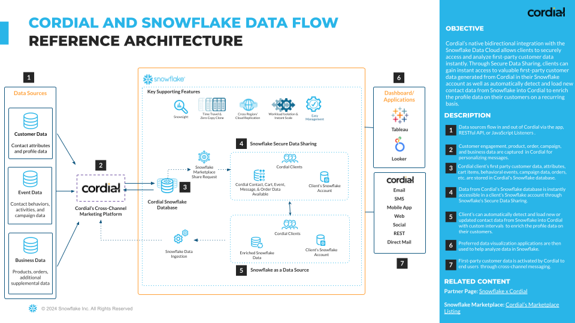

### Prerequisites
- A [Snowflake account](https://signup.snowflake.com/?utm_source=snowflake-devrel&utm_medium=developer-guides&utm_cta=developer-guides)
- A [Cordial account](https://cordial.com/)

### What You’ll Learn

This Quickstart is for data-driven marketers who want to unlock message personalization and segmentation possibilities at scale. You’ll set up a Secure Data Share to easily access Cordial data within Snowflake—and then enable Snowflake as a source to import data into Cordial.

At the end of this Quickstart, you will successfully:

- Set up a Secure Data Share between Cordial and Snowflake
- Understand what data is unlocked by integrating Cordial and Snowflake
- Send queries from Cordial to Snowflake
- Send data from Snowflake to Cordial for use in marketing campaigns

<!-- ------------------------ -->
## Request a Secure Data Share

Snowflake’s Secure Data Share provides Cordial with immediate access to ready-to-query data. To get started, you need to request a Secure Share.

1. Visit [Cordial's listing](https://app.snowflake.com/marketplace/listing/GZSTZ1D9SIF/cordial-messaging-data-personalized-user-profiles-events) in the Snowflake Marketplace to submit a request for the data share and reach out to your Cordial client success manager to let them know that you’ve requested it.

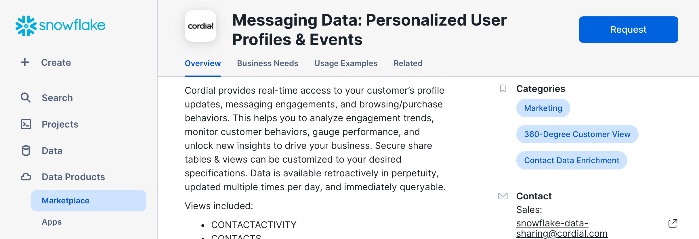

2. Click the **Request** button and fill in the form.

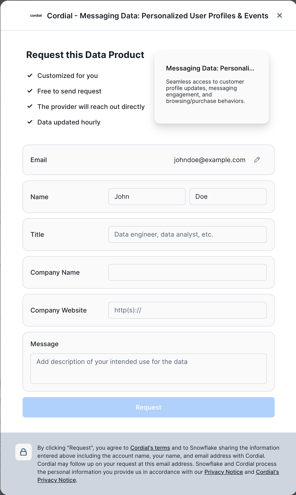

<!-- ------------------------ -->
## Accept the Secure Data Share

Once you've requested the Secure Share, Cordial will verify and provision the data share from Cordial's Snowflake account to your Snowflake account. After the share is provisioned, Cordial will notify you that your data share has been provisioned—and you'll need to follow the steps below to accept the Secure Share.

1. Your account administrator will need to log in to your Snowflake account. To view the status or your data share request, click **My requests** in the **Marketplace** and select the Cordial listing. Alternatively, you can navigate directly to [Cordial's listing](https://app.snowflake.com/marketplace/listing/GZSTZ1D9SIF/cordial-messaging-data-personalized-user-profiles-events) in the Snowflake Marketplace.

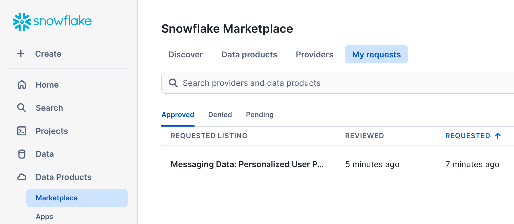

2. Once your request has been approved, click the **Get** button to begin setting up your share.

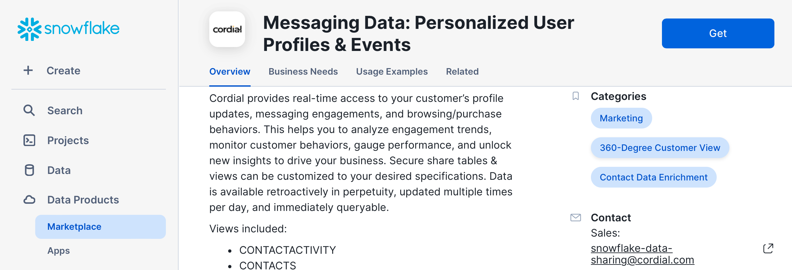

3. Your account administrator can then give the Secure Share a **Database name** and select who can access the data.

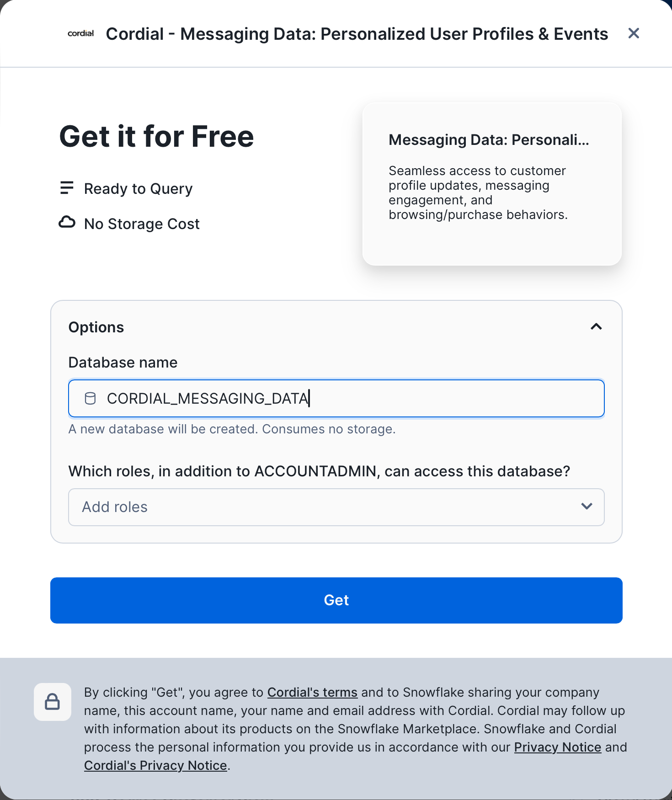

4. With access approved, you can go to the **Worksheets** tab in the top navigation bar in your Snowflake instance and see the new Cordial shared database and shared dataset.

<!-- ------------------------ -->
## Query the Secure Data Share

Once you accept the Cordial data share and assign it to a new database in your Snowflake account, you can start querying the data share. Here are the datasets available to query.

### Available datasets

The following datasets are available from Cordial through a Secure Data Share. Data is refreshed multiple times per day, giving you direct access to customer data in near real-time.

| View | Description |
|------|-------------|
| `contacts` | Data specific to each contact such as name, address, etc. You can store string type (i.e. first name), number type (i.e. age), geo type (i.e. addresses), and array type (i.e. favorite colors). You can add as many attributes as needed to describe your contacts. Cart items are also stored with each contact and can contain information about a product such as SKU, description image, and much more. |
| `contactactivity` (`events`) | Data related to a contact's activity or behavior. This can be message activity as well as website activity (browsed a page, added to cart), or external (IoT) activity. |
| `messagesends` | Data specific to message sends, such as the channel used to send the message, whether the message is promotional or transactional, information about how and when the message was created, and more. |
| `orders` | Data about a contact's order history. |

### Example queries

The Snowflake Secure Data Share allows you to build powerful queries to get the exact data you want. Here are two examples.

#### **<code>CONTACTS</code>**

Here's an example query that uses <code>CONTACTS</code> to find **(1)** the grand total dollar amount of all cart items across all carts, **(2)** the average dollar amount of all cart items per cart, **(3)** the average number of items per cart, and finally **(4)** the total number of carts.

```sql
SELECT
 SUM(TRY_TO_NUMBER(cart:"totalAmount"::varchar)) as "grand_total_amount",
 AVG(TRY_TO_NUMBER(cart:"totalAmount"::varchar)) as "average_total_amount",
 AVG(ARRAY_SIZE(cart:"cartitems")) as "average_num_cart_items",
 count(*) as "total_carts"
FROM
 contacts
WHERE
 cart IS NOT NULL
;
```

| `grand_total_amount` | `average_total_amount` | `average_num_cart_items` | `total_carts` |
|---------------------|----------------------|-------------------------|---------------|
| 41479622 | 1595370.077 | 13.961538 | 26 |

#### **<code>CONTACTACTIVITY</code>**

Here's an example query that demonstrates selecting data from <code>CONTACTACTIVITY</code>. The query returns total daily counts for several events (aka actions) related to sending messages for a specified date range (message sends, opens, clicks, and bounces). This query makes use of some advanced SQL features such as Common Table Expressions and the <code>PIVOT</code> function, demonstrating Snowflake’s rich SQL support.

```sql
WITH action_totals AS (
  SELECT
    to_date(action_date) as action_date,
    action,
    count(*) as total
  FROM
    contactactivity
  WHERE
    action_date BETWEEN '2022-09-19' AND '2022-09-25'
    AND action IN ('message-sent', 'open', 'click', 'bounce')
GROUP BY
  action_date,
  action
)
SELECT
 *
FROM
 action_totals
PIVOT (
 SUM(total) FOR action IN ('message-sent', 'open', 'click', 'bounce')
) as p
ORDER BY
  action_date
```

| `action_date` | `message-sent` | `open` | `click` | `bounce` |
|---------------|----------------|--------|--------|----------|
| 2022-09-19 | 2749273 | 1080279 | 3015 | 2829 |
| 2022-09-20 | 2605236 | 1796475 | 7139 | 6229 |
| 2022-09-21 | 2738569 | 1884556 | 4742 | 2145 |
| 2022-09-22 | 3073 | 929171 | 1485 | 6047 |
| 2022-09-23 | 2810032 | 812085 | 2628 | 466 |
| 2022-09-24 | 2041732 | 1600629 | 4839 | 2258 |
| 2022-09-25 | 928 | 87 | 1 | 1 |

<!-- ------------------------ -->
## Send Data from Snowflake to Cordial

Cordial provides an array of opportunities to leverage your Snowflake customer data to send messages that resonate. When Snowflake is enabled as a data source in Cordial, Cordial automatically queries one or multiple Tables and/or Views in your Snowflake warehouse on a customizable interval.

The Cordial platform automatically detects _and updates_ any new or updated customer records. This keeps your customer data in sync with Snowflake cloud data for real-time segmentation and message personalization.

### Create a Table or View in Snowflake

In your Snowflake account, [create a Table or View to store the customer data](https://docs.snowflake.com/en/sql-reference/sql/create-table.html) you want to utilize in your Cordial account. Here are some important settings to keep in mind when creating your Table in Snowflake:

- At minimum, you must have read-only access to the Table in Snowflake and access to the specific Table or View that will send data to Cordial.
- Cordial is unable to ingest binary Table columns.
- Set a specific maximum length in your Table/View for <code>VARCHAR</code> columns. Column size limit is 8kb or <code>VARCHAR(8192)</code>.
- Your Table/View must be set to convert nanoseconds (default in Snowflake) into microseconds (default in Cordial) in order to successfully transfer date attributes.

#### Geo attributes

Geo attributes should be represented as separate columns. For example, the geo attribute <code>homeaddress</code> would be broken up into columns such as:

- <code>homeaddress.street_address</code>
- <code>homeaddress.city</code>
- <code>homeaddress.state</code>
- <code>homeaddress.postal_code</code>

#### Array attributes

Array attributes will be updated as a whole unless additional syntax is included to add or remove an item from an array, as follows:

- Remove from array: <code>{ "remove": \["apple"\] }</code>
- Add to array: <code>{ "add": \["apple"\] }</code>

**Note:** Your Table/View must be set to convert nanoseconds (default in Snowflake) into microseconds (default in Cordial) in order to successfully transfer date attributes.

<!-- ------------------------ -->
## Enable Snowflake as a Data Source in Cordial

You can enable Snowflake as a data source in Cordial’s UI.

1. Log in to Cordial, navigate to **Integrations > Partners**, and select **Enable** on the Snowflake card.

2. Fill in the required information:

- Snowflake account identifier (format should be \[organization\]-\[identifier\])
- Warehouse name
- Username
- Authentication method: Password or Saved key
- Role name
- Database name
- Schema name
- Table or View name

**Note:** Connection parameters are case-sensitive and should match the exact case of the named objects—warehouse, user, role, database, Table/View, or schema—in Snowflake.

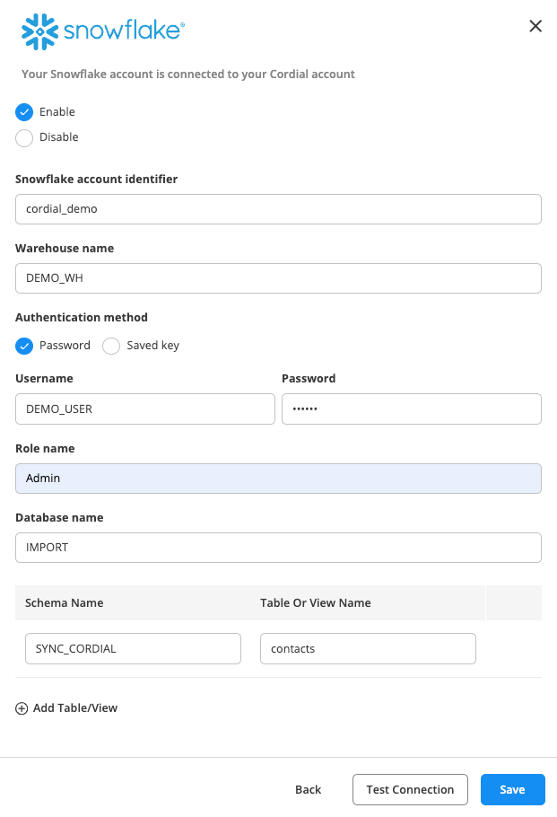

3. To add a Table/View, click **Add Table/View**.

4. Click **Test Connection**.

5. If it's successful, select **Continue**.

### Saved key authentication

Select this method if you want to use [key-pair authentication in Snowflake](https://docs.snowflake.com/en/user-guide/key-pair-auth).

1. You first need to create a secret (aka saved key) in Cordial by navigating to **Settings > Account Settings > Secrets Vault > New**.

2. Your new secret will include a **Public key (PEM format)**.\
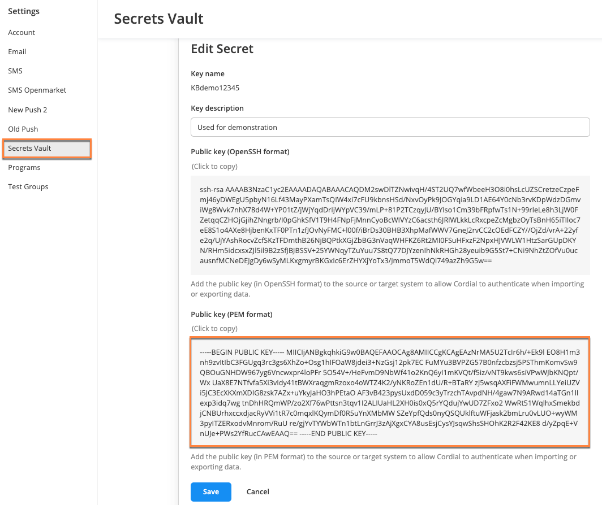

3. Update the user in Snowflake by pasting in the Public key (PEM format) of your created secret.

**Note:** Don't include the <code>-----BEGIN PUBLIC KEY-----</code> and <code>-----END PUBLIC KEY-----</code> that appear with your PEM key. Snowflake requires these markers to be removed in their environment.

4. In the export job from Cordial, select **Saved Key** as the authentication method and choose your Cordial secret under **Saved key**.

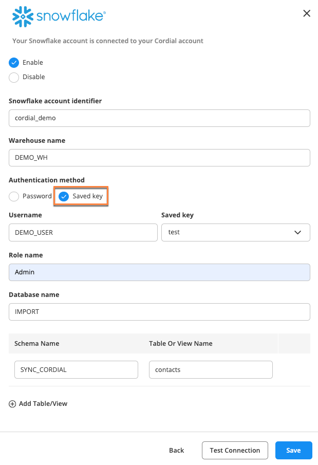

## Create Data Jobs in Cordial with Snowflake as a Data Source

In Cordial, you can use Data Jobs to:

- Import contacts or supplements.
- Export contacts, events, orders, or supplements.
- Sync your contacts with Facebook and Google Ads.
- Create a Transformation: custom, scripted export, or scripted import.

These steps unlock Cordial’s powerful automated messaging capabilities.

### Create new Data Job in Cordial

1. Once you've successfully enabled Snowflake to send data to Cordial, navigate to **Data Jobs > Create New Data Job**, select the appropriate Data Job, and fill in the required fields.

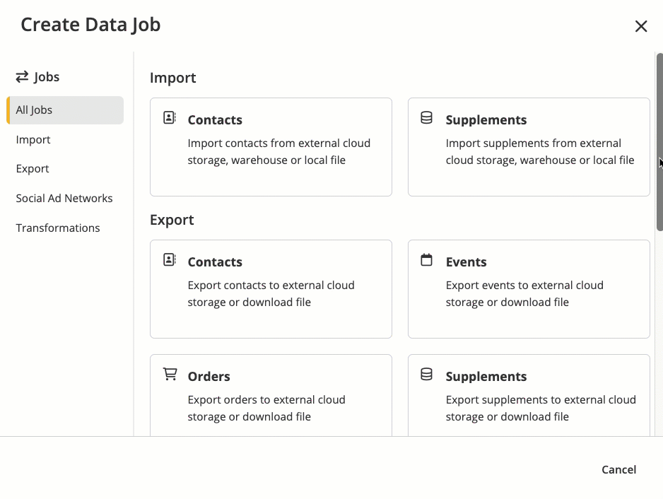

2. In your Data Job, select **Edit** in the **Data Source** pane.

3. Choose **External** under **Data Source**.

4. Choose **Snowflake** under **Data location**.

5. Choose the appropriate **Snowflake connection** and **Snowflake Table/Views**.

**Note:** Cordial will automatically query Snowflake at a specified interval, updating modified records and inserting any new records since the last sync. You can configure your data refresh interval to occur every 15 minutes, every 30 minutes, every hour, every week, or every month to optimize access to real-time data.

6. Choose the sync type: **Full refresh** or **Incremental**.

### Sync types

One-time Data Jobs only support full refresh syncs. Recurring Data Job Automations support both full refresh and incremental syncs.

#### Full refresh

- Used in one-time Data Jobs and recurring Data Job automations.
- Selects all records from the Snowflake Table.
- Query doesn't have <code>WHERE</code> and <code>ORDER</code> elements.

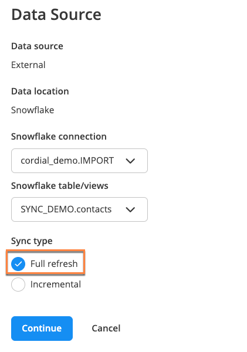

#### Incremental

- Used in recurring Data Job automations.
- Cordial stores sequence (last updated date from last imported row) as <code>{prevValue}</code>
- Select the desired **Cursor field** from the dropdown.
- **The cursor value is not repeated between syncs** option controls how Cordial selects records for the incremental sync.

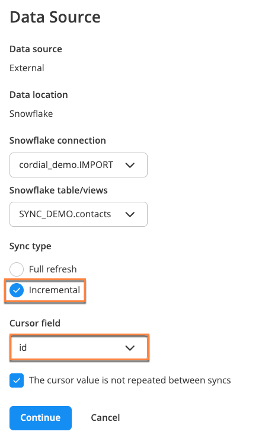\
**Note:** If the cursor field has unique values, such as unique IDs, Cordial can simplify the process and select all the new records. But if the cursor field is not unique, such as a timestamp or date, Cordial skips one or more records with the maximum value.

In the examples below, <code>UPDATED_AT</code> and <code>ORDER_ID</code> are cursor fields:

- If you select **The cursor value is not repeated** checkbox, Cordial creates a query like this:

```sql
SELECT ... WHERE ORDER_ID  {prevValue}
```

- If the checkbox is not selected, Cordial runs a query like this:

```sql
SELECT ... WHERE UPDATED_AT  {prevValue} AND UPDATED_AT <(select
max(updated_at)="max(UPDATED_AT)" from="FROM" {table})="{table})"></(select>
```

**Note:** The second example means Cordial doesn't import at least one row with <code>max(UPDATED_AT)</code>

### API support

The following Cordial endpoints support Snowflake as a data source:

- [POST/v2/contactimports](https://support.cordial.com/hc/en-us/articles/203886058-Contact-imports-API#postContactImports)
- [POST/v2/supplements/{supplement}/imports](https://support.cordial.com/hc/en-us/articles/204570687-Supplements-API#postSuppImports)

Example JSON request:

```json
{
   "source":{
      "transport":"snowflake",
      "connection":"same_name_used_in_marketplace_setup",
      "tableview":"same_table_view_name_used_in_marketplace_setup"
   },
   "hasHeader":true,
   "confirmEmail":"msmith@example.com"
}
```
### Disable connection

If you need to stop the sync, you can disable the connection by clicking **Configure** on the Snowflake card in Cordial (**Integrations > Partners**) and selecting the **Disable** button. When the connection is re-enabled, the job will continue looking for all records that were inserted or updated since the last sync.

## Conclusion and Resources

Congratulations! You have successfully learned how to create a two-way data share between Cordial and Snowflake, unlocking new opportunities for your team.

### What you learned

- How to set up a Secure Data Share between Cordial and Snowflake
- The data that gets unlocked by integrating Cordial and Snowflake
- How to send queries from Cordial to Snowflake
- How to send data from Snowflake to Cordial for use in marketing campaigns

### Related resources
Want to learn more about Cordial and Snowflake? Check out the following resources:

- [Cordial’s Snowflake Marketplace listing](https://app.snowflake.com/marketplace/listing/GZSTZ1D9SIF/cordial-messaging-data-personalized-user-profiles-events)
- [Snowflake/Cordial partner page](https://cordial.com/partners/snowflake/)
- [Why data sharing is important for real-time personalization blog](https://cordial.com/resources/why-data-sharing-is-important-for-real-time-personalization/)
- [Cordial’s Snowflake Secure Data Sharing Knowledge Base article](https://support.cordial.com/hc/en-us/articles/9615168271629-Snowflake-Secure-Data-Sharing)

- [Fork Repo on GitHub](https://github.com/Snowflake-Labs/sf-samples/blob/main/samples/cordial_data_share/cordial.ipynb)
- [Download Reference Architecture](/content/dam/snowflake-site/developers/2024/10/Cordial-_-Snowflake-Architecture-Slide.pdf)
- [Read the Blog](https://medium.com/snowflake/bidirectional-data-integration-between-cordial-and-snowflake-for-real-time-customer-data-377f893f68ed)
- [Watch the Demo](https://youtu.be/iEgHHkl1ga8?list=TLGGEbh0a1Siqg8yMDA5MjAyNQ)
