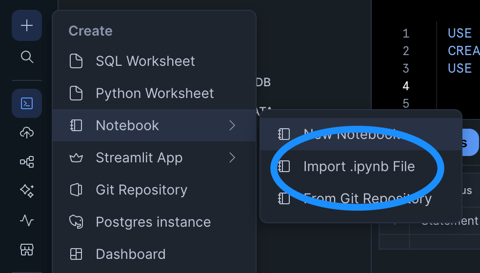
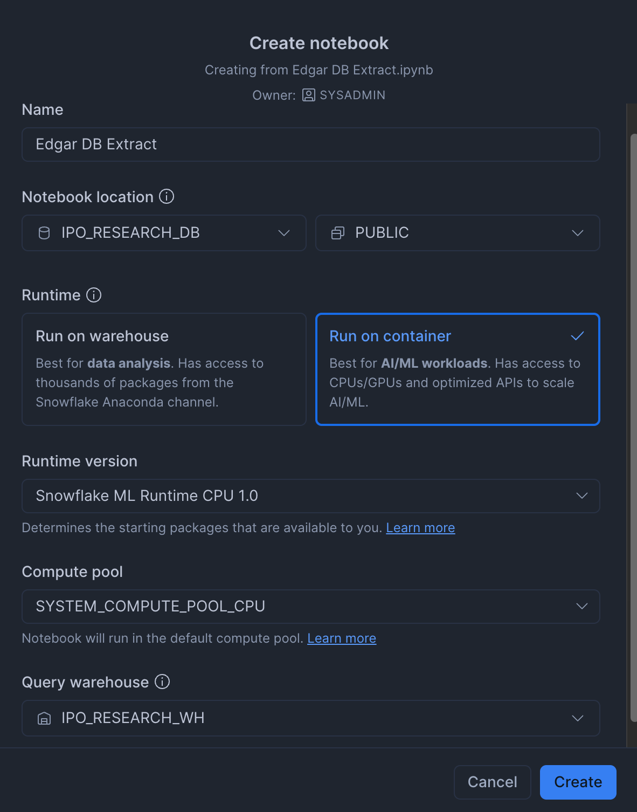
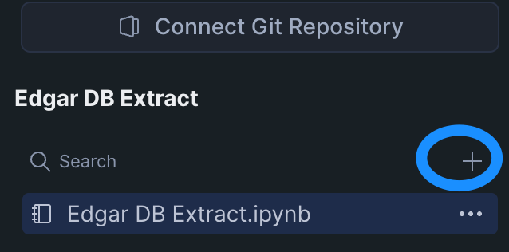
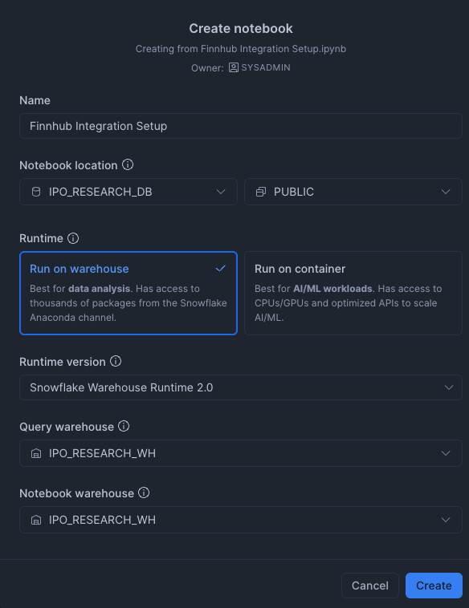
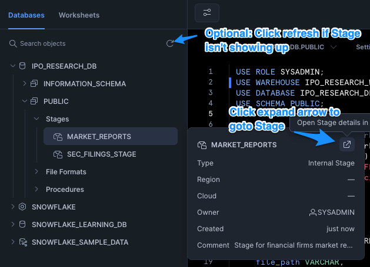
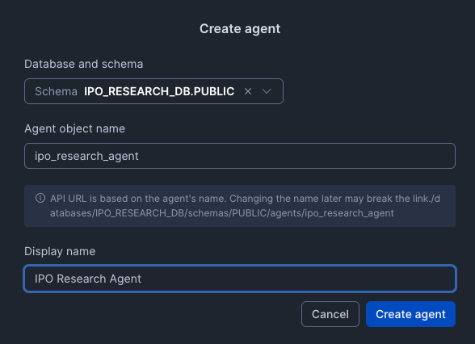
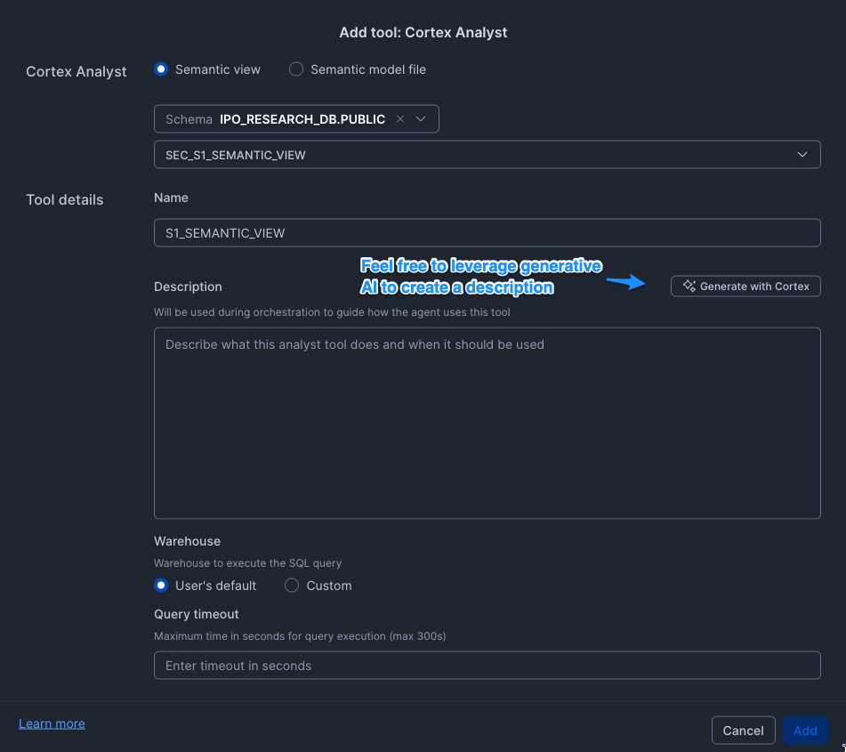
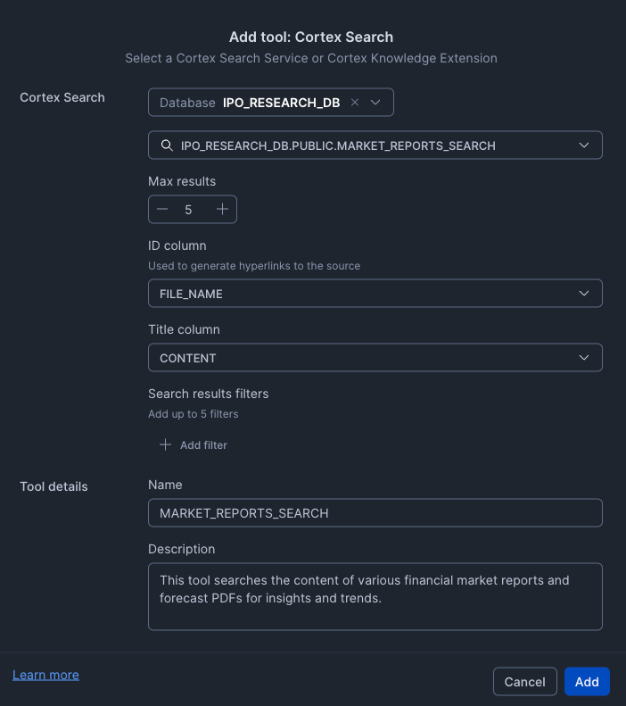
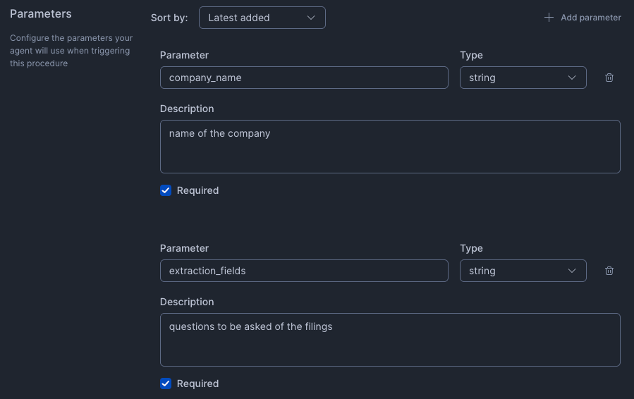

author: Jonathan Tao
id: cortex-agent-ipo-research-assistant
language: en
summary: This is a guide to setup a IPO Research Assistant Cortex Agent.  Tools include AI_EXTRACT over SEC S1 Filings, A Semantic View on company information, Cortex Search over market trend PDFs, and Finnhub API for real-time stock information.
categories: snowflake-site:taxonomy/solution-center/certification/quickstart, snowflake-site:taxonomy/product/ai, snowflake-site:taxonomy/snowflake-feature/unstructured-data-analysis, snowflake-site:taxonomy/industry/financial-services
environments: web
status: Published
feedback link: https://github.com/Snowflake-Labs/sfguides/issues

# IPO Research Assistant with Cortex AI 
<!-- ------------------------ -->
## Overview 

This Quickstart guide will walk you through creating IPO research agent leveraging key Snowflake Cortex capabilities.  In this Quickstart, you will perform/create the following:

- Setup your account to access various APIs, including the [SEC's Edgar Database](https://www.sec.gov/search-filings) and [Finnhub](https://finnhub.io/).
- Download one quarter's worth of SEC S-1 filings into stage
- Create a table referencing these filings and supply additional dimensional information, facilitated by a separate EDGAR API endpoint, and create a [Semantic View](https://docs.snowflake.com/en/user-guide/views-semantic/overview) related to this data
- Create a procedure leveraging the [AI_EXTRACT](https://docs.snowflake.com/en/sql-reference/functions/ai_extract) function
- Create procedures able to reference Finnhub's real-time stock market data
- Download market forecast reports from leading firms, in PDFs, and setup document processing and [Cortex Search](https://docs.snowflake.com/en/user-guide/snowflake-cortex/cortex-search/cortex-search-overview) on them
- Create a [Cortex Agent](https://docs.snowflake.com/en/user-guide/snowflake-cortex/cortex-agents) with the ability to reason and leverage the various Cortex AI services leveraged above

### What You’ll Need 
- A [Snowflake Account](https://signup.snowflake.com) with ACCOUNTADMIN privileges.  **NOTE**: Trial Accounts are not supported as External Access Integrations are not available for trial accounts.

### What You’ll Build 
- A Cortex Agent with multiple tools at its disposal, leveraging the interactive UI of Snowflake Intelligence.  

<!-- ------------------------ -->
## Getting Started

### Environment Setup
Open up a new SQL worksheet and run the following commands. To open up a new SQL worksheet, select Projects » Worksheets, then click the blue plus button and select SQL worksheet.

```
USE ROLE SYSADMIN;
CREATE OR REPLACE DATABASE IPO_RESEARCH_DB;
USE DATABASE IPO_RESEARCH_DB;

CREATE OR REPLACE WAREHOUSE IPO_RESEARCH_WH 
WAREHOUSE_SIZE = SMALL AUTO_SUSPEND = 60 AUTO_RESUME = TRUE;
GRANT USAGE ON WAREHOUSE IPO_RESEARCH_WH TO ROLE SYSADMIN;
USE WAREHOUSE IPO_RESEARCH_WH;
```
<!-- ------------------------ -->
## EDGAR Data Preparation

### Overview 

Upload and run a Snowflake Python Notebook that will download S-1 filings, add some dimensional data, create an extraction procedure, and create a Semantic View.

### Step 1.1: Import Edgar DB Python Notebook 
Next, let's import the Python Notebook that will download S-1 files from the EDGAR database as well as create the tables and AI_EXTRACT function.  First, download the notebook from [this](https://github.com/Snowflake-Labs/sfquickstarts/blob/e26f782575f756c55e8058576f2562c8579690ba/site/sfguides/src/cortex-agent-ipo-research-assistant/assets/Edgar%20DB%20Extract.ipynb) link.

You can import the notebook file by clicking the plus button >> Notebook >> Import .ipynb file.  



Ensure the following are set:
- **Runtime: Run on Container**.  This is needed as we will be using custom .whl files from the SEC for our project
- **Query Warehouse: IPO_RESEARCH_WH**.  If you do not see it as an option, refresh your whole webpage.



### Step 1.2: Add the necessary third-party packages 

When querying the EDGAR APIs, you will need the following packages:

- [SEC EDGAR Downloader](https://pypi.org/project/sec-edgar-downloader/)
- [PyRate Limiter](https://pypi.org/project/pyrate-limiter/)

Head over to these pages and download the `.whl` files for each package respectively.  Upload them to your notebook environment by clicking on the plus sign in the explorer column and selecting "Upload from Local":



### Step 1.3: Run Notebook

Now it's time to run the notebook.  It is recommended you execute each cell in order manually.  If you get a "Name or Service not known" error on the cell `test_connection` or `get_s1_filers_list`, you may need to end the session and restart to ensure the EAI is properly attached/enabled to the notebook and the current session.  Here are the steps to do that:

1. End session: click the down arrow next to the "Active" notebook status in the top right and click "End Session"
2. Restart session and execute only necessary cells: Execute cells from the beginning **but skip create_sec_eai** 

Additional notes:

- Based on the configuration at the top of `get_s1_filers_list`, we are downloading S-1 filings from Q1 2025.
- The `download_s1` and `sec_company_names` cells can take up to 10 minutes each due to rate limiting against the EDGAR database.
<!-- ------------------------ -->
## Finnhub API Preparation

### Overview 

Create a free [Finnhub.io](https://www.finnhub.io) account and setup the necessary functions to access real-time stock data through their API.

### Step 2.1: Create your Finnhub account

Go to the Finnhub website and register.  Once you register, you'll get an API key and free access to a subset of the endpoints and a 60 calls per minute.

### Step 2.2: Import and Run the Finnhub Integration Setup notebook

Next, let's import the Python Notebook that will create a new set of Network Rules and EAIs, plus the procedures that will hit the API.  Use the same approach for importing the notebook.  

Use [this](https://github.com/Snowflake-Labs/sfquickstarts/blob/e26f782575f756c55e8058576f2562c8579690ba/site/sfguides/src/cortex-agent-ipo-research-assistant/assets/Finnhub%20Integration%20Setup.ipynb) link to download the notebook.

Since we do not need any custom libraries, we'll use a warehouse-powered notebook.  Your settings should look like this:



**Once imported, make sure you add your api key in the `create_secret` cell.**  After doing so, you can run all the cells in order.

## Market Reports Preparation 

### Overview 

In this step, we will import several market forecast and research report PDFs from various firms, perform document processing using the [AI_PARSE_DOCUMENT](https://docs.snowflake.com/en/user-guide/snowflake-cortex/parse-document) function, and create a Cortex Search service on the resulting information.  

### Step 3.1: Create a new SQL worksheet, set context, and create new stage

Click on the "+" sign on the navigation column on the left and select "SQL Worksheet".  Then, run the following commands:

```
USE ROLE SYSADMIN;
USE WAREHOUSE IPO_RESEARCH_WH;
USE DATABASE IPO_RESEARCH_DB;
USE SCHEMA PUBLIC;


-- create new stage for market reports 
CREATE or REPLACE STAGE market_reports
DIRECTORY = (ENABLE = TRUE)
ENCRYPTION = (TYPE = 'SNOWFLAKE_SSE')
COMMENT = 'Stage for financial firms market report PDFs';
```

### Step 3.2: Upload PDFs

Next, let's upload the market report PDFs to our new stage via the UI.  To do this, navigate to the stage using the database explorer to the left.  Hover over the `MARKET_REPORTS` stage and click the "expand" icon in the top-right of the pop-up to open a new tab specific to this stage.  You may need to refresh the explorer if this stage is not listed.



In the new tab, click "+ Files" in the top right and upload the market report PDF files.  They can be found in a zip [here](https://github.com/Snowflake-Labs/sfquickstarts/blob/e26f782575f756c55e8058576f2562c8579690ba/site/sfguides/src/cortex-agent-ipo-research-assistant/assets/market_insights_pdfs.zip) - make sure to unzip and upload the PDFs as individual files.  

### Step 3.3: Create Target Table and Perform Document Processing

Return back to the SQL Worksheet and run the following commands to create a target table for document processing output and then execute the AI_PARSE_DOCUMENT function.

```
-- Step 1: Create table to store parsed PDF content
CREATE OR REPLACE TABLE MARKET_REPORTS (
    file_name VARCHAR,
    file_path VARCHAR,
    page_index INT,
    content TEXT,
    parsed_at TIMESTAMP_LTZ DEFAULT CURRENT_TIMESTAMP()
);


-- Step 2: Parse PDFs using AI_PARSE_DOCUMENT and load into table
INSERT INTO MARKET_REPORTS (file_name, file_path, page_index, content)
SELECT 
    SPLIT_PART(RELATIVE_PATH, '/', -1) AS file_name,
    RELATIVE_PATH AS file_path,
    page.value:index::INT AS page_index,
    page.value:content::TEXT AS content
FROM 
    DIRECTORY(@market_reports),
    LATERAL FLATTEN(
        input => SNOWFLAKE.CORTEX.AI_PARSE_DOCUMENT(
            TO_FILE('@market_reports', RELATIVE_PATH),
            {'mode': 'LAYOUT', 'page_split': true}
        ):pages
    ) AS page
WHERE 
    RELATIVE_PATH ILIKE '%.pdf';
```

### Step 3.4: Create Cortex Search Service

Execute the following command to create the Cortex Search Service:

```
-- Step 3: Create Cortex Search Service
CREATE OR REPLACE CORTEX SEARCH SERVICE market_reports_search
    ON content
    ATTRIBUTES file_name, page_index, parsed_at
    WAREHOUSE = IPO_RESEARCH_WH
    TARGET_LAG = '1 hour'
    COMMENT = 'Search service for market outlook reports'
AS 
    SELECT 
        content,
        file_name,
        page_index,
        parsed_at
    FROM 
        IPO_RESEARCH_DB.PUBLIC.MARKET_REPORTS; 
```

### OPTIONAL: Step 3.5: Test Cortex Search

You can test the Cortex Search functionality via SQL using the following statement:

```
SELECT PARSE_JSON(
    SNOWFLAKE.CORTEX.SEARCH_PREVIEW(
        'market_reports_search',
        '{
            "query": "market trends inflation",
            "columns": ["content", "file_name", "page_index"],
            "limit": 10
        }'
    )
)['results'] AS search_results;

```

## Cortex Agent Setup

### Recap

Before we move on to configuring the [Cortex Agent](https://docs.snowflake.com/en/user-guide/snowflake-cortex/cortex-agents), let's summarize what's been set up:  

- Loaded one quarter's worth of S-1 Filing Documents
- Created a Semantic View as well as an AI_EXTRACT procedure to work on the S-1 Documents
- Created procedures to access Real-Time stock information from Finnhub's API
- Loaded market report PDFs from various firms, performed document processing, and created a Cortex Search Service

The next step is to setup a Cortex Agent to reason and make decisions about performing IPO research leveraging all of the above as tools.

### Step 4.1: Create Cortex Agent

In the navigation bar, click on **AI & ML > AI Studio**, and then click **Try** on **Cortex Agents**.  On the resulting page, click "Create agent" in the top right.  In the popup modal, name/configure the agent as so:



### Step 4.2: Configure the Agent

Next, we'll start guiding the agent and setting up the tools it can use.

**About Section**

Add the following to the "Description" field:
>This is an agent that can be used to do research on both private and public companies, with the goal of discovering successful companies who have filed an S-1 and are preparing for an IPO.  

**Tool Section**

Click on the "Tools" tab; we'll begin to add tools to the agent's purview in this section.

1. Cortex Analyst:  Create a Cortex Analyst Service that the agent can use based off of our Semantic View created in the first step.  Click the "+ Add" for Cortex Analyst and match the configuration below:



2. Cortex Search Services:  Configure how the market reports Cortex Search Service will be used as a tool.  Ensure that the ID column and Title Column are properly set.  Click the "+ Add" for Cortex Search and match the configuration below:



3.  Custom tools:  Instruct how the agent can leverage custom tools such as procedures.  Click the "+ Add" for Custom tools, select the `IPO_RESEARCH_DB.PUBLIC` content and proceed to step our three procedures:

- GET_STOCK_FUNDAMENTALS(VARCHAR)
- GET_STOCK_PRICE(VARCHAR)
- EXTRACT_S1_INFO(VARCHAR, VARCHAR)
  - Note: Be sure to give a short description for the parameters for AI_EXTRACT as it is sensitive to formatting.




Feel free to match the tool name with the given procedure name and to leverage Cortex generative AI to generate a description.

**Finally - save the agent configuration by clicking "Save" in the top right**.

### Step 4.3: Test/Use Agent

We're now ready to test the agent! In the right-hand modal, you can test the agent's ability to reason and leverage tools based on the configuration.  Here's a flow of questions that tests all the tools configured in the previous step:

- Ask about forecast/sentiment reporting
   - "what are industries and sectors poised to do well based on market research?
   - "is AI still a strong industry to invest in?"
-  Find related companies and investigate their S-1s
   - "are there any energy companies that filed S-1s?"
   - "describe what these companies do based on their prospectus and also give the purpose of the S-1 filing"
- Compare to publicly traded companies
   - "are there any publicly traded peers of these companies? how have they done in the last 12 months?"

Tips:

1. At any time, you can click on "Show Traces" in the top-right of the agent chat interface to see the reasoning and tool invocation performance.  This will help you in case you are seeing more generic or empty results that might indicate problems in any of the tools.  
2. You can adjust the agent's behavior through prompt engineering via the "Orchestration" on the left-hand (config) side.  This will allow you to orchestrate tool usage, guide response instructions, and set budgets.

Once the agent is able to leverage all the tools, you are finished, and can optionally leverage the agent through [Snowflake Intelligence](https://www.snowflake.com/en/product/snowflake-intelligence/) for further testing or usage.

<!-- ------------------------ -->
## Conclusion and Resources

Congratulations!  You successfully setup a Cortex Agent that is able to demonstrate IPO research capabilities.  With some time and adjustments, you're well on your way to finding the next unicorn to invest in! 

### What You Learned
- Uploading and data engineering of EDGAR S-1 Filings 
- Creation of various tools that Cortex Agent can leverage
  - Cortex Analyst via Semantic View
  - AI_EXTRACT procedure
  - real-time stock information procedures via Finnhub API
- Creation and configuration of a Cortex Agent

### Related Resources
- [Semantic View](https://docs.snowflake.com/en/user-guide/views-semantic/overview)
- [AI_EXTRACT](https://docs.snowflake.com/en/sql-reference/functions/ai_extract)
- [Cortex Search](https://docs.snowflake.com/en/user-guide/snowflake-cortex/cortex-search/cortex-search-overview)
- [Cortex Agent](https://docs.snowflake.com/en/user-guide/snowflake-cortex/cortex-agents)
- [AI_PARSE_DOCUMENT](https://docs.snowflake.com/en/user-guide/snowflake-cortex/parse-document) 
- [Snowflake Intelligence](https://www.snowflake.com/en/product/snowflake-intelligence/) 