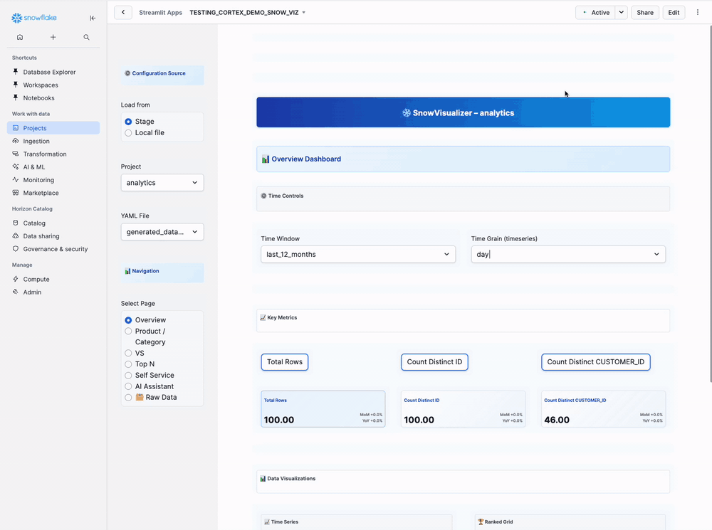

author: Joviane Bellegarde
id: cortex-ai-demo-framework
summary: Cortex AI Demo Framework - Build sophisticated Cortex-powered demos in ~5 minutes
categories: snowflake-site:taxonomy/solution-center/certification/quickstart, snowflake-site:taxonomy/snowflake-feature/cortex-llm-functions, 
environments: web
language: en
status: Hidden
feedback link: https://github.com/Snowflake-Labs/sfguides/issues
tags: Getting Started, Cortex, AI, Demo Development, Framework
fork repo link: https://github.com/Snowflake-Labs/sfguide-getting-started-with-cortex-ai-demo-framework


# Cortex AI Demo Framework
<!-- ------------------------ -->

## Overview

Demo development is crucial for businesses to showcase their AI capabilities and win new customers. Through rapid prototyping and professional presentation tools, businesses can transform weeks of development into minutes of setup, dramatically accelerating sales cycles and proof-of-concept delivery.

In this Quickstart, we will build a comprehensive demo development platform called "Cortex AI Demo Framework". This demonstrates how to use Snowflake Cortex AI functions to create synthetic data, build interactive analytics, deploy search capabilities, and generate complete demonstration environments.

This Quickstart showcases the complete Cortex AI Demo Framework with:
- **6-application integrated demo platform** with Synthetic Data Generator, Structured Tables, SQL to YAML Converter, Snow Demo, YAML Wizard, and Snow Viz
- **AI-powered data generation** using all Cortex functions
- **Advanced semantic search** and automated model creation
- **Cortex Search Service** for intelligent data discovery
- **Cortex Analyst integration** for natural language queries
- **Production-ready applications** with professional UI/UX


### What You Will Build
- Complete 6-application integrated demo platform
- AI-powered synthetic data generation system using Cortex functions
- Advanced semantic modeling and search capabilities
- Professional demo orchestration and configuration tools
- Interactive dashboard creation wizard with database introspection
- Advanced dashboard renderer with multiple visualization types
- Interactive Cortex Search Service for semantic discovery
- Production-ready Streamlit applications with advanced visualizations
- Reusable framework for rapid demo creation across any industry

### What You Will Learn
- How to set up a production demo development pipeline with Snowflake
- How to use Snowflake Notebooks for complex AI demo workflows
- How to implement all Cortex AI functions (SENTIMENT, EXTRACT_ANSWER, COMPLETE)
- How to build scalable demo platforms with synthetic data
- How to create automated semantic models and search services
- How to deploy interactive Streamlit applications in Snowflake

### Prerequisites
- Familiarity with Python and SQL
- Familiarity with Streamlit applications
- Go to the [Snowflake](https://signup.snowflake.com/?utm_source=snowflake-devrel&utm_medium=developer-guides&utm_cta=developer-guides) sign-up page and register for a free account

<!-- ------------------------ -->
## Setup Snowflake Environment  

In this step, you'll create the Snowflake database objects and prepare for framework deployment.

### Step 1: Create Database Objects

> 
> Starting in September 2025, Snowflake is gradually upgrading accounts from Worksheets to [Workspaces](https://docs.snowflake.com/en/user-guide/ui-snowsight/workspaces). Workspaces will become the default SQL editor. Follow the instructions below that match your interface.

**If you have Workspaces:**
1. In Snowsight, click `Projects`, then <a href="https://app.snowflake.com/_deeplink/#/workspaces?utm_source=snowflake-devrel&utm_medium=developer-guides&utm_content=cortex-ai-demo-framework&utm_cta=developer-guides-deeplink" class="_deeplink">Workspaces</a> in the left navigation
2. Click `+ Add new` to create a new <a href="https://app.snowflake.com/_deeplink/#/workspaces?utm_source=snowflake-devrel&utm_medium=developer-guides&utm_content=cortex-ai-demo-framework&utm_cta=developer-guides-deeplink" class="_deeplink">Workspace</a>
3. Click `SQL File` to create a new SQL file
4. Copy the setup script from [setup.sql](https://github.com/Snowflake-Labs/sfguide-getting-started-with-cortex-ai-demo-framework/blob/main/scripts/setup.sql) and paste it into your SQL file, then run it

**If you have Worksheets:**
1. In Snowsight, click `Projects`, then `Worksheets` in the left navigation
2. Click `+` in the top-right corner to open a new Worksheet
3. Copy the setup script from [setup.sql](https://github.com/Snowflake-Labs/sfguide-getting-started-with-cortex-ai-demo-framework/blob/main/scripts/setup.sql) and paste it into your worksheet, then run it

The setup script creates:
- **Database**: `CORTEX_FRAMEWORK_DB` with `BRONZE_LAYER`, `SILVER_LAYER`, `APPS`, and `CONFIGS` schemas
- **Role**: `CORTEX_FRAMEWORK_DATA_SCIENTIST` with all necessary permissions  
- **Warehouse**: `CORTEX_FRAMEWORK_WH` for compute resources
- **Stages**: `FRAMEWORK_DATA_STAGE`, `SEMANTIC_MODELS`, and `DEMO_CONFIGS` for file uploads
- **File Formats**: `CSV_FORMAT`, `YAML_FORMAT`, and `JSON_FORMAT` for data processing
- **AI Access**: `SNOWFLAKE.CORTEX_USER` role for Cortex functions

### Step 2: Download Required Framework Files

Download these framework files from the GitHub repository:

| File | Purpose | Download Link |
|------|---------|---------------|
| **Notebook** | Setup notebook for framework deployment | [cortex_ai_demo_framework_setup.ipynb](https://github.com/Snowflake-Labs/sfguide-getting-started-with-cortex-ai-demo-framework/blob/main/notebooks/cortex_ai_demo_framework_setup.ipynb) |
| **Environment File** | Conda environment configuration for latest Streamlit | [environment.yml](https://github.com/Snowflake-Labs/sfguide-getting-started-with-cortex-ai-demo-framework/blob/main/scripts/environment.yml) |
| **Synthetic Data Generator** | AI-powered synthetic data creation | [01_ai_framework_synthetic_data_generator.py](https://github.com/Snowflake-Labs/sfguide-getting-started-with-cortex-ai-demo-framework/blob/main/scripts/01_ai_framework_synthetic_data_generator.py) |
| **Structured Tables** | Data structuring and transformation | [02_ai_framework_structured_tables.py](https://github.com/Snowflake-Labs/sfguide-getting-started-with-cortex-ai-demo-framework/blob/main/scripts/02_ai_framework_structured_tables.py) |
| **SQL to YAML Converter** | SQL to YAML configuration converter (generates semantic models) | [03_ai_framework_sql_to_yaml_converter.py](https://github.com/Snowflake-Labs/sfguide-getting-started-with-cortex-ai-demo-framework/blob/main/scripts/03_ai_framework_sql_to_yaml_converter.py) |
| **Snow Demo** | Demo configuration and runner | [04_ai_framework_snow_demo.py](https://github.com/Snowflake-Labs/sfguide-getting-started-with-cortex-ai-demo-framework/blob/main/scripts/04_ai_framework_snow_demo.py) |
| **YAML Wizard** | Interactive dashboard configuration creator | [05_ai_framework_snow_viz_yaml_wizard.py](https://github.com/Snowflake-Labs/sfguide-getting-started-with-cortex-ai-demo-framework/blob/main/scripts/05_ai_framework_snow_viz_yaml_wizard.py) |
| **Snow Viz** | Advanced visualization dashboard renderer | [06_ai_framework_snow_viz.py](https://github.com/Snowflake-Labs/sfguide-getting-started-with-cortex-ai-demo-framework/blob/main/scripts/06_ai_framework_snow_viz.py) |

### Step 3: Upload Framework Files to Single Stage

1. In Snowsight, change your role to `cortex_ai_demo_data_scientist`

2. Navigate to `Catalog` → `Database Explorer` → `AI_FRAMEWORK_DB` → `APPS` → `Stages`

**Upload all framework files to the single `AI_FRAMEWORK_APPS` stage:**

3. Click on `AI_FRAMEWORK_APPS` stage, then click `Enable Directory Table` and upload all 7 files:
   - `01_ai_framework_synthetic_data_generator.py`
   - `02_ai_framework_structured_tables.py`
   - `03_ai_framework_sql_to_yaml_converter.py`
   - `04_ai_framework_snow_demo.py`
   - `05_ai_framework_snow_viz_yaml_wizard.py`
   - `06_ai_framework_snow_viz.py`
   - `environment.yml`

### Step 4: Import the Framework Setup Notebook

1. **Import into Snowflake**:
   - Navigate to `Projects` → `Notebooks` in Snowsight
   - Click the down arrow next to `+ Notebook` and select `Import .ipynb file`
   - Choose `cortex_ai_demo_framework_setup.ipynb` from your downloads

2. **Configure the notebook settings**:
   - **Role**: Select `cortex_ai_demo_data_scientist`
   - **Database**: Select `AI_FRAMEWORK_DB`
   - **Schema**: Select `BRONZE_LAYER`  
   - **Query Warehouse**: Select `cortex_ai_demo_wh`
   - **Notebook Warehouse**: Select `cortex_ai_demo_wh`

3. **Click `Create`** to import the notebook

The notebook creates all 6 Streamlit applications using the single stage approach with automatic environment.yml detection for the latest Streamlit version.

<!-- ------------------------ -->
## Run Framework Demo Notebook

### Execute the Framework Deployment Workflow

1. Go to `Projects` → `Notebooks` in Snowsight
2. Click on `CORTEX_FRAMEWORK_DEMO` Notebook to open it
3. Click `Run all` to execute all cells in the notebook at once

**What the notebook does:**
- Creates sample customer survey data tables
- Processes data with Cortex AI functions (SENTIMENT, EXTRACT_ANSWER, COMPLETE)
- Deploys all 6 Streamlit applications from the uploaded stage files
- Sets up the complete framework for immediate demo creation

The notebook processes sample data and deploys the complete framework application suite.

<!-- ------------------------ -->
## Framework Overview

### Access Your Demo Framework

1. Navigate to `Projects` → `Streamlit` in Snowsight
2. You'll see 6 framework applications deployed

### The 6 Applications

#### **1. Synthetic Data Generator** 🎲 (Always Start Here)
Creates realistic AI-powered datasets using Cortex LLMs. Saves raw JSON to `BRONZE_LAYER` tables.

#### **2. Structured Tables** 🔄
Transforms raw JSON into clean, structured database tables. Outputs analytics-ready data to `SILVER_LAYER`.

#### **3. SQL to YAML Converter** ⚙️
Converts SQL queries into interactive demo configurations for Snow Demo (App 4).

#### **4. Snow Demo** 📊
Runs interactive SQL-driven presentations with live visualizations and AI experimentation.

#### **5. YAML Wizard** 🧙
Guided dashboard configuration creator. Generates YAML files for Snow Viz (App 6).

#### **6. Snow Viz** 📈
Renders advanced interactive dashboards with multi-tab analytics and AI integration.

### Application Dependencies

```console
1. SYNTHETIC DATA GENERATOR (START HERE)
   └─ Creates realistic datasets
      │
      ├─ 2. STRUCTURED TABLES
      │  └─ Transforms JSON → SQL tables
      │     │
      │     └─ 5. YAML WIZARD
      │        └─ Generates dashboard configs
      │           │
      │           └─ 6. SNOW VIZ
      │              └─ Renders dashboards
      │
      └─ 3. SQL TO YAML CONVERTER
         └─ Converts queries → demo configs
            │
            └─ 4. SNOW DEMO
               └─ Runs interactive SQL demos
```

**Next**: Page 5 shows which apps to use based on your role and goals.

<!-- ------------------------ -->
## Persona Workflows

### Who Should Use This Framework?

The framework supports **4 different user personas**. Find your role below to see which apps you need and in what order.

---

### Persona 1: Full-Stack Data Developer

**Who You Are**:
- Data engineers building end-to-end pipelines
- Analytics developers creating dashboards
- Technical users who want the complete experience

**What You'll Build**: A complete analytics pipeline from data generation to interactive dashboards

**Apps You'll Use**: Synthetic Data Generator → Structured Tables → YAML Wizard → Snow Viz

**Time Required**: ~25 minutes

**Your Workflow**:
1. **Synthetic Data Generator**: Generate synthetic data
2. **Structured Tables**: Transform JSON to structured table
3. **YAML Wizard**: Create dashboard configuration
4. **Snow Viz**: View your interactive dashboard

**What You'll Get**:
- Synthetic dataset with realistic values
- Clean, structured database table
- Interactive dashboard with multiple visualization tabs

---

### Persona 2: SQL Demo Creator / Solutions Architect

**Who You Are**:
- Solutions architects building customer demos
- Technical evangelists presenting Snowflake capabilities
- Demo creators showcasing SQL + AI features

**What You'll Build**: Interactive SQL-driven presentations with live query execution and AI experimentation

**Apps You'll Use**: Synthetic Data Generator → Structured Tables → SQL to YAML Converter → Snow Demo

**Time Required**: ~30 minutes

**Your Workflow**:
1. **Synthetic Data Generator**: Generate synthetic data for demos
2. **Structured Tables**: Create structured table
3. **SQL to YAML Converter**: Write SQL queries and convert to demo format
4. **Snow Demo**: Run interactive SQL presentation

**What You'll Get**:
- Realistic demo dataset
- Multi-step SQL presentation
- Interactive visualizations with live AI experimentation

---

### Persona 3: Data Preparation Specialist

**Who You Are**:
- Data scientists needing training data
- ML engineers requiring test datasets
- BI developers prototyping dashboards

**What You'll Build**: Clean, structured datasets for export to external tools (notebooks, ML pipelines, BI tools)

**Apps You'll Use**: Synthetic Data Generator → Structured Tables

**Time Required**: ~15 minutes

**Your Workflow**:
1. **Synthetic Data Generator**: Generate synthetic data
2. **Structured Tables**: Transform to structured table
3. Export data via CSV, Python/Snowpark, or direct BI tool connections

**What You'll Get**:
- Production-ready synthetic datasets
- Validated data quality
- Export-ready structured tables

---

### Persona 4: Dashboard Consumer / Executive

**Who You Are**:
- Business executives viewing insights
- Managers making data-driven decisions
- Analysts exploring pre-built dashboards

**What You'll Do**: View and interact with dashboards created by your data team (no setup required)

**Apps You'll Use**: Snow Viz only (after colleague completes setup)

**Time Required**: ~5 minutes

**Prerequisites**:
A colleague must first complete Synthetic Data Generator → Structured Tables → YAML Wizard to create the dashboard. Once that's done, you can view and explore it.

**Your Workflow**:
1. **Snow Viz**: Open app and select dashboard
2. Explore tabs with different visualization types
3. Use AI Assistant to ask questions in plain English
4. Export data to CSV for further analysis

**What You Can Do**:
- View key metrics and trends
- Ask questions in natural language
- Export results to spreadsheets

---

### Choose Your Path

**Ready to get started?** Jump to the pages for your persona:

| Persona | Apps to Follow | What You'll Build |
|---------|----------------|-------------------|
| **Full-Stack Developer** | Synthetic Data Generator → Structured Tables → YAML Wizard → Snow Viz | Complete analytics pipeline with dashboards |
| **SQL Demo Creator** | Synthetic Data Generator → Structured Tables → SQL to YAML Converter → Snow Demo | Interactive SQL presentations with AI |
| **Data Preparation** | Synthetic Data Generator → Structured Tables | Clean datasets for ML/BI/external tools |
| **Dashboard Consumer** | Snow Viz only | Explore pre-built dashboards (no setup) |

**Or read all app instructions** (Pages 6-11) to understand the full framework capabilities.

<!-- ------------------------ -->
## Synthetic Data Generator

**Purpose**: Create realistic AI-powered datasets for any business scenario using Cortex LLMs  
**Dependencies**: None (START HERE)  
**Output**: Raw JSON data saved to `BRONZE_LAYER` tables


### Who Uses This App

**All Personas start here!** This is the foundation of the framework.

- **Persona 1** (Full-Stack Developer): Generate 100 records for dashboards
- **Persona 2** (SQL Demo Creator): Generate 150 records for presentations  
- **Persona 3** (Data Preparation): Generate 300+ records for ML/BI export
- **Persona 4** (Dashboard Consumer): Your colleague uses this to create data for you

---

### Step-by-Step Instructions

#### Step 1: Open the App

Navigate to `Projects` → `Streamlit` → **`SYNTHETIC_DATA_GENERATOR`**

#### Step 2: Configuration Management (Optional)

**Left Sidebar - Top Section:**

For first-time use, leave "Load Configuration" as **Create New**. If you have saved configurations, select one from dropdown and click **📁 Load Configuration**.

#### Step 3: Dataset Configuration

**Left Sidebar:**

Enter your company name and topic/domain:

```
Acme Corp
```

```
Customer Orders
```

**Other Examples**:
- ShopSmart + "Product Sales"
- MedCenter + "Patient Vitals"
- FinanceFirst + "Loan Applications"

#### Step 4: Define Data Fields

**Left Sidebar - Fields Section:**

Enter your fields (one per line):

```
customer_id
customer_name
email
order_date
product_name
quantity
price
total_amount
```

**Tips**:
- One field per line
- Use descriptive field names
- Include date fields for time-series analysis
- Add 6-10 fields for realistic datasets

#### Step 5: Batch Configuration

**Left Sidebar:**

Set your batch configuration using the sliders:

- **Records per Batch**: `10` (Slider: 10-200, step 10)
- **Number of Batches**: `10` (Slider: 1-1000)
- **Total records to generate**: `100`

> 
> **Recommended Settings**:
> - **Testing**: 10 records × 10 batches = 100 records (~2-3 min)
> - **Demos**: 30 records × 15 batches = 450 records (~8-10 min)
> - **Production**: 50 records × 20 batches = 1000 records (~15-20 min)

**Why smaller batches?**
- Higher accuracy (95%+ valid JSON)
- Faster generation per batch
- Better error recovery

#### Step 6: Configure Cortex LLM

**Left Sidebar:**

Configure the Cortex LLM settings:

- **Model Type**: `LARGE` (Options: SMALL, MEDIUM, LARGE)
- **Model**: `mistral-large2` (Recommended for consistent results)
- **Temperature**: `0.7` (Slider: 0.0-1.0, step 0.1)
- **Max Tokens**: `4000` (Slider: 100-8000, step 100)

> 
> **Model Selection Guide**:
> - **mistral-large2** (LARGE): Best accuracy, handles any batch size
> - **mixtral-8x7b** (MEDIUM): Good balance, use ≤30 records/batch
> - **llama3.1-8b** (SMALL): Fastest, use ≤20 records/batch
> 
> **Temperature Guide**:
> - **0.1-0.3**: Medical/financial data (high consistency)
> - **0.7**: General business data (balanced)
> - **0.9**: Creative content (reviews, feedback)

#### Step 7: Performance Configuration

**Left Sidebar:**

- ☑ **High-Performance Mode** (Uses stored procedures - RECOMMENDED)
- ☐ **Show Manual Scripts** (Leave unchecked unless you need SQL)

Keep "High-Performance Mode" checked for best results!

#### Step 8: Auto-save Configuration

**Left Sidebar:**

Check the following options:

- ☑ **Auto-save batches to table**
- **Database**: `AI_FRAMEWORK_DB`
- **Schema**: `BRONZE_LAYER`
- **Table Name**: `GENERATED_DATA`
- ☑ **Append to existing table**

> 
> **Important**: Data saves to `BRONZE_LAYER` first. You'll transform it to `SILVER_LAYER` in App 2!

#### Step 9: Generate Data

1. Click **"Generate Default Prompts"** → Review/edit prompts if needed
2. Click **"🎲 Generate Synthetic Data"** → Wait ~2-3 minutes
3. Watch progress: Batch 1/10... 10/10

#### Step 10: Verify Success

**Expected Output**:
```
Generated 100 records successfully!
Data saved to: AI_FRAMEWORK_DB.BRONZE_LAYER.GENERATED_DATA

Sample data preview:
| CUSTOMER_NAME | PRODUCT_NAME | QUANTITY | PRICE | TOTAL_AMOUNT |
|---------------|--------------|----------|-------|--------------|
| Sarah Johnson | Laptop Pro   | 1        | 1299  | 1299         |
| Mike Chen     | Wireless Mouse| 2       | 29    | 58           |
```

**Verification Steps**:

1. Go to Snowsight → **Data** → **Databases** → **AI_FRAMEWORK_DB** → **BRONZE_LAYER**
2. Find your table (e.g., `GENERATED_DATA`)
3. Click to view:
   - Should see **10 rows** (one per batch)
   - Each row has **MESSAGES** column with JSON array
   - Check **_META_** columns for generation metadata

**Data Quality Check**:
```sql
-- Run this query to check your data
SELECT 
    COUNT(*) as total_batches,
    SUM(_META_RECORDS_IN_BATCH) as total_records,
    AVG(_META_RECORDS_IN_BATCH) as avg_records_per_batch,
    _META_COMPANY_NAME,
    _META_TOPIC
FROM AI_FRAMEWORK_DB.BRONZE_LAYER.GENERATED_DATA
GROUP BY _META_COMPANY_NAME, _META_TOPIC;
```

Expected: 10 batches, 100 total records

#### Step 11: Save Configuration (Optional)

**Bottom of Main Panel:**

Enter a configuration name and click **💾 Save Configuration**:

```
Acme_Corp_Customer_Orders_Config
```

Save your configuration to reuse later with different batch sizes or models!

---

### Common Use Cases

#### **Retail / E-commerce**
```
Company: ShopSmart
Topic: Product Sales
Fields: product_id, product_name, category, sale_date, sale_amount, 
        customer_segment, region, payment_method
```

#### **Healthcare**
```
Company: MedCenter
Topic: Patient Vitals
Fields: patient_id, age, gender, blood_pressure_systolic, 
        blood_pressure_diastolic, heart_rate, temperature, 
        oxygen_saturation, recorded_date
```

#### **Financial Services**
```
Company: FinanceFirst
Topic: Loan Applications
Fields: application_id, applicant_name, loan_amount, credit_score, 
        income, employment_status, application_date, approval_status
```

---

### Best Practices

**Start small**: Test with 10 records × 10 batches first  
**Use mistral-large2**: Best accuracy across all scenarios  
**Name tables descriptively**: Include company/topic in table name  
**Save configurations**: Reuse settings for consistent results  
**Check data quality**: Verify first batch before generating more  
**Use appropriate temperature**: Low for factual, high for creative

---

### What's Next?

**For All Personas**:
→ Continue to **Page 7 (App 2 - Structured Tables)** to transform your data from `BRONZE_LAYER` to `SILVER_LAYER`

Your data is now in raw JSON format. App 2 will clean and structure it into proper database columns!

<!-- ------------------------ -->
## Structured Tables

**Purpose**: Transform raw JSON data into clean, structured database tables  
**Dependencies**: Requires data from App 1  
**Output**: Analytics-ready data in `SILVER_LAYER` tables


### Who Uses This App

- **Persona 1** (Full-Stack Developer): Transform to structured tables for dashboards
- **Persona 2** (SQL Demo Creator): Clean data for SQL presentations
- **Persona 3** (Data Preparation): Structure data before export to ML/BI tools
- **Persona 4** (Dashboard Consumer): Your colleague uses this to prepare data

---

### Step-by-Step Instructions

#### Step 1: Open the App

Navigate to `Projects` → `Streamlit` → **`STRUCTURED_TABLES`**

#### Step 2: Select Source Table

**Main Panel - Left Column:**

Select source table with synthetic data from the dropdown (e.g., `GENERATED_DATA`).

The dropdown shows all tables from `BRONZE_LAYER` that contain a `MESSAGES` column (generated by Synthetic Data Generator).

#### Step 3: Configure Target Table Name

**Main Panel - Right Column:**

Enter name for structured table (e.g., `GENERATED_DATA_STRUCTURED`).

The app auto-fills this by adding `_STRUCTURED` to your source table name. You can customize it if needed.

#### Step 4: Filter by Company and Topic

**Main Panel - Filter Section:**

Select the company and topic you used when generating data in Step 1 from the dropdowns (e.g., `Acme Corp` and `Customer Orders`).

These dropdowns populate automatically from your source table's metadata (`_meta_company_name` and `_meta_topic` columns).

#### Step 5: Review Data Quality Analysis

**Auto-generated after selection:**

```
📊 Data Quality Analysis

Left Column:
Total Records: 10
Valid JSON: 10

Middle Column:
Invalid JSON: 0
Very Short: 0

Right Column:
Avg Length: 2,500 chars
```

**What to look for**:
- **Valid JSON** should match **Total Records** (if using mistral-large2)
- **Invalid JSON** should be 0 or very low
- **Very Short** indicates truncated records

> 
> **Good Quality Indicators**:
> - Valid JSON = Total Records (100% success rate)
> - Invalid JSON = 0 (no errors)
> - Avg Length > 1,000 chars (complete records)

#### Step 6: Preview Sample Data

**Sample of Cleaned Data section:**

```
| MESSAGES | _META_COMPANY_NAME | _META_TOPIC | _META_RECORDS_IN_BATCH |
|----------|-------------------|-------------|------------------------|
| [{"customer_id": 1, ...}] | Acme Corp | Customer Orders | 10 |
```

This shows your raw BRONZE_LAYER data with JSON arrays in the `MESSAGES` column.

#### Step 7: Review Fields Analysis

**Auto-detected fields:**

```
🔍 Fields Analysis

Found 8 fields: customer_id, customer_name, email, order_date, 
                 product_name, quantity, price, total_amount

📝 View SQL Column Names (expandable):
SQL column names: CUSTOMER_ID, CUSTOMER_NAME, EMAIL, ORDER_DATE, 
                  PRODUCT_NAME, QUANTITY, PRICE, TOTAL_AMOUNT
```

The app automatically detects field names from your JSON structure and shows how they'll appear as SQL column names (uppercase).

**Verify** all your expected fields are detected!

#### Step 8: Transform Data

**Bottom Section:**

**Configuration name:**
```
Acme_Corp_Customer_Orders_GENERATED_DATA
```

1. **Optional**: Edit the configuration name if you want to save settings
2. Click **"🔄 Transform Data"** button

**Progress indicator**:
```
Transforming data...
```

This process:
- Cleans LLM artifacts from JSON
- Flattens JSON arrays to individual rows
- Creates structured table in `SILVER_LAYER`
- Validates data quality

**Expected time**: 30 seconds to 2 minutes depending on data volume

#### Step 9: Verify Success

**Expected Output**:

```
Successfully transformed data to table: GENERATED_DATA_STRUCTURED

📋 Sample of Transformed Data

| CUSTOMER_ID | CUSTOMER_NAME | EMAIL | ORDER_DATE | PRODUCT_NAME | QUANTITY | PRICE | TOTAL_AMOUNT |
|-------------|---------------|-------|------------|--------------|----------|-------|--------------|
| 1 | Sarah Johnson | sarah.j@email.com | 2024-03-15 | Laptop Pro | 1 | 1299 | 1299 |
| 2 | Mike Chen | mike.c@email.com | 2024-03-12 | Wireless Mouse | 2 | 29 | 58 |

📊 Transformation Summary:
Records processed: 100
Target table: AI_FRAMEWORK_DB.SILVER_LAYER.GENERATED_DATA_STRUCTURED
```

**What happened**:
- **Before**: 10 rows in BRONZE_LAYER (batches with JSON arrays)
- **After**: 100 rows in SILVER_LAYER (individual records with columns)

#### Step 10: Verify in Snowsight

**Verification Steps**:

1. Go to Snowsight → **Data** → **Databases** → **AI_FRAMEWORK_DB** → **SILVER_LAYER**
2. Find your table (e.g., `GENERATED_DATA_STRUCTURED`)
3. Click to view data
4. Verify:
   - Row count matches expected (e.g., 100 individual records)
   - All columns are present
   - Data looks clean and realistic

**Data Quality Check**:
```sql
-- Run this query to verify your structured data
SELECT 
    COUNT(*) as total_records,
    COUNT(DISTINCT customer_name) as unique_customers,
    MIN(order_date) as earliest_order,
    MAX(order_date) as latest_order,
    SUM(total_amount) as total_revenue
FROM AI_FRAMEWORK_DB.SILVER_LAYER.GENERATED_DATA_STRUCTURED;
```

#### Step 11: Save Configuration (Optional)

If you clicked **"💾 Save Configuration"** before transforming, your settings are saved for reuse:
- Source table selection
- Target table name
- Company and topic filters

Load it next time from the configuration dropdown!

---

### Understanding the Transformation

#### What This App Does

**1. Cleans LLM Artifacts**:
- Removes incomplete JSON structures
- Fixes truncated records
- Strips LLM wrapper text

**2. Flattens JSON Arrays**:
```
Before (BRONZE_LAYER):
[{"customer_id": 1, ...}, {"customer_id": 2, ...}]  ← 1 row, many records

After (SILVER_LAYER):
Row 1: customer_id=1, customer_name=..., email=...
Row 2: customer_id=2, customer_name=..., email=...  ← Many rows, structured columns
```

**3. Creates Proper SQL Table**:
- Each field becomes a column
- Each JSON object becomes a row
- Data types inferred automatically
- Ready for SQL queries and analysis

#### Data Flow

```
BRONZE_LAYER (Raw Synthetic Data)
├─ Table: GENERATED_DATA
├─ Structure: Batched JSON arrays
├─ Columns: MESSAGES, _META_* fields
└─ Rows: 10 (one per batch)

         ↓ Transform ↓

SILVER_LAYER (Structured Data)
├─ Table: GENERATED_DATA_STRUCTURED
├─ Structure: Individual records in columns
├─ Columns: CUSTOMER_ID, CUSTOMER_NAME, EMAIL, ORDER_DATE, etc.
└─ Rows: 100 (individual records)
```

---

### Common Use Cases

#### **For Dashboard Building (Persona 1)**
After transformation, your data is ready for:
- YAML Wizard (create dashboard configs)
- Snow Viz (render dashboards)
- Direct SQL analysis

#### **For SQL Demos (Persona 2)**
Structured tables work with:
- SQL to YAML Converter
- Snow Demo presentations
- Custom SQL queries

#### **For Data Export (Persona 3)**
Export structured data via:
```sql
-- Export to CSV
SELECT * 
FROM AI_FRAMEWORK_DB.SILVER_LAYER.GENERATED_DATA_STRUCTURED;

-- Use in Python/Snowpark
session.table("AI_FRAMEWORK_DB.SILVER_LAYER.GENERATED_DATA_STRUCTURED").to_pandas()

-- Connect BI tools directly to SILVER_LAYER tables
```

---

### What's Next?

**For Persona 1** (Full-Stack Developer):
→ Continue to **Page 10 (YAML Wizard)** to create dashboard configurations

**For Persona 2** (SQL Demo Creator):
→ Continue to **Page 8 (SQL to YAML Converter)** to create demo flows

**For Persona 3** (Data Preparation):
→ **Export your data** from SILVER_LAYER or continue to other apps

**For All Personas**:
Your data is now in clean, structured format in `SILVER_LAYER` - ready for analytics, dashboards, demos, or export!

<!-- ------------------------ -->
## SQL to YAML Converter

**Purpose**: Convert SQL queries into interactive demo configurations for Snow Demo  
**Dependencies**: Requires tables from App 1 or 2  
**Output**: YAML files for `FRAMEWORK_YAML_STAGE`


### Who Uses This App

- **Persona 2** (SQL Demo Creator): Convert SQL queries to demo YAML for interactive presentations

---

### Step-by-Step Instructions

#### Step 1: Open the App

Navigate to `Projects` → `Streamlit` → **`SQL_TO_YAML_CONVERTER`**

#### Step 2: Choose Input Method

**Main Panel - Input SQL Worksheet Section:**

```
Choose Input Method:
◉ Paste SQL
○ Upload File
```

Select **Paste SQL** to enter your queries directly, or **Upload File** to upload a `.sql` or `.txt` file.

#### Step 3: Enter Your SQL Queries

**SQL Input Text Area:**

Replace the placeholder SQL with your actual queries from the structured tables you created:

```sql
-- Step 1: Customer Overview
SELECT 
    CUSTOMER_NAME,
    EMAIL,
    ORDER_DATE,
    PRODUCT_NAME,
    TOTAL_AMOUNT
FROM AI_FRAMEWORK_DB.SILVER_LAYER.GENERATED_DATA_STRUCTURED
LIMIT 10;

-- Step 2: Revenue by Product
SELECT 
    PRODUCT_NAME,
    COUNT(*) as order_count,
    SUM(TOTAL_AMOUNT) as total_revenue,
    AVG(TOTAL_AMOUNT) as avg_order_value
FROM AI_FRAMEWORK_DB.SILVER_LAYER.GENERATED_DATA_STRUCTURED
GROUP BY PRODUCT_NAME
ORDER BY total_revenue DESC;

-- Step 3: Top Customers Analysis
SELECT 
    CUSTOMER_NAME,
    COUNT(*) as total_orders,
    SUM(TOTAL_AMOUNT) as total_spent,
    AVG(TOTAL_AMOUNT) as avg_order_value
FROM AI_FRAMEWORK_DB.SILVER_LAYER.GENERATED_DATA_STRUCTURED
GROUP BY CUSTOMER_NAME
ORDER BY total_spent DESC
LIMIT 10;
```

**Tips**:
- Use your actual table names from Structured Tables
- Include Cortex AI functions for interactive demos
- Separate steps with SQL comments (`-- Step X:`)
- Mix different query types (SELECT, GROUP BY, Cortex functions)

> 
> **Cortex AI Integration**: The app automatically detects `SNOWFLAKE.CORTEX.COMPLETE()` calls and creates interactive steps where users can modify prompts and see real-time AI responses!

#### Step 4: Configure Demo Metadata

**Demo Metadata Section (Two Columns):**

**Left Column:**

**Topic:**
```
Customer Analytics
```

**Sub-topic:**
```
Order Analysis
```

**Tertiary Topic:**
```
Revenue Insights
```

**Title:**
```
Acme Corp Customer Orders Analytics Dashboard
```

**Right Column:**

**Logo URL:** (optional - leave blank)

**Owner:**
```
Data Analytics Team
```

**Database:** (leave blank to auto-detect)

**Schema:** (leave blank to auto-detect)

**Overview Description:**
```
Comprehensive analysis of Acme Corp customer order data showcasing:
- Customer order patterns and revenue trends
- Top-performing products and customer segments
- AI-powered customer insights and recommendations
```

**Tips**:
- Keep Topic/Sub-topic/Tertiary Topic hierarchical (broad → specific)
- Title is the main heading users see
- Use bullet points with `-` for better formatting in Overview

#### Step 5: Configure Advanced Options (Optional)

**Expandable Advanced Options Section:**

```
SQL Block Separator: GO
Role: (leave blank)
Warehouse: (leave blank)
```

Default settings work for most cases. Only change if you have specific requirements.

#### Step 6: Parse SQL Worksheet

**Bottom of Input Section:**

Click the blue **[Parse SQL Worksheet]** button

**What happens**:
1. App analyzes your SQL queries
2. Detects Cortex AI functions automatically
3. Suggests visualizations based on query patterns:
   - `GROUP BY` → Bar Chart
   - `SELECT *` → Table
   - Cortex functions → Interactive AI steps
4. Comments out unsupported commands (USE statements)
5. Generates YAML configuration

Processing time: ~5-10 seconds

#### Step 7: Review Summary Tab

**Results Section - Tab 1 (Summary):**

```
Key Metrics:
- 3 Total Steps
- 1 Table Referenced
- 2 Visualization Types

Cortex AI Analysis:
- 0 Cortex Complete calls detected
- 0 Interactive Cortex steps created

Interactive Steps:
- None (add CORTEX.COMPLETE() for interactive AI steps)
```

This shows what the app detected in your SQL and how it will be presented in Snow Demo.

#### Step 8: Review Parsed Blocks Tab

**Results Section - Tab 2 (Parsed Blocks):**

```
Step 1: Customer Overview
- Type: Query
- Visualization: Table
- SQL: SELECT CUSTOMER_NAME, EMAIL...

Step 2: Revenue by Product
- Type: Query  
- Visualization: Bar Chart
- SQL: SELECT PRODUCT_NAME, COUNT(*) as order_count...

Step 3: Top Customers Analysis
- Type: Query
- Visualization: Table
- SQL: SELECT CUSTOMER_NAME, COUNT(*) as total_orders...
```

Verify all your steps are correctly parsed and visualization types make sense.

#### Step 9: Review Generated YAML

**Results Section - Tab 3 (Generated YAML):**

Shows the complete YAML configuration that will be used by Snow Demo. This includes:
- Metadata (topic, title, owner)
- SQL steps with visualization configurations
- Interactive Cortex AI steps
- Execution flow

You don't need to edit this manually - it's automatically generated!

#### Step 10: Download or Save Configuration

**Results Section - Tab 4 (Download & Export):**

**Configuration Name:**
```
Customer_Analytics_Order_Analysis_Revenue_Insights_20250115
```

**Option 1: Save to Database** (Recommended)
- Click **"Save to Database"** button
- Config saved to `AI_FRAMEWORK_DB.CONFIG.DEMO_CONFIGURATIONS`

**Option 2: Download YAML File**
- Click **"Download YAML Configuration"** button
- Downloads `.yaml` file for uploading to Snow Demo stage

---

### What This App Does Automatically

**SQL Analysis**:
- Detects all Cortex AI function calls
- Identifies aggregation patterns (GROUP BY, SUM, AVG)
- Recognizes table and database references
- Comments out unsupported SQL commands

**Visualization Suggestions**:
- `GROUP BY` queries → Bar Chart visualizations
- Simple SELECT queries → Table views
- Cortex functions → Interactive experimentation panels

**Interactive AI Steps**:
- Extracts prompts from `CORTEX.COMPLETE()` calls
- Creates editable prompt interfaces
- Allows real-time model/parameter changes
- Shows AI responses in demo flow

**YAML Generation**:
- Professional demo structure
- Compatible with Snow Demo harness
- Ready for presentations
- No manual YAML writing needed

---

### Example SQL Patterns

#### **Basic Analytics Query**
```sql
-- Shows as Table view
SELECT customer_name, order_date, total_amount
FROM my_table
LIMIT 10;
```

#### **Aggregation Query**
```sql
-- Shows as Bar Chart
SELECT product_category, SUM(revenue) as total_revenue
FROM my_table
GROUP BY product_category
ORDER BY total_revenue DESC;
```

#### **Interactive Cortex AI**
```sql
-- Shows as Interactive AI Panel
SELECT 
    SNOWFLAKE.CORTEX.COMPLETE('mixtral-8x7b', 
        'Analyze this data: ' || column_name
    ) as ai_insights
FROM my_table;
```

---

### Best Practices

**Write clear SQL comments**: Use `-- Step X:` format for step detection  
**Include Cortex AI**: Add CORTEX.COMPLETE() for interactive demos  
**Mix query types**: Combine SELECT, GROUP BY, and AI functions  
**Use descriptive metadata**: Clear titles and topics help viewers understand  
**Test queries first**: Run SQL in worksheet before converting

---

### What's Next?

**For Persona 2 (SQL Demo Creator)**:

1. **Upload your YAML to Snowflake Stage** (see upload instructions in Snow Demo section below)
2. **Continue to Page 9 (Snow Demo)** to run your interactive presentation

Your SQL queries are now a professional, interactive demo ready for presentations!

<!-- ------------------------ -->
## Snow Demo

**Purpose**: Run interactive SQL-driven presentations with live visualizations  
**Dependencies**: Requires YAML configs from App 3 (uploaded to `FRAMEWORK_YAML_STAGE`)  
**Output**: Live demo orchestration with charts and AI experimentation


### Who Uses This App

- **Persona 2** (SQL Demo Creator): Present interactive SQL demos with live AI experimentation

---

### Upload YAML to Stage

Before using Snow Demo, upload your YAML file to Snowflake:

1. Navigate to **Data** → **Databases** → **AI_FRAMEWORK_DB** → **CONFIGS** → **Stages** → **FRAMEWORK_YAML_STAGE**
2. Click **"+ Files"** button
3. Select your downloaded YAML file
4. In path field, enter: `/analytics/` (or choose: `sales_demo`, `customer_insights`, etc.)
5. Click **"Upload"**

---

### Step-by-Step Instructions

#### Step 1: Open the App

Navigate to `Projects` → `Streamlit` → **`SNOW_DEMO`**

#### Step 2: Select Area

**Left Sidebar:** Select the project directory where you uploaded your YAML file (e.g., `analytics`)

#### Step 3: Select Demo

**Left Sidebar:** Select your YAML configuration file from the dropdown

#### Step 4: Review and Run Demo

**Left Sidebar:** Review the auto-displayed demo metadata, then click **[Run Demo]**

#### Step 5: Navigate Demo Steps

**Main Panel:** Each SQL step appears as a section with:
- Auto-executed query results
- Visualization selector (Table, Bar Chart, Line Chart, etc.)
- Optional instructions and talk track

**Tips:** Change **Display Options** dropdown to switch visualizations on-the-fly

#### Step 6: Interactive Cortex AI (Optional)

If your SQL includes `SNOWFLAKE.CORTEX.COMPLETE()` calls, you'll see an interactive panel where you can:
- Change the AI model (llama3.1-8b, mixtral-8x7b, etc.)
- Adjust temperature and max tokens
- Edit system and user prompts live
- Re-run queries with different parameters

> 
> **Live Audience Engagement**: Modify AI prompts in real-time during presentations!

---

### Best Practices

**Prepare ahead**: Test demo flow before presentations  
**Use talk tracks**: Add presenter notes in YAML for guidance  
**Practice transitions**: Know when to switch visualizations  
**Engage audience**: Ask for prompt suggestions during AI steps  
**Keep queries fast**: Use LIMIT clause for demo data

---

### What's Next?

**For Persona 2 (SQL Demo Creator)**:

Your demo is complete! You can:
- Run this demo in presentations
- Create additional demos with different SQL queries
- Edit YAML to add more steps or visualizations
- Share demo with colleagues by sharing the YAML file

**Return to Page 5** to explore other workflows or **continue to Page 12** for cleanup instructions.

<!-- ------------------------ -->
## YAML Wizard

**Purpose**: Create dashboard configurations through guided interface  
**Dependencies**: Requires tables from App 1 or 2  
**Output**: YAML files for `VISUALIZATION_YAML_STAGE`


### Who Uses This App

- **Persona 1** (Full-Stack Developer): Create dashboard YAML from structured tables for Snow Viz

---

### Step-by-Step Instructions

#### Step 1: Open the App

Navigate to `Projects` → `Streamlit` → **`YAML_WIZARD`**

#### Step 2: Select Data Source

**Main Panel - Top Section:**

```
◉ Create new (selected by default)
○ Load existing

Database: AI_FRAMEWORK_DB ▼
Schema: SILVER_LAYER ▼
Table: TECHCORP_ORDERS_STRUCTURED ▼
```

**Schema Selection Guide**:
- **SILVER_LAYER**: Use if you completed Structured Tables (recommended)
- **BRONZE_LAYER**: Use if working with raw data directly

Select your structured table from the previous steps.

> 
> **Success Check**: After selecting your table, you should see a preview showing your columns (CUSTOMER_NAME, ORDER_DATE, etc.) and sample data rows.

#### Step 3: Configure Dimensions and Metrics

**Configure Dimensions, Metrics, Time Column Section:**

**Dimensions (Left Column):**

```
Select text/categorical fields to group by:
☑ CUSTOMER_NAME
☑ PRODUCT_NAME
☐ EMAIL
☐ ...
```

Check 2-5 key categorical fields you want to analyze.

**Time Column (Right Column):**

```
Time Column for Trends:
ORDER_DATE ▼
```

Select your date/timestamp field for time-series analysis.

**Metrics (Below Columns):**

```
Auto-generated metrics from your table:
☑ total_rows (COUNT(*))
☑ avg_quantity (AVG(QUANTITY))
☑ sum_total_amount (SUM(TOTAL_AMOUNT))
☑ avg_price (AVG(PRICE))
☐ ...
```

Check 3-7 key metrics you want to calculate. The app automatically creates aggregation functions.

**Tips**:
- Don't check ALL metrics - pick the most important 5-10
- Dimensions are for grouping (categories, names)
- Metrics are for calculations (numbers, aggregations)

#### Step 4: Customize Dimensions

**Click the "Dimensions" tab**

For each dimension, you can customize:

```
CUSTOMER_NAME:
Label: Customer Name
Description: Customer who placed the order
Priority: 0
Unique Values: (auto-detected)

PRODUCT_NAME:
Label: Product
Description: Product purchased
Priority: 1
```

**What to customize**:
- **Label**: User-friendly display name (e.g., "Product Category" instead of "PRODUCT_NAME")
- **Description**: Help text for users
- **Priority**: Display order (0 = first, 1 = second, etc.)

**IMPORTANT**: After editing, click **"Apply All Dimension Changes"** button at the bottom!

> 
> **Required Step**: You MUST click "Apply All Dimension Changes" or your edits won't be saved!

#### Step 5: Customize Metrics

**Click the "Metrics" tab**

For each metric, you can customize:

```
total_rows:
Label: Total Orders
SQL: COUNT(*)
Format: number
Decimals: 0

sum_total_amount:
Label: Total Revenue
SQL: SUM(TOTAL_AMOUNT)
Format: currency
Decimals: 2

avg_price:
Label: Average Price
SQL: AVG(PRICE)
Format: currency
Decimals: 2
```

**What to customize**:
- **Label**: User-friendly display name
- **SQL**: The aggregation function (modify if needed)
- **Format**: number, percent, currency, integer
- **Decimals**: Decimal places to display

**IMPORTANT**: After editing, click **"Apply All Metric Changes"** button at the bottom!

> 
> **Required Step**: You MUST click "Apply All Metric Changes" or your edits won't be saved!

#### Step 6: Generate Dashboard YAML

**Click the "Generate" tab**, then enter:

**App Name:**
```
Acme Corp Customer Orders Dashboard
```

**Description:**
```
Comprehensive analysis of customer order data
```

**YAML Filename:**
```
acme_corp_orders_dashboard.yaml
```

Click **"Generate Customized YAML"** → Generates 8 tabs (Overview, Product/Category, VS, Top N, Self Service, Search, AI Assistant, Raw Data)

#### Step 7: Download and Save

Click **"Download YAML"** button

**Optional:** Click **"Save to AI_FRAMEWORK_DB.CONFIGS"** to save your customizations for later editing

---

### Upload YAML to Stage for Snow Viz

Upload your YAML file to Snowflake:

1. Navigate to **Data** → **Databases** → **AI_FRAMEWORK_DB** → **CONFIGS** → **Stages** → **VISUALIZATION_YAML_STAGE**
2. Click **"+ Files"** button
3. Select your downloaded YAML file
4. In path field, enter: `/customer_orders/` (or your project name)
5. Click **"Upload"**

---

### Understanding the Output

**What You Created**:
- **YAML Configuration File**: Recipe for your dashboard
- **8 Interactive Tabs**: Different ways to explore your data
- **Customized Labels**: User-friendly names for dimensions and metrics
- **Formatted Metrics**: Currency, percentages, decimals as configured

**Why Two Saves?**:
- **Download YAML**: For uploading to stage (Snow Viz needs this)
- **Save to CONFIGS**: For editing later (preserves your customizations)

---

### What to Ignore (Normal Messages)

**These messages are NORMAL for first-time use:**

```
No Cortex Search services found in this database/schema
Create a Cortex Search service first to enable semantic search
```
**Ignore this** - Search services are advanced/optional

```
Table exists but no configurations found
No configs saved yet.
Configuration table has 0 saved configs
```
**Ignore this** - Normal until you save your first config

---

### Best Practices

**Start simple**: Pick 2-3 dimensions and 3-5 metrics for first try  
**Use clear labels**: "Product Category" is better than "PRODUCT_CATEGORY"  
**Format metrics**: Use currency for money, percent for rates  
**Save your work**: Both download AND save to database  
**Test in Snow Viz**: Verify dashboard works as expected

---

### What's Next?

**For Persona 1 (Full-Stack Developer)**:

You now have a dashboard configuration file! Next steps:

1. **Upload YAML to stage** (instructions above)
2. **Continue to Page 11 (Snow Viz)** to view your interactive dashboard

Your data is now ready for visual analytics with 8 interactive dashboard tabs!

<!-- ------------------------ -->
## Snow Viz

**Purpose**: Render advanced interactive dashboards from YAML configurations  
**Dependencies**: Requires YAML configs from App 5 (uploaded to `VISUALIZATION_YAML_STAGE`)  
**Output**: Multi-tab analytics dashboards with AI integration



### Who Uses This App

- **Persona 1** (Full-Stack Developer): View and validate dashboards after creation
- **Persona 4** (Dashboard Consumer): Explore interactive dashboards and run natural language queries

---

### Step-by-Step Instructions

#### Step 1: Open the App

Navigate to `Projects` → `Streamlit` → **`SNOW_VIZ`**

#### Step 2: Select Configuration Source

**Left Sidebar - Configuration Source:**

```
Load from:
◉ Stage
○ Local file
```

Select **Stage** (recommended - loads from `VISUALIZATION_YAML_STAGE`)

#### Step 3: Select Project and YAML File

**Left Sidebar - After selecting Stage:**

```
Project: [Select Project] ▼
Available: techcorp_orders, analytics, sales_dashboard

YAML File: [Select YAML] ▼
Available: techcorp_orders_dashboard.yaml
```

1. **Select Project**: Choose the directory where you uploaded your YAML
2. **Select YAML File**: Choose your dashboard configuration file

The dashboard will automatically load.

#### Step 4: Navigate Dashboard Tabs

**Left Sidebar - Navigation Section:**

```
Select Page:
◉ Overview
○ Product / Category
○ VS (Compare)
○ Top N
○ Self Service
○ Search
○ AI Assistant
○ Raw Data
```

Each tab provides different analytical views of your data.

---

### Tab 1: Overview Dashboard

**Main Panel - Overview Tab:**

**Time Controls (Top):**
```
Time Window: last_3_months ▼
Options: last_7_days, last_30_days, last_3_months, last_6_months, last_year, all_time

Time Grain: month ▼
Options: day, week, month, quarter, year
```

**Key Metrics Cards:**
```
[Total Orders]        [Total Revenue]       [Average Price]
1,234                $156,789              $127.15
↑ 12% vs prev        ↑ 8% vs prev         ↓ 3% vs prev
```

Metric cards are interactive - click to select which metric to visualize below.

**Visualizations:**

**Left Side: Time Series Chart**
```
Shows trend line for selected metric over time
- X-axis: Time periods (based on Time Grain)
- Y-axis: Metric values
- Hover for exact values
```

**Right Side: Ranked Grid**
```
Dimension: [Select Dimension] ▼
Shows top 10 results in table format:
| Product Name    | Total Revenue | % of Total |
|----------------|---------------|------------|
| Laptop Pro     | $45,678      | 29%        |
| Wireless Mouse | $23,456      | 15%        |
```

---

### Tab 2: Product / Category (Drill-Down)

**Dimension Analysis:**

```
Select Dimension: PRODUCT_NAME ▼
Options: All configured dimensions

Select Metric: Total Revenue ▼
Options: All configured metrics
```

Shows detailed breakdown by selected dimension with:
- Bar chart visualization
- Data table with all values
- Filtering and sorting capabilities

---

### Tab 3: VS (Compare Entities)

**Side-by-Side Comparison:**

```
Left Entity: [Select] ▼
Right Entity: [Select] ▼

Metrics to Compare:
☑ Total Orders
☑ Total Revenue
☑ Average Price
☐ ...
```

**Comparison Table:**
```
| Metric        | Laptop Pro | Wireless Mouse | Winner        | Delta    |
|--------------|------------|----------------|---------------|----------|
| Total Orders | 456        | 789            | Wireless Mouse| +73%     |
| Total Revenue| $45,678    | $23,456        | Laptop Pro    | +95%     |
```

Perfect for comparing products, customers, or any dimension values.

---

### Tab 4: Top N (Rankings)

**Leaderboard Analysis:**

```
Select Dimension: PRODUCT_NAME ▼
Select Metric: Total Revenue ▼
Top N: 10 ▼
Options: 5, 10, 20, 50, 100

Sort Order:
◉ Descending (highest first)
○ Ascending (lowest first)
```

Shows ranked list with:
- Bar chart visualization
- Numeric rankings
- Percentage of total

---

### Tab 5: Self Service

**Custom Analysis:**

```
Select Dimensions (grouping):
☑ PRODUCT_NAME
☑ CUSTOMER_NAME
☐ ...

Select Metrics (calculations):
☑ Total Revenue
☑ Average Price
☐ ...

Time Range: last_3_months ▼
```

Build custom reports by selecting any combination of dimensions and metrics.

Results show in interactive data table with:
- Sorting by any column
- Filtering capabilities
- Export to CSV option

---

### Tab 6: AI Assistant (Natural Language Queries)

**Powered by Cortex Analyst:**

Type your question in natural language:

```
What are the top 3 products by revenue in the last quarter?
```

Click **[Ask Analyst]** → Select view option (Grid, Bar, or Line chart)

**AI Narrative (Optional):** Generate AI analysis by selecting a model, adjusting temperature, and clicking **[Generate Analysis]**

**Example Questions**:
- "What is the average revenue per customer?"
- "Show me products with revenue greater than $10,000"
- "Which month had the highest number of orders?"
- "Compare revenue between Electronics and Software categories"

---

### Tab 7: Search (Cortex Search)

**Semantic Search (if configured):**

Enter your search query:

```
laptop with high ratings
```

Click **[Search]** → Shows relevant records based on semantic similarity

**Note**: Requires Cortex Search service to be configured. If not set up, this tab will show a setup message.

---

### Tab 8: Raw Data

Shows complete dataset in table format with sortable columns and CSV export option.

**Use this tab to:**
- Verify data quality
- Export raw data
- See all available fields

---

### Dashboard Features

**Interactive Elements**:
- Click metric cards to change visualizations
- Hover over charts for detailed values
- Sort tables by any column
- Filter and drill down into data
- Export results to CSV

**Time Controls**:
- Adjust time windows dynamically
- Change time grain (day/week/month)
- See period-over-period comparisons
- View trends over time

**AI Integration**:
- Natural language queries (Cortex Analyst)
- AI-generated narratives (Cortex Complete)
- Semantic search (Cortex Search, if configured)

---

### Use Cases

#### **For Persona 1 (Full-Stack Developer)**
- Validate dashboard configuration
- Test all tabs and features
- Verify metrics calculate correctly
- Share with business users

#### **For Persona 4 (Dashboard Consumer)**
- Explore business metrics
- Ask questions in plain English
- Compare entities side-by-side
- Export data for presentations

---

### Best Practices

**Explore systematically**: Start with Overview, then drill into specific tabs  
**Use AI Assistant**: Natural language queries are powerful and intuitive  
**Compare entities**: VS tab helps identify top performers  
**Export insights**: Share findings via CSV export  
**Adjust time windows**: Find the right time range for your analysis

---

### What's Next?

**For Persona 1 (Full-Stack Developer)**:

Your complete analytics pipeline is built! You've created:
- Synthetic data (Synthetic Data Generator)
- Structured tables (Structured Tables)
- Dashboard configuration (YAML Wizard)
- Interactive dashboard (Snow Viz)

**Share your dashboard** with business users and stakeholders!

**For Persona 4 (Dashboard Consumer)**:

You now have an interactive analytics dashboard! You can:
- Explore metrics and trends
- Ask questions in plain English
- Compare products/customers/categories
- Export data for presentations

**Return to Page 5** to explore other workflows or **continue to Page 12** for cleanup instructions.

<!-- ------------------------ -->
## Clean Up Resources

### Remove All Created Objects

When you're ready to remove all the resources created during this quickstart:

1. Open the [setup.sql](https://github.com/Snowflake-Labs/sfguide-cortex-demo-developer-framework/blob/main/scripts/setup.sql) script
2. Scroll to the bottom to find the "TEARDOWN SCRIPT" section
3. Uncomment the teardown statements
4. Run the freshly uncommented script to remove all databases, warehouses, roles, and objects

This will clean up all framework components while preserving any other work in your Snowflake account.

<!-- ------------------------ -->
## Conclusion and Resources

Congratulations! You've successfully built the complete Cortex AI Demo Framework using Snowflake Cortex AI!

### What You Learned
- **6-Application Demo Platform**: How to build complete demo infrastructure from data generation to visualization
- **Persona-Based Workflows**: How different roles use the framework for their specific needs
- **Advanced AI Processing**: How to implement Cortex AI integration with SENTIMENT, EXTRACT_ANSWER, and COMPLETE functions
- **Production-Ready Streamlit Apps**: How to develop interactive demo platforms with advanced visualizations
- **Rapid Demo Development**: How to transform weeks of development into minutes of setup

### Resources
- [Snowflake Cortex AI Functions](https://docs.snowflake.com/user-guide/snowflake-cortex/llm-functions)
- [Cortex Search](https://docs.snowflake.com/en/user-guide/snowflake-cortex/cortex-search/cortex-search-overview)
- [Cortex Analyst](https://docs.snowflake.com/en/user-guide/snowflake-cortex/cortex-analyst)
- [Streamlit in Snowflake](https://docs.snowflake.com/developer-guide/streamlit/about-streamlit)
- [Snowflake Notebooks](https://docs.snowflake.com/en/user-guide/ui-snowsight/notebooks)
