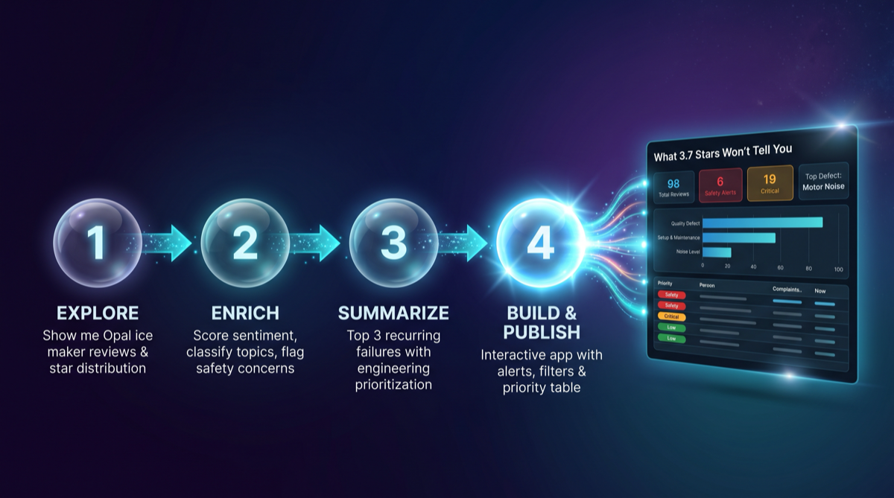
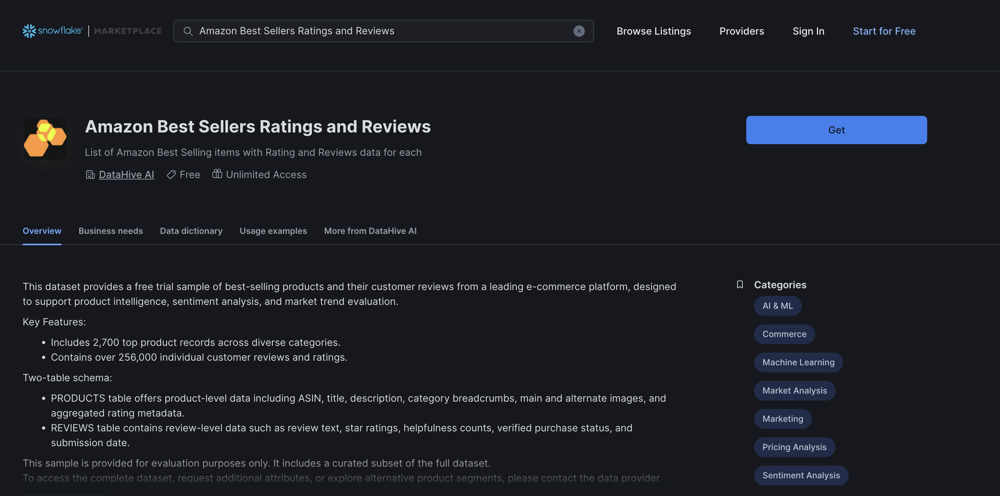
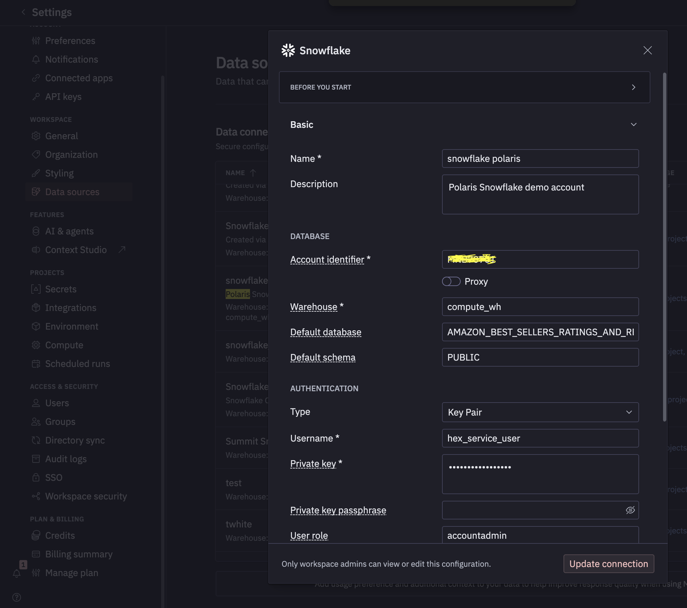
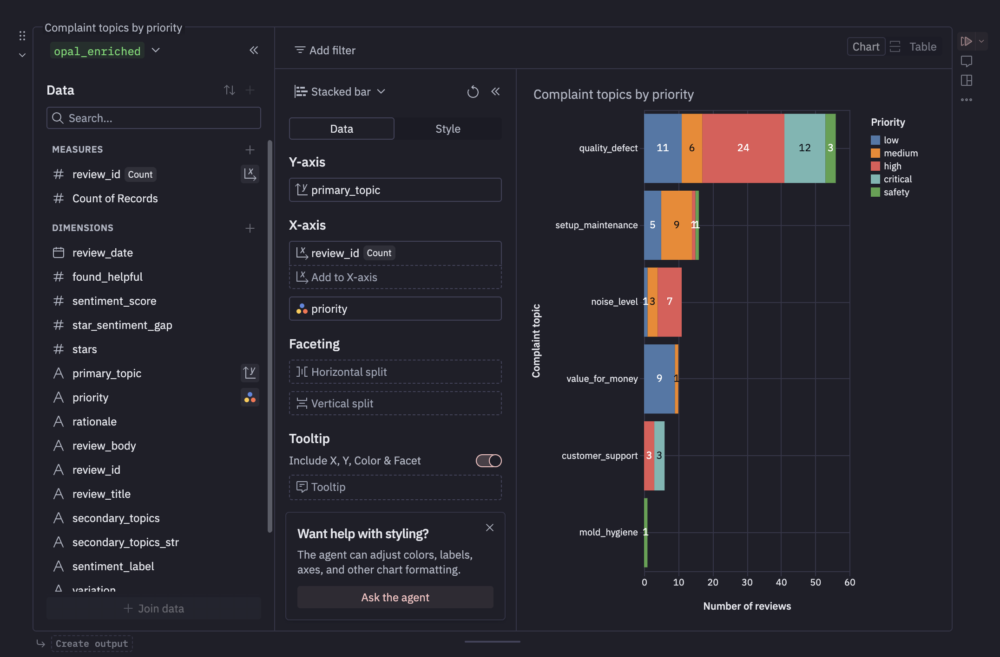
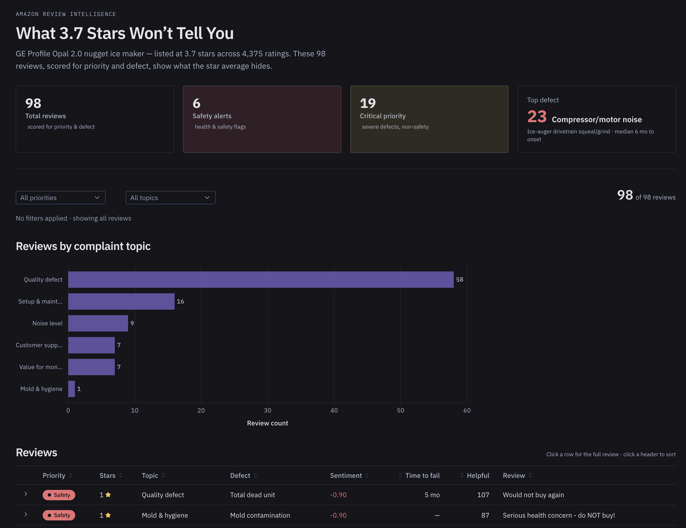

author: Naveen Thomas, Rachel Herrera
id: cortex-ai-functions-hex-review-intelligence
language: en
summary: Build an AI-powered product review intelligence app using Snowflake Cortex AI Functions and Hex Threads — from raw Amazon reviews to a published interactive dashboard in four prompts.
categories: snowflake-site:taxonomy/solution-center/certification/quickstart, snowflake-site:taxonomy/product/ai, snowflake-site:taxonomy/snowflake-feature/cortex-ai-functions, snowflake-site:taxonomy/snowflake-feature/external-collaboration
environments: web
status: Published
feedback link: https://github.com/Snowflake-Labs/sfguides/issues
tags: Snowflake Cortex, Generative AI, Hex, AI Functions, Data Applications, Partner Integrations

# AI-Powered Product Review Intelligence with Cortex AI Functions and Hex
<!-- ------------------------ -->
## Overview
Duration: 5

A product with a 3.7-star rating looks mediocre — maybe worth improving, not worth panicking over. But buried in those reviews could be safety escalations, mold reports, and customers filing complaints — none of which a star average reveals.

In this quickstart, you will use **Hex Threads** (Hex's AI assistant) and **Snowflake Cortex AI Functions** to turn 98 raw Amazon product reviews into a published, interactive review intelligence app — in **four prompts**. You type natural-language instructions into Threads; it generates the SQL using Cortex AI Functions, runs it, and builds the visualizations. No code to write. No models to deploy.



### What You Will Build
- An AI-enriched review analysis pipeline using Cortex AI Functions — generated by Hex Threads from your prompts
- A priority scoring system that surfaces safety and critical issues star ratings miss
- An executive summary synthesized from negative reviews
- A published interactive Hex app with summary cards, filters, charts, and a sortable review table

### What You Will Learn
- How to use Hex Threads to generate Snowflake Cortex AI Function queries from natural language
- How `AI_SENTIMENT`, `AI_CLASSIFY`, `AI_FILTER`, `AI_EXTRACT`, `AI_COMPLETE`, `AI_REDACT`, `AI_AGG`, and `AI_TRANSLATE` work under the hood
- How to layer business logic on top of AI function outputs for priority scoring
- How to go from raw data to a published interactive app without writing code

### Prerequisites
- A [Snowflake account](https://signup.snowflake.com/) in a region where [Cortex AI Functions are supported](https://docs.snowflake.com/en/user-guide/snowflake-cortex/llm-functions#availability)
- A [Hex account](https://hex.tech/) on the **Team plan** or higher — Hex Threads requires the Team plan. If you don't have an account, the [14-day free trial](https://hex.tech/) starts on the Team plan and includes Threads — no credit card required.
- A Snowflake warehouse (e.g., `COMPUTE_WH`) — an X-Small is sufficient for this guide
- Basic familiarity with SQL

<!-- ------------------------ -->
## Get the Data from Snowflake Marketplace
Duration: 3

You will use the **Amazon Best Sellers Ratings and Reviews** dataset, a free listing on Snowflake Marketplace provided by DataHive AI. It contains 256K real customer reviews across 2,700 products.

### Install the Marketplace Listing

1. Open [Snowflake Marketplace](https://app.snowflake.com/marketplace) in Snowsight
2. Search for **"Amazon Best Sellers Ratings and Reviews"**
3. Find the listing by **DataHive AI** (or go directly to the [listing page](https://app.snowflake.com/marketplace/listing/GZTYZ36VTKF))


4. Click **Get** and accept the default database name: `AMAZON_BEST_SELLERS_RATINGS_AND_REVIEWS`
5. Grant access to the roles that will use this data

### Verify the Data

Open a Snowflake worksheet and run:

```sql
SELECT COUNT(*) as total_reviews FROM AMAZON_BEST_SELLERS_RATINGS_AND_REVIEWS.PUBLIC.REVIEWS;
-- Expected: ~256,000 rows

SELECT COUNT(*) as total_products FROM AMAZON_BEST_SELLERS_RATINGS_AND_REVIEWS.PUBLIC.PRODUCTS;
-- Expected: ~2,700 rows
```

### Understand the Schema

The dataset has two tables joined on `ASIN` (Amazon product identifier):

| Table | Key Columns |
|-------|-------------|
| **REVIEWS** | `ID`, `ASIN`, `BODY` (review text), `TITLE`, `STARS` (1-5), `VERIFIED_PURCHASE`, `DATE` |
| **PRODUCTS** | `ASIN`, `TITLE` (product name), `BREADCRUMBS` (category path), `RATING`, `NUMBER_OF_RATINGS` |

> Positive : This is a free dataset — no cost to install and no time limit. The data is static (not live-updating), which is perfect for learning.

<!-- ------------------------ -->
## Set Up Hex
Duration: 3

### Create a New Hex Notebook

1. Log in to [Hex](https://app.hex.tech/). If you don't have an account, [sign up for the free 14-day Team trial](https://hex.tech/) — no credit card required. The trial includes Hex Threads.
2. Click **New Project** → **Notebook**
3. Name it: `Product Review Intelligence — Cortex AI Functions`

### Connect to Snowflake

1. In your Hex notebook, click the **Data sources** panel
2. Select your Snowflake connection (or [create one](https://learn.hex.tech/docs/connect-to-data/data-connections/snowflake))
3. Set the default database to `AMAZON_BEST_SELLERS_RATINGS_AND_REVIEWS` and schema to `PUBLIC`



### Open Threads

Click the **Threads** panel (chat icon) in your notebook. This is where you will type all four prompts. Threads will generate SQL cells, run them, and create visualizations — all from your natural-language instructions.

> Positive : Every prompt in this guide is typed into Hex Threads. Threads generates the SQL using Snowflake Cortex AI Functions, adds it as a notebook cell, and runs it. You can inspect, edit, or re-run any generated cell.

<!-- ------------------------ -->
## Prompt 1: Explore the Data
Duration: 5

### The Prompt

Type this into Hex Threads:

> **"Show me the GE Profile Opal ice maker reviews. I want to see the star distribution and a sample of reviews across all ratings. The product ASIN is B0964BF4N7."**

### What Threads Generates

Threads will create SQL cells that query the REVIEWS and PRODUCTS tables, filter to the GE Opal (ASIN `B0964BF4N7`), and render the star distribution. Expect something like:

**Cell 1 — Product Overview:**

```sql
SELECT 
  p.TITLE as product,
  p.RATING as marketplace_rating,
  p.NUMBER_OF_RATINGS as total_ratings,
  p.BREADCRUMBS as category_path,
  COUNT(r.ID) as reviews_in_dataset,
  ROUND(AVG(r.STARS), 1) as avg_stars_in_sample,
  SUM(CASE WHEN r.STARS <= 2 THEN 1 ELSE 0 END) as negative_reviews,
  SUM(CASE WHEN r.STARS = 3 THEN 1 ELSE 0 END) as neutral_reviews,
  SUM(CASE WHEN r.STARS >= 4 THEN 1 ELSE 0 END) as positive_reviews
FROM AMAZON_BEST_SELLERS_RATINGS_AND_REVIEWS.PUBLIC.PRODUCTS p
JOIN AMAZON_BEST_SELLERS_RATINGS_AND_REVIEWS.PUBLIC.REVIEWS r ON p.ASIN = r.ASIN
WHERE p.ASIN = 'B0964BF4N7' AND r.BODY IS NOT NULL AND LENGTH(r.BODY) > 50
GROUP BY p.TITLE, p.RATING, p.NUMBER_OF_RATINGS, p.BREADCRUMBS;
```

**Cell 2 — Sample Reviews:**

```sql
SELECT 
  r.STARS,
  r.TITLE as review_title,
  LEFT(r.BODY, 300) as review_text,
  r.DATE as review_date
FROM AMAZON_BEST_SELLERS_RATINGS_AND_REVIEWS.PUBLIC.REVIEWS r
JOIN AMAZON_BEST_SELLERS_RATINGS_AND_REVIEWS.PUBLIC.PRODUCTS p ON r.ASIN = p.ASIN
WHERE p.ASIN = 'B0964BF4N7' AND r.BODY IS NOT NULL AND LENGTH(r.BODY) > 50
ORDER BY r.STARS ASC, LENGTH(r.BODY) DESC;
```

### What You Should See

- **GE Profile Opal 2.0 Nugget Ice Maker** — 3.7 stars, ~4,375 total ratings, 98 reviews in the dataset
- A polarized distribution: clusters at 1-star and 5-star with a bulge at 3-star
- 1-star reviews describing mold growth and mechanical failures
- 5-star reviews calling it "the best purchase we've made"
- 3-star reviews that look neutral but describe serious problems

The polarization is visible, but a distribution chart does not tell you *why*. That takes the next prompt.

<!-- ------------------------ -->
## Prompt 2: Enrich with AI
Duration: 10

This is the core of the guide. One prompt turns raw reviews into an AI-enriched intelligence dataset.

### The Prompt

Type this into Hex Threads:

> **"Analyze these Opal reviews: score sentiment (more nuanced than stars), classify each by complaint topic (quality_defect, mold_hygiene, customer_support, noise_level, setup_maintenance, value_for_money), flag reviews where the customer is returning the product or describing a health/safety concern, and prioritize them: safety > critical > high > medium > low."**

### What Threads Generates

Threads will use Snowflake Cortex AI Functions to enrich all 98 reviews in a single query. It may validate on a small sample first (AI functions bill per row), then scale to all reviews. Expect a query using these functions:

```sql
SELECT 
  r.STARS,
  r.TITLE as review_title,
  LEFT(r.BODY, 300) as review_text,

  -- AI_SENTIMENT: nuanced sentiment beyond star ratings
  AI_SENTIMENT(r.BODY):categories[0]:sentiment::VARCHAR as sentiment,

  -- AI_CLASSIFY: categorize into your custom labels
  AI_CLASSIFY(
    r.BODY, 
    ['quality_defect', 'mold_hygiene', 'customer_support', 'noise_level', 
     'setup_maintenance', 'value_for_money']
  ):labels[0]::VARCHAR as complaint_topic,

  -- AI_FILTER: natural-language yes/no question per row
  AI_FILTER(
    PROMPT('The reviewer is returning the product, filing a complaint, 
            warning others not to buy, or describing a health/safety concern: {0}', r.BODY)
  ) as escalation_risk,

  -- Priority scoring: business logic layered on AI outputs
  CASE 
    WHEN AI_FILTER(PROMPT('The reviewer describes a health or safety concern 
        including mold, contamination, or injury: {0}', r.BODY))
    THEN 'safety'
    WHEN AI_SENTIMENT(r.BODY):categories[0]:sentiment::VARCHAR = 'negative' 
      AND AI_FILTER(PROMPT('The reviewer is returning the product, filing a complaint, 
          or warning others not to buy: {0}', r.BODY))
    THEN 'critical'
    WHEN AI_SENTIMENT(r.BODY):categories[0]:sentiment::VARCHAR = 'negative' THEN 'high'
    WHEN AI_SENTIMENT(r.BODY):categories[0]:sentiment::VARCHAR IN ('mixed', 'neutral') THEN 'medium'
    ELSE 'low'
  END as priority

FROM AMAZON_BEST_SELLERS_RATINGS_AND_REVIEWS.PUBLIC.REVIEWS r
JOIN AMAZON_BEST_SELLERS_RATINGS_AND_REVIEWS.PUBLIC.PRODUCTS p ON r.ASIN = p.ASIN
WHERE p.ASIN = 'B0964BF4N7' AND r.BODY IS NOT NULL AND LENGTH(r.BODY) > 50;
```

### What Each AI Function Does

| Function | Purpose | Output |
|----------|---------|--------|
| `AI_SENTIMENT` | Scores emotional tone beyond star ratings | `positive`, `negative`, `mixed`, `neutral` |
| `AI_CLASSIFY` | Categorizes text into your custom labels — no training data needed | The best-matching label |
| `AI_FILTER` | Answers a natural-language yes/no question about the text | `TRUE` / `FALSE` |
| `CASE` expression | Business logic layered on top of AI outputs | `safety`, `critical`, `high`, `medium`, `low` |

### The Key Insight

**3-star reviews are where star ratings lie worst.** A 3-star rating implies "mediocre." But when AI_SENTIMENT analyzes the actual text, over 90% of 3-star reviews are high-severity — describing dead pumps, snapped cylinders, and bacteria in the tubing. The real negative rate is not 29% (1-2 stars); it is closer to 55% once 3-star reviews are properly classified.

Safety flags appear in reviews rated 3 stars or higher — a star-based filter would never surface them.

> Negative : Cortex AI Functions are billed per row processed. The 98-row GE Opal dataset costs fractions of a cent. If you modify the query to process all 256K reviews, expect higher compute costs — use `LIMIT` when exploring.

<!-- ------------------------ -->
## Prompt 2b: Go Deeper with More AI Functions (Optional)
Duration: 10

With the enriched data in your notebook, you can ask Threads follow-up questions that use additional Cortex AI Functions. These are optional — try whichever interest you.

### Extract Specific Defects (AI_EXTRACT)

> **"Extract the specific product defect from each negative review so engineering can triage issues."**

Threads will generate a query using `AI_EXTRACT` to pull structured fields from unstructured text:

```sql
SELECT 
  r.STARS,
  r.TITLE as review_title,
  AI_EXTRACT(
    r.BODY, 
    [{'name': 'defect', 'description': 'The specific mechanical or quality defect experienced by the reviewer'}]
  ):response:description::VARCHAR as extracted_defect,
  LEFT(r.BODY, 200) as review_preview
FROM AMAZON_BEST_SELLERS_RATINGS_AND_REVIEWS.PUBLIC.REVIEWS r
JOIN AMAZON_BEST_SELLERS_RATINGS_AND_REVIEWS.PUBLIC.PRODUCTS p ON r.ASIN = p.ASIN
WHERE p.ASIN = 'B0964BF4N7' 
  AND r.STARS <= 2 
  AND r.BODY IS NOT NULL 
  AND LENGTH(r.BODY) > 100
ORDER BY r.STARS ASC, LENGTH(r.BODY) DESC;
```

Each review becomes a row in a defect database — no manual reading required.

### Draft Customer Service Responses (AI_COMPLETE)

> **"Draft empathetic customer service responses for the most critical reviews so my team can respond faster."**

Threads will use `AI_COMPLETE` with an LLM to generate tailored responses:

```sql
SELECT 
  r.STARS,
  r.TITLE as review_title,
  LEFT(r.BODY, 200) as review_preview,
  AI_COMPLETE(
    'mistral-large2',
    PROMPT('You are a customer support agent. Write a brief, empathetic 2-sentence 
            response to this negative review. Acknowledge the specific issue and offer 
            a concrete next step (replacement, refund, or engineering escalation).

Review: {0}', r.BODY)
  ) as suggested_response
FROM AMAZON_BEST_SELLERS_RATINGS_AND_REVIEWS.PUBLIC.REVIEWS r
JOIN AMAZON_BEST_SELLERS_RATINGS_AND_REVIEWS.PUBLIC.PRODUCTS p ON r.ASIN = p.ASIN
WHERE p.ASIN = 'B0964BF4N7' 
  AND r.STARS = 1 
  AND r.BODY IS NOT NULL 
  AND LENGTH(r.BODY) > 100
  AND AI_FILTER(
    PROMPT('The reviewer is returning the product, filing a complaint, 
            or warning others not to buy: {0}', r.BODY)
  )
LIMIT 10;
```

### Strip PII Before Sharing (AI_REDACT)

> **"Before we share this review data with our manufacturing partner, strip any personal information."**

```sql
SELECT 
  LEFT(r.BODY, 300) as original_review,
  LEFT(AI_REDACT(r.BODY), 300) as safe_for_vendor,
  CASE 
    WHEN r.BODY != AI_REDACT(r.BODY) THEN 'PII detected & removed'
    ELSE 'No PII found'
  END as pii_status
FROM AMAZON_BEST_SELLERS_RATINGS_AND_REVIEWS.PUBLIC.REVIEWS r
JOIN AMAZON_BEST_SELLERS_RATINGS_AND_REVIEWS.PUBLIC.PRODUCTS p ON r.ASIN = p.ASIN
WHERE p.ASIN = 'B0964BF4N7' AND r.BODY IS NOT NULL AND LENGTH(r.BODY) > 100
LIMIT 20;
```

### Translate Multilingual Reviews (AI_TRANSLATE)

> **"We also have international reviews in Spanish. Translate them and run the same analysis."**

```sql
SELECT 
  LEFT(r.BODY, 150) as original_review,
  AI_TRANSLATE(r.BODY, '', 'en') as english_translation,
  AI_SENTIMENT(AI_TRANSLATE(r.BODY, '', 'en')):categories[0]:sentiment::VARCHAR as sentiment,
  AI_CLASSIFY(
    AI_TRANSLATE(r.BODY, '', 'en'), 
    ['product_quality', 'shipping_delivery', 'value_for_money', 'durability', 'customer_service']
  ):labels[0]::VARCHAR as topic,
  r.STARS
FROM AMAZON_BEST_SELLERS_RATINGS_AND_REVIEWS.PUBLIC.REVIEWS r
WHERE r.BODY IS NOT NULL 
  AND LENGTH(r.BODY) > 50
  AND (r.BODY LIKE '%estrellas%' OR r.BODY LIKE '%producto%' 
       OR r.BODY LIKE '%muy bueno%' OR r.BODY LIKE '%excelente%')
LIMIT 10;
```

> Positive : All 8 Cortex AI Functions (`AI_SENTIMENT`, `AI_CLASSIFY`, `AI_FILTER`, `AI_EXTRACT`, `AI_COMPLETE`, `AI_REDACT`, `AI_AGG`, `AI_TRANSLATE`) are SQL-native. Hex Threads knows how to use them — just describe what you want in plain English.

<!-- ------------------------ -->
## Prompt 3: Summarize for the Executive
Duration: 5

### The Prompt

Type this into Hex Threads:

> **"What are customers complaining about? Show me the topic breakdown as a bar chart. Then summarize the top 3 recurring quality issues across all negative reviews in one executive paragraph. Be specific about what's failing, how quickly, and recommend engineering prioritization."**

### What Threads Generates

Threads will create two cells:

**Cell — Topic Distribution (bar chart):**

```sql
SELECT 
  AI_CLASSIFY(
    r.BODY, 
    ['quality_defect', 'mold_hygiene', 'customer_support', 'noise_level', 
     'setup_maintenance', 'value_for_money']
  ):labels[0]::VARCHAR as complaint_topic,
  COUNT(*) as review_count
FROM AMAZON_BEST_SELLERS_RATINGS_AND_REVIEWS.PUBLIC.REVIEWS r
JOIN AMAZON_BEST_SELLERS_RATINGS_AND_REVIEWS.PUBLIC.PRODUCTS p ON r.ASIN = p.ASIN
WHERE p.ASIN = 'B0964BF4N7' 
  AND r.STARS <= 3 
  AND r.BODY IS NOT NULL AND LENGTH(r.BODY) > 50
GROUP BY complaint_topic
ORDER BY review_count DESC;
```



**Cell — Executive Summary (using AI_AGG):**

```sql
SELECT AI_AGG(
  r.BODY, 
  'You are a product analyst writing for the VP of Product. Summarize the top 3 
   recurring quality issues with this ice maker based on these negative reviews. 
   Be specific: name the component that fails, how quickly it fails, and how many 
   reviewers mention it. End with a one-sentence prioritization recommendation 
   for the engineering team. Write one concise paragraph.'
) as executive_summary
FROM AMAZON_BEST_SELLERS_RATINGS_AND_REVIEWS.PUBLIC.REVIEWS r
JOIN AMAZON_BEST_SELLERS_RATINGS_AND_REVIEWS.PUBLIC.PRODUCTS p ON r.ASIN = p.ASIN
WHERE p.ASIN = 'B0964BF4N7' AND r.STARS <= 2 AND r.BODY IS NOT NULL AND LENGTH(r.BODY) > 100;
```

### What You Should See

`AI_AGG` reads across all negative reviews and synthesizes a single output. This is not a generic "summary of reviews" — it is a product engineering brief with component names, failure timelines, and prioritized recommendations. Expect something like:

> *The Opal 2.0's recurring failures center on three components: (1) the ice auger drivetrain — over half of negative reviews describe progressive squealing or grinding starting at ~6 months, with replacement units failing identically; (2) the water-delivery subsystem — sensor faults, pump failures, and leaks; (3) mold contamination in internal tubing, flagged as a health concern in reviews rated 3+ stars where star-based monitoring would miss them. Engineering priority: P0 auger drivetrain redesign, P0 mold mitigation, P1 water pump reliability.*

### Bonus Prompt: Find the Mismatches

> **"Find reviews where the star rating doesn't match the actual sentiment — those are the ones we're misreading."**

```sql
SELECT 
  r.STARS,
  r.TITLE as review_title,
  AI_SENTIMENT(r.BODY):categories[0]:sentiment::VARCHAR as ai_sentiment,
  CASE 
    WHEN r.STARS >= 4 AND AI_SENTIMENT(r.BODY):categories[0]:sentiment::VARCHAR IN ('negative', 'mixed') 
      THEN 'High stars but negative tone — hidden dissatisfaction'
    WHEN r.STARS <= 2 AND AI_SENTIMENT(r.BODY):categories[0]:sentiment::VARCHAR = 'positive' 
      THEN 'Low stars but positive tone — frustrated fan'
  END as mismatch_insight,
  LEFT(r.BODY, 250) as review_text
FROM AMAZON_BEST_SELLERS_RATINGS_AND_REVIEWS.PUBLIC.REVIEWS r
JOIN AMAZON_BEST_SELLERS_RATINGS_AND_REVIEWS.PUBLIC.PRODUCTS p ON r.ASIN = p.ASIN
WHERE p.ASIN = 'B0964BF4N7' 
  AND r.BODY IS NOT NULL AND LENGTH(r.BODY) > 50
  AND (
    (r.STARS >= 4 AND AI_SENTIMENT(r.BODY):categories[0]:sentiment::VARCHAR IN ('negative', 'mixed'))
    OR (r.STARS <= 2 AND AI_SENTIMENT(r.BODY):categories[0]:sentiment::VARCHAR = 'positive')
  );
```

These mismatches are the most interesting reviews — a 4-star review with negative sentiment is hidden dissatisfaction that your team should know about.

<!-- ------------------------ -->
## Prompt 4: Build and Publish the App
Duration: 10

### The Prompt

Type this into Hex Threads:

> **"Build me an interactive app with: summary cards (total reviews, safety alerts, critical count, top defect), filters for priority and complaint topic, a bar chart of topics, and a sortable review table with priority coloring. Title it 'What 3.7 Stars Won't Tell You'. Then publish it."**

### What Threads Generates

Hex Threads generates a **Generative Data App** — a full interactive application with layout, components, and live data. It will:

1. Query the enriched review data
2. Create summary metric cards at the top (98 total, 6 safety alerts, 19 critical, top defect: compressor/motor noise)
3. Add filter dropdowns for priority and complaint topic
4. Build a horizontal bar chart of reviews by complaint topic
5. Create a sortable table with priority-colored badges (Safety=red, Critical=orange, High=yellow)
6. Wire everything together so filters update all components

### Publish

1. Click the **Publish** button in the top-right corner of Hex
2. Choose visibility settings (team, workspace, or public link)
3. Share the URL with stakeholders

The result: a live, interactive review intelligence dashboard that anyone on the team can open — no technical setup required.



> Positive : **See it live:** [Open the published app →](https://app.hex.tech/snowflake/app/033m48khnOyIxAaMb5Sy77/latest)

**From a free Marketplace dataset to a published, AI-powered product intelligence app. One person. One notebook. Four prompts.**

<!-- ------------------------ -->
## (Optional) Production Pipeline with Dynamic Tables
Duration: 5

For production use with live review data, you can wrap the enrichment in a **Snowflake Dynamic Table** that auto-refreshes. This step is run directly in Snowflake (or ask Threads to generate it).

> **"Turn this enrichment into a dynamic table that auto-refreshes every hour."**

### Expected SQL

```sql
CREATE OR REPLACE DYNAMIC TABLE AMAZON_BEST_SELLERS_RATINGS_AND_REVIEWS.PUBLIC.OPAL_REVIEW_INTELLIGENCE
  TARGET_LAG = '1 hour'
  WAREHOUSE = COMPUTE_WH
AS
SELECT 
  r.ID as review_id,
  r.ASIN,
  r.STARS,
  r.TITLE as review_title,
  r.BODY as review_text,
  r.DATE as review_date,
  r.VERIFIED_PURCHASE,

  AI_SENTIMENT(r.BODY):categories[0]:sentiment::VARCHAR as sentiment,
  
  AI_CLASSIFY(
    r.BODY, 
    ['quality_defect', 'mold_hygiene', 'customer_support', 'noise_level', 
     'setup_maintenance', 'value_for_money']
  ):labels[0]::VARCHAR as complaint_topic,
  
  AI_FILTER(
    PROMPT('The reviewer is returning the product, filing a complaint, 
            warning others not to buy, or describing a health/safety concern: {0}', r.BODY)
  ) as escalation_risk,

  AI_EXTRACT(
    r.BODY, 
    [{'name': 'defect', 'description': 'The specific defect, quality issue, or complaint experienced'}]
  ):response:description::VARCHAR as extracted_defect,

  CASE 
    WHEN AI_FILTER(PROMPT('The reviewer describes a health or safety concern 
        including mold, contamination, or injury: {0}', r.BODY))
    THEN 'safety'
    WHEN AI_SENTIMENT(r.BODY):categories[0]:sentiment::VARCHAR = 'negative' 
      AND AI_FILTER(PROMPT('The reviewer is returning the product, filing a complaint, 
          or warning others not to buy: {0}', r.BODY))
    THEN 'critical'
    WHEN AI_SENTIMENT(r.BODY):categories[0]:sentiment::VARCHAR = 'negative' THEN 'high'
    WHEN AI_SENTIMENT(r.BODY):categories[0]:sentiment::VARCHAR IN ('mixed', 'neutral') THEN 'medium'
    ELSE 'low'
  END as priority

FROM AMAZON_BEST_SELLERS_RATINGS_AND_REVIEWS.PUBLIC.REVIEWS r
JOIN AMAZON_BEST_SELLERS_RATINGS_AND_REVIEWS.PUBLIC.PRODUCTS p ON r.ASIN = p.ASIN
WHERE p.ASIN = 'B0964BF4N7' AND r.BODY IS NOT NULL AND LENGTH(r.BODY) > 50;
```

> Positive : Change `WAREHOUSE = COMPUTE_WH` to match your warehouse name. Cortex AI Functions support incremental refresh in Dynamic Tables — you only pay for new rows, not re-processing the entire table.

### Verify the Pipeline

```sql
SELECT priority, complaint_topic, COUNT(*) as cnt
FROM AMAZON_BEST_SELLERS_RATINGS_AND_REVIEWS.PUBLIC.OPAL_REVIEW_INTELLIGENCE
GROUP BY priority, complaint_topic
ORDER BY 
  CASE priority WHEN 'safety' THEN 0 WHEN 'critical' THEN 1 WHEN 'high' THEN 2 WHEN 'medium' THEN 3 ELSE 4 END,
  cnt DESC;
```

In production with live review data, this Dynamic Table refreshes automatically. Point your Hex app at this table instead of the inline queries, and the dashboard always shows current state.

<!-- ------------------------ -->
## Conclusion and Resources
Duration: 2

### What You Built

You built an AI-powered product review intelligence app — from a free Marketplace dataset to a published interactive dashboard — using four prompts in Hex Threads backed by Snowflake Cortex AI Functions. No code written manually. No models deployed. No infrastructure managed.

### What You Learned

- **Hex Threads** generates Cortex AI Function queries from natural language — describe what you want, and it writes the SQL
- **AI_SENTIMENT** reveals nuance that star ratings hide — 3-star reviews can contain serious safety issues
- **AI_CLASSIFY** categorizes unstructured text into your custom labels with no training data
- **AI_FILTER** answers natural-language yes/no questions about each row
- **AI_EXTRACT** pulls structured fields from free-form text (defect names, failure timelines)
- **AI_COMPLETE** generates tailored content (customer service responses) using an LLM
- **AI_REDACT** strips PII for safe data sharing with vendors and partners
- **AI_AGG** synthesizes insights across many rows into executive summaries
- **AI_TRANSLATE** handles multilingual data seamlessly
- **Dynamic Tables** automate AI enrichment pipelines with incremental refresh

### Go Further

This pattern applies beyond product reviews. Swap the data source and classification labels:

| Your Data | Example Labels | Use Case |
|-----------|---------------|----------|
| Support tickets | billing, technical, account, feature_request | Escalation dashboard |
| NPS comments | product, onboarding, pricing, support | Churn risk radar |
| Employee feedback | compensation, management, growth, culture | Retention risk analysis |
| Call transcripts | complaint, inquiry, cancellation, upsell | Revenue intelligence |

### Cleanup

To remove the objects created in this guide:

```sql
DROP DYNAMIC TABLE IF EXISTS AMAZON_BEST_SELLERS_RATINGS_AND_REVIEWS.PUBLIC.OPAL_REVIEW_INTELLIGENCE;
```

The Marketplace dataset (`AMAZON_BEST_SELLERS_RATINGS_AND_REVIEWS`) can be kept for further exploration or removed from **Data Products** → **Installed Listings** in Snowsight.

### Resources

- [Snowflake Cortex AI Functions Documentation](https://docs.snowflake.com/en/user-guide/snowflake-cortex/cortex-ai-functions)
- [Amazon Best Sellers Reviews (free Marketplace listing)](https://app.snowflake.com/marketplace/listing/GZTYZ36VTKF)
- [Hex Documentation — Connecting to Snowflake](https://learn.hex.tech/docs/connect-to-data/data-connections/snowflake)
- [Hex Threads — AI-Powered Notebook Assistant](https://hex.tech/product/threads/)
- [Snowflake Dynamic Tables Documentation](https://docs.snowflake.com/en/user-guide/dynamic-tables-about)
- [Published App: "What 3.7 Stars Won't Tell You"](https://app.hex.tech/snowflake/app/033m48khnOyIxAaMb5Sy77/latest)
- [Blog Post: "What 3.7 Stars Won't Tell You"](https://medium.com/@naveenalan.thomas)
