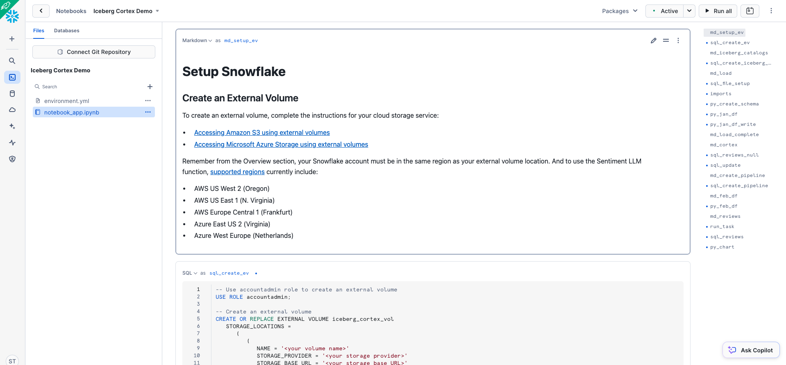
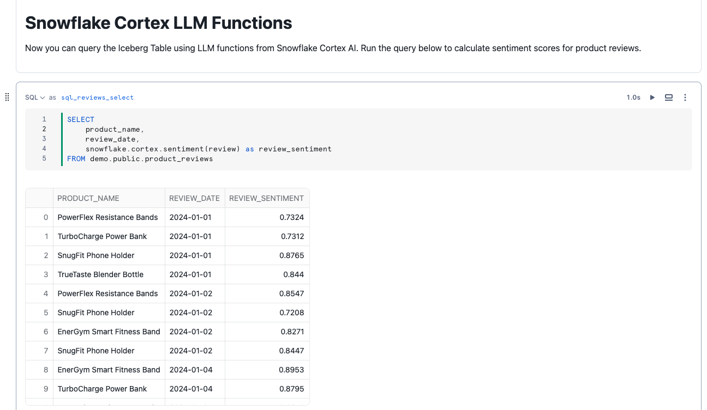
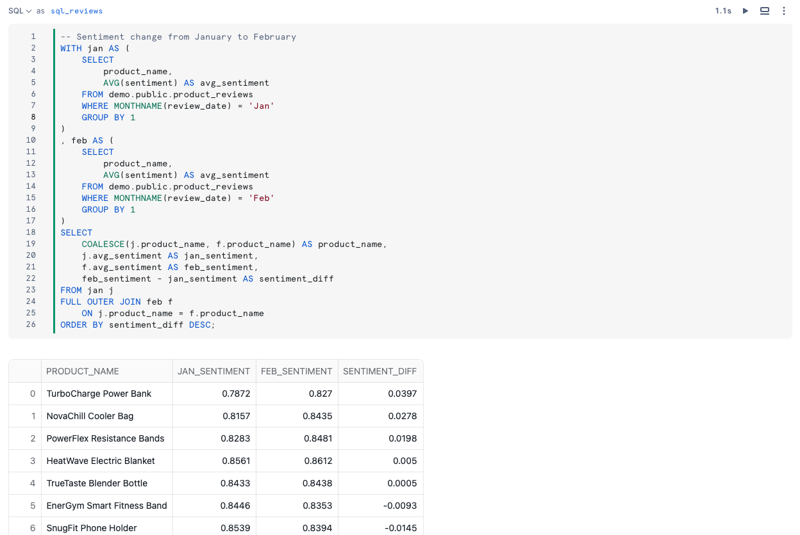

author: Vino Duraisamy, Ron Ortloff, Scott Teal
id: cortex-ai-sentiment-iceberg
categories: snowflake-site:taxonomy/solution-center/certification/quickstart, snowflake-site:taxonomy/solution-center/certification/community-sourced, snowflake-site:taxonomy/solution-center/includes/architecture, snowflake-site:taxonomy/product/ai, snowflake-site:taxonomy/snowflake-feature/lakehouse-analytics, snowflake-site:taxonomy/snowflake-feature/apache-iceberg
language: en
summary: Analyze sentiment on Apache Iceberg™ tables using Snowflake Cortex AI and an open data lakehouse.
environments: web
status: Published 
feedback link: https://github.com/Snowflake-Labs/sfguides/issues


# Sentiment Analysis Using Snowflake Cortex AI on Iceberg Tables
<!-- ------------------------ -->
## Overview 

This guide is designed to help you learn how to bring artificial intelligence (AI) to open data lakehouses with Snowflake Cortex AI and Iceberg Tables.

> 
> 
>  [Snowflake Cortex AI](https://docs.snowflake.com/en/user-guide/snowflake-cortex/llm-functions) is now generally available.
>  [Iceberg Tables](https://docs.snowflake.com/en/user-guide/tables-iceberg) are now generally available.
>  [Snowflake Notebooks](https://docs.snowflake.com/en/user-guide/ui-snowsight/notebooks) are now in public preview.

### Prerequisites
- Familiarity with Snowflake
- Familiarity with cloud object storage
- Familiarity with SQL
- Familiarity with Python
- Familiarity with Apache Iceberg

### What You’ll Learn 
- How to use a Snowflake Notebooks
- How to create a Snowflake-managed Iceberg Table
- How to load data to Iceberg Tables with Snowpark
- How to use LLM functions to generate sentiment predictions
- How to automate CDC pipelines with Streams and Tasks

### What You’ll Need 
- A Snowflake account with access to `ACCOUNTADMIN` role. A [free trial](https://signup.snowflake.com/?utm_source=snowflake-devrel&utm_medium=developer-guides&utm_cta=developer-guides) will suffice. [Standard Edition](https://docs.snowflake.com/en/user-guide/intro-editions#standard-edition) will work for this lab. The account must be in one of these regions:
    - AWS US West 2 (Oregon)
    - AWS US East 1 (N. Virginia)
    - AWS Europe Central 1 (Frankfurt)
    - Azure East US 2 (Virginia)
    - Azure West Europe (Netherlands)
- A storage bucket with the same cloud provider in the same region that hosts your Snowflake account above. Direct credential access required as storage integrations are not supported for External Volumes.

### What You’ll Build 
- A open data lakehouse with Iceberg
- An automated CDC pipeline to process data using an LLM

<!-- ------------------------ -->
## Setup Snowflake

### Create Database and Warehouse
Create a separate database and warehouse for this demo.

```sql
CREATE OR REPLACE DATABASE demo;
CREATE OR REPLACE WAREHOUSE demo_wh;
USE DATABASE demo;
USE WAREHOUSE demo_wh;
```
### Create a Snowflake Notebook
Create a Snowflake Notebook for this demo following these steps:
1. Download the ipynb file [here](https://github.com/Snowflake-Labs/sf-samples/blob/main/samples/iceberg_cortex/snowflake.ipynb).
2. From Snowsight, click **Projects** > **Notebooks** > in the top-right dropdown **Import .ipynb file**. Select the downloaded snowflake.ipynb file.
3. Choose the **DEMO** database, **PUBLIC** schema, and **DEMO_WH** warehouse, and click **Create**.

The Snowflake Notebook you've created has the code needed for this demo, which are also available in the remainder of this quickstart guide.



### Create an External Volume
Before you create an Iceberg table, you must have an external volume. An external volume is a Snowflake object that stores information about your cloud storage locations and identity and access management (IAM) entities (for example, IAM roles). Snowflake uses an external volume to establish a connection with your cloud storage in order to access Iceberg metadata and Parquet data.

To create an external volume, complete the instructions for your cloud storage service:
- [Accessing Amazon S3 using external volumes](https://docs.snowflake.com/en/user-guide/tables-iceberg-configure-external-volume-s3)
- [Accessing Microsoft Azure Storage using external volumes](https://docs.snowflake.com/en/user-guide/tables-iceberg-configure-external-volume-azure)

Remember from the Overview section, your Snowflake account must be in the same region as your external volume location. And to use the Sentiment LLM function, supported regions currently include:
- AWS US West 2 (Oregon)
- AWS US East 1 (N. Virginia)
- AWS Europe Central 1 (Frankfurt)
- Azure East US 2 (Virginia)
- Azure West Europe (Netherlands)

Prior to creating the external volume, be sure to use the `ACCOUNTADMIN` role.

```sql
-- Use accountadmin role to create an external volume
USE ROLE accountadmin;

-- Create an external volume
CREATE OR REPLACE EXTERNAL VOLUME iceberg_cortex_vol
   STORAGE_LOCATIONS =
      (
         (
            NAME = '<your volume name>'
            STORAGE_PROVIDER = '<your storage provider>'
            STORAGE_BASE_URL = '<your storage base URL>'
            
            STORAGE_AWS_ROLE_ARN = '<your role arn>'
            STORAGE_AWS_EXTERNAL_ID = '<your external ID>'

            AZURE_TENANT_ID = '<your tenant ID>'
         )
      );
```

Name the external volume you create `iceberg_cortex_vol`.

<!-- ------------------------ -->
### Create an Iceberg Table

Iceberg Tables can currently use Snowflake, AWS Glue, or object storage as the catalog. In public preview soon, Snowflake can use catalog integration with an Iceberg REST endpoint. In this quickstart, use Snowflake as the catalog to allow read and write operations to the table. More information about integrating catalogs can be found [here](https://docs.snowflake.com/en/user-guide/tables-iceberg-configure-catalog-integration).

Create an Iceberg Table referencing the external volume you just created. You can specify `BASE_LOCATION` to instruct Snowflake where to write table data and metadata, or leave empty to write data and metadata to the location specified in the external volume definition.

```sql
CREATE OR REPLACE ICEBERG TABLE demo.public.product_reviews (
    id STRING,
    product_name STRING,
    product_id STRING,
    reviewer_name STRING,
    review_date DATE,
    review STRING,
    sentiment FLOAT
)
    CATALOG = 'SNOWFLAKE'
    EXTERNAL_VOLUME = 'iceberg_cortex_vol'
    BASE_LOCATION = 'demo/product_reviews/'
;
```

## Load CSV files into Iceberg via Snowpark Python

There are multiple ways to load new data into Snowflake-managed Iceberg Tables including INSERT, [COPY INTO](https://docs.snowflake.com/en/sql-reference/sql/copy-into-table), and [Snowpipe](https://docs.snowflake.com/en/user-guide/data-load-snowpipe-auto).

For this quickstart, we will INSERT data from the sample tables in your Snowflake account to an Iceberg Table. Snowflake will write Parquet files and Iceberg metadata to your external volume.

First, create an external stage and file format.

```sql
-- Create a file format
CREATE OR REPLACE FILE FORMAT demo.public.csv_ff
    TYPE = 'CSV'
    FIELD_OPTIONALLY_ENCLOSED_BY = '"'
    SKIP_HEADER = 1;

-- Create an external stage to read CSV files from an S3 bucket in-place
CREATE OR REPLACE STAGE demo.public.files
    URL = 's3://sfquickstarts/iceberg_cortex/'
    FILE_FORMAT = demo.public.csv_ff
    DIRECTORY = (ENABLE = TRUE);
```

### Create a Snowpark DataFrame
To read the CSV files from Amazon S3 into a dataframe, first create a Snowpark session.

```python
import json|
from snowflake.snowpark import Session
import snowflake.snowpark.types as T

session = get_active_session()
```

Create a schema Snowpark dataframe matching the CSV files

```python
reviews_schema = T.StructType([T.StructField("ID", T.StringType()),
                               T.StructField("PRODUCT_NAME", T.StringType()),
                               T.StructField("PRODUCT_ID", T.StringType()),
                               T.StructField("REVIEWER_NAME", T.StringType()),
                               T.StructField("REVIEW_DATE", T.DateType()),
                               T.StructField("REVIEW", T.StringType()),
                               T.StructField("SENTIMENT", T.FloatType())])
```

Read the CSV files into a dataframe named `jan_df` using the defined schema, and view the dataframe.

```python
jan_df = session.read \
    .schema(reviews_schema) \
    .option("skip_header", 1) \
    .option("field_optionally_enclosed_by", '"') \
    .csv("@demo.public.files/product_reviews_jan_24.csv")

jan_df.show()
```

Write the dataframe to the Iceberg Table.

```python
jan_df.write.mode("append").save_as_table("demo.public.product_reviews")
```

You now see metadata files and Parquet data files in your object storage, whether you’re using Amazon S3 or Azure storage.


## Snowflake Cortex LLM Functions

Now you can query the Iceberg Table using LLM functions from Snowflake Cortex. Run the query below to calculate sentiment scores for product reviews.

```sql
SELECT
    id,
    product_name,
    review_date,
    snowflake.cortex.sentiment(review) as review_sentiment
FROM demo.public.product_reviews
```



Write the sentiment scores back to the Iceberg Table. With Snowflake Notebooks, you can reference the results of previous cells in your notebook.

```sql
UPDATE demo.public.product_reviews AS pr
   SET sentiment = jan.review_sentiment
  FROM {{sql_reviews_jan}} AS jan
 WHERE jan.id = pr.id;
```

## Create a CDC Pipeline

Suppose new product reviews continue to be generated, stored as new CSV files, and you'd like to use Snowflake to automatically compute sentiment scores on new product reviews.

[Streams on Directory Tables](https://docs.snowflake.com/en/user-guide/data-load-dirtables-pipeline) can detect new files in stages, perform computation, and store results. LLM functions from Snowflake Cortex can be called in these pipelines, writing results to Iceberg Tables.

To simulate this, create a Stream on the Iceberg Table to detect new product reviews loaded to the table. On a schedule, a Serverless Task will call the SENTIMENT function on to incrementally process new records.

```sql
-- Create a Stream to detect new product review records in the Iceberg Table
CREATE OR REPLACE STREAM demo.public.product_reviews_stream ON TABLE demo.public.product_reviews;

-- Create a Serverless Task to add sentiment for new records from the Stream
CREATE OR REPLACE TASK demo.public.cortex_sentiment_score
    SCHEDULE = 'USING CRON 0 0 * * * America/Los_Angeles'
    USER_TASK_MANAGED_INITIAL_WAREHOUSE_SIZE = 'XSMALL'
AS
UPDATE demo.public.product_reviews AS pr
   SET sentiment = snowflake.cortex.sentiment(prs.review)
  FROM demo.public.product_reviews_stream AS prs
 WHERE prs.id = pr.id;
```

Now see the incremental processing pipeline in action. Create a dataframe for February product reviews and write it to the Iceberg Table.

```python
feb_df = session.read \
    .schema(reviews_schema) \
    .option("skip_header", 1) \
    .option("field_optionally_enclosed_by", '"') \
    .csv("@demo.public.files/product_reviews_feb_24.csv")

feb_df.write.mode("append").save_as_table("demo.public.product_reviews")
```

The Task will execute on the specified schedule. Manually trigger the task to calculate sentiment scores for February product reviews, writing the results back to the Iceberg Table. Now, you should see the February product reviews and sentiment scores.

For example, for each product, what was the change in sentiment from January to February? Run the query below.

```sql
-- Manually trigger Task
EXECUTE TASK demo.public.cortex_sentiment_score;

-- Sentiment change from January to February
WITH jan AS (
    SELECT
        product_name,
        AVG(sentiment) AS avg_sentiment
    FROM demo.public.product_reviews
    WHERE MONTHNAME(review_date) = 'Jan'
    GROUP BY 1
)
, feb AS (
    SELECT
        product_name,
        AVG(sentiment) AS avg_sentiment
    FROM demo.public.product_reviews
    WHERE MONTHNAME(review_date) = 'Feb'
    GROUP BY 1
)
SELECT
    COALESCE(j.product_name, f.product_name) AS product_name,
    j.avg_sentiment AS jan_sentiment,
    f.avg_sentiment AS feb_sentiment,
    feb_sentiment - jan_sentiment AS sentiment_diff
FROM jan j
FULL OUTER JOIN feb f
    ON j.product_name = f.product_name
ORDER BY sentiment_diff DESC;
```



And you can use Streamlit to visualize the results from your SQL query by referencing the previous cell.

```python
import streamlit as st

st.bar_chart(sql_reviews.to_df(), x='SENTIMENT_DIFF', y='PRODUCT_NAME')
```

<!-- ------------------------ -->
## Access Iceberg Tables from Apache Spark

Suppose another team that uses Spark wants to read the Snowflake-managed Iceberg Table using their Spark clusters. They can use the Snowflake Iceberg Catalog SDK to access snapshot information, and directly access data and metadata in object storage, all without using any Snowflake warehouses.

### Setup your Apache Spark Environment

In this quickstart, you can use Conda to easily create a development environment and download necessary packages. This is only needed if you choose to follow the last section for using Spark to read Snowflake-managed Iceberg Tables. This is not required to create or use Iceberg Tables on Snowflake. Here are instructions for installing Conda:
- [Mac](https://docs.conda.io/projects/conda/en/latest/user-guide/install/macos.html)
- [Windows](https://docs.conda.io/projects/conda/en/stable/user-guide/install/linux.html)
- [Linux](https://docs.conda.io/projects/conda/en/stable/user-guide/install/linux.html)

Either download [this file](https://github.com/Snowflake-Labs/sf-samples/blob/main/samples/iceberg_cortex/environment.yml), or create a file named environment.yml with the following contents.

```yaml
name: iceberg-cortex-demo
channels:
  - conda-forge
dependencies:
  - findspark=2.0.1
  - jupyter=1.0.0
  - pyspark=3.5.0
  - openjdk=11.0.13
  - python=3.11.6
  - python-dotenv
  - snowflake-snowpark-python
```

To create the environment needed, run the following in your shell.

```
conda env create -f environment.yml
```

### Run Apache Spark
From your terminal, run the following commands to activate the virtual environment you created in the setup, and open jupyter notebooks.

```
conda activate iceberg-cortex-demo
jupyter notebook
```

Download the [spark.ipynb notebook here](https://github.com/Snowflake-Labs/sf-samples/blob/main/samples/iceberg_cortex/spark.ipynb) and [.env file here](https://github.com/Snowflake-Labs/sf-samples/blob/main/samples/iceberg_cortex/.env) in the same directory. Update the values in the .env file for your setup, then open the notebook with Jupyter. Update and run the cells that are applicable to the cloud in which your Snowflake account is located.


<!-- ------------------------ -->
## Cleanup

To delete all of the objects created in this guide, you can drop the database, warehouse, and external volume.

```sql
DROP DATABASE demo;
DROP WAREHOUSE demo_wh;
DROP EXTERNAL VOLUME s3_vol;
```

To delete the Conda environment, run the following in your shell.

```
conda deactivate
conda remove -n iceberg-cortex-demo --all
```

<!-- ------------------------ -->
## Conclusion

Congratulations! You've successfully augmented an Iceberg open data lakehouse on Snowflake with Cortex.

### What You Learned
- How to create a Snowflake-managed Iceberg Table
- How to augment Iceberg Table with Snowflake Cortex LLM functions
- How Snowflake can be used for Iceberg Table pipelines
- How to access a Snowflake-managed Iceberg Table from Apache Spark

### Related Resources
- [Snowflake Documentation for Iceberg Tables](https://docs.snowflake.com/en/user-guide/tables-iceberg)
- [Snowflake Cortex AI Documentation](https://docs.snowflake.com/en/user-guide/snowflake-cortex/llm-functions)
- [Snowflake Notebooks Documentation](https://docs.snowflake.com/en/user-guide/ui-snowsight/notebooks)
- [Fork Repo on GitHub](https://github.com/Snowflake-Labs/sf-samples/tree/main/samples/iceberg_cortex)
- [Download Reference Architecture](/content/dam/snowflake-site/developers/2024/03/Product-Review-Sentiment-Analysis-using-Snowflake-Cortex-and-Iceberg-Tables.pdf)
- [Read the Blog](https://medium.com/snowflake/how-to-use-llama-2-on-iceberg-tables-for-sentiment-analysis-with-snowflake-cortex-32c030a8102b)
- [Watch the Demo](https://youtu.be/Roko9aqtzl8?list=TLGGn1_ln-U6mk8yNDA5MjAyNQ)
