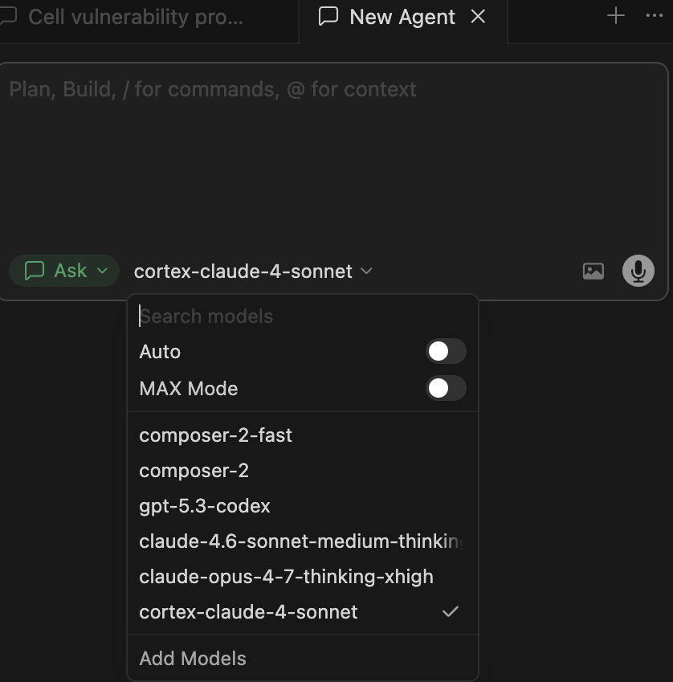

author: Priya Joseph
id: cortex-cursor-integration-custom
categories: snowflake-site:taxonomy/solution-center/certification/quickstart, snowflake-site:taxonomy/product/ai, snowflake-site:taxonomy/snowflake-feature/cortex-llm-functions
environments: web
status: Published
feedback link: https://github.com/Snowflake-Labs/sfguides/issues
summary: Route the Cursor coding agent's chat completions to Snowflake Cortex (claude-4-sonnet) via a local LiteLLM proxy.
language: en


# Integrating Cortex API with Cursor Agent

A quickstart for routing the Cursor Agent's chat completions to **Snowflake Cortex** (`claude-4-sonnet`) via a local LiteLLM proxy.

> A local proxy pattern that exposes Snowflake Cortex's REST API as an OpenAI-compatible endpoint so any OpenAI-compatible coding agent can use it as a backend.



---

## Why a proxy?

Cursor's "Add Models" dialog only accepts **OpenAI-compatible** endpoints (`POST /v1/chat/completions`). Snowflake Cortex's REST API uses its own request/response schema (`POST /api/v2/cortex/inference:complete` with header `X-Snowflake-Authorization-Token-Type`). LiteLLM has a built-in `snowflake/` provider that translates between the two, so we run it locally as a 1-command proxy.

```
Cursor Agent ── OpenAI /v1/chat/completions ──▶ LiteLLM (localhost:4000) ──▶ Snowflake Cortex /api/v2/cortex/inference:complete
```

---

## Prerequisites

- Cursor (Pro / Business / Enterprise — see "Team API key restriction" at the bottom).
- Python 3.10+ available locally.
- A Snowflake account with **Cortex** enabled in your region. This guide was verified on `AWS_US_WEST_2` with model `claude-4-sonnet`.
- A Snowflake **Programmatic Access Token (PAT)** scoped to a role that has `USAGE` on Cortex. Generate from Snowsight → your profile → *Programmatic access tokens*.

---

## 1. Verify Cortex availability

In a Snowflake worksheet:

```sql
USE WAREHOUSE <your_wh>;
SELECT CURRENT_REGION();
SELECT SNOWFLAKE.CORTEX.COMPLETE('claude-4-sonnet', 'ping');
```

If `claude-4-sonnet` is unavailable in your region, swap to another supported Claude model (e.g. `claude-3-5-sonnet`, `claude-3-7-sonnet`) and use that name everywhere below.

---

## 2. Smoke-test the REST endpoint

```bash
ACCOUNT_HOST="<youraccount>.snowflakecomputing.com"   
PAT="<your_pat>"

curl -sS https://$ACCOUNT_HOST/api/v2/cortex/inference:complete \
  -H "Content-Type: application/json" \
  -H "Authorization: Bearer $PAT" \
  -H "X-Snowflake-Authorization-Token-Type: PROGRAMMATIC_ACCESS_TOKEN" \
  -d '{"model":"claude-4-sonnet","messages":[{"role":"user","content":"ping"}],"max_tokens":20}'
```

Expect a `data:`-prefixed SSE stream ending with a `usage` block. If you get 401 / 403, double-check the PAT and role grants.

---

## 3. Install LiteLLM in an isolated venv

```bash
mkdir -p ~/cursor-cortex && cd ~/cursor-cortex
python3 -m venv .venv
.venv/bin/pip install --upgrade pip
.venv/bin/pip install 'litellm[proxy]'
.venv/bin/litellm --version   # tested on 1.83.14
```

---

## 4. Author `litellm_config.yaml`

```yaml
model_list:
  - model_name: cortex-claude-4-sonnet
    litellm_params:
      model: snowflake/claude-4-sonnet
      api_base: https://<youraccount>.snowflakecomputing.com/api/v2
      api_key: os.environ/SNOWFLAKE_PAT      # MUST be prefixed with `pat/` — see below
      stream: true

litellm_settings:
  drop_params: true
  num_retries: 2
  request_timeout: 120

general_settings:
  master_key: os.environ/LITELLM_MASTER_KEY
  disable_spend_logs: true
```

> **Important**: LiteLLM's Snowflake provider defaults to `KEYPAIR_JWT` auth. To use a PAT, the API key must literally start with `pat/`. We do this in the `.env` file below.

---

## 5. Create `.env` (mode 0600)

```bash
cat > .env <<EOF
SNOWFLAKE_PAT=pat/<your_pat>
LITELLM_MASTER_KEY=sk-cursor-$(python3 -c 'import secrets;print(secrets.token_urlsafe(24))')
EOF
chmod 600 .env
```

---

## 6. Create `run-proxy.sh`

```bash
#!/bin/bash
set -euo pipefail
DIR="$(cd "$(dirname "$0")" && pwd)"
set -a; source "$DIR/.env"; set +a
exec "$DIR/.venv/bin/litellm" \
  --config "$DIR/litellm_config.yaml" \
  --port 4000 --host 127.0.0.1
```

```bash
chmod +x run-proxy.sh
./run-proxy.sh    # leave running; logs stream to stdout
```

Verify:

```bash
source .env
curl -sS http://127.0.0.1:4000/v1/models -H "Authorization: Bearer $LITELLM_MASTER_KEY"
curl -sS http://127.0.0.1:4000/v1/chat/completions \
  -H "Authorization: Bearer $LITELLM_MASTER_KEY" \
  -H "Content-Type: application/json" \
  -d '{"model":"cortex-claude-4-sonnet","messages":[{"role":"user","content":"ping"}]}'
```

You should see standard OpenAI-shape JSON.

---

## 7. Configure Cursor (3.x)

1. In any Cursor chat, click the **model picker** (e.g. `composer-2-fast`).
2. At the bottom of the popup, click **Add Models**.
3. Choose **OpenAI** (or "OpenAI-compatible") and enter:
   - **Base URL**: `http://127.0.0.1:4000/v1`
   - **API Key**: the value of `LITELLM_MASTER_KEY` from `.env`
   - **Model name**: `cortex-claude-4-sonnet`
4. Save / Verify. Select `cortex-claude-4-sonnet` in the picker.

---

## 8. Verify end-to-end

- Send a chat message in Cursor → request appears in the LiteLLM stdout log.
- After ~1–2h, confirm token usage in Snowflake:

  ```sql
  SELECT MODEL_NAME, SUM(TOKENS) AS tokens
  FROM SNOWFLAKE.ACCOUNT_USAGE.CORTEX_REST_API_USAGE_HISTORY
  WHERE START_TIME >= DATEADD(hour, -3, CURRENT_TIMESTAMP())
  GROUP BY 1;
  ```

---

## Team API key restriction

If Cursor shows:

> *Your team has disabled OpenAI API keys. Please disable your API key in Cursor Settings > Models.*

…your Cursor admin has turned off BYOK at the team level. Options:

- Ask the admin to enable **"Allow custom OpenAI API keys"** in the Cursor team console.
- Or use the proxy from a **personal/non-team Cursor account** that doesn't inherit the policy.
- Or, instead of Cursor, point any OpenAI-compatible client (Continue.dev, Aider, Open WebUI, custom scripts) at the same `http://127.0.0.1:<port>/v1` proxy — they have no such restriction.

---

## Troubleshooting

| Symptom | Cause | Fix |
|---|---|---|
| `401 Unauthorized` from Cortex | PAT missing or expired | Regenerate PAT, update `.env`, restart proxy |
| `Missing Snowflake JWT key` from LiteLLM | `SNOWFLAKE_PAT` not in env | `set -a; source .env; set +a` before launching |
| Proxy returns `KEYPAIR_JWT` auth error | Forgot `pat/` prefix | `SNOWFLAKE_PAT=pat/<token>` in `.env` |
| `Model "claude-x-y" is unavailable` | Model not in your region | `SHOW FUNCTIONS LIKE 'COMPLETE%'` and try a supported Claude variant |
| Cursor "Verify" button fails | Proxy not running on `127.0.0.1:<port>` | `lsof -i:<port>`; restart `run-proxy.sh` |

---

## File layout

```
~/cursor-cortex/
├── .env                  # SNOWFLAKE_PAT + LITELLM_MASTER_KEY (mode 0600)
├── .venv/                # isolated python env w/ litellm[proxy]
├── litellm_config.yaml   # model_list + master key reference
└── run-proxy.sh          # source .env && exec litellm
```
