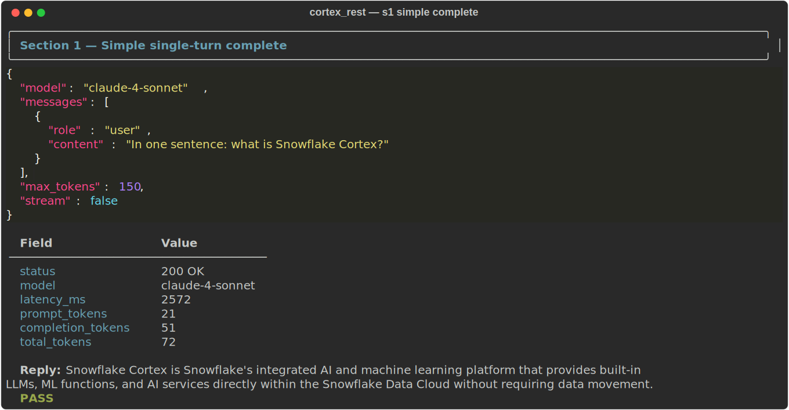
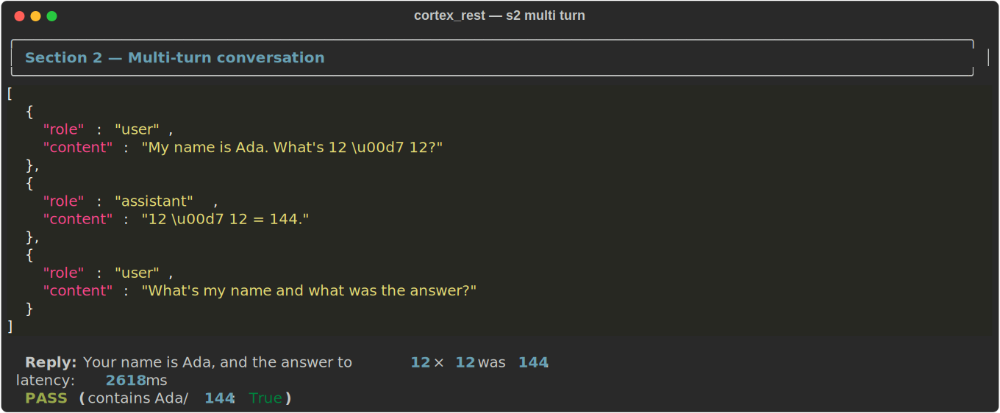
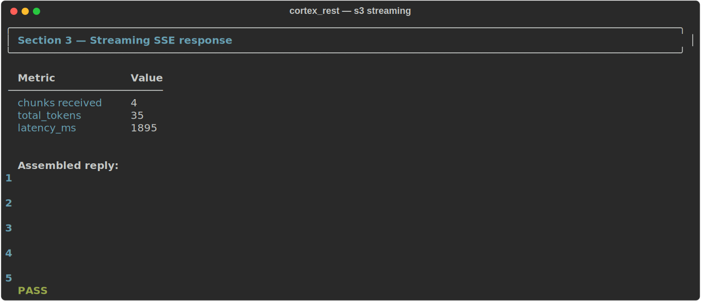
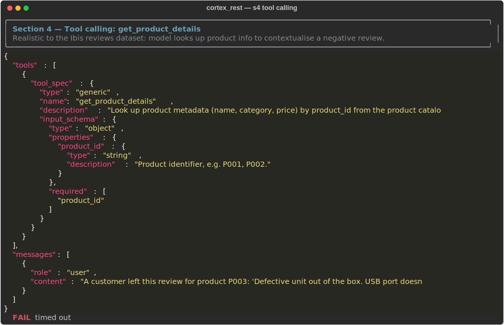
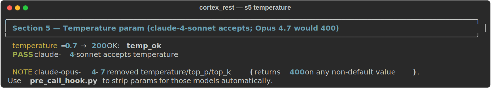
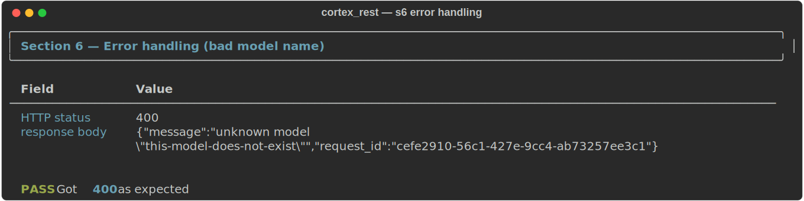
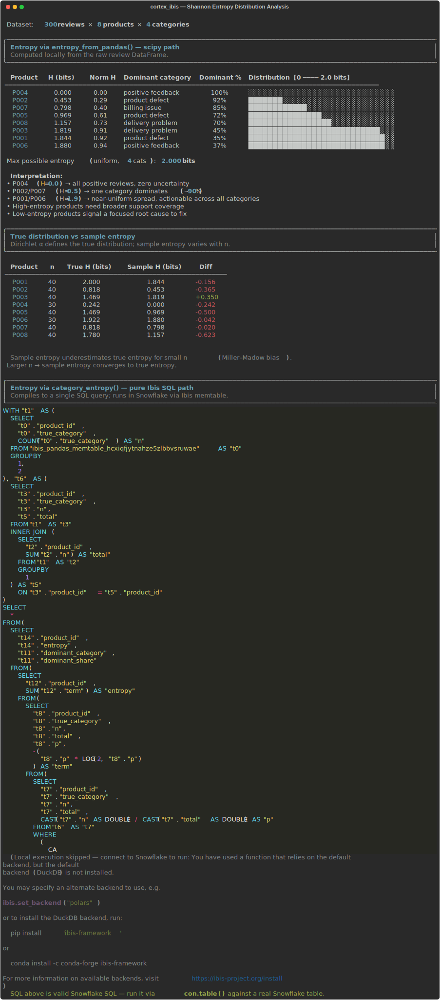

author: Priya Joseph
id: cortex-inference-ibis-integration-skills
categories: snowflake-site:taxonomy/solution-center/certification/quickstart, snowflake-site:taxonomy/product/ai, snowflake-site:taxonomy/snowflake-feature/cortex-llm-functions
environments: web
status: Published
feedback link: https://github.com/Snowflake-Labs/sfguides/issues
summary: Build AI-enriched data pipelines in Python using Snowflake Cortex AI functions via Ibis, compute vector embeddings with TurboPuffer ANN/hybrid search, analyze review category distributions with Shannon entropy, and install reusable Cortex Code (CoCo) skills — all without writing raw SQL but using Cortex Inference.
language: en


<<<<<<< HEAD
# Snowflake Cortex Inference, Cortex + Ibis: AI Enrichment, Vector Search & Distribution Analysis

A hands-on guide to **Snowflake Cortex AI functions via Ibis**, covering the full pipeline from LLM enrichment and vector embeddings to TurboPuffer hybrid search, Shannon entropy distribution analysis, and installing reusable **Cortex Code (CoCo) skills**. Also includes direct Cortex Inference access with PAT/JWT auth, streaming SSE, and tool calling.
=======
# Snowflake Cortex Inference, Cortex + Ibis: AI Enrichment, TurboPuffer Vector Search & Distribution Analysis

A hands-on guide to **Snowflake Cortex AI functions via Ibis**, covering the full pipeline from LLM enrichment and vector embeddings to TurboPuffer hybrid search, Shannon entropy distribution analysis, and installing reusable **Cortex Code (CoCo) skills**. Also includes direct Cortex Inference, REST API access with PAT/JWT auth, streaming SSE, and tool calling.
>>>>>>> 45edc0888 (removed __pycache__)

All examples use the `cortex_rest.py` client included in this workspace.

---

## Architecture

```
Python client (httpx)
  ├── Auth: PAT  → Authorization: Bearer <token>
  │               X-Snowflake-Authorization-Token-Type: PROGRAMMATIC_ACCESS_TOKEN
  └── Auth: JWT  → Authorization: Bearer <signed_jwt>
                   X-Snowflake-Authorization-Token-Type: KEYPAIR_JWT
       ↓
POST https://<account>.snowflakecomputing.com/api/v2/cortex/inference:complete
       ↓
  Snowflake Cortex (claude-4-sonnet, llama3.3-70b, mistral-large2, ...)
```

---

## Prerequisites

```bash
pip install httpx PyJWT cryptography rich
```

- Snowflake account with Cortex enabled.
- PAT (Programmatic Access Token) in `~/.snowflake/config.toml`, or an RSA key pair registered on your user.

All runnable code lives under `assets/`. Run scripts from that directory:

```bash
cd assets
python distribution_demo.py
python test_cortex_rest.py
```

---

## Section 0 — Auth Check

Verifies that the PAT loads correctly from `~/.snowflake/config.toml` and shows the endpoint that will be called.

```python
from cortex_rest import _load_pat

host, token = _load_pat()           # reads connections.myaccount.password
print(host)                          # e.g. myorg-myaccount.snowflakecomputing.com
print(token[:8] + "...")             # eyJraWQi...
```

---

## Section 1 — Simple Single-Turn Complete

Non-streaming completion with token usage stats.

```python
from cortex_rest import CortexInferenceClient

client = CortexInferenceClient()     # auto PAT from config.toml
resp = client.complete(
    "claude-4-sonnet",
    [{"role": "user", "content": "In one sentence: what is Snowflake Cortex?"}],
    max_tokens=150,
)
print(resp["choices"][0]["message"]["content"])
print(resp["usage"])   # {'prompt_tokens': 21, 'completion_tokens': 51, 'total_tokens': 72}
```

**Screenshot:**



---

## Section 2 — Multi-Turn Conversation

Pass the full conversation history; Cortex maintains context.

```python
messages = [
    {"role": "user",      "content": "My name is Ada. What's 12 × 12?"},
    {"role": "assistant", "content": "12 × 12 = 144."},
    {"role": "user",      "content": "What's my name and what was the answer?"},
]
resp = client.complete("claude-4-sonnet", messages, max_tokens=120)
# → "Your name is Ada, and the answer to 12 × 12 was 144."
```

**Screenshot:**



---

## Section 3 — Streaming SSE Response

The endpoint returns [Server-Sent Events](https://developer.mozilla.org/en-US/docs/Web/API/Server-sent_events). `complete_stream()` parses the `data:` lines and yields token chunks incrementally.

```python
for chunk in client.complete_stream(
    "claude-4-sonnet",
    [{"role": "user", "content": "Count slowly from 1 to 5, one number per line."}],
    max_tokens=80,
):
    delta = chunk["choices"][0]["delta"]
    text  = delta.get("content") or delta.get("text", "")
    print(text, end="", flush=True)

# Raw SSE shape:
# data: {"id":"...", "model":"claude-4-sonnet",
#        "choices":[{"delta":{"type":"text","content":"1\n","text":"1\n"}}], "usage":{}}
# data: {"id":"...", ..., "usage":{"prompt_tokens":15,"completion_tokens":20,"total_tokens":35}}
```

**Screenshot:**



---

## Section 4 — Tool Calling (Function Calling)

Snowflake uses `tool_spec` format. Here the model is asked to draft a customer-service reply to a defective-product review — but first it must call `get_product_details(product_id)` to look up the product's metadata. This mirrors the `product_id` field in the `cortex_ibis` reviews dataset (P001–P005).

```python
tools = [{
    "tool_spec": {
        "type": "generic",
        "name": "get_product_details",
        "description": "Look up product metadata (name, category, price) by product_id from the product catalog.",
        "input_schema": {
            "type": "object",
            "properties": {
                "product_id": {"type": "string", "description": "Product identifier, e.g. P001, P002."},
            },
            "required": ["product_id"],
        },
    }
}]

# Review from the turbopuffer_demo dataset — product P003, defective unit
messages = [{
    "role": "user",
    "content": (
        "A customer left this review for product P003: "
        "'Defective unit out of the box. USB port doesn't work at all.' "
        "Before drafting a response, look up the product details for P003."
    ),
}]

resp = client.complete("claude-4-sonnet", messages, tools=tools, max_tokens=250)

# Model responds with a tool_use call:
# [{"type": "tool_use", "tool_use": {"name": "get_product_details", "input": {"product_id": "P003"}}}]
```

**Screenshot:**



---

## Section 5 — Temperature & Sampling Parameters

`claude-4-sonnet` accepts `temperature`, `top_p`, `top_k`. **Note:** these parameters were removed for `claude-opus-4-7` and newer (any non-default value returns 400).

```python
# Works for claude-4-sonnet:
resp = client.complete(
    "claude-4-sonnet",
    [{"role": "user", "content": "ping"}],
    max_tokens=20,
    temperature=0.7,
)

# For Opus 4.7 — strip the param before sending:
#   payload.pop("temperature", None)   # in pre_call_hook.py
```

**Screenshot:**



---

## Section 6 — Error Handling

A bad model name returns `HTTP 400` with a JSON error body. `httpx` raises `HTTPStatusError`; catch it to extract the message.

```python
import httpx
from cortex_rest import CortexInferenceClient

client = CortexInferenceClient()
try:
    client.complete("this-model-does-not-exist", [{"role":"user","content":"ping"}])
except httpx.HTTPStatusError as exc:
    print(exc.response.status_code)    # 400
    print(exc.response.json())         # {"message": "unknown model \"this-model-does-not-exist\"", ...}
```

**Screenshot:**



---

## JWT Key-Pair Auth

To use key-pair JWT instead of a PAT (e.g. in CI or service accounts):

```python
# 1. Generate RSA key pair (once)
#    openssl genrsa -out snowflake_rsa_key.p8 2048
#    openssl rsa -in snowflake_rsa_key.p8 -pubout -out snowflake_rsa_key.pub
#
# 2. Register the public key on your Snowflake user:
#    ALTER USER <user> SET RSA_PUBLIC_KEY='<contents of .pub>';
#
# 3. Use JWT auth:
client = CortexInferenceClient(
    auth="jwt",
    account="myorg-myaccount",
    user="you@example.com",
    private_key_path="~/.ssh/snowflake_rsa_key.p8",
)
resp = client.complete("claude-4-sonnet", [{"role": "user", "content": "ping"}])
```

The `_build_jwt()` function in `cortex_rest.py` signs a short-lived JWT (default 60 min) using PyJWT + RSA, computing the public key fingerprint as `SHA256:<base64>`.

---

## Module-Level Convenience Functions

For quick scripts that don't need the full client:

```python
from cortex_rest import complete, stream

# One-shot
print(complete("What is 2+2?"))

# Streaming (yields text chunks)
for chunk in stream("Explain vector search in two sentences."):
    print(chunk, end="", flush=True)
```

---

## Distribution Analysis — Shannon Entropy

Shannon entropy measures how diverse a product's review categories are. A product with all defect reviews has low entropy (focused root cause). A product with mixed billing/delivery/defect/positive reviews has high entropy (needs broad support coverage).


**Synthetic dataset entropy profiles:**

| Product | Profile | H (bits) | Norm H |
|---|---|---|---|
| P004 | All positive | 0.00 | 0.00 |
| P002 | 90% product defect | 0.45 | 0.23 |
| P007 | 90% billing | 0.80 | 0.40 |
| P005 | Bimodal delivery+defect | 0.97 | 0.49 |
| P008 | Trimodal billing/delivery/defect | 1.16 | 0.58 |
| P003 | Bimodal billing+delivery | 1.82 | 0.91 |
| P001 | Uniform (all 4 categories) | 1.84 | 0.92 |
| P006 | Slight positive skew | 1.88 | 0.94 |

**Screenshot:**



---

## File Layout

```
cortex-inference-ibis-integration-skills/
├── cortex-inference-ibis-integration-skills.md   ← this guide
└── assets/
    ├── SKILL.md                  ← Cortex Code skill entry point (routing table)
    ├── cortex_ibis.py            ← Ibis UDFs for all Cortex AI functions (SQL path)
    ├── cortex_rest.py            ← Direct REST client — PAT/JWT, streaming, tool calling
    ├── demo.py                   ← End-to-end Ibis enrichment walkthrough
    ├── distribution_demo.py      ← Shannon entropy & category distribution analysis
    ├── synthetic_data.py         ← 300-row synthetic review dataset (8 products, Dirichlet)
    ├── turbopuffer_demo.py       ← Cortex + Ibis + TurboPuffer pipeline
    ├── test_cortex_rest.py       ← 7-section validation suite + SVG screenshot capture
    ├── __init__.py
    ├── requirements.txt
    ├── s1_simple_complete.svg
    ├── s2_multi_turn.svg
    ├── s3_streaming.svg
    ├── s4_tool_calling.svg
    ├── s5_temperature.svg
    ├── s6_error_handling.svg
    └── s_entropy.svg             ← Shannon entropy bar chart output
```

---

## Cortex Code Skill

The `assets/SKILL.md` + the reference sections in this file also ship as a **Cortex Code (CoCo) skill** — install it once and any CoCo session will auto-invoke it for Cortex + Ibis questions.

```bash
# Install the skill into Cortex Code
cortex skill add /path/to/assets

# Verify
cortex skill list | grep cortex-ibis
```

The skill routes to the right reference section based on intent:

| Ask about | Routes to |
|---|---|
| `AI_*`, `SNOWFLAKE.CORTEX.*`, `.mutate()` | Cortex + Ibis API Reference |
| `EnrichmentPipeline`, fluent chain | EnrichmentPipeline Reference |
| Embeddings, `EMBED_TEXT_768/1024` | Embeddings Reference |
| Semantic search, vector similarity | Semantic Search Reference |
| REST API, `CortexInferenceClient`, PAT/JWT, streaming | Cortex REST API Reference |
| TurboPuffer, ANN, BM25, hybrid search | TurboPuffer Integration Reference |

---

## Troubleshooting

| Symptom | Cause | Fix |
|---|---|---|
| `401 Unauthorized` | PAT expired or wrong token | Regenerate PAT in Snowsight |
| `400 — temperature is deprecated` | Model is Opus 4.7+ | Remove `temperature`/`top_p`/`top_k` from payload |
| `400 — unknown model` | Model name typo or unavailable in region | Check `CURRENT_REGION()` and use `claude-4-sonnet` |
| `Tunnel connection failed: 403` | Running inside sandboxed env | Use `dangerously_disable_sandbox=True` or run outside |
| `KEYPAIR_JWT` 401 | Wrong account/user in JWT issuer | Match `CURRENT_ACCOUNT()` / `CURRENT_USER()` |

---

# Cortex + Ibis API Reference

All functions in `cortex_ibis.py`. Use these before writing custom SQL.

## AI_* Functions (new unprefixed — preferred)

```python
from cortex_ibis import (
    ai_complete, ai_sentiment, ai_translate,
    ai_classify, ai_extract, ai_filter, ai_redact,
    ai_summarize_agg, ai_agg,          # aggregates
)

# Scalar
table.mutate(sentiment=ai_sentiment(table.body))
table.mutate(translated=ai_translate(table.body, "en", "es"))
table.mutate(reply=ai_complete("claude-4-sonnet", "Reply to: " + table.body))
table.filter(ai_filter("Is this a complaint? " + table.body))

# Aggregate (use inside .agg())
table.group_by("product_id").agg(summary=ai_summarize_agg(table.body))
table.group_by("product_id").agg(
    top_issue=ai_agg("What is the main complaint?", table.body)
)
```

## SNOWFLAKE.CORTEX.* Functions (classic namespaced)

```python
from cortex_ibis import (
    cortex_complete, cortex_summarize, cortex_sentiment,
    cortex_translate, cortex_extract_answer,
)

# cortex_sentiment returns float in [-1, 1]
table.mutate(score=cortex_sentiment(table.body))

# cortex_extract_answer returns VARIANT {answer, score}
raw = cortex_extract_answer(table.body, "What product is reviewed?")
table.mutate(answer=variant_str(raw, "answer"), conf=variant_float(raw, "score"))
```

## VARIANT Helpers

```python
from cortex_ibis import variant_str, variant_float, variant_int, unpack_classify

# Unpack AI_CLASSIFY → {label, score}
cls = ai_classify(table.body, ["billing", "delivery", "product quality"])
table.mutate(
    category=variant_str(cls, "label"),
    score=variant_float(cls, "score"),
)

# Shorthand
unpacked = unpack_classify(cls)   # {'label': StringColumn, 'score': FloatingColumn}
```

## High-Level Helpers

```python
from cortex_ibis import add_sentiment, add_summary, add_classification, add_extraction, add_embeddings

table = add_sentiment(table, "body")                                      # → float 'sentiment'
table = add_summary(table, "body")                                        # → str 'summary'
table = add_classification(table, "body", ["billing", "delivery"])        # → 'category', 'category_score'
table = add_extraction(table, "body", {"order_id": {"type": "string"}})   # → VARIANT 'extracted'
table = add_embeddings(table, "body", model="snowflake-arctic-embed-m-v1.5", dims=768)  # → VECTOR 'embedding'
```

## SQL Preview (always do this before .execute())

```python
import ibis
print(ibis.to_sql(table_expr, dialect="snowflake"))
```

---

# EnrichmentPipeline Reference

Fluent builder for composing Cortex enrichment steps. Nothing runs until `.execute()` or `.cache()`.

```python
from cortex_ibis import EnrichmentPipeline

result = (
    EnrichmentPipeline(con.table("CUSTOMER_REVIEWS"))
    .filter_ai("Is this written in English? ", "body")       # drops non-English rows
    .classify("body", ["billing", "delivery", "product quality", "support"])
    .sentiment("body")                                         # float score column
    .summarize("body")                                         # abstractive summary
    .embed("body", model="snowflake-arctic-embed-m-v1.5", dims=768)
    .translate("body", "en", "es", out="body_es")
    .complete("body", "Write a brief customer-service reply to: ", model="claude-4-sonnet")
    .execute()                                                 # → pandas DataFrame
)
```

## Available Chain Methods

| Method | Output column(s) | Notes |
|---|---|---|
| `.classify(col, categories)` | `category`, `category_score` | AI_CLASSIFY + VARIANT unpack |
| `.sentiment(col)` | `sentiment` | SNOWFLAKE.CORTEX.SENTIMENT float |
| `.summarize(col)` | `summary` | SNOWFLAKE.CORTEX.SUMMARIZE |
| `.embed(col, model, dims)` | `embedding` | EMBED_TEXT_768 or EMBED_TEXT_1024 |
| `.translate(col, src, tgt)` | `translated` | SNOWFLAKE.CORTEX.TRANSLATE |
| `.complete(col, prefix, model)` | `completion` | AI_COMPLETE |
| `.filter_ai(condition, col)` | — (filters rows) | AI_FILTER |

## Materialise to Snowflake Table

```python
# Returns an Ibis table expression pointing at the new table
enriched = (
    EnrichmentPipeline(reviews)
    .classify("body", ["billing", "support"])
    .sentiment("body")
).cache(con, "REVIEWS_ENRICHED", overwrite=True)
```

## Inspect SQL Without Running

```python
pipeline = EnrichmentPipeline(reviews).sentiment("body").summarize("body")
print(pipeline.sql())    # compiled Snowflake SQL
```

## Pattern: Filter First, Enrich Only Relevant Rows

```python
# Cheap vector pre-filter → expensive LLM only on matched subset
from cortex_ibis import embed_768, vector_cosine_similarity
import ibis

query_vec = embed_768("snowflake-arctic-embed-m-v1.5", ibis.literal("refund request"))
relevant = (
    embed_tbl
    .mutate(sim=vector_cosine_similarity(embed_tbl.embedding, query_vec))
    .filter(ibis._.sim > 0.75)
)
# Now enrich only ~relevant rows (much cheaper than enriching everything)
result = EnrichmentPipeline(relevant).classify("body", ["billing"]).execute()
```

---

# Embeddings Reference

Two embedding functions available as Ibis built-in UDFs.

## Functions

```python
from cortex_ibis import embed_768, embed_1024

# Returns VECTOR(FLOAT, 768) — annotated as Array(float32) for Ibis compatibility
vec_col = embed_768("snowflake-arctic-embed-m-v1.5", table.body)

# Returns VECTOR(FLOAT, 1024)
vec_col = embed_1024("snowflake-arctic-embed-l-v2", table.body)
```

## add_embeddings Helper

```python
from cortex_ibis import add_embeddings

table = add_embeddings(
    table, "body",
    model="snowflake-arctic-embed-m-v1.5",
    dims=768,
    out="embedding",
)
```

## cache_embeddings — Pre-compute Once, Query Many Times

```python
from cortex_ibis import cache_embeddings

embed_tbl = cache_embeddings(
    con,
    source_table="CUSTOMER_REVIEWS",
    text_col="body",
    dest_table="CUSTOMER_REVIEWS_EMBEDDINGS",
    id_cols=["id", "product_id"],
    model="snowflake-arctic-embed-m-v1.5",
    dims=768,
    overwrite=True,
)
```

## On-the-fly Query Embedding (runs inside Snowflake)

```python
import ibis
from cortex_ibis import embed_768

query_vec = embed_768("snowflake-arctic-embed-m-v1.5", ibis.literal("your query text"))
# Compiled to: SNOWFLAKE.CORTEX.EMBED_TEXT_768('model', 'your query text')
```

## Vector Similarity Functions

```python
from cortex_ibis import vector_cosine_similarity, vector_l2_distance, vector_inner_product

# Cosine: higher = more similar (range [-1, 1])
sim = vector_cosine_similarity(table.embedding, query_vec)

# L2: lower = more similar
dist = vector_l2_distance(table.embedding, query_vec)

# Inner product: for normalised vectors ≡ cosine
dot = vector_inner_product(table.embedding, query_vec)
```

## Ibis Type Note

Snowflake returns `VECTOR(FLOAT, N)` which has no direct Ibis type. The functions annotate the return as `Array(float32)` so Ibis accepts the expression — the emitted SQL is valid Snowflake.

---

# Semantic Search Reference

Uses `SNOWFLAKE.CORTEX.EMBED_TEXT_768/1024` + `VECTOR_COSINE_SIMILARITY / L2 / INNER_PRODUCT`.
Query embedding is computed **inside Snowflake** — no Python-side API call needed.

## semantic_search() Helper

```python
from cortex_ibis import semantic_search

results = semantic_search(
    embed_tbl,                                 # table with pre-computed 'embedding' column
    text_col="body",
    query="delayed shipment and missing item",
    top_k=10,
    metric="cosine",                           # "cosine" | "l2" | "inner_product"
    model="snowflake-arctic-embed-m-v1.5",
    dims=768,
    id_cols=["id", "product_id", "body"],      # columns to include in result
)
# Returns: id | product_id | body | similarity, ordered by similarity DESC
```

## Pre-compute and Cache Embeddings (recommended)

```python
from cortex_ibis import cache_embeddings

embed_tbl = cache_embeddings(
    con,
    source_table="CUSTOMER_REVIEWS",
    text_col="body",
    dest_table="CUSTOMER_REVIEWS_EMBEDDINGS",
    id_cols=["id", "product_id"],
    model="snowflake-arctic-embed-m-v1.5",
    dims=768,
    overwrite=True,
)
# Created: CUSTOMER_REVIEWS_EMBEDDINGS (id, product_id, body, embedding VECTOR(FLOAT,768))
```

## Manual Similarity with Threshold

```python
from cortex_ibis import embed_768, vector_cosine_similarity
import ibis

query_vec = embed_768("snowflake-arctic-embed-m-v1.5", ibis.literal("broken product"))

results = (
    embed_tbl
    .mutate(sim=vector_cosine_similarity(embed_tbl.embedding, query_vec))
    .filter(ibis._.sim > 0.7)                   # threshold
    .select("id", "product_id", "body", "sim")
    .order_by(ibis.desc("sim"))
    .limit(20)
)
```

## Supported Models

| Model | Dims | Use for |
|---|---|---|
| `snowflake-arctic-embed-m-v1.5` | 768 | General semantic search (default) |
| `snowflake-arctic-embed-l-v2` | 1024 | Higher accuracy, slower |
| `e5-base-v2` | 768 | Alternative general-purpose |
| `nv-embed-qa-4` | 1024 | Q&A / retrieval tasks |

---

# Cortex REST API Reference

Direct HTTP client in `cortex_rest.py`. Use when you need streaming, tool calling, or want to bypass the SQL connector.

## PAT Auth (default — auto-loaded from config.toml)

```python
from cortex_rest import CortexInferenceClient

client = CortexInferenceClient()   # reads ~/.snowflake/config.toml → connections.myaccount.password

# Headers sent:
# Authorization: Bearer <token>
# X-Snowflake-Authorization-Token-Type: PROGRAMMATIC_ACCESS_TOKEN
```

## JWT Key-Pair Auth

```python
client = CortexInferenceClient(
    auth="jwt",
    account="myorg-myaccount",
    user="you@example.com",
    private_key_path="~/.ssh/snowflake_rsa_key.p8",
)
# Headers sent:
# Authorization: Bearer <signed_jwt>
# X-Snowflake-Authorization-Token-Type: KEYPAIR_JWT
```

## Simple Complete

```python
resp = client.complete(
    "claude-4-sonnet",
    [{"role": "user", "content": "Summarise this review in one line."}],
    max_tokens=100,
)
text = resp["choices"][0]["message"]["content"]
usage = resp["usage"]   # {prompt_tokens, completion_tokens, total_tokens}
```

## Streaming SSE

```python
for event in client.complete_stream("claude-4-sonnet", messages, max_tokens=500):
    delta = event["choices"][0]["delta"]
    chunk = delta.get("content") or delta.get("text", "")
    print(chunk, end="", flush=True)
# Last event has: event["usage"]["total_tokens"]
```

## Tool Calling (Snowflake tool_spec format)

```python
tools = [{
    "tool_spec": {
        "type": "generic",
        "name": "get_product_details",
        "description": "Look up product metadata by product_id.",
        "input_schema": {
            "type": "object",
            "properties": {"product_id": {"type": "string"}},
            "required": ["product_id"],
        },
    }
}]
resp = client.complete("claude-4-sonnet", messages, tools=tools, max_tokens=250)
# Tool call in response:
content_list = resp["choices"][0]["message"]["content_list"]
tool_calls = [c for c in content_list if c.get("type") == "tool_use"]
# → [{"type": "tool_use", "tool_use": {"name": "get_product_details", "input": {"product_id": "P003"}}}]
```

## Sampling Parameters — Important

| Model | temperature / top_p / top_k |
|---|---|
| `claude-4-sonnet`, `llama3.3-70b`, etc. | Accepted |
| `claude-opus-4-7` and newer Opus | **Removed** — returns 400 on any non-default value |

Strip before sending for Opus 4.7+:
```python
for k in ("temperature", "top_p", "top_k"):
    payload.pop(k, None)
```

## Error Handling

```python
import httpx
try:
    resp = client.complete("bad-model", messages)
except httpx.HTTPStatusError as exc:
    print(exc.response.status_code)   # 400
    print(exc.response.json())        # {"message": "unknown model \"bad-model\""}
```

## Module-Level Shortcuts

```python
from cortex_rest import complete, stream

# One-shot (returns string)
print(complete("What is 2+2?"))

# Streaming (yields chunks)
for chunk in stream("Explain vector search in two sentences."):
    print(chunk, end="", flush=True)
```

## LiteLLM Integration Note

When routing through LiteLLM proxy, prefix the token with `pat/`:
```yaml
api_key: os.environ/SNOWFLAKE_PAT   # .env: SNOWFLAKE_PAT=pat/<raw_token>
```
For direct `CortexInferenceClient`, use the raw token (no prefix).

---

# Shannon Entropy & Distribution Analysis Reference

Functions in `cortex_ibis.py` section 10. Use to measure category diversity per group.

## Intuition

Shannon entropy quantifies how unpredictable a distribution is:

| H (bits) | Meaning for 4-category reviews |
|---|---|
| 2.0 | Perfectly uniform — equal spread across billing/delivery/defect/positive |
| 1.0–1.9 | Mixed — 2–3 categories dominant |
| 0.3–1.0 | Concentrated — one category dominates (~70–90%) |
| 0.0 | Single category — 100% of reviews in one bucket |

**Product insight**: high-entropy products need broad support coverage; low-entropy products have a focused root cause.

## category_entropy() — pure SQL via Ibis

```python
from cortex_ibis import category_entropy

# Input: any Ibis table with a group col and a category col
# (e.g. output of add_classification())
classified = add_classification(reviews_tbl, "body",
                                ["billing issue", "delivery problem",
                                 "product defect", "positive feedback"])

entropy_tbl = category_entropy(
    classified,
    group_cols=["product_id"],
    category_col="category",
)
# → product_id | entropy | dominant_category | dominant_share
# Ordered by entropy ASC (lowest = most concentrated)

# Preview SQL before running
print(ibis.to_sql(entropy_tbl, dialect="snowflake"))

# Execute
df = entropy_tbl.execute()
```

## normalized_entropy() — [0, 1] scale

```python
from cortex_ibis import normalized_entropy

norm_tbl = normalized_entropy(
    classified,
    group_cols=["product_id"],
    category_col="category",
    num_categories=4,       # must match the actual number of distinct labels
)
# Adds 'normalized_entropy' column: 0.0 = single class, 1.0 = perfectly uniform
```

## entropy_from_pandas() — scipy path

```python
from cortex_ibis import entropy_from_pandas

# From raw rows
result = entropy_from_pandas(df, group_col="product_id", category_col="true_category")

# From pre-aggregated counts
counts_df = df.groupby(["product_id", "category"]).size().reset_index(name="n")
result = entropy_from_pandas(counts_df, "product_id", "category", count_col="n")

# Returns: product_id | entropy | normalized_entropy | dominant_category | dominant_share
```

## Synthetic Dataset

`synthetic_data.py` generates 300 reviews across 8 products with controlled Dirichlet distributions:

```python
from synthetic_data import make_reviews, distribution_summary

df = make_reviews(seed=42)                # 300 rows: id, product_id, body, true_category
summary = distribution_summary(df)       # pivot with per-product counts + true_entropy_bits
```

| Product | Profile | True H |
|---|---|---|
| P001 | Uniform | ~2.00 bits |
| P002 | 90% product defect | ~0.47 bits |
| P003 | Bimodal billing+delivery | ~1.0 bits |
| P004 | All positive | ~0.0 bits |
| P005 | Bimodal delivery+defect | ~1.0 bits |
| P006 | Slight positive skew | ~1.9 bits |
| P007 | 90% billing | ~0.47 bits |
| P008 | Trimodal billing/delivery/defect | ~1.58 bits |

## Miller–Madow Bias Note

Sample entropy underestimates true entropy for small n. The gap shrinks as n grows:
- n=30 → sample H can be 0.2–0.6 bits below true H
- n=300+ → gap < 0.05 bits typically

Use `distribution_summary(df)` to compare true vs sample entropy on the synthetic dataset.

## Full Demo

```python
python distribution_demo.py
# Prints rich entropy table + ASCII bar chart + exports assets/s_entropy.svg
```

---

# TurboPuffer Integration Reference

Pipeline: pandas → Ibis memtable → Cortex AI enrichment → Cortex embeddings → TurboPuffer index → ANN/hybrid/filtered search.

See full example in `turbopuffer_demo.py`.

## Setup

```bash
pip install turbopuffer
export TURBOPUFFER_API_KEY=tpuf_A1...
export TURBOPUFFER_REGION=aws-us-east-1    # match your Snowflake region
```

```python
from turbopuffer import Turbopuffer
tpuf = Turbopuffer(api_key=os.environ["TURBOPUFFER_API_KEY"])
```

## Step 1 — Enrich with Cortex (via Ibis memtable)

```python
import ibis
from cortex_ibis import ai_sentiment, ai_classify, variant_str, variant_float

tbl = ibis.memtable(df)           # no CREATE TABLE privilege needed
enriched = tbl.mutate(
    sentiment_label=ai_sentiment(tbl.body),
    sentiment_score=cortex_sentiment(tbl.body),
    category=variant_str(ai_classify(tbl.body, CATEGORIES), "label"),
).execute()
```

## Step 2 — Generate Embeddings

```python
# Uses raw SQL via con.raw_sql() + CAST to VARCHAR for Python connector compatibility
sql = f"""
    SELECT id, CAST(SNOWFLAKE.CORTEX.EMBED_TEXT_768('{MODEL}', body) AS VARCHAR) AS vec_str
    FROM (VALUES {rows_sql}) AS t(id, body)
"""
result = con.raw_sql(sql)
vec_map = {row[0]: json.loads(row[1]) for row in result.fetchall()}
df["vector"] = df["id"].map(vec_map)
```

## Step 3 — Index into TurboPuffer

```python
ns = tpuf.namespace("cortex-ibis-reviews")
ns.write(
    upsert_rows=[{"id": ..., "vector": [...], "body": ..., "category": ..., "sentiment_label": ...}],
    distance_metric="cosine_distance",
    schema={"body": {"type": "string", "full_text_search": True}, "category": {"type": "string"}},
)
```

## Search Patterns

```python
# ANN (vector-only)
ns.query(rank_by=("vector", "ANN", query_vec), limit=5,
         include_attributes=["body", "category", "sentiment_label"])

# Filtered ANN
ns.query(rank_by=("vector", "ANN", query_vec),
         filters=("sentiment_label", "Eq", "negative"), limit=5)

# Hybrid (70% vector + 30% BM25)
ns.query(rank_by=("Sum", [
    ("Product", 0.7, ("vector", "ANN", query_vec)),
    ("Product", 0.3, ("body", "BM25", query_text)),
]), limit=5)

# Pure BM25 full-text
ns.query(rank_by=("body", "BM25", "refund missing package"), limit=5)

# Aggregations
ns.query(aggregate_by={"count": ("Count",)}, group_by=["category"])

# Namespace branching (copy-on-write, O(1))
branch = tpuf.namespace("cortex-ibis-reviews-branch")
branch.write(branch_from_namespace="cortex-ibis-reviews")
```
