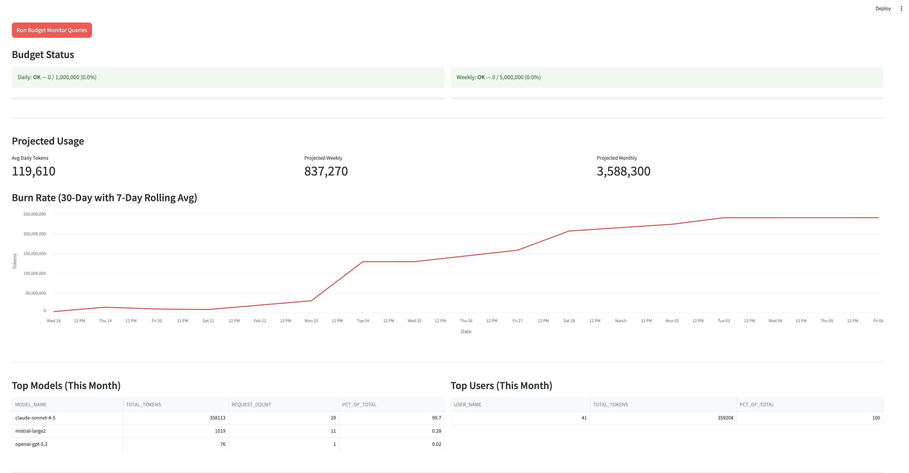
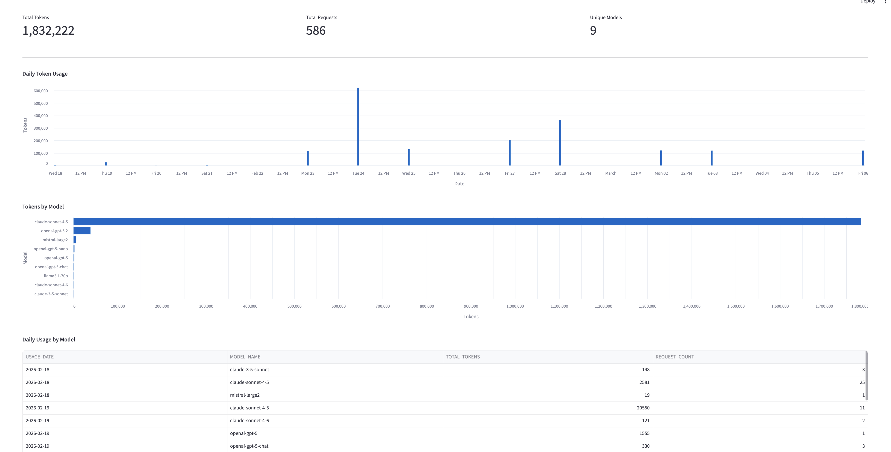
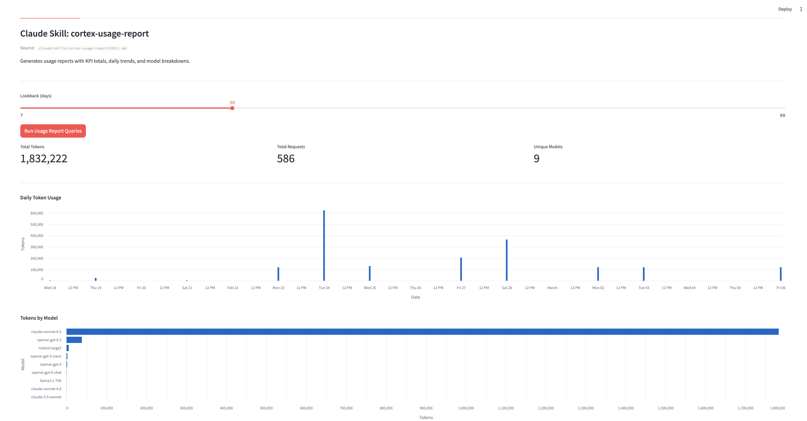
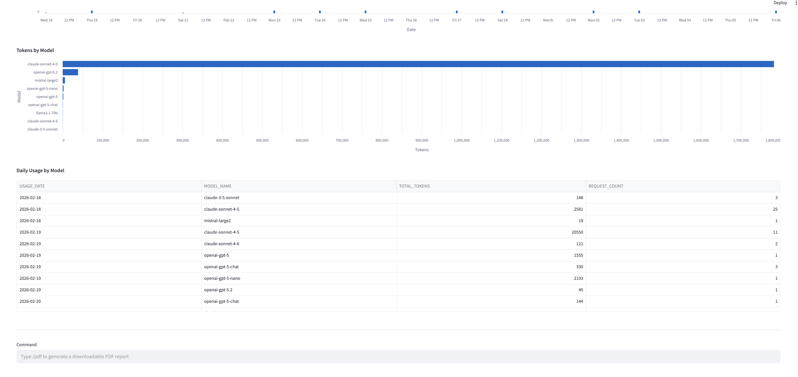
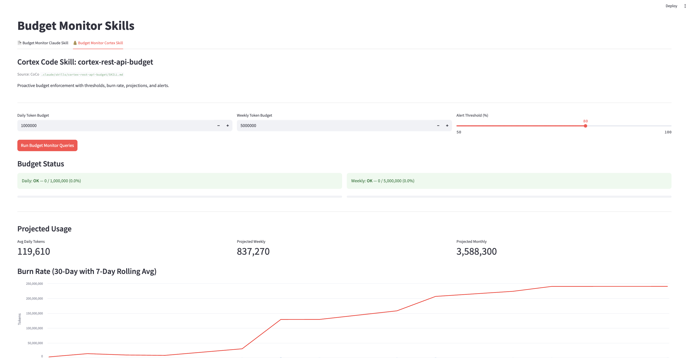
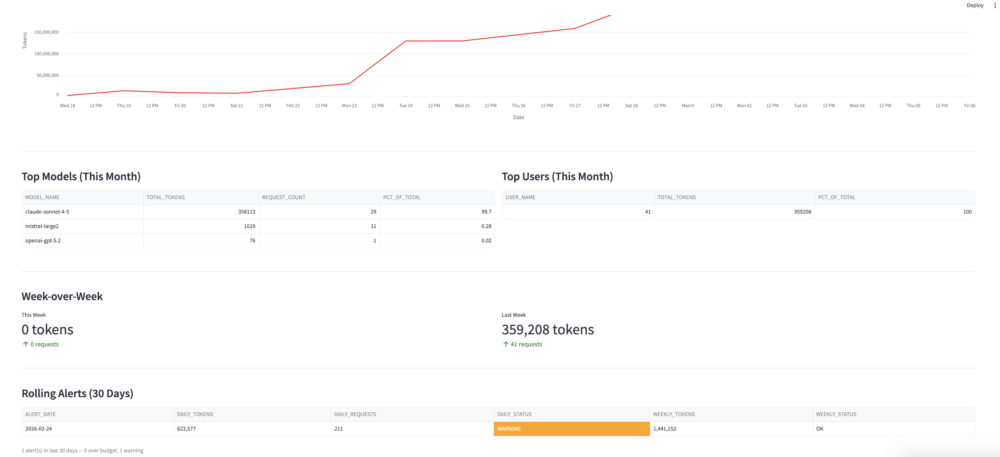

author: Priya Joseph
id: cortex-rest-api-budget-monitors
language: en
summary: Monitor Cortex REST API token budgets with Claude Code and Cortex Code skills — interactive Streamlit dashboard with /pdf export and rolling alerts.
categories: snowflake-site:taxonomy/product/ai, snowflake-site:taxonomy/snowflake-feature/cortex
environments: web
status: Published
feedback link: https://github.com/Snowflake-Labs/sfguides/issues
tags: Getting Started, Cortex, REST API, Budget Monitoring, Streamlit, AI

# Cortex REST API Budget Monitors
<!-- ------------------------ -->
## Overview
Duration: 3

This guide shows two complementary approaches to monitoring Cortex REST API token consumption using Cortex Code skills:

- **Claude Code Skill** (`cortex-usage-report`) — Generates interactive usage reports with KPI totals, daily trends, model breakdowns, and a `/pdf` slash command to export a downloadable PDF report.
- **Cortex Code (CoCo) Skill** (`cortex-rest-api-budget`) — Proactive budget enforcement with configurable daily/weekly thresholds, burn rate tracking, projected usage, and a rolling alerts table that flags budget breaches.

Both skills query `SNOWFLAKE.ACCOUNT_USAGE.CORTEX_REST_API_USAGE_HISTORY` and are surfaced together in a single Streamlit dashboard with two tabs.



### What You Will Build
- A two-tab Streamlit budget monitoring dashboard
- Tab 1: Usage reports with `/pdf` export command
- Tab 2: Budget enforcement with rolling alerts

### What You Will Learn
- How to query Cortex REST API usage history for token consumption analytics
- How to build Cortex Code skills for budget monitoring
- How to generate PDF reports from Streamlit using reportlab and matplotlib

### Prerequisites
- A Snowflake account with access to `SNOWFLAKE.ACCOUNT_USAGE.CORTEX_REST_API_USAGE_HISTORY`
- ACCOUNTADMIN role or appropriate privileges to query ACCOUNT_USAGE views
- Basic familiarity with Streamlit

<!-- ------------------------ -->
## Architecture
Duration: 2

The dashboard uses two skill definitions that share a common data source:

```
SNOWFLAKE.ACCOUNT_USAGE.CORTEX_REST_API_USAGE_HISTORY
        │
        ├── Claude Skill (Tab 1)
        │   ├── KPI Totals (tokens, requests, models)
        │   ├── Daily Token Usage chart
        │   ├── Tokens by Model chart
        │   ├── Daily Usage by Model table
        │   └── /pdf command → PDF report (reportlab + matplotlib)
        │
        └── CoCo Skill (Tab 2)
            ├── Daily/Weekly Budget Status (OK / WARNING / OVER BUDGET)
            ├── Projected Usage (daily avg, weekly, monthly)
            ├── Burn Rate chart (30-day with 7-day rolling avg)
            ├── Top Models & Top Users
            ├── Week-over-Week comparison
            └── Rolling Alerts table (30-day breach history)
```



<!-- ------------------------ -->
## Claude Skill — Usage Reports
Duration: 5

The Claude Code skill defines four SQL queries against `CORTEX_REST_API_USAGE_HISTORY`:

### KPI Totals
```sql
SELECT 
    SUM(TOKENS) as TOTAL_TOKENS,
    COUNT(*) as TOTAL_REQUESTS,
    COUNT(DISTINCT MODEL_NAME) as UNIQUE_MODELS
FROM SNOWFLAKE.ACCOUNT_USAGE.CORTEX_REST_API_USAGE_HISTORY 
WHERE START_TIME >= :start_date
```

### Daily Usage
```sql
SELECT 
    DATE_TRUNC('day', START_TIME)::DATE AS USAGE_DATE,
    SUM(TOKENS) as TOTAL_TOKENS,
    COUNT(*) as REQUEST_COUNT
FROM SNOWFLAKE.ACCOUNT_USAGE.CORTEX_REST_API_USAGE_HISTORY 
WHERE START_TIME >= :start_date
GROUP BY 1 ORDER BY 1
```

### Usage by Model
```sql
SELECT 
    MODEL_NAME,
    SUM(TOKENS) as TOTAL_TOKENS,
    COUNT(*) as REQUEST_COUNT
FROM SNOWFLAKE.ACCOUNT_USAGE.CORTEX_REST_API_USAGE_HISTORY 
WHERE START_TIME >= :start_date
GROUP BY 1 ORDER BY 2 DESC
```

### Daily by Model
```sql
SELECT 
    DATE_TRUNC('day', START_TIME)::DATE AS USAGE_DATE,
    MODEL_NAME,
    SUM(TOKENS) as TOTAL_TOKENS,
    COUNT(*) as REQUEST_COUNT
FROM SNOWFLAKE.ACCOUNT_USAGE.CORTEX_REST_API_USAGE_HISTORY 
WHERE START_TIME >= :start_date
GROUP BY 1, 2 ORDER BY 1, 2
```

Tab 1 renders these as interactive Streamlit metrics, Altair charts, and data tables.



### The `/pdf` Slash Command

Type `/pdf` in the command bar at the bottom of Tab 1 to generate a downloadable PDF report from the queried data. The PDF includes KPI summary, daily usage chart, model chart, and a daily-by-model table.



The PDF generation uses `reportlab` for layout and `matplotlib` for charts via `generate_report.py`.

<!-- ------------------------ -->
## CoCo Skill — Budget Enforcement
Duration: 5

The Cortex Code skill provides proactive budget monitoring with configurable thresholds.

### Budget Configuration
- **Daily Token Budget** — default 1,000,000 tokens
- **Weekly Token Budget** — default 5,000,000 tokens  
- **Alert Threshold** — percentage (default 80%) at which WARNING status triggers

### Daily Budget Status
```sql
SELECT 
    COALESCE(SUM(TOKENS), 0) AS today_tokens,
    :daily_budget AS budget,
    ROUND(100.0 * COALESCE(SUM(TOKENS), 0) / :daily_budget, 2) AS pct_used,
    CASE 
        WHEN COALESCE(SUM(TOKENS), 0) >= :daily_budget THEN 'OVER BUDGET'
        WHEN COALESCE(SUM(TOKENS), 0) >= :daily_budget * 0.8 THEN 'WARNING'
        ELSE 'OK'
    END AS status
FROM SNOWFLAKE.ACCOUNT_USAGE.CORTEX_REST_API_USAGE_HISTORY 
WHERE DATE(START_TIME) = CURRENT_DATE();
```

### Daily Burn Rate with 7-Day Rolling Average
```sql
SELECT 
    DATE_TRUNC('day', START_TIME)::DATE AS usage_date,
    SUM(TOKENS) AS daily_tokens,
    COUNT(*) AS daily_requests,
    AVG(SUM(TOKENS)) OVER (
        ORDER BY DATE_TRUNC('day', START_TIME)::DATE 
        ROWS BETWEEN 6 PRECEDING AND CURRENT ROW
    ) AS rolling_7d_avg
FROM SNOWFLAKE.ACCOUNT_USAGE.CORTEX_REST_API_USAGE_HISTORY 
WHERE START_TIME >= DATEADD(day, -30, CURRENT_TIMESTAMP())
GROUP BY 1 ORDER BY 1 DESC;
```

### Projected Monthly Usage
```sql
WITH daily_avg AS (
    SELECT AVG(daily_tokens) AS avg_daily_tokens
    FROM (
        SELECT SUM(TOKENS) AS daily_tokens
        FROM SNOWFLAKE.ACCOUNT_USAGE.CORTEX_REST_API_USAGE_HISTORY 
        WHERE START_TIME >= DATEADD(day, -7, CURRENT_TIMESTAMP())
        GROUP BY DATE(START_TIME)
    )
)
SELECT 
    avg_daily_tokens,
    avg_daily_tokens * 30 AS projected_monthly_tokens,
    avg_daily_tokens * 7 AS projected_weekly_tokens
FROM daily_avg;
```



### Rolling Alerts Table

The dashboard tracks the last 30 days of budget breaches, showing each day where daily or weekly thresholds were exceeded. Rows are color-coded: red for OVER BUDGET, orange for WARNING.



<!-- ------------------------ -->
## Run the Dashboard
Duration: 3

### Setup

Grant access to the SNOWFLAKE database for your role:

```sql
USE ROLE ACCOUNTADMIN;
GRANT IMPORTED PRIVILEGES ON DATABASE SNOWFLAKE TO ROLE <your_role>;
```

### Create the Streamlit App

1. Navigate to **Streamlit** in Snowsight
2. Click **+ Streamlit App**
3. Name your app `CORTEX_REST_API_BUDGET_MONITOR`
4. Select your warehouse and database/schema
5. Copy the code from `budget_monitor.py` and `generate_report.py` into the app

The app uses `get_active_session()` to connect — no connection configuration is needed when running in Snowsight.

### Explore Tab 1 (Claude Skill)
1. Adjust the **Lookback (days)** slider
2. Click **Run Usage Report Queries**
3. Review KPIs, daily chart, model chart, and daily-by-model table
4. Type `/pdf` in the command bar and press Enter to generate a PDF
5. Click **Download PDF Report**

### Explore Tab 2 (CoCo Skill)
1. Set **Daily Token Budget**, **Weekly Token Budget**, and **Alert Threshold**
2. Click **Run Budget Monitor Queries**
3. Review budget status (OK / WARNING / OVER BUDGET) with progress bars
4. Check projected usage, burn rate chart, top models/users, and week-over-week comparison
5. Scroll to **Rolling Alerts (30 Days)** to see historical breaches
6. Use the command bar at the bottom of Tab 2:
   - `/budget-status` — daily and weekly budget snapshot
   - `/burn-rate` — latest burn, 7-day rolling average, projections
   - `/alerts` — 30-day rolling alerts table
   - `/budget-summary` — combined view of all budget metrics

<!-- ------------------------ -->
## Cleanup
Duration: 1

To remove the app, navigate to **Streamlit** in Snowsight, find `CORTEX_REST_API_BUDGET_MONITOR`, and delete it.

No additional Snowflake objects are created by this guide — all queries are read-only against `SNOWFLAKE.ACCOUNT_USAGE.CORTEX_REST_API_USAGE_HISTORY`.

<!-- ------------------------ -->
## Conclusion and Resources
Duration: 1

You have built a Cortex REST API budget monitoring dashboard using two complementary Cortex Code skill approaches:

- **Claude Skill** for interactive usage reports with `/pdf` export
- **CoCo Skill** for proactive budget enforcement with rolling alerts

### Related Resources
- [Cortex REST API Documentation](https://docs.snowflake.com/en/user-guide/snowflake-cortex/cortex-llm-rest-api)
- [CORTEX_REST_API_USAGE_HISTORY View](https://docs.snowflake.com/en/sql-reference/account-usage/cortex_rest_api_usage_history)
- [Streamlit Documentation](https://docs.streamlit.io)
- [Cortex Code Documentation](https://docs.snowflake.com/en/user-guide/cortex-code/cortex-code)
