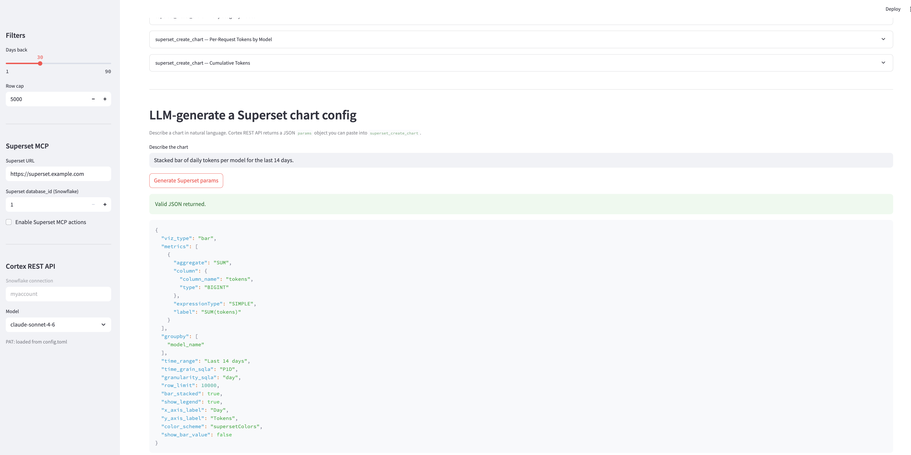
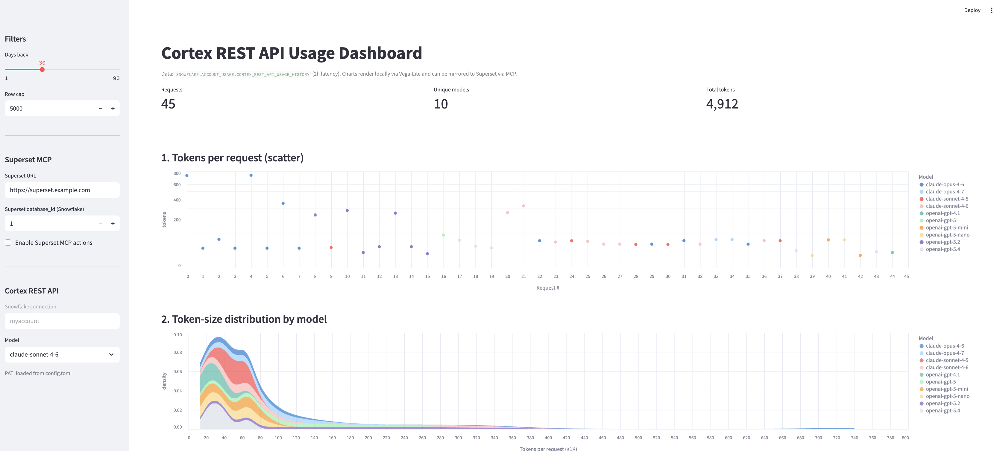
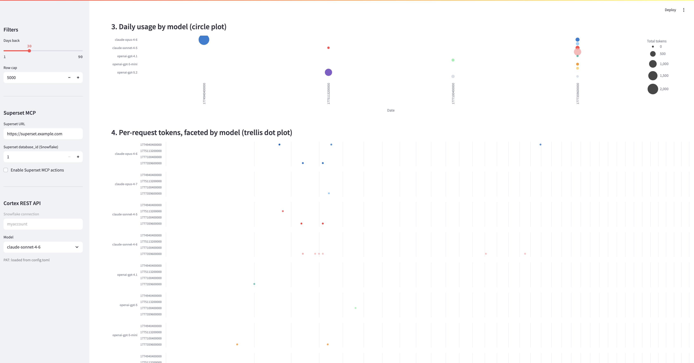

author: Priya Joseph
id: cortex-rest-api-superset-mcp-visualization
summary: Visualize Cortex REST API usage with a standalone Streamlit app that renders charts locally and mirrors them to Apache Superset via MCP, with Cortex-generated chart configs.
categories: snowflake-site:taxonomy/solution-center/partners-ecosystem/cortex-ai
environments: web
status: Published
feedback link: https://github.com/Snowflake-Labs/sfguides/issues
tags: Cortex, REST API, Streamlit, Superset, MCP, Visualization, Dashboard, Vega-Lite
language: en

# Visualize Cortex REST API Usage with Streamlit + Superset MCP
<!-- ------------------------ -->
## Overview

Duration: 2

This quickstart builds a **standalone Streamlit app** that visualizes `SNOWFLAKE.ACCOUNT_USAGE.CORTEX_REST_API_USAGE_HISTORY` and mirrors the same dashboard into **Apache Superset** through its **MCP server**. It is the Streamlit + Superset companion to [Cortex REST API Usage Visualization](https://www.snowflake.com/en/developers/guides/cortex-rest-api-usage-visualization/) (which uses a static Vega-Lite HTML page).



You get three things in one app:

1. **Local rendering** — 5 interactive Vega-Lite charts drawn directly in Streamlit (scatter, density, circle plot, trellis dot plot, interactive multi-line).
2. **Superset mirror** — `superset_create_chart` / `superset_create_dashboard` MCP payloads, ready for a Cortex Code session to execute.
3. **LLM-as-config-generator** — a Cortex REST API call that translates a natural-language chart request into a Superset `params` JSON.

### Prerequisites
- A Snowflake account with access to `SNOWFLAKE.ACCOUNT_USAGE` (requires `IMPORTED PRIVILEGES ON DATABASE SNOWFLAKE` on the running role)
- A warehouse (e.g., `CORTEX_USAGE_WH` — the default on the `myaccount` connection)
- Active Cortex REST API usage in the account (rows in `CORTEX_REST_API_USAGE_HISTORY`)
- An Apache Superset instance (self-hosted or Preset.io) — only needed for the Superset mirror step
- A Superset MCP server reachable over HTTP (for example `apache-superset-mcp` or a Preset-managed endpoint)
- Cortex Code CLI installed locally (for registering the Superset MCP server)

### What You'll Learn
- How to query `CORTEX_REST_API_USAGE_HISTORY` from Streamlit
- How to render 5 Vega-Lite charts using `st.vega_lite_chart` — the Streamlit equivalent of the original HTML dashboard
- How to structure `superset_create_chart` payloads that mirror each Vega-Lite chart
- How to register a Superset MCP server with Cortex Code and call its tools
- How to use Cortex REST API (`claude-sonnet-4-6` or `openai-gpt-5.x`) to auto-generate Superset chart configs from a user prompt

### What You'll Build
- A single `streamlit_app.py` that runs in **Streamlit in Snowflake (SiS)** or locally
- A reusable mapping from Vega-Lite chart types to Superset `viz_type` values
- A prompt template that coerces an LLM into returning a valid Superset `params` JSON

<!-- ------------------------ -->
## Chart Mapping: Vega-Lite → Superset

Duration: 2

The original Vega-Lite dashboard has 5 charts. Each one maps cleanly to a Superset visualization type:

| # | Chart Intent                       | Vega-Lite `mark`        | Superset `viz_type` | Key Fields                                          |
|---|------------------------------------|-------------------------|---------------------|-----------------------------------------------------|
| 1 | Tokens per request                 | `circle` (scatter)      | `scatter`           | `x=request_seq`, `y=tokens`, `color=model_name`     |
| 2 | Token-size distribution            | `area` (density)        | `dist_bar`          | `metrics=[count]`, `groupby=[model_name]`           |
| 3 | Daily usage by model               | `circle` (sized)        | `heatmap`           | `x=day`, `y=model_name`, `metric=SUM(tokens)`       |
| 4 | Per-request tokens faceted         | `circle` + row facet    | `dot_plot`          | `x=tokens`, `facet=model_name`, `y=day`             |
| 5 | Cumulative tokens over time        | `line` + `point`        | `line`              | `x=day`, `metric=CUMSUM(tokens)`, `series=model`    |

<!-- ------------------------ -->
## Set Up Your Snowflake Role

Duration: 1

The Streamlit app runs under the role that opens the Snowpark session. That role must be able to read `SNOWFLAKE.ACCOUNT_USAGE`.

```sql
-- Run as ACCOUNTADMIN (or a role with MANAGE GRANTS)
GRANT IMPORTED PRIVILEGES ON DATABASE SNOWFLAKE  TO ROLE CORTEX_USAGE_ROLE;
GRANT USAGE ON WAREHOUSE CORTEX_USAGE_WH TO ROLE CORTEX_USAGE_ROLE;
```

Verify the usage view is populated (note the **2-hour latency**):

```sql
SELECT COUNT(*) AS rows_30d,
       MIN(start_time) AS first_seen,
       MAX(start_time) AS last_seen
FROM   SNOWFLAKE.ACCOUNT_USAGE.CORTEX_REST_API_USAGE_HISTORY
WHERE  start_time >= DATEADD(day, -30, CURRENT_TIMESTAMP());
```

<!-- ------------------------ -->
## Deploy the Streamlit App

Duration: 3

You have two equivalent deployment paths.

### Option A — Streamlit in Snowflake (recommended)

1. In Snowsight, open **Projects → Streamlit → + Streamlit App**.
2. Pick a database/schema (e.g., `CORTEX_DEMO.PUBLIC`) and the `CORTEX_USAGE_WH` warehouse.
3. Paste the contents of `streamlit_app.py` into the editor.
4. Click **Edit environment** and paste `environment.yml` (`streamlit`, `pandas`, `requests`, `altair`, `snowflake-snowpark-python`).
5. Click **Run**.

The `get_active_session()` branch picks up the SiS session automatically.

### Option B — Local run

```bash
pip install streamlit snowflake-snowpark-python pandas requests altair tomli
export SNOWFLAKE_CONNECTION_NAME=myaccount        # name from ~/.snowflake/config.toml
export SNOWFLAKE_WAREHOUSE=CORTEX_USAGE_WH
streamlit run streamlit_app.py
```

The `Session.builder.configs({"connection_name": ...}).create()` branch handles local auth, and the app issues `USE WAREHOUSE $SNOWFLAKE_WAREHOUSE` on startup. The PAT for the Cortex REST API call is read automatically from `~/.snowflake/config.toml` under `[connections.<name>].password` — no separate env var needed.

<!-- ------------------------ -->
## Understand the 5 Charts

Duration: 3

Each chart uses `st.vega_lite_chart(df, spec)` with a spec that mirrors the original HTML guide.



### 1. Scatter — tokens per request
```python
st.vega_lite_chart(scatter_df, {
  "mark": {"type": "circle", "opacity": 0.7, "size": 60},
  "encoding": {
    "x": {"field": "request_seq", "type": "quantitative"},
    "y": {"field": "tokens", "type": "quantitative", "scale": {"type": "sqrt"}},
    "color": {"field": "model_name", "type": "nominal"}
  }
})
```

### 2. Stacked density — token sizes by model
Uses Vega's built-in `density` transform. Cap at `tokens <= 1000` so a few large outliers do not flatten the curve.

### 3. Circle plot — date × model, sized by SUM(tokens)
Pre-aggregate in pandas (`groupby(["day","model_name"])`) so the encoding stays simple.

### 4. Trellis dot plot — one facet row per model
Uses `encoding.row` to stack per-model panels.

### 5. Interactive multi-line — cumulative tokens
Compute `cumsum` per model in pandas, then let Vega render with `point: true` for hover.

<!-- ------------------------ -->
## Register the Superset MCP Server

Duration: 2

Register your Superset MCP endpoint with Cortex Code so a CLI session (or another MCP client) can call its tools:

```bash
cortex mcp add superset https://superset.example.com/api/v1/mcp --transport http
cortex mcp list
```

In the Cortex Code session, ask it to enumerate the tools the Superset MCP server exposes. Typical names include `superset_list_databases`, `superset_create_dataset`, `superset_create_chart`, `superset_create_dashboard`, `superset_add_chart_to_dashboard`, and `superset_get_dashboard_embed_token` — exact names depend on your MCP implementation.

Inside Superset, connect the Snowflake account once (SQLAlchemy URI, using a dedicated service role with `IMPORTED PRIVILEGES ON DATABASE SNOWFLAKE`). Note the resulting `database_id` — the Streamlit app exposes a sidebar field for it.

<!-- ------------------------ -->
## Mirror the Dashboard to Superset via MCP

Duration: 3

The Streamlit app prints the 5 chart payloads in expanders under **"Mirror to Superset via MCP"**. A Cortex Code session can iterate over them:



```python
# Pseudocode — real calls go through MCP tool invocations
dataset_id = superset_create_dataset({
  "database_id": SUPERSET_DB_ID,
  "schema": "ACCOUNT_USAGE",
  "table_name": "CORTEX_REST_API_USAGE_HISTORY",
  "sql": """
    SELECT DATE_TRUNC('day', start_time)::DATE AS day,
           model_name, user_id, tokens, request_id
    FROM SNOWFLAKE.ACCOUNT_USAGE.CORTEX_REST_API_USAGE_HISTORY
    WHERE start_time >= DATEADD(day, -30, CURRENT_TIMESTAMP())
  """,
})["id"]

chart_ids = []
for payload in chart_payloads:
    chart_ids.append(superset_create_chart({
        "datasource_id": dataset_id,
        "slice_name":    payload["slice_name"],
        "viz_type":      payload["viz_type"],
        "params":        payload["params"],
    })["id"])

dashboard_id = superset_create_dashboard({"dashboard_title": "Cortex REST API Usage"})["id"]
for cid in chart_ids:
    superset_add_chart_to_dashboard({"dashboard_id": dashboard_id, "chart_id": cid})

embed = superset_get_dashboard_embed_token({"dashboard_id": dashboard_id})
```

The resulting dashboard lives in Superset and can be embedded anywhere via `embed.token` + the Superset Embedded SDK.

<!-- ------------------------ -->
## Cortex REST API → Superset Chart Config

Duration: 2

The **"LLM-generate a Superset chart config"** section of the app calls Cortex REST API's OpenAI-compatible endpoint. The app uses your named connection (default: `myaccount`) from `~/.snowflake/config.toml` to resolve the account host automatically — users only see the connection name in the UI, never a raw host.


```
POST https://<account>.snowflakecomputing.com/api/v2/cortex/v1/chat/completions
```

System prompt (verbatim from the app):

```text
You are a Superset chart generator. Return ONLY a JSON object suitable for
superset_create_chart's `params` field (no commentary, no code fences).
Dataset columns: day (date), model_name (string), tokens (number),
user_id (string), request_id (string).
Required keys: viz_type, metrics, groupby, time_range.
```

Sample user prompt: *"Stacked bar of daily tokens per model for the last 14 days."*

The app validates the response with `json.loads` and displays the parsed result. Paste that JSON into the `params` field of a `superset_create_chart` MCP call to materialize it.

### Authentication

PAT-based REST calls need **two** auth headers, not one. A bearer token alone returns HTTP 401:

```python
headers = {
    "Authorization": f"Bearer {PAT}",
    "X-Snowflake-Authorization-Token-Type": "PROGRAMMATIC_ACCESS_TOKEN",  # required
    "Content-Type": "application/json",
    "Accept": "application/json",  # required — otherwise 400 "Unsupported Accept header"
}
```

Also note that `max_tokens` is deprecated on this endpoint — use `max_completion_tokens` instead.

The app reads the PAT directly from `~/.snowflake/config.toml` under `[connections.<SNOWFLAKE_CONNECTION_NAME>].password` — no `SNOWFLAKE_PAT` env var required for local runs. In SiS, this block is skipped and session auth is handled by Snowpark; swap in a Snowflake Secret or the Snowpark `_rest` token pattern if you need to call the REST API from inside SiS.

<!-- ------------------------ -->
## Embed the Dashboard

Duration: 1

Once the Superset dashboard exists, embed it in whichever surface your users live in:

| Surface                   | Embed pattern                                                              |
|---------------------------|----------------------------------------------------------------------------|
| Snowflake Intelligence    | Markdown link `[Open dashboard](https://superset.example.com/...)`         |
| Slack                     | Unfurled permalink, or rendered PNG via Superset's `/api/v1/chart/<id>/screenshot` |
| Custom web app            | Superset Embedded SDK + `embed.token` from `superset_get_dashboard_embed_token` |
| SiS companion (this app)  | `st.components.v1.iframe(embed_url)` in a second tab                       |

<!-- ------------------------ -->
## Superset vs Vega-Lite — When to Use Which

Duration: 1

| Dimension                 | Vega-Lite HTML guide            | This Streamlit + Superset guide                    |
|---------------------------|----------------------------------|----------------------------------------------------|
| Infrastructure            | None (static HTML)              | Superset instance + MCP server                     |
| Governance / RLS          | None                             | Superset row-level security                        |
| Persisted dashboards      | No                               | Yes, shareable and scheduled                       |
| Interactivity             | Vega interactions only          | Full Superset explore + filters                    |
| Auto-generated charts     | JSON spec                        | `params` object via Cortex REST API                |
| Time to first chart       | Seconds                          | Minutes (one-time Superset wiring)                 |

Pick Vega-Lite HTML for **one-off visualizations embedded in docs or SiS**. Pick Superset for **shared, governed dashboards with RLS and scheduled delivery**.

<!-- ------------------------ -->
## Conclusion And Resources

Duration: 1

You built a standalone Streamlit app that:

- Reads `SNOWFLAKE.ACCOUNT_USAGE.CORTEX_REST_API_USAGE_HISTORY`
- Renders 5 interactive Vega-Lite charts locally — parity with the original HTML quickstart
- Produces ready-to-execute `superset_create_chart` payloads for an MCP client
- Uses Cortex REST API to translate natural-language chart requests into Superset `params` JSON

### What You Learned
- How to structure a SiS-compatible Streamlit app with a Snowpark session fallback for local runs
- The 1:1 mapping from Vega-Lite `mark` / `encoding` to Superset `viz_type` / `params`
- How to register a Superset MCP server with Cortex Code and call its tools
- How to coerce an LLM into emitting Superset-valid JSON via a strict system prompt

### Related Resources
- [Cortex REST API Usage Visualization (Vega-Lite HTML)](https://www.snowflake.com/en/developers/guides/cortex-rest-api-usage-visualization/)
- [AI Guardrails with Snowflake Cortex REST API](https://www.snowflake.com/en/developers/guides/cortex-rest-api-guardrails/)
- [Streamlit in Snowflake docs](https://docs.snowflake.com/en/developer-guide/streamlit/about-streamlit)
- [Apache Superset docs](https://superset.apache.org/docs/intro)
- `SNOWFLAKE.ACCOUNT_USAGE.CORTEX_REST_API_USAGE_HISTORY` reference in the Snowflake docs
