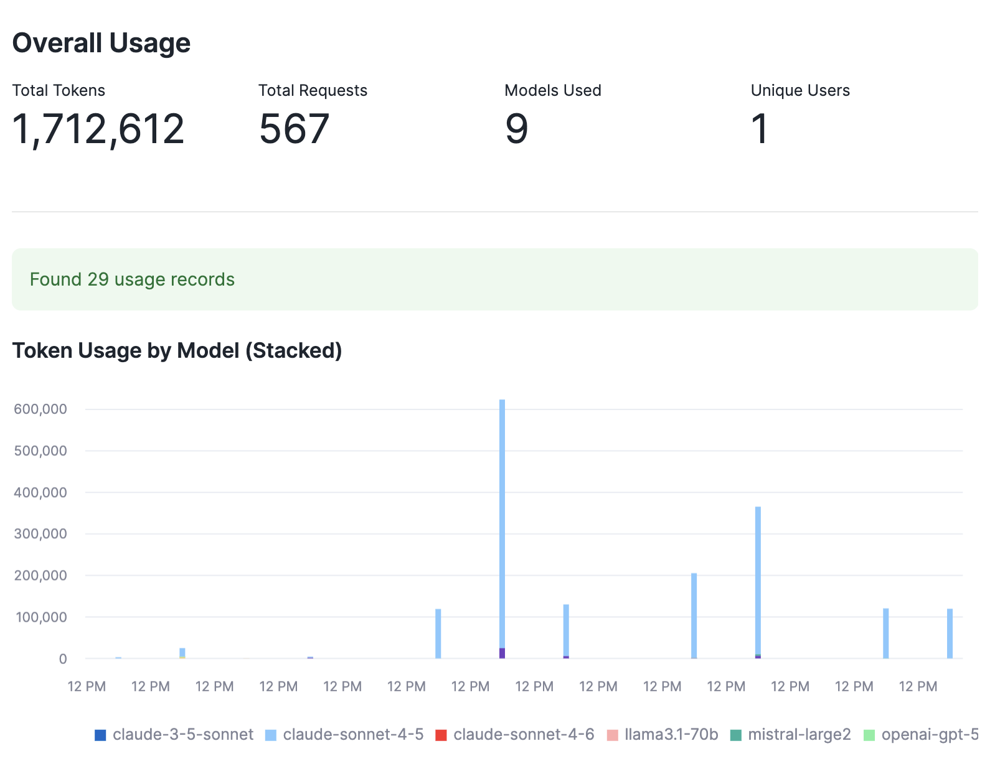
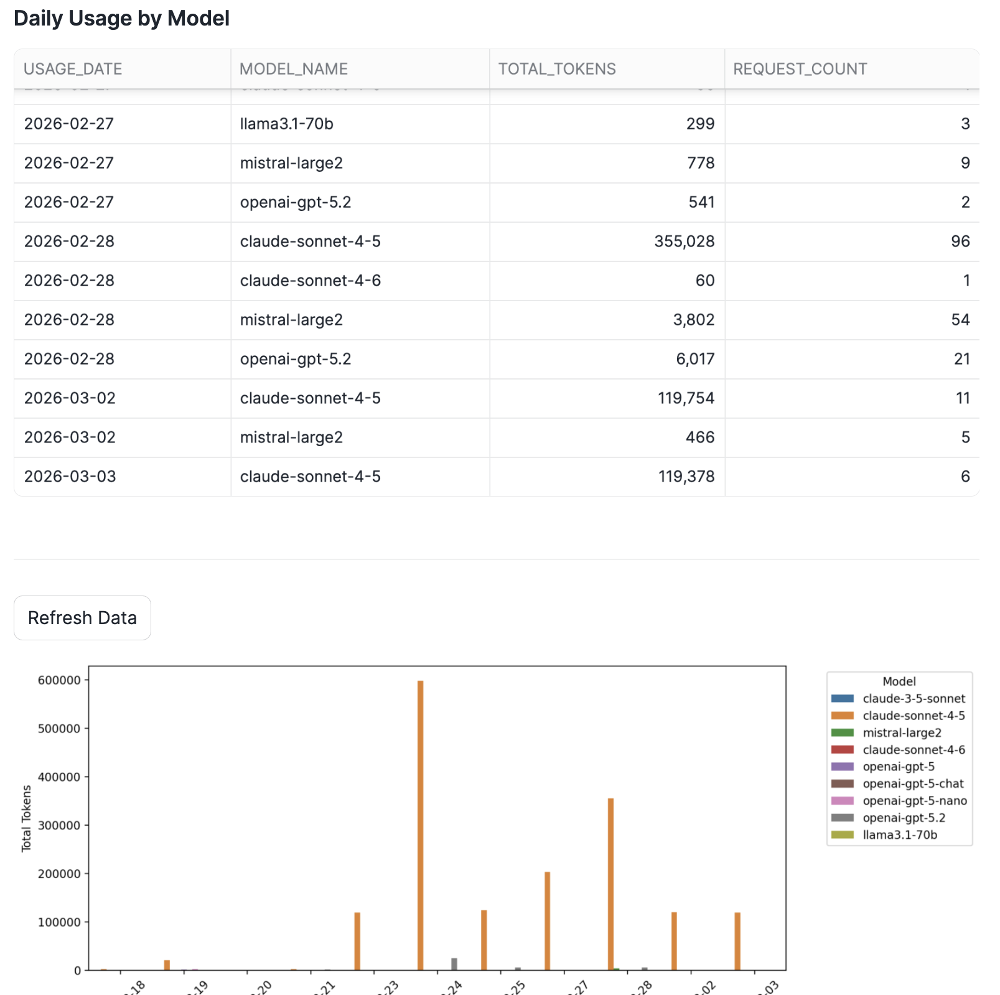
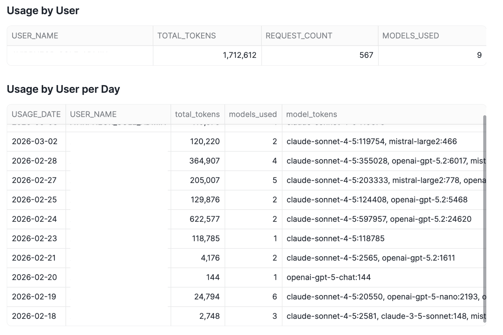

author: Priya Joseph
id: cortex-rest-api-usage
summary: Monitor Cortex REST API token consumption with Streamlit in Snowflake
categories: snowflake-site:taxonomy/solution-center/certification/quickstart, snowflake-site:taxonomy/product/ai, snowflake-site:taxonomy/snowflake-feature/cortex-llm-functions
environments: web
status: Published
feedback link: https://github.com/Snowflake-Labs/sfguides/issues
tags: Cortex, REST API, Token Usage, Monitoring, Streamlit
language: en

# Cortex REST API Usage Monitor

## Overview
Duration: 2

This quickstart demonstrates how to build a Streamlit in Snowflake (SiS) application to monitor your Cortex REST API token consumption. Track usage by model, user, and time period to optimize costs and understand your AI workload patterns.

### What You'll Learn
- How to query `SNOWFLAKE.ACCOUNT_USAGE.CORTEX_REST_API_USAGE_HISTORY`
- Building interactive dashboards with Streamlit in Snowflake
- Visualizing token consumption patterns with Altair charts
- Tracking usage by model, user, and time period

### What You'll Need
- A Snowflake account with Cortex REST API access
- ACCOUNTADMIN role or appropriate privileges to query ACCOUNT_USAGE views
- Basic familiarity with Streamlit

### What You'll Build
A comprehensive dashboard showing:
- Overall usage KPIs (total tokens, requests, models, users)
- Token usage trends by model over time
- Input vs output token breakdown
- Usage breakdown by user
- Daily detailed usage tables

## Setup
Duration: 3

### Prerequisites

Grant access to the SNOWFLAKE database for your role:

```sql
USE ROLE ACCOUNTADMIN;
GRANT IMPORTED PRIVILEGES ON DATABASE SNOWFLAKE TO ROLE <your_role>;
```

### Create the Streamlit App

1. Navigate to **Streamlit** in Snowsight
2. Click **+ Streamlit App**
3. Name your app `CORTEX_REST_API_USAGE_MONITOR`
4. Select your warehouse and database/schema
5. Create a notebook. Copy the code in streamlit.py into notebook cell and run.

## Understanding the Dashboard
Duration: 5

### Overall Usage Summary

The top KPIs show:
- **Total Tokens**: Combined input + output tokens consumed
- **Total Requests**: Number of API calls made
- **Models Used**: Count of distinct models accessed
- **Active Users**: Number of users making requests



### Token Usage by Model

The stacked bar chart shows daily token consumption broken down by model, helping you identify:
- Usage trends over time
- Which models consume the most tokens
- Peak usage days

### Daily Usage by Model

The detailed table and chart view shows daily token consumption with request counts for each model:



### Input vs Output Tokens

Understanding the ratio between input and output tokens helps optimize:
- Prompt engineering (reduce input tokens)
- Response limits (control output tokens)
- Model selection for different use cases

### Usage by User

Track which users or service accounts consume the most resources for:
- Chargeback reporting
- Identifying optimization opportunities
- Capacity planning



## Cost Considerations
Duration: 2

### Token Pricing

Cortex REST API costs vary by model. Monitor the `CORTEX_REST_API_USAGE_HISTORY` view to:
- Track consumption trends
- Set up alerts for unusual usage
- Optimize model selection for cost vs quality

### Latency Note

The `ACCOUNT_USAGE` views have up to 2 hours of latency. For real-time monitoring, consider:
- Using `INFORMATION_SCHEMA` views (15-minute latency, shorter retention)
- Building streaming pipelines for critical monitoring

## Conclusion
Duration: 1

### What You Learned
- Querying Cortex REST API usage data from ACCOUNT_USAGE
- Building interactive monitoring dashboards with Streamlit in Snowflake
- Visualizing token consumption patterns

### Related Resources
- [Cortex REST API Documentation](https://docs.snowflake.com/en/user-guide/snowflake-cortex/cortex-llm-rest-api)
- [ACCOUNT_USAGE Views](https://docs.snowflake.com/en/sql-reference/account-usage)
- [Streamlit in Snowflake](https://docs.snowflake.com/en/developer-guide/streamlit/about-streamlit)
