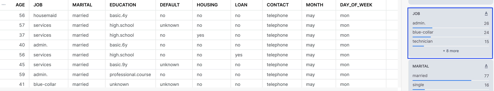
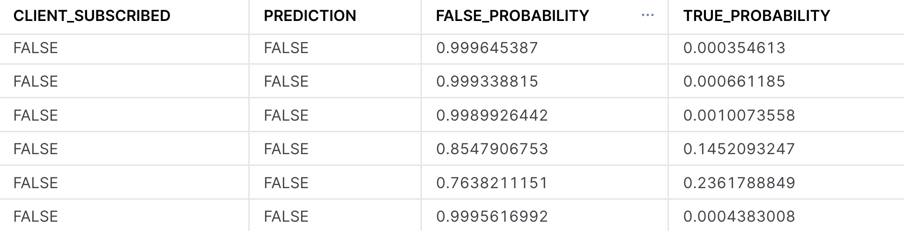
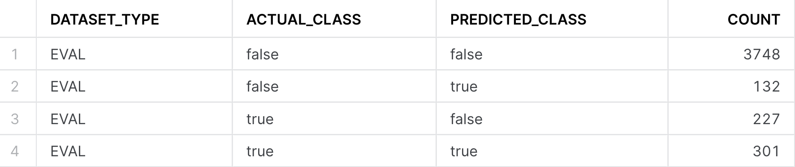
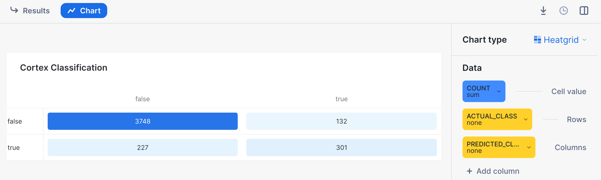
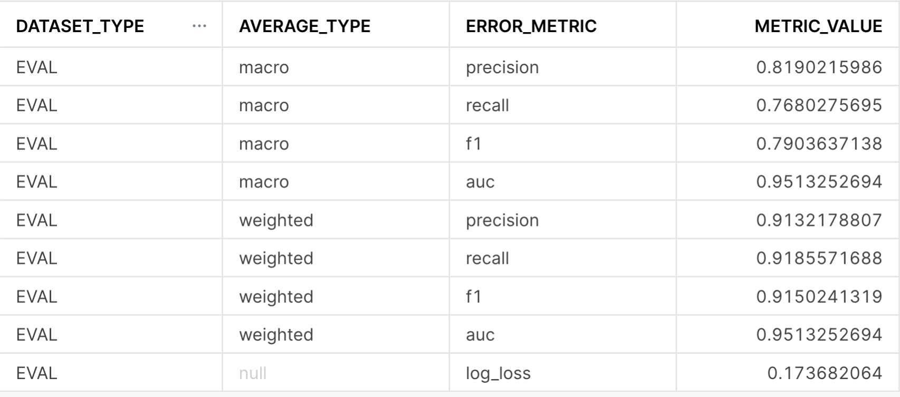
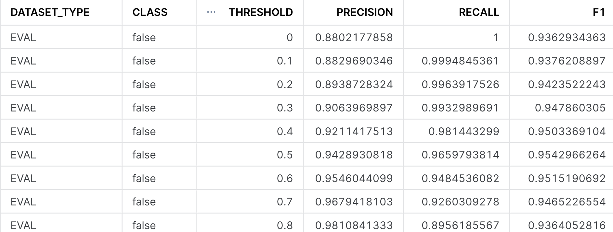
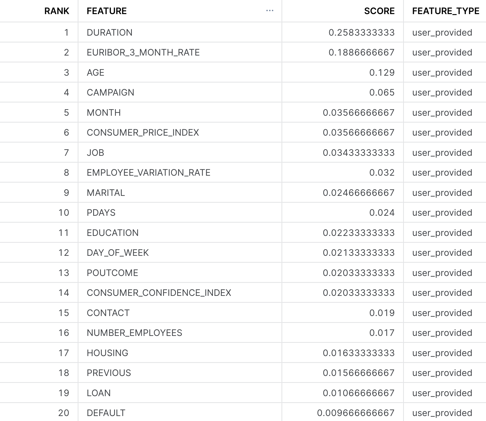

author: Harsh Patel
id: cortex_ml_classification
summary: Getting started with the Classification ML-Powered Function
categories: Getting-Started
environments: web
status: Published 
feedback link: https://github.com/Snowflake-Labs/sfguides/issues
tags: Getting Started, Data Science, Cortex

# Getting Started with Snowflake Cortex ML Classification
<!-- ------------------------ -->
## Overview 
Duration: 5

One of the most critical activities that a Data/Business Analyst has to perform is to produce recommendations to their business stakeholders based upon the insights they have gleaned from their data. In practice, this means that they are often required to build models to: identify trends, identify abnormalities within their data, and classify users or entities into one of many groups. However, Analysts are often impeded from creating the best models possible due to the depth of statistical and machine learning knowledge required to implement them in practice. Further, python or other programming frameworks may be unfamiliar to Analysts who write SQL, and the nuances of fine-tuning a model may require expert knowledge that may be out of reach. 

For these use cases, Snowflake has developed a set of SQL based ML Functions, that implement machine learning models on the user's behalf. As of March 2024, four ML Functions are available: 

### Time Series Based:
1. Forecasting: which enables users to forecast a metric based on past values. Common use-cases for forecasting including predicting future sales, demand for particular sku's of an item, or volume of traffic into a website over a period of time.
2. Anomaly Detection: which flags anomalous values using both unsupervised and supervised learning methods. This may be useful in use-cases where you want to identify spikes in your cloud spend, identifying abnormal data points in logs, and more.
3. Contribution Explorer: which enables users to perform root cause analysis to determine the most significant drivers to a particular metric of interest. 

### Other Analysis Functions: 
1. Classification: which enables users to sort data into different classes using patterns detected within the training data. Compared to the first three, classification doesn't require that the data have an explicit time stamp associated with each of the records. 

For further details on ML Functions, please refer to the [snowflake documentation](https://docs.snowflake.com/guides-overview-analysis). 

### Prerequisites
- Working knowledge of SQL
- A Snowflake account login with an ACCOUNTADMIN role. If not, you will need to use a different role that has the ability to create database, schema, table, stages, and the cortex functions. 

### What You’ll Learn 
- How to make use of the classfication ML Function to create models and produce predictions
- How to evaluate and interpret the model results and feature importances
- How to score on new datasets to produce inferences

### What You’ll Build 
This Quickstart is designed to help you get up to speed with the Classification ML Function. 

We will work through an example using data provided by the [Irvine Machine Learning Repository](https://archive.ics.uci.edu/); specifically their [Bank Marketing Dataset](https://archive.ics.uci.edu/dataset/222/bank+marketing) to build a model to predict whether or not clients at a Portuguese bank subscribed to a term deposit during a marketing campaign. 

The dataset contains various variables you'd find in a typical marketing campaign, including demographic details of the customer, their previous interactions with the bank, and a range of economic indicators that'd help us predict whether or not the customer will subscribe to the term deposit. Furthermore, we have both numeric and categorical variables in our dataset, typical of something you would find within your organization's data. 
 
After we build the model, we will evaluate it and look at the feature importances to help us better understand the factors that were correlated with a customer signing up for the term deposit. Often times in a business context, it is not only enough to just build a model to make predictions, we also need to understand the reasons why the predictions were made. Understanding these factors give us a better insight into what drives a customer's behavior, so that we may make meaningful recommendations to our stakeholders. 

Let's get started!

**IMPORTANT NOTE:** As of March 2024, Cortex ML Classification is in Public Preview. From time to time, Snowflake may refine the underlying algorithm and will roll out the improvements through the regular Snowflake release process. You cannot revert to a previous version of the model, but models you have created with a pervious version will continue to use that version. These changes in the underlying algorithm also means that the results you get when you run through the quickstart may differ from the images you see. 

<!-- ------------------------ -->
## Setting Up Data in Snowflake
Duration: 10

### Overview:
You will use [Snowsight](https://docs.snowflake.com/en/user-guide/ui-snowsight), the Snowflake web interface, to: 
- Create Snowflake objects (i.e warehouse, database, schema, etc..)
- Ingest data from S3 and load it into a snowflake table
  
### Step 1: Creating Objects, Loading Data, & Set Up Tables

- Create a new SQL worksheet by clicking on the 'Worksheets' tab on the left hand side. 
- Paste and run the following SQL commands in the worksheet to create the required Snowflake objects, ingest data from S3, and create the tables we will use for this lab. 

```sql
-- Using accountadmin is often suggested for quickstarts, but any role with sufficient privledges can work
USE ROLE ACCOUNTADMIN;

-- Create development database, schema for our work: 
CREATE OR REPLACE DATABASE quickstart;
CREATE OR REPLACE SCHEMA ml_functions;

-- Use appropriate resources: 
USE DATABASE quickstart;
USE SCHEMA ml_functions;

-- Create warehouse to work with: 
CREATE OR REPLACE WAREHOUSE quickstart_wh;
USE WAREHOUSE quickstart_wh;

-- Create a csv file format to be used to ingest from the stage: 
CREATE OR REPLACE FILE FORMAT quickstart.ml_functions.csv_ff
    TYPE = 'csv'
    SKIP_HEADER = 1,
    COMPRESSION = AUTO;

-- Create an external stage pointing to AWS S3 for loading our data:
CREATE OR REPLACE STAGE s3load 
    COMMENT = 'Quickstart S3 Stage Connection'
    URL = 's3://sfquickstarts/frostbyte_tastybytes/mlpf_quickstart/'
    FILE_FORMAT = quickstart.ml_functions.csv_ff;

-- Define our table schema
CREATE OR REPLACE TABLE quickstart.ml_functions.bank_marketing(
    AGE NUMBER,
    JOB TEXT, 
    MARITAL TEXT, 
    EDUCATION TEXT, 
    DEFAULT TEXT, 
    HOUSING TEXT, 
    LOAN TEXT, 
    CONTACT TEXT, 
    MONTH TEXT, 
    DAY_OF_WEEK TEXT, 
    DURATION NUMBER(4, 0), 
    CAMPAIGN NUMBER(2, 0), 
    PDAYS NUMBER(3, 0), 
    PREVIOUS NUMBER(1, 0), 
    POUTCOME TEXT, 
    EMPLOYEE_VARIATION_RATE NUMBER(2, 1), 
    CONSUMER_PRICE_INDEX NUMBER(5, 3), 
    CONSUMER_CONFIDENCE_INDEX NUMBER(3,1), 
    EURIBOR_3_MONTH_RATE NUMBER(4, 3),
    NUMBER_EMPLOYEES NUMBER(5, 1),
    CLIENT_SUBSCRIBED BOOLEAN);

-- Ingest data from S3 into our table:
COPY INTO quickstart.ml_functions.bank_marketing
FROM @s3load/cortex_ml_classification.csv;

-- View a sample of the ingested data: 
SELECT * FROM quickstart.ml_functions.bank_marketing LIMIT 100;
```

<!-- ------------------------ -->
## Exploratory Data Analysis
Duration: 10  

### Step 1: Visualize our Data

Before building our model, let's first visualize our data to get a feel for what it looks like and get a sense of what variables we will be working with. Follow along below: 

```sql
-- Query a sample of the ingested data
SELECT *
FROM bank_marketing
LIMIT 100;
```
After running the command, you'll notice that we have a total of 21 columns in the result set that is displayed at the bottom of the worksheet. 



The variables in this dataset can be roughly grouped into three categories: 

1. Demographic data (i.e Age, Job, Marital Status) of the banking customer
2. Data around the interactions that the bank may have had with the customer previously, i.e `contact` which describes communication type used (either cellular or telephone), and `previous` which describes the number of contacts that were performed before the campaign was run
3. Social and economic data (i.e `employee_variation_rate`, etc..) that details economic indicators during the time that the contact was made. These variables add information about the macroeconomic for when the customer was contacted, and may prove to be useful in predicting whether or not the customer accepts the term deposit.

The target variable that we will want to predict is the column denoted by `client_subscribed`. This is a binary variable, meaning it takes on one of two values, either `TRUE` OR `FALSE`. While in this case we only have two values, Cortex ML Classification function can also handle [Multi-Class Classification](https://en.wikipedia.org/wiki/Multiclass_classification), where there are more than three classes we want to group/classify.

For the full data dictionary, refer to the [Bank Marketing Dataset](https://archive.ics.uci.edu/dataset/222/bank+marketing) for the Variables Table. **Note** that the macroeconomic variables are not listed in the chart, you may find that by downloading the dataset, and opening the file `bank-additional-names.txt` contained within the `bank-additional` folder. 

Lastly, on the right hand side of the result set, you'll notice that there are many visualizations for each of the variables, providing distribution plots for columns that are numeric, and also providing a count for those variables that are categorical. Feel free to scroll through them to get a better sense of the different values the dataset contains. 

### Step 2: Preparing Training & Inference Views

Now that we have a sense of what our data looks like, let's prepare our dataset for both training and inference purposes. 

```sql
-- Total count of rows in the dataset
SELECT COUNT(1) as num_rows
FROM bank_marketing;

-- Count of subscribed vs not subscribed: 
SELECT client_subscribed, COUNT(1) as num_rows
FROM bank_marketing
GROUP BY 1;
```
Our input dataset has a total of 41,188 rows of data, and roughly 11% percent of the customers (4640) subscribed to the term deposit. To make sure we have some left over data to make predictions on, we will sample 95% of the data, and create a view for our training and testing dataset. 

```sql
-- Create a view with a column that will be filtered for either training/inference purposes
CREATE OR REPLACE VIEW partitioned_data as (
  SELECT *, 
        CASE WHEN UNIFORM(0::float, 1::float, RANDOM()) < .95 THEN 'training' ELSE 'inference' END AS split_group
  FROM bank_marketing
);

-- Training data view: 
CREATE OR REPLACE VIEW training_view AS (
  SELECT * EXCLUDE split_group
  FROM partitioned_data 
  WHERE split_group LIKE 'training');

-- Inference data view
CREATE OR REPLACE VIEW inference_view AS (
  SELECT * EXCLUDE split_group
  FROM partitioned_data 
  WHERE split_group LIKE 'inference');
```
In the code above, we made use of the both the `Uniform` and the `Random` function to first generate a random number between 0 and 1, and then assign it to either the `training` or `inference` group.

In the next section, we will use these views to build our model and make predictions. 

<!-- ------------------------ -->
## Training our Classifer and Making Predictions
Duration: 15

### Step 1: Building our Classifier

In the previous section we created separate views for our training data, and a holdout set to make predictions on. We will now feed our training data into the Cortex ML Classification function, and create our classifier. Follow the SQL commands below. 

```sql
-- Train our classifier: 
CREATE OR REPLACE snowflake.ml.classification bank_classifier(
    INPUT_DATA => SYSTEM$REFERENCE('VIEW', 'training_view'),
    TARGET_COLNAME => 'CLIENT_SUBSCRIBED',
    CONFIG_OBJECT => {'evaluate': TRUE , 'on_error': 'skip'}
);
```
In the first function above, you may have noticed additional arguments that are passed in as part of the model building step, which gives you the ability to configure how you want to build the model: 

1. `INPUT_DATA`: refers to the the reference to the training data. You can pass in a reference to a table or a view if the data is ready as it is in our case, or make use of a [query reference](https://docs.snowflake.com/developer-guide/stored-procedure/stored-procedures-calling-references#label-reference-object-query-references) to pass in a query for the data you want to train the model on.
2. `TARGET_COLNAME`: refers to the variable/column we want to predict, which in our case is the binary variable `CLIENT_SUBSCRIBED`. 
3. `CONFIG_OBJECT`: This is an optional object that contains key-value pairs that provides you the ability to create evaluation metrics as part of the training procedure, handle potential error riddled rows, and also to configure how much of the dataset passed into the `INPUT_DATA` would be reserved for the holdout evaluation set.  

For further details on the syntax for creating the models as well as the default values, please refer to the [Documentation](https://docs.snowflake.com/sql-reference/classes/classification/commands/create-classification). 

```sql
-- Confirm model has been created
SHOW snowflake.ml.classification;
```

After training the model, run the command above to confirm that our `bank_classifier` was created. 

### Step 2: Create Predictions

With our model trained, we can now use them to create predictions against our inference dataset we created in the previous step. 

```sql
-- Create the Predictions
SELECT bank_classifier!PREDICT(INPUT_DATA => object_construct(*))
    AS prediction FROM inference_view;
```

Running the command above will return a variant column that contains the predicted class, along with the class probabilities. See the image below: 


In the result set, we see that the model produces both a predicted class denoted by `True` or `False` as well giving us the probability of the respective class membership. In the highlighted example, the specific record was predicted to be False, with a probability of **58.6%**. Often times, we may want to parse out the probabilities or the prediction directly, and have it in its own column. See the example below in how to do this, where we create a new table with the predictions: 

```sql 
CREATE OR REPLACE TABLE predictions AS (
SELECT 
    CLIENT_SUBSCRIBED,
    prediction:class::boolean as prediction, 
    prediction:probability:False as false_probability,
    prediction:probability:True as true_probability
FROM
    (
    SELECT bank_classifier!PREDICT(object_construct(*)) AS prediction, CLIENT_SUBSCRIBED
    FROM inference_view
    ));

SELECT *
FROM predictions
LIMIT 100;

```


<!-- ------------------------ -->
## Evaluating our Classifier and Understanding Feature Importances
Duration: 10

Now that we have built our classifier, we can begin to evaluate it to better understand both its performance as well as the primary factors within the dataset that were driving the predictions. Follow along below to see the various commands you may run to evalute your own classifier:


### Step 1: Confusion Matrix & Model Accuracy

One of the most common ways of evaluating a classifier is by creating a [Confusion Matrix](https://en.wikipedia.org/wiki/Confusion_matrix), which allows us to visualize the types of errors that the model is making. Typically, they are used to calculate a classifier's [Precision & Recall](https://en.wikipedia.org/wiki/Precision_and_recall); which describe both the accuracy of a model when it predicts a certain class of interest (Precision), as well as how many of that specific class of interest were classified (recall). In our use-case, the class of interest is knowing that if the customer will subscribe to the term deposit. In this case: 

1. The Precision score will answer "What percentage of the time when the model predicts the client subscribed did it get correct" vs
2. The Recall score will answer "Of all the customers that did subscribe, what percentage were we able to identify successfully?"

Let's first create our confusion matrix before looking at these model metrics. 

```sql
-- Calculate the Confusion Matrix
CALL bank_classifier!SHOW_CONFUSION_MATRIX();
```



We can turn the output table above into a visualization by: 
1. Clicking on the "Chart" button found above the result set
2. Select "Heatgrid" as the chart type
3. Select "Actual Class" for the Rows, and "Predicted Class" as the column
4. Ensure that there are no aggregations selected, and "None" is selected for all the data.



With our confusion matrix, we can calculate both precision, recall and other classifier metrics by running the following queries below. The first one will provide model metrics against each class (i.e True vs False for `CLIENT_SUBSCRIBED`), while the global evaluation metrics provides the averaged model metrics across classes. For more information on how these metrics are calculated, please refer to the [documentation](https://docs.snowflake.com/en/user-guide/snowflake-cortex/ml-powered/classification#metrics-in-show-evaluation-metrics) for further details. **Note:** The metrics below are calculated on a previously unseen holdout set that we had configured when first training the model. 


```sql
-- Calculate the evaluation metrics
CALL bank_classifier!SHOW_EVALUATION_METRICS();

CALL bank_classifier!SHOW_GLOBAL_EVALUATION_METRICS();
```



This image above calculates the overall precision, recall, f1, and AUC across all the classes (i.e the `GLOBAL_EVALUATION_METRICS`). In the case that you are working on a multi-class problem with more than two classes, looking at the `SHOW_EVALUATION_METRICS` will give you a better sense of how good the model is at predicting each one of the classes. A higher number here (i.e closer to 1) means that the model is more predictive of the outcome. 

### Step 2: Threshold Metrics

When we produced the inferences in the previous section and stored them in the `predictions` table, we had a column for both the True and False probabilities. By default, the Cortex ML Classification function chooses the class with the highest probability for its prediction. Often times, when working with a binary classification model, we may want to 'threshold' the model, and only predict the True class if the probability is sufficiently high (i.e .8 vs .6). 

We may want to increase the threshold for predicting the class of interest if we want to be more certain that entity we are making a prediction on belongs to that particular class. To select what probability we want to threshold at, we can use the `SHOW_THRESHOLD_METRICS` to give us a sense of how the precision and recall change. This is the basis of creating a [precision-recall curve](https://www.datacamp.com/tutorial/precision-recall-curve-tutorial) that will let you select the best threshold to make a prediction on.

```sql
CALL bank_classifier!SHOW_THRESHOLD_METRICS();
```


Note in the image above, the precision, recall, and F1 metrics are displayed for the 'false' class, but if you scroll down, you will also see it for the 'true' class. As you increase the threshold value from 0 to 1, you will increase the model's precision at the cost of recall - meaning that the model gets increasingly more confident when it makes a prediction, at the cost of identifying all instances of that particular class. 

### Step 3: Feature Importances

The last thing we want to understand when evaluating the classifier is to get a sense of the importance of each of the individual input columns or features we made use of. We may do this for many reasons - 

1. Better understand what's driving a model's prediction to give us more insight into the business process we are trying to model out
2. Engineer new features or remove ones that are not too impactful to increase the model's performance. 

The ML Classification function provides a method to do just this, and provides us a ranked list of the relative importance of all the input features, such that their values are between 0 and 1, and the importances across all the features sum to be 1. The higher the number, the more influential that data point was in driving the prediction the model made. For more details on how the feature importance is calculated, please refer to the [documentation](https://docs.snowflake.com/en/user-guide/snowflake-cortex/ml-powered/classification#understanding-feature-importance). 

```sql
CALL bank_classifier!SHOW_FEATURE_IMPORTANCE();
```


For this particular dataset, it appears that `Duration`, `Euribor_3_month_rate`, and `Age` were the top three features. From the data dictionary, these features should make sense, as `Duration` stands for the amount of time the customer spent with the bank in their previous interaction. If they spent a longer time, it'd be likely indicative that they are strongly interested in the services the bank has to offer. Similarly, the macroeconomic variable `Euribor_3_month_rate` tells us the interest rate is highly indicative of a customer subscribing to the term deposit. If an interest rate is very high or low compared to the historical average, the customer may behave differently.


<!-- ------------------------ -->
## Conclusion

**You did it!** You've successfully built and evaluated your Cortex ML Classifier! 

As a review, in this guide we covered how you are able to: 

1. Import our data and perform some exploratory data analysis in the Snowsight UI
2. Trained our first classifier to predict the variable `CLIENT_SUBSCRIBED`
3. Created predictions on a holdout dataset and save them to a table
4. Evaluated the models performance to get a better understanding of how it performed.

Having gone through this guide, you are now eqipped to start building your own classification models, whether it be for predicting churn of customers, identifying strong leads in a marketing campaign, or determining fraudulent transactions. 


### Resources: 
This guide contained code patterns that you can leverage to get quickly started with Snowflake Cortex ML-Based Functions. For further details, here are some useful resources: 

- [Classification](https://docs.snowflake.com/en/user-guide/snowflake-cortex/ml-powered/classification) Product Docs, alongside the [classification syntax](https://docs.snowflake.com/sql-reference/classes/classification)
- To explore other Cortex ML Functions, please refer to the [ML-Powered Functions Page](https://docs.snowflake.com/en/guides-overview-ml-powered-functions)
