author: Becky O’Connor
id: Create-a-Route-Optimisation-and-Vehicle-Route-Plan-Simulator
summary: This tutorial leverages Geospatial Analytics, Stramlit, Cortex and the Open Route Service to optimise vehicle routes in order to distribute goods to chosen destinations on time.
categories: Data-Sharing, Cortex, solution-examples, streamlit
environments: web
status: Published 
feedback link: https://github.com/Snowflake-Labs/sfguides/issues
tags: Geospatial, Advanced Analytics, Data Engineering, United kingdom, Geospatial

# Create a Route Optimisation and Vehicle Route Plan Simulator
<!-- ------------------------ -->
## Overview 
Duration: 1

This tutorial leverages the [Open Route Service](https://openrouteservice.org/) to optimise vehicle routes in order to distribute goods to chosen destinations on time.

The results are flexible in terms of location - you can choose to simulate routes from anywhere in the world.

The open route service is free to use but there are restrictions in the number of calls to the freely available api api.

If you need a solution  without imits, you may wish  to install the services inside a container.

https://openrouteservice.org/plans/

Either way, Snowflake allows for creation of a fully interactive route simulator which will benefit many vehicle centric industries such as **retail**, **distribution**, **healthcare** and more.


In this quickstart, we will be leveraging the the tools within Snowflake to:

  - **Visualise** the location of Delivery Points anywhere in the world understand the best routes for vehicles to deliver goods or services from a designated depo. We will use the multi layer mapping capabilities of pydeck to create easy to understand routing plans

  - **Discover** what it would look like to route goods to real world points of interest such as restaurants or supermarkets using the Overture Point of Interest dataset provided freely on the marketplace by Carto.

  - **Understand** numerous routing scenarios accross a variety of industries anywhere in the world.


### Route Planning And Optimisation Architecture
Here is a flow of what you will achieve if you complete all steps in the quickstart.  You will be reminded of where you are at key intervals.

  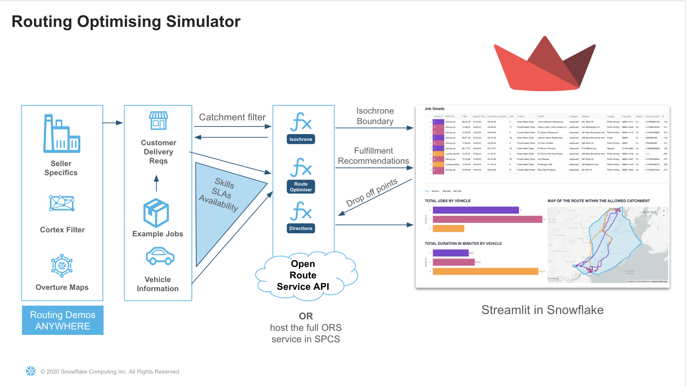


### Prerequisites
- A Snowflake Account - **NB:** Due to the Quickstart leveraging **External Access Integration**, a trial account cannot be used.  

 


### What You’ll Learn 

- An understanding of Geospatial data in Snowflake
- Using Cortex functions with Snowpark
- Create user 4 defined functions which call the open route service API 
    - simple directions point to point function
    - complex directions which include waypoints (drop off points)
    - Route Optimisation to match the demands with vehicle availabiity
    - Create an isochrone for catchment analysis
- Creating a location centric application using Streamlit 
- An insight to the Carto Overture Places dataset to build an innovative route planning simulation solution
  - Leverage vehicle capabilities and matching with job specifics
  - use a real dataset to simulate route plans for a specific depo


### What You’ll Build 
- A streamlit application to simulate route plans for potential customers anywhere in the world.  This could be for a potential new depot or simply to try out route optimisation which you will later replace with a real data pipeline.

<!-- ------------------------ -->
## Initial Setup
Duration: 2

Open up a new SQL worksheet and run the following commands. To open up a new SQL worksheet, select Projects » Worksheets, then click the blue plus button and select SQL worksheet.

```sql

CREATE DATABASE IF NOT EXISTS VEHICLE_ROUTING_SIMULATOR;
CREATE WAREHOUSE IF NOT EXISTS ROUTING_ANALYTICS;

CREATE SCHEMA IF NOT EXISTS UTILS;
CREATE SCHEMA IF NOT EXISTS ROUTING;

--- Use this to gain access to LLM functions if your snowflake region does not support them.

ALTER ACCOUNT SET CORTEX_ENABLED_CROSS_REGION = 'ANY_REGION';

--- Create 2 stages, one for the notebook, and the other for the Streamlit application

 CREATE STAGE IF NOT EXISTS VEHICLE_ROUTING_SIMULATOR.routing.notebook DIRECTORY = (ENABLE = TRUE) ENCRYPTION = (TYPE = 'SNOWFLAKE_SSE');

 CREATE STAGE IF NOT EXISTS VEHICLE_ROUTING_SIMULATOR.routing.streamlit DIRECTORY = (ENABLE = TRUE) ENCRYPTION = (TYPE = 'SNOWFLAKE_SSE');
```


<!-- ------------------------ -->
## Snowflake Marketplace
Duration: 10

Once logged, navigate to the Snowflake Marketplace - this is under Data Products > Snowflake Marketplace


Search for Overture Maps - Places

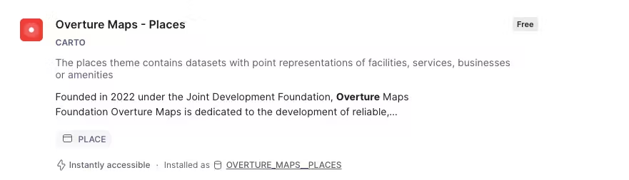

Click on the following dataset then press **Get** Do not change the database name.

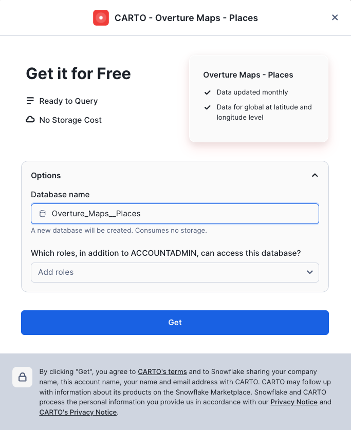

<!-- ------------------------ -->
## Add files to stages

Now we have created our database structure, we need to add the code in order to run a notebook and a streamlit app.  The code is stored in the github resource guide.


- Click [here](https://github.com/Snowflake-Labs/sfguide-Create-a-Route-Optimisation-and-Vehicle-Route-Plan-Simulator) to download the Source Code

- Go to the homepage in Snowsight

- Click on the **Data** icon and then navigate to **Databases** 

- Navigate to the **VEHICLE_ROUTING_SIMULATOR.ROUTING** schema

You should see two stages - **NOTEBOOK** and **STREAMLIT**.  The notebook code will need to be uploaded into the Notebook stage and the streamlit code will need to be uploaded to the streamlit stage.

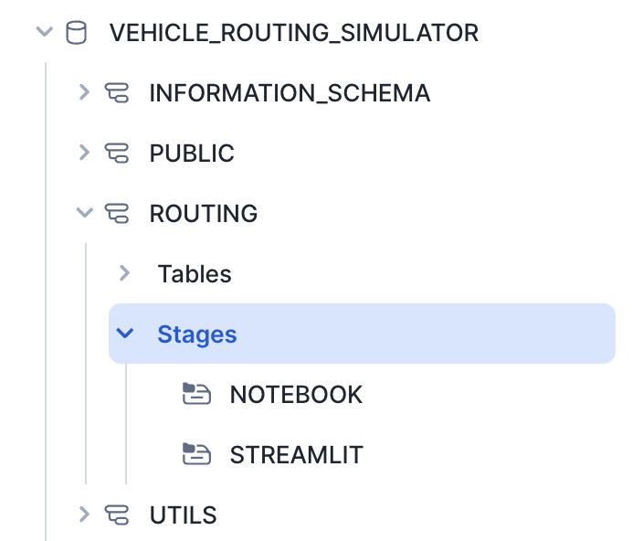

Navigate to the Notebook stage and choose the **ROUTING_ANALYTICS** warehouse to view the contents.  This will view all contents inside the directory.

Press **upload** to add the notebook files to the notebook stage.

It should look like this:

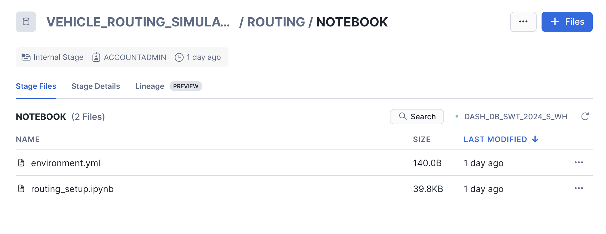


- Navigate to the Streamlit Stage

- Upload the **routing.py** and the **environment.yml** to the stage.

- Upload the config.toml in a new directory within the streamlit stage.  the directory needs to be called .streamlit

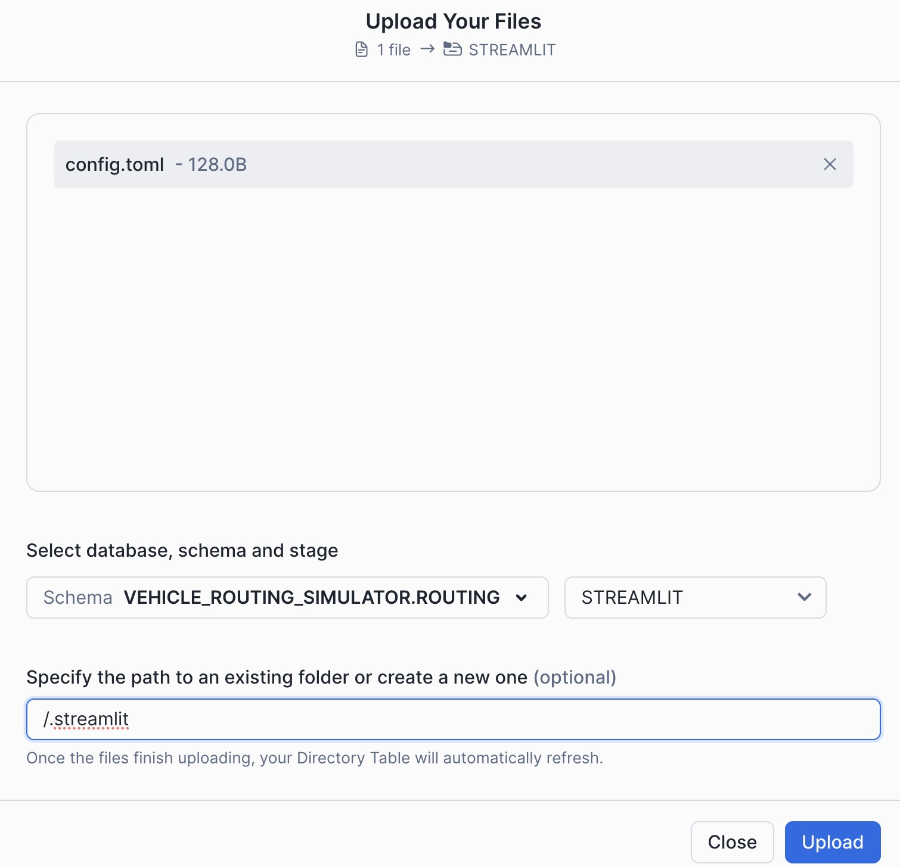

The final Directory Structure should look like this:

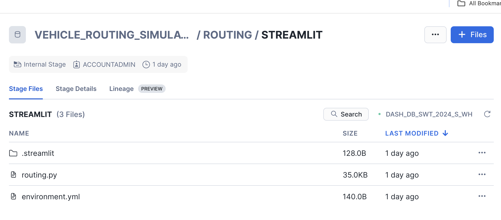


<!-- ------------------------ -->
## Create Notebook and Streamlit from Stages
Duration: 15

You will now leverage the code inside the stages to generate a Notebook and a Streamlit app.


- Use the existing Snowflake Worksheet in Snowsight to create them using the following SQL commands.

```sql

--notebook
CREATE OR REPLACE NOTEBOOK VEHICLE_ROUTING_SIMULATOR.ROUTING.ROUTING_DEMO_SETUP
FROM '@VEHICLE_ROUTING_SIMULATOR.ROUTING.NOTEBOOK'
MAIN_FILE = 'routing_setup.ipynb'
QUERY_WAREHOUSE = 'ROUTING_ANALYTICS';

ALTER NOTEBOOK VEHICLE_ROUTING_SIMULATOR.ROUTING.ROUTING_DEMO_SETUP ADD LIVE VERSION FROM LAST;

--streamlit
CREATE OR REPLACE STREAMLIT VEHICLE_ROUTING_SIMULATOR.ROUTING.VEHICLE_ROUTING_OPTIMISATION_SIMULATION
ROOT_LOCATION = '@VEHICLE_ROUTING_SIMULATOR.routing.streamlit'
MAIN_FILE = 'routing.py'
QUERY_WAREHOUSE = 'ROUTING_ANALYTICS'
COMMENT = '{"origin":"sf_sit", "name":"Dynamic Route Optimisation Streamlit app", "version":{"major":1, "minor":0}, "attributes":{"is_quickstart":0, "source":"streamlit"}}';

```

<!-- ------------------------ -->
## Begin the notebook tutorial 
Duration: 30

This tutorial is self contained inside the notebook which covers creating the functions, how to apply them and how to visualise the results.  At the end you will have a good understand of how the route optimisation servers works well with Snowflake Advanced analytical capabilites - which will also help you understand how the streamlit works.

- Within the notebook area in Snowsight, navigate to the **ROUTING_DEMO_SETUP** notebook and follow the instructions inside
- When you have completed the Notebook, navigate to the streamlit area (within projects) and open the **VEHICLE_ROUTING_SIMULATOR** app.

<!-- ------------------------ -->
## Run the Dynamic route Optimisation and Vehicle Route Plan Simulator
Duration: 10

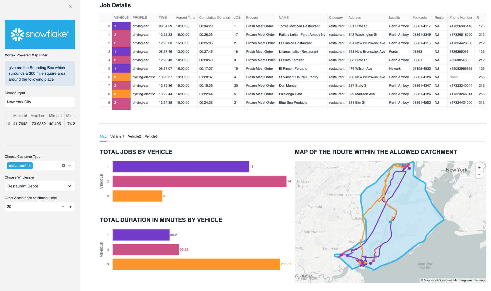

The streamlit app which you have open simulates potential routes to 29 delivery locations for selected customer types - all coming from a user definable wholesaler.  Currently there are 3 types of distributor available although with the notebook, you can create limitless industry categories:

-   Food
-   Health
-   Cosmetics

If you wish to add additional choice of distributor types, you can with the provided notebook.

The places you will work with are real as they are based on the Carto Overture points of interest maps which is a dataset freely available on the marketplace.  This allows you to create a location relevant scenario based on the needs of a specific usecase.


### Setting the Context of the Routing Scenario

- Open up the side menu
- Select the industry type.
- Choose the LLM model in order to search for a location.
- Type in a word or phrase in the world which will help locate the simulation.
- Choose the distance in KM for how wide you would like the app to search for nearby distributors.

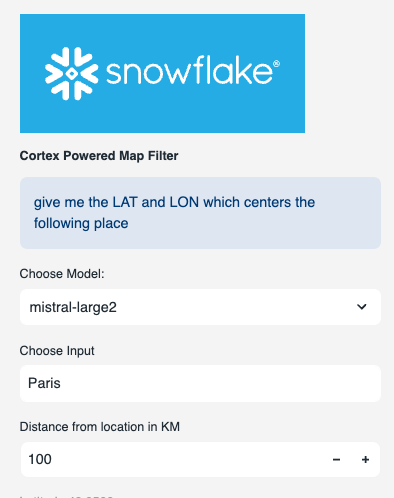

- Scroll down to get a map which highlights the place plus where all the nearby distributors are.  

- Scroll further down in the sidebar to select a specific distributor. - This is sorted by distance from the centre point.  You should have relevent wholesalers based on location and industry.

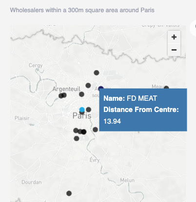


- Choose the type of customers you want to deliver goods to.  In this case, we are choosing supermarkets and restaurants.  Customer types can be configured using the provided notebook.


- There is an order acceptance catchment time - this will be used to generate an isochrone which will filter possible delivery locations within that isochrone.  The isochrone produced is a polygon shaped to all the possible places you can drive within the acceptable drive time.

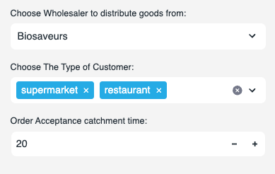

- You may close the side bar.

### Wholesaler Routing Walkthrough.

This is an example scenario based on the previously selected fields.

**Biosaveurs frozen and Fresh meat** within the Paris area.  This week they have 3 vehicles assigned to make up to 30 deliveries today.

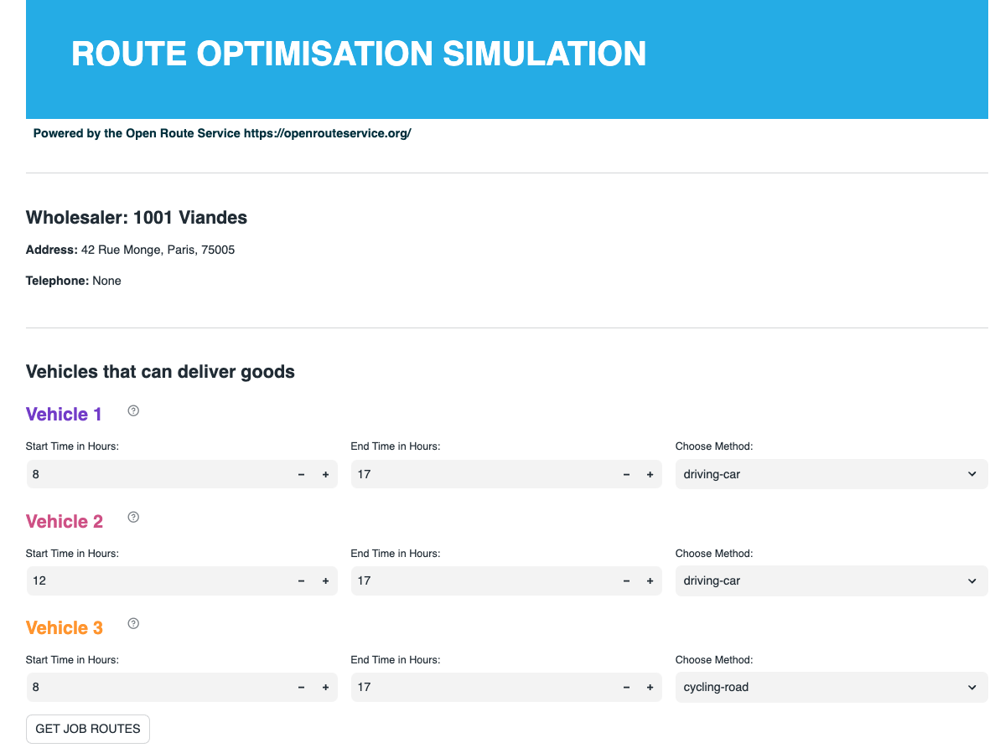

**Vehicle 1** will start between 8HRS and 17HRS - this vehicle is a car.  [hover over information]  the vehicle has a capacity limit of 4 and been assigned a skill level of 1 - this vehicle does not have a freezer so can only carry fresh food.


**Vehicle 2** will operate between 12 and 17hrs [change vehicle 2 from 8 till 12].  This will also be a car but has a skill level of 2 which means they can deliver frozen food.


**Vehicle 3** will also operate between 8hrs and 17hrs and has a skill level of 3 - they can carry  the premium food items - this vehicle will be an electric bycle [select cycling-road]. 

You can look at the vehicle skill level by hovering over the '?' against each vehicle.

Once the selections are made we will click on job routes to get the allocated jobs

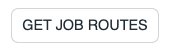

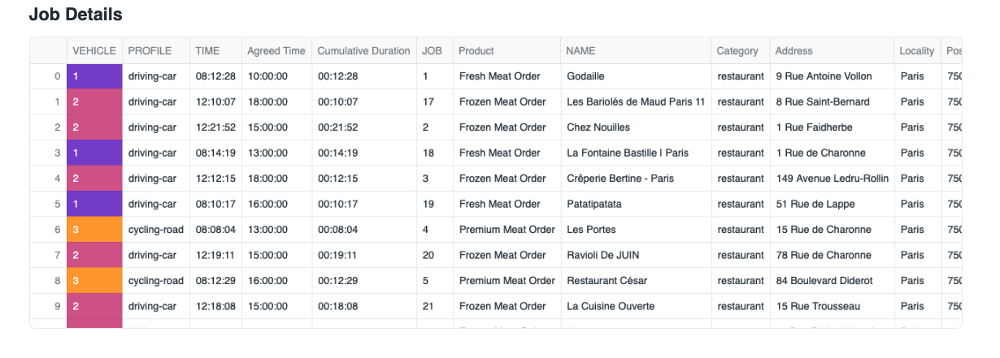

You will note that orders of the premium meet orders will only go to vehicle 3, the fresh meet will go to vehicle 2 and the frozen meat will go to vehicle 1.

(if i have more vehicles that have the same skills it will also look at the time slots as well.


Next we look at the map

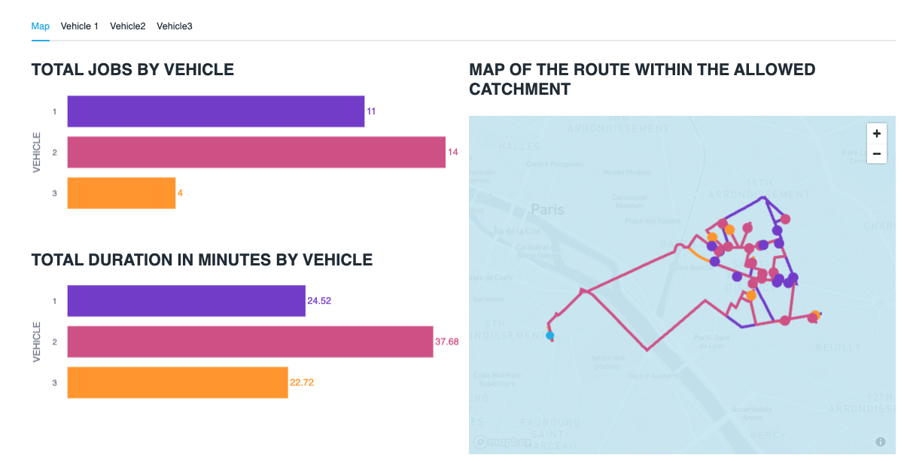

Vehicle 3 has the least amount of things to deliver but takes the longest to deliver them.  This is probably because the vehicle is a bicycle.  [change bcycle to hgv and re run]


When looking at the map itself, you will see the lines of the route for each vehicle, this is colour coded - you will also see circles which also represent the drops for each vehicle.  The hoverover will tell you what the point represents.


Tabs - this will give instructions for each segment of the drivers journey - the final stop is the return back to the wholesaler.

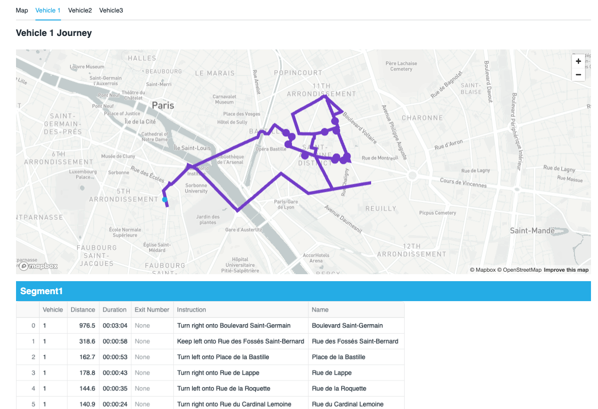


### How does it work

You can see that in a couple of clicks you can create a vehicle optimisation scenario from anywhere.


#### Finding the place
the app is using an LLM to retrieve a Latitude and longitude based on the word entered into the search.

Snowflake will use the ST_DWITHIN geospatial function to filter the overture maps to find all places of interest within an Xkm radius. 


#### The previously run notebook

This has created 3 functions which fetch data from 3 open route service endpoints

1 - isochrone - the isochrone endpoint will give you the catchement of a place based on drive time

2 - optimisation - based on restaurant selection and vehicles, it will create a set of work for each vehicle to deliver taking into account slot windows, vehicle availablity and vehicle skill / job requirement.

3 - Directions - based on what was retrieved from the optimisation, the directions api will return a route as a line string with all way points.  It will also retrieve a text based itenary.

Within the notebook, you have also created: 

- The overture dataset and included optimisation on geo and the category variant column to help with faster searching.

- An industry lookup table to add relevant context

- A job sample table

#### The mapping
The solution leverages pydeck to plot points, linestrings and polygons on a map.  The Isochrone is the polygon, the routes are linestrings and the places/points of interest are points.
<!-- ------------------------ -->
## The Streamlit Code
Duration: 10

This final Section, gives you some explanation as to how the streamlit code works.

The Streamlit puts all of the above components together. I will now explain how the main aspects of the code works.

**Setup Theming**

An important feature for better user experience is what the application looks like. I have themed the app to be consistant with Snowflake Branding. This is so much easier and flexible now we can add styles to Streamlit in Snowflake.

```python

st.markdown(
    """
    <style>
    .heading{
        background-color: rgb(41, 181, 232);  /* light blue background */
        color: white;  /* white text */
        padding: 60px;  /* add padding around the content */
    }
    .tabheading{
        background-color: rgb(41, 181, 232);  /* light blue background */
        color: white;  /* white text */
        padding: 10px;  /* add padding around the content */
    }
    .veh1 {
        color: rgb(125, 68, 207);  /* purple */
    }
    .veh2 {
        color: rgb(212, 91, 144);  /* pink */
    }
    .veh3 {
        color: rgb(255, 159, 54);  /* orange */
    }
    .veh4 {
        padding: 10px;  /* add padding around the content */
        color: rgb(0,53,69);  /* midnight */
    }
    
    body {
        color: rgb(0,53,69);
    }
    
    div[role="tablist"] > div[aria-selected="true"] {
        background-color: rgb(41, 181, 232);
        color: rgb(0,53,69);  /* Change the text color if needed */
    }
    
    </style>
    """,
    unsafe_allow_html=True
)


```

**Industry Lookup**

An  industry lookup snowpark dataframe is created. We then create a second dataframe which only selects the industry name. This will be used for the first sidebar filter

```python

lookup = session.table('LOOKUP')
industry = lookup.select('INDUSTRY')
```

Based on the selected industry, key variables are generated for added context to the standing data and filtering the points of interest dataset. The user selects the chosen industry from the sidebar, which then assign the variables

```python

#sidebar
with st.sidebar:
    st.image(image)
    choice = st.radio('select industry', industry)
    lookup = lookup.filter(col('INDUSTRY')==choice)
    lookup = lookup.with_column('IND',array_to_string('IND',lit(',')))
    lookup = lookup.with_column('IND2',array_to_string('IND2',lit(',')))
    
    lookuppd = lookup.to_pandas()


```

```python

#assign variables

pa = lookuppd.PA.iloc[0]
pb = lookuppd.PB.iloc[0]
pc = lookuppd.PC.iloc[0]
ind = lookuppd.IND.iloc[0]
ind2 = lookuppd.IND2.iloc[0]
ctype = json.loads(lookuppd.CTYPE.iloc[0])
stype = json.loads(lookuppd.STYPE.iloc[0])

```

**Vehicle Type Dropdown**

These vehicle types will be assigned to each of the 3 vehicles. These will be configured by the user.

```python

method =[
             'driving-car',
             'driving-hgv',
             'cycling-regular',
             'cycling-road',
             'cycling-mountain',
             'cycling-electric']

```

**Locations Dataset**
Here, a Snowpark Dataframe is created from the previously configured places dataset.

```python

places_f = session.table('places')

```
```python
places_f = places_f.select('GEOMETRY',call_function('ST_X',
                           col('GEOMETRY')).alias('LON'),
                           call_function('ST_Y',
                                  col('GEOMETRY')).alias('LAT'),
                                  col('ADDRESS'),
                                  col('CATEGORY'),
                                  col('ALTERNATE'),
                                  col('PHONES'),col('NAME'),
                                  col('GEOMETRY').alias('POINT')
```

**Cortex map filter**

This is where Cortex is used to filter the places dataset. The prompt is asking the model to 'give me the Latitude an Longitude which centers the following place.' The 'following place' is a free text field which the user enters such as: the Statue of Liberty, or London, or Heathrow Airport. They enter whatever they like and cortex will try and make sense of it.
The user also chooses an LLM model (I have found mistral-large2 works very well) and a distance. Different LLMs produce varying results of accuracy. For better accuracy, perhaps use Cortex Fine Tuning to load good examples into the model - such as the Overture Points of Interest itself. I found that mistral large 2 produced the result accuracy I needed without fine tuning. The distance is not really used for the LLM, but is used later to filter out potential distributors by straight line distance.

```python

with st.sidebar:
    st.markdown('##### Cortex Powered Map Filter')
    st.info(prompt)
    model = st.selectbox('Choose Model:',['reka-flash','mistral-large2'],1)
    place = st.text_input('Choose Input','Heathrow Airport')
    distance = st.number_input('Distance from location in KM',1,300,5)

```

Next, we need to do some prompt engineering. Below is the initial prompt to work with.

```python

prompt = ('give me the LAT and LON which centers the following place')

```

The idea is that the prompt feed the LLM and return the results to the LLM in the correct format. However, further engineering will be needed before we get reliably good results.

I engineered the prompt by adding text to the prompts such as ' return 3 value which are as follows…. and 'use the following json template'. This is to ensure that what is returned is very likely to be in the format that I would expect.

The results are returned as a single string which is simply converted to json by using the 'parse_json' function. You will note that before the json is parsed I removed characters that are sometimes generated in order to return the resulting json as markdown. This is great for display purposes but not so great if I only want the json. The replace function removes these characters if they exist.

Once parsed, I used standard geo and semi structured features in Snowflake to calculate points, present results in a structured form and order the returned results by distance.

This has all been wrapped with a function called choose_place(place,model,distance).

```python

prompt = ('give me the LAT and LON which centers the following place')


```

```python

@st.cache_data
def choose_place(place,model,distance):
    json_template = str({'LAT':44.3452,'LON':2.345,'DISTANCE':100})
    min_max = session.createDataFrame([{'PLACE':place}])\
    .with_column('CENTER',
        call_function('snowflake.cortex.complete',
        model,
        concat(lit(prompt),
        col('PLACE'),lit(f'return 3 values which \
        are as follows LAT and LON with {distance} as DISTANCE'),
        lit('use the following json template'),
        lit(json_template),
        lit('return only json. DO NOT RETURN COMMENTRY OR VERBIAGE'))
                                  )
    min_max = min_max.select(parse_json(replace(replace('CENTER',
                              "```",
                              ''),
                              'json',
                              '')).alias('CENTER'))
   return min_max.select(col('CENTER')['LAT'].astype(FloatType()).alias('LAT'),
     col('CENTER')['LON'].astype(FloatType()).alias('LON'),
     call_function('ST_ASWKT',
     call_function('ST_MAKEPOINT',
     col('LON'),col('LAT'))).alias('POINT'),
     col('CENTER')['DISTANCE'].astype(FloatType()).alias('"DISTANCE1"'),
     lit(0).alias('DISTANCE'),
     lit(place).alias('NAME')).to_pandas()


```

We will call this function in the next step of the app.

```python

bbox = choose_place(place,model,distance)

```

**Creating a scatter plot for suggested location based on user input**

This is a pydeck layer - which generates a map based on the returned result of the previously created function. The returned results will be a single blue spot. We will later create another layer which will scatter all the available depots based on this location and within the distance chosen by the user.

```python

context = pdk.Layer(
    'ScatterplotLayer',
    bbox,
    get_position=['LON', 'LAT'],
    filled=True,
    stroked=False,
    radius_min_pixels=6,
    radius_max_pixels=20,
    auto_highlight=True,
    get_fill_color=[41, 181, 232],
    pickable=True)
    st.divider()

```

Preview the results in a pydeck chart. The view state navigates the map to the position of the blue spot.

```python

view_state = pdk.ViewState(bbox.LON.iloc[0], bbox.LAT.iloc[0], zoom=4)
    st.pydeck_chart(pdk.Deck(layers=[context],map_style=None,initial_view_state=view_state))

```
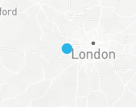

We will next add a new layer which will show all industry related industry suggestions that are within X distance of the blue spot.

**Searching the data for the right type of place (The What).**

We will search the 'what' by using the SEARCH function. This will search multiple columns within the same row to see if it matches the keywords stated in the industry lookup table. The industry must match the one which the user selected earlier. You will note that this search is being repeated twice - this is to search for two different concepts.

For example:

- Search one must contain one of these words:

    - hospital 
    - health 
    - pharmaceutical
    - drug 
    - healthcare 
    - pharmacy 
    - surgical

- From the results of search 1, search 2 must contain one of these words:
    - supplies 
    - warehouse 
    - depot 
    - distribution 
    - wholesaler 
    - distributors

```python
places_w = places_f.filter(call_function('ST_DWITHIN', 
      places_f['GEOMETRY'],
      to_geography(lit(bbox.POINT.iloc[0])),
      lit(bbox.DISTANCE1.iloc[0])*1000))#.cache_result()
```

```python

places_1 = places_w.filter(expr(f'''search((CATEGORY,
      ALTERNATE,
      NAME),'{ind}',
      analyzer=>'DEFAULT_ANALYZER')''')).cache_result()
places_1 = places_1.filter(expr(f'''search((CATEGORY,
      ALTERNATE,
      NAME),
      '{ind2}',
      analyzer=>'DEFAULT_ANALYZER')''')).cache_result()

```

The search is using the default analyzer, meaning it will accept any of the words in any order. This is useful to avoid missing things, but providing a second context by searching twice, you will get a better result accuracy. All search words are found in the industry lookup table.

**Filter the places by the 'where'**

We will filter by distance from the previously allocated point which was returned by the LLM.

```python

places_1 = places_1.with_column('DISTANCE',
                call_function('ST_DISTANCE',
                call_function('ST_MAKEPOINT',
                 col('LON'),
                 col('LAT')),
                 call_function('ST_MAKEPOINT',
                      lit(bbox.LON.iloc[0]),
                      lit(bbox.LAT.iloc[0]))))


```
```python
places_1 = places_1.with_column('DISTANCE',
           round(col('DISTANCE')/1000,2)).order_by('DISTANCE')
```
**Visualise the map of depots**

This creates a map function which returns the what and where as a scatter plot map within the sidebar. You will note that there is an additional layer here. This layer will return multiple plots as apposed to 1 which is what the first layer generated.

```python

@st.cache_data
    def places_cached(distance,bbox,ind):
        return places_1.to_pandas()

```
A tool tip is constructed to reveal the name of each potential distributor and the straight line distance.

```python

tooltip = {
   "html": """<b>Name:</b> {NAME} <b><br>Distance From Centre:</b> {DISTANCE}""",
   "style": {
       "width":"50%",
        "backgroundColor": "steelblue",
        "color": "white",
       "text-wrap": "balance"
            }
        }

```


defining the second layer for  potential distributors

```python
wholesalers = pdk.Layer(
    'ScatterplotLayer',
    places_cached(distance,bbox,ind),
    get_position=['LON', 'LAT'],
    filled=True,
    opacity=0.5,
    stroked=False,
    radius_min_pixels=6,
    radius_max_pixels=10,
    auto_highlight=True,
    get_fill_color=[0, 0, 0],
    pickable=True)
    st.divider()

```

```python

view_state = pdk.ViewState(bbox.LON.iloc[0], bbox.LAT.iloc[0], zoom=4)

```

**Map Layout**
Below will render the map.

```python

st.pydeck_chart(pdk.Deck(layers=[wholesalers,context],
  map_style=None,
  initial_view_state=view_state, 
  tooltip=tooltip))

```

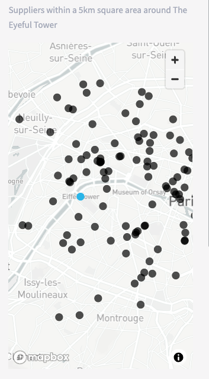

The returned results will also generate a list of places to select from using a drop down list:

```python

@st.cache_data
def warehouses(distance,bbox,ind):
  return places_1.group_by(col('NAME'))\
        .agg(avg('DISTANCE').alias('DISTANCE'))\
        .sort(col('DISTANCE').asc()).to_pandas()

```

```python

s_warehouse = st.selectbox('Choose Wholesaler to distribute goods from:',
                            warehouses(distance,
                                       bbox,
                                       ind))

```


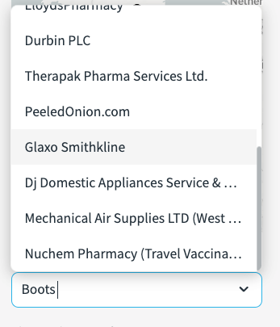


**Job Template**

The job template is joined to the the industry lookups for provide context to the types of goods being delivered. we will call this 'time slots'

```python

time_slots = session.table('JOB_TEMPLATE')
pa = time_slots.filter(col('PRODUCT')=='pa').join(lookup.select('PA'))
pb = time_slots.filter(col('PRODUCT')=='pb').join(lookup.select('PB'))
pc = time_slots.filter(col('PRODUCT')=='pc').join(lookup.select('PC'))

```
```python

time_slots = pa.union(pb).union(pc).with_column('PRODUCT',
                                        col('PA')).drop('PA')

```

**Customer Catchment Generation**

Now we need to generate another dataset - this time for potential customers which are located within catchment of a chosen depot.  The user will define the catchment based on a drive time.

```python

range_minutes = st.number_input('Order Acceptance catchment time:',0,120,20)

```

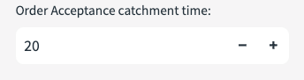

We will now focus on filtering a new point of interest dataset by drive time. This dataset will simulate typical customers within the catchment. For this, we will leverage the 'isochrone' function which calls the open route service api to build a catchment polygon.

```python

isochrone = session.create_dataframe([{'LON':start_1[0], 
                      'LAT':start_1[1], 
                      'METHOD':smethod,
                      'RANGE_MINS':range_minutes}])
st.write(isochrone)
        
isochrone = isochrone.select(call_function('UTILS.ISOCHRONES',
                          (col('METHOD'), 
                           col('LON'), 
                           col('LAT'), 
                           col('RANGE_MINS'))).alias('ISOCHRONE'))

isochrone2 = isochrone.select(to_geography(col('ISOCHRONE')['features'][0]['geometry']).alias('GEO')).cache_result()

```

You will see that after calling the isochrone function, we then join the resulting polygon dataset to the point of interest dataset using 'ST_WITHIN'. This ensures only jobs will be created within the catchment area of the polygon.

**Customer Type Filter**

Now lets filter **'the what'** on the customer dataset. We have all points of interests around the catchment of a depo, however, we have not specified what type of organisations these customers are. This is what the next drop down list is for. The user will pick the type of customer which is relevant to the industry. This example filter selection below will only retain organisations which are categorised as hospitals, dentists and pharmacies. Because the categories are in two fields, we will use the **SEARCH** function again.

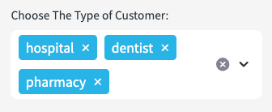

```python

places_2 = places_f.filter(expr(f'''search((CATEGORY,ALTERNATE,NAME),
                                '{" ".join(customer_type)}',
                                analyzer=>'DEFAULT_ANALYZER')'''))

```

We will limit our customer results to match the number of 'time slots' we have created from the job template, and generate a sample of the results.

```python

places_2 = places_2.join(isochrone2,
  call_function('ST_WITHIN',
  places_2['POINT'],
  isochrone2['GEO'])).sample(0.5).limit(time_slots.count()).cache_result()

```
Next, we will create a row number after ordering the sample by a random number. This row number will effectively become our unique **'consignment number'** which will be used in the optimisation service.

```python

window_spec = Window.order_by(random())
places_2 = places_2.with_column('ID',row_number().over(window_spec))
places_2 = places_2.join(time_slots,'ID')

```

Next we will join to the time slots by 'ID' which has been randomly assigned to **'our customers'**.

```python

places_2 = places_2.join(time_slots,'ID')

```

Now we will format the table in to presentable jobs. This will assign skills, time slots and capacity requirements.

```python

places_2_table = places_2.select('ID',
        col('PRODUCT').alias('"Product"'),
        col('SLOT_START').alias('"Slot Start"'),
        col('SLOT_END').alias('"Slot End"'),
        col('NAME').alias('Name'),
        col('CATEGORY').alias('"Category"'),
        col('ADDRESS')['freeform'].astype(StringType()).alias('"Address"'),
        col('ADDRESS')['locality'].astype(StringType()).alias('"Locality"'),
        col('ADDRESS')['postcode'].astype(StringType()).alias('"Postcode"'),
        col('ADDRESS')['region'].astype(StringType()).alias('"Region"'),
        col('PHONES').alias('"Phone Number"'))

    
places_2 = places_2.with_column('JOB',
              object_construct(lit('id'),col('ID'),
              lit('capacity'),lit([2]),
              lit('skills'),array_construct(col('SKILLS')),
               lit('time_window'),
               array_construct(col('SLOT_START')*60*60,col('SLOT_END')*60*60),
               lit('location'),array_construct(col('LON'),col('LAT'))
                      py))

    

jobs = places_2.select(array_agg('JOB').alias('JOB'))


```

**The Vehicles**
The example I have created, is an example of only 3 vehicles at pre defined skill levels.

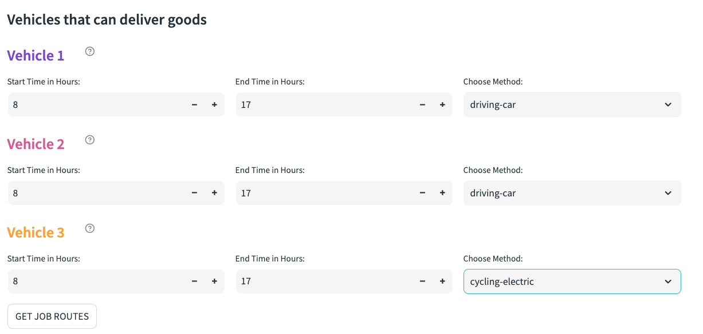

The vehicle location is then Aligned to the previously selected depot. In reality, vehicles might have varying start destinations - however, for simplicity all vehicle starting points are the same.

```python

places_vehicles = places_1.filter(col('NAME')==s_warehouse).cache_result()

```

Construct each configurable vehicle. Below is an example of one of the vehicles. You will see that we are converting the start and end time of each vehicle to seconds - likewise for the customers, the agreed delivery times for the optimisation service to work are also in seconds.

```python

vehicle_1 = places_vehicles.select(object_construct(lit('profile'),
                      lit(smethod),
                      lit('skills'),
                      lit(veh1_skills),
                      lit('id'),
                      lit(1),
                      lit('start'),
                      array_construct(col('LON'),col('LAT')),
                      lit('end'),
                      array_construct(col('LON'),col('LAT')),
                      lit('time_windows'),
                      array_construct(lit(start_time_0*60*60),
                                      lit(end_time_0*60*60)),
                      lit('capacity'),
                      lit(veh1_capacity)).alias('VEHICLE'))

```

Now, we present the configurable aspects of each vehicle to the user. You will note that this is an example of utilising the previously configured styling.

```python

st.markdown('<h4 class="veh2">Vehicle 2</h2>', 
    unsafe_allow_html=True, 
    help=f'''Vehicle 2 {skill_types[veh2_skills[0]-1]} and a capacity of {veh2_capacity[0]}''')
    
    col4,col5,col6 = st.columns(3)
    with col4:
        start_time_1 = st.number_input('Start Time in Hours:',0,24,8,key=3)
    with col5:
        end_time_1 = st.number_input('End Time in Hours:',start_time_1,24,17,key=4)
    with col6:
        smethod_1 = st.selectbox('Choose Method:',method, key=6)

```

For further formatting - when the job results are returned after going through the optimisation service, it will be nice to clearly see what vehicles are aligned to what job. This detail is added to the dataframe which gives data driven colour coding.

```python

##### ADD VEHICLE_COLOR TO VEHICLES)
    vehicle_1 = vehicle_1.with_column('R',lit(125))
    vehicle_1 = vehicle_1.with_column('G',lit(68))  
    vehicle_1 = vehicle_1.with_column('B',lit(207)) 

    vehicle_2 = vehicle_2.with_column('R',lit(212))
    vehicle_2 = vehicle_2.with_column('G',lit(91))  
    vehicle_2 = vehicle_2.with_column('B',lit(144)) 

    vehicle_3 = vehicle_3.with_column('R',lit(255))
    vehicle_3 = vehicle_3.with_column('G',lit(159))  
    vehicle_3 = vehicle_3.with_column('B',lit(54))

```

Next, we union all vehicles into a new dataset called **vehsdet**.

```python

vehsdet = vehicle_1.union(vehicle_2).union(vehicle_3).with_column('ID',
              col('VEHICLE')['id'])\
    .with_column('PROFILE',
                 col('VEHICLE')['profile'].astype(StringType()))\
    .with_column('WINDOW',
                  col('VEHICLE')['time_windows'].astype(StringType()))
    vehs = vehsdet.select(array_agg('VEHICLE').alias('VEH'))
    vehsdet = vehsdet.drop('VEHICLE')


```

**Route Optimisation Service**

So we have our 'Customers' and we have our 'Vehicles'. We now need to create our route plans for each vehicle using the Route Optimisation Service. This will effectively push our jobs and vehicles into the api which will return our vehicle route plans based on information such as drive time, consignment needs and vehicle availability.

```python

optim = jobs.join(vehs).select('JOB',
                'VEH',call_function('UTILS.OPTIMIZATION',
                col('JOB'),col('VEH')).alias('OPTIMIZATION'))

```

The returned results will be an array of various objects. We will extract out the parts we want in order to display the results clearly.

```python

optim = optim.with_column('CODES',col('OPTIMIZATION')['codes'])
        optim = optim.with_column('ROUTES',col('OPTIMIZATION')['routes'])
        optim = optim.with_column('SUMMARY',col('OPTIMIZATION')['summary'])
        optim = optim.with_column('UNASSIGNED',col('OPTIMIZATION')['unassigned'])
    
    
    
        optim = optim.with_column('COST',col('SUMMARY')['cost'])\
        .with_column('DURATION',col('SUMMARY')['duration'])\
        .with_column('NUMBER_OF_ROUTES',col('SUMMARY')['routes']).drop('SUMMARY')

        optim = optim.join_table_function('flatten',col('ROUTES'))\
        .select('VALUE')

        optim = optim.select(col('VALUE')['amount'].alias('AMOUNT'),
                         col('VALUE')['vehicle'].alias('VEHICLE'),
                         col('VALUE')['duration'].alias('DURATION'),
                         col('VALUE')['steps'].alias('STEPS'),
                        col('VALUE')['location'][0].alias('LON'),
                         col('VALUE')['location'][0].alias('LAT')p

```

As described in the route optimisation function, the output will give steps for the journey along with other measures such as duration and what vehicle will be assigned. 


The **directions API** will then be used to get detailed instructions for each step.

```python

optim_line = optim_line\
        .select('VEHICLE','R','G','B','PROFILE','ID','TOTAL_JOBS',
            call_function('UTILS.DIRECTIONS_with_way_points',
                                    col('PROFILE'),
                            col('LINE')).alias('DIRECTIONS')).cache_result()

```

This will return detailed route plans which include all drop offs, line strings as well as written instructions.

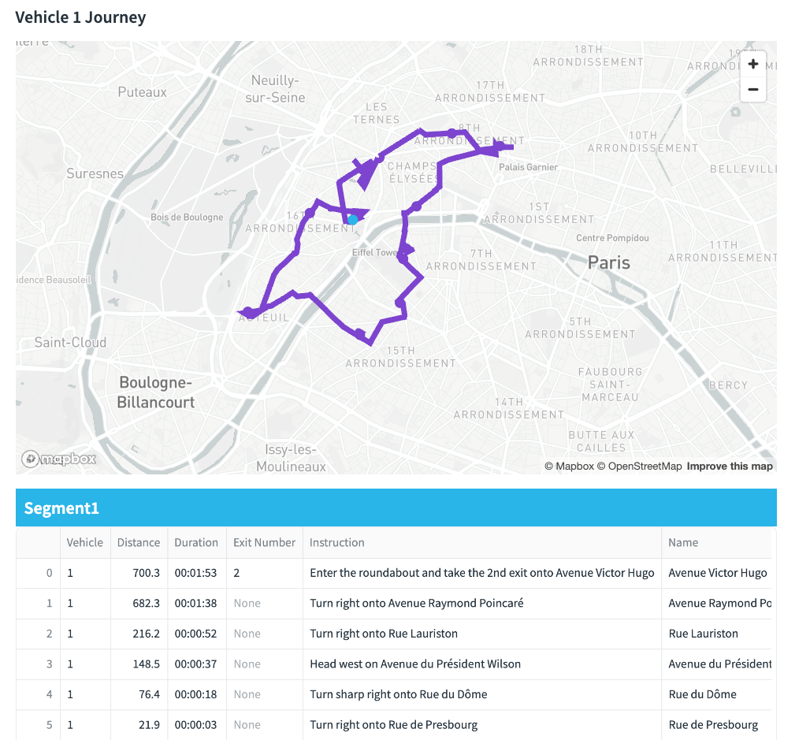

Two layers are created for the visualisation - one for the line paths and the other for the drop offs. The layers have been generated by a python function in order to reuse the code for each vehicle. This is so i can show a vehicle plan each containing an independant map within each tab.

```python

def veh_journey(dataframe,vehicle):
            vehicle_1_path = pdk.Layer(
            type="PathLayer",
            data=dataframe[dataframe['VEHICLE']==vehicle],
            pickable=True,
            get_color=["0+R","0+G","0+B"],
            width_scale=20,
            width_min_pixels=4,
            width_max_pixels=7,
            get_path="coordinates",
            get_width=5)
            return vehicle_1_path

        def vehicle_drops(dataframe,vehicle):
            layer_end_v1 = pdk.Layer(
            'ScatterplotLayer',
            dataframe[dataframe['VEHICLE']==vehicle],
            get_position=['LON', 'LAT'],
            filled=True,
            stroked=False,
            radius_min_pixels=6,
            radius_max_pixels=10,
            line_width_min_pixels=5,
            auto_highlight=True,
            get_radius=50,
            get_line_color=["0+R","0+G","0+B"],
            get_fill_color=["0+R","0+G","0+B"],
            pickable=True)
            return layer_end_v1


```

Below you can see an example of all three vehicles travelling around Paris to drop goods off. This is combining points and line string layers for each vehicle as well as the isochrone layer.


#### Considerations
The Job details may plot routes outside the agreed time.  The Demo has only vehicles where each vehicle has a unique skill.  We will need more vehicles / less skills to prevent these violations.

The app is confined to a B2B model as we do not have public names and addresses of B2C consumers.  If a B2C simulator is needed, then an alternative 'customer' dataset other than the 'places' dataset is needed.


<!-- ------------------------ -->
## Conclusion and Resources
Duration: 5
### Conclusion

So you will now see that by combining AI, freely accessible points of interests, easy to use geospatial functions, the ability to securely call the open route service and the powers of Streamlit in Snowflake - creating innovative geospatial applications  is entirely possible. 

Snowflake provides powerful solutions when you bring Snowflake's advanced analytics, Cortex, Snowpark and Streamlit's visualization capabilities together.  Also, by leveraging the open route service (or even an alternative provider such as the Carto Toolbox) using external integrations provides another level of geospatial capabilites such as route optimisation, directions and isochrones.  


### What You Learned

You will have learned the following:
 - How to use Snowflake Cortex can be used as a location filter, which can filter a comprehensive point of interest dataset to anywhere in the world.

- Use text based Search capabilities for advanced filtering which adds accurate context to a simulation

- How to utilise Pydeck to create a multi layered map

- Leverage the open route service to create the following

    - isochrones (catchements) based on drive time
    - Simple Directions and Directions which include waypoints
    - Route Optimisations


### Related Resources


#### Source code

- [Source Code on Github](https://github.com/Snowflake-Labs/sfguide-Create-a-Route-Optimisation-and-Vehicle-Route-Plan-Simulator)


#### Further Related Material

- [Geospatial Functions](https://docs.snowflake.com/en/sql-reference/functions-geospatial)

- [H3 Indexing](https://h3geo.org/docs/)

- [Streamlit](https://streamlit.io/)

- [Pydeck](https://deckgl.readthedocs.io/en/latest/index.html#)

- [Using Cortex and Streamlit With Geospatial Data](https://quickstarts.snowflake.com/guide/using_snowflake_cortex_and_streamlit_with_geospatial_data/index.html#1)

- [Getting started with Geospatial AI and ML using Snowflake Cortex](https://quickstarts.snowflake.com/guide/geo-for-machine-learning/index.html?index=..%2F..index#0)

