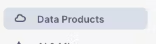

author: Becky O’Connor
id: Create-a-Route-Optimisation-and-Vehicle-Route-Plan-Simulator
summary: This tutorial leverages Geospatial Analytics, Stramlit, Cortex and the Open Route Service to optimise vehicle routes in order to distribute goods to chosen destinations on time.
categories: Data-Sharing, Cortex, solution-examples, streamlit
environments: web
status: Published 
feedback link: https://github.com/Snowflake-Labs/sfguides/issues
tags: Geospatial, Advanced Analytics, Data Engineering, United kingdom, Geospatial

# Create a Route Optimisation and Vehicle Route Plan Simulator
<!-- ------------------------ -->
## Overview 
Duration: 1

This tutorial leverages the [Open Route Service](https://openrouteservice.org/) to optimise vehicle routes in order to distribute goods to chosen destinations on time.

The results are flexible in terms of location - you can choose to simulate routes from anywhere in the world.

The open route service is free to use but there are restrictions in the number of calls to the freely available api api.

If you need a solution  without imits, you may wish  to install the services inside a container.

https://openrouteservice.org/plans/

Either way, Snowflake allows for creation of a fully interactive route simulator which will benefit many vehicle centric industries such as **retail**, **distribution**, **healthcare** and more.


In this quickstart, we will be leveraging the the tools within Snowflake to:

  - **Visualise** the location of Delivery Points anywhere in the world understand the best routes for vehicles to deliver goods or services from a designated depo. We will use the multi layer mapping capabilities of pydeck to create easy to understand routing plans

  - **Discover** what it would look like to route goods to real world points of interest such as restaurants or supermarkets using the Overture Point of Interest dataset provided freely on the marketplace by Carto.

  - **Understand** numerous routing scenarios accross a variety of industries anywhere in the world.


### Route Planning And Optimisation Architecture
Here is a flow of what you will achieve if you complete all steps in the quickstart.  You will be reminded of where you are at key intervals.

  


### Prerequisites
- A Snowflake Account - **NB:** Due to the tutorial leveraging the External Integration capability, you can not use a free trial unless you specficially ask you Snowflake Representitive to enable it.

 


### What You’ll Learn 

- An understanding of Geospatial data in Snowflake
- Using Cortex functions with Snowpark
- Create user 4 defined functions which call the open route service API 
    - simple directions point to point function
    - complex directions which include waypoints (drop off points)
    - Route Optimisation to match the demands with vehicle availabiity
    - Create an isochrone for catchment analysis
- Creating a location centric application using Streamlit 
- An insight to the Carto Overture Places dataset to build an innovative route planning simulation solution
  - Leverage vehicle capabilities and matching with job specifics
  - use a real dataset to simulate route plans for a specific depo


### What You’ll Build 
- A streamlit application to simulate route plans for potential customers anywhere in the world.  This could be for a potential new depot or simply to try out route optimisation which you will later replace with a real data pipeline.

<!-- ------------------------ -->
## Initial Setup
Duration: 2

Open up a new SQL worksheet and run the following commands. To open up a new SQL worksheet, select Projects » Worksheets, then click the blue plus button and select SQL worksheet.

```sql

CREATE DATABASE IF NOT EXISTS VEHICLE_ROUTING_SIMULATOR;
CREATE WAREHOUSE IF NOT EXISTS ROUTING_ANALYTICS;

CREATE SCHEMA IF NOT EXISTS UTILS;
CREATE SCHEMA IF NOT EXISTS ROUTING;

--- Use this to gain access to LLM functions if your snowflake region does not support them.

ALTER ACCOUNT SET CORTEX_ENABLED_CROSS_REGION = 'ANY_REGION';

--- Create 2 stages, one for the notebook, and the other for the Streamlit application

 CREATE STAGE IF NOT EXISTS VEHICLE_ROUTING_SIMULATOR.routing.notebook DIRECTORY = (ENABLE = TRUE) ENCRYPTION = (TYPE = 'SNOWFLAKE_SSE');

 CREATE STAGE IF NOT EXISTS VEHICLE_ROUTING_SIMULATOR.routing.streamlit DIRECTORY = (ENABLE = TRUE) ENCRYPTION = (TYPE = 'SNOWFLAKE_SSE');
```


<!-- ------------------------ -->
## Snowflake Marketplace
Duration: 10

Once logged, navigate to the Snowflake Marketplace - this is under Data Products > Snowflake Marketplace




Search for Overture Maps - Places


Click on the following dataset then press **Get** Do not change the database name.


## Add files to stages

Click [here] do download the Source Code(https://github.com/Snowflake-Labs/Create-a-Route-Optimisation-and-Vehicle-Route-Plan-Simulator/tree/main/Notebook)

- Within the Downloaded Repository, open the **Notebook** folder and  upload all the contents into the notebook stage
- Within the Downloaded Repository, open the **Streamlit** folder and  upload all the contents into the streamlit stage
- Please ensure that the config.toml file which is currently residing in the streamlit folder is loaded into a new folder called **.streamlit**  You can do this by typing in **.streamlit**  "create new folder" option


## Create Notebook and Streamlit from Stages
Duration: 15

You will now create a Notebook and a Streamlit.  For this exercise, you will use SQL to create the notebook and streamlit.

- Use the existing Snowflake Worksheet to create them using the following SQL commands.

```sql

--notebook
CREATE OR REPLACE NOTEBOOK VEHICLE_ROUTING_SIMULATOR.ROUTING.ROUTING_DEMO_SETUP
FROM '@VEHICLE_ROUTING_SIMULATOR.ROUTING.NOTEBOOK'
MAIN_FILE = 'routing_setup.ipynb'
QUERY_WAREHOUSE = 'ROUTING_ANALYTICS';

ALTER NOTEBOOK VEHICLE_ROUTING_SIMULATOR.ROUTING.ROUTING_DEMO_SETUP ADD LIVE VERSION FROM LAST;

--streamlit
CREATE OR REPLACE STREAMLIT VEHICLE_ROUTING_SIMULATOR.ROUTING.VEHICLE_ROUTING_OPTIMISATION_SIMULATION
ROOT_LOCATION = '@VEHICLE_ROUTING_SIMULATOR.routing.streamlit'
MAIN_FILE = 'routing.py'
QUERY_WAREHOUSE = 'ROUTING_ANALYTICS'
COMMENT = '{"origin":"sf_sit", "name":"Dynamic Route Optimisation Streamlit app", "version":{"major":1, "minor":0}, "attributes":{"is_quickstart":0, "source":"streamlit"}}';

```


## Begin the notebook tutorial 
Duration: 30

This tutorial is self contained inside the notebook which covers creating the functions, how to apply them and how to visualise the results.  At the end you will have a good understand of how the route optimisation servers works well with Snowflake Advanced analytical capabilites - which will also help you understand how the streamlit works.

- Within the notebook area in Snowsight, navigate to the **ROUTING_DEMO_SETUP** notebook and follow the instructions inside

- When you have completed the Notebook, navigate to the streamlit area (within projects) and open the vehicle routing optimisation simulation app

## Run the Dynamic route Optimisation and Vehicle Route Plan Simulator
Duration: 20


This app simulates potential routes to 29 delivery locations for selected customer types - all coming from a user definable wholesaler.  Currently there are 3 types of distributor available although with the notebook, you can create limitless industry categories:

-   Food
-   Health
-   Cosmetics

If you wish to add additional choice of distributor types, you can with the provided notebook.

The places you will work with are real as they are based on the Carto Overture points of interest maps which is a dataset freely available on the marketplace.  This allows you to create a location relevant scenario based on the needs of a specific usecase.


### Setting the Context of the Routing Scenario

- Open up the side menu
- Select the industry type.
- Choose the LLM model in order to search for a location.
- Type in a word or phrase in the world which will help locate the simulation.
- Choose the distance in KM for how wide you would like the app to search for nearby distributors.


- Scroll down to get a map which highlights the place plus where all the nearby distributors are.  

- Scroll further down in the sidebar to select a specific distributor. - This is sorted by distance from the centre point.  You should have relevent wholesalers based on location and industry.


- Choose the type of customers you want to deliver goods to.  In this case, we are choosing supermarkets and restaurants.  Customer types can be configured using the provided notebook.


- There is an order acceptance catchment time - this will be used to generate an isochrone which will filter possible delivery locations within that isochrone.  The isochrone produced is a polygon shaped to all the possible places you can drive within the acceptable drive time.


- You may close the side bar.

### Wholesaler Routing Walkthrough.

This is an example scenario based on the previously selected fields.

**Biosaveurs frozen and Fresh meat** within the Paris area.  This week they have 3 vehicles assigned to make up to 30 deliveries today.


**Vehicle 1** will start between 8HRS and 17HRS - this vehicle is a car.  [hover over information]  the vehicle has a capacity limit of 4 and been assigned a skill level of 1 - this vehicle does not have a freezer so can only carry fresh food.


**Vehicle 2** will operate between 12 and 17hrs [change vehicle 2 from 8 till 12].  This will also be a car but has a skill level of 2 which means they can deliver frozen food.


**Vehicle 3** will also operate between 8hrs and 17hrs and has a skill level of 3 - they can carry  the premium food items - this vehicle will be an electric bycle [select cycling-road]. 

You can look at the vehicle skill level by hovering over the '?' against each vehicle.

Once the selections are made we will click on job routes to get the allocated jobs


You will note that orders of the premium meet orders will only go to vehicle 3, the fresh meet will go to vehicle 2 and the frozen meat will go to vehicle 1.

(if i have more vehicles that have the same skills it will also look at the time slots as well.


Next we look at the map


Vehicle 3 has the least amount of things to deliver but takes the longest to deliver them.  This is probably because the vehicle is a bicycle.  [change bcycle to hgv and re run]


When looking at the map itself, you will see the lines of the route for each vehicle, this is colour coded - you will also see circles which also represent the drops for each vehicle.  The hoverover will tell you what the point represents.


Tabs - this will give instructions for each segment of the drivers journey - the final stop is the return back to the wholesaler.


### How does it work

You can see that in a couple of clicks you can create a vehicle optimisation scenario from anywhere.


#### Finding the place - the app is using an LLM to retrieve a Latitude and longitude based on the word entered into the search.

Snowflake will use the ST_DWITHIN geospatial function to filter the overture maps to find all places of interest within X km radius. 


#### The previously run notebook

This has created 3 functions which fetch data from 3 open route service endpoints

1 - isochrone - the isochrone endpoint will give you the catchement of a place based on drive time

2 - optimisation - based on restaurant selection and vehicles, it will create a set of work for each vehicle to deliver taking into account slot windows, vehicle availablity and vehicle skill / job requirement.

3 - Directions - based on what was retrieved from the optimisation, the directions api will return a route as a line string with all way points.  It will also retrieve a text based itenary.

#### The mapping
The solution leverages pydeck to plot points, linestrings and polygons on a map.  The Isochrone is the polygon, the routes are linestrings and the places/points of interest are points.

## The Streamlit Code
Duration: 10

Please read my medium post - **[Create a Route Optimisation and Vehicle Route Plan Simulator](https://medium.com/@becky.oconnor/create-a-route-optimisation-and-vehicle-route-plan-simulator-f8cdd2df28e6)** for a detailed write up about the code itself.

Here are some of the key features which the medium post focuses on:

**Setup Theming**

An important feature for better user experience is what the application looks like. I have themed the app to be consistant with Snowflake Branding. This is so much easier and flexible now we can add styles to Streamlit in Snowflake.

```python

st.markdown(
    """
    <style>
    .heading{
        background-color: rgb(41, 181, 232);  /* light blue background */
        color: white;  /* white text */
        padding: 60px;  /* add padding around the content */
    }
    .tabheading{
        background-color: rgb(41, 181, 232);  /* light blue background */
        color: white;  /* white text */
        padding: 10px;  /* add padding around the content */
    }
    .veh1 {
        color: rgb(125, 68, 207);  /* purple */
    }
    .veh2 {
        color: rgb(212, 91, 144);  /* pink */
    }
    .veh3 {
        color: rgb(255, 159, 54);  /* orange */
    }
    .veh4 {
        padding: 10px;  /* add padding around the content */
        color: rgb(0,53,69);  /* midnight */
    }
    
    body {
        color: rgb(0,53,69);
    }
    
    div[role="tablist"] > div[aria-selected="true"] {
        background-color: rgb(41, 181, 232);
        color: rgb(0,53,69);  /* Change the text color if needed */
    }
    
    </style>
    """,
    unsafe_allow_html=True
)

```

**Industry Lookup**

I have created an industry lookup snowpark dataframe. I then created a second dataframe which only selects the industry name. This will be used for the first sidebar filter

**Create Industry Variables**

Based on the selected industry, key variables are generated for added context to the standing data and filtering the points of interest dataset. The user selects the chosen industry from the sidebar, which then assign the variables

**Vehicle type Dropdown**

These vehicle types will be assigned to each of the 3 vehicles. This is configured by the user

```python

method =['driving-car',
             'driving-hgv',
             'cycling-regular',
             'cycling-road',
             'cycling-mountain',
            'cycling-electric']

```

**Locations Dataset**

Here, a Snowpark Dataframe is created from the previously configured places dataset.

```python
places_f = session.table('places')

```

Standard snowpark dataframe constructs are used to extract the lat and lon from the geometry field as well as extracting key features

```python
places_f = places_f.select('GEOMETRY',call_function('ST_X',
        col('GEOMETRY')).alias('LON'),
         call_function('ST_Y',
               col('GEOMETRY')).alias('LAT'),
               col('ADDRESS'),
               col('CATEGORY'),
               col('ALTERNATE'),
               col('PHONES'),col('NAME'),
               col('GEOMETRY').alias('POINT')
```

**Text based search function - SEARCH()**

Searching the data for the right type of place (The What).
We will search the 'what' by using the SEARCH option. This will search multiple columns within the same row to see if it matches the keywords stated in the industry lookup table. The industry must match the one which the user selected earlier. You will note that this search is being repeated twice - this is to search for two different concepts.

```python

places_1 = places_w.filter(expr(f'''search((CATEGORY,
      ALTERNATE,
      NAME),'{ind}',
      analyzer=>'DEFAULT_ANALYZER')''')).cache_result()
places_1 = places_1.filter(expr(f'''search((CATEGORY,
      ALTERNATE,
      NAME),
      '{ind2}',
      analyzer=>'DEFAULT_ANALYZER')''')).cache_result()

```

There are many more examples of the code which I have explained in the medium post, so please read for more details.

#### Considerations
The Job details may plot routes outside the agreed time.  The Demo has only vehicles where each vehicle has a unique skill.  We will need more vehicles / less skills to prevent these violations.

The app is confined to a B2B model as we do not have public names and addresses of B2C consumers.  If a B2C simulator is needed, then an alternative 'customer' dataset other than the 'places' dataset is needed.


<!-- ------------------------ -->
## Conclusion and Resources
Duration: 5
### Conclusion

Snowflake provides powerful solutions when you bring Snowflake's advanced analytics, Cortex, Snowpark and Streamlit's visualization capabilities together.  Also, by leveraging the open route service (or even an alternative provider such as the Carto Toolbox) using external integrations provides another level of geospatial capabilites such as route optimisation, directions and isochrones.  


### What You Learned

You will have learned the following:
 - How to use Snowflake Cortex can be used as a location filter, which can filter a comprehensive point of interest dataset to anywhere in the world.

- Use text based Search capabilities for advanced filtering which adds accurate context to a simulation

- How to utilise Pydeck to create a multi layered map

- Leverage the open route service to create the following

    - isochrones (catchements) based on drive time
    - Simple Directions and Directions which include waypoints
    - Route Optimisations


### Related Resources


#### Source code

- [Source Code on Github](https://github.com/Snowflake-Labs/Create-a-Route-Optimisation-and-Vehicle-Route-Plan-Simulator)
- [Publication](https://medium.com/@becky.oconnor/create-a-route-optimisation-and-vehicle-route-plan-simulator-f8cdd2df28e6)

#### Further Related Material

- [Geospatial Functions](https://docs.snowflake.com/en/sql-reference/functions-geospatial)

- [H3 Indexing](https://h3geo.org/docs/)

- [Streamlit](https://streamlit.io/)

- [Pydeck](https://deckgl.readthedocs.io/en/latest/index.html#)

- [Using Cortex and Streamlit With Geospatial Data](https://quickstarts.snowflake.com/guide/using_snowflake_cortex_and_streamlit_with_geospatial_data/index.html#1)

- [Getting started with Geospatial AI and ML using Snowflake Cortex](https://quickstarts.snowflake.com/guide/geo-for-machine-learning/index.html?index=..%2F..index#0)

