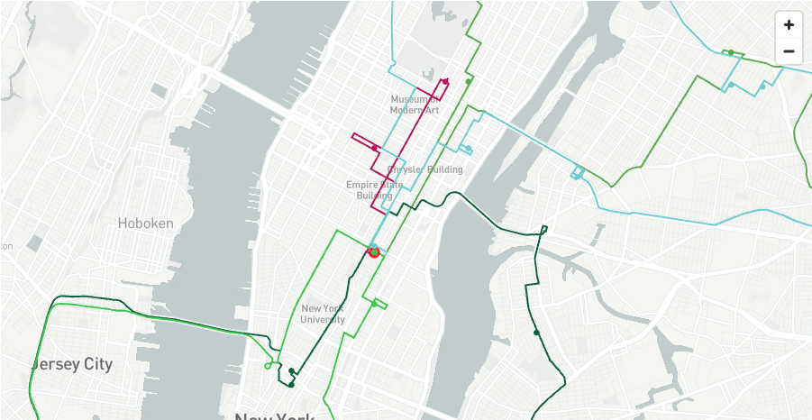
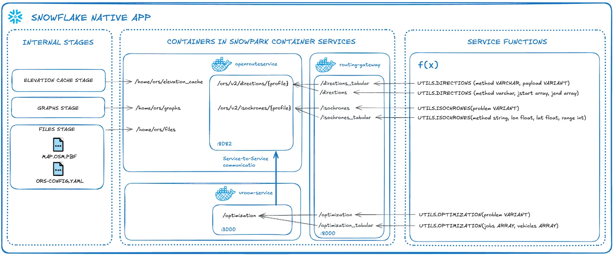
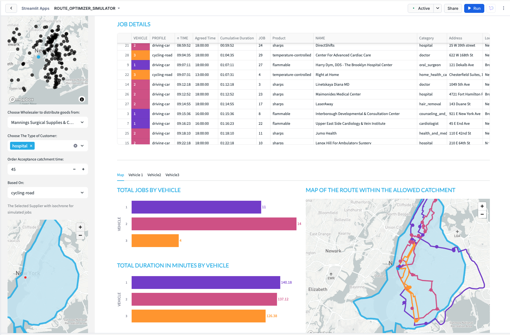
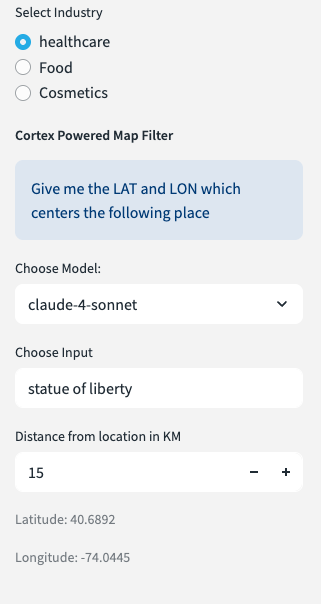
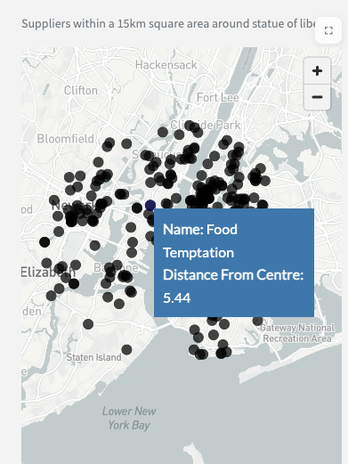
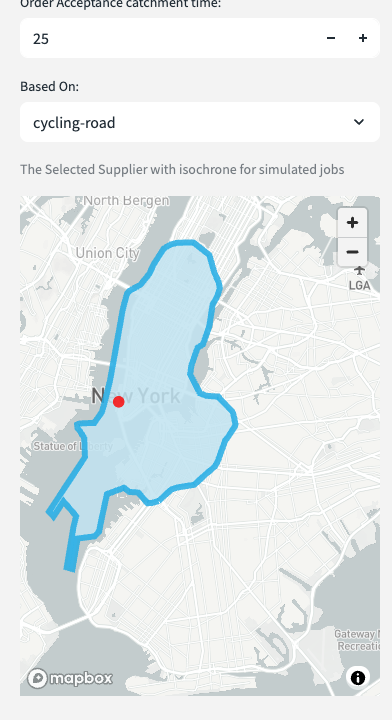
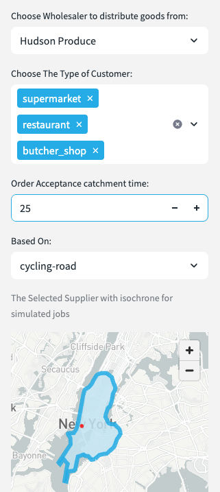
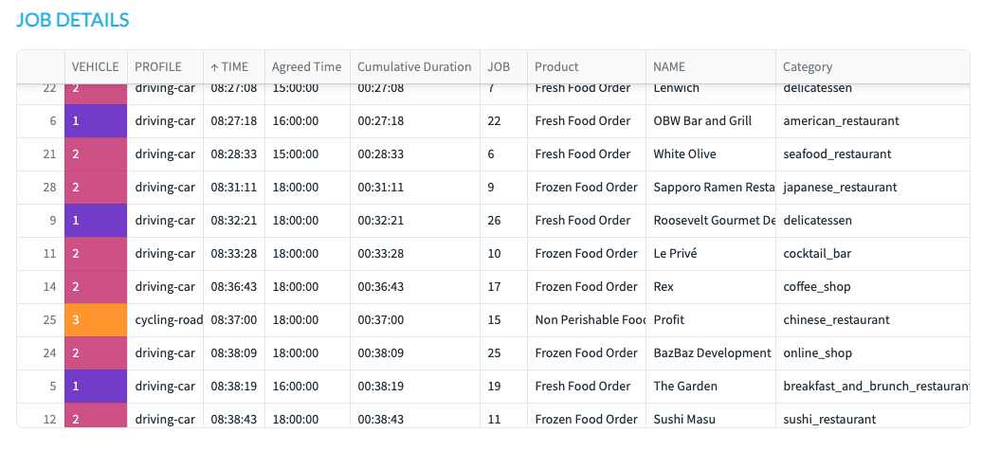
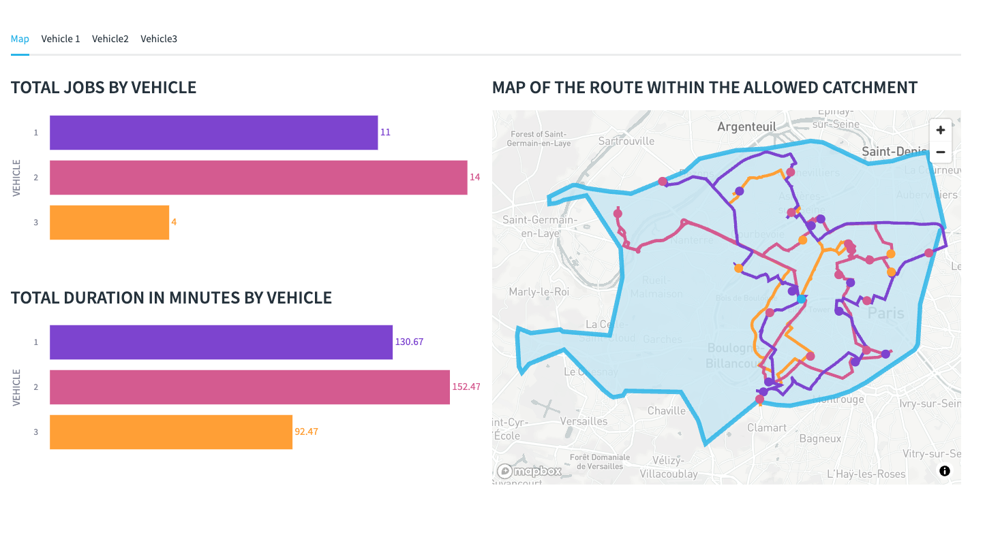

author: Becky O’Connor and Piotr Paczewski
id: create-a-route-optimisation-and-vehicle-route-plan-simulator
categories: snowflake-site:taxonomy/solution-center/certification/quickstart, snowflake-site:taxonomy/product/applications-and-collaboration, snowflake-site:taxonomy/snowflake-feature/build
language: en
summary: This tutorial leverages Snowflake Container Services, native apps, Geospatial Analytics, Streamlit, Cortex and the Open Route Service to optimize vehicle routes in order to distribute goods to chosen destinations on time.
environments: web
status: Archived 
feedback link: https://github.com/Snowflake-Labs/sfguides/issues

# Create a Route Optimization and Vehicle Route Plan Simulator
<!-- ------------------------ -->
## Overview 



In this quickstart, we will be leveraging the the tools within Snowflake to:

- **Visualize** the location of Delivery Points anywhere in the world understand the best routes for vehicles to deliver goods or services from a designated depo. We will use the multi layer mapping capabilities of pydeck to create easy to understand routing plans

- **Discover** what it would look like to route goods to real world points of interest such as restaurants or supermarkets using the Overture Point of Interest dataset provided freely on the marketplace by Carto.

- **Understand** numerous routing scenarios across a variety of industries anywhere in the world.


You will be leveraging [Open Route Service](https://openrouteservice.org/) to optimize vehicle routes in order to distribute goods to chosen destinations on time.

You will be creating **Directions**, **Route Optimization** and [**Isochrone**](https://en.wikipedia.org/wiki/Isochrone_map) functions.

This quickstart uses **Cortex Code**, Snowflake's AI-powered CLI, to deploy the solution with natural language commands and automated skills. Snowflake allows for creation of a fully interactive route simulator which will benefit many vehicle centric industries such as **retail**, **distribution**, **healthcare** and more.

### Prerequisites

> **_NOTE:_** Cortex Code is currently in **Private Preview**. Contact your Snowflake account team for access.

**This is what you will need**:

-   **ACCOUNTADMIN** access to your Snowflake account

-   [Snowpark Container Services Activated](https://docs.snowflake.com/en/developer-guide/snowpark-container-services/overview)

> **_NOTE:_** This is enabled by default with the exception of Free Trials where you would need to contact your snowflake representative to activate it.

-   [External Access Integration Activated](https://docs.snowflake.com/en/sql-reference/sql/create-external-access-integration) - Required to download map files from provider account

-   **Cortex Code CLI** installed and configured
    - Installation: Once you have access, install via the provided instructions
    - Add to your PATH: `export PATH="$HOME/.local/bin:$PATH"` (add to `~/.zshrc` or `~/.bashrc`)
    - Verify: `cortex --version`

-   **Container Runtime** - One of the following:
    - [Podman](https://podman.io/) (recommended): `brew install podman` (macOS) 
    - [Docker Desktop](https://www.docker.com/products/docker-desktop/)

-   [Git](https://git-scm.com/downloads) installed

-   [VSCode](https://code.visualstudio.com/download) recommended for running Cortex Code commands

-   Clone or download the repository: `git clone https://github.com/Snowflake-Labs/sfguide-create-a-route-optimisation-and-vehicle-route-plan-simulator`

### Route Planning And Optimization Architecture

The architecture below shows the solution which uses a native app and container services to power sophisticated routing and optimisation functions. 



This is a self contained service which is managed by you. There are no API calls outside of Snowflake and no API limitations. This quickstart uses a medium CPU pool which is capable of running unlimited service calls within **New York City**. If you wish to use a larger map such as Europe or the World, you can increase the size of the compute.


### What You'll Learn 

- Deploy a Snowflake Native App using **Cortex Code** AI-powered CLI with natural language commands
- Use **Snowpark Container Services** to run OpenRouteService as a self-managed routing engine
- A more advanced understanding of **Geospatial** data in Snowflake
- Using **AISQL** functions with Snowpark to explore routing capabilities
- Work with 3 routing functions deployed via the Native App:
  - **Directions** - Simple and multi-waypoint routing based on road network and vehicle profile
  - **Optimization** - Route optimization matching demands with vehicle availability
  - **Isochrones** - Catchment area analysis based on travel time
- Creating a location centric application using Streamlit 
- An insight to the Carto Overture Places dataset to build an innovative route planning simulation solution

### What You'll Build 
- A **Route Optimization Simulator** Streamlit application to simulate route plans for potential customers anywhere in the world. This could be for a potential new depot or simply to try out route optimisation which you will later replace with a real data pipeline.

<!-- ------------------------ -->
## Deploy the Route Optimizer


Use Cortex Code, Snowflake's AI-powered CLI, to deploy the Native App using natural language commands and automated skills.

### Setup Cortex Code

1. **Open VS Code** with the cloned repository folder

2. **Launch Cortex Code CLI** in the VS Code terminal:
   ```bash
   cortex
   ```

3. **Connect to Snowflake** - Cortex Code will prompt you to select or create a connection

4. **(Optional) Verify Prerequisites** - Run the prerequisites check skill to ensure all dependencies are installed:
   ```
   use the local skill from skills/check-prerequisites
   ```

### Deploy the Native App

Simply type the following command in Cortex Code:

```
use the local skill from skills/deploy-route-optimizer
```

Cortex Code will automatically:
- Create the required database, stages, and image repository
- Upload configuration files
- Detect your container runtime (Docker or Podman)
- Build and push all 4 container images
- Deploy the Native App

The skill will guide you through any required steps, including:
- Selecting your preferred container runtime if both are available
- Authenticating with the Snowflake image registry
- Monitoring the build progress

### Activate the App

Once deployment completes, Cortex Code will provide a link to your app. You need to:

1. Navigate to **Data Products > Apps > OPENROUTESERVICE_NATIVE_APP** in Snowsight
2. Grant the required privileges via the UI
3. Click **Activate** and wait for the services to start

### Service Manager

After activation, the Native App provides a **Service Manager** dashboard to monitor and control all ORS services:


The Service Manager shows:
- **Service Status Dashboard** - Overview of all running, stopped, and error states
- **Individual Service Management** - Start/Stop controls for each service:
  - **Data Downloader** - Downloads and updates map data
  - **Open Route Service** - Core routing and directions engine
  - **Routing Gateway** - API gateway for routing requests
  - **VROOM Service** - Route optimization engine

Use the **Start All** / **Stop All** buttons for bulk operations, or manage services individually. Click **Refresh Status** to update the dashboard.

> **_TIP:_** All 4 services should show ✅ RUNNING status before using the routing functions.

### ORS Configuration

The Native App is configured via the `ors-config.yml` file which controls:

**Map Source File**
```yml
ors:
  engine:
    profile_default:
      build:  
        source_file: /home/ors/files/sanFrancisco.osm.pbf
```
The default deployment uses San Francisco. When you customize the map region, this path is updated automatically.

**Routing Profiles**

The configuration defines which vehicle types are available for routing:

| Profile | Description | Default |
|---------|-------------|---------|
| `driving-car` | Standard passenger vehicle | ✅ Enabled |
| `driving-hgv` | Heavy goods vehicle (trucks) | ✅ Enabled |
| `cycling-road` | Road bicycle | ✅ Enabled |
| `cycling-regular` | Regular bicycle | ❌ Disabled |
| `cycling-electric` | Electric bicycle | ❌ Disabled |
| `foot-walking` | Pedestrian walking | ❌ Disabled |
| `foot-hiking` | Hiking trails | ❌ Disabled |
| `wheelchair` | Wheelchair accessible | ❌ Disabled |

> **_NOTE:_** Enabling more profiles increases graph build time and compute resource usage. The default configuration covers most delivery and logistics use cases.

**Optimization Limits**

The config also controls route optimization capacity:
```yml
matrix:
  maximum_visited_nodes: 1000000000
  maximum_routes: 25000000
```
These settings support complex route optimizations with many vehicles and delivery points.

### Function Tester

The Native App includes a built-in **Function Tester** Streamlit application for testing the routing functions interactively.


To access the Function Tester:
1. Open **Data Products > Apps > OPENROUTESERVICE_NATIVE_APP** in Snowsight
2. Navigate to the **Function Tester** page in the app

The Function Tester allows you to test all three routing functions:

**🗺️ DIRECTIONS**
- Select start and end locations from preset addresses
- Choose a routing profile (car, truck, bicycle)
- View the calculated route on an interactive map
- See step-by-step directions and distance/duration

**🚚 OPTIMIZATION**
- Configure multiple vehicles with different:
  - Time windows (start/end hours)
  - Capacity limits
  - Skill sets (refrigeration, hazardous goods, etc.)
- Add delivery jobs with:
  - Locations
  - Time windows
  - Required skills
- Run the optimization to see assigned routes per vehicle
- View detailed itinerary for each vehicle

**⏰ ISOCHRONES**
- Select a center point location
- Choose travel time in minutes
- Generate a catchment polygon showing how far you can travel
- Useful for delivery zone planning and coverage analysis

> **_TIP:_** The Function Tester comes pre-configured with San Francisco addresses. When you customize the map region, the Function Tester is automatically updated with region-specific coordinates.

### Overture Maps for Real-World Testing

The Function Tester uses preset sample addresses for quick testing. For more realistic testing with real-world points of interest (restaurants, supermarkets, warehouses, etc.), the **Carto Overture Maps Places** dataset is acquired from the Snowflake Marketplace.

This is done automatically by the `deploy-demo` skill later in this quickstart:

```
use the local skill from skills/deploy-demo
```

The skill acquires the Overture Maps dataset which provides:
- **50+ million points of interest** worldwide
- Categories including retail, food service, healthcare, logistics
- Accurate addresses and coordinates for realistic delivery scenarios

This dataset powers the Route Optimization Simulator Streamlit app, allowing you to simulate deliveries to real businesses in your configured map region.

### Customize the Map Region (Optional)

The default deployment uses a San Francisco map. To change to a different region:

```
use the local skill from skills/ors-map-customization
```

**Map Download & Resource Scaling**

The skill downloads OpenStreetMap data from Geofabrik or BBBike. The bigger the map file, the longer it takes to:
- **Download** the OSM data from the source
- **Upload** to the Snowflake stage
- **Generate graph files** for route calculations

| Map Size | Example Regions | Download Time | Graph Build Time | 
|----------|-----------------|---------------|------------------|
| < 100MB | San Francisco, Zurich | Minutes | 5-15 minutes |
| 100MB - 1GB | New York State, Switzerland | 10-30 minutes | 30-60 minutes |
| 1-5GB | Germany, France, California | 30-60 minutes | 1-3 hours |
| > 5GB | Great Britain, entire countries | 1-2 hours | 3-8+ hours |

> **_IMPORTANT:_** For country-wide or large region maps, graph generation can take **several hours**. The services will show as "running" while building graphs in the background.

**Automatic Compute Scaling**

Cortex Code will detect the map size after download and offer to **resize the compute pool** to speed up graph generation:

| Map Size | Suggested Compute | Auto-Suspend Extension |
|----------|-------------------|------------------------|
| < 1GB | CPU_X64_S (default) | 1 hour |
| 1-5GB | HIGHMEM_X64_M | 8 hours |
| > 5GB | HIGHMEM_X64_M | 24 hours |

When prompted, you can accept the scaling recommendation to ensure graphs are computed as quickly as possible. The extended auto-suspend time prevents the service from shutting down mid-build.

> **_TIP:_** For quickest results, use the smallest map that covers your use case. A city-level map (e.g., New York) builds much faster than a country map (e.g., USA).

**Routing Profile Configuration**

The skill presents available routing profiles and lets you enable/disable them:

| Profile | Category | Description |
|---------|----------|-------------|
| `driving-car` | Driving | Standard passenger vehicle |
| `driving-hgv` | Driving | Heavy goods vehicles (trucks) |
| `cycling-road` | Cycling | Road bicycles |
| `cycling-electric` | Cycling | Electric bicycles |
| `foot-walking` | Foot | Pedestrian walking |
| `wheelchair` | Wheelchair | Wheelchair accessible routes |

> **_NOTE:_** Enabling more profiles increases graph build time. The default (driving-car, driving-hgv, cycling-road) covers most logistics use cases.

**Function Tester & Notebook Customization**

The skill automatically updates:

1. **Function Tester Streamlit** - Generates region-specific sample addresses for:
   - Start locations (5 landmarks/city centers)
   - End locations (5 different destinations)
   - Waypoints (20 locations across the region)

2. **AISQL Notebook** - Updates all AI prompts to generate sample data for your region:
   - For **country/state maps** (e.g., Germany, California): You'll be asked to choose a specific city within that region for realistic delivery scenarios
   - For **city maps** (e.g., New York, London): Uses the city directly

   This ensures AI-generated restaurants, delivery jobs, and customer locations are within drivable distance of each other.

**Industry Category Customization (Optional)**

The default industries are Healthcare, Food, and Cosmetics. The skill offers an optional step to customize industries for your specific use case:

| Default Industry | Product Types | Customer Types |
|------------------|---------------|----------------|
| Healthcare | Flammable, Sharps, Temperature-controlled | Hospitals, Pharmacies, Dentists |
| Food | Fresh, Frozen, Non-perishable | Supermarkets, Restaurants, Butchers |
| Cosmetics | Hair products, Electronics, Make-up | Outlets, Fashion stores |

To customize, you can:
- Add new industries (e.g., "Beverages", "Electronics", "Office Supplies")
- Define product categories and vehicle skill requirements
- Choose customer types from Overture Maps categories in your region

> **_TIP:_** The Streamlit app reads industries dynamically from the database, so only the `add_carto_data.ipynb` notebook needs updating. The app automatically adapts to any changes.

**Git Branch Management**

All customizations are committed to a feature branch (e.g., `feature/ors-great-britain`), preserving the original San Francisco configuration on `main`.

### Available Cortex Code Skills

| Skill | Description | Command |
|-------|-------------|---------|
| `check-prerequisites` | Verify and install dependencies | `use the local skill from skills/check-prerequisites` |
| `deploy-route-optimizer` | Deploy the ORS Native App | `use the local skill from skills/deploy-route-optimizer` |
| `ors-map-customization` | Change map region and customize app | `use the local skill from skills/ors-map-customization` |
| `deploy-demo` | Deploy demo notebook and Streamlit | `use the local skill from skills/deploy-demo` |
| `customize-function-tester` | Customize Function Tester coordinates | `use the local skill from skills/customize-function-tester` |
| `uninstall-route-optimizer` | Remove app and all dependencies | `use the local skill from skills/uninstall-route-optimizer` |

### Git Branching for Multiple Regions

Cortex Code automatically manages Git branches for different map configurations:

```
main                           <- Original San Francisco configuration
├── feature/ors-great-britain  <- Great Britain customizations
├── feature/ors-germany        <- Germany customizations
└── feature/ors-<region>       <- Other region customizations
```

To switch between regions:
```bash
git checkout feature/ors-great-britain
```

Then redeploy with Cortex Code to apply the configuration.

Once your app is activated and running, continue to deploy the demo.

<!-- ------------------------ -->
## Deploy the Demo

Now that the Route Optimizer Native App is running, use Cortex Code to deploy the complete demo including the Marketplace data, notebooks, and Streamlit application.

> **_IMPORTANT:_** If you customized the map region using `ors-map-customization`, run `deploy-demo` **after** that customization. This ensures the notebooks and Streamlit use your chosen region's city and coordinates. If you skip customization, the demo defaults to San Francisco.

In the Cortex Code CLI, type:

```
use the local skill from skills/deploy-demo
```

Cortex Code will automatically:
- Acquire the **Carto Overture Maps Places** dataset from the Snowflake Marketplace
- Create the `VEHICLE_ROUTING_SIMULATOR` database with required schemas
- Deploy the **Add Carto Data** notebook and execute it to prepare the data
- Deploy the **Routing Functions with AISQL** notebook for exploring the functions
- Deploy the **Simulator** Streamlit application

### What Gets Created

| Component | Location | Description |
|-----------|----------|-------------|
| Marketplace Data | `OVERTURE_MAPS__PLACES` | Carto Overture POI dataset |
| Database | `VEHICLE_ROUTING_SIMULATOR` | Demo database with DATA, NOTEBOOKS, STREAMLITS schemas |
| Notebook | `NOTEBOOKS.ADD_CARTO_DATA` | Prepares POI data for the demo |
| Notebook | `NOTEBOOKS.ROUTING_FUNCTIONS_AISQL` | Interactive exploration of routing functions |
| Streamlit | `STREAMLITS.SIMULATOR` | Route optimization simulator app |

### Explore the Routing Functions (Optional)

After deployment, you can explore the routing functions interactively using the notebook:

1. Navigate to **Projects > Notebooks** in Snowsight
2. Open **ROUTING_FUNCTIONS_AISQL**
3. Follow the notebook to learn how to use:
   - **Directions** - Point-to-point and multi-waypoint routing
   - **Optimization** - Vehicle route optimization matching jobs to vehicles
   - **Isochrones** - Catchment area analysis based on travel time

The notebook demonstrates using **AISQL** to generate sample data and visualize results with Pydeck maps.

### Access the Streamlit App

Once deployment completes, navigate to the Streamlit app:

1. Go to **Projects > Streamlits** in Snowsight
2. Click on **SIMULATOR**

Or run this SQL to get the direct URL:
```sql
SELECT CONCAT('https://app.snowflake.com/', CURRENT_ORGANIZATION_NAME(), '/', CURRENT_ACCOUNT_NAME(), '/#/streamlit-apps/VEHICLE_ROUTING_SIMULATOR.STREAMLITS.SIMULATOR') AS streamlit_url;
```

<!-- ------------------------ -->
## Run the Streamlit



The streamlit app which you have open simulates potential routes to 29 delivery locations for selected customer types - all coming from a user definable wholesaler.  Currently there are 3 types of distributor available although with the notebook, you can create limitless industry categories:

-   Food
-   Health
-   Cosmetics

If you wish to add additional choice of distributor types, you can with the provided notebook.

The routing functions are provided by the Native App you deployed via Cortex Code.

The places you will work with are real as they are based on the **Carto Overture Points of Interest** dataset freely available on the Snowflake Marketplace. This allows you to create a location relevant scenario based on the needs of a specific use case.

**Region-Specific Data**

The POI data displayed in the Simulator is filtered by **GEOHASH** to match your configured map region:

| Configuration | POI Data Location | Example |
|---------------|-------------------|---------|
| Default (San Francisco map) | San Francisco | Restaurants, supermarkets, etc. in SF |
| Custom map region | City chosen during customization | If you selected "Germany" map and chose "Berlin" as the notebook city, POI data will be for Berlin |

When you run the `ors-map-customization` skill:
- For **country/state maps**: You select a major city within that region (e.g., "London" for Great Britain)
- For **city maps**: Uses that city directly (e.g., New York)

The `add_carto_data` notebook filters the Overture dataset to your chosen city and creates the industry-specific views (Food, Health, Cosmetics distributors and customers).

> **_TIP:_** To change the city, run the map customization skill again or modify the `add_carto_data` notebook directly.

### End to End with Streamlit Dynamic Simulator Overview Diagram


### Setting the Context of the Routing Scenario

- Open up the side menu
- Select the industry type.
- Choose the LLM model in order to search for a location.
- Type in a word or phrase which will help locate the simulation.  
**NB** Results are restricted to your configured city boundary.
- Choose the distance in KM for how wide you would like the app to search for nearby distributors.

    

- Scroll down to get a map which highlights the place plus where all the nearby distributors are.  

- Scroll further down in the sidebar to select a specific distributor. - This is sorted by distance from the centre point.  You should have relevent wholesalers based on location and industry.




- Choose the type of customers you want to deliver goods to.  In this case, we are choosing supermarkets and restaurants.  Customer types can be configured using the provided notebook.


- There is an order acceptance catchment time - this will be used to generate an isochrone which will filter possible delivery locations within that isochrone.  The isochrone produced is a polygon shaped to all the possible places you can drive within the acceptable drive time.



- You may close the side bar.

### Wholesaler Routing Walkthrough

This is an example scenario based on the previously selected fields. The example uses San Francisco (the default map), but you can search for any location within your configured map region.

**Bay Area Produce** is in San Francisco. This week they have 3 vehicles assigned to make up to 30 deliveries today.



**Vehicle 1** will start between 8HRS and 17HRS - this vehicle is a car.  [hover over information]  the vehicle has a capacity limit of 4 and been assigned a skill level of 1 - this vehicle does not have a freezer so can only carry fresh food.


**Vehicle 2** will operate between 12 and 17hrs [change vehicle 2 from 8 till 12].  This will also be a car but has a skill level of 2 which means they can deliver frozen food.


**Vehicle 3** will also operate between 8hrs and 17hrs and has a skill level of 3 - they can carry  the premium food items - this vehicle will be an road bicycle [select cycling-road]. 

You can look at the vehicle skill level by hovering over the '?' against each vehicle.

Once the selections are made you can choose the scope for the jobs - this is based on a catchment time.  

-   Select 25mins based on how far you can cycle in that time.




You will note that orders of the Non Perishable orders will only go to vehicle 3, the fresh food will go to vehicle 2 and the frozen food will go to vehicle 1.

(if i have more vehicles that have the same skills it will also look at the time slots as well).


Next we look at the map


Vehicle 3 has the least amount of things to deliver but takes the longest to deliver them.  This is probably because the vehicle is a bicycle.  [change bicycle to hgv and re run]


When looking at the map itself, you will see the lines of the route for each vehicle, this is colour coded - you will also see circles which also represent the drops for each vehicle.  The hoverover will tell you what the point represents.


Tabs - this will give instructions for each segment of the drivers journey - the final stop is the return back to the wholesaler.


### How does it work

You can see that in a couple of clicks you can create a vehicle optimisation scenario from anywhere. 


#### Finding the place
the app is using an LLM to retrieve a Latitude and longitude based on the word entered into the search.

Snowflake will use the ST_DWITHIN geospatial function to filter the overture maps to find all places of interest within an Xkm radius. 


#### The previously run notebook

The previously ran notebook contains the standing data which you can go back to to customize the demo.  If you want to change the types of places to be hotels, then that is quite possible.

Within the notebook, you have also created: 

- The overture dataset and included optimisation on geo and the category variant column to help with faster searching.

- An industry lookup table to add relevant context

- A job sample table

#### The mapping
The solution leverages Pydeck to plot points, linestrings and polygons on a map.  The isochrone is the polygon, the routes are linestrings and the places/points of interest are points.  You would have seen how this works in the original notebook. AISQL is useful to quickly generate python code to test the maps. 
<!-- ------------------------ -->
## The Streamlit Code

This final Section, gives you some explanation as to how the streamlit code works.

The Streamlit puts all of the above components together. I will now explain how the main aspects of the code works.

**Setup Theming**

An important feature for better user experience is what the application looks like. I have themed the app to be consistant with Snowflake Branding. This is so much easier and flexible now we can add styles to Streamlit in Snowflake.

For the theming, a style sheet was added to the streamlit project.

```python
with open('extra.css') as f:
    st.markdown(f"<style>{f.read()}</style>", unsafe_allow_html=True)
```


**Industry Lookup**

An  industry lookup snowpark dataframe is created. We then create a second dataframe which only selects the industry name. This will be used for the first sidebar filter

```python

lookup = session.table('LOOKUP')
industry = lookup.select('INDUSTRY')
```

Based on the selected industry, key variables are generated for added context to the standing data and filtering the points of interest dataset. The user selects the chosen industry from the sidebar, which then assign the variables

```python

#sidebar
with st.sidebar:
    st.image(image)
    choice = st.radio('select industry', industry)
    lookup = lookup.filter(col('INDUSTRY')==choice)
    lookup = lookup.with_column('IND',array_to_string('IND',lit(',')))
    lookup = lookup.with_column('IND2',array_to_string('IND2',lit(',')))
    
    lookuppd = lookup.to_pandas()


```

```python

#assign variables

pa = lookuppd.PA.iloc[0]
pb = lookuppd.PB.iloc[0]
pc = lookuppd.PC.iloc[0]
ind = lookuppd.IND.iloc[0]
ind2 = lookuppd.IND2.iloc[0]
ctype = json.loads(lookuppd.CTYPE.iloc[0])
stype = json.loads(lookuppd.STYPE.iloc[0])

```

**Vehicle Type Dropdown**

These vehicle types will be assigned to each of the 3 vehicles. These will be configured by the user.

```python

method =[
             'driving-car',
             'driving-hgv',
             'cycling-regular',
             'cycling-road',
             'cycling-mountain',
             'cycling-electric']

```

**Locations Dataset**
Here, a Snowpark Dataframe is created from the previously configured places dataset.

```python

places_f = session.table('places')

```
```python
places_f = places_f.select('GEOMETRY',call_function('ST_X',
                           col('GEOMETRY')).alias('LON'),
                           call_function('ST_Y',
                                  col('GEOMETRY')).alias('LAT'),
                                  col('ADDRESS'),
                                  col('CATEGORY'),
                                  col('ALTERNATE'),
                                  col('PHONES'),col('NAME'),
                                  col('GEOMETRY').alias('POINT')
```

**Cortex map filter**

This is where Cortex is used to filter the places dataset. The prompt is asking the model to 'give me the Latitude an Longitude which centers the following place.' The 'following place' is a free text field which the user enters such as: the Golden Gate Bridge, Fisherman's Wharf, or Union Square. They enter whatever they like and Cortex will try and make sense of it.
The user also chooses an LLM model (I have found mistral-large2 works very well) and a distance. Different LLMs produce varying results of accuracy. For better accuracy, perhaps use Cortex Fine Tuning to load good examples into the model - such as the Overture Points of Interest itself. I found that mistral large 2 produced the result accuracy I needed without fine tuning. The distance is not really used for the LLM, but is used later to filter out potential distributors by straight line distance.

```python

with st.sidebar:
    st.markdown('##### Cortex Powered Map Filter')
    st.info(prompt)
    model = st.selectbox('Choose Model:',['reka-flash','mistral-large2'],1)
    place = st.text_input('Choose Input','Fisherman\'s Wharf')
    distance = st.number_input('Distance from location in KM',1,300,5)

```

Next, we need to do some prompt engineering. Below is the initial prompt to work with.

```python

prompt = ('give me the LAT and LON which centers the following place')

```

The idea is that the prompt feed the LLM and return the results to the LLM in the correct format. However, further engineering will be needed before we get reliably good results.

I engineered the prompt by adding text to the prompts such as ' return 3 value which are as follows…. and 'use the following json template'. This is to ensure that what is returned is very likely to be in the format that I would expect.

The results are returned as a single string which is simply converted to json by using the 'parse_json' function. You will note that before the json is parsed I removed characters that are sometimes generated in order to return the resulting json as markdown. This is great for display purposes but not so great if I only want the json. The replace function removes these characters if they exist.

Once parsed, I used standard geo and semi structured features in Snowflake to calculate points, present results in a structured form and order the returned results by distance.

This has all been wrapped with a function called choose_place(place,model,distance).

```python

prompt = ('give me the LAT and LON which centers the following place')


```

```python

@st.cache_data
def choose_place(place,model,distance):
    json_template = str({'LAT':44.3452,'LON':2.345,'DISTANCE':100})
    min_max = session.createDataFrame([{'PLACE':place}])\
    .with_column('CENTER',
        call_function('snowflake.cortex.complete',
        model,
        concat(lit(prompt),
        col('PLACE'),lit(f'return 3 values which \
        are as follows LAT and LON with {distance} as DISTANCE'),
        lit('use the following json template'),
        lit(json_template),
        lit('return only json. DO NOT RETURN COMMENTRY OR VERBIAGE'))
                                  )
    min_max = min_max.select(parse_json(replace(replace('CENTER',
                              "```",
                              ''),
                              'json',
                              '')).alias('CENTER'))
   return min_max.select(col('CENTER')['LAT'].astype(FloatType()).alias('LAT'),
     col('CENTER')['LON'].astype(FloatType()).alias('LON'),
     call_function('ST_ASWKT',
     call_function('ST_MAKEPOINT',
     col('LON'),col('LAT'))).alias('POINT'),
     col('CENTER')['DISTANCE'].astype(FloatType()).alias('"DISTANCE1"'),
     lit(0).alias('DISTANCE'),
     lit(place).alias('NAME')).to_pandas()


```

We will call this function in the next step of the app.

```python

bbox = choose_place(place,model,distance)

```

**Creating a scatter plot for suggested location based on user input**

This is a pydeck layer - which generates a map based on the returned result of the previously created function. The returned results will be a single blue spot. We will later create another layer which will scatter all the available depots based on this location and within the distance chosen by the user.

```python

context = pdk.Layer(
    'ScatterplotLayer',
    bbox,
    get_position=['LON', 'LAT'],
    filled=True,
    stroked=False,
    radius_min_pixels=6,
    radius_max_pixels=20,
    auto_highlight=True,
    get_fill_color=[41, 181, 232],
    pickable=True)
    st.divider()

```

Preview the results in a pydeck chart. The view state navigates the map to the position of the blue spot.

```python

view_state = pdk.ViewState(bbox.LON.iloc[0], bbox.LAT.iloc[0], zoom=4)
    st.pydeck_chart(pdk.Deck(layers=[context],map_style=None,initial_view_state=view_state))

```


We will next add a new layer which will show all industry related industry suggestions that are within X distance of the blue spot.

**Searching the data for the right type of place (The What).**

We will search the 'what' by using the SEARCH function. This will search multiple columns within the same row to see if it matches the keywords stated in the industry lookup table. The industry must match the one which the user selected earlier. You will note that this search is being repeated twice - this is to search for two different concepts.

For example:

- Search one must contain one of these words:

    - hospital 
    - health 
    - pharmaceutical
    - drug 
    - healthcare 
    - pharmacy 
    - surgical

- From the results of search 1, search 2 must contain one of these words:
    - supplies 
    - warehouse 
    - depot 
    - distribution 
    - wholesaler 
    - distributors

```python
places_w = places_f.filter(call_function('ST_DWITHIN', 
      places_f['GEOMETRY'],
      to_geography(lit(bbox.POINT.iloc[0])),
      lit(bbox.DISTANCE1.iloc[0])*1000))#.cache_result()
```

```python

places_1 = places_w.filter(expr(f'''search((CATEGORY,
      ALTERNATE,
      NAME),'{ind}',
      analyzer=>'DEFAULT_ANALYZER')''')).cache_result()
places_1 = places_1.filter(expr(f'''search((CATEGORY,
      ALTERNATE,
      NAME),
      '{ind2}',
      analyzer=>'DEFAULT_ANALYZER')''')).cache_result()

```

The search is using the default analyzer, meaning it will accept any of the words in any order. This is useful to avoid missing things, but providing a second context by searching twice, you will get a better result accuracy. All search words are found in the industry lookup table.

**Filter the places by the 'where'**

We will filter by distance from the previously allocated point which was returned by the LLM.

```python

places_1 = places_1.with_column('DISTANCE',
                call_function('ST_DISTANCE',
                call_function('ST_MAKEPOINT',
                 col('LON'),
                 col('LAT')),
                 call_function('ST_MAKEPOINT',
                      lit(bbox.LON.iloc[0]),
                      lit(bbox.LAT.iloc[0]))))


```
```python
places_1 = places_1.with_column('DISTANCE',
           round(col('DISTANCE')/1000,2)).order_by('DISTANCE')
```
**Visualise the map of depots**

This creates a map function which returns the what and where as a scatter plot map within the sidebar. You will note that there is an additional layer here. This layer will return multiple plots as apposed to 1 which is what the first layer generated.

```python

@st.cache_data
    def places_cached(distance,bbox,ind):
        return places_1.to_pandas()

```
A tool tip is constructed to reveal the name of each potential distributor and the straight line distance.

```python

tooltip = {
   "html": """<b>Name:</b> {NAME} <b><br>Distance From Centre:</b> {DISTANCE}""",
   "style": {
       "width":"50%",
        "backgroundColor": "steelblue",
        "color": "white",
       "text-wrap": "balance"
            }
        }

```


defining the second layer for  potential distributors

```python
wholesalers = pdk.Layer(
    'ScatterplotLayer',
    places_cached(distance,bbox,ind),
    get_position=['LON', 'LAT'],
    filled=True,
    opacity=0.5,
    stroked=False,
    radius_min_pixels=6,
    radius_max_pixels=10,
    auto_highlight=True,
    get_fill_color=[0, 0, 0],
    pickable=True)
    st.divider()

```

```python

view_state = pdk.ViewState(bbox.LON.iloc[0], bbox.LAT.iloc[0], zoom=4)

```

**Map Layout**
Below will render the map.

```python

st.pydeck_chart(pdk.Deck(layers=[wholesalers,context],
  map_style=None,
  initial_view_state=view_state, 
  tooltip=tooltip))

```


The returned results will also generate a list of places to select from using a drop down list:

```python

@st.cache_data
def warehouses(distance,bbox,ind):
  return places_1.group_by(col('NAME'))\
        .agg(avg('DISTANCE').alias('DISTANCE'))\
        .sort(col('DISTANCE').asc()).to_pandas()

```

```python

s_warehouse = st.selectbox('Choose Wholesaler to distribute goods from:',
                            warehouses(distance,
                                       bbox,
                                       ind))

```


**Job Template**

The job template is joined to the the industry lookups for provide context to the types of goods being delivered. we will call this 'time slots'

```python

time_slots = session.table('JOB_TEMPLATE')
pa = time_slots.filter(col('PRODUCT')=='pa').join(lookup.select('PA'))
pb = time_slots.filter(col('PRODUCT')=='pb').join(lookup.select('PB'))
pc = time_slots.filter(col('PRODUCT')=='pc').join(lookup.select('PC'))

```
```python

time_slots = pa.union(pb).union(pc).with_column('PRODUCT',
                                        col('PA')).drop('PA')

```

**Customer Catchment Generation**

Now we need to generate another dataset - this time for potential customers which are located within catchment of a chosen depot.  The user will define the catchment based on a drive time.

```python

range_minutes = st.number_input('Order Acceptance catchment time:',0,120,20)

```


We will now focus on filtering a new point of interest dataset by drive time. This dataset will simulate typical customers within the catchment. For this, we will leverage the 'isochrone' function which calls the open route service api to build a catchment polygon.

```python

isochrone = session.create_dataframe([{'LON':start_1[0], 
                      'LAT':start_1[1], 
                      'METHOD':smethod,
                      'RANGE_MINS':range_minutes}])
st.write(isochrone)
        
isochrone = isochrone.select(call_function('UTILS.ISOCHRONES',
                          (col('METHOD'), 
                           col('LON'), 
                           col('LAT'), 
                           col('RANGE_MINS'))).alias('ISOCHRONE'))

isochrone2 = isochrone.select(to_geography(col('ISOCHRONE')['features'][0]['geometry']).alias('GEO')).cache_result()

```

You will see that after calling the isochrone function, we then join the resulting polygon dataset to the point of interest dataset using 'ST_WITHIN'. This ensures only jobs will be created within the catchment area of the polygon.

**Customer Type Filter**

Now lets filter **'the what'** on the customer dataset. We have all points of interests around the catchment of a depo, however, we have not specified what type of organisations these customers are. This is what the next drop down list is for. The user will pick the type of customer which is relevant to the industry. This example filter selection below will only retain organisations which are categorised as hospitals, dentists and pharmacies. Because the categories are in two fields, we will use the **SEARCH** function again.


```python

places_2 = places_f.filter(expr(f'''search((CATEGORY,ALTERNATE,NAME),
                                '{" ".join(customer_type)}',
                                analyzer=>'DEFAULT_ANALYZER')'''))

```

We will limit our customer results to match the number of 'time slots' we have created from the job template, and generate a sample of the results.

```python

places_2 = places_2.join(isochrone2,
  call_function('ST_WITHIN',
  places_2['POINT'],
  isochrone2['GEO'])).sample(0.5).limit(time_slots.count()).cache_result()

```
Next, we will create a row number after ordering the sample by a random number. This row number will effectively become our unique **'consignment number'** which will be used in the optimisation service.

```python

window_spec = Window.order_by(random())
places_2 = places_2.with_column('ID',row_number().over(window_spec))
places_2 = places_2.join(time_slots,'ID')

```

Next we will join to the time slots by 'ID' which has been randomly assigned to **'our customers'**.

```python

places_2 = places_2.join(time_slots,'ID')

```

Now we will format the table in to presentable jobs. This will assign skills, time slots and capacity requirements.

```python

places_2_table = places_2.select('ID',
        col('PRODUCT').alias('"Product"'),
        col('SLOT_START').alias('"Slot Start"'),
        col('SLOT_END').alias('"Slot End"'),
        col('NAME').alias('Name'),
        col('CATEGORY').alias('"Category"'),
        col('ADDRESS')['freeform'].astype(StringType()).alias('"Address"'),
        col('ADDRESS')['locality'].astype(StringType()).alias('"Locality"'),
        col('ADDRESS')['postcode'].astype(StringType()).alias('"Postcode"'),
        col('ADDRESS')['region'].astype(StringType()).alias('"Region"'),
        col('PHONES').alias('"Phone Number"'))

    
places_2 = places_2.with_column('JOB',
              object_construct(lit('id'),col('ID'),
              lit('capacity'),lit([2]),
              lit('skills'),array_construct(col('SKILLS')),
               lit('time_window'),
               array_construct(col('SLOT_START')*60*60,col('SLOT_END')*60*60),
               lit('location'),array_construct(col('LON'),col('LAT'))
                      py))

    

jobs = places_2.select(array_agg('JOB').alias('JOB'))


```

**The Vehicles**
The example I have created, is an example of only 3 vehicles at pre defined skill levels.


The vehicle location is then Aligned to the previously selected depot. In reality, vehicles might have varying start destinations - however, for simplicity all vehicle starting points are the same.

```python

places_vehicles = places_1.filter(col('NAME')==s_warehouse).cache_result()

```

Construct each configurable vehicle. Below is an example of one of the vehicles. You will see that we are converting the start and end time of each vehicle to seconds - likewise for the customers, the agreed delivery times for the optimisation service to work are also in seconds.

```python

vehicle_1 = places_vehicles.select(object_construct(lit('profile'),
                      lit(smethod),
                      lit('skills'),
                      lit(veh1_skills),
                      lit('id'),
                      lit(1),
                      lit('start'),
                      array_construct(col('LON'),col('LAT')),
                      lit('end'),
                      array_construct(col('LON'),col('LAT')),
                      lit('time_windows'),
                      array_construct(lit(start_time_0*60*60),
                                      lit(end_time_0*60*60)),
                      lit('capacity'),
                      lit(veh1_capacity)).alias('VEHICLE'))

```

Now, we present the configurable aspects of each vehicle to the user. You will note that this is an example of utilising the previously configured styling.

```python

st.markdown('<h4 class="veh2">Vehicle 2</h2>', 
    unsafe_allow_html=True, 
    help=f'''Vehicle 2 {skill_types[veh2_skills[0]-1]} and a capacity of {veh2_capacity[0]}''')
    
    col4,col5,col6 = st.columns(3)
    with col4:
        start_time_1 = st.number_input('Start Time in Hours:',0,24,8,key=3)
    with col5:
        end_time_1 = st.number_input('End Time in Hours:',start_time_1,24,17,key=4)
    with col6:
        smethod_1 = st.selectbox('Choose Method:',method, key=6)

```

For further formatting - when the job results are returned after going through the optimisation service, it will be nice to clearly see what vehicles are aligned to what job. This detail is added to the dataframe which gives data driven colour coding.

```python

##### ADD VEHICLE_COLOR TO VEHICLES)
    vehicle_1 = vehicle_1.with_column('R',lit(125))
    vehicle_1 = vehicle_1.with_column('G',lit(68))  
    vehicle_1 = vehicle_1.with_column('B',lit(207)) 

    vehicle_2 = vehicle_2.with_column('R',lit(212))
    vehicle_2 = vehicle_2.with_column('G',lit(91))  
    vehicle_2 = vehicle_2.with_column('B',lit(144)) 

    vehicle_3 = vehicle_3.with_column('R',lit(255))
    vehicle_3 = vehicle_3.with_column('G',lit(159))  
    vehicle_3 = vehicle_3.with_column('B',lit(54))

```

Next, we union all vehicles into a new dataset called **vehsdet**.

```python

vehsdet = vehicle_1.union(vehicle_2).union(vehicle_3).with_column('ID',
              col('VEHICLE')['id'])\
    .with_column('PROFILE',
                 col('VEHICLE')['profile'].astype(StringType()))\
    .with_column('WINDOW',
                  col('VEHICLE')['time_windows'].astype(StringType()))
    vehs = vehsdet.select(array_agg('VEHICLE').alias('VEH'))
    vehsdet = vehsdet.drop('VEHICLE')


```

**Route Optimisation Service**

So we have our 'Customers' and we have our 'Vehicles'. We now need to create our route plans for each vehicle using the Route Optimisation Service. This will effectively push our jobs and vehicles into the api which will return our vehicle route plans based on information such as drive time, consignment needs and vehicle availability.

```python

optim = jobs.join(vehs).select('JOB',
                'VEH',call_function('UTILS.OPTIMIZATION',
                col('JOB'),col('VEH')).alias('OPTIMIZATION'))

```

The returned results will be an array of various objects. We will extract out the parts we want in order to display the results clearly.

```python

optim = optim.with_column('CODES',col('OPTIMIZATION')['codes'])
        optim = optim.with_column('ROUTES',col('OPTIMIZATION')['routes'])
        optim = optim.with_column('SUMMARY',col('OPTIMIZATION')['summary'])
        optim = optim.with_column('UNASSIGNED',col('OPTIMIZATION')['unassigned'])
    
    
    
        optim = optim.with_column('COST',col('SUMMARY')['cost'])\
        .with_column('DURATION',col('SUMMARY')['duration'])\
        .with_column('NUMBER_OF_ROUTES',col('SUMMARY')['routes']).drop('SUMMARY')

        optim = optim.join_table_function('flatten',col('ROUTES'))\
        .select('VALUE')

        optim = optim.select(col('VALUE')['amount'].alias('AMOUNT'),
                         col('VALUE')['vehicle'].alias('VEHICLE'),
                         col('VALUE')['duration'].alias('DURATION'),
                         col('VALUE')['steps'].alias('STEPS'),
                        col('VALUE')['location'][0].alias('LON'),
                         col('VALUE')['location'][0].alias('LAT')p

```

As described in the route optimisation function, the output will give steps for the journey along with other measures such as duration and what vehicle will be assigned. 


The **directions API** will then be used to get detailed instructions for each step.

```python

optim_line = optim_line\
        .select('VEHICLE','R','G','B','PROFILE','ID','TOTAL_JOBS',
            call_function('UTILS.DIRECTIONS_with_way_points',
                                    col('PROFILE'),
                            col('LINE')).alias('DIRECTIONS')).cache_result()

```

This will return detailed route plans which include all drop offs, line strings as well as written instructions.


Two layers are created for the visualisation - one for the line paths and the other for the drop offs. The layers have been generated by a python function in order to reuse the code for each vehicle. This is so i can show a vehicle plan each containing an independant map within each tab.

```python

def veh_journey(dataframe,vehicle):
            vehicle_1_path = pdk.Layer(
            type="PathLayer",
            data=dataframe[dataframe['VEHICLE']==vehicle],
            pickable=True,
            get_color=["0+R","0+G","0+B"],
            width_scale=20,
            width_min_pixels=4,
            width_max_pixels=7,
            get_path="coordinates",
            get_width=5)
            return vehicle_1_path

        def vehicle_drops(dataframe,vehicle):
            layer_end_v1 = pdk.Layer(
            'ScatterplotLayer',
            dataframe[dataframe['VEHICLE']==vehicle],
            get_position=['LON', 'LAT'],
            filled=True,
            stroked=False,
            radius_min_pixels=6,
            radius_max_pixels=10,
            line_width_min_pixels=5,
            auto_highlight=True,
            get_radius=50,
            get_line_color=["0+R","0+G","0+B"],
            get_fill_color=["0+R","0+G","0+B"],
            pickable=True)
            return layer_end_v1


```

Below you can see an example of all three vehicles travelling around your selected city to drop goods off. This is combining points and line string layers for each vehicle as well as the isochrone layer.



#### Considerations
The Job details may plot routes outside the agreed time.  The Demo has only vehicles where each vehicle has a unique skill.  We will need more vehicles / less skills to prevent these violations.

The app is confined to a B2B model as we do not have public names and addresses of B2C consumers.  If a B2C simulator is needed, then an alternative 'customer' dataset other than the 'places' dataset is needed.


<!-- ------------------------ -->
## Uninstall the Route Optimizer

To remove the Route Optimizer Native App and all associated resources from your Snowflake account, use the uninstall skill:

```
use the local skill from skills/uninstall-route-optimizer
```

This skill will:
- Remove the Native App (`OPENROUTESERVICE_NATIVE_APP`)
- Drop the Application Package (`OPENROUTESERVICE_NATIVE_APP_PKG`)
- Delete the setup database (`OPENROUTESERVICE_SETUP`) including all stages and image repository
- Remove the compute pool and all container services
- Optionally remove the warehouse and local container images

> **_NOTE:_** The uninstall skill will ask for confirmation before removing resources. This is a destructive operation that cannot be undone.

<!-- ------------------------ -->
## Conclusion and Resources
### Conclusion

So you will now see that by combining AI, freely accessible points of interests, easy to use geospatial functions, the ability to securely call the open route service and the powers of Streamlit in Snowflake - creating innovative geospatial applications  is entirely possible. 

Snowflake provides powerful solutions when you bring Snowflake's advanced analytics, Cortex, Snowpark and Streamlit's visualization capabilities together.  Also, by leveraging the open route service (or even an alternative provider such as the Carto Toolbox) using external integrations provides another level of geospatial capabilites such as route optimisation, directions and isochrones.  


### What You Learned

You will have learned the following:
 - How to use Snowflake Cortex can be used as a location filter, which can filter a comprehensive point of interest dataset to anywhere in the world.

- Use text based Search capabilities for advanced filtering which adds accurate context to a simulation

- How to utilise Pydeck to create a multi layered map

- Leverage the open route service to create the following

    - isochrones (catchements) based on drive time
    - Simple Directions and Directions which include waypoints
    - Route Optimisations


### Related Resources


#### Source code

- [Source Code on Github](https://github.com/Snowflake-Labs/sfguide-Create-a-Route-Optimisation-and-Vehicle-Route-Plan-Simulator)


#### Further Related Material

- [Geospatial Functions](https://docs.snowflake.com/en/sql-reference/functions-geospatial)

- [Building Geospatial Multi-Layer Apps with Snowflake and Streamlit](/en/developers/guides/building-geospatial-mult-layer-apps-with-snowflake-and-streamlit/)

- [H3 Indexing](https://h3geo.org/docs/)

- [Streamlit](https://streamlit.io/)

- [Pydeck](https://deckgl.readthedocs.io/en/latest/index.html#)

- [Using Cortex and Streamlit With Geospatial Data](/en/developers/guides/using-snowflake-cortex-and-streamlit-with-geospatial-data/)

- [Getting started with Geospatial AI and ML using Snowflake Cortex](/en/developers/guides/geo-for-machine-learning/)


