author: Becky O’Connor and Piotr Paczewski
id: create-a-route-optimisation-and-vehicle-route-plan-simulator
categories: snowflake-site:taxonomy/solution-center/certification/quickstart, snowflake-site:taxonomy/product/applications-and-collaboration, snowflake-site:taxonomy/snowflake-feature/build
language: en
summary: This tutorial leverages Snowflake Container Services, native apps, Geospatial Analytics, Streamlit, Cortex and the Open Route Service to optimize vehicle routes in order to distribute goods to chosen destinations on time.
environments: web
status: Archived 
feedback link: https://github.com/Snowflake-Labs/sfguides/issues

# Create a Route Optimization and Vehicle Route Plan Simulator
<!-- ------------------------ -->
## Overview 

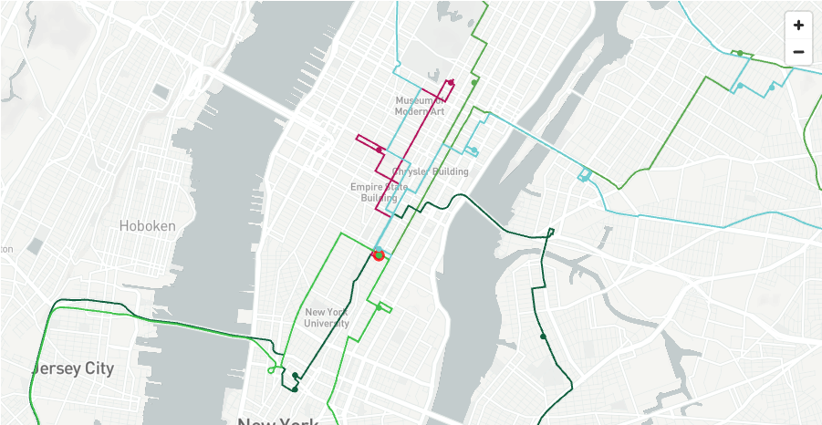

In this quickstart, we will be leveraging the the tools within Snowflake to:

- **Visualize** the location of Delivery Points anywhere in the world understand the best routes for vehicles to deliver goods or services from a designated depo. We will use the multi layer mapping capabilities of pydeck to create easy to understand routing plans

- **Discover** what it would look like to route goods to real world points of interest such as restaurants or supermarkets using the Overture Point of Interest dataset provided freely on the marketplace by Carto.

- **Understand** numerous routing scenarios across a variety of industries anywhere in the world.


If you would prefer to skip to quickly see how the route optimization service might work for you, you can quickly use the **free api service** using the instructions as option 2 for creating the functions.

You will be leveraging [Open Route Service](https://openrouteservice.org/) to optimize vehicle routes in order to distribute goods to chosen destinations on time.

You will be creating **Directions**, **Route Optimization** and [**Isochrone**](https://en.wikipedia.org/wiki/Isochrone_map) functions.


The quickstart contains two options.  Both options require distinct prerequisites.  With either option, Snowflake allows for creation of a fully interactive route simulator which will benefit many vehicle centric industries such as **retail**, **distribution**, **healthcare** and more.

### Prerequisites

**Option 1** 
Use Snowpark Containers with a native app using the Open Route Service

### Route Planning And Optimization Architecture

The architecture below shows the solution which uses a native app and container services to power sophisticated routing and optimisation functions. 

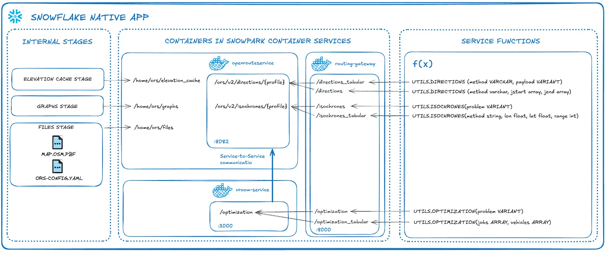

This is a self contained service which is managed by you.  There are no api calls outside of snowflake and no api limitations.  This quickstart uses a medium CPU pool which is capable of running unlimited service calls within **New York City**.  if you wish to use a larger map such as Europe or the World, you can increase the size of the compute.

**This is what you will need**:

-   [External Access Integration Activated](https://docs.snowflake.com/en/sql-reference/sql/create-external-access-integration)
    
> **_NOTE:_** - External Access Integration is enabled by default with the exception of Free Trials where you would need to contact your snowflake representative to activate it.  You will need this to securely download the map and config files from the provider account.

- [Snowpark Container Services Activated](https://docs.snowflake.com/en/developer-guide/snowpark-container-services/overview)

> **_NOTE:_** This is enabled by default with the exception of Free Trials where you would need to contact your snowflake representative to activate it.  

-   **ACCOUNTADMIN** access to the account.

-   [Docker Desktop](https://www.docker.com/products/docker-desktop/) installed

- [Snowflake CLI](https://docs.snowflake.com/en/developer-guide/snowflake-cli/index) installed

-  (Recommended) [Git](https://git-scm.com/downloads) installed. 

- Either download the zip or use git to copy the contents of the the git repo here: https://github.com/Snowflake-Labs/sfguide-create-a-route-optimisation-and-vehicle-route-plan-simulator. 


- [VSCode](https://code.visualstudio.com/download) with the Snowflake extension installed.

**Option 2**
Use External Access Integration with Python Functions to call and retrieve data from the Open Route Service. 

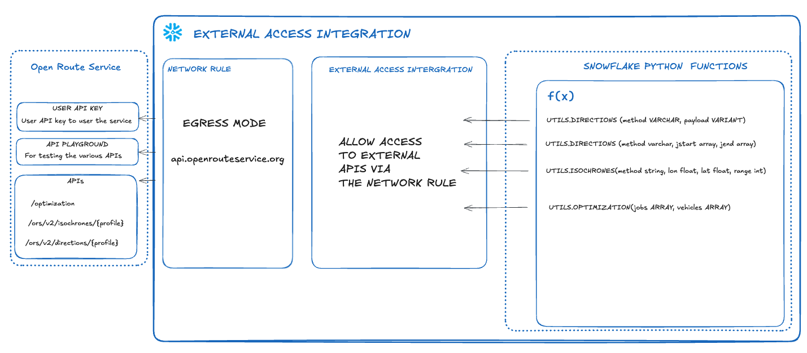

-   You will need access to a Snowflake Account

-   [External Access Integration](https://docs.snowflake.com/en/sql-reference/sql/create-external-access-integration)
    NB - External Access Integration is enabled by default with the exception of Free Trials where you would need to contact your snowflake representative to activate it.  This is for connecting to the open route service api.

-   An free account with [Open Route Service](https://openrouteservice.org/)

-   **ACCOUNTADMIN** access to the account.


### What You’ll Learn 

- A more advanced understanding of **Geospatial** data in Snowflake
- Using **AISQL** functions with Snowpark
- Create 3 user defined functions which either call the open route service API or you will learn how to create the service in snowflake using a snowpark container services native app. 

-  create simple and multi waypoint directions point to point functions based on the road network and vehicle profile
- Route Optimization to match the demands with vehicle availability
- Create an isochrone for catchment analysis
- Creating a location centric application using Streamlit 
- An insight to the Carto Overture Places dataset to build an innovative route planning simulation solution
  - Leverage vehicle capabilities and matching with job specifics
  - use a real dataset to simulate route plans for a specific depot

### What You’ll Build 
- A streamlit application to simulate route plans for potential customers anywhere in the world.  This could be for a potential new depot or simply to try out route optimisation which you will later replace with a real data pipeline.

<!-- ------------------------ -->
## Option 1 - Native app & SPCS


Use Snowpark Containers with a native app using the Open Route Service

This will create the necessary snowflake database and stages within the public schema.

- Open up visual studio code with the downloaded github repository as per the prerequisites.

- Use the Snowflake **add-in** to login to your snowflake account

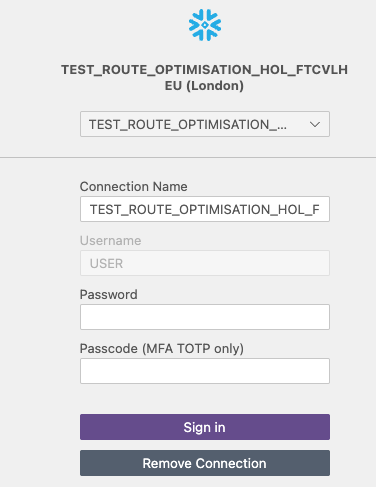

- Within the Repo, navigate to: 

  **Native_app** > **Provider_setup** >  **env_setup.sql**

- Press run all or ctrl + enter / command + enter to run the code within visual studio code.

You will now have a database which contains an empty repository and three stages.  You can view these stages easily with the VSCode addin.

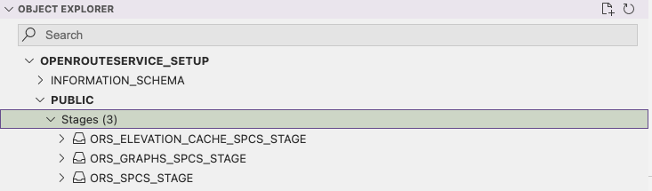

The  **ORS_SPCS_STAGE** stage will contain a map extract and a config file.

The **ORS_GRAPHS_SPCS_STAGE** stage will contain files in a graphs structure to easily calculate route optimisations.  The graphs created will depend on the map uploaded and which vehicle profiles are enabled.

The **ORS_ELEVATION_CACHE_SPCS_STAGE**. 

This cache stores elevation data based on the chosen map extract.  This improves performance when enabled.

- Navigate to the folder **Provider_setup > staged files**.

In here you will see two files.  One of which is a map file.  

An example map file you can use is of San Francisco which is provided in the staged_files folder.  To use this file, it needs to be uploaded to the **ORS_SPCS_STAGE**.  You can do this either manually within snowsight, or more conveniently, using the snowflake add-in.


You can choose from a range of map files from websites such as these

https://download.geofabrik.de/
https://download.bbbike.org/osm/

The file below is the original weekly updated open street map which contains the whole planet.
https://planet.openstreetmap.org/pbf/

Bear in mind the bigger the map, the longer it will take to create the graphs.  You may also require a larger compute for the container to run if you are using a larger map. You might also need to update parameter XMX (Max RAM assigned to Java) in file `services/openrouteservice/openrouteservice.yaml`. As a Rule of Thumb, set it to: `<PBF-size> * <profiles> * 2`

Also please note that the size of the files uploaded using the put command is limited to 5G.  If you wish to use the world file, you will need to initially store in a cloud storage like S3 bucket or Azure Blob Storage and then copy using the copy command.

The ors-config file is a configuration file for the app.  This does a variety of things.

-  Open up the ors-config.yml file to take a look at it

You will see at the beginning of the yml file is a source file locator.  

```yml

ors:
  engine:
    profile_default:
      build:  
        source_file: /home/ors/files/sanFrancisco.osm.pbf

```
This is what the URL will be to point to the right map file.   If you would like to use a different map, as well as uploading the alternative map you will need to change the source file parameter here.

Next you will see a profiles configuration area

```yml
    profiles:
      driving-car:
        enabled: true
      cycling-road:
        enabled: true
      driving-hgv:
        enabled: true
```
This is where you can configure multiple types of vehicles.  If you look at the commented out profiles in here, you can also  configure each profile further as well as adding additional profiles.

- edit the config yml file and add **cycling-electric** and **foot-walking** profiles:

```yml
    profiles:
      driving-car:
        enabled: true
      cycling-road:
        enabled: true
      driving-hgv:
        enabled: true
      cycling-electric:
        enabled: true
      foot-walking:
        enabled: true
```

Here is where you can change the amount of maximum visited nodes.

The nodes are locations where route optimization algorithms are implemented and processed. These nodes are crucial for efficiently planning and executing delivery or service routes, minimizing travel time and cost.  The number of nodes required will depend on how many vehicles, what the vehicle profile is, the length of each journey and how many jobs are involved.  Here, the default number of visited nodes are much lower than the overridden default below. Same for maximum_routes.


```yml
    matrix:
      maximum_visited_nodes: 1000000000
      maximum_routes: 25000000
```

There are also other options available for each profile - and each option will depend on what the profile is.

### Importing new files into a stage using the Snowflake Add-In.

- Download a new map file for **new york city**.

- Click [here](https://download.bbbike.org/osm/bbbike/NewYork/NewYork.osm.pbf) to download the New York City OSM.PBF file.


-   Within the snowflake add-in navigate to the newly created **ORS_SPCS_STAGE**.   You will see this in the **Object Explorer**


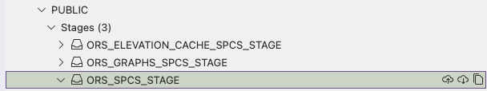

-   Click on the upload icon - 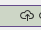 

Navigate to the newly **downloaded New York** file to upload the map file to the snowflake stage.

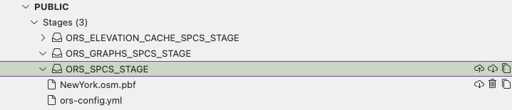

Modify the **config file** by changing the source file location to the following:

```yml
    build:  
        source_file: /home/ors/files/NewYork.osm.pbf
        instructions: false
```

Finally, use the upload tool again to upload the modified config file to snowflake.  

You should see the new files appear in th stages area


Once the files are uploaded, refresh the cache of the stage

```sql
ALTER STAGE OPENROUTESERVICE_SETUP.PUBLIC.ORS_SPCS_STAGE REFRESH;
 ```

Execute the following to ensure the files are registered on the stage directory

```sql
 select * from directory(@OPENROUTESERVICE_SETUP.PUBLIC.ORS_SPCS_STAGE);

 ```
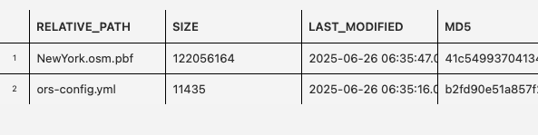

### Create the image and services.

You will now load the docker images to the snowflake repository

- Navigate to the provider_setup > spcs_setup.sh and openn the file.
- Amend where it says **YOUR_CONNECTION** with your **snowcli** connection.  

> **_NOTE:_**  If you have not created a connection before, please navigate to the following [QuickStart](/en/developers/guides/getting-started-with-snowflake-cli/) before proceeding which will explain how these are created.

- Execute the following to ensure you have the correct privileges to run the bash file.  Open up a terminal from the **/native_app** directory within vscode and run the following:

```bash
chmod +x provider_setup/spcs_setup.sh
```

Run the **spcs_setup.sh** file. 

```bash
./provider_setup/spcs_setup.sh
```

You will need to ensure that you have docker desktop running before you run the file.


You now have an 4 docker images inside the previously created repository:

- Within the env_setup.sql, run the following command:  

```sql
SHOW IMAGES IN IMAGE REPOSITORY IMAGE_REPOSITORY;
```
You should see four images pushed to the image repository like this:


The **downloader** image will copy the config and map file from the setup stage to the consumer app.

The **routing_reverse_proxy** will securely manage traffic between  the other three services.

The **openrouteservice** contains all the apis which the openrouteservice offers

The **vroom service** manages the route optimization service.

Now the assets are all setup in the repository and stages, you will now configure the app.

- Using the same terminal in the same directory as before, execute the following snow CLI command

```bash
snow app run -c <CONNECTION_NAME>
```

This will do the following:

**The Manifest File**
use the manifest file to compile to package all 4 images stored inside the image repository

Allow permissions for the consumer to create pools for running services.

Specify the default streamlit for configuring the app.

**The setup script**

When a consumer installs the app, it will add all the services for each image and create all objects needed to run the application.

This also includes the functions that we will later use in streamlit.  The following functions are created:
-   Directions
-   Isochrones
-   Optimisation

You will also note that an additional function (download) is created which calls the downloader service to download the map and config file from the provider stage to the consumer stage.

Once you application package is installed, you will see a new installed app appear in the **apps** section of Snowsight.  This is a locally installed app for testing purposes.

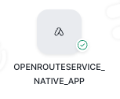

You will also see an application package which you can use to share with other accounts either privately or via the marketplace.


### Activate the app

If you login to snow sight you will see the following newly created app within **Data Products > Apps**.  This is an app local to this snowflake for testing purposes.

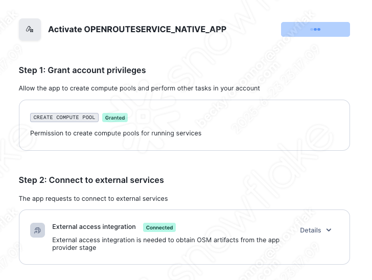

- Open the app and grant the permissions as requested by the application.  Once granted, you can then press **Activate**

You will need to wait a few minutes for the graphs to update.  Within the graphs stage you should see the following folders appear:

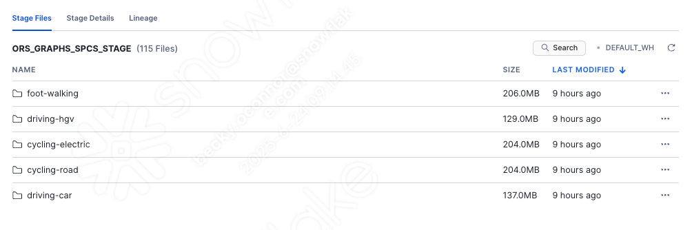

NB: you may need to refresh the stages to view the profiles. in the directory.

If you open the functions part of the app you will see the following functions appear

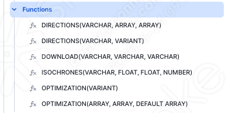

You will learn how to use these functions after option 2 of the quickstart which produces the same functions using rest api calls to the external service.  If you wish, skip option 2 and navigate to the Snowflake Marketplace section.  You will need a dataset provided by **Carto** on the market place for the part of the notebook and the streamlit to run. 

<!-- ------------------------ -->
## Option 2 Calling ORS APIs


Use External Access Integration with Python Functions to call and retrieve data from the Open Route Service

The open route service is free to use but there are restrictions in the number of calls to the freely available api api.

https://openrouteservice.org/plans/

### Register to Open Route Service and retrieve a key

-   Visit [OpenRouteService](https://openrouteservice.org).  Register here and then retrieve your key.


Open up a new SQL worksheet and run the following commands. To open up a new SQL worksheet, select Projects » Worksheets, then click the blue plus button and select SQL worksheet.

```sql
CREATE DATABASE IF NOT EXISTS VEHICLE_ROUTING_SIMULATOR;
CREATE WAREHOUSE IF NOT EXISTS ROUTING_ANALYTICS;

CREATE SCHEMA IF NOT EXISTS CORE;
CREATE SCHEMA IF NOT EXISTS DATA;
```

Copy the create secret command and replace the secret string with your secret token provided by Open Route Service.

```sql
CREATE SECRET IF NOT EXISTS CORE.ROUTING_TOKEN
  TYPE = GENERIC_STRING
  SECRET_STRING = '<replace with your secret token>'
  COMMENT = 'token for routing demo'
```
Create a Network Rule and External Integration

```sql

CREATE OR REPLACE NETWORK RULE open_route_api
  MODE = EGRESS
  TYPE = HOST_PORT
  VALUE_LIST = ('api.openrouteservice.org');


CREATE OR REPLACE EXTERNAL ACCESS INTEGRATION open_route_integration
  ALLOWED_NETWORK_RULES = (open_route_api)
  ALLOWED_AUTHENTICATION_SECRETS = all
  ENABLED = true;

```

-   Create a simple directions function

Directions Function 1 - for simple point to point directions

```sql

CREATE OR REPLACE FUNCTION CORE.DIRECTIONS (method varchar, jstart array, jend array)
RETURNS VARIANT
language python
runtime_version = 3.10
handler = 'get_directions'
external_access_integrations = (OPEN_ROUTE_INTEGRATION)
PACKAGES = ('snowflake-snowpark-python','requests')
SECRETS = ('cred' = CORE.ROUTING_TOKEN )

AS
$$
import requests
import _snowflake
def get_directions(method,jstart,jend):
    request = f'''https://api.openrouteservice.org/v2/directions/{method}'''
    key = _snowflake.get_generic_secret_string('cred')

    PARAMS = {'api_key':key,
            'start':f'{jstart[0]},{jstart[1]}', 'end':f'{jend[0]},{jend[1]}'}

    r = requests.get(url = request, params = PARAMS)
    response = r.json()
    
    return response
$$;

```
-   Create a Directions function with Way Points

```sql
CREATE OR REPLACE FUNCTION CORE.DIRECTIONS (method varchar, locations variant)
RETURNS VARIANT
language python
runtime_version = 3.9
handler = 'get_directions'
external_access_integrations = (OPEN_ROUTE_INTEGRATION)
PACKAGES = ('snowflake-snowpark-python','requests')
SECRETS = ('cred' = CORE.ROUTING_TOKEN )

AS
$$
import requests
import _snowflake
import json

def get_directions(method,locations):
    request_directions = f'''https://api.openrouteservice.org/v2/directions/{method}/geojson'''
    key = _snowflake.get_generic_secret_string('cred')

    HEADERS = { 'Accept': 'application/json, application/geo+json, application/gpx+xml, img/png; charset=utf-8',
               'Authorization':key,
               'Content-Type': 'application/json; charset=utf-8'}

    body = locations

    r = requests.post(url = request_directions,json = body, headers=HEADERS)
    response = r.json()
    
    return response

    $$;
```

-   Create an Optimisation Function

```sql

CREATE OR REPLACE FUNCTION CORE.OPTIMIZATION (jobs array, vehicles array)
RETURNS VARIANT
language python
runtime_version = 3.9
handler = 'get_optimization'
external_access_integrations = (OPEN_ROUTE_INTEGRATION)
PACKAGES = ('snowflake-snowpark-python','requests')
SECRETS = ('cred' = CORE.ROUTING_TOKEN )

AS
$$
import requests
import _snowflake
def get_optimization(jobs,vehicles):
    request_optimization = f'''https://api.openrouteservice.org/optimization'''
    key = _snowflake.get_generic_secret_string('cred')
    HEADERS = { 'Accept': 'application/json, application/geo+json, application/gpx+xml, img/png; charset=utf-8',
               'Authorization':key,
               'Content-Type': 'application/json; charset=utf-8'}

    body = {"jobs":jobs,"vehicles":vehicles}

    r = requests.post(url = request_optimization,json = body, headers=HEADERS)
    response = r.json()
    
    return response
$$;
```
.   Create an Isochrone function

```sql
CREATE OR REPLACE FUNCTION CORE.ISOCHRONES(method string, lon float, lat float, range int)
RETURNS VARIANT
language python
runtime_version = 3.9
handler = 'get_isochrone'
external_access_integrations = (OPEN_ROUTE_INTEGRATION)
PACKAGES = ('snowflake-snowpark-python','requests')
SECRETS = ('cred' = CORE.ROUTING_TOKEN )

AS
$$
import requests
import _snowflake
def get_isochrone(method,lon,lat,range):
    request_isochrone = f'''https://api.openrouteservice.org/v2/isochrones/{method}'''
    key = _snowflake.get_generic_secret_string('cred')
    HEADERS = { 'Accept': 'application/json, application/geo+json, application/gpx+xml, img/png; charset=utf-8',
               'Authorization':key,
               'Content-Type': 'application/json; charset=utf-8'}

    body = {'locations':[[lon,lat]],
                    'range':[range*60],
                    'location_type':'start',
                    'range_type':'time',
                    'smoothing':10}

    r = requests.post(url = request_isochrone,json = body, headers=HEADERS)
    response = r.json()
    
    return response
$$;
```

You will now see the functions below ready to use.

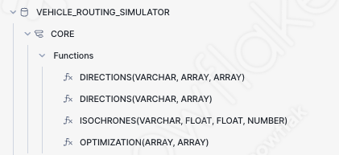

<!-- ------------------------ -->
## Snowflake Marketplace

Before you try out your functions, you will get a dataset from the marketplace.  This is the Carto Overture dataset which includes an extensive point of interest map across the whole world.  It is also useful for routing simulations.
-   Navigate to the Snowflake Marketplace - this is under Data Products > Snowflake Marketplace


Search for Overture Maps - Places

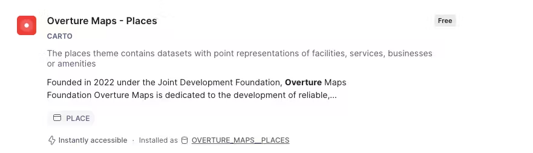

Click on the following dataset then press **Get** Do not change the database name.

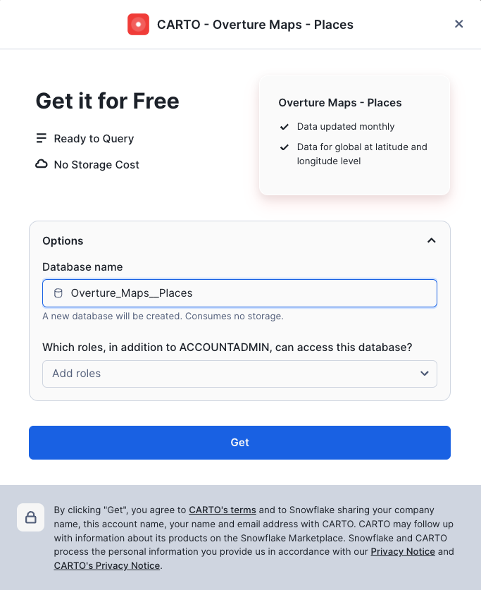

<!-- ------------------------ -->
## Routing functions with AISQL

You will now test out all the functions which you have created. You will be using data simulated by **AISQL**.  

This notebook covers using the functions, how to apply them and how to visualize the results.  At the end you will have a good understand of how the route optimisation service works well with Snowflake Advanced analytical capabilites - which will also lead onto creating the streamlit datasets which will be covered in the next section.

- To ensure the AI LLM model will work in your region and cloud, please run the following command:

```sql  
ALTER ACCOUNT SET CORTEX_ENABLED_CROSS_REGION = 'ANY_REGION';
```

- Run the following SQL to setup a new database and schema for collecting Views/Tables and notebooks for the simulator:

```sql
CREATE DATABASE IF NOT EXISTS VEHICLE_ROUTING_SIMULATOR;
CREATE WAREHOUSE IF NOT EXISTS ROUTING_ANALYTICS;

CREATE SCHEMA IF NOT EXISTS DATA;
CREATE SCHEMA IF NOT EXISTS NOTEBOOKS;
CREATE SCHEMA IF NOT EXISTS STREAMLITS;
```


-   Download following [notebook](https://github.com/Snowflake-Labs/sfguide-create-a-route-optimisation-and-vehicle-route-plan-simulator/blob/1a512439a664c84b6be0cbd329fd591386762370/Notebook/routing_setup.ipynb) 

-   Download the following [environment file](https://github.com/Snowflake-Labs/sfguide-create-a-route-optimisation-and-vehicle-route-plan-simulator/blob/1a512439a664c84b6be0cbd329fd591386762370/Notebook/environment.yml)


-    Create 1 stage to store the notebook assets

 ```sql
 CREATE STAGE IF NOT EXISTS VEHICLE_ROUTING_SIMULATOR.NOTEBOOKS.notebook DIRECTORY = (ENABLE = TRUE) ENCRYPTION = (TYPE = 'SNOWFLAKE_SSE');
```
- Import the downloaded notebook and environment file into the stage using a method of choice such as the Snowsight UI or Visual Studio Code.
- Run the following to create your notebook

```sql
CREATE OR REPLACE NOTEBOOK VEHICLE_ROUTING_SIMULATOR.NOTEBOOKS.EXPLORE_ROUTING_FUNCTIONS_WITH_AISQL
FROM '@VEHICLE_ROUTING_SIMULATOR.NOTEBOOKS.NOTEBOOK'
MAIN_FILE = 'routing_setup.ipynb'
QUERY_WAREHOUSE = 'ROUTING_ANALYTICS'
COMMENT = '{"origin":"sf_sit-is", "name":"Route Optimization with Open Route Service", "version":{"major":1, "minor":0}, "attributes":{"is_quickstart":1, "source":"notebook"}}';

ALTER NOTEBOOK VEHICLE_ROUTING_SIMULATOR.NOTEBOOKS.EXPLORE_ROUTING_FUNCTIONS_WITH_AISQL ADD LIVE VERSION FROM LAST;
```
You will now be able to try out how the functions work and use them in conjunction with **AISQL**.

Navigate to the notebook and follow the provided instructions.  In order to run the streamlit, it is essential that you run from the cell **add_carto_data** AND BELOW.  This is to ensure that you have all the correct dependencies needed.

- Ensure you run all the code below this section **BEFORE** you move to the streamlit.

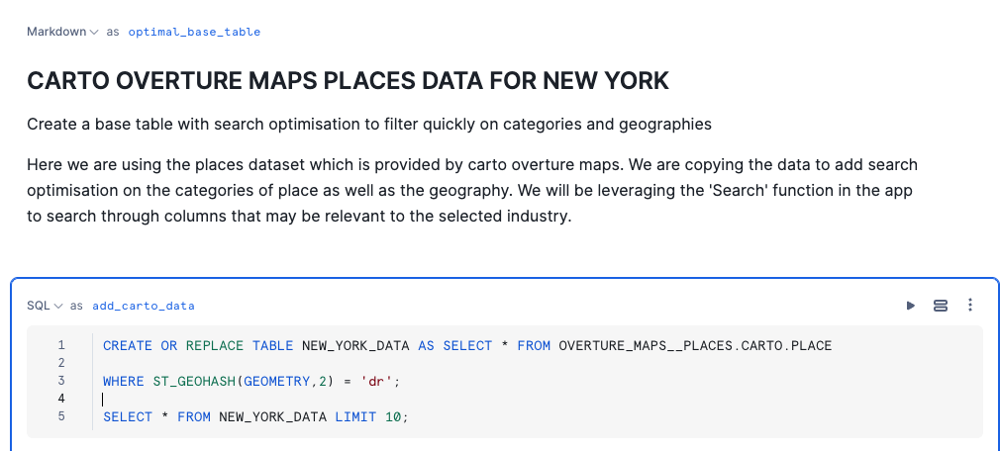
<!-- ------------------------ -->
## Deploy the Streamlit

Now you can see how all the functions work with AISQL, lets now build a route simulator streamlit application.


- Click [here](https://github.com/Snowflake-Labs/sfguide-create-a-route-optimisation-and-vehicle-route-plan-simulator/blob/1a512439a664c84b6be0cbd329fd591386762370/Streamlit/streamlit.zip) to download the files needed for the streamlit app.

- Unzip all files ready for uploading to a stage.


-    Create 1 stage to store streamlit assets

 ```sql
 CREATE STAGE IF NOT EXISTS VEHICLE_ROUTING_SIMULATOR.STREAMLITS.STREAMLIT DIRECTORY = (ENABLE = TRUE) ENCRYPTION = (TYPE = 'SNOWFLAKE_SSE');
```
- Navigate to the Streamlit Stage or the VSCode add-in to import the files.

- Upload all files with the exception of config.toml to the streamlit stage
- Upload the the config.toml file to a folder called .streamlit within the streamlit stage.
- Create the streamlit using the following script

```sql
CREATE OR REPLACE STREAMLIT VEHICLE_ROUTING_SIMULATOR.STREAMLITS.SIMULATOR
ROOT_LOCATION = '@VEHICLE_ROUTING_SIMULATOR.STREAMLITS.streamlit'
FROM 'routing.py'
QUERY_WAREHOUSE = 'ROUTING_ANALYTICS'
COMMENT = '{"origin":"sf_sit-is", "name":"Route Optimization with Open Route Service", "version":{"major":1, "minor":0}, "attributes":{"is_quickstart":1, "source":"Streamlit"}}';
```
- Go to the homepage in Snowsight

- Click on the **Projects** > **Streamlits** and run the **SIMULATOR**.

<!-- ------------------------ -->
## Run the Streamlit

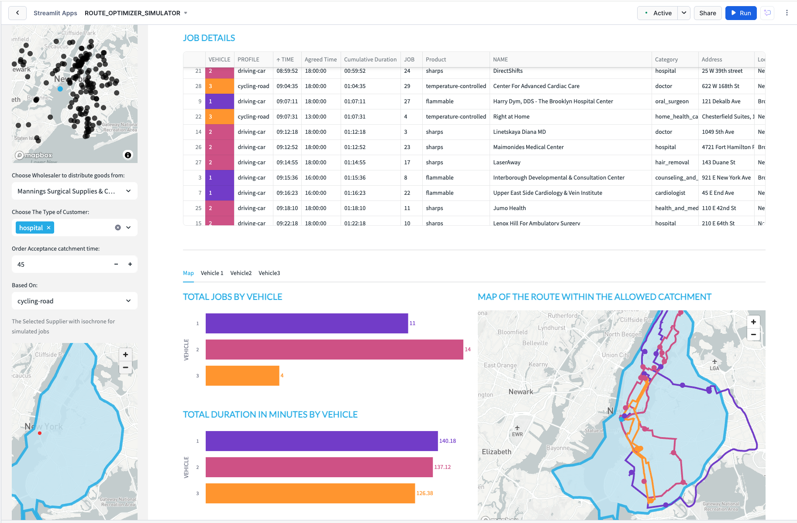

The streamlit app which you have open simulates potential routes to 29 delivery locations for selected customer types - all coming from a user definable wholesaler.  Currently there are 3 types of distributor available although with the notebook, you can create limitless industry categories:

-   Food
-   Health
-   Cosmetics

If you wish to add additional choice of distributor types, you can with the provided notebook.

Before you choose your category, you must select where the routing specific functions are.  This app works with both the api call method and the native app method.  If you followed the instructions and went through both options, you can test out either option using the supplied radio selector.

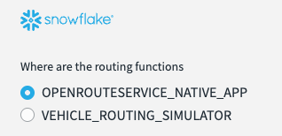


The places you will work with are real as they are based on the Carto Overture points of interest maps which is a dataset freely available on the marketplace.  This allows you to create a location relevant scenario based on the needs of a specific usecase.

**Please note:**  For this simulation the data has been restricted to new york city.  You will need to revise the initial notebook should you require an additional location.  This is an extract filtered by **GEOHASH**.  

If you have built the native app and require an alternative city, you will need to upload the new map to the configuration stage.

### End to End with Streamlit Dynamic Simulator Overview Diagram


### Setting the Context of the Routing Scenario

- Open up the side menu
- Select the industry type.
- Choose the LLM model in order to search for a location.
- Type in a word or phrase in the world which will help locate the simulation.  
**NB** You will only return results in the New York City boundary.
- Choose the distance in KM for how wide you would like the app to search for nearby distributors.

    

- Scroll down to get a map which highlights the place plus where all the nearby distributors are.  

- Scroll further down in the sidebar to select a specific distributor. - This is sorted by distance from the centre point.  You should have relevent wholesalers based on location and industry.


- Choose the type of customers you want to deliver goods to.  In this case, we are choosing supermarkets and restaurants.  Customer types can be configured using the provided notebook.


- There is an order acceptance catchment time - this will be used to generate an isochrone which will filter possible delivery locations within that isochrone.  The isochrone produced is a polygon shaped to all the possible places you can drive within the acceptable drive time.

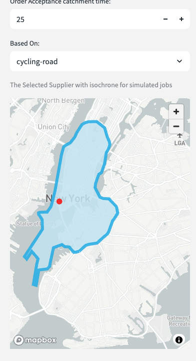

- You may close the side bar.

### Wholesaler Routing Walkthrough.

This is an example scenario based on the previously selected fields.

**Hudson Produce** is in New York City.  This week they have 3 vehicles assigned to make up to 30 deliveries today.


**Vehicle 1** will start between 8HRS and 17HRS - this vehicle is a car.  [hover over information]  the vehicle has a capacity limit of 4 and been assigned a skill level of 1 - this vehicle does not have a freezer so can only carry fresh food.


**Vehicle 2** will operate between 12 and 17hrs [change vehicle 2 from 8 till 12].  This will also be a car but has a skill level of 2 which means they can deliver frozen food.


**Vehicle 3** will also operate between 8hrs and 17hrs and has a skill level of 3 - they can carry  the premium food items - this vehicle will be an road bicycle [select cycling-road]. 

You can look at the vehicle skill level by hovering over the '?' against each vehicle.

Once the selections are made you can choose the scope for the jobs - this is based on a catchment time.  

-   Select 25mins based on how far you can cycle in that time.


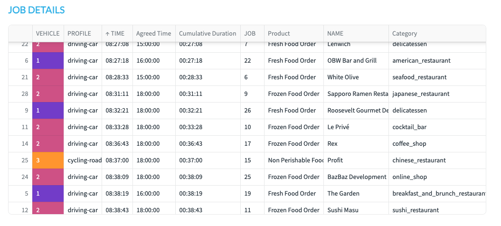

You will note that orders of the Non Perishable orders will only go to vehicle 3, the fresh food will go to vehicle 2 and the frozen food will go to vehicle 1.

(if i have more vehicles that have the same skills it will also look at the time slots as well).


Next we look at the map

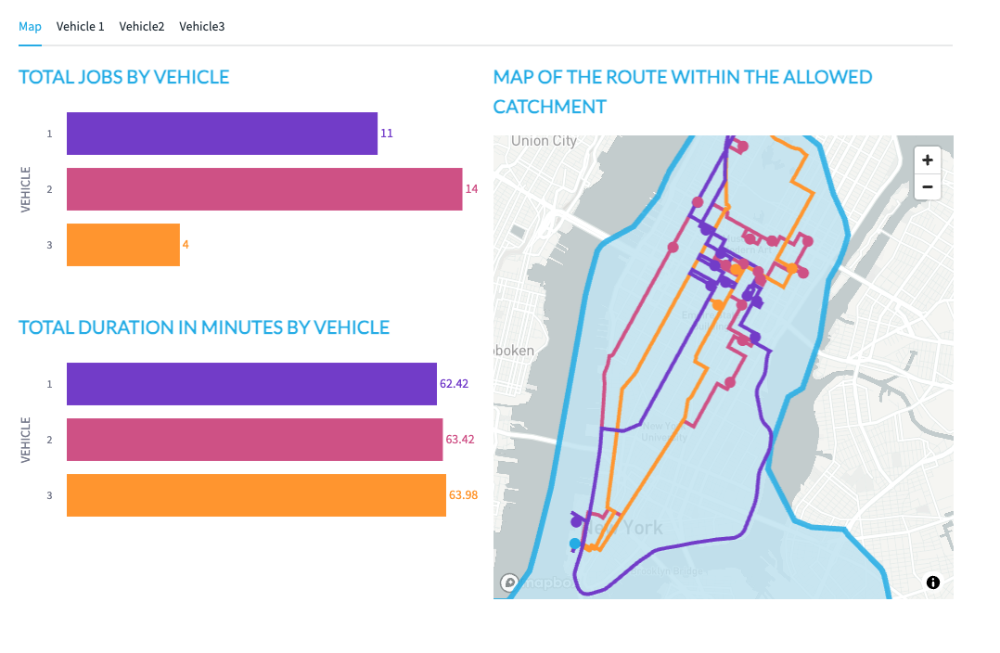

Vehicle 3 has the least amount of things to deliver but takes the longest to deliver them.  This is probably because the vehicle is a bicycle.  [change bicycle to hgv and re run]


When looking at the map itself, you will see the lines of the route for each vehicle, this is colour coded - you will also see circles which also represent the drops for each vehicle.  The hoverover will tell you what the point represents.


Tabs - this will give instructions for each segment of the drivers journey - the final stop is the return back to the wholesaler.


### How does it work

You can see that in a couple of clicks you can create a vehicle optimisation scenario from anywhere. 


#### Finding the place
the app is using an LLM to retrieve a Latitude and longitude based on the word entered into the search.

Snowflake will use the ST_DWITHIN geospatial function to filter the overture maps to find all places of interest within an Xkm radius. 


#### The previously run notebook

The previously ran notebook contains the standing data which you can go back to to customize the demo.  If you want to change the types of places to be hotels, then that is quite possible.

Within the notebook, you have also created: 

- The overture dataset and included optimisation on geo and the category variant column to help with faster searching.

- An industry lookup table to add relevant context

- A job sample table

#### The mapping
The solution leverages Pydeck to plot points, linestrings and polygons on a map.  The isochrone is the polygon, the routes are linestrings and the places/points of interest are points.  You would have seen how this works in the original notebook. AISQL is useful to quickly generate python code to test the maps. 
<!-- ------------------------ -->
## The Streamlit Code

This final Section, gives you some explanation as to how the streamlit code works.

The Streamlit puts all of the above components together. I will now explain how the main aspects of the code works.

**Setup Theming**

An important feature for better user experience is what the application looks like. I have themed the app to be consistant with Snowflake Branding. This is so much easier and flexible now we can add styles to Streamlit in Snowflake.

For the theming, a style sheet was added to the streamlit project.

```python
with open('extra.css') as f:
    st.markdown(f"<style>{f.read()}</style>", unsafe_allow_html=True)
```


**Industry Lookup**

An  industry lookup snowpark dataframe is created. We then create a second dataframe which only selects the industry name. This will be used for the first sidebar filter

```python

lookup = session.table('LOOKUP')
industry = lookup.select('INDUSTRY')
```

Based on the selected industry, key variables are generated for added context to the standing data and filtering the points of interest dataset. The user selects the chosen industry from the sidebar, which then assign the variables

```python

#sidebar
with st.sidebar:
    st.image(image)
    choice = st.radio('select industry', industry)
    lookup = lookup.filter(col('INDUSTRY')==choice)
    lookup = lookup.with_column('IND',array_to_string('IND',lit(',')))
    lookup = lookup.with_column('IND2',array_to_string('IND2',lit(',')))
    
    lookuppd = lookup.to_pandas()


```

```python

#assign variables

pa = lookuppd.PA.iloc[0]
pb = lookuppd.PB.iloc[0]
pc = lookuppd.PC.iloc[0]
ind = lookuppd.IND.iloc[0]
ind2 = lookuppd.IND2.iloc[0]
ctype = json.loads(lookuppd.CTYPE.iloc[0])
stype = json.loads(lookuppd.STYPE.iloc[0])

```

**Vehicle Type Dropdown**

These vehicle types will be assigned to each of the 3 vehicles. These will be configured by the user.

```python

method =[
             'driving-car',
             'driving-hgv',
             'cycling-regular',
             'cycling-road',
             'cycling-mountain',
             'cycling-electric']

```

**Locations Dataset**
Here, a Snowpark Dataframe is created from the previously configured places dataset.

```python

places_f = session.table('places')

```
```python
places_f = places_f.select('GEOMETRY',call_function('ST_X',
                           col('GEOMETRY')).alias('LON'),
                           call_function('ST_Y',
                                  col('GEOMETRY')).alias('LAT'),
                                  col('ADDRESS'),
                                  col('CATEGORY'),
                                  col('ALTERNATE'),
                                  col('PHONES'),col('NAME'),
                                  col('GEOMETRY').alias('POINT')
```

**Cortex map filter**

This is where Cortex is used to filter the places dataset. The prompt is asking the model to 'give me the Latitude an Longitude which centers the following place.' The 'following place' is a free text field which the user enters such as: the Statue of Liberty, or London, or Heathrow Airport. They enter whatever they like and cortex will try and make sense of it.
The user also chooses an LLM model (I have found mistral-large2 works very well) and a distance. Different LLMs produce varying results of accuracy. For better accuracy, perhaps use Cortex Fine Tuning to load good examples into the model - such as the Overture Points of Interest itself. I found that mistral large 2 produced the result accuracy I needed without fine tuning. The distance is not really used for the LLM, but is used later to filter out potential distributors by straight line distance.

```python

with st.sidebar:
    st.markdown('##### Cortex Powered Map Filter')
    st.info(prompt)
    model = st.selectbox('Choose Model:',['reka-flash','mistral-large2'],1)
    place = st.text_input('Choose Input','Heathrow Airport')
    distance = st.number_input('Distance from location in KM',1,300,5)

```

Next, we need to do some prompt engineering. Below is the initial prompt to work with.

```python

prompt = ('give me the LAT and LON which centers the following place')

```

The idea is that the prompt feed the LLM and return the results to the LLM in the correct format. However, further engineering will be needed before we get reliably good results.

I engineered the prompt by adding text to the prompts such as ' return 3 value which are as follows…. and 'use the following json template'. This is to ensure that what is returned is very likely to be in the format that I would expect.

The results are returned as a single string which is simply converted to json by using the 'parse_json' function. You will note that before the json is parsed I removed characters that are sometimes generated in order to return the resulting json as markdown. This is great for display purposes but not so great if I only want the json. The replace function removes these characters if they exist.

Once parsed, I used standard geo and semi structured features in Snowflake to calculate points, present results in a structured form and order the returned results by distance.

This has all been wrapped with a function called choose_place(place,model,distance).

```python

prompt = ('give me the LAT and LON which centers the following place')


```

```python

@st.cache_data
def choose_place(place,model,distance):
    json_template = str({'LAT':44.3452,'LON':2.345,'DISTANCE':100})
    min_max = session.createDataFrame([{'PLACE':place}])\
    .with_column('CENTER',
        call_function('snowflake.cortex.complete',
        model,
        concat(lit(prompt),
        col('PLACE'),lit(f'return 3 values which \
        are as follows LAT and LON with {distance} as DISTANCE'),
        lit('use the following json template'),
        lit(json_template),
        lit('return only json. DO NOT RETURN COMMENTRY OR VERBIAGE'))
                                  )
    min_max = min_max.select(parse_json(replace(replace('CENTER',
                              "```",
                              ''),
                              'json',
                              '')).alias('CENTER'))
   return min_max.select(col('CENTER')['LAT'].astype(FloatType()).alias('LAT'),
     col('CENTER')['LON'].astype(FloatType()).alias('LON'),
     call_function('ST_ASWKT',
     call_function('ST_MAKEPOINT',
     col('LON'),col('LAT'))).alias('POINT'),
     col('CENTER')['DISTANCE'].astype(FloatType()).alias('"DISTANCE1"'),
     lit(0).alias('DISTANCE'),
     lit(place).alias('NAME')).to_pandas()


```

We will call this function in the next step of the app.

```python

bbox = choose_place(place,model,distance)

```

**Creating a scatter plot for suggested location based on user input**

This is a pydeck layer - which generates a map based on the returned result of the previously created function. The returned results will be a single blue spot. We will later create another layer which will scatter all the available depots based on this location and within the distance chosen by the user.

```python

context = pdk.Layer(
    'ScatterplotLayer',
    bbox,
    get_position=['LON', 'LAT'],
    filled=True,
    stroked=False,
    radius_min_pixels=6,
    radius_max_pixels=20,
    auto_highlight=True,
    get_fill_color=[41, 181, 232],
    pickable=True)
    st.divider()

```

Preview the results in a pydeck chart. The view state navigates the map to the position of the blue spot.

```python

view_state = pdk.ViewState(bbox.LON.iloc[0], bbox.LAT.iloc[0], zoom=4)
    st.pydeck_chart(pdk.Deck(layers=[context],map_style=None,initial_view_state=view_state))

```
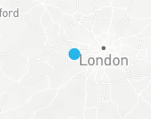

We will next add a new layer which will show all industry related industry suggestions that are within X distance of the blue spot.

**Searching the data for the right type of place (The What).**

We will search the 'what' by using the SEARCH function. This will search multiple columns within the same row to see if it matches the keywords stated in the industry lookup table. The industry must match the one which the user selected earlier. You will note that this search is being repeated twice - this is to search for two different concepts.

For example:

- Search one must contain one of these words:

    - hospital 
    - health 
    - pharmaceutical
    - drug 
    - healthcare 
    - pharmacy 
    - surgical

- From the results of search 1, search 2 must contain one of these words:
    - supplies 
    - warehouse 
    - depot 
    - distribution 
    - wholesaler 
    - distributors

```python
places_w = places_f.filter(call_function('ST_DWITHIN', 
      places_f['GEOMETRY'],
      to_geography(lit(bbox.POINT.iloc[0])),
      lit(bbox.DISTANCE1.iloc[0])*1000))#.cache_result()
```

```python

places_1 = places_w.filter(expr(f'''search((CATEGORY,
      ALTERNATE,
      NAME),'{ind}',
      analyzer=>'DEFAULT_ANALYZER')''')).cache_result()
places_1 = places_1.filter(expr(f'''search((CATEGORY,
      ALTERNATE,
      NAME),
      '{ind2}',
      analyzer=>'DEFAULT_ANALYZER')''')).cache_result()

```

The search is using the default analyzer, meaning it will accept any of the words in any order. This is useful to avoid missing things, but providing a second context by searching twice, you will get a better result accuracy. All search words are found in the industry lookup table.

**Filter the places by the 'where'**

We will filter by distance from the previously allocated point which was returned by the LLM.

```python

places_1 = places_1.with_column('DISTANCE',
                call_function('ST_DISTANCE',
                call_function('ST_MAKEPOINT',
                 col('LON'),
                 col('LAT')),
                 call_function('ST_MAKEPOINT',
                      lit(bbox.LON.iloc[0]),
                      lit(bbox.LAT.iloc[0]))))


```
```python
places_1 = places_1.with_column('DISTANCE',
           round(col('DISTANCE')/1000,2)).order_by('DISTANCE')
```
**Visualise the map of depots**

This creates a map function which returns the what and where as a scatter plot map within the sidebar. You will note that there is an additional layer here. This layer will return multiple plots as apposed to 1 which is what the first layer generated.

```python

@st.cache_data
    def places_cached(distance,bbox,ind):
        return places_1.to_pandas()

```
A tool tip is constructed to reveal the name of each potential distributor and the straight line distance.

```python

tooltip = {
   "html": """<b>Name:</b> {NAME} <b><br>Distance From Centre:</b> {DISTANCE}""",
   "style": {
       "width":"50%",
        "backgroundColor": "steelblue",
        "color": "white",
       "text-wrap": "balance"
            }
        }

```


defining the second layer for  potential distributors

```python
wholesalers = pdk.Layer(
    'ScatterplotLayer',
    places_cached(distance,bbox,ind),
    get_position=['LON', 'LAT'],
    filled=True,
    opacity=0.5,
    stroked=False,
    radius_min_pixels=6,
    radius_max_pixels=10,
    auto_highlight=True,
    get_fill_color=[0, 0, 0],
    pickable=True)
    st.divider()

```

```python

view_state = pdk.ViewState(bbox.LON.iloc[0], bbox.LAT.iloc[0], zoom=4)

```

**Map Layout**
Below will render the map.

```python

st.pydeck_chart(pdk.Deck(layers=[wholesalers,context],
  map_style=None,
  initial_view_state=view_state, 
  tooltip=tooltip))

```

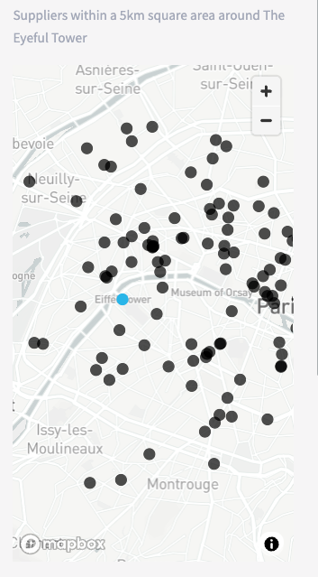

The returned results will also generate a list of places to select from using a drop down list:

```python

@st.cache_data
def warehouses(distance,bbox,ind):
  return places_1.group_by(col('NAME'))\
        .agg(avg('DISTANCE').alias('DISTANCE'))\
        .sort(col('DISTANCE').asc()).to_pandas()

```

```python

s_warehouse = st.selectbox('Choose Wholesaler to distribute goods from:',
                            warehouses(distance,
                                       bbox,
                                       ind))

```


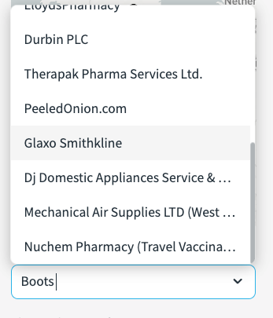


**Job Template**

The job template is joined to the the industry lookups for provide context to the types of goods being delivered. we will call this 'time slots'

```python

time_slots = session.table('JOB_TEMPLATE')
pa = time_slots.filter(col('PRODUCT')=='pa').join(lookup.select('PA'))
pb = time_slots.filter(col('PRODUCT')=='pb').join(lookup.select('PB'))
pc = time_slots.filter(col('PRODUCT')=='pc').join(lookup.select('PC'))

```
```python

time_slots = pa.union(pb).union(pc).with_column('PRODUCT',
                                        col('PA')).drop('PA')

```

**Customer Catchment Generation**

Now we need to generate another dataset - this time for potential customers which are located within catchment of a chosen depot.  The user will define the catchment based on a drive time.

```python

range_minutes = st.number_input('Order Acceptance catchment time:',0,120,20)

```


We will now focus on filtering a new point of interest dataset by drive time. This dataset will simulate typical customers within the catchment. For this, we will leverage the 'isochrone' function which calls the open route service api to build a catchment polygon.

```python

isochrone = session.create_dataframe([{'LON':start_1[0], 
                      'LAT':start_1[1], 
                      'METHOD':smethod,
                      'RANGE_MINS':range_minutes}])
st.write(isochrone)
        
isochrone = isochrone.select(call_function('UTILS.ISOCHRONES',
                          (col('METHOD'), 
                           col('LON'), 
                           col('LAT'), 
                           col('RANGE_MINS'))).alias('ISOCHRONE'))

isochrone2 = isochrone.select(to_geography(col('ISOCHRONE')['features'][0]['geometry']).alias('GEO')).cache_result()

```

You will see that after calling the isochrone function, we then join the resulting polygon dataset to the point of interest dataset using 'ST_WITHIN'. This ensures only jobs will be created within the catchment area of the polygon.

**Customer Type Filter**

Now lets filter **'the what'** on the customer dataset. We have all points of interests around the catchment of a depo, however, we have not specified what type of organisations these customers are. This is what the next drop down list is for. The user will pick the type of customer which is relevant to the industry. This example filter selection below will only retain organisations which are categorised as hospitals, dentists and pharmacies. Because the categories are in two fields, we will use the **SEARCH** function again.


```python

places_2 = places_f.filter(expr(f'''search((CATEGORY,ALTERNATE,NAME),
                                '{" ".join(customer_type)}',
                                analyzer=>'DEFAULT_ANALYZER')'''))

```

We will limit our customer results to match the number of 'time slots' we have created from the job template, and generate a sample of the results.

```python

places_2 = places_2.join(isochrone2,
  call_function('ST_WITHIN',
  places_2['POINT'],
  isochrone2['GEO'])).sample(0.5).limit(time_slots.count()).cache_result()

```
Next, we will create a row number after ordering the sample by a random number. This row number will effectively become our unique **'consignment number'** which will be used in the optimisation service.

```python

window_spec = Window.order_by(random())
places_2 = places_2.with_column('ID',row_number().over(window_spec))
places_2 = places_2.join(time_slots,'ID')

```

Next we will join to the time slots by 'ID' which has been randomly assigned to **'our customers'**.

```python

places_2 = places_2.join(time_slots,'ID')

```

Now we will format the table in to presentable jobs. This will assign skills, time slots and capacity requirements.

```python

places_2_table = places_2.select('ID',
        col('PRODUCT').alias('"Product"'),
        col('SLOT_START').alias('"Slot Start"'),
        col('SLOT_END').alias('"Slot End"'),
        col('NAME').alias('Name'),
        col('CATEGORY').alias('"Category"'),
        col('ADDRESS')['freeform'].astype(StringType()).alias('"Address"'),
        col('ADDRESS')['locality'].astype(StringType()).alias('"Locality"'),
        col('ADDRESS')['postcode'].astype(StringType()).alias('"Postcode"'),
        col('ADDRESS')['region'].astype(StringType()).alias('"Region"'),
        col('PHONES').alias('"Phone Number"'))

    
places_2 = places_2.with_column('JOB',
              object_construct(lit('id'),col('ID'),
              lit('capacity'),lit([2]),
              lit('skills'),array_construct(col('SKILLS')),
               lit('time_window'),
               array_construct(col('SLOT_START')*60*60,col('SLOT_END')*60*60),
               lit('location'),array_construct(col('LON'),col('LAT'))
                      py))

    

jobs = places_2.select(array_agg('JOB').alias('JOB'))


```

**The Vehicles**
The example I have created, is an example of only 3 vehicles at pre defined skill levels.


The vehicle location is then Aligned to the previously selected depot. In reality, vehicles might have varying start destinations - however, for simplicity all vehicle starting points are the same.

```python

places_vehicles = places_1.filter(col('NAME')==s_warehouse).cache_result()

```

Construct each configurable vehicle. Below is an example of one of the vehicles. You will see that we are converting the start and end time of each vehicle to seconds - likewise for the customers, the agreed delivery times for the optimisation service to work are also in seconds.

```python

vehicle_1 = places_vehicles.select(object_construct(lit('profile'),
                      lit(smethod),
                      lit('skills'),
                      lit(veh1_skills),
                      lit('id'),
                      lit(1),
                      lit('start'),
                      array_construct(col('LON'),col('LAT')),
                      lit('end'),
                      array_construct(col('LON'),col('LAT')),
                      lit('time_windows'),
                      array_construct(lit(start_time_0*60*60),
                                      lit(end_time_0*60*60)),
                      lit('capacity'),
                      lit(veh1_capacity)).alias('VEHICLE'))

```

Now, we present the configurable aspects of each vehicle to the user. You will note that this is an example of utilising the previously configured styling.

```python

st.markdown('<h4 class="veh2">Vehicle 2</h2>', 
    unsafe_allow_html=True, 
    help=f'''Vehicle 2 {skill_types[veh2_skills[0]-1]} and a capacity of {veh2_capacity[0]}''')
    
    col4,col5,col6 = st.columns(3)
    with col4:
        start_time_1 = st.number_input('Start Time in Hours:',0,24,8,key=3)
    with col5:
        end_time_1 = st.number_input('End Time in Hours:',start_time_1,24,17,key=4)
    with col6:
        smethod_1 = st.selectbox('Choose Method:',method, key=6)

```

For further formatting - when the job results are returned after going through the optimisation service, it will be nice to clearly see what vehicles are aligned to what job. This detail is added to the dataframe which gives data driven colour coding.

```python

##### ADD VEHICLE_COLOR TO VEHICLES)
    vehicle_1 = vehicle_1.with_column('R',lit(125))
    vehicle_1 = vehicle_1.with_column('G',lit(68))  
    vehicle_1 = vehicle_1.with_column('B',lit(207)) 

    vehicle_2 = vehicle_2.with_column('R',lit(212))
    vehicle_2 = vehicle_2.with_column('G',lit(91))  
    vehicle_2 = vehicle_2.with_column('B',lit(144)) 

    vehicle_3 = vehicle_3.with_column('R',lit(255))
    vehicle_3 = vehicle_3.with_column('G',lit(159))  
    vehicle_3 = vehicle_3.with_column('B',lit(54))

```

Next, we union all vehicles into a new dataset called **vehsdet**.

```python

vehsdet = vehicle_1.union(vehicle_2).union(vehicle_3).with_column('ID',
              col('VEHICLE')['id'])\
    .with_column('PROFILE',
                 col('VEHICLE')['profile'].astype(StringType()))\
    .with_column('WINDOW',
                  col('VEHICLE')['time_windows'].astype(StringType()))
    vehs = vehsdet.select(array_agg('VEHICLE').alias('VEH'))
    vehsdet = vehsdet.drop('VEHICLE')


```

**Route Optimisation Service**

So we have our 'Customers' and we have our 'Vehicles'. We now need to create our route plans for each vehicle using the Route Optimisation Service. This will effectively push our jobs and vehicles into the api which will return our vehicle route plans based on information such as drive time, consignment needs and vehicle availability.

```python

optim = jobs.join(vehs).select('JOB',
                'VEH',call_function('UTILS.OPTIMIZATION',
                col('JOB'),col('VEH')).alias('OPTIMIZATION'))

```

The returned results will be an array of various objects. We will extract out the parts we want in order to display the results clearly.

```python

optim = optim.with_column('CODES',col('OPTIMIZATION')['codes'])
        optim = optim.with_column('ROUTES',col('OPTIMIZATION')['routes'])
        optim = optim.with_column('SUMMARY',col('OPTIMIZATION')['summary'])
        optim = optim.with_column('UNASSIGNED',col('OPTIMIZATION')['unassigned'])
    
    
    
        optim = optim.with_column('COST',col('SUMMARY')['cost'])\
        .with_column('DURATION',col('SUMMARY')['duration'])\
        .with_column('NUMBER_OF_ROUTES',col('SUMMARY')['routes']).drop('SUMMARY')

        optim = optim.join_table_function('flatten',col('ROUTES'))\
        .select('VALUE')

        optim = optim.select(col('VALUE')['amount'].alias('AMOUNT'),
                         col('VALUE')['vehicle'].alias('VEHICLE'),
                         col('VALUE')['duration'].alias('DURATION'),
                         col('VALUE')['steps'].alias('STEPS'),
                        col('VALUE')['location'][0].alias('LON'),
                         col('VALUE')['location'][0].alias('LAT')p

```

As described in the route optimisation function, the output will give steps for the journey along with other measures such as duration and what vehicle will be assigned. 


The **directions API** will then be used to get detailed instructions for each step.

```python

optim_line = optim_line\
        .select('VEHICLE','R','G','B','PROFILE','ID','TOTAL_JOBS',
            call_function('UTILS.DIRECTIONS_with_way_points',
                                    col('PROFILE'),
                            col('LINE')).alias('DIRECTIONS')).cache_result()

```

This will return detailed route plans which include all drop offs, line strings as well as written instructions.

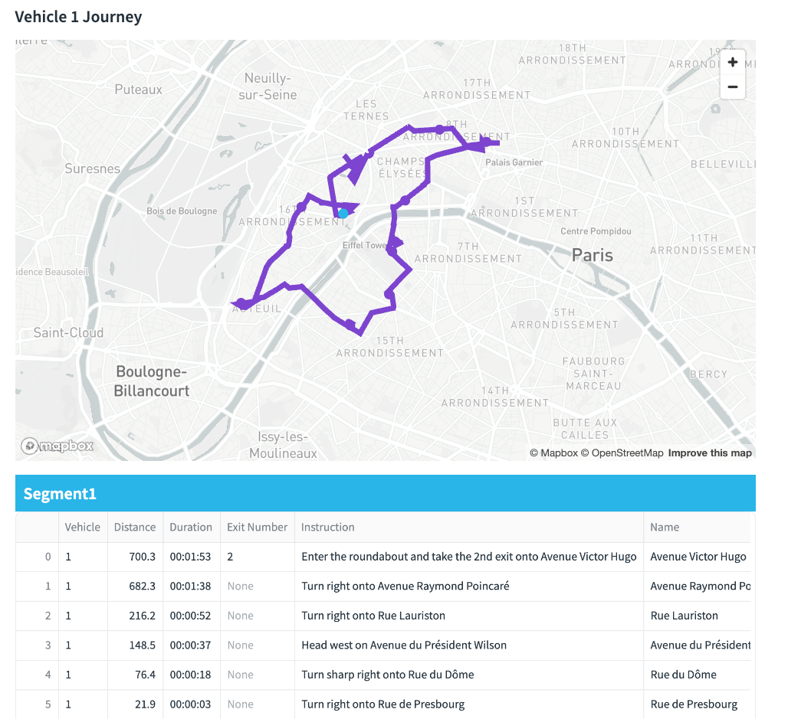

Two layers are created for the visualisation - one for the line paths and the other for the drop offs. The layers have been generated by a python function in order to reuse the code for each vehicle. This is so i can show a vehicle plan each containing an independant map within each tab.

```python

def veh_journey(dataframe,vehicle):
            vehicle_1_path = pdk.Layer(
            type="PathLayer",
            data=dataframe[dataframe['VEHICLE']==vehicle],
            pickable=True,
            get_color=["0+R","0+G","0+B"],
            width_scale=20,
            width_min_pixels=4,
            width_max_pixels=7,
            get_path="coordinates",
            get_width=5)
            return vehicle_1_path

        def vehicle_drops(dataframe,vehicle):
            layer_end_v1 = pdk.Layer(
            'ScatterplotLayer',
            dataframe[dataframe['VEHICLE']==vehicle],
            get_position=['LON', 'LAT'],
            filled=True,
            stroked=False,
            radius_min_pixels=6,
            radius_max_pixels=10,
            line_width_min_pixels=5,
            auto_highlight=True,
            get_radius=50,
            get_line_color=["0+R","0+G","0+B"],
            get_fill_color=["0+R","0+G","0+B"],
            pickable=True)
            return layer_end_v1


```

Below you can see an example of all three vehicles travelling around Paris to drop goods off. This is combining points and line string layers for each vehicle as well as the isochrone layer.

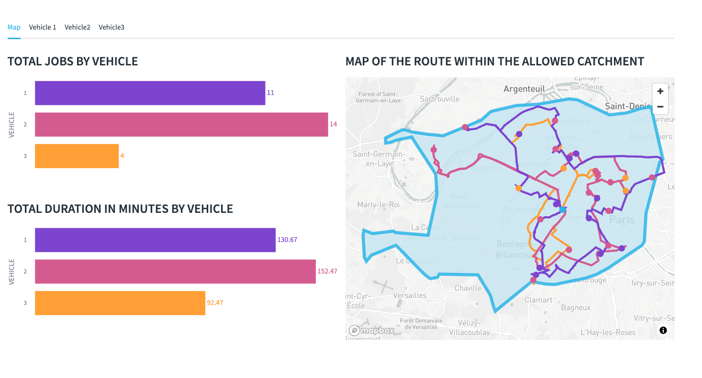

#### Considerations
The Job details may plot routes outside the agreed time.  The Demo has only vehicles where each vehicle has a unique skill.  We will need more vehicles / less skills to prevent these violations.

The app is confined to a B2B model as we do not have public names and addresses of B2C consumers.  If a B2C simulator is needed, then an alternative 'customer' dataset other than the 'places' dataset is needed.


<!-- ------------------------ -->
## Conclusion and Resources
### Conclusion

So you will now see that by combining AI, freely accessible points of interests, easy to use geospatial functions, the ability to securely call the open route service and the powers of Streamlit in Snowflake - creating innovative geospatial applications  is entirely possible. 

Snowflake provides powerful solutions when you bring Snowflake's advanced analytics, Cortex, Snowpark and Streamlit's visualization capabilities together.  Also, by leveraging the open route service (or even an alternative provider such as the Carto Toolbox) using external integrations provides another level of geospatial capabilites such as route optimisation, directions and isochrones.  


### What You Learned

You will have learned the following:
 - How to use Snowflake Cortex can be used as a location filter, which can filter a comprehensive point of interest dataset to anywhere in the world.

- Use text based Search capabilities for advanced filtering which adds accurate context to a simulation

- How to utilise Pydeck to create a multi layered map

- Leverage the open route service to create the following

    - isochrones (catchements) based on drive time
    - Simple Directions and Directions which include waypoints
    - Route Optimisations


### Related Resources


#### Source code

- [Source Code on Github](https://github.com/Snowflake-Labs/sfguide-Create-a-Route-Optimisation-and-Vehicle-Route-Plan-Simulator)


#### Further Related Material

- [Geospatial Functions](https://docs.snowflake.com/en/sql-reference/functions-geospatial)

- [Building Geospatial Multi-Layer Apps with Snowflake and Streamlit](/en/developers/guides/building-geospatial-mult-layer-apps-with-snowflake-and-streamlit/)

- [H3 Indexing](https://h3geo.org/docs/)

- [Streamlit](https://streamlit.io/)

- [Pydeck](https://deckgl.readthedocs.io/en/latest/index.html#)

- [Using Cortex and Streamlit With Geospatial Data](/en/developers/guides/using-snowflake-cortex-and-streamlit-with-geospatial-data/)

- [Getting started with Geospatial AI and ML using Snowflake Cortex](/en/developers/guides/geo-for-machine-learning/)


