author: sfc-gh-fgoransson
id: create_a_native_data_clean_room
summary: Create a Snowflake Native Data Clean Room
categories: Getting-Started
environments: web
status: Published
feedback link: https://github.com/Snowflake-Labs/sfguides/issues
tags: Getting Started, Data Clean Room, Data Collaboration, Constrained Access

# Create a Native Data Clean Room
<!-- ------------------------ -->
## Overview 
Duration: 1

Building an operating Data Clean Rooms with Snowflake is greatly simplified through the new Native Data Clean Room UI together with the Policy based constraints for Projection and Aggregation. This complements the existing model of building and operating Data Clean Rooms on Snowflake that is based on defined access (templates) - something that has been made possible through the Secure Data Sharing and data protection capabilities built directly into the platform.

Data Clean Rooms (DCRs) are secure environments that enable multiple organizations (or divisions of an organization) to bring data together for joint analysis under defined guidelines and restrictions that keep the data secure.  These guidelines control what data comes into the clean room, how the data within the clean room can be joined with other data in the clean room, the kinds of analytics that can be performed on the clean room data, and what data - if any - can leave the clean room environment.  

Snowflake's ability to allow multiparty collaboration while preserving privacy and data protection is unique and allows parties to collaborate in this environment without having to move data to separate and isolated environments - the data from each party never leaves or moves from each account, and each participant retains control and security over that data.

> aside negative
> 
>  **Caveat:** This Data Clean Room QuickStart is for illustrative purposes only, as a hands-on lab intended to show some of the basic features used to build a data clean room on Snowflake. The result of this lab must not be used in a production environment.


### Prerequisites
- Working knowledge with Snowflake database objects and the [Snowflake Web UI](https://docs.snowflake.com/en/user-guide/ui-web.html)
- Clear understanding of how Snowflake [Secure Data Sharing](https://docs.snowflake.com/en/user-guide/data-sharing-intro.html) works
- Access to the Private Preview features for Projection Constraints, Aggregation Constraints and Native DCR UI
- Access to two separate Snowflake Accounts to act as the Provider and Consumer in this Use Case. 

> aside negative
> 
>  **Preview feature** This Quickstart covers features that are currently in a Private Preview and not available to all accounts yet. To test and use these features it is required that you have access to these features - talk to your Snowflake representative if you have a use case that would be a good fit for this capability.

> aside negative
>
> **Limited availability** The accounts used in this quickstart have to be in an AWS region, as the Native DCR feature is using Native Application, which at the moment is only available on AWS. When Native Applications become available across Azure and GCP regions as well, the Native Data Clean Room capability will be updated.

### What You’ll Learn 
- how to create a Native Data Clean Room in Snowflake
- how to protect the data using Policy Constraints
- how to use a and analyse data as a Clean Room consumer

### What You’ll Need 
- Two Snowflake accounts, one enabled on the following PrPr features
  - [Native Data Clean Rooms](https://other-docs.snowflake.com/LIMITEDACCESS/data-clean-room)
  - [Projection Policies](https://docs.snowflake.com/LIMITEDACCESS/projection-policies)
  - [Aggregation Policies](https://docs.snowflake.com/LIMITEDACCESS/aggregation-policies)
- Working knowledge with Git, Snowflake objects, and the [Snowflake Web UI](https://docs.snowflake.com/en/user-guide/ui-web.html)
- Clear understanding of how Snowflake [Secure Data Sharing](https://docs.snowflake.com/en/user-guide/data-sharing-intro.html) works

### What You’ll Build 
- A Data Clean Room that is distributed to a consumer, ready to query and analyse, where the data is protected by the provider's policies.

<!-- ------------------------ -->
## Sample Data
Duration: 20

For this quickstart we focus on a use case where two organizations want to collaborate around and draw insight based on some data that contains sensitive privacy information, but where the aggregated results are valuable and can be used without violating the privacy of the data on either side.

In this scenario we have a retail brand that sells outdoor equipment - Kayak Co., and we have a website with users who can post and interact with videos - NatureClips. Kayak Co. would like to understand how big the overlap for different segments of their customers and visitors to the NatureClips website is - to drive insights into which products resonate with which type of topics and similar. While both organizations have customer identity data, in this case both track emails, directly sharing these with the other party is not an option. In this case a Clean Room setup could support that analysis directly without revealing the sensitive information, such as emails.

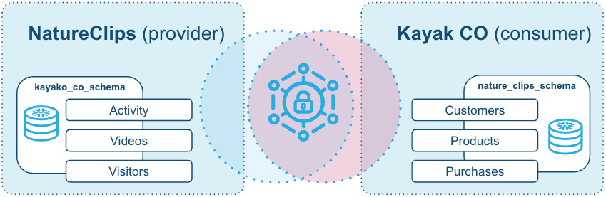

In this collaboration we will call NatureClips the Provider and Kayak Co. the Consumer, information (answers to questions) is flowing from NatureClips to Kayak Co.  This means that we will set up the Data Clean Room in the NatureClips organization and share it with Kayak Co.

### Create the Provider data

We start with the NatureClips account. Ensure that you are logged into the account that is the provider account.

Open a new worksheet and copy the sql code from the setup script [nc_setup.sql](https://github.com/Snowflake-Labs/sfquickstarts/tree/master/site/sfguides/src/create_a_native_data_clean_room/assets/nc_setup.sql) and run this in the account. Once completed you should have three tables in the nature_clips_schema in the nature_clips_db:


``` sql
SELECT * FROM VISITORS SAMPLE(20 ROWS);
```
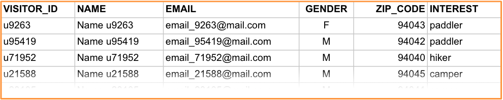

In this table, the `VISITOR_ID`, `NAME` and `EMAIL` contains the sensitive information that NatureClips needs to keep private.

``` sql
SELECT * FROM VIDEOS SAMPLE(20 ROWS);
```
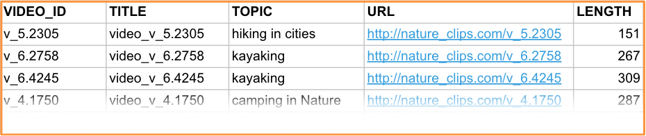

This table has no real sensitive information, unless joined with the other tables.

``` sql
SELECT * FROM ACTIVITY SAMPLE(20 ROWS);
```
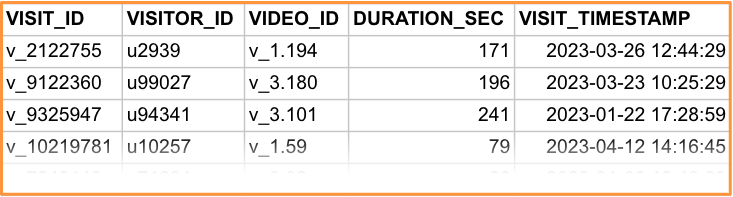

This table joins the unique visitors with the videos they viewed. The sensitive information here is the `VISITOR_ID` column that could be used to re-identify who watched a particular video.

### Create the Consumer data

We can now create the consumer data for Kayak Co.. Ensure that you are logged into the account that is the consumer account.

Open a new worksheet and copy the sql code from the setup script [kc_setup.sql](https://github.com/Snowflake-Labs/sfquickstarts/tree/master/site/sfguides/src/create_a_native_data_clean_room/assets/kc_setup.sql) and run this in the account. This will create a database, Kayak_co_db with a schema kayak_co_schema containing three tables:


``` sql
SELECT * FROM CUSTOMERS SAMPLE(20 ROWS);
```
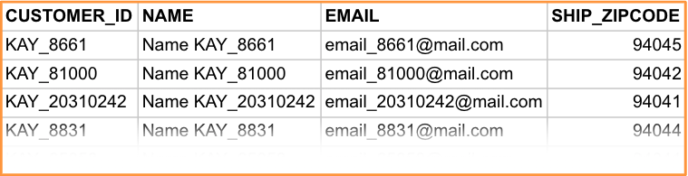

In this table Kayak Co. has the name and email address of customers, which is a sensitive piece of information.

``` sql
SELECT * FROM PRODUCTS SAMPLE(20 ROWS);
```
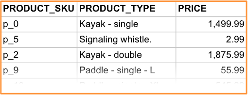

``` sql
SELECT * FROM PURCHASES SAMPLE(20 ROWS);
```
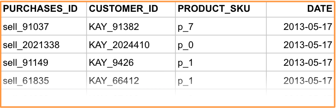

### The use case

While this data is synthetic and generated, it is generated to be able to show some of the core capabilities of a Data Clean Room. Both parties in this scenario have tables that contain identities (customers resp. visitors) and both have a joinable attribute email here. However, this attribute would be sensitive for either side to share or expose to the other, so one of the key capabilities of the Data Clean Room is to allow joins on these attributes without exposing the actual join keys to either side.

The actual overlap of emails in this data looks like this:

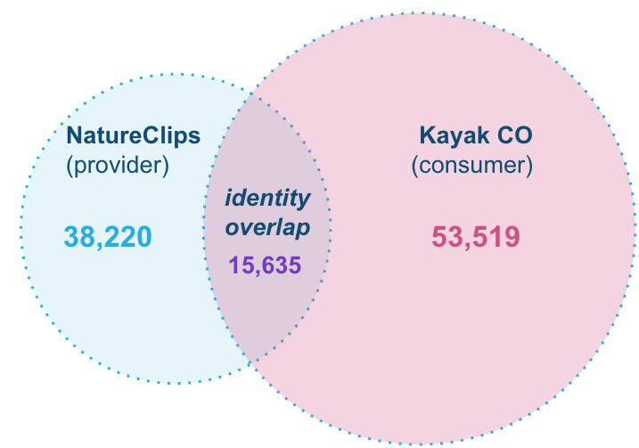

> aside positive
>
> Note that this is not known by either party before we join up the data in the Data Clean Room. It is just for illustrative purposes here - but the middle overlap is one of the outputs of this Data Clean Room.

<!-- ------------------------ -->
## Protecting the data
Duration: 15

We are not ready to stand up the Clean Room on the Provider side (NatureClips). We start by creating the policies that are used to protect the data. We will create two types of policies - Projection Constraints and Aggregation Constraints.

The Projection Constraint protects specific columns from being projected in the output of a SQL query, meaning that the column can be used for joins and constraints, but not viewed in the result of the query. For further considerations on how this protects individual data points please review the considerations and the further documentation.

In the Provider account, start by creating this policy:

``` sql
CREATE OR REPLACE PROJECTION POLICY nature_clips_dcr_projection_policy
AS () RETURNS PROJECTION_CONSTRAINT ->
	PROJECTION_CONSTRAINT(ALLOW=> FALSE);

-- Projection policy 'NATURE_CLIPS_DCR_PROJECTION_POLICY' is successfully created.
```

We should then also create the Aggregation Constraint policy, that prevents anything but aggregated results to to be outputted by queries that include tables that policy is applied to.

``` sql
CREATE OR REPLACE AGGREGATION POLICY nature_clips_dcr_aggregation_policy
AS () RETURNS AGGREGATION_CONSTRAINT ->
    AGGREGATION_CONSTRAINT(min_group_size=>100);

-- Aggregation policy 'NATURE_CLIPS_DCR_AGGREGATION_POLICY' is successfully created.
```

Note that we do not apply the policies at this point, that is something we will do through the Clean Room setup.

### Optional - test how the policies works

We can test the policies locally in order to understand how they will protect the data. In order to do so we can create a view where we apply them and run some test queries against this view.

Open a worksheet and select the `NATURE_CLIPS_DB` and `NATURE_CLIPS_SCHEMA` as context.

``` sql
USE DATABASE NATURE_CLIPS_DB;
USE SCHEMA NATURE_CLIPS_SCHEMA;

CREATE OR REPLACE VIEW VISITORS_PROTECTED AS
SELECT * FROM VISITORS;

SELECT * FROM VISITORS_PROTECTED;
-- Return 38,220 rows
-- VISITOR_ID | NAME | EMAIL | GENDER | ZIP_CODE | INTEREST
-- ...
```

Now we can apply the Projection Policy to this to protect the sensitive columns.

``` sql
ALTER TABLE VISITORS_PROTECTED MODIFY 
    COLUMN name SET PROJECTION POLICY nature_clips_dcr_projection_policy,
    COLUMN email SET PROJECTION POLICY nature_clips_dcr_projection_policy,
    COLUMN visitor_id SET PROJECTION POLICY nature_clips_dcr_projection_policy;

SELECT * FROM VISITORS_PROTECTED;
-- The following columns are restricted by a Projection Policy. Please remove them from the list of projected columns:
-- VISITOR_ID
-- NAME
-- EMAIL
```

So we can’t return these rows in the query output. If we instead try:

``` sql
SELECT * EXCLUDE (name, email, visitor_id) FROM VISITORS_PROTECTED;
-- Returns 38,220 rows
-- GENDER | ZIP_CODE | INTEREST
-- ...
```

Next step is to protect the individual rows with the Aggregation Constraint Policy.

``` sql
ALTER VIEW VISITORS_PROTECTED SET AGGREGATION POLICY nature_clips_dcr_aggregation_policy;

SELECT * EXCLUDE (name, email, visitor_id) FROM VISITORS_PROTECTED;
-- ​​Aggregation policy violation, please contact the policy admin for details.
```

We now get a warning trying to directly query the table. Let’s update that to an aggregation instead:

``` sql
SELECT count(*) AS count, * EXCLUDE (name, email, visitor_id) FROM VISITORS_PROTECTED GROUP BY ALL;
-- Returns 54 rows
-- COUNT | GENDER | ZIP_CODE | INTEREST
```

So the policies are now working in combination to protect the data.

Let’s clean up the view we just created for this test (but leave the policies intact).

``` sql
DROP VIEW VISITORS_PROTECTED;
```

<!-- ------------------------ -->
## Create the Data Clean Room
Duration: 10

From the setup scripts there should be a Warehouse created `NATURE_CLIPS_WH`, we can use this to set up and run the Clean Room.

Go to the menu of the Snowflake account and choose **Apps**, and then **Packages** tab. In there select **Create** > **Clean Room**.

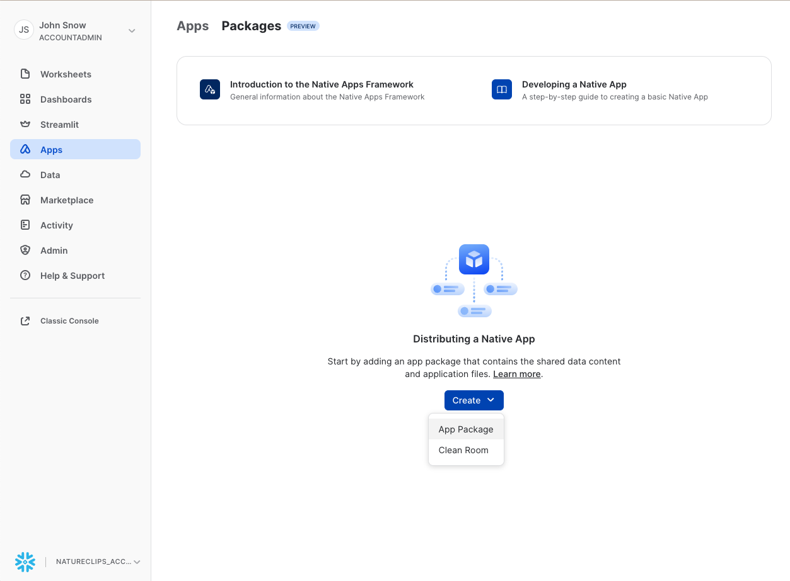

In the dialog we now want to include the tables from the nature_clips_schema. Click `+ Data objects` and then select all three tables, `VISITORS`, `VIDEOS`, `ACTIVITY`, in this schema.


Data Objects > Tables:
* `NATURE_CLIPS_DB.NATURE_CLIPS_SCHEMA.VISITORS`
* `NATURE_CLIPS_DB.NATURE_CLIPS_SCHEMA.VIDEOS`
* `NATURE_CLIPS_DB.NATURE_CLIPS_SCHEMA.ACTIVITY`

Also give the Clean Room a name and a title:
- Name: **DCR_NATURE_CLIPS**
- Display title: **Clean Room for Nature Clips visitor, video and activity data**

Also choose the Warehouse `NATURE_CLIPS_WH` we created earlier. Then click Create.

We should now see the overview of the Clean Room created.

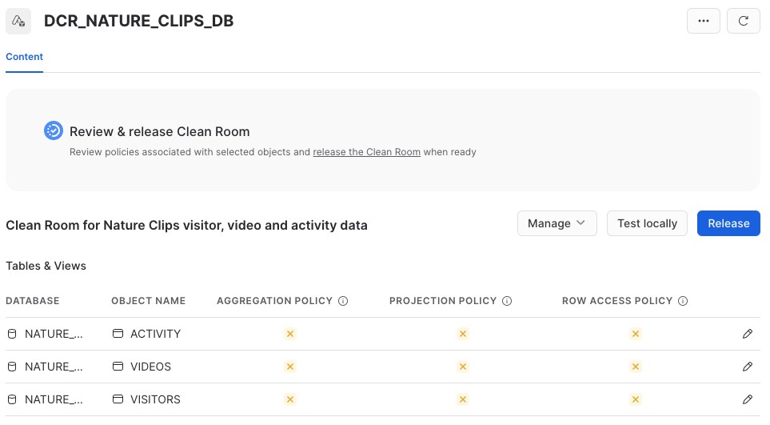

In this view we now see that there are no policies associated with the Clean Room - this means that the data included is shared as it is. Our next step is to protect the data using the policies we created earlier.

In the list of included tables, click the ❌ in the Projection Policy column for the table “VISITORS”. Select Import and choose Projection policy. 

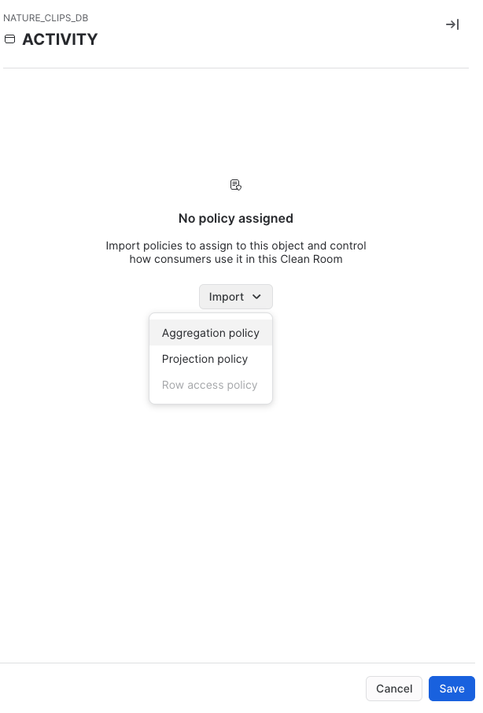

The policy we created earlier `nature_clips_dcr_projection_policy` should be available.

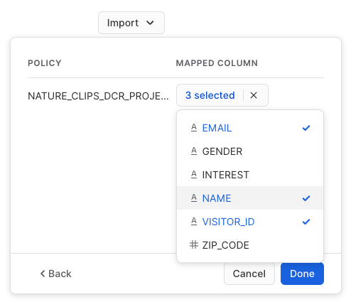

Choose:
* `EMAIL`
* `NAME`
* `VISITOR_ID`

As the columns to protect.

The column for Projection Policy for `VISITORS` table should now have a small ✔️ instead of a ❌. Now go ahead and apply the policy for the `ACTIVITY` tables also:

`ACTIVITY` table
* `VISITOR_ID`

With this, there is now no way to view these columns through a direct query result. 

We will also apply the aggregation policy to prevent individual rows from being viewed. Same way, click the [❌] in the Aggregation Policy column for ACTIVITY and VISITORS tables and choose the Projection Policy we created earlier and apply it to each table. When done it should look like this:

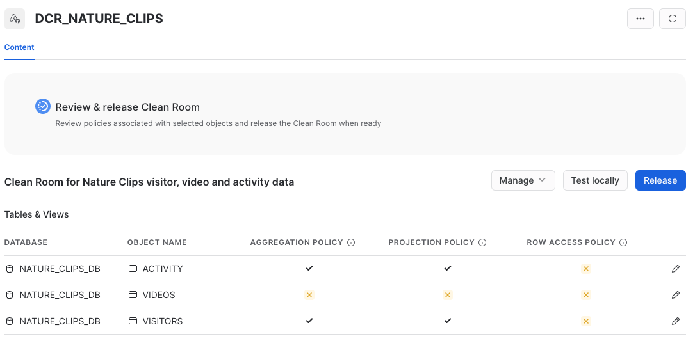

We can now test the Clean Room locally before publishing it. Click [**Test locally**] and you will see what the DCR package would look like on the consumer side. You should now see a new view that shows how the Clean Room would look in a consumer account:

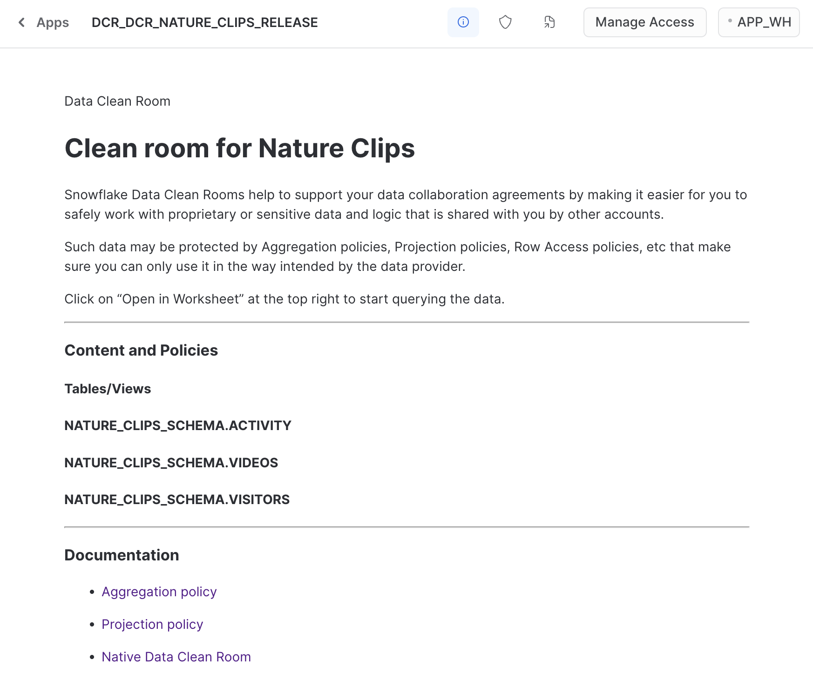

Notice how this is actually a packaged App in the same account, in the status Draft.

Now click the upper right hand corner icon for “Open in a worksheet”.
This should bring you to a new worksheet with a Database named `DCR_NATURE_CLIPS_DB_DRAFT` open. You can test that the data is available here by running a query like:

```sql
SELECT * FROM DCR_NATURE_CLIPS_DRAFT.NATURE_CLIPS_SCHEMA.VISITORS TOP 10;

-- Aggregation policy violation, please contact the policy admin for details.
```

This is as expected - the Aggregation Policy is doing its job. Change the query to return an aggregation:

``` sql
SELECT ZIP_CODE, count(*)
FROM DCR_NATURE_CLIPS_DRAFT.NATURE_CLIPS_SCHEMA.VISITORS
GROUP BY 1;

-- ZIP_CODE	COUNT(*)
-- 94041	4,256
-- 94042	4,255
-- 94043	4,253
...
```

We can also try aggregation on a protected column:

``` sql
SELECT EMAIL, count(*)
FROM DCR_NATURE_CLIPS_DRAFT.NATURE_CLIPS_SCHEMA.VISITORS
GROUP BY 1;

-- The following columns are restricted by a Projection Policy. Please remove them from the list of projected columns:
-- EMAIL
```

So we are not allowed to view the protected columns, but we can do aggregations and group by across the other columns.

<!-- ------------------------ -->
## Publish the Clean Room
Duration: 5

We are now ready to publish the Clean Room and get it ready for deployment. Go back to the Clean Room package view, and click Release at the top of view.

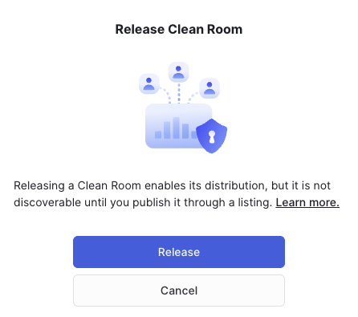

Once you click Release here, it will create the App package and then submit it for security scan. This normally takes a minute or two before the packaged app passes through the scan.

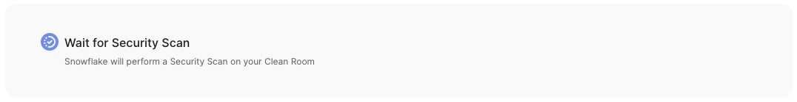

Once the scan is complete (you may have to reload the page to see the updated status), it is ready to be published to the Consumer

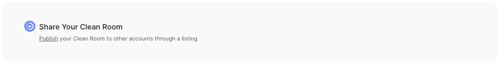

From here we move to the Provider Studio (**Main menu** > **Data** > **Provider Studio**).

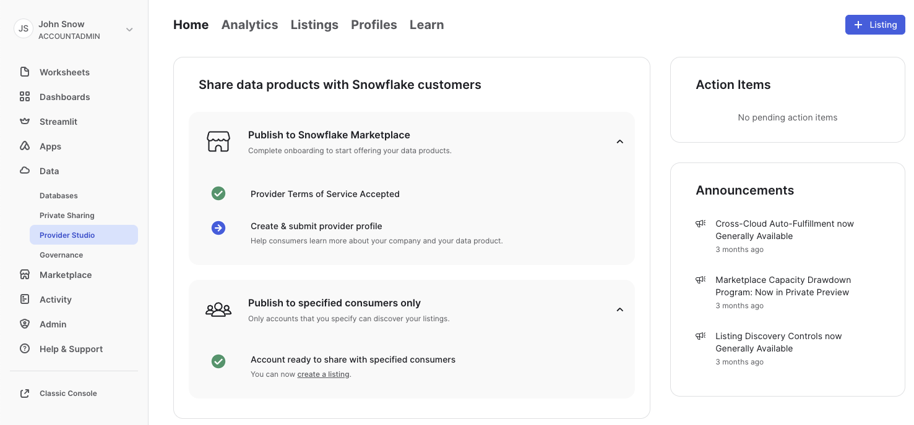

Click the **[+ Listing]** button at the top 

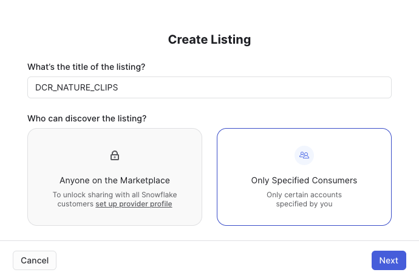

Enter the name `DCR_NATURE_CLIPS` for the title of the listing and choose **Only Specified Consumers**. Click [**Next**].

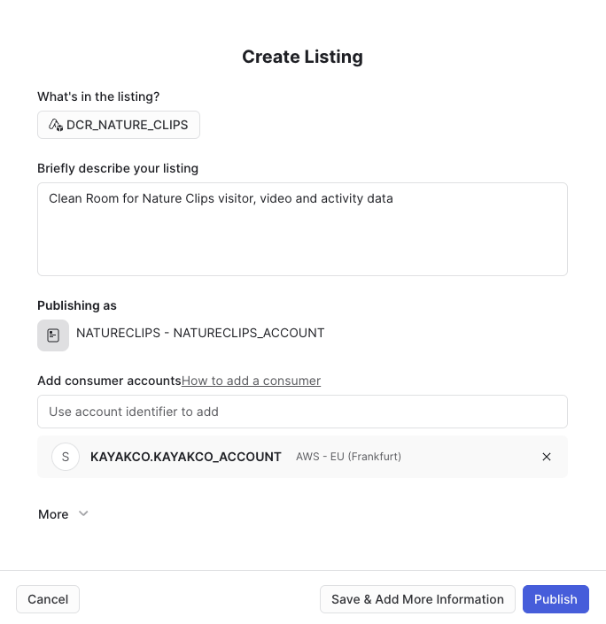

Fill in the following for the Listing:

**What’s in the listing?**
- Choose the App Package that you just created, it should be called `DCR_NATURE_CLIPS`

**Briefly describe your listing**
* `Clean Room for Nature Clips visitors, video and activity data`

**Add consumer accounts**
* Here you want to find the account identifier of the consumer account, the account we call `KAYAKCO.KAYAKCO_ACCOUNT` here. You can find it directly on the consumer account by clicking on the account name in the lower right corner, hovering over the active account and clicking the copy icon at the top right corner of the small view:

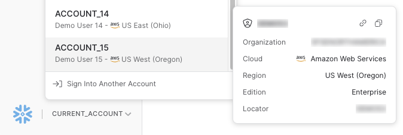

Once you click Publish here the Listing will be Live and directly become available to the selected consumer accounts (here, the `KAYAKCO.KAYAKCO_ACCOUNT`).


<!-- ------------------------ -->
## Connect to the DCR from the consumer
Duration: 2

Now it is time to connect to the data from the consumer account. Go to the consumer account and navigate to Apps in the menu of that account.

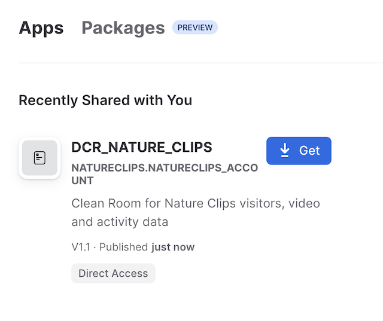

You should now see the new Listing that was shared with this account from the `NATURECLIPS_ACCOUNT`. Go ahead and click Get to install this App in the account.

In the dialog that appears, choose a Warehouse to use for the App. There should be a warehouse created from the setup step - `KAYAKCO_WH`. Click [**Get**] at the bottom.

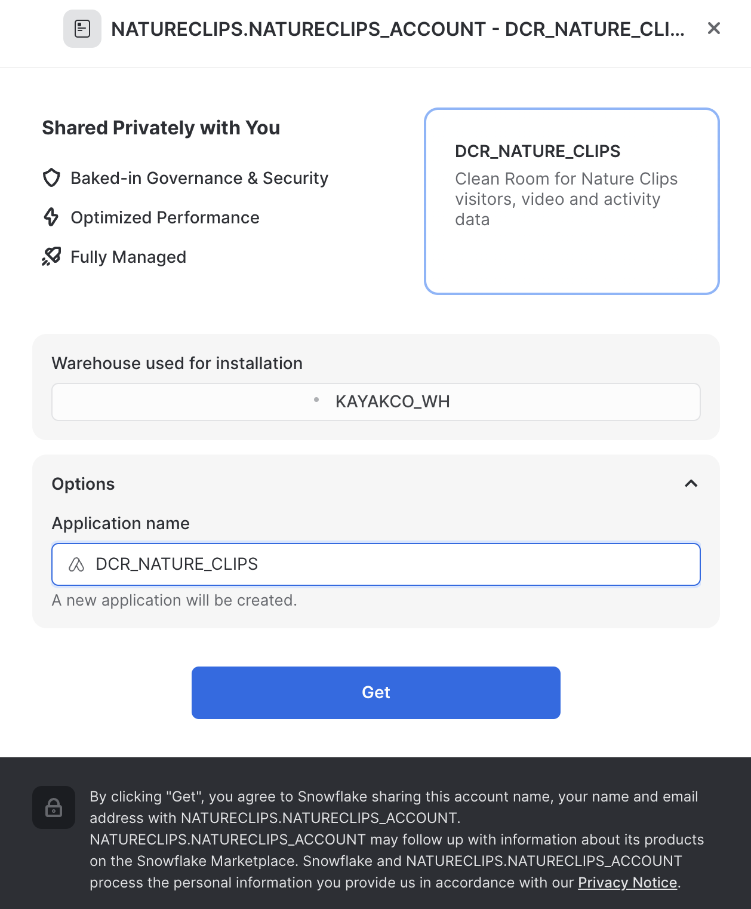

Once installed, you should now see a page similar to the one shown when testing the DCR locally on the Provider account.


<!-- ------------------------ -->
## Run the analysis
Duration: 10

Now we can run the joined analysis on the data, in the Consumer account. Open up a new Worksheet. There should now be an application in the list of Databases called `DCR_NATURE_CLIPS`. Choose this as the database context for the worksheet, and the `NATURE_CLIPS_SCHEMA` as the schema.

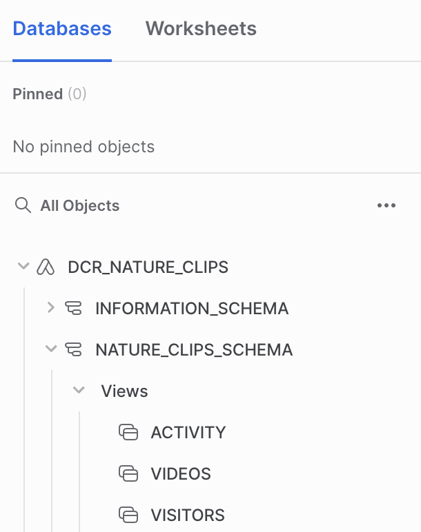

Start by exploring the data. Try to run a simple select against the VISITORS table:

``` sql
SELECT * FROM VISITORS;

-- The following columns are restricted by a Projection Policy. Please remove them from the list of projected columns:
 VISITOR_ID
 NAME
 EMAIL
```

Try excluding the protected columns:

``` sql
SELECT * EXCLUDE (name, email, visitor_id) FROM VISITORS;

-- Aggregation policy violation, please contact the policy admin for details.
```

Let’s aggregate the result also then:

``` sql
SELECT count(*) as count_visitors, * EXCLUDE (name, email, visitor_id)
FROM VISITORS
GROUP BY ALL;

-- Returns 52 rows (note that this may be a different number)
-- COUNT(*) | GENDER | ZIP_CODE | INTEREST
-- ...
```

So both the Projection and Aggregation Policies are here protecting the data, on the consumer side.

The first analysis we want to do on the data is to find the overlap of Visitors from Nature Clips with Customers from Kayak Co.. Let’s include and join the Kayak Co. table for Customer in the query.

``` sql
SELECT count(*)
FROM VISITORS v
INNER JOIN KAYAK_CO_DB.KAYAK_CO_SCHEMA.CUSTOMERS c ON c.email = v.email
GROUP BY ALL;

-- Returns 1 row
-- COUNT(*)
-- 12,043 (note that this may be a different number for the randomly generated customers)
```

Now we can break that down into specific categories, let’s include some of the characteristics from the Nature Clips view and from Kayak Co..

``` sql
SELECT count(*)
FROM VISITORS v
INNER JOIN KAYAK_CO_DB.KAYAK_CO_SCHEMA.CUSTOMERS c ON c.email = v.email
GROUP BY ALL;

-- Returns 52 rows
-- COUNT(*) | GENDER | ZIP_CODE | INTEREST | SHIP_ZIPCODE
-- ...
```

Not that this could contain 1 more row than when we only included the Nature Clips view. Included in this result is a group with COUNT(*) 356 and null for all the grouping columns. This is the Aggregation Constraint grouping up everything that would have ended up in too small groups otherwise, remember the Aggregation Constraint on the Publisher side was set to 100 minimum group sizes. So the reason here then is that there are 356 customers with a different Shipping zip code on the Kayak Co. site than the Zip code Nature Clips have registered for the same visitor. Note that the specific number may differ for you as the datasets are randomly generated.

We can also try to understand if there is a correlation between interests on the Nature Clips site and the types of products customers are buying.

``` sql
SELECT count(*), pr.product_type
FROM VISITORS v 
INNER JOIN KAYAK_CO_DB.KAYAK_CO_SCHEMA.CUSTOMERS c ON c.email = v.email
INNER JOIN KAYAK_CO_DB.KAYAK_CO_SCHEMA.PURCHASES pu ON pu.customer_id = c.customer_id
INNER JOIN KAYAK_CO_DB.KAYAK_CO_SCHEMA.PRODUCTS pr ON pr.product_sku = pu.product_sku
GROUP BY ALL
;

-- Returns 3 rows
-- COUNT(*) 	| PRODUCT_TYPE
-- 477		| Other
-- 264		| Kayak
-- 349		| Paddle
```

If we try to include other attributes here, we will very likely fall under the minimum grouping size, and only a single group will be returned here. You can try to include Gender in the query above, this should give you groups above the minimum size.


<!-- ------------------------ -->
## Cleaning up
Duration: 5

### Uninstall the consumer app

Clean up the Consumer account by going to Apps, and then find `DCR_NATURE_CLIPS` and click Uninstall in the `[...]` menu to the right of the name. Choose Uninstall, this will also remove the database `DCR_NATURE_CLIPS` that was created by the App.

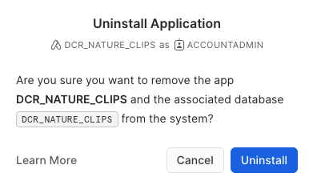

### Removing the consumer sample data

Open a worksheet and drop the database with the sample data.

``` sql
DROP DATABASE KAYAK_CO_DB;

-- KAYAK_CO_DB successfully dropped.
```

### Unpublish and delete the listing on the Provider account

The Listing in the Provider account can now be unpublished and then deleted. Go to the Publisher account, open **Main menu** > **Data** > **Provider Studio** from the menu.

In the Listings tab, find the `DCR_NATURE_CLIPS` listing and click on it. In the top right corner where it shows **Live**, click the button and choose **Unpublish**.

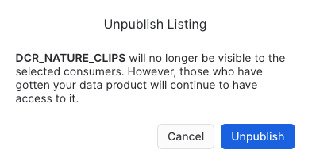

Here it notifies that the Listing will not be visible after you unpublish it, but consumers may still have access to the data product. It is only once we delete the listing that the share will be unavailable on the consumer side.

Continue to now delete the Listing. Click the trashcan button at the top right corner. Select Delete in the next dialog.

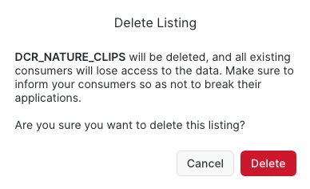

### Drop the clean room
Now go to the App package for the Clean room. Navigate to Apps > packages. Then select DCR_NATURE_CLIPS.

At the top, click the [**...**] button and select [**Drop**].

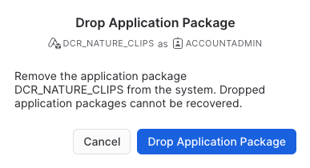

### Drop the databases
Finally we can drop the database for the sample data on the provider side also.

Open a worksheet and run:
``` sql
DROP DATABASE NATURE_CLIPS_DB;

-- NATURE_CLIPS_DB successfully dropped.
```
