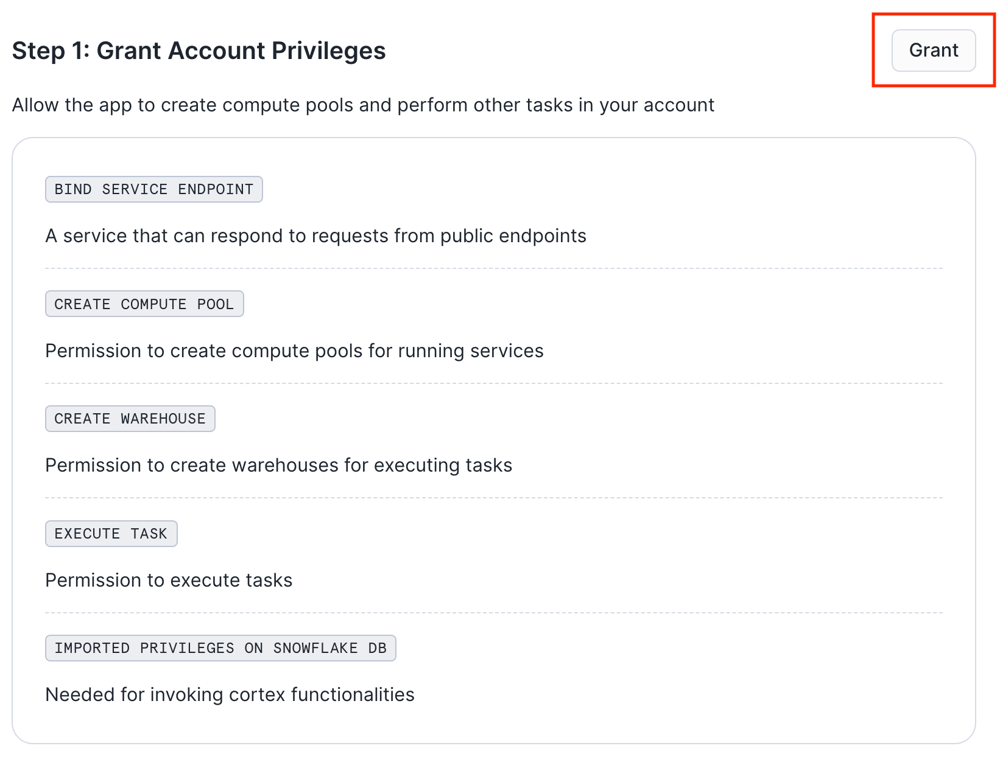
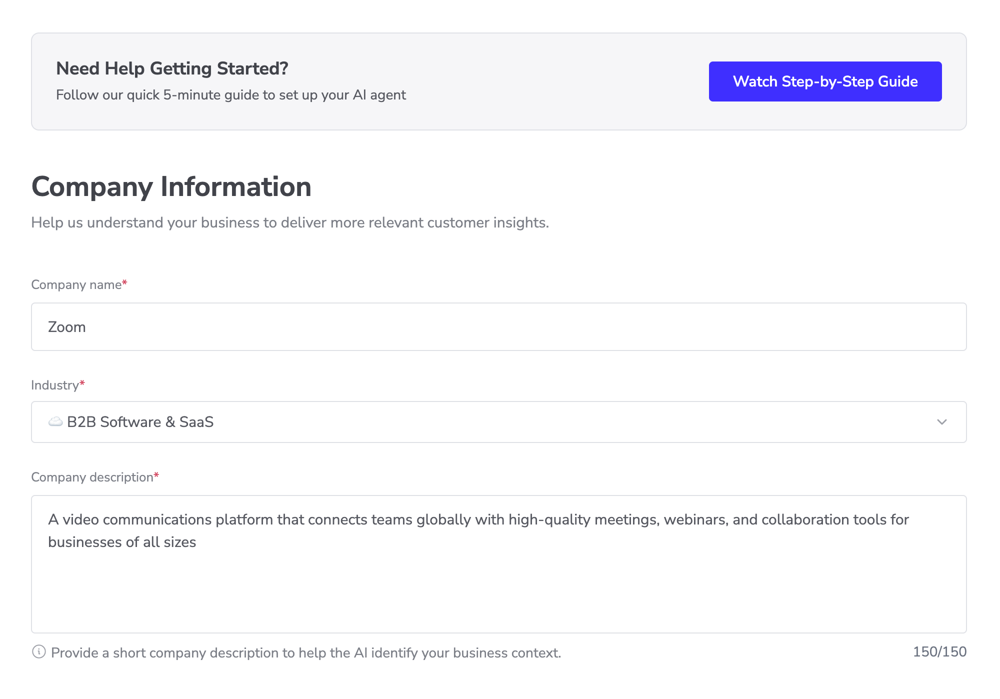
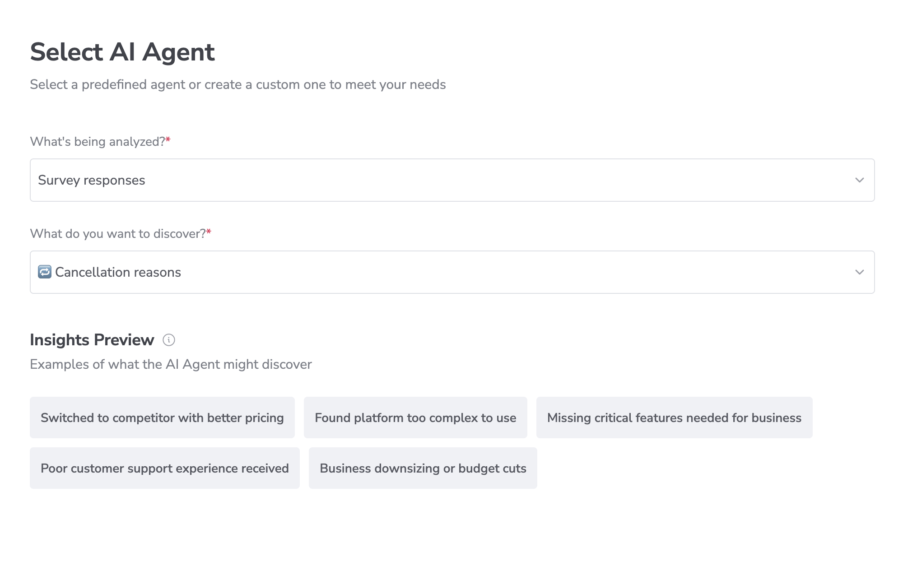
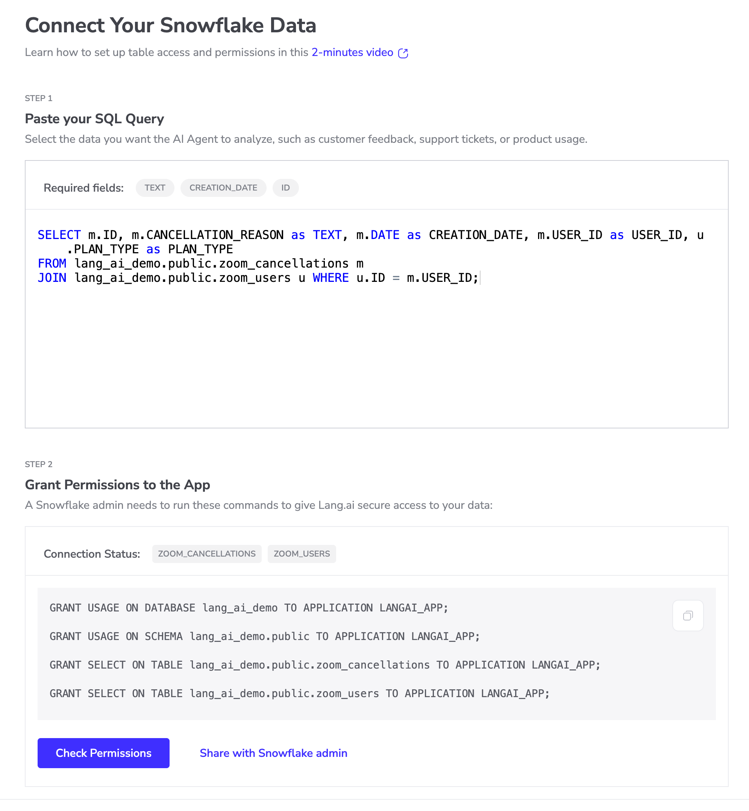
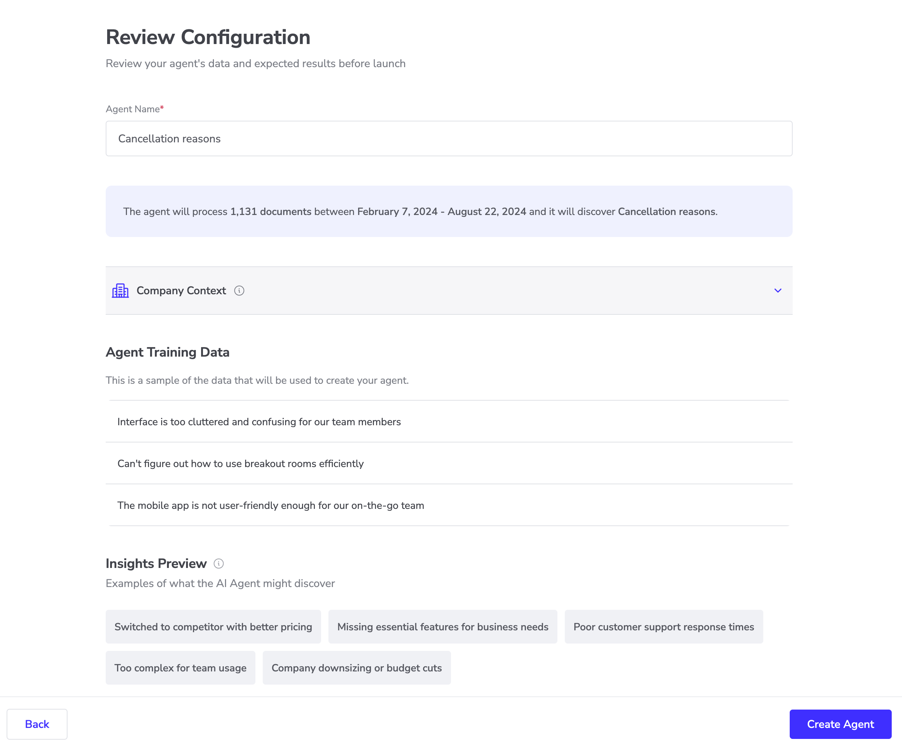

author: Lang.ai
id: create_ai_agents_on_snowflake_with_lang_ai
summary: Through this quickstart guide, you will set up an AI Agent running on Snowflake to set up recurring data analysis for your business teams.
categories: Getting-Started, Data-Science-&-Ai, Data-Science-&-Ml, partner-integrations 
environments: web
status: Published 
feedback link: https://github.com/Snowflake-Labs/sfguides/issues
tags: Getting Started, Data Science, Data Engineering, AI Agents 

# Create AI Agents on Snowflake with Lang.ai
<!-- ------------------------ -->
## Overview 
Duration: 1

Lang.ai Native Snowflake application provides AI agents for product managers that leverage your existing Snowflake data (unstructured and structured data) to serve meaningful product recommendations —with context— directly in Slack.

This quickstart is a guide to installing and running your first Lang AI agent for data analysis in your own Snowflake infrastructure.

### Prerequisites
- Being part of Lang.ai AI Agent Design Partner program
- Sharing with Lang.ai's Account Executive your Snowflake Account Identifier

### What You'll Learn
- Installing and setting up the Lang.ai Native Application
- Creating and running your first AI agent

### What You’ll Need 
- A Snowflake account with _ACCOUNTADMIN_ access to grant account level privileges, allow external connections and create a Snowflake View.

### What You’ll Build 
- A Snowflake AI Agent for data analysis

<!-- ------------------------ -->
## Creating a sample database
Duration: 5

In this step we will be creating a sample database and a sample view. We will be using this data in the following steps to create our first AI agent.

Sign in to your Snowflake account and create a new SQL Worksheet.

To start, copy the <button>[SQL Script](https://raw.githubusercontent.com/lang-ai/snowflake-app-samples/main/retention-agent-demo/setup.sql)</button> and paste it into the SQL Worksheet, then click on the **Run All** button to execute the script.

This script will:
- Create a Database called *zoom_cancellations* and populate it with demo data
- Create a Database called *zoom_users* and populate it with demo data
- Create a View called *zoom_cancellations_view* to connect the data from both tables

After the script has successfully executed, you will see a LANG_AI_DEMO database with the following tables and one view:

The view created by the script already includes the required fields to create AI agents:

> aside positive
> 
>- **id:** The id of the document (ticket, survey, etc.)
>- **text:** The unstructured text to be analyzed
>- **creation_date:** The date of creation of the unstructured text
>- **user_id:** The id of the user that generated the unstructured text

In this example, we are creating a simple view with the fields _id_, _text_, _creation_date_, _user_id_, and _Customer_Spend_. 

The last column _Customer_Spend_ is not mandatory, but it is included as we will configure the agent to use it to group the insights by the customer monthly spending. 

You may include additional columns that may be used by the AI agent to aggregate the insights generated. 

<!-- ------------------------ -->
## Installing the application
Duration: 5

Log in to Snowsight as an ACCOUNTADMIN and follow these steps to install the Lang.ai Native App:

### 1. Install the application

Go to _Data Products > Private Sharing > Shared With You_ and click on _Get_ to install the app.

Once installed, click on the name of the application to open the app.

### 2. Grant privileges

Click Grant to grant the application the necessary privileges:

#### Account-level Privileges

- The **BIND SERVICE ENDPOINT** privilege enables the services in the app to connect to each other.
- The **CREATE WAREHOUSE** and **CREATE COMPUTE POOL** are required by the Lang.ai Native App to create and manage resources for performing service operations.

#### External Connections Privileges

- **OpenAI:** Provide an API token from your OpenAI organization. [Learn how to get an API token](https://help.openai.com/en/articles/4936850-where-do-i-find-my-openai-api-key). 
- **Slack:** Allow connections to the slack.com domain for sending AI Agent insights to your selected Slack channels.

#### Objects Privileges

- **View**: Select the view we created in the previous step. We will be using this data to create the AI Agent.

### 3. Launch the app
Click *Activate* to activate the application.

Navigate back to the *Data Products > Apps* page and wait for the spinner in the INSTALLED column to stop running. When it’s done you’ll see “1 minute ago” in that column. Then click _Launch App_ to start the application.

<!-- ------------------------ -->
## Creating Your First AI Agent
Duration: 5

Learn to run your fist AI agent on top of Snowflake data.

### Select Your Goal
Begin by selecting the goal you want to achieve with your AI agent.

### Select Your AI Agent
Choose the AI agent that aligns with your goal. Once selected, you will be prompted to choose the attributes that will be used to segment the insights. For example, selecting "subscription plan" will ensure insights are generated with this in mind, helping the AI agent identify patterns relevant to your business objectives.

### Connect to Slack
The final step is to connect your AI agent to a Slack channel. This will enable the AI agent to send new insights directly to the selected Slack channel, keeping you informed in real-time.

After you've successfully created and run an agent, the system will automatically send the insigths to the Slack channel you specified during setup.

### Run Your AI Agent for the First Time
After completing the setup and creating your first agent, you're ready to run it for the first time.

To manually run your agent, click on **Run Agent**. The demo data has comments from July 2024, so make sure to select the entire month.

## Reviewing the Insights of Your AI Agent
Duration: 5

Review the insights of the AI agent you just created.

### Navigate Your Agent Insights
Once the agent has finished processing, click on **View Run** to see the generated insights. In the insights view, you can navigate through the data by sorting and searching.

### Review the Data Associated with the Insights

To view the unstructured text that was analyzed to generate an insight, simply click on the specific insight.

Additionally, you have the option to download the data from your active filters by clicking on **Download CSV**.

<!-- ------------------------ -->
## Conclusion And Resources
Duration: 1

By following this guide, you have successfully set up an AI Agent running on Snowflake to automate your data analysis tasks.

### Related Resources
- [Lang.ai Documentation](https://help.lang.ai/en/articles/9584876-setting-up-the-snowflake-native-app)
- [Creating AI Agents in Lang.ai](https://help.lang.ai/en/articles/9641461-creating-your-first-ai-agent)

### What You Learned
- How to set up the Lang.ai Snowflake Native App
- How to create and configure an AI Agent in Lang.ai