author: Michael Gardner
id: create_eureka_moments_with_data_world
summary: This guide will help you connect Snowflake to data.world, where you can join, query, and share your data
categories: Getting-Started
environments: web
status: Published
feedback link: https://github.com/Snowflake-Labs/sfguides/issues
tags: Getting Started, Data Catalog

# Create Eureka Moments with data.world and Snowflake

<!-- ------------------------ -->

## Overview

Duration: 1

At data.world we offer organizations and teams private, secure environments in which they can collaborate together. By bringing in data from Snowflake, you can further extend your data using data.world features, and connecting to open datasets.

data.world supports the largest open data community in the world, where we’re excited to connect members with a vast collection of scientific research, government, and demographic data, as well as other members who are interested in similar data work so they can join forces to solve real problems faster.


### What You’ll Learn

* How to set up a connection to Snowflake in data.world
* How to access your Snowflake data in data.world
* How to extend your data with open datasets and other data available on data.world

### What You’ll Need

* A free data.world account
* A trial Snowflake Account with ACCOUNTADMIN access

We will walk through both data.world and Snowflake account creation in the next steps.

### What You’ll Build

* A data.world dataset and project, with live data from Snowflake

<!-- ------------------------ -->

## Create Your data.world Account

Duration: 2

To create a free data.world account, do the following:

1. Click [this link](https://data.world/login/) and then click `Join now` below the login section.
    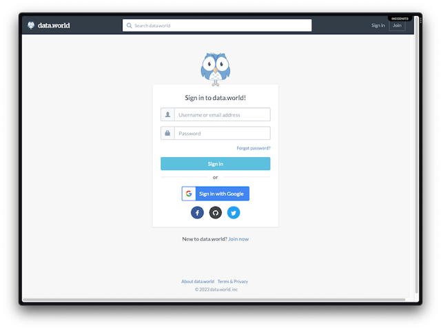
2. Enter your email, name, username, and password then click `Continue`.
   * Alternatively, you can create an account by linking to your Google, Facebook, GitHub, or Twitter account on the bottom of the sign-up popup modal.
      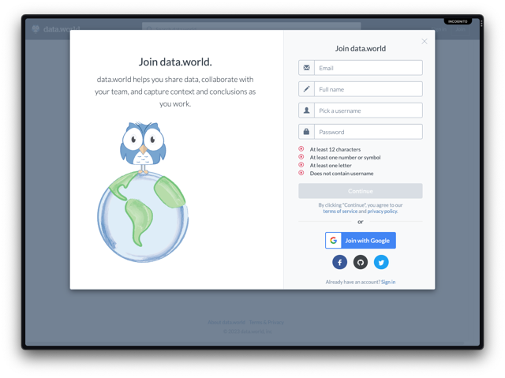
3. You will then be redirected to your data.world landing page.
4. Check your email for a verification email from data.world In the email, click the `Verify email` button, or copy and paste the unique link into your browser to verify your email address and complete your account creation.
    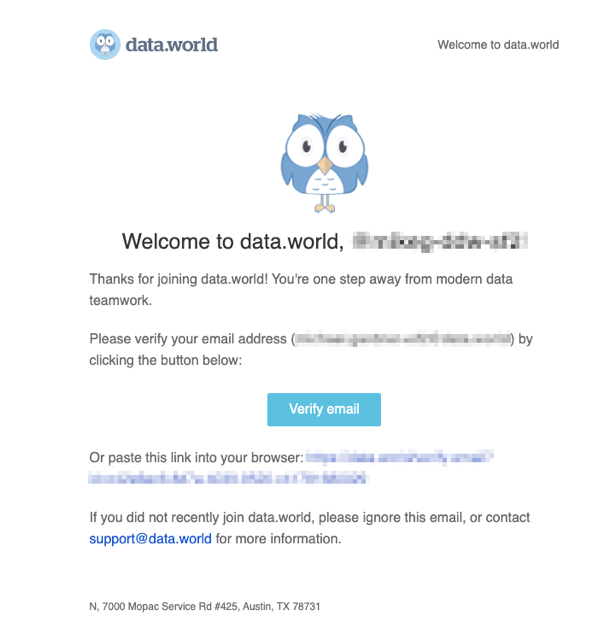

On the data.world landing page, you will find some helpful resources. In addition to links to the getting started guide and documentation, you can complete the `Getting started` checklist, find and follow trusted data providers, or explore the introduction tutorials. Feel free to explore these now, or move on to the next step in this quickstart.
 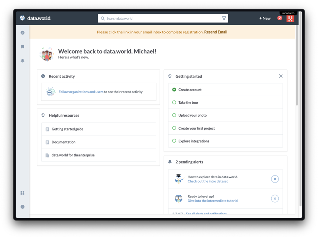

<!-- ------------------------ -->

## Create Your Snowflake Trial Account

Duration: 3

To create a Snowflake trial account, do the following:


1. Click [this link](https://signup.snowflake.com).
2. Enter your first name, last name, email, company, role, and country. Click `Continue`.
    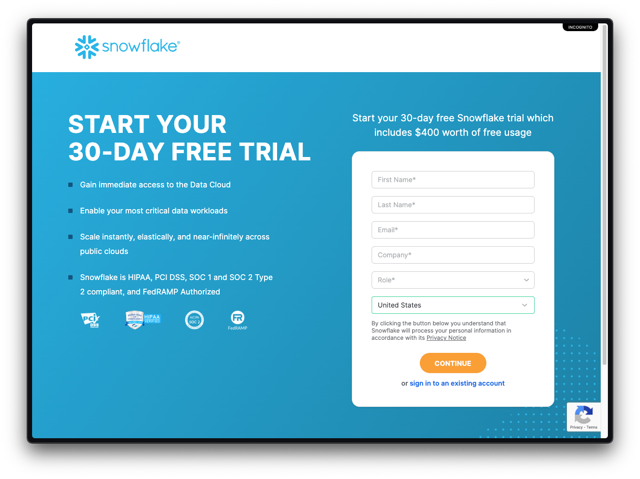
3. Choose a Snowflake account version (Enterprise recommended) and a cloud provider.
4. Check the box to agree to the terms, and click `Get Started`.
    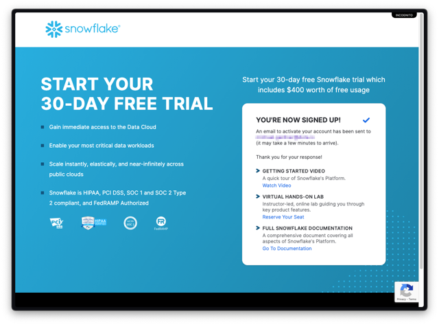
5. Check your email for a verification email from Snowflake, and in the email click the `Click To Activate` button.
    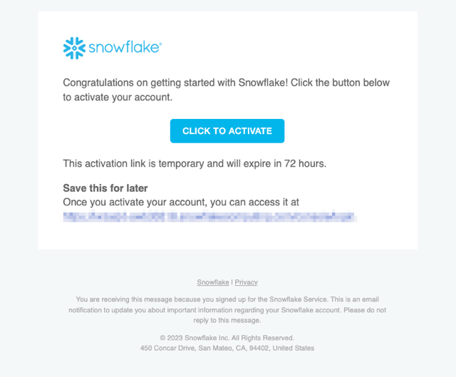
6. Create a new password, and then login to your Snowflake account.

Your Snowflake account is now ready to go!

<!-- ------------------------ -->

## Connect to data.world via Partner Connect

Duration: 3

With your data.world and Snowflake accounts set up, you are now ready to connect Snowflake to data.world. In this step, you will activate the data.world partner conenction, and create a dataset in data.world where that connection can be accessed.


1. In Snowflake, expand the `Admin` menu on the left sidebar.
2. Choose `Partner Connect`.
    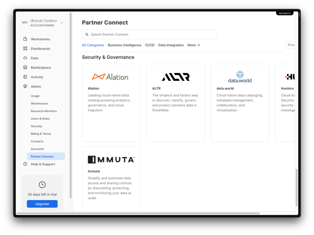
3. Scroll down to the `Security & Governance` section, and select the `data.world` tile.
   * Alternatively you can search for "data.world" and then click the tile.
4. Click the `Connect` button.
   * When you click `Connect`, the data.world partner database, warehouse, user, and role will be created in your Snowflake instance. 
    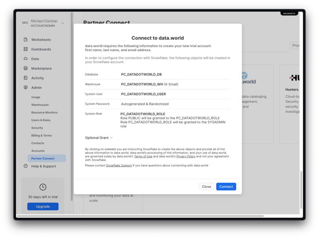
5. Once the partner account is created, click `Activate`.
   * You are redirected to data.world. If you are in a new session, you may be prompted to login to your data.world account.
   * The data.world partner Snowflake connection is automatically created.
    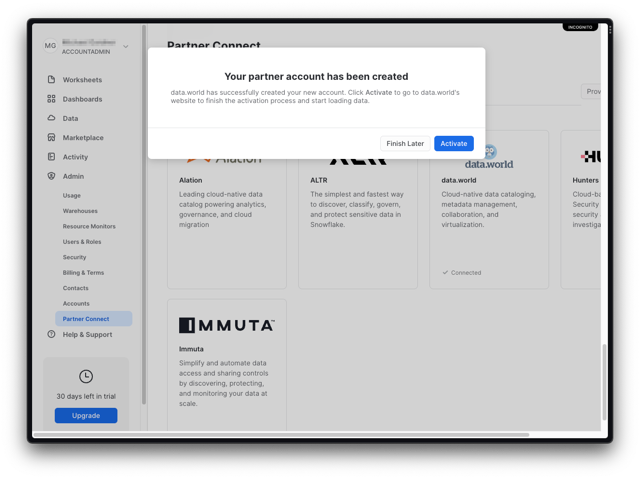

Your data.world partner account has been created, and connected to your data.world account. Congratulations!
 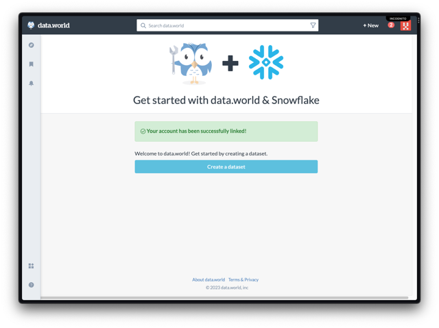

<!-- ------------------------ -->

## Create a Dataset and Add Data

Duration: 3

Now that you have successfully connected Snowflake to data.world, it's time to create a dataset, where you will be able to interact with your data.


1. Click `Create a dataset`.
    
2. Give the dataset a name, like "Snowflake Quickstart", then click `Create Dataset`.
    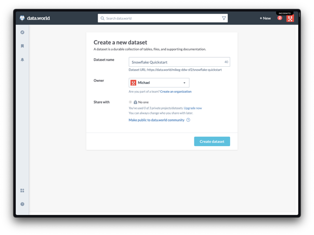
3. Click `Add data`.
    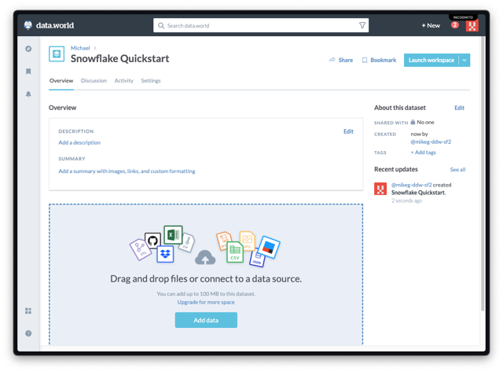
4. Click the Snowflake tile under `My Integrations`.
    * This tile is the connection that was automatically created when you clicked `Activate` in the previous step.
    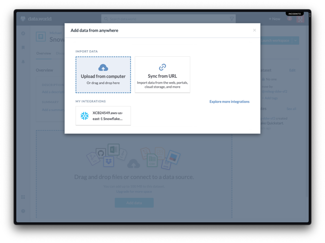
5. Click `Use live table`.
    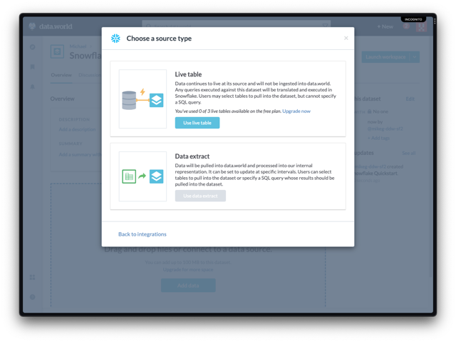
6. Select the following schema:
   * TPCDS_SF10TCL
    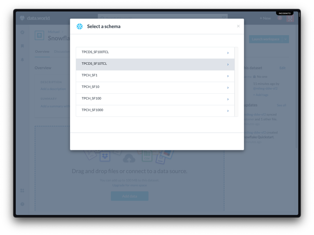
7. Select the following tables:
   * CUSTOMER
   * CUSTOMER_ADDESS
8. Click `Import 2 tables`
    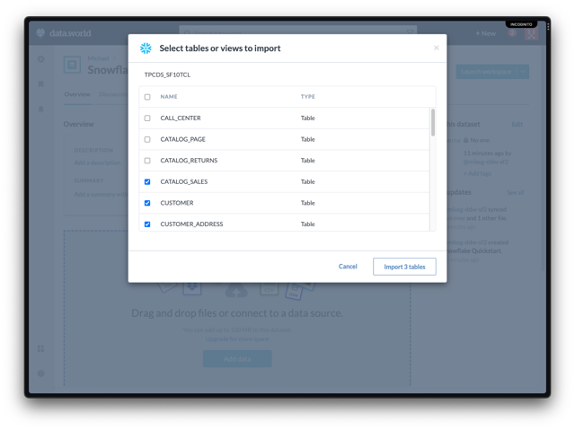
9. Click `Got it`
    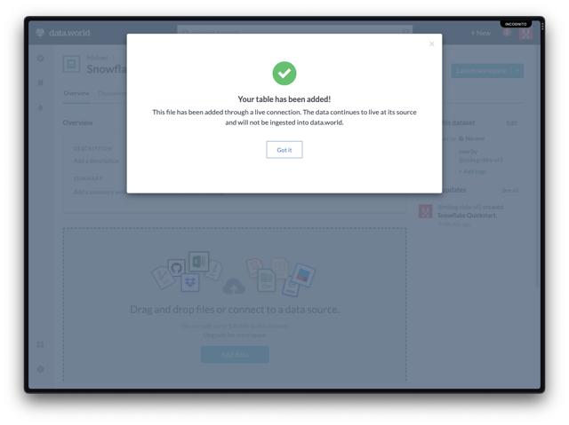

<!-- ------------------------ -->

## Interact With Your Data

Duration: 5

After you add the tables to your dataset, it will take a few moments for data.world to index the columns. Once the tables have completed processing, you will see a live preview of the first 5 rows of each table. Now is time to write some queries. In this step, you'll create a new data.world project, where you can link datasets, run queries, and save results.


1. In the dataset, click `Launch workspace`.
    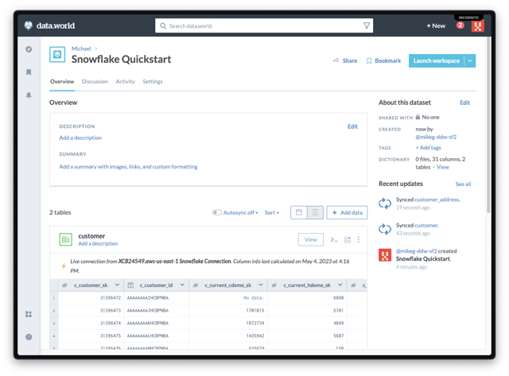
2. Click on `Untitled Project` in the header.
    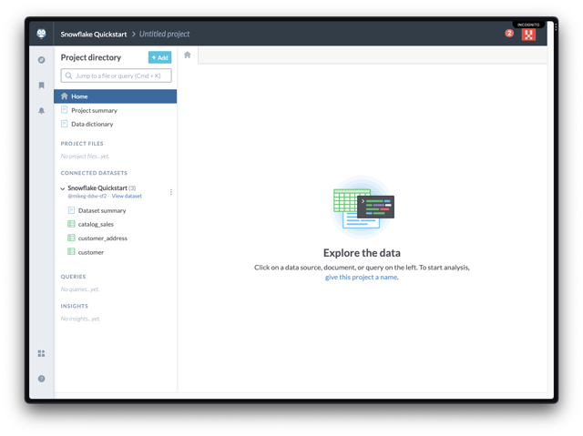
3. Give the project a name, like "Snowflake Quickstart Project" and click `Create`.
    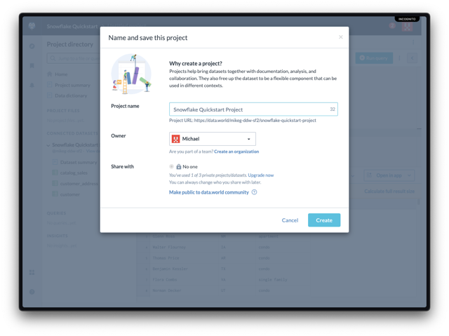
4. Click `+ Add` and choose `SQL Query`.
    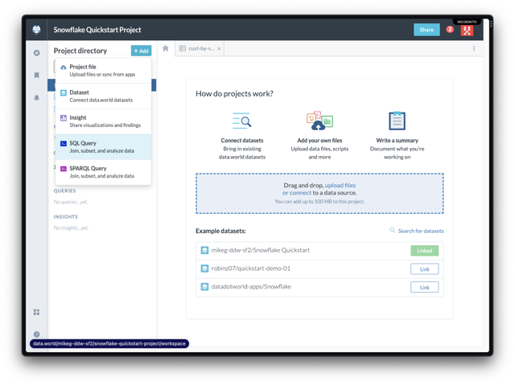
5. Paste the following query into the editor.
    * This query returns the count of customers by state, separated by dwelling type.
```
select
  a.ca_state AS state,
  a.ca_location_type AS location_type,
  COUNT(c.c_customer_sk) AS customer_count
from customer c
join customer_address a
  on customer.c_current_addr_sk = a.ca_address_sk
group by ca_state, ca_location_type
```  
6. Click `Run query`.
7. Admire your query results!
    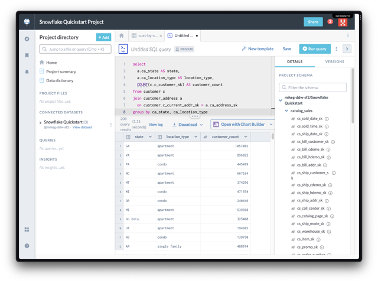
8. Save your query to the project by clicking `Save`, and give the query a name, like "cust-by-state-type" and then click `Save`.
    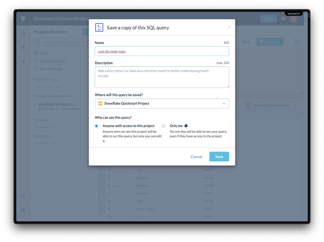

<!-- ------------------------ -->

## Save Query Results and Extend Your Data

Duration: 3

So far, you've created a query against data that you already have access to in Snowflake. In this example, we will extend your data using built-in features of data.world.


1. Click on the query created in the previous step to view the query results.
2. Click `Download` and select `Save to dataset or project`.
    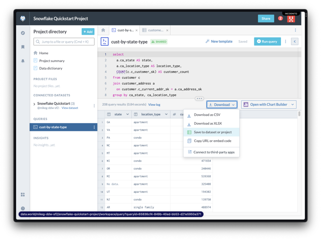
3. Give the file a name, like "cust-by-state-type", and click `Save`.
    * The name may be already populated, if you saved the query in the previous step.
    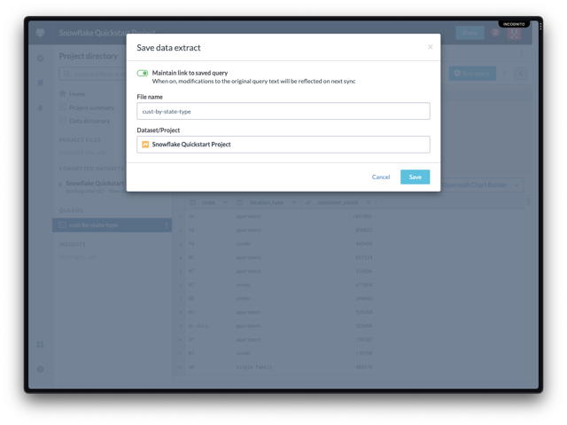
4. In the `Project Files` section on the left sidebar, you will find your new file. Click on it to open it in the workspace.
5. You will notice that the `state` column has a green triangle on the corner. This indicates that data.world has detected that the data contained in the column matches known contextual data.
    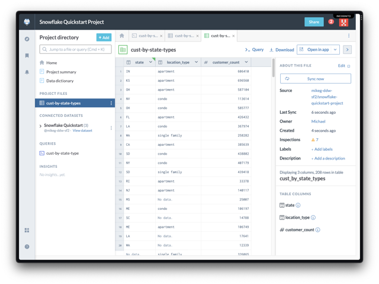
6. Click the green triangle, and select `Match this column`.
    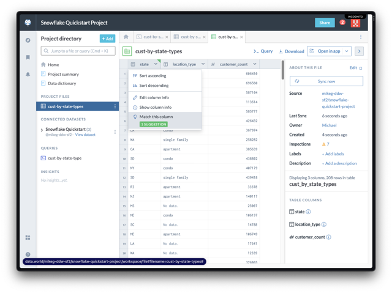
7. data.world has matched the `state` column to the US States or Territories. Click `Add matched column` to add it to the table.
    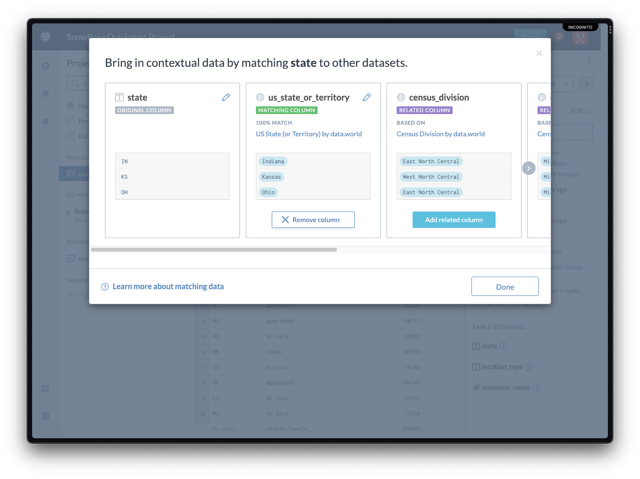
8. After adding the matched column, you can add more related columns. Scroll to the left, and click `Add related column` under `census_region`, then click `Done`.
    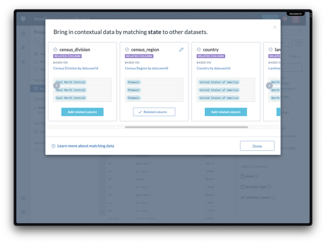

You now have a report that can be aggregated from State to Region, without having necessarily contained that information in your base data.
 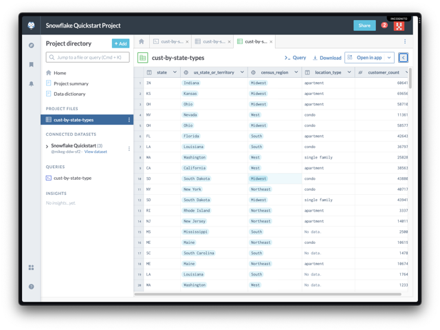

<!-- ------------------------ -->

## Create an Insight

Duration: 3

To lead the rest of your team the Eureka moments you discover through the data, you can create insights on your projects. Insights are a space where you can embed content via markdown, have discussions, and collaborate with your team members.


 1. With your report open in the workspace, click `Open in app`.
     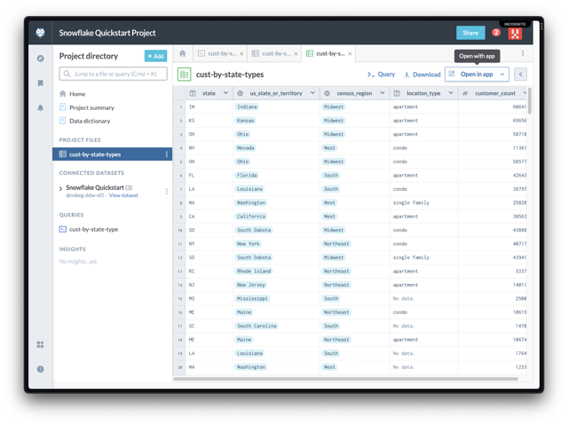
 2. Select `Chart Builder`.
     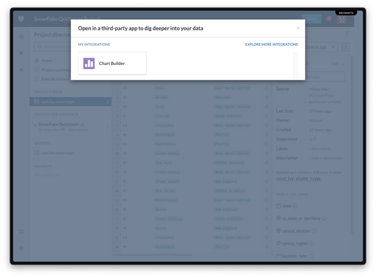
 3. On the next screen, click `data.world Community`.
     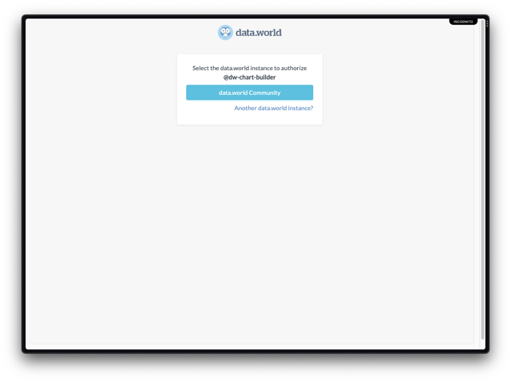
 4. To complete authorization of the Chart Builder integration, click `Authorize Chart Builder(by data.world)`.
     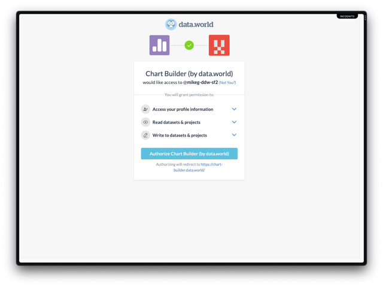
 5. In Chart Builder, next to `X`, click `Select a field...` and choose `census_region`.
     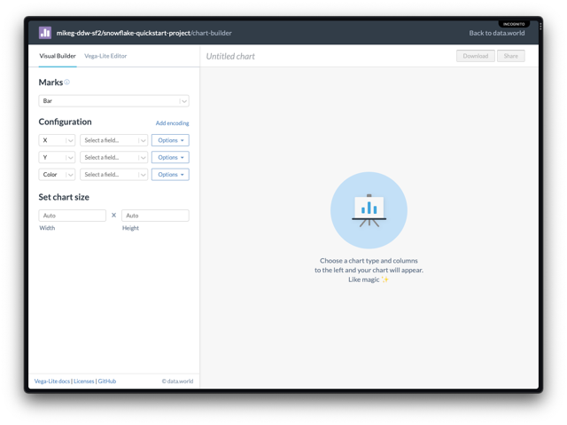
 6. Next to `Y`, click `Select a field...` and choose `customer_count`.
 7. Next to `Color`, click `Select a field...` and choose `census_region`.
 8. Set the chart size `Width` to 500, and the `Height` to 330.
     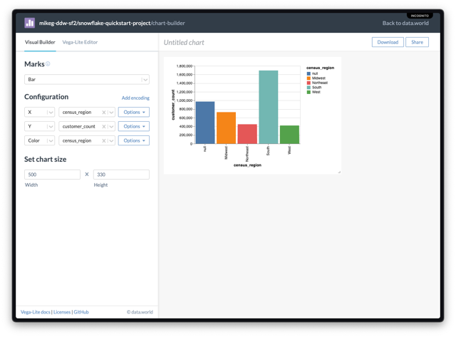
 9. Click `Share` in the upper righthand corner, and select `Insight`.
     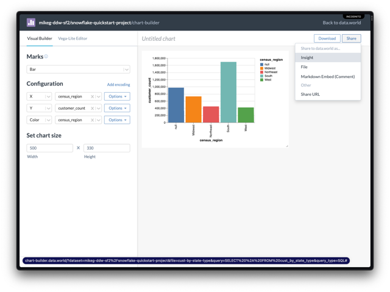
10. Enter a title, like "Customer Count by Region" and click `Save`.
     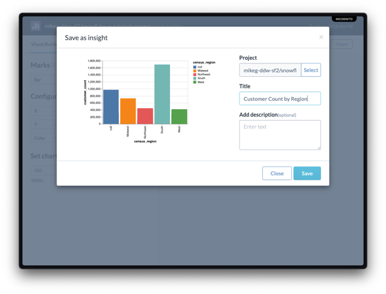
11. In the green success header, click `Open in new tab` to view your insight in your project.
     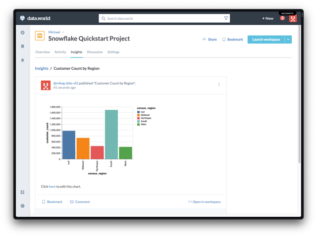

<!-- ------------------------ -->

## Conclusion

Duration: 1

Blim Blam!! You've seen how you can use data.world and Snowflake together to create Eureka insights for you and your team. This is just a small sample of what you can do in data.world. You can also join your data to other open dataset hosted on data.world by organizations around the world, import data from files such as CSV, JSON, Excel, or XML. And so much more!

### Continue exploring data.world

* [data.world Quickstart Guides](https://docs.data.world/en/98378-base-platform-quickstart.html)
* [data.world Documentation](https://docs.data.world/?lang=en)
* Complete the [New User Check List](https://data.world/).
* Dive into the [An Intro to data.world](https://data.world/jonloyens/an-intro-to-dataworld-dataset) dataset.
* Want to level up? Check out the [Intermediate Tutorial](https://data.world/jonloyens/intermediate-data-world).
* [Upgrade your account](https://data.world/settings/billing) to get more tables/datasets/projects/storage.
* See what else data.world can do! [Schedule a demo with a data.world representative](https://data.world/product/schedule-a-demo/).