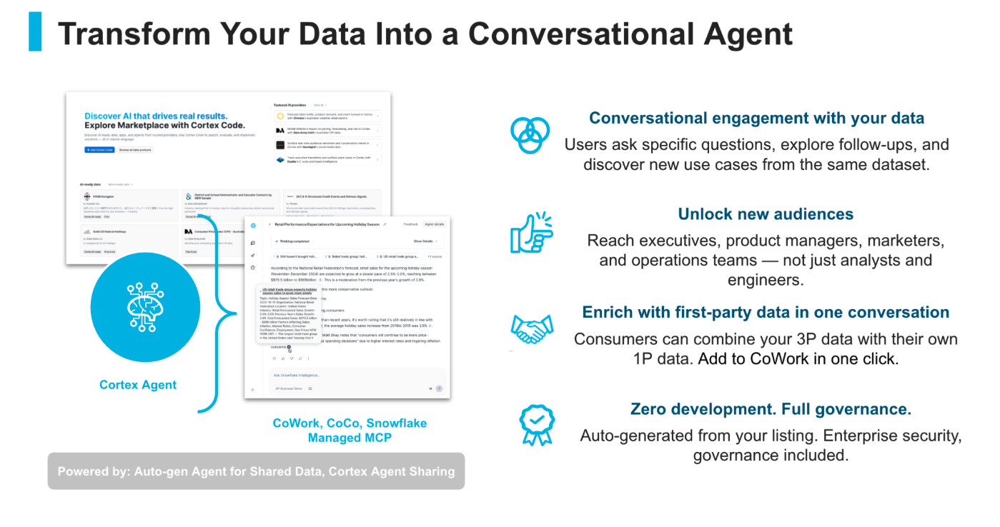
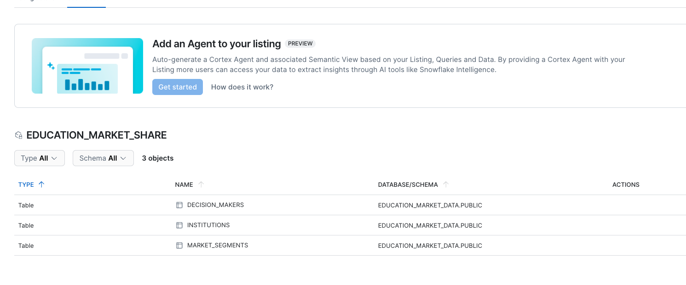
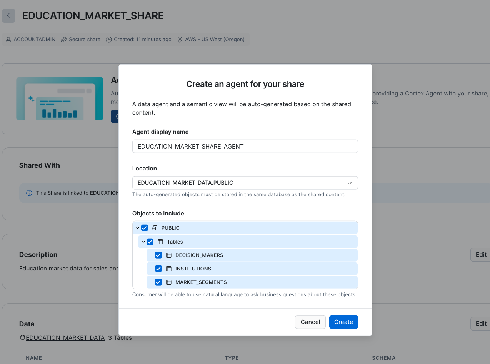
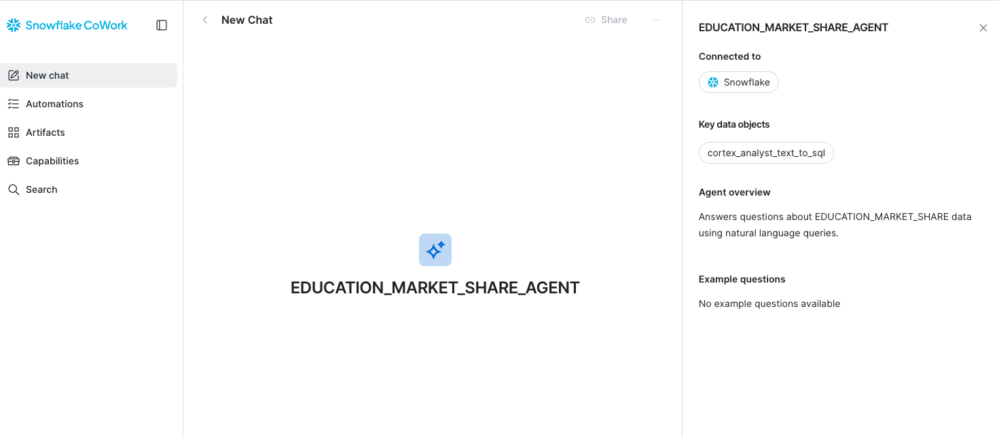
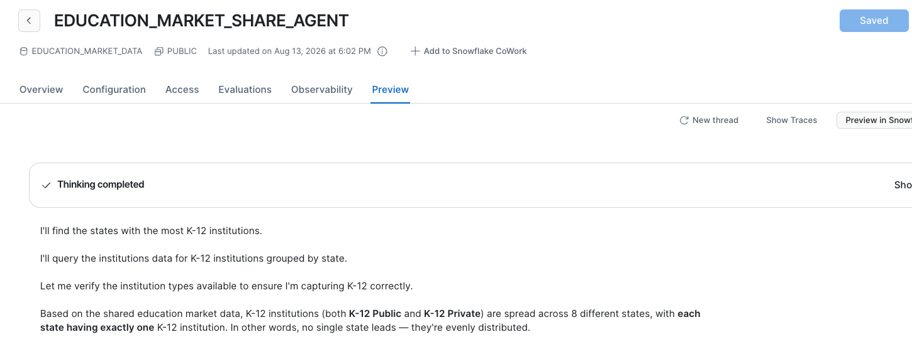
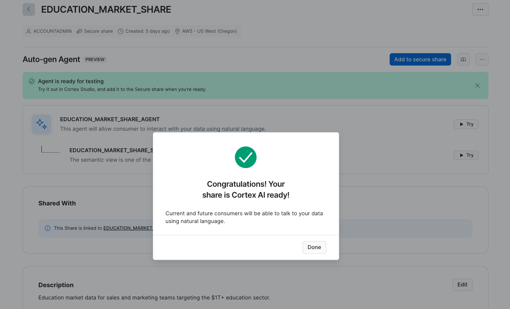

author: Elizabeth Christensen
id: creating-cortex-agents-for-marketplace-data-providers
categories: snowflake-site:taxonomy/solution-center/certification/quickstart, snowflake-site:taxonomy/product/ai, snowflake-site:taxonomy/product/platform, snowflake-site:taxonomy/snowflake-feature/ingestion/conversational-assistants, snowflake-site:taxonomy/snowflake-feature/cortex-llm-functions
language: en
summary: Make your Marketplace data share AI-ready by auto-generating a Cortex Agent that lets consumers explore your data with natural language.
environments: web
status: Published
feedback link: https://github.com/Snowflake-Labs/sfguides/issues


# Transform Your Shared Data Into a Conversational Agent

## Overview



Two features work together to make your shared data conversational:

| Feature | What it does | When to use it |
|---------|-------------|----------------|
| Auto-gen Agents for Shared Data | Automatically generates a Semantic View + Cortex Agent from your existing share — no modeling required | You have a data share or listing and want to add AI in one click |
| Cortex Agent Sharing | Packages and distributes a Cortex Agent you've already built alongside your data | You already have a Cortex Agent and want to share it with consumers |

These two features often work together: auto-gen creates the agent, then Cortex Agent Sharing delivers it. You can also use them independently. Zero development. Full governance. Auto-generated from your listing. Enterprise security included. Consumers run it on their own warehouse — no compute cost to you.

The result: users ask specific questions, explore follow-ups, and discover new use cases from the same dataset — in natural language, no SQL required. This unlocks your data for executives, product managers, marketers, and operations teams, not just analysts and engineers.

### What You'll Learn
- How to auto-generate a Cortex Agent from a data share or Marketplace listing
- How to test, refine, and publish the agent so consumers get it automatically
- How to share a manually built Cortex Agent via SQL
- What the consumer experience looks like after you publish

### What You'll Build
- An optional sample education market dataset with a share
- An auto-generated Cortex Agent attached to the share
- An AI-ready listing that consumers can query conversationally

### What You'll Need
- A [Snowflake account](https://signup.snowflake.com/) with access to Cortex Agents and Semantic Views (trial accounts work)
- ACCOUNTADMIN role (or a role with CREATE SEMANTIC VIEW, CREATE AGENT, and CREATE SHARE privileges)
- An existing data share, Marketplace listing, or Internal Marketplace listing with tables/views attached (or use the [sample data](#sample-data-for-testing) in the appendix)

<!-- ------------------------ -->

## Before You Start

### Required privileges for auto-gen

| Privilege | Object | Why |
|-----------|--------|-----|
| CORTEX_USER | Database | Enables LLM calls for semantic view generation (granted to PUBLIC by default) |
| CREATE SEMANTIC VIEW | Schema | Creates the semantic view |
| CREATE AGENT | Schema | Creates the Cortex Agent |
| SELECT | Tables/Views in share | Required during generation only |
| USAGE | Database + Schema | Access to target location |

### Required privileges for publishing

When you add objects to a share, the following grants are made automatically:

```sql
GRANT USAGE ON AGENT ... TO SHARE
GRANT SELECT ON SEMANTIC VIEW ... TO SHARE
GRANT REFERENCES ON SEMANTIC VIEW ... TO SHARE
```

You also need OWNERSHIP on the share, and OWNERSHIP or MODIFY on the listing (if using a listing).

### Safe testing before you go live

- **Nothing goes live unless you submit for approval.** Draft listings, shares, and agents are invisible to consumers until you explicitly publish.
- **Direct share = easiest to test.** The auto-gen wizard works on direct shares via **Data Sharing > External Sharing**. No listing, no approval flow.
- **Internal Marketplace listings are safe** — visible only within your organization's accounts.
- **You cannot share to your own account**, but the auto-gen banner still appears on direct shares for testing.

If you want to walk through using a sample shared dataset, see the [sample data appendix](#sample-data-for-testing) for setup SQL.

<!-- ------------------------ -->

## Path A: Auto-Generate an Agent

Instead of manually building a semantic view and agent, Snowflake can auto-generate both from your share metadata in one click.

Choose your starting point:

### Option 1 — Snowflake Marketplace listing

1. Sign in to Snowsight.
2. Go to **Marketplace > Provider Studio**.
3. On the **Listings** tab, select the public listing you want to configure.
4. On the **Secure share** tab, click **Get started** in the "Add an Agent to your listing" banner.

> The listing must have an attached share and all required fields filled in, or the **Get started** button is disabled.

### Option 2 — Internal Marketplace listing

1. Sign in to Snowsight.
2. Go to **Data sharing > Internal sharing**.
3. Select the listing you want to configure.
4. On the **Secure share** tab, click **Get started** in the "Add an Agent to your listing" banner.

### Option 3 — Direct share (no listing required)

1. Sign in to Snowsight.
2. Go to **Data sharing > External sharing**.
3. On the **Shared by your account** tab, select your share.
4. Click **Get started** in the "Add an Agent to your share" banner.



### Configuration dialog (same for all three)

| Field | What to enter |
|-------|---------------|
| Agent Display Name | What consumers see (defaults to listing title for listings) |
| Location | Target schema — must be in the same database as your shared data |
| Tables/Views | Select which tables/views to include. You control what the agent can access. |

Click **Create**.



Generation takes up to 10 minutes. Snowflake will:

1. Retrieve metadata from your share + listing description
2. Run Semantic View Autopilot to detect relationships, metrics, and dimensions
3. Generate a Cortex Agent with context-aware instructions

**What gets created:**

- A **Semantic View** with auto-detected:
  - Metrics from numeric columns (e.g., budgets, counts, rates)
  - Dimensions from categorical columns (e.g., types, states, names)
  - Relationships between tables (via foreign key patterns)
- A **Cortex Agent** with instructions derived from your table structure and listing metadata

### Verify with SQL

```sql
-- Verify the agent was created
SHOW AGENTS IN SCHEMA my_database.my_schema;

-- Verify the semantic view was created
SHOW SEMANTIC VIEWS IN SCHEMA my_database.my_schema;
```

### Limitations to know before you start

- **Exclusive generation:** Cannot use auto-gen if the share already has agents, semantic views, or Cortex Search Services attached
- **Object location:** Generated objects must live in the same database as the shared content
- **Regeneration overwrites:** Regenerating drops the existing agent + semantic view — manual edits are lost
- **Generation time:** Up to 10 minutes for complex schemas

<!-- ------------------------ -->

## Test and Refine

After generation, you'll see a 7-step setup wizard. Auto-gen pre-completes several steps:

| Step | Status | What to do |
|------|--------|------------|
| 1. Semantic View | Done | Review/edit under **AI & ML > Cortex Analyst > Semantic Views** |
| 2. Cortex Search Service | Optional | Add only if your share includes unstructured data alongside tables |
| 3. Core Instructions | Auto-generated | Review the persona; edit to add domain-specific behavior |
| 4. Create an Eval | Manual | Add 3-5 test questions representing common use cases |
| 5. Run Eval | Manual | Execute; review SQL + responses; refine if accuracy is low |
| 6. Grant User Access | Manual | Select roles that should interact with the agent |
| 7. Connect to CoWork | Manual | Toggle on to make the agent available in Snowflake CoWork |



### Test in the playground

Click **Try** in the Agent section to open Cortex Studio. Sample questions:

- "What was the average sales volume last month?"
- "Which states have the most institutions?"
- "Who are the CTOs at universities with technology budgets over $100M?"

Review the generated SQL and response for accuracy.



### Tips for a better auto-generated agent

- Use descriptive column names before running auto-gen (`TECHNOLOGY_SPEND` not `TECH_SP`)
- Add table and column comments to source tables before generating
- Write a detailed listing description — the auto-generator uses it to craft the agent's persona
- Add verified queries (example question/SQL pairs) to improve accuracy on common questions
- Use **Regenerate agent** after major schema changes — this replaces all existing objects

<!-- ------------------------ -->

## Share Your Agent

### Attach the agent to the share

1. Navigate to the **Secure share** tab of your listing, or the share details page for a direct share.
2. In the **Agent** section, click **Add to secure share**.
3. Review the confirmation dialog and click **Add**.

This automatically runs:
```sql
GRANT USAGE ON AGENT <agent_name> TO SHARE <share_name>;
GRANT SELECT, REFERENCES ON SEMANTIC VIEW <sv_name> TO SHARE <share_name>;
```

After this, updates you make to the agent or semantic view flow to consumers automatically — no re-publish needed.

> **Consumer auto-notification:** When you attach an agent to a share that already has consumers installed, those consumers receive an email notification to try out the agent.



### Distribution options

| Goal | How |
|------|-----|
| Share with specific accounts | Direct share via External Sharing (no listing needed) |
| Share within your organization | Internal Marketplace listing |
| Reach the full Snowflake ecosystem | Snowflake Marketplace listing via Provider Studio |

For Marketplace listings, add the **"Cortex AI ready"** category to your listing to help consumers find it. Public listings require Snowflake approval before going live.

**Replication:** Listing auto-fulfillment replicates agents to other regions automatically — consumers in different regions access the same agent without additional setup.

<!-- ------------------------ -->

## Path B: Share a Cortex Agent You Built Manually

If you already have a Cortex Agent, you can share it directly — no auto-gen wizard required.

### Requirements

- All linked objects must be in the same database as the agent
- Only agents using semantic views, Cortex Search Services, and functions can be shared
- Agents using procedures, skills, or MCP connectors cannot be shared
- A SQL table function can be shared, but a Python user-defined table function cannot

### Via SQL

```sql
-- Minimum: agent only
GRANT USAGE ON AGENT my_agent TO SHARE my_share;

-- If agent uses linked objects, grant each one explicitly:
GRANT USAGE ON AGENT my_agent TO SHARE my_share;
GRANT SELECT, REFERENCES ON SEMANTIC VIEW my_sv TO SHARE my_share;
GRANT USAGE ON CORTEX SEARCH SERVICE my_css TO SHARE my_share;
GRANT USAGE ON FUNCTION my_function TO SHARE my_share;
```

If you later add new tools to a shared agent, you must grant those new tools to the share manually — they are not added automatically.

### Identify shared agents

Go to **AI & ML > Agents**. The **Source** column shows **Local** or **Shared** for each agent.

<!-- ------------------------ -->

## What Consumers Experience

One click, no SQL, no setup — regardless of distribution path.

### Snowflake Marketplace
1. **Marketplace > Snowflake Marketplace** — find the Cortex AI-ready listing
2. **Get** > **Open** > select the Agent name

### Internal Marketplace
1. **Catalog > Internal Marketplace** — find the listing
2. **Open** > select the Agent name

### Direct / private share
1. **Data sharing > External sharing** > **Shared with you** tab
2. **Get** the share > **Open** > select the agent name

### Adding to CoWork

When getting any listing, keep the **"Add to Snowflake CoWork"** toggle on. The agent appears immediately as a data source in CoWork. Consumers can also combine your shared data with their own first-party data in a single conversation.

### Cost

- Consumers are billed for their own token usage and warehouse compute
- Providers do not incur compute costs for consumer queries
- Consumers can configure a custom warehouse under **AI & ML > Agents > [shared agent] > More options (…) > Configure warehouses for tools**

<!-- ------------------------ -->

## Sample Data for Testing

### Step 1: Create the database and tables

```sql
CREATE DATABASE EDUCATION_MARKET_DATA;
CREATE SCHEMA EDUCATION_MARKET_DATA.PUBLIC;

-- Education institutions
CREATE TABLE EDUCATION_MARKET_DATA.PUBLIC.INSTITUTIONS (
    INSTITUTION_ID INT,
    NAME VARCHAR,
    INSTITUTION_TYPE VARCHAR,  -- 'K-12 Public', 'K-12 Private', 'University', 'Community College'
    STATE VARCHAR(2),
    CITY VARCHAR,
    ENROLLMENT INT,
    ANNUAL_BUDGET DECIMAL(14,2),
    TECHNOLOGY_SPEND DECIMAL(12,2),
    DISTRICT VARCHAR,
    YEAR_FOUNDED INT
);

-- Decision makers at institutions
CREATE TABLE EDUCATION_MARKET_DATA.PUBLIC.DECISION_MAKERS (
    CONTACT_ID INT,
    INSTITUTION_ID INT,
    FIRST_NAME VARCHAR,
    LAST_NAME VARCHAR,
    TITLE VARCHAR,
    DEPARTMENT VARCHAR,
    VERIFIED_DATE DATE
);

-- Market segments
CREATE TABLE EDUCATION_MARKET_DATA.PUBLIC.MARKET_SEGMENTS (
    SEGMENT_ID INT,
    SEGMENT_NAME VARCHAR,
    TOTAL_ADDRESSABLE_MARKET DECIMAL(14,2),
    GROWTH_RATE_PCT DECIMAL(5,2),
    NUM_INSTITUTIONS INT,
    AVG_DEAL_SIZE DECIMAL(12,2)
);
```

### Step 2: Insert sample data

```sql
-- Sample institutions
INSERT INTO EDUCATION_MARKET_DATA.PUBLIC.INSTITUTIONS VALUES
(1, 'Springfield High School', 'K-12 Public', 'IL', 'Springfield', 2400, 28000000, 1200000, 'Springfield USD', 1952),
(2, 'Oakridge Academy', 'K-12 Private', 'CA', 'Palo Alto', 850, 15000000, 2100000, NULL, 1988),
(3, 'State University of New York', 'University', 'NY', 'Albany', 45000, 980000000, 52000000, NULL, 1844),
(4, 'Mesa Community College', 'Community College', 'AZ', 'Mesa', 18000, 120000000, 8500000, 'Maricopa CCD', 1965),
(5, 'Lincoln Elementary', 'K-12 Public', 'TX', 'Austin', 600, 8500000, 450000, 'Austin ISD', 1971),
(6, 'MIT', 'University', 'MA', 'Cambridge', 11500, 4900000000, 285000000, NULL, 1861),
(7, 'Riverdale Prep', 'K-12 Private', 'NY', 'Bronx', 1100, 42000000, 3800000, NULL, 1907),
(8, 'Houston Community College', 'Community College', 'TX', 'Houston', 55000, 290000000, 19000000, 'HCC System', 1971),
(9, 'Jefferson Middle School', 'K-12 Public', 'VA', 'Arlington', 1200, 18000000, 980000, 'Arlington County PS', 1963),
(10, 'Stanford University', 'University', 'CA', 'Stanford', 17000, 7200000000, 410000000, NULL, 1885),
(11, 'Greenfield High', 'K-12 Public', 'WI', 'Greenfield', 1800, 22000000, 1100000, 'Greenfield SD', 1958),
(12, 'Lake Shore Academy', 'K-12 Private', 'MI', 'Detroit', 650, 12000000, 1800000, NULL, 1995),
(13, 'Portland Community College', 'Community College', 'OR', 'Portland', 28000, 180000000, 12000000, 'PCC District', 1961),
(14, 'University of Texas at Austin', 'University', 'TX', 'Austin', 52000, 3800000000, 195000000, NULL, 1883),
(15, 'Westside Elementary', 'K-12 Public', 'CO', 'Denver', 500, 7200000, 380000, 'Denver PS', 1975);

-- Sample decision makers
INSERT INTO EDUCATION_MARKET_DATA.PUBLIC.DECISION_MAKERS VALUES
(1, 3, 'Sarah', 'Chen', 'Chief Technology Officer', 'IT', '2024-08-15'),
(2, 6, 'Michael', 'Torres', 'VP of Information Systems', 'IT', '2024-11-02'),
(3, 1, 'David', 'Williams', 'Superintendent', 'Administration', '2024-06-20'),
(4, 8, 'Jennifer', 'Martinez', 'CIO', 'IT', '2024-09-10'),
(5, 10, 'Robert', 'Kim', 'Dean of Technology', 'IT', '2024-12-01'),
(6, 4, 'Lisa', 'Johnson', 'Director of IT', 'IT', '2024-07-15'),
(7, 14, 'James', 'Patel', 'CTO', 'IT', '2025-01-05'),
(8, 2, 'Amanda', 'Wright', 'Head of School', 'Administration', '2024-10-22'),
(9, 7, 'Christopher', 'Lee', 'Director of Technology', 'IT', '2024-08-30'),
(10, 13, 'Nicole', 'Garcia', 'VP of Academic Technology', 'Academic Affairs', '2024-11-18');

-- Market segments
INSERT INTO EDUCATION_MARKET_DATA.PUBLIC.MARKET_SEGMENTS VALUES
(1, 'K-12 Public EdTech', 420000000000, 8.5, 98000, 125000),
(2, 'K-12 Private EdTech', 85000000000, 12.1, 34000, 210000),
(3, 'Higher Education IT', 380000000000, 6.8, 4000, 2500000),
(4, 'Community College Tech', 95000000000, 9.2, 1200, 850000),
(5, 'Education Cybersecurity', 28000000000, 18.5, 136200, 75000);
```

### Step 3: Create the share

```sql
CREATE SHARE EDUCATION_MARKET_SHARE
  COMMENT = 'Education market data for teams targeting the $1T+ education sector.';

GRANT USAGE ON DATABASE EDUCATION_MARKET_DATA TO SHARE EDUCATION_MARKET_SHARE;
GRANT USAGE ON SCHEMA EDUCATION_MARKET_DATA.PUBLIC TO SHARE EDUCATION_MARKET_SHARE;
GRANT SELECT ON ALL TABLES IN SCHEMA EDUCATION_MARKET_DATA.PUBLIC TO SHARE EDUCATION_MARKET_SHARE;

-- Verify
SHOW SHARES LIKE 'EDUCATION_MARKET_SHARE';
DESCRIBE SHARE EDUCATION_MARKET_SHARE;
```

Now go to **Data sharing > External sharing**, find `EDUCATION_MARKET_SHARE`, and click **Get started**.

<!-- ------------------------ -->

## Cleanup

```sql
-- Check what was generated
SHOW AGENTS IN SCHEMA EDUCATION_MARKET_DATA.PUBLIC;
SHOW SEMANTIC VIEWS IN SCHEMA EDUCATION_MARKET_DATA.PUBLIC;

-- Drop generated objects (replace with actual names from above)
-- DROP AGENT IF EXISTS EDUCATION_MARKET_DATA.PUBLIC.<agent_name>;
-- DROP SEMANTIC VIEW IF EXISTS EDUCATION_MARKET_DATA.PUBLIC.<sv_name>;

-- Drop share and database
DROP SHARE IF EXISTS EDUCATION_MARKET_SHARE;
DROP DATABASE IF EXISTS EDUCATION_MARKET_DATA;
```

<!-- ------------------------ -->

## Conclusion And Resources

You've learned how to make your shared data AI-ready — from creating a share to auto-generating an agent to publishing it for consumers, plus how to share a manually built agent via SQL.

### What You Learned
- How to auto-generate a Cortex Agent from a data share or Marketplace listing in one click
- How the auto-gen wizard creates both a Semantic View and Cortex Agent from your share metadata
- How to test and refine the agent before publishing
- How to attach the agent to a share so consumers get it automatically
- How to share a manually built agent via SQL grants
- What the consumer experience looks like (zero-setup natural language access)

### Related Resources
- [Auto-gen Agents for Shared Data](https://docs.snowflake.com/en/collaboration/auto-generated-data-agents)
- [Share Cortex Agents](https://docs.snowflake.com/en/user-guide/snowflake-cortex/cortex-agents-sharing)
- [Cortex Agents Overview](https://docs.snowflake.com/en/user-guide/snowflake-cortex/cortex-agents)
- [Semantic Views Overview](https://docs.snowflake.com/en/user-guide/views-semantic/overview)
- [Sharing Semantic Views](https://docs.snowflake.com/en/user-guide/views-semantic/sharing-semantic-views)
- [Provider Studio](https://docs.snowflake.com/en/collaboration/provider-listings-creating-publishing)
- [Best Practices for Modeling Semantic Views](https://docs.snowflake.com/en/user-guide/views-semantic/best-practices)
- [Best Practices for Building Cortex Agents](https://www.snowflake.com/en/developers/guides/best-practices-to-building-cortex-agents/)
