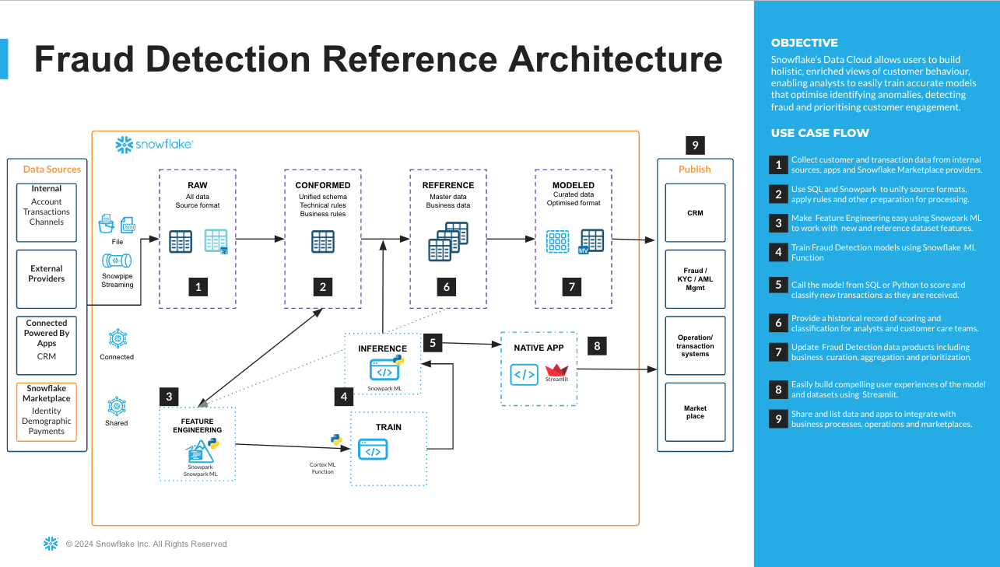
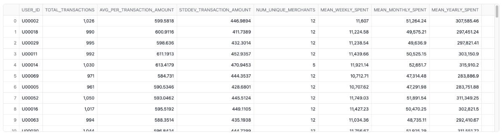
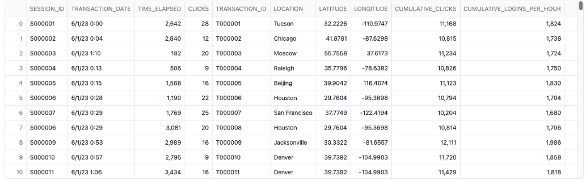
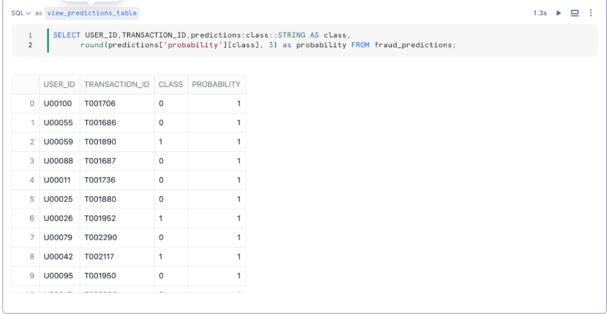
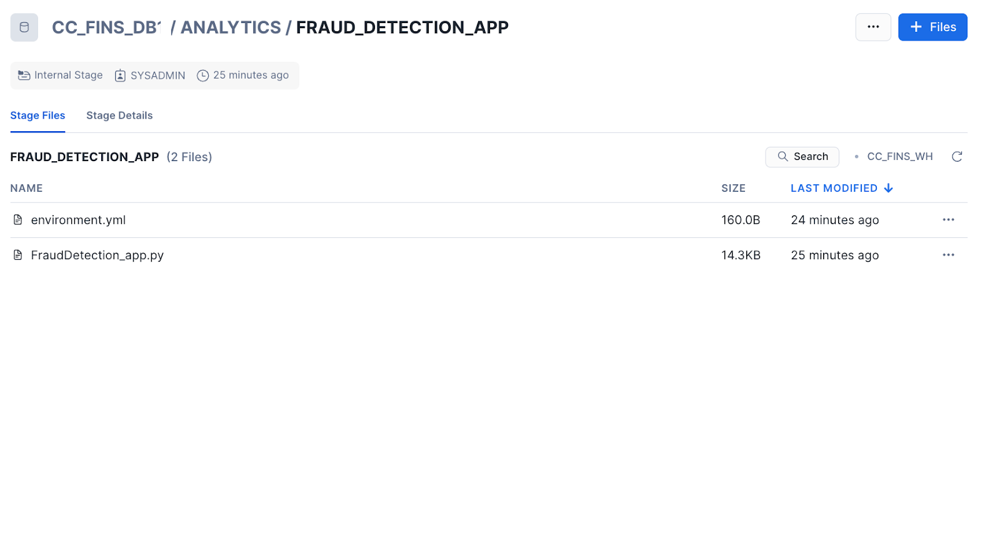
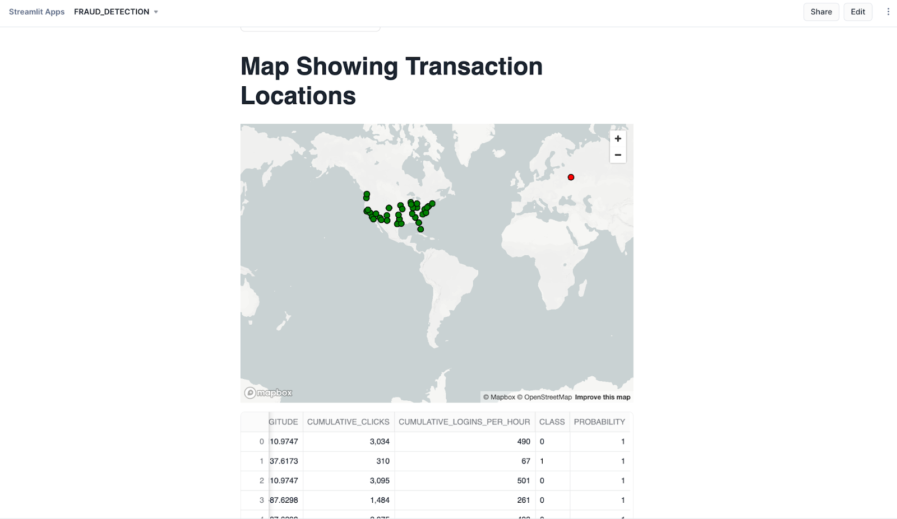

author: Kala Govindarajan
id: credit-card-fraud-detection-using-snowflake-ml
categories: snowflake-site:taxonomy/solution-center/certification/quickstart, snowflake-site:taxonomy/solution-center/certification/certified-solution, snowflake-site:taxonomy/solution-center/includes/architecture, snowflake-site:taxonomy/industry/financial-services, snowflake-site:taxonomy/product/applications-and-collaboration, snowflake-site:taxonomy/snowflake-feature/financial-operations, snowflake-site:taxonomy/snowflake-feature/ml-functions
language: en
summary: Detect credit card fraud with Snowflake ML using anomaly detection and classification models for real-time transaction scoring.
environments: web
status: Published 
feedback link: https://github.com/Snowflake-Labs/sfguides/issues
fork repo link: https://github.com/Snowflake-Labs/sfguide-credit-card-fraud-detection-using-snowflakeml


# Credit Card Fraud Detection using Snowflake ML Functions
<!-- ------------------------ -->

## Overview

### Overview
In this Quickstart guide, we will train a model using Snowflake ML Functions for Credit card fraud detection. Fraud Detection involves a range of methods and techniques aimed at preventing fraudulent purchases, both online and in-store. The goal is to verify the legitimacy of the transaction and ensure that the true cardholder is involved. Depending on the detection techniques used one may address questions about the cardholder's identity and intentions either in real-time or after the transaction has occurred. Thus, credit card fraud detection serves as both a preventative measure against payment fraud and a method for investigating past transactions. We will be walking through a use case where the ML Capabilities of the Snowflake Data Cloud will be leveraged for investigating the past transactions.

### What You'll Build
A pipeline to implement Feature Engineering and storing the features in a Feature Store inside Snowflake Notebooks
A pipeline to build a binary classification model to predict if a transaction is fraudulent or not inside Snowflake Notebooks
A Streamlit application with geospatial analysis that will be used to carry ongoing inference by detecting if new transactions are fraudulent or not.

### What You'll Learn
How to build a Model using Snowflake ML Classification Function
How to build a Streamlit app to detect and visualize the fraudulent transactions in Snowflake
How to render a map and plot in the Streamlit app

### What You'll Need
- Snowflake account with a SYSADMIN role or a role that has CREATE SNOWFLAKE.ML.CLASSIFICATION privilege on the schema the model will be created
- A GitHub Account
- Intermediate knowledge of Snowsight, the UI interface of Snowflake


## Setup Snowflake
<!-- ------------------------ -->

You will use  Snowsight, the Snowflake web interface, to only create an initial database and schema that needs to be a prerequisite for Notebooks. And then we will be carrying the rest of the execution within Snowflake Notebooks.

**Step 1**. - Create a Warehouse, Database, Schema and an internal stage

Create a new SQL worksheet by clicking on the ‘Worksheets' tab on the left hand side.
Paste and run the following SQL commands in a SQL worksheet to create the required Snowflake objects and a warehouse

```
CREATE DATABASE CC_FINS_DB;
USE DATABASE CC_FINS_DB;
CREATE SCHEMA ANALYTICS;
CREATE OR REPLACE WAREHOUSE FD_WH WITH WAREHOUSE_SIZE=’XSMALL’;
CREATE OR REPLACE STAGE CC_FINS_DB.ANALYTICS.FRAUD_DETECTION_APP 
DIRECTORY = (ENABLE = TRUE) 
ENCRYPTION = (TYPE = 'SNOWFLAKE_SSE');


```

**Step 2**. - Import Notebooks

From Snowsight, create a Snowflake notebook by importing a notebook and using the role, schema, and warehouse by following the instructions below:
- Download the setup and fraud detections notebooks using this [link](https://github.com/Snowflake-Labs/sfguide-credit-card-fraud-detection-using-snowflakeml). 
- Navigate to Notebooks in Snowsight by clicking on Projects -> Notebook
- Switch to the SYSADMIN role or the custom role. Using the import button on the top right, import the downloaded  1_cc_fins_setup notebook.
- Provide a name for the notebook and select the database, schema and warehouse created earlier.

Open the notebook once created and add the following packages by using the "Packages" button on the top right
- altair
- seaborn
- matplotlib
- snowflake-ml-python

Follow the same steps( b-e ) for the 2_cc_fraud detection notebook.


## Data Preparation and Feature Engineering
The end to end architecture involving all the stages is given below. 



### Initial data setup and Feature Engineering - 1_CC_FINS_SETUP.ipynb
Now that you have uploaded the notebooks let us start running each of them. The first notebook 1_cc_fins_setup contains the logic for the initial data loading and Feature Engineering. Synthetically generated data has been uploaded to a public S3 bucket and this is loaded into a Snowflake External Stage. 
From the external stage, the data is loaded into a Snowflake table. The data contains numerical features and categorical features related to the transactions and customer demographics. The methodology applied to mimic real-world dataset of card transactions is carried out with attributes like Location, clicks, time elapsed, logins per hour and pages visited in addition to regular ones like Transaction date, amount and credit card number.
This effectively detects fraudulent transactions by helping the model train and learn the patterns to maximize the detection of fraudulent transactions that will occur in the future.
Using the Feature Store we will generate customer related features like how many transactions  a customer does, along with average dollars spent in a week, monthly and yearly basis. 

A sample output from the engineered features dataset related to Customer is seen below.


Similarly the features related to Transaction data is generated that includes clicks, time elapsed before a transaction,cumulative logins, pages visited and the location such transaction originates from.A sample output from the engineered features dataset related to Transactions is seen below.




## Model Training

### Data Exploration and Model Building - 2_CC_FRAUD_DETECTION.ipynb

The second notebook 2_cc_fraud_detection contains the logic for consuming the features, data exploration, model building and validation using a test dataset. 
With the ability to use visualization packages from the Snowflake Conda channel, one can simply add from the Package Selector on the top right and start exploring the underlying data. Common trends are observed for a subset of features and this can be expanded to other features as well. 
Enriches a spine Snowpark DataFrame that contains the source data with the derived feature values and then training ML models. This is the generated dataset. The ML Classification function Classification uses machine learning algorithms to sort data into different classes using patterns detected in training data.  We will first create a classification model object, passing in a reference to the training data. The model is fitted to the provided training data that is prepared in prior steps. 
Then use the resulting schema-level classification model object’s PREDICT method to classify new data points and to understand the model’s accuracy through its evaluation APIs.

```
SELECT *,CC_FINS_DB.ANALYTICS.fraud_classification_model!PREDICT(INPUT_DATA => object_construct(*)) as predictions
from fraud_classification_val_view;
```


These metrics have been used to determine the overall model performance: 
- show_evaluation_metrics() : 
  - Precision: The ratio of true positives to the total predicted positives. 
  - Recall (Sensitivity): The ratio of true positives to the total actual positives.
  - F1 Score: The harmonic mean of precision and recall.
- show_threshold_metrics() : Provides raw counts and metrics for a specific threshold for each class. 
- show_confusion_matrix(): A table used to assess the performance of a model by comparing predicted and actual values and evaluating its ability to correctly identify positive and negative instances.
- show_feature_importance(): Represents an approximate ranking of the features in your trained model by counting the number of times the model’s trees used each feature to make a decision.


##  Build a Fraud Detection App with GeoSpatial Analysis in Streamlit

At this stage of the project, we have completed building out our end to end pipeline and are ready to use the trained model for detecting fraudulent patterns in new transactions. We will build a Streamlit in Snowflake application to deliver a Fraud Detection App for end users to easily understand the nature of incoming new transactions.

**Step 1**. - Load Streamlit Files

- Download all files from the app directory. This includes the environment.yml file as well.
- In Snowsight, change role to sysadmin
- Open the CC_FINS_DB.ANALYTICS.FRAUD_DETECTION_APP stage
- Click + Files in the top right of the stage
- Upload all files that you downloaded from GitHub into the stage. The contents should match the app directory
- Fraud_Detection.py and environment.yml are at the top level




**Step 2**. - Create the Streamlit App
Run the code below in a Snowsight worksheet to build the Streamlit app.
```
USE ROLE sysadmin;
CREATE OR REPLACE STREAMLIT CC_FINS_DB.ANALYTICS.FRAUDDETECTION_APP
ROOT_LOCATION = '@CC_FINS_DB.ANALYTICS.FRAUD_DETECTION_APP'
MAIN_FILE = 'Fraud_Detection.py'
QUERY_WAREHOUSE = 'CC_FINS_WH';

```
**Step 3**. - Open the Streamlit App

From Snowsight, ensure you are using the SYSADMIN role or the custom role with necessary privileges.
Under Projects, click Streamlit -> Click and open the FRAUDDETECTION_APP from the list of apps



**Step 4**. - Running the Fraud Detection App
The new transaction types that need to be detected are displayed at the top. Click on “Predict Fraudulent Transactions”. For the sake of simplicity, in this vignette the validation dataset (which was not used for training) is injected for detecting the transaction type.


## Conclusion And Resources

Congratulations, you have built a Classification model to carry credit card fraud detection and an application in Streamlit to carry geospatial analysis. This powerful application can help Financial customers quickly understand fraudulent patterns and respond to it. 
Snowflake ML Classification function offers automated predictions and data insights using machine learning. All you need to provide is your data and it doesn't require time series as well. The Machine learning model enables users to sort data into different classes using patterns detected within the training data. 
If you want to learn more about Snowflake ML Functions, check out the quickstarts in the resources section.

### What You Learned
- How to implement Feature Engineering using Snowflake Feature Store
- How to carry end to end ML in a Snowflake Notebook and build a binary classification model to predict if a transaction is fraudulent or not
- How to build a Streamlit application to detect fraudulent transactions and carry geospatial analysis.


### Resources

- #### [Snowflake ML Classification](https://docs.snowflake.com/en/user-guide/ml-functions/classification)

- #### [Getting Started with Snowflake Feature Store](https://quickstarts.snowflake.com/guide/getting_started_with_snowflake_feature_store/index.html?index=..%2F..index#0)

- #### [Getting Started with Snowflake ML Forecasting and Classification](/en/developers/guides/getting-started-with-snowflake-cortex-ml-forecasting-and-classification/)
  
- #### [Lead Scoring with ML-Powered Classification](/en/developers/guides/lead-scoring-with-ml-powered-classification/)

- [Fork the Repo](https://github.com/Snowflake-Labs/sfguide-credit-card-fraud-detection-using-snowflakeml/tree/main)
- [Download Reference Architecture](/content/dam/snowflake-site/developers/2024/09/Fraud-Detection-Reference-Architecture.pdf)
- [Read the Blog](https://medium.com/@kala.govindarajan/unveiling-fraud-in-digital-payments-with-snowflake-ml-functions-9bedb66132dd)
- [Watch the Demo](https://youtu.be/whrKbadNTXw?list=TLGGtKppesFpkucyMjA5MjAyNQ)
