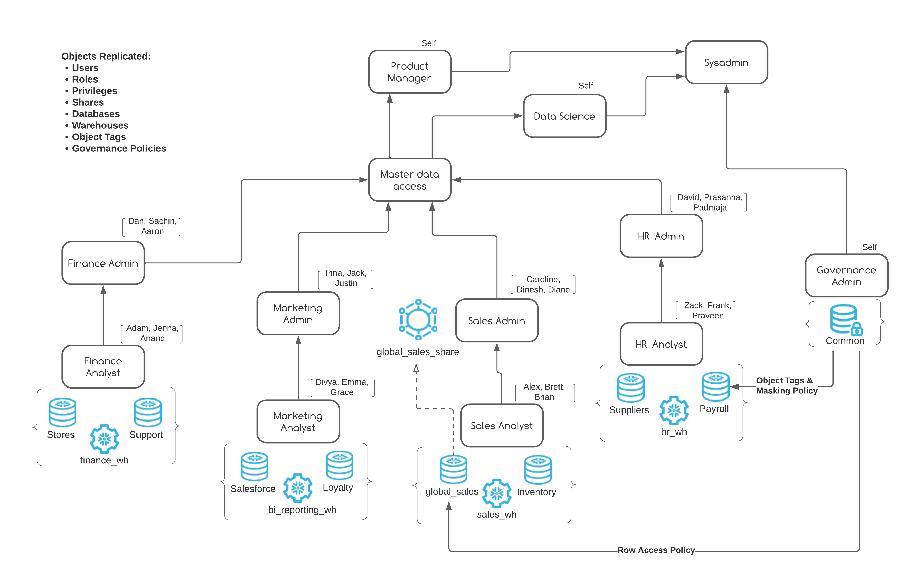
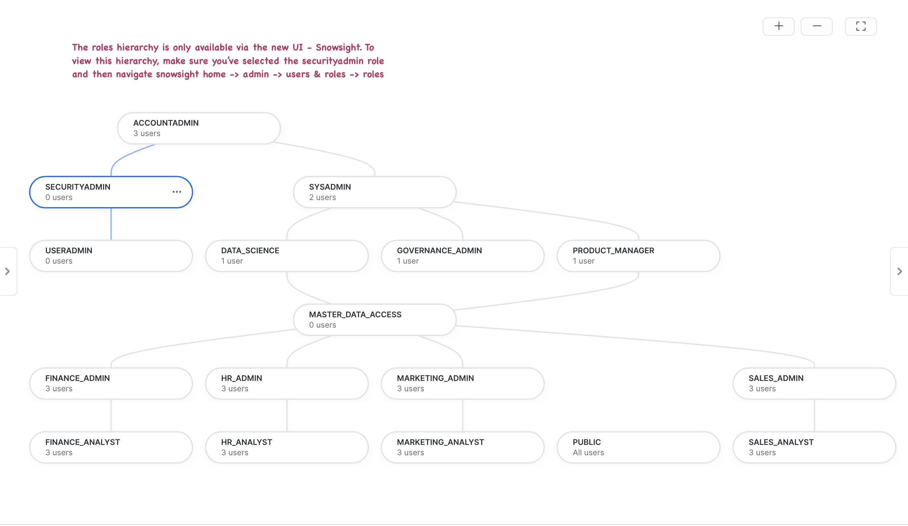
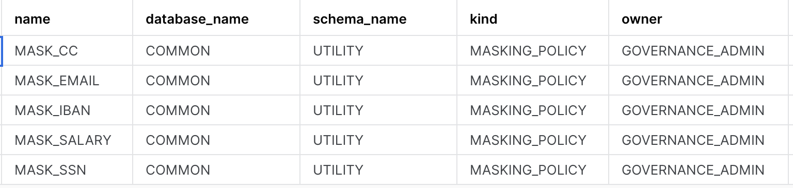
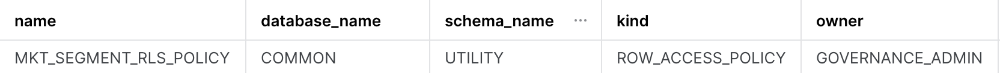
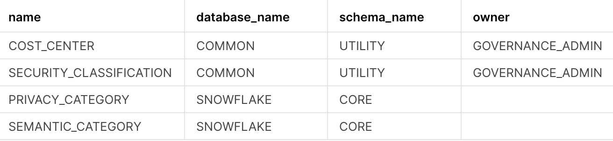
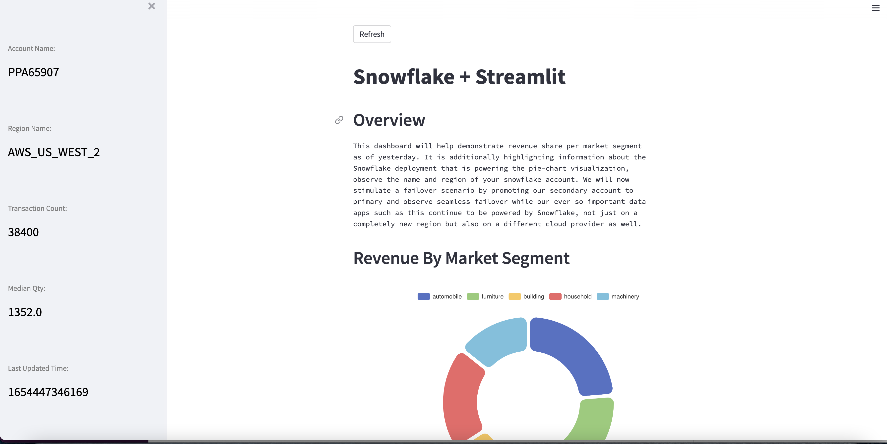

author: Prateek Parashar
id: cross_cloud_business_continuity
summary: This is a sample Snowflake Guide
categories: Getting Started
environments: web
status: Published 
feedback link: https://github.com/Snowflake-Labs/sfguides/issues
tags: Getting Started, Data Science, Data Engineering, Twitter 

# Cross Cloud Business Continuity With Snowflake
<!-- ------------------------ -->
## Overview

“By failing to prepare, you are preparing to fail” - Benjamin Franklin

A sound business continuity/disaster recovery plan is an important milestone for organizations looking to build resilient data platforms. We are in the information age and data-driven insights grow revenue, provide services, support customers and aid with critical decision making. Digital transformation is the need of the hour and in this important endeavor businesses face many forms of disruptions like fire, floods, cyberattacks, ransomware etc. These disruptions can spiral into various undesirable outcomes - from operational systems coming to a standstill leading to financial losses to something worse, like reputational damage.

The covid-19 pandemic forced many organizations to re-think their BC/DR plans and risk assessment. An immediate result of the pandemic was the inability to perform day-to-day jobs in person, this especially applied to tech workers who have traditionally performed remote work but during the pandemic this became the new norm. Everyone connected remotely all the time everyday, indirectly bringing more attention, focus and budget allocation towards cybersecurity. 

The number one priority to mitigate IT risks of the modern world therefore becomes a robust business continuity plan. Technology is the center-piece of all businesses and mission-critical data can never be unavailable.

Snowflake's new group based replication feature facilitates just that, it will allow organizations ready a DR instance that is an exact replica of their primary Snowflake account. Therefore, during an actual region level outage, the org and it's customers will have their data, account resources like WHs, users, roles, shares etc. and governance policies available to them intact on the secondary account.

Finally, Snowflake's client redirect feature will facilitate seamless failover from primary to secondary so that apps and users can continue functioning without disruption. In a way, the end users wouldn't even realize that an outage has occurred and that they are now powered a different Snowflake account not just in another region but also on a different public cloud platform. 
 

### Prerequisites
- Basic understanding of Snowflake concepts, familiarity with Snowflake UI.
- Two snowflake trial accounts, preferably in different regions and different cloud platforms. Designate any one of them as the primary account and the other one will be secondary. The instructions in this guide will ask you to fire specific commands on source and target accounts. So remember (or make a note) of your primary and secondary account names to avoid confusion.
- Account replication preview feature enabled on both trial accounts. If you've applied for this lab in advance and provided your account details, this should already be enabled for you by the Snowflake team.
- Accountadmin access on both trial accounts.
- Failover App: BI Sigma Dashboard
  - A sigma trial account that is valid on the day of the lab. The trial account is valid for 14 days from the day of signing up. You can sign for the trial account directly from the [sigmacomputing free trial link](https://www.sigmacomputing.com/free-trial/) or from your Snowflake UI by clicking on “Partner Connect” -> Click on “Sigma” tile.
- Failover App: Python Streamlit Dashboard
  - [snowflake python connector](https://docs.snowflake.com/en/user-guide/python-connector-install.html#installing-the-python-connector) (Minimum python version 3.6)
  - [streamlit](https://docs.streamlit.io/library/get-started/installation) (pip/pip3 install streamlit)
  - streamlit-echarts (pip/pip3  install streamlit-echarts)
  - Pandas (pip/pip3 install pandas)
  - Json  (pip/pip3 install json)
- Failover App: SnowSQL
  - [Install SnowSQL](https://docs.snowflake.com/en/user-guide/snowsql-install-config.html#installing-snowsql)

- Access to SNOWFLAKE_SAMPLE_DATA share.

### What You’ll Learn 
In this quickstart you will learn
- How to use out of the box features available in Snowflake to build resiliency against region failures.
- Group based replication and failover of account objects.
- Database replication (as part of the group) from primary to secondary. 
- Account object replication (users, roles, WHs, resource monitors, data shares) from primary to secondary.
- How to keep a DR instance ready to serve as exact replica of the primary instance - with upto date data and governance policies.
- How to trigger failover of replication/failover groups and client connections.

### What You’ll Need 
Items 2 and 3 below are required to mimic application failover, you can build one or both apps depending upon your use case and comfort. If you're comfortable with working with Python, 2nd point might be relevant Or if your use case aligns more with a BI dashboard failover then point 3 might be of more interest. You can opt to build both apps too. Infact, we recommend you build both apps for broader use case coverage.
- Account Admin access to two Snowflake accounts deployed in different regions and on different cloud platforms 
- Python installed on local machine to stimulate a python app failover. 
- A sigma trial account to stimulate a BI dashboard failover.
- Our source data is based on the TPC-DS benchmark dataset that is shared with all Snowflake accounts by default. If you don't see that share, you can create it with below commands.

```bash
use role ACCOUNTADMIN;
create database SNOWFLAKE_SAMPLE_DATA from share SFC_SAMPLES.SAMPLE_DATA;
grant imported privileges on database SNOWFLAKE_SAMPLE_DATA to role PUBLIC;
```

### What You’ll Build 
- Source account resources to mimic a production grade Snowflake account.
- Replicate/Failover selective resources to a secondary account in a transactinally consistent fashion.
- Build apps powered by primary snowflake account.
- Failover from primary to secondary account.
- Observe your apps now seamlessly powered by the secondary account.

<!-- ------------------------ -->
## Source Account Setup

The code required to setup resources on your source account is hosted in github. You can download the code as a ZIP from [GitHub](https://github.com/Snowflake-Labs/vhol_failover_scripts) or use the following git command to clone the repository.

```bash
git clone https://github.com/Snowflake-Labs/vhol_failover_scripts.git
```

After downloading the code you should see numbered sql scripts in the scripts folder. The sequence also determines their order of execution.

- **100_create_env_resources_source.sql**: Create roles, roles hierarchy, databases and warehouses. 

- **200_create_users_source.sql**: Create user base. 

- **300_roles_privileges_assignment_source.sql**: Grant object privileges to roles and grant roles to create personas. *Be sure to replace user name on lines 93 - 95 with your own admin user, the admin user in each account should have the product_manager, data_science and governance_admin roles assigned.*

- **400_ingest_data_source.sql**: Create tables and data share and ingests data in tables. 

- **500_governance_policies_source.sql**: Create and assign object tags, masking policies and row access policy.

- **600_update_primary_task.sql**: Create and start task to update primary tables every 3 minutes.

You can run these scripts via UI by copy/pasting them or importing them as shown below. For some of our seasoned Snowflake users - if you have installed our awesome CLI SnowSQL and are comfortable pointing it to your source account for the lab, feel free to use that to execute the script. Make sure though that you pay attention to any errors encountered along the way. 


<!-- ------------------------ -->
## Review Source Account

Our scripts in the previous step have created a production like snowflake environment for us. Here's a list of objects you just created when you ran those scripts:
- Users & Roles
- RBAC Hierarchy
- Databases
- Compute warehouses
- Data copied from the snowflake_sample_data share
- Direct data shares
- Dynamic data masking policies
- Row access policy
- Object tags

Phew! That's quite a list here's what all of this looks like in a picture:



### Let's review our source account

#### Observe your RBAC
Below is what the roles hierarchy should look like in your source account. Do note that the roles hierarchy is only available via the new UI - Snowsight. Log on to Snowsight and assume the "securityadmin" role and then navigate to home -> admin -> users & roles -> roles.



#### Verify Row Access Policy
Our row access policy is applied to the global_sales.online_retail.customer table with the following rules:

- sales_analyst role should be able to see data for market segments 'automobile' and 'machinery'.
- sales_admin role should be able to see data for market segments 'automobile', 'machinery', 'building' and 'household'.
- product_manager role should be able to see data for ALL market segments.
- All other roles should not be able to see data for ANY market segment.

Below query when run with the sysadmin role should return 0 records, but when run with the product_manager role it should return proper results. Run the query once with each role - sysadmin and product_manager. Switch roles in your worksheet with the "use role <role_name>" command.

```sql
#Below query when run with the sysadmin role should return 0 records, but when run with the product_manager role 
#it should return proper results. Run the #query once with each role - sysadmin and product_manager. Switch roles 
#in your worksheet with the "use role <role_name>" command.

use role sysadmin;
use warehouse bi_reporting_wh;
select * from global_sales.online_retail.customer limit 100;
```

When we replicate our data and our account objects, row level security is applied to the target account as well. This ensures that your access rules around data are retained even on the DR instance.

#### Verify dynamic data masking policy
Our payroll.noam_northeast.employee_detail data contains critical PII data elements such as salary, ssn, email and iban. This is information that cannot be visible by everybody that access to this data. We therefore deploy dynamic data masking policy protecting this dataset and only allowing authorized roles to see this information in the clear. The remaining roles would either see partially masked or completely redacted version of these columns, while having full visibility on other columns in this dataset that they can still use. Below are the rules of our dynamic data masking policy.

- email_address: hr_admin and product_manager roles can see complete email ids while all the other roles would see partially masked values, with only the domain name (@gmail.com, @yahoo.com) being visible.
- iban, credits_card and ssn: hr_admin and product_manager see ibans in the clear, all the other roles would see fully masked values.
- salary: hr_admin and product_manager see actual salaries and all the other roles would see 0.0

```sql

#Run the query below with two different roles - hr_analyst and hr_admin, observe all fields in the return results. 
#What values does hr_analyst see for #email, iban, cc and salary columns? What values does the hr_admin see?

use role hr_analyst;
use warehouse hr_wh;
select * from payroll.noam_northeast.employee_detail limit 100;
```

#### Verify data shares
The global_sales_share that we've created should have the following privileges
- Usage on global_sales DB
- Usage on global_sales.online_retail schema
- select on customer, lineitem and nation tables in global_sales.online_retail schema

Verify the permissions on the data share with below commands:
```sql 
use role accountadmin;
show grants to share global_sales_share;
```
#### Verify location, type and owner of governance policies
We have built 5 masking policies, 4 object tags and 1 row access policy that we use to protect our data. Observe their details like which schema are these policies kept in, who owns them etc.

```sql
use role sysadmin;
show masking policies;
show row access policies;
show tags;
```
The output of the three commands should look something like this:

__Masking Policies:__


__Row Access Policy:__


__Object Tags:__



<!-- ------------------------ -->
## Configure DR On Source And Target Accounts
Let the DR configuration Begin! (and finish, you'll breeze through these steps with the blink of the eye - it's that easy to setup DR configuration on Snowflake). This is where we make use of the account replication and client redirect features and setup two first class snowflake objects on the source account:
-- connection: The connection object stores a secure connection URL that you can use with any Snowflake client to connect to Snowflake.
-- Failover group:  It is a collection of objects in a source account that are replicated as a unit to one or more target accounts and can failover as a unit. A secondary failover group in a target account provides read-only access for the replicated objects. When a secondary failover group is promoted to become the primary failover group, read-write access is available.

### Run these queries on source account

```sql
use role accountadmin;
create connection sfsummitfailover;
alter connection sfsummitfailover enable failover to accounts <orgname.target_account_name>;

create failover group sales_payroll_failover
    object_types = users, roles, warehouses, resource monitors, databases, shares
    allowed_databases = global_sales,common,payroll,inventory,loyalty,sales,crm,products,references,cross_database,externals
    allowed_shares = global_sales_share,sales_history_share, cross_database_share, crm_share, inventory_share
    replication_allowed_to_accounts = <org_name.target_account_name>
    failover_allowed_to_accounts = <org_name.target_account_name>;

```

### Run these queries on target account
Here you'll create a secondary connection and a secondary failover group.

- A secondary connection is linked to the primary connection and must be created in an account in a different region from the source account. The secondary connection name must be the same as the primary connection name.
- Just like the secondary connection, a secondary failover group is also linked to it's corresponding primary failover group and must be created in an account in a different region from the source account and with the same name as the primary failover group.
```sql
use role accountadmin;
create connection sfsummitfailover
    as replica of organame.source_account_name.SFSUMMITFAILOVER;

create failover group SALES_PAYROLL_FAILOVER
    as replica of organame.source_account_name.SALES_PAYROLL_FAILOVER;
```

### Note the value for connection_url
Once you've setup your connection object successfully, we need to note the value for connection_url for our connection object. This URL is what we'll be using in all our application building from this point on. The url takes an account agnostic form (_orgname-connection_name.snowflakecomputing.com_) because it could be pointing to either account depending upon which one is primary. 

```sql
#Fire command below and for the connection object created note the value of 
#connection_url_ property. It is the 3rd last column in the result of the 
# show connections command.
show connections;
```


<!-- ------------------------ -->
## Build BI and/or Streamlit Apps
Duration: 2

Welcome app developers! this is where we have some fun, all of the hard work thus far with account setup, data curation, RBAC hierarchy and governance policy would be of no use if we're not powering apps that provide meaningful insights. It is after all these insightful apps that we want operational in case of an outage. 

We have two options for you today to build quick and simple, snowflake powered apps that we'll see later, will continue to be operational (By failing over to the DR) once we simulate a region failure.

You can choose to build one of both of these.

- Option 1: For BI enthusiasts (Now is when that Sigma trial account will come in handy) - You'll be building a Sigma dashboard. Step by step instructions are available in the video below.

- Option 2: For the pythonistas in the house - you'll be playing with some streamlit and streamlit extensions magic (hopefully, it's already installed on your local machines. If not, don't stress - pip install streamlit & pips install streamlit-echarts is all you need). If you have the required libraries installed, you can leverage the code below - enter your credentials to your Snowflake account and run the streamlit app. 

- Option3: If you're not in the mood to build, no problem. There's an easy (and unfotrunately boring) way to test this too. You can stick with the good ole snowflake UI or Snowflake's CLI tool - snowsql to connect to the url mentioned in the connection_url field and see which account did snowflake route you to?

### Sigma BI Dashboard

In this step, we'll build a sigma dashboard that will rely on data available on our primary account. Once we replicate this data to our secondary account and failover, we'll see the sigma dashboard seamlessly point to the failover region and powered by our secondary account.
<video id="vfmmDcQ1uB0"></video>

#### Query used to build the global sales dashboard
Here's the code snippet used for charting the global revenue figures. 
```bash
select n_name nation
    , sum(o_totalprice) revenue
from global_sales.online_retail.orders 
inner join global_sales.online_retail.customer on c_custkey = o_custkey
inner join global_sales.online_retail.nation on c_nationkey = n_nationkey
where o_orderdate between dateadd(day,-2,current_date) and current_date()
group by 1
order by 2 desc
```

#### Final Dashboard
Once you're done building the dashboard, the end result should look something like this


### Python Streamlit App
```python
#Save this python script in a file and run from terminal/command prompt as 'streamlit run <name_of_script>.py'
import snowflake.connector
import streamlit as st
import pandas as pd
import streamlit_echarts as ste
import json

# Gets the version
ctx = snowflake.connector.connect(
    user=<user_name>,
    password=<password>,
    #account name value should be that of connection_url from the show connections command. Everything before snowflakecomputing.com
    account=<account_name>,
    session_parameters={
        'QUERY_TAG': 'Snowflake Summit 2022: Failover HoL'
    },
    warehouse='bi_reporting_wh',
    database='global_sales',
    role='product_manager'
    )

# Create a cursor object
cur = ctx.cursor()

#Query to power streamlit app
app_sql = """
select round(sum(o_totalprice)/1000,2) as value,
       lower(c_mktsegment) as name
       from
       global_sales.online_retail.orders
       inner join global_sales.online_retail.customer
       on c_custkey = o_custkey
       where o_orderdate between dateadd(day,-4,current_date) and current_date()
       group by 2
       order by 1 desc;
"""
#Query to get account name.
get_account_sql = "select current_account() as account_name;"

#Query to get region name.
get_region_sql = "select current_region() as region_name;"

#Query to get total sales transactions.
trans_count_sql = "select count(*) as transaction_count from sales..total_sales;"

#Query to get median qty.
median_qty_sql = "select median(quantity) as median_qty from sales..total_sales;"

#Query to get Last Update.
last_update_sql = "select max(last_update_time) as last_update from sales..total_sales;"

#Get Query results to power the main viz.
cur.execute(app_sql)
df = cur.fetch_pandas_all()

#Get account name.
cur.execute(get_account_sql)
account_name_json = cur.fetch_pandas_all().to_json(orient = 'records')
account_name = json.loads(account_name_json)[0]['ACCOUNT_NAME']

#Get region name.
cur.execute(get_region_sql)
region_name_json = cur.fetch_pandas_all().to_json(orient = 'records')
region_name = json.loads(region_name_json)[0]['REGION_NAME']

#Get total transactions.
cur.execute(trans_count_sql)
trans_count_json = cur.fetch_pandas_all().to_json(orient = 'records')
trans_count = json.loads(trans_count_json)[0]['TRANSACTION_COUNT']

#Get median qty.
cur.execute(median_qty_sql)
median_qty_json = cur.fetch_pandas_all().to_json(orient = 'records')
median_qty = json.loads(median_qty_json)[0]['MEDIAN_QTY']

#Get last update timestamp.
cur.execute(last_update_sql)
last_update_json = cur.fetch_pandas_all().to_json(orient = 'records')
last_update = json.loads(last_update_json)[0]['LAST_UPDATE']

#Adjust column case for our data frame to work well with streamlit extensions.
df_col_case = df.rename(columns = {'VALUE':'value','NAME':'name'})
df_chart_data = df_col_case.to_json(orient = 'records')
df_chart_data = json.loads(df_chart_data);

#Streamlit Extensions Pie chart visualization config.
options = {
    "tooltip": {"trigger": "item"},
    "legend": {"top": "5%", "left": "center"},
    "series": [
        {
            "name": "Revenue By Market Segment",
            "type": "pie",
            "radius": ["40%", "70%"],
            "avoidLabelOverlap": False,
            "itemStyle": {
                "borderRadius": 15,
                "borderColor": "#fff",
                "borderWidth": 7,
            },
            "label": {"show": False, "position": "center"},
            "emphasis": {
                "label": {"show": True, "fontSize": "40", "fontWeight": "bold"}
            },
            "labelLine": {"show": False},
            "data": df_chart_data,
        }
    ],
}

#st.sidebar.title("Real Time Sales Insight")
#original_title = '<p style="font-family:Courier; color:Blue; font-size: 20px;">Transaction Count</p>'
title_template = '<p style="color:Grey; font-size: 15px;">'
value_template = '<p style="color:Black; font-size: 25px;">'

account_title = title_template + 'Account Name:</p>'
region_title = title_template + 'Region Name:</p>'
transaction_title = title_template + 'Transaction Count:</p>'
median_title = title_template + 'Median Qty:</p>'
update_title = title_template + 'Last Updated Time:</p>'

account_value = value_template + account_name + '</p>'
region_value = value_template + region_name + '</p>'
transaction_value = value_template + str(trans_count) + '</p>'
median_value = value_template + str(median_qty) + '</p>'
update_time_value = value_template + str(last_update) + '</p>'

st.sidebar.markdown(account_title,unsafe_allow_html=True)
st.sidebar.markdown(account_value,unsafe_allow_html=True)
st.sidebar.markdown("***")
st.sidebar.markdown(region_title,unsafe_allow_html=True)
st.sidebar.markdown(region_value,unsafe_allow_html=True)
st.sidebar.markdown("***")
st.sidebar.markdown(transaction_title,unsafe_allow_html=True)
st.sidebar.markdown(transaction_value,unsafe_allow_html=True)
st.sidebar.markdown("***")
st.sidebar.markdown(median_title,unsafe_allow_html=True)
st.sidebar.markdown(median_value,unsafe_allow_html=True)
st.sidebar.markdown("***")
st.sidebar.markdown(update_title,unsafe_allow_html=True)
st.sidebar.markdown(update_time_value,unsafe_allow_html=True)

overview_text = """
This dashboard will help demonstrate revenue share per market segment
as of yesterday. It is additionally highlighting information about the
Snowflake deployment that is powering the pie-chart visualization,
observe the name and region of your snowflake account. We will now
stimulate a failover scenario by promoting our secondary account to
primary and observe seamless failover while our ever so important data
apps such as this continue to be powered by Snowflake, not just on a
completely new region but also on a different cloud provider as well.
"""
conclusion_text = """
Congratulations, on achieving cross-cloud cross-region
replication in a matter of minutes. Remember, what happens in vegas doesn't
necessarily need to stay in Vegas. Now go out, share this useful spear of
knowledge that you now have in your quiver and go make your org resilient
to region failures.
"""
st.button("Refresh")
st.title("Snowflake + Streamlit")
st.header("Overview")
st.text(overview_text)

st.header("Revenue By Market Segment")
ste.st_echarts(
    options=options, height="500px"
)
st.header("Conclusion")
st.text(conclusion_text)
st.snow()
```

#### Streamlit app should look like this



<!-- ------------------------ -->
## Replication To Target
All that work behind us, we set up our account resources like users, roles, RBAC hierarchy, databases (not to mention, the crucial data it contains), compute warehouses, governance policies with RLS and CLS features, direct shares and then some beautiful customer facing apps - Phew!

Now we have to do this all over again just to have a DR instance - how much more work will this be?? Oh right, negligible. With Snowflake a single command will bring all that setup from our source account to our target account in a matter of minutes if not seconds (depending upon the size/number of objects).

But wait a minute, our source account and target account are on _different_ public cloud providers - won't that factor into the setup or cause some kind of _extra work_? Nope, not with Snowflake - we're cloud agnostic and we hide all that complexity from you.  

Here's that single command that you need to replicate everything that this failover group contains.

```bash
use role accountadmin;
alter failover group sales_payroll_failover refresh;
```

This command would take about a minute to run , but wait where's it getting the compute from? is it using any of our WHs that we've provisioned? Nope, we got you covered - this is serverless compute that Snowflake provides and autoscales depending upon the amound of work that needs to get done. There will be a separate lineitem under "Replication" for this on your bill.

After this command has run - you should all of the databases and other objects that we included in the failover group definition available in your secondary account.

Here's a fun exercise to carry out, go back to step 3 and verify whether the governance policies (RLS and CLS) are intact in your secondary account as well (spoiler alert: they should be)

<!-- ------------------------ -->
## Failover To Target
Moment of truth! With our data and account objects safely replicated to the secondary account. Let's assume disaster has struck! Our primary account is experiencing outage and business and tech teams (The awesome failover HoL participants) have invested time and money in ensuring that they are prepared for this very event.

So what do we do? Again, something very simple - fire two commands.

- The first command will failover our connection - making the secondary account the new primary account for the account redirect.
- The second command has done the same for our failover group, it has made the other account primary for objects covered in this failover group. This means that databases within this FG have now become read-write and the same databases in our new secondary (old primary) account have become read-only.

```bash
use role accountadmin;

alter connection sfsummitfailover primary;
alter failover group sales_payroll_failover primary;
```
As an exercise, try to update any table (that is part of the DBs in your failover group) in your new secondary account. You should get an error. 

<!-- ------------------------ -->
## Let's Revisit Our Apps
With your connection_url now pointing to a new primary account, refresh your BI Dashboards and/or Streamlit Apps and notice which accounts are they powered by? But let's not blindly believe the visualizations! Login to the new primary account and look at the query history. Were the queries behind the Viz indeed fired on your new primary account? They should very well be!  


<!-- ------------------------ -->
## Conclusion
Duration: 1

In this lab we have seen advantages of having a BC/DR strategy ensuring the data apps (that power the world) are resilient to region failures. 

We utilized Snowflake's shiny new group based replication to replicate not just our databases but other critical account resources like users, roles (and the privileges), data shares, warehouses, resource monitors.

We also noticed that the data governance rules that keep our data secured on the source account, are retained on the target account. Masking policies, row access policies and object tags are replicated along with the database and applied on the target account. Thereby ensuring that in the event of a region failure you're not tasked with re-applying governance rules on your new primary.

We've worked through the following tasks:

- Setup source account resources needed to mimic a prod like environment.
- Understood the new group based replication and client re-direct. 
- Configured failover group and connection on primary and created clones of these objects in the secondary.
- Built _slightly_ fancy apps in Sigma and Streamlit.
- Replicated all resources configured in the failover group to the secondary account (_ahem, at lightning speed, ahem_)
- Finally, we simulated a DR scenario simply by promoting our secondary account to be the new primary account and observed that our applications continued to function seamlessly.