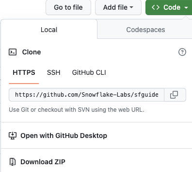
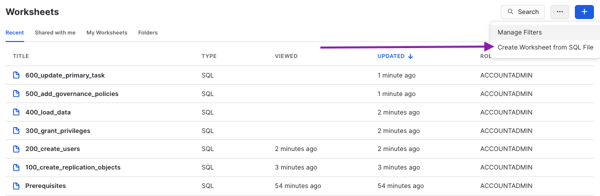
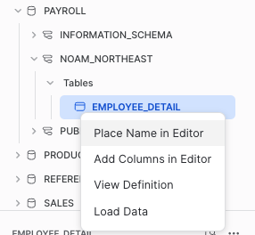
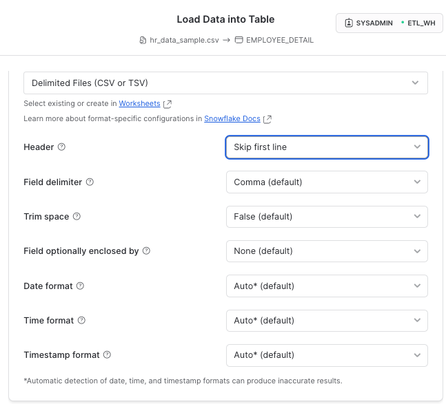
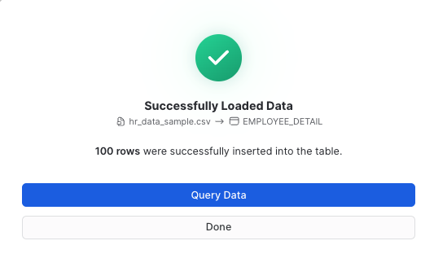
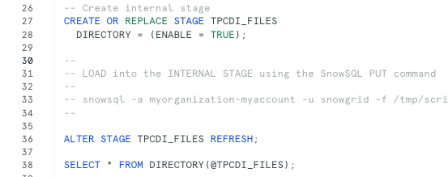
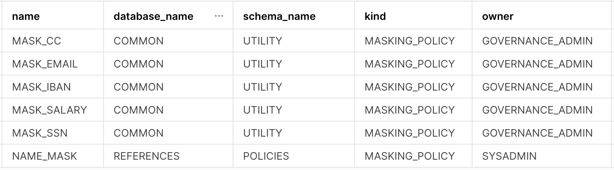
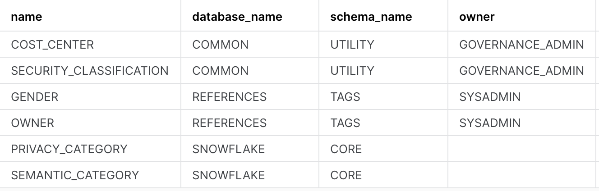
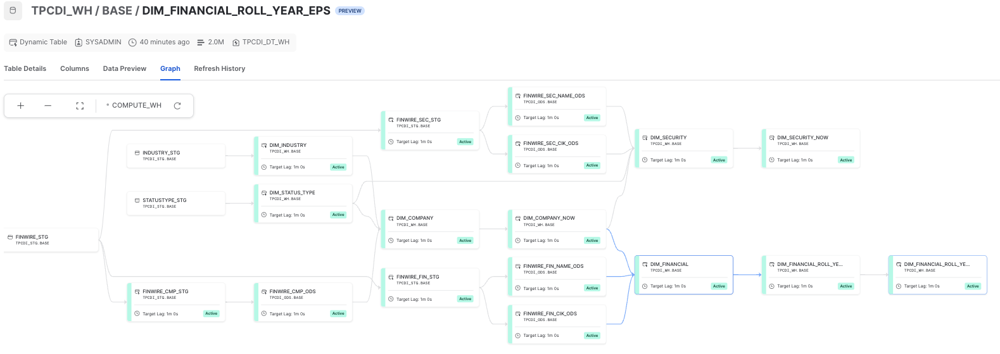
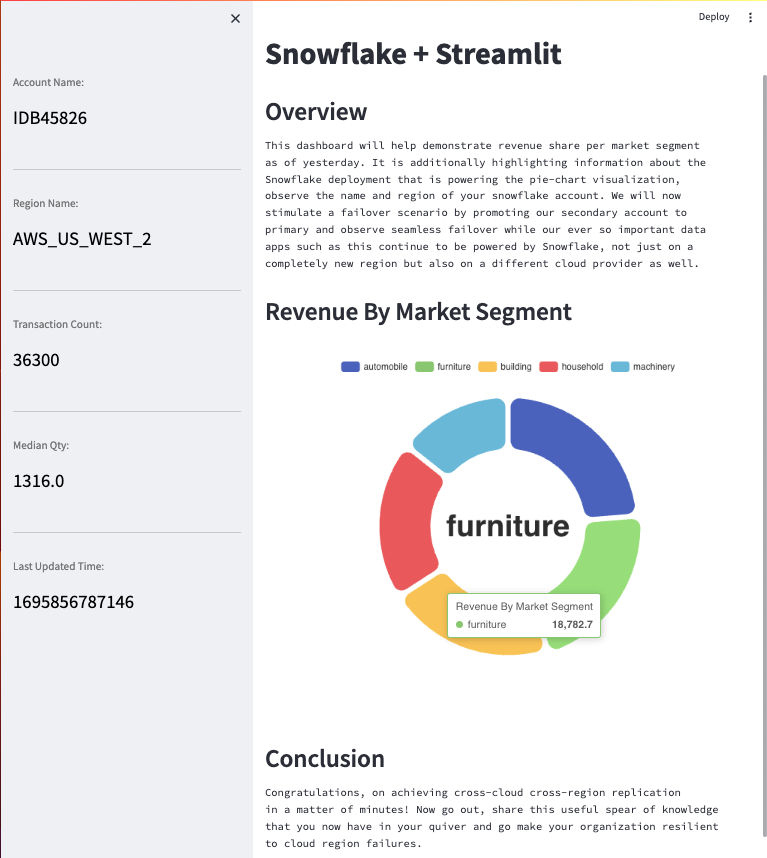

author: Vinay Srihari, Prateek Parashar
id: cross_cloud_business_continuity
summary: This guide demonstrates Snowflake replication, failover and client redirect features for business continuity
categories: business-continuity,data-engineering,app-development
environments: web
status: Published 
feedback link: https://github.com/Snowflake-Labs/sfguides/issues
tags: Getting Started, Replication, Data Engineering

# Cross Cloud Business Continuity With Snowflake
<!-- ------------------------ -->
## Overview
Duration: 15

“By failing to prepare, you are preparing to fail” - Benjamin Franklin

A sound business continuity/disaster recovery plan is an important milestone for organizations looking to build resilient data platforms. Data-driven insights grow revenue, provide services, support customers and aid with critical decision making. Businesses face many forms of disruptions like fire, floods, cyberattacks, ransomware etc. These disruptions can spiral into various undesirable outcomes - from operational systems coming to a standstill leading to financial losses to something worse, like reputational damage.

Technology is the center-piece of all businesses and mission-critical data can never be unavailable. As businesses move critical applications to the public cloud, continuous global operations rely even more on cloud dependability.

Snowflake’s **Replication and Failover/Failback** feature enables account metadata, including everything from user identity and role-based access controls to governance policies, warehouses and resource monitors, to be automatically synchronized across clouds and regions for continuous availability. Multiple databases, shares and account metadata can be replicated as a unit, ensuring point-in-time consistency with the primary region.

Snowflake's **Client Redirect** feature facilitates seamless failover from primary to secondary so that apps and users can continue functioning without disruption. In the past, to recover, the connection string in every client application had to be manually changed to connect to the new primary site (the former secondary site) in a different region or cloud. With Client Redirect, administrators can use a single server-side command to redirect client applications to the new primary site, without disrupting business teams. 
 

### Prerequisites
- #### Create 2 Snowflake trial accounts in the same Organization - in AWS, Azure cloud regions - and enable replication for each account.
    > Create an AWS trial account [here](https://signup.snowflake.com/)
    >
    > - choose **Business Critical** edition, **AWS** as cloud provider, any **US** region
    > - activate account with username `snowgrid` - this user has ACCOUNTADMIN
    > - create a SQL Worksheet named _**Prerequisites**_
    > 
    > Create an Azure trial account from the AWS account
    > ```sql
    > USE ROLE ORGADMIN;
    >
    > CREATE ACCOUNT snowflake_azure_target
    >   admin_name = snowgrid
    >   admin_password = 'FILL_IN_PASSWORD'
    >   email = 'FILL_IN_EMAIL'
    >   edition = business_critical
    >   region = azure_eastus2;
    > ```
    > Enable replication for AWS and Azure accounts as ORGADMIN (doc [here](https://docs.snowflake.com/en/user-guide/account-replication-config#prerequisite-enable-replication-for-accounts-in-the-organization))
    > ```sql
    > -- FILL_IN the organization_name, AWS account_name and Azure account_name in the commands to enable replication
    > SHOW ORGANIZATION ACCOUNTS;
    >
    > SELECT SYSTEM$GLOBAL_ACCOUNT_SET_PARAMETER('FILL_ORG_NAME.FILL_AWS_ACCOUNT_NAME', 'ENABLE_ACCOUNT_DATABASE_REPLICATION', 'true'); 
    >
    > SELECT SYSTEM$GLOBAL_ACCOUNT_SET_PARAMETER('FILL_ORG_NAME.FILL_AZURE_ACCOUNT_NAME', 'ENABLE_ACCOUNT_DATABASE_REPLICATION', 'true'); 
    > ```
    > 
    > Verify that accounts are enabled for replication
    > ```sql
    > USE ROLE ACCOUNTADMIN;
    > SHOW REPLICATION ACCOUNTS;
    >```

- #### [Install SnowSQL](https://docs.snowflake.com/en/user-guide/snowsql-install-config.html#installing-snowsql) (CLI Client): used to load data into a Snowflake internal stage 
- #### Check that SNOWFLAKE_SAMPLE_DATA shared database is visible, otherwise create it:
    >```sql
    > USE ROLE ACCOUNTADMIN;
    > CREATE DATABASE IF NOT EXISTS SNOWFLAKE_SAMPLE_DATA FROM SHARE SFC_SAMPLES.SAMPLE_DATA;
    > GRANT IMPORTED PRIVILEGES ON DATABASE SNOWFLAKE_SAMPLE_DATA TO ROLE PUBLIC;
    >```

- #### Python Streamlit Dashboard - install the following modules/connectors:
  - Install Python (3.8 or higher): `python --version`
  - [Install Snowflake Python connector](https://docs.snowflake.com/developer-guide/python-connector/python-connector-install#installing-the-python-connector)
  - [Install Streamlit](https://docs.streamlit.io/library/get-started/installation#install-streamlit-on-macoslinux), then a few components
    >```bash
    > pip install streamlit-echarts
    > pip install pandas
    > streamlit hello  #(as a test)
    >```

- #### (`Optional`) Sigma BI Dashboard
  - [Sigma Free Trial](https://www.sigmacomputing.com/free-trial/) or launch the Sigma tile in Snowflake Partner Connect from your Snowsight UI

### What You’ll Learn 
In this quickstart you will learn
- How to use out of the box features available in Snowflake to build resiliency against region failures.
- Group based replication and failover of account objects, databases, shares.
- Pipeline replication (public preview): dynamic tables, stages, pipes, load history.
- Client redirect after a failover leveraged by Streamlit and Sigma dashboards.

### What You’ll Need 

- Python (minimum 3.8) installed on local machine for a Streamlit app.
- (Optional) Sigma trial account to stimulate a BI dashboard failover.

### What You’ll Build 
- Source account resources to mimic a production grade Snowflake account.
- Replicate/Failover selective resources to a secondary account in a transactionally consistent fashion.
- Build apps powered by primary snowflake account.
- Failover from primary to secondary account.
- Observe your apps now seamlessly powered by the secondary account.
- Observe ELT pipeline from external and internal stage seamlessly failover with idempotent resumption.

<!-- ------------------------ -->
## Primary Account Setup (AWS)
Duration: 20 

Download ZIP or Clone [sfguide_failover_scripts](https://github.com/Snowflake-Labs/sfguide_failover_scripts) Github repo to your local machine



To match provided scripts, copy `data` and `scripts` directories to `/tmp` 
```bash
cd sfguide_failover_scripts-main
cp -r data /tmp
cp -r scripts /tmp
```

### Run SQL scripts 100-600 in sequential order on the AWS Primary account

[Create Snowsight Worksheets from SQL File](https://docs.snowflake.com/en/user-guide/ui-snowsight-worksheets-gs#create-worksheets-in-sf-web-interface) - use one worksheet per SQL script




1. `100_create_replication_objects.sql`: create roles, databases, warehouses, resource monitors
2. `200_create_users_source.sql`: create users with basic password authentication
3. `300_grant_privileges.sql`: grant object and account level privileges
4. `400_load_data.sql`: create and load tables, views, functions, stored procedures, shares
5. `500_add_governance_policies.sql`: assign tags, masking and row access policies
6. `600_update_primary_task.sql`: setup task to update primary tables every few mins


### Ingest Payroll Data
Load data file `data/hr_data_sample.csv` into table `PAYROLL.NOAM_NORTHEAST.EMPLOYEE_DETAIL` with the Snowsight UI interface.



Browse to find the `data/hr_data_sample.csv` file and set the CSV format correctly



You should have successfully loaded `100 records`



### Create ELT Pipeline using the [TPC-DI](https://www.tpc.org/tpcdi/) benchmark schema
This modified TPC-DI benchmark flow simulates the process of extracting data from operational (OLTP) systems in a variety of data formats, loading into a set of staging tables, then transforming into a unified model for analytical reporting and insights.

We will observe how Snowflake's pipeline replication features (in Public Preview) support seamless failover and idempotent restart of the pipeline on the new primary.

7. `700_setup_tpcdi_pipeline.sql`: create external stage, internal stage w/directory table, create staging tables and batch load plan, use dynamic table DAG to build a declarative pipeline from staging to warehouse.

    *Stop after creating the internal stage here, run Step 8, then continue*

    

8. Use SnowSQL CLI to load batches from `data/tpcdi-scale5` and `data/tpcdi-scale10` to **internal stage**

    Run in a Terminal window (after installing SnowSQL): this script assumes file locations are `/tmp/data` and `/tmp/scripts`, modify appropriately.
```bash
% snowsql -a ORGNAME-ACCOUNTNAME -u snowgrid -f /tmp/scripts/snowsql/tpcdi_load.sql -o output_format=csv -o output_file=output_file.csv
```

9. `800_execute_pipeline.sql`: call batch load procedure that simulates an ingest pipeline

    ONLY Load Batch 1 (for Scale 5, Scale 10, Scale 100)

<!-- ------------------------ -->
## Review Source Account
Duration: 5

Our scripts in the previous step have created a production like snowflake environment for us. Here's a list of objects you just created when you ran those scripts:
- Users & Roles
- RBAC Hierarchy
- Databases
- Compute Warehouses
- Direct data shares
- Dynamic data masking policies
- Row access policy
- Object tags
- External stage
- Internal stage w/Directory Table
- Dynamic Tables
- Tasks

Phew! That's quite a list here's what all of this looks like in a picture:


### Let's review our source account

#### Observe your RBAC
Below is what the roles hierarchy should look like in your source account. Do note that the roles hierarchy is only available via the new UI - Snowsight. Log on to Snowsight and assume the "securityadmin" role and then navigate to home -> admin -> users & roles -> roles.


#### Verify Row Access Policy
Our row access policy is applied to the global_sales.online_retail.customer table with the following rules:

- sales_analyst role should be able to see data for market segments 'automobile' and 'machinery'.
- sales_admin role should be able to see data for market segments 'automobile', 'machinery', 'building' and 'household'.
- product_manager role should be able to see data for ALL market segments.
- All other roles should not be able to see data for ANY market segment.

Try running this query with role `syadmin`, `sales_analyst`, `sales_admin`, `product_manager` and notice how data is returned based on the row access policy.

```sql
use role sysadmin;
use warehouse sales_wh;
select * from global_sales.online_retail.customer limit 100;
```

When we replicate our data and our account objects, row level security is applied to the target account as well. This ensures that your access rules around data are retained even on the DR instance.

#### Verify dynamic data masking policy

Run the query below with two different roles - hr_analyst and hr_admin, observe all fields in the return results. What values does hr_analyst see for email, iban, cc and salary columns? What values does the hr_admin see?

```sql
use role hr_analyst;
use warehouse hr_wh;
select * from payroll.noam_northeast.employee_detail limit 100;
```

#### Verify data shares
We've created a few data shares with different variations, we'll observe what permissions each of these shares have and whether these are replicated as is to our secondary account.

Below code snippet displays permissions on three data shares - GLOBAL_SALES_SHARE, INVENTORY_SHARE and CROSS_DATABASE_SHARE

```sql 
use role accountadmin;
show grants to share global_sales_share;
show grants to share inventory_share;
show grants to share cross_database_share;
```

#### Verify location, type and owner of governance policies
We have built 6 masking policies, 4 object tags and 2 row access policies that we use to protect our data. Observe their details like which schema are these policies kept in, who owns them etc.

```sql
use role governance_admin;
show masking policies;
show row access policies;
show tags;
```
The output of the three commands should look something like this:

__Masking Policies:__


__Row Access Policy:__


__Object Tags:__


#### View Data Pipeline built from TPC-DI spec

- `TPCDI_STG.BASE` - Snowflake Stages, Staging Tables, Dynamic Tables
- `TPCDI_WH.BASE` - Dynamic Tables: 	
    - DIM_FINANCIALS (raw)
	- DIM_FINANCIAL_ROLL_YEAR_EPS_DETAILS (transform)
    - DIM_FINANCIAL_ROLL_YEAR_EPS (aggregation)




<!-- ------------------------ -->
## Configure AWS and Azure accounts for Business Continuity
Duration: 10 

Now that our Primary AWS account has been populated with users, database objects, governance policies, account metadata and data tranformation pipelines - we are ready to configure our Azure account as a Secondary target.

Snowflake BCDR is simple to setup, maintain and test. The key capabilities are [**Replication with Failover**](https://docs.snowflake.com/en/user-guide/replication-intro#replication-and-failover-failback) and [**Client Redirect**](https://docs.snowflake.com/en/user-guide/client-redirect), available only with Business Critical edition (or higher).

We will create these two first-class Snowflake objects that deliver business continuity:
- **Connection:** a connection object provides a *secure connection URL* for any Snowflake client to connect to an account and to be redirected to another account.
- **Failover Group:**  a defined collection of objects in a source account that are replicated as a unit to one or more target accounts and can failover. A secondary failover group in a target account provides read-only access for the replicated objects. When a secondary failover group is promoted to become the primary failover group, read-write access is available.

### Run in a SQL worksheet named *BCDR Configuration* on the `Primary(AWS)`

<mark>SUBSTITUTE</mark> `organization_name` and `target account_name` in these commands to create connection and failover group objects:

```sql

USE ROLE accountadmin;
SHOW REPLICATION ACCOUNTS;

-- record organization_name, target_account_name (Azure) here

CREATE CONNECTION IF NOT EXISTS prodsnowgrid;
ALTER CONNECTION prodsnowgrid 
    ENABLE FAILOVER TO ACCOUNTS <organization_name.target_account_name>;

SHOW CONNECTIONS;

-- record connection-url here

-- no databases with stages should be included yet
CREATE FAILOVER GROUP sales_payroll_financials
    OBJECT_TYPES = users, roles, warehouses, resource monitors, databases, shares, account parameters, network policies
    ALLOWED_DATABASES = common, crm, cross_database, global_sales, inventory, loyalty, payroll, products, externals, references, sales, salesforce, snowflake_ha_monitor, stores, suppliers, support, web_logs
    ALLOWED_SHARES = global_sales_share,sales_history_share, cross_database_share, crm_share, inventory_share
    ALLOWED_ACCOUNTS = XLWGQVZ.SNOWFLAKE_AZURE_TARGET;

-- enable replication of stages, storage integrations, pipes, load history
ALTER FAILOVER GROUP sales_payroll_financials SET ENABLE_ETL_REPLICATION = TRUE;

-- now add integrations, along with all existing types
ALTER FAILOVER GROUP sales_payroll_financials SET
    OBJECT_TYPES = users, roles, warehouses, resource monitors, databases, shares, account parameters, network policies, integrations
    ALLOWED_INTEGRATION_TYPES = STORAGE INTEGRATIONS;

-- now add databases with pipeline objects
ALTER FAILOVER GROUP sales_payroll_financials ADD tpcdi_ods, tpcdi_stg, tpcdi_wh TO ALLOWED_DATABASES;

-- check that all object types, databases and shares are there
SHOW FAILOVER GROUPS;
SHOW SHARES IN FAILOVER GROUP sales_payroll_financials;
SHOW DATABASES IN FAILOVER GROUP sales_payroll_financials;

```

### Run in a SQL worksheet named *BCDR Configuration* on the `Secondary(Azure)`
Here you'll create a secondary connection and a secondary failover group.

- A secondary connection is linked to the primary connection and must have the same connection name.
- A secondary failover group is also linked to the corresponding primary failover group and must have the same failover group name.

<mark>SUBSTITUTE</mark> `organization_name` and `source account_name` to create replica connection and failover group on `Secondary (Azure)`

```sql

USE ROLE accountadmin;

SHOW CONNECTIONS;

CREATE CONNECTION prodsnowgrid
    AS REPLICA OF <orgname.source_account_name.prodsnowgrid>;

SHOW REPLICATION ACCOUNTS;

CREATE FAILOVER GROUP sales_payroll_financials
    AS REPLICA OF <orgname.source_account_name.sales_payroll_financials>;

```
Note down the `CONNECTION_URL`: observe that it is account and region agnostic (_orgname-connection_name.snowflakecomputing.com_)

Client applications will use the `CONNECTION_URL` that can be redirected to either account.


<!-- ------------------------ -->
## Demonstrate Application Failover using Streamlit, Sigma, Snowsight
Duration: 10

Welcome App Developers!

We have options for you today to build quick and simple, Snowflake-powered apps that will continue to be operational through a region failure.

You can choose to build one or all of these.

1. Build a Sigma dashboard: step by step instructions are available in the video below.

2. Build a python-based Streamlit app to visualize sales payroll data. If prerequisite libraries and connectors have been installed, you can use the code provided below and connect to the Snowflake connection object.

3. Connect with SnowSQL CLI to run a few simple queries to showcase how client failover and pipeline replication and idempotent replay works.

### Sigma BI Dashboard

In this step, we'll build a sigma dashboard that will rely on data available on our primary account. Once we replicate this data to our secondary account and failover, we'll see the sigma dashboard seamlessly point to the failover region and powered by our secondary account.

In the video, you will see we connect Sigma to Snowflake by creating a connection. When filling up the connection details ensure that account name is same as the value recorded for "connection_url" at the end of step 4.

<video id="vfmmDcQ1uB0"></video>

#### Query used to build the global sales dashboard
Here's the code snippet used for charting the global revenue figures. 
```bash
select n_name nation
    , sum(o_totalprice) revenue
from global_sales.online_retail.orders 
inner join global_sales.online_retail.customer on c_custkey = o_custkey
inner join global_sales.online_retail.nation on c_nationkey = n_nationkey
where o_orderdate between dateadd(day,-2,current_date) and current_date()
group by 1
order by 2 desc
```

#### Final Dashboard
Once you're done building the dashboard, the end result should look something like this


### Python Streamlit App

Python code for the Streamlit app is located at `scripts/streamlit_app/streamlit_failover_app.py`

Edit the python file to fill in `user`, `password`, `account`:
- run **SHOW CONNECTIONS**
- set the account = `<organization_name>-<connection_name>`
    - same as `connection_url` taking out _.snowflakecomputing.com_   

```bash
# navigate to project directory where streamlit and libraries were installed
% cd streamlit
% streamlit run /tmp/scripts/streamlit_app/streamlit_failover_app.py

# may fail with a specific version of pyarrow required!
% pip install pyarrow={version required in error}

```

#### Here is what the Streamlit App should look like!



<!-- ------------------------ -->
## Replication To Target
Duration: 5 

All that work behind us, we set up our account resources like users, roles, RBAC hierarchy, databases (not to mention, the crucial data it contains), compute warehouses, governance policies with RLS and CLS features, direct shares and then some beautiful customer facing apps - Phew!

Now we have to do this all over again just to have a DR instance - how much more work will this be?? Oh right, negligible. With Snowflake a single command will bring all that setup from our source account to our target account in a matter of minutes if not seconds (depending upon the size/number of objects).

But wait a minute, our source account and target account are on _different_ public cloud providers - won't that factor into the setup or cause some kind of _extra work_? Nope, not with Snowflake - we're cloud agnostic and we hide all that complexity from you.  

#### Replicate to Secondary
Run the command below on your **target/secondary account** to begin replication

```sql
USE ROLE accountadmin;

ALTER FAILOVER GROUP sales_payroll_financials REFRESH;

SELECT * FROM TABLE(snowflake.information_schema.replication_group_refresh_progress('SALES_PAYROLL_FINANCIALS'));

SELECT start_time, end_time, replication_group_name, credits_used, bytes_transferred
  FROM TABLE(snowflake.information_schema.replication_group_usage_history(date_range_start=>dateadd('day', -7, current_date())));

SELECT * FROM snowflake.account_usage.REPLICATION_GROUP_REFRESH_HISTORY;
```

#### Did the replication fail?
Why do you think the first attempt to replication fail? Notice that there's an externals db that contains an external table which is not supported for replication and is the reason why replication failed.

Let's fix this by removing the externals db from our failover group. Run the below command on the **primary account**.

```sql
USE ROLE accountadmin;
ALTER FAILOVER GROUP sales_payroll_financials REMOVE externals from ALLOWED_DATABASES;
```

Now lets re-reun our replication, it should succeed this time. Run the below command on the **secondary account**.

```bash
USE ROLE accountadmin;
ALTER FAILOVER GROUP sales_payroll_financials REFRESH;
```

This command would take about a minute to run , but wait where's it getting the compute from? is it using any of our WHs that we've provisioned? Nope, we got you covered - this is serverless compute that Snowflake provides and autoscales depending upon the amound of work that needs to get done. There will be a separate lineitem under "Replication" for this on your bill.

After this command has run - you should all of the databases and other objects that we included in the failover group definition available in your secondary account.

#### Verify Replication
In order to ensure that replication worked, go back to step 3 and run all commands under "Lets review our source account" on _your target account_ and ensure that you see the exact same results as you did on your source account. This will confirm that our replication worked as expected.

#### Replicate on a schedule
With the initial replication successfully completed, we want to now replicate on a schedule so that any additional changes on the primary account are regularly made available to the secondary. Let's assume a strict RPO and replicate every 3 minutes. It is important to note that if there are no changes to primary, nothing will be replicated to secondary and there will be no replication cost incurred. Run the command below (on the **primary account**) to replicate our group evey three minutes.

```sql
USE ROLE accountadmin;
ALTER FAILOVER GROUP sales_payroll_financials SET REPLICATION_SCHEDULE = '3 MINUTES';
```

<!-- ------------------------ -->
## Failover To Target
Duration: 15

Moment of truth! With our data and account objects safely replicated to the secondary account. Let's assume disaster has struck! Our primary account is experiencing outage and business and tech teams (The awesome failover HoL participants) have invested time and money in ensuring that they are prepared for this very event.

So what do we do? Again, something very simple - fire two commands.

- The first command will failover our connection - making the secondary account the new primary account for account redirect. Meaning the url in the connection_url property of our connection object will start to point to the new primary account. 
- The second command will do the same for our failover group, it has made the other account primary for objects covered in the failover group. This means that databases within this FG have now become read-write and the same databases in our new secondary (old primary) account have become read-only.

Run the two commands below on the `Secondary Account`


```bash
USE ROLE accountadmin;

ALTER CONNECTION prodsnowgrid PRIMARY;
ALTER FAILOVER GROUP sales_payroll_financials PRIMARY;
```


<!-- ------------------------ -->
#### Let's Revisit Our Apps
With your connection_url now pointing to a new primary account, refresh your BI Dashboards and/or Streamlit Apps and notice which accounts are they powered by? But let's not blindly believe the visualizations! Login to the new primary account and ensure the queries are executing on primary account.

#### Restart the TPC-DI Pipeline

Check status of Dynamic Tables (Snowsight Activity tab):
- use script `850_refresh_pipeline.sql` to force refresh of terminal DTs in the graph

Load script `800_execute_pipeline.sql` into a SQL Worksheet on the new Primary (Azure)
- Rerun batch1 loads: notice that `Load History` shows these files are skipped
- Run batch2, batch3: watch TPCDI_STG.BASE staging tables, TPCDI_WH.BASE dynamic tables show increases in row count
- Note: the ability to run these loads implies **internal stage contents**, **external stage definition**, **storage integration** have all been replicated
- Wait 3-4 minutes for replication schedule to kick in

#### Failback to original Primary (AWS)
- Check your Sigma/Streamlit app again to check connection to AWS again
- Repeat the batch pipeline execution steps
<!-- ------------------------ -->