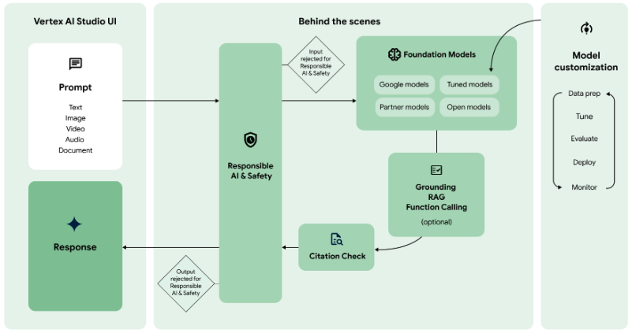
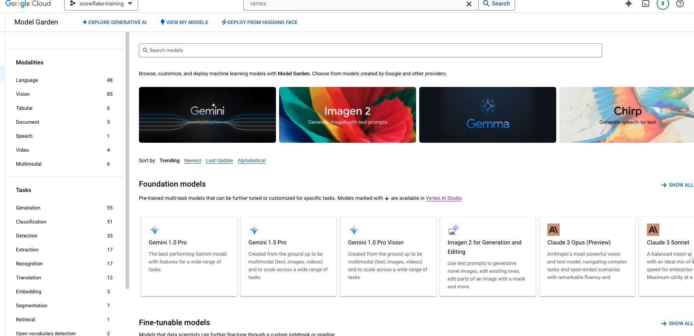
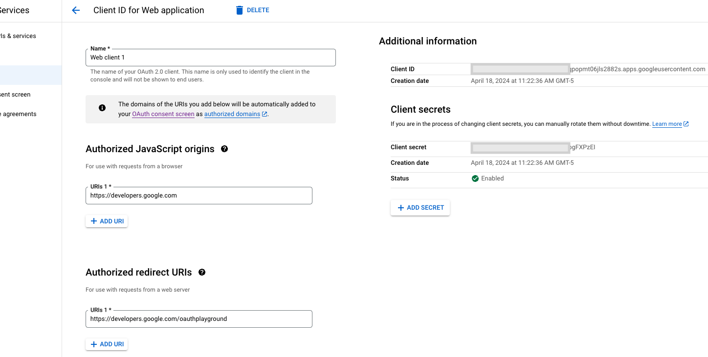
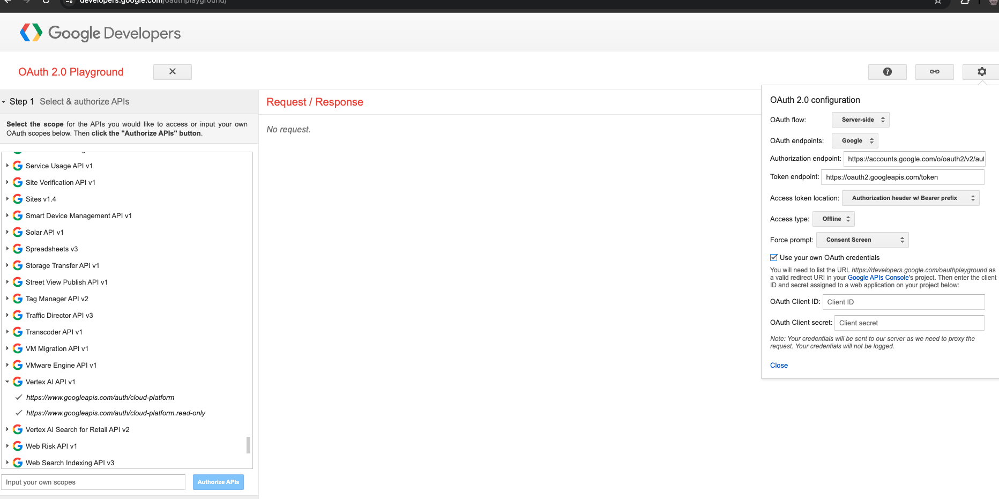
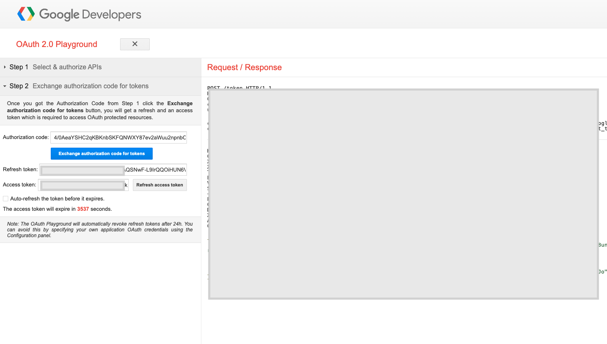
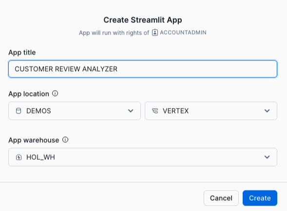
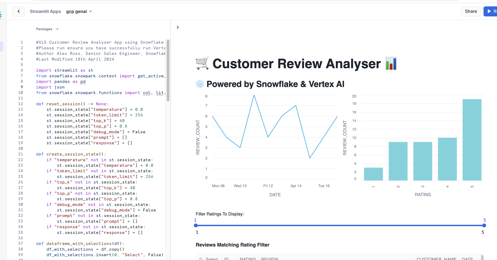

author: Matt Marzillo
id: customer-insights-analyzer-using-vertex-ai-and-snowflake
categories: snowflake-site:taxonomy/solution-center/certification/quickstart, snowflake-site:taxonomy/solution-center/certification/partner-solution, snowflake-site:taxonomy/solution-center/includes/architecture, snowflake-site:taxonomy/product/ai, snowflake-site:taxonomy/snowflake-feature/external-collaboration
language: en
summary: Analyze customer insights with Google Vertex AI and Snowflake for advanced ML-driven segmentation and behavioral analytics.
environments: web
status: Published 
feedback link: https://github.com/Snowflake-Labs/sfguides/issues

# Getting Started with Google, Snowflake and Streamlit for Generative AI
<!-- ------------------------ -->
## Overview


In this quickstart you will build a Streamlit application that leverages Snowpark External Access in Snowflake with Vertex AI and Generative AI to analyze customer reviews.


In summary this is what you will do:
- Set up environments in both Snowflake and Google Cloud Platform
- Create a function that leverages Snowpark External Access to make a call to GCP Vertex AI Generative AI models.
- Create a Streamlit app that leverages the above function to generate responses using data from Snowflake and prompts.

### What is Generative AI?

Generative AI is a category of artificial intelligence techniques that enable machines to create new, original content, such as text, images, or music, by learning from existing data. These models, often based on neural networks, generate content by understanding patterns and structures in the training data and then producing novel examples that resemble what they have learned. Generative AI has applications in various fields, including natural language processing, computer vision, and creative arts.

### Using Generative AI with Google Cloud
Generative AI on Vertex AI  gives you access to many large generative AI models so you can evaluate, tune, and deploy them for use in your AI-powered applications. [This page](https://cloud.google.com/vertex-ai/generative-ai/docs/learn/overview) gives you an overview of the generative AI workflow on Vertex AI, the features and models that are available, and directs you to resources for getting started.

The below diagram shows how to use Google Cloud fot Generative AI.



### What is Snowflake?
Snowflake is a cloud-based data warehousing solution that allows businesses to store and analyze large volumes of data efficiently. It separates storage and compute functionalities, enabling users to scale resources independently and pay only for what they use. Snowflake supports a wide range of data workloads, including data warehousing, data lakes, and data engineering, and offers robust data sharing capabilities across different cloud platforms.

### What is Streamlit?
Streamlit is a Python library that makes it easy to create and share custom web apps for machine learning and data science. In just a few minutes you can build and deploy powerful data apps.

### Pre-requisites
- Familiarity with [Snowflake](/en/developers/guides/getting-started-with-snowflake/) and a Snowflake account
with Access to [Streamlit](https://streamlit.io/) in your Snowflake account.
- [Google Cloud Account](https://cloud.google.com/) with Vertex AI.
- Familiarity with the Python programming language.

### What you’ll build
We will build an efficient architecture all within Snowflake that will access product urls and images in Snowflake and pass that data to a a Google Cloud to generate a response. The architecture will look like this


### Use Case

This use case will leverage sample customer reviews to allow users to analyze them leveraging Generative AI. This quickstart was inspired by the demo built by the venerable Alex Ross. Details on the use case covered in this blog [here](https://cloudydata.substack.com/p/snowflake-and-vertex-ai-foundational)

<!-- ------------------------ -->

## Google Environment


For this quickstart you will need a Google Cloud account with a Vertex AI service enabled. Users can create a trial Google Cloud account [here](cloud.google.com). There will be a cost to run this lab, but if there is it will be nominal.

Once you have your Google Cloud account you will need to create a project then enable the Vertex AI service. Once in the Vertex AI service you can select the model garden tab the left menu bar to view the models available in Vertex AI. For this lab we will be using the Palm Bison model for text generation.



Once you have the Vertex AI service enabled in your Google Cloud Project head to "APIs and Services", click "Create Credentials" select "OAuth Client ID" then provide any name you would like and generate the client id. Note the Client ID and Client Secret.



Now, go to https://developers.google.com/oauthplayground/ scroll down to the left menu bar, select "Vertex AI API..." and select both options. Click on the settings gear menu in the top right, select "Use your own OAuth credentials" and enter the Client ID and Secret from the previous step. Close the settings. Click "Authorize APIs".




Click "Exchange authorization code for tokens" and note the "Refresh Token".




<!-- ------------------------ -->
## Snowflake Environment


Open a SQL Worksheet (from the Projects tab) in the Snowflake UI and Copy and paste the below code into your Snowflake worksheet, this will create a table with customer reviews. For the sake of the quickstart we are using the ACCOUNTADMIN role, but in practice you will likely want to use a different, organization specific role.

Important to note that in this quickstart we will be using the requests package to make the external call to [Vertex Rest API](https://cloud.google.com/vertex-ai/generative-ai/docs/model-reference/text). In the Summer of '24 the Snowflake environment will support the [Vertex AI SDK](https://cloud.google.com/vertex-ai/docs/python-sdk/use-vertex-ai-python-sdk) in the [Snowflake Anaconda Channel](https://docs.snowflake.com/en/developer-guide/udf/python/udf-python-packages).


```sql
--create database and warehouse
use role accountadmin;
CREATE OR REPLACE WAREHOUSE HOL_WH WITH WAREHOUSE_SIZE='X-SMALL';
CREATE DATABASE DEMOS;
CREATE SCHEMA VERTEX;
USE WAREHOUSE HOL_WH

--create stage
USE DATABASE DEMOS;
USE SCHEMA VERTEX;
CREATE OR REPLACE STAGE CUSTOMER_REVIEWS_STAGE
URL='s3://hol-qs-bucket/'
FILE_FORMAT = (TYPE = 'csv');

--create loan_one table
CREATE OR REPLACE TABLE REVIEWS
  (ID STRING,
   RATING STRING,
   REVIEW STRING,
   CUSTOMER_NAME STRING,
   REVIEW_DATE DATE);

COPY INTO REVIEWS FROM @CUSTOMER_REVIEWS_STAGE/Customer_Reviews.csv
FILE_FORMAT = (TYPE = 'CSV' FIELD_OPTIONALLY_ENCLOSED_BY = '"' ESCAPE_UNENCLOSED_FIELD = '\\' SKIP_HEADER = 1) ON_ERROR = 'CONTINUE';

select top 10 * from REVIEWS;
```

<!-- ------------------------ -->
## Snowpark External Access to call Vertex AI


Now we will work through the below code in a new Snowflake SQL worksheet. This code creates several objects that allows Snowflake to access Vertex models via a stored procedure and function that leverage a network rule and a Snowpark External Access object that allows Snowflake to securely make requests to Vertex AI (or any other external service).

You will have to replace several values that you previously noted as well as your Google deployment region and Google Project ID.

```sql
--Snowflake External Access + Vertex GenAI API Demo
--This demo shows how to use External Access in Snowflake to call the Vertex GenAI Palm2 LLM: https://cloud.google.com/vertex-ai/generative-ai/docs/model-reference/text
--Author Alex Ross, Senior Sales Engineer, Snowflake
--Last Modified 16th April 2024

--Create demo database/schema
USE ROLE ACCOUNTADMIN;
USE DATABASE DEMOS;
USE SCHEMA VERTEX;

--Create Security Integration For GCP OAuth
--Visit https://console.cloud.google.com/apis/credentials to generate OAuth 2.0 Client IDs
CREATE OR REPLACE SECURITY INTEGRATION vertex_access_integration
  TYPE = API_AUTHENTICATION
  AUTH_TYPE = OAUTH2
  OAUTH_CLIENT_ID = '<CLIENT ID>'
  OAUTH_CLIENT_SECRET = '<CLIENT SECRET>'
  OAUTH_TOKEN_ENDPOINT = 'https://oauth2.googleapis.com/token'
  OAUTH_AUTHORIZATION_ENDPOINT = 'https://accounts.google.com/o/oauth2/auth'
  OAUTH_ALLOWED_SCOPES = ('https://www.googleapis.com/auth/cloud-platform', 'https://<GOOGLE REGION>-aiplatform.googleapis.com')
  ENABLED = TRUE;
GRANT ALL ON INTEGRATION vertex_access_integration to ROLE PUBLIC;

--Create Secret to hold GCP OAuth refresh token
--Visit https://developers.google.com/oauthplayground/ to generate OAuth refresh token using client ID and secret 
CREATE OR REPLACE SECRET vertex_oauth_token
TYPE = OAUTH2
API_AUTHENTICATION = vertex_access_integration
OAUTH_REFRESH_TOKEN ='<REFRESH TOKEN>';
GRANT USAGE ON SECRET vertex_oauth_token to role PUBLIC;
GRANT READ ON SECRET vertex_oauth_token to role PUBLIC;

--Create Network Rule to allow connectivity with Google API endpoints
CREATE OR REPLACE NETWORK RULE gcp_apis_network_rule
  MODE = EGRESS
  TYPE = HOST_PORT
  VALUE_LIST = ('<GOOGLE REGION>-aiplatform.googleapis.com','oauth2.googleapis.com','accounts.google.com','www.googleapis.com:443');
  
--Create The External Access Integration
CREATE OR REPLACE EXTERNAL ACCESS INTEGRATION GCP_APIS_ACCESS_INTEGRATION
  ALLOWED_NETWORK_RULES = (gcp_apis_network_rule)
  ALLOWED_AUTHENTICATION_SECRETS = (vertex_oauth_token)
  ENABLED = true;
GRANT ALL ON INTEGRATION GCP_APIS_ACCESS_INTEGRATION TO ROLE PUBLIC;

--Create SP to handle Rest API call to Vertex GenAI endpoint
--Returns a string response based on prompt and parameters provided to the SP 
CREATE OR REPLACE PROCEDURE GET_VERTEX_TEXT_GENERATION("PROMPT" VARCHAR(16777216), "TEMPERATURE" FLOAT, "MAX_OUTPUT_TOKENS" NUMBER(38,0), "TOP_P" FLOAT, "TOP_K" FLOAT)
RETURNS VARCHAR(16777216)
LANGUAGE PYTHON
RUNTIME_VERSION = '3.8'
PACKAGES = ('snowflake-snowpark-python','requests')
HANDLER = 'get_text_generation'
EXTERNAL_ACCESS_INTEGRATIONS = (GCP_APIS_ACCESS_INTEGRATION)
SECRETS = ('cred'=VERTEX_OAUTH_TOKEN)
EXECUTE AS OWNER
AS '
import _snowflake
import requests
import json

def get_text_generation(session, prompt, temperature, max_output_tokens, top_p, top_k):
    PROJECT_ID=''<GOOGLE PROJECT ID>''
    LOCATION=''<GOOGLE REGION>>''
    token = _snowflake.get_oauth_access_token(''cred'')
    url = f''https://{LOCATION}-aiplatform.googleapis.com/v1/projects/{PROJECT_ID}/locations/{LOCATION}/publishers/google/models/text-bison:predict''
    d = {''instances'':[{''prompt'': prompt}],
         ''parameters'':{''temperature'': temperature,
                ''maxOutputTokens'': max_output_tokens,
                ''topK'': top_k,
                ''topP'': top_p
            }
        }
    h = {
            ''Authorization'': ''Bearer '' + token,
            ''Content-Type'': ''application/json; charset=utf-8''
        }

    try:
        response = requests.post(url, data=json.dumps(d), headers=h)
        data = response.json()
        return data[''predictions''][0][''content'']
    except:
        return requests.post(url, data=json.dumps(d), headers=h).json()
 
';

call get_vertex_text_generation('why is snowflake the best data platform?',0.2,256,0.95,2); --Test SP is working as expected

--Create a UDF to handle Rest API call to Vertex GenAI endpoint
--This UDF is designed to be used to analyse a customer review
--Returns a variant/json response based on prompt and parameters provided to the UDF 
CREATE OR REPLACE FUNCTION GET_VERTEX_REVIEW_SENTIMENT_UDF("PROMPT" VARCHAR(16777216), "TEMPERATURE" FLOAT, "MAX_OUTPUT_TOKENS" NUMBER(38,0), "TOP_P" FLOAT, "TOP_K" FLOAT)
RETURNS VARIANT
LANGUAGE PYTHON
RUNTIME_VERSION = '3.8'
PACKAGES = ('snowflake-snowpark-python','requests')
HANDLER = 'GET_VERTEX_REVIEW_SENTIMENT'
EXTERNAL_ACCESS_INTEGRATIONS = (GCP_APIS_ACCESS_INTEGRATION)
SECRETS = ('cred'=VERTEX_OAUTH_TOKEN)
AS '
import _snowflake
import requests
import json

def GET_PREPROMPT():
    preprompt = ''For the given review, return a JSON object that has the fields sentiment, explanation, summary, and product. Acceptable values for sentiment are Positive or Negative. The explanation field contains text that explains the sentiment. The summary field contains a single sentence summarizing the review in under 10 words. The product field contains the name or type of product purchased if it has been included in the review. DO NOT INCLUDE BACKTICKS IN THE RESPONSE. Review: ''
    return preprompt

def GET_VERTEX_REVIEW_SENTIMENT(prompt, temperature, max_output_tokens, top_p, top_k):
    PROJECT_ID=''<GOOGLE PROJECT ID>''
    LOCATION=''<GOOGLE REGION>''
    token = _snowflake.get_oauth_access_token(''cred'')
    url = f''https://{LOCATION}-aiplatform.googleapis.com/v1/projects/{PROJECT_ID}/locations/{LOCATION}/publishers/google/models/text-bison:predict''
    d = {''instances'':[{''prompt'': GET_PREPROMPT() + prompt}],
         ''parameters'':{''temperature'': temperature,
                ''maxOutputTokens'': max_output_tokens,
                ''topK'': top_k,
                ''topP'': top_p
            }
        }
    h = {
            ''Authorization'': ''Bearer '' + token,
            ''Content-Type'': ''application/json; charset=utf-8''
        }

    try:
        response = requests.post(url, data=json.dumps(d), headers=h)
        data = response.json()
        return json.loads(data[''predictions''][0][''content''])
    except:
        return requests.post(url, data=json.dumps(d), headers=h).json()
';
GRANT USAGE ON FUNCTION GET_VERTEX_REVIEW_SENTIMENT_UDF(VARCHAR(16777216), FLOAT, NUMBER(38,0), FLOAT, FLOAT) TO ROLE PUBLIC;

select GET_VERTEX_REVIEW_SENTIMENT_UDF('This is a shoe I will wear with black dress pants or jeans when I need comfort and a little style, but I am not impressed. This is a very flimsy shoe with little support at all. Unlike any other shoes I''ve purchased in the past. It looks nice, but it''s not comfortable.',0.2,256,0.95,2) as RESPONSE; --Test UDF
```

<!-- ------------------------ -->

## Build Streamlit App - With data in Snowflake 


Now that we have our VertexAI Function and Stored Procedure let's build a Streamlit app to analyze customer reviews.

Go back to the main account view by clicking ‘<- Worksheets’ and then select ‘Streamlit’.

Make sure that you’re still using the ‘ACCOUNTADMIN’ role and then create a new Streamlit app, which should open the app editor directly. You can access this app from the Streamlit view, but make sure to use the same role and that the app is in the same RDEMOS.VERTEX database and schema where the reviews table is located. You can name the app whatever you would like, something like "Customer Review Analyzer" is appropriate.



Once the app is created paste the below code into the app code and click 'Run' in order to create the Streamlit App!

```python
#SiS Customer Review Analyser App using Snowflake External Access & Vertex AI
#Please run ensure you have successfully run Vertex_Demo.sql and created the GET_VERTEX_REVIEW_SENTIMENT_UDF Function
#Author Alex Ross, Senior Sales Engineer, Snowflake
#Last Modified 18th April 2024

import streamlit as st
from snowflake.snowpark.context import get_active_session
import pandas as pd
import json
from snowflake.snowpark.functions import col, lit, sum as sum_, max as max_, count as count_

def reset_session() -> None:
    st.session_state["temperature"] = 0.0
    st.session_state["token_limit"] = 256
    st.session_state["top_k"] = 40
    st.session_state["top_p"] = 0.8
    st.session_state["debug_mode"] = False
    st.session_state["prompt"] = []
    st.session_state["response"] = []

def create_session_state():
    if "temperature" not in st.session_state:
        st.session_state["temperature"] = 0.0
    if "token_limit" not in st.session_state:
        st.session_state["token_limit"] = 256
    if "top_k" not in st.session_state:
        st.session_state["top_k"] = 40
    if "top_p" not in st.session_state:
        st.session_state["top_p"] = 0.8
    if "debug_mode" not in st.session_state:
        st.session_state["debug_mode"] = False
    if "prompt" not in st.session_state:
        st.session_state["prompt"] = []
    if "response" not in st.session_state:
        st.session_state["response"] = []

def dataframe_with_selections(df):
    df_with_selections = df.copy()
    df_with_selections.insert(0, "Select", False)

    # Get dataframe row-selections from user with st.data_editor
    edited_df = st.data_editor(
        df_with_selections,
        hide_index=True,
        column_config={"Select": st.column_config.CheckboxColumn(required=True)},
        disabled=df.columns,
    )

    # Filter the dataframe using the temporary column, then drop the column
    selected_rows = edited_df[edited_df.Select]
    return selected_rows.drop('Select', axis=1)

def write_customer_review(selection, index):
    st.title(":snowflake: :green[Customer Review]")   
    st.write("**Customer**: " + selection["CUSTOMER_NAME"][index])
    st.write('**Review**: ' + selection["REVIEW"][index])
    st.write('**Review Date**: ' + str(selection["REVIEW_DATE"][index]))
    st.write('**Rating**: ' + str(selection["RATING"][index]))

def write_vertex_response(json_resp):
    col1, col2 = st.columns([2,20])
    with col1:
        st.image('https://lh3.googleusercontent.com/e5M3Bi_o8iVajobAcS0LLDDJ2RN4LzchraKjfEKWvXaTkBw2WU50kuTnF6xHzMOifL6DMe16SCUqNt5w2gB9ZA=w80-h80', width=60)
    with col2:
        st.title(":blue[Vertex AI] Response")
    st.write("**Summary**: " + json_resp["summary"])
    st.write("**Product**: " + json_resp["product"])
    st.write("**Sentiment**: " + json_resp["sentiment"])
    st.write("**Explanation**: " + json_resp["explanation"])

st.set_page_config(
    page_title="Customer Review Analyser",
    page_icon=":snowflake:",
    layout="wide",
    initial_sidebar_state="collapsed",
    menu_items={
        "About": "# This app is a sample customer review analyser using Snowflake External Access & the Vertex PaLM Text Generator API"
    },
)

with st.sidebar:
    st.image('https://raw.githubusercontent.com/GoogleCloudPlatform/generative-ai/main/language/sample-apps/chat-streamlit/image/sidebar_image.jpg', width=None)
    st.write("Model Settings:")

    # define the temeperature for the model
    temperature_value = st.slider("Temperature :", 0.0, 1.0, 0.2)
    st.session_state["temperature"] = temperature_value

    # define the temeperature for the model
    token_limit_value = st.slider("Token limit :", 1, 1024, 256)
    st.session_state["token_limit"] = token_limit_value

    # define the temeperature for the model
    top_k_value = st.slider("Top-K  :", 1, 40, 40)
    st.session_state["top_k"] = top_k_value

    # define the temeperature for the model
    top_p_value = st.slider("Top-P :", 0.0, 1.0, 0.8)
    st.session_state["top_p"] = top_p_value

    if st.button("Reset Session"):
        reset_session()

# creating session states
create_session_state()

st.title(":shopping_trolley: Customer Review Analyser 	:bar_chart:")
st.subheader(":snowflake: Powered by Snowflake & Vertex AI")
session = get_active_session()

df_reviews = session.table("DEMOS.VERTEX.REVIEWS")

col1, col2 = st.columns(2)
with col1:
    chart_data = df_reviews.group_by("REVIEW_DATE").agg((count_("*")).alias("REVIEW_COUNT"))
    st.line_chart(chart_data, x = chart_data.columns[0], y = chart_data.columns[1], color="#29B5E8")
with col2:
    chart_data = df_reviews.group_by("RATING").agg((count_("*")).alias("REVIEW_COUNT"))
    st.bar_chart(chart_data, x = chart_data.columns[0], y = chart_data.columns[1], color = "#71D3DC")

rating_min, rating_max = st.select_slider('Filter Ratings To Display:',options=[1,2,3,4,5],value=(1, 5))

if rating_min or rating_max:
    st.write("**Reviews Matching Rating Filter**")
    reviews = df_reviews.filter(f"RATING >= {rating_min} AND RATING <={rating_max}").to_pandas()  
    selection = dataframe_with_selections(reviews)

    st.write("Current Vertex AI Settings: ")
    # if st.session_state['temperature'] or st.session_state['debug_mode'] or :
    st.write(
        "Temperature: ",
        st.session_state["temperature"],
        " \t \t Token limit: ",
        st.session_state["token_limit"],
        " \t \t Top-K: ",
        st.session_state["top_k"],
        " \t \t Top-P: ",
        st.session_state["top_p"],
        " \t \t Debug Model: ",
        st.session_state["debug_mode"],
    )
    
    if st.button("Submit To Vertex GenAI"):
        if selection.empty:
            st.write("Please select at least one review to submit to Vertex AI")
        for index in selection.index:
            session = get_active_session()
            col1, col2 = st.columns(2)
            with col1:
                write_customer_review(selection, index)
            with col2:        
                with st.spinner("PaLM is working to generate, wait....."):
                    review = selection["REVIEW"][index].replace("'", "\\'")
                    response = session.sql(f"SELECT DEMOS.VERTEX.GET_VERTEX_REVIEW_SENTIMENT_UDF(\
                        '{review}',\
                        '{st.session_state['temperature']}',\
                        '{st.session_state['token_limit']}',\
                        '{st.session_state['top_p']}',\
                        '{st.session_state['top_k']}') AS RESPONSE")
                    json_resp = json.loads(response.to_pandas()["RESPONSE"][0])
                    write_vertex_response(json_resp)
            st.markdown("""---""")
        
```

The Streamlit app provides a visual representation of the data stored in the REVIEWS table in Snowflake and enables a user to filter on the review rating. From here the user can select multiple reviews they would like to process via Vertex AI to obtain the sentiment, explanation, product name, and summary of the review. 



In addition to this app users can build a second app that leverages the Stored Procedure that we created using the Streamlit Python code below.

```python
#SiS version of Google sample app using Snowflake External Access
#Original code: https://github.com/GoogleCloudPlatform/generative-ai/tree/main/language/sample-apps/chat-streamlit
#Please run ensure you have successfully run Vertex_Demo.sql and created the GET_VERTEX_TEXT_GENERATION Stored Procedure
#Author Alex Ross, Senior Sales Engineer, Snowflake
#Last Modified 18th April 2024

import streamlit as st
from snowflake.snowpark.context import get_active_session

def reset_session() -> None:
    st.session_state["temperature"] = 0.0
    st.session_state["token_limit"] = 256
    st.session_state["top_k"] = 40
    st.session_state["top_p"] = 0.8
    st.session_state["debug_mode"] = False
    st.session_state["prompt"] = []
    st.session_state["response"] = []

def hard_reset_session() -> None:
    st.session_state = {states: [] for states in st.session_state}

def create_session_state():
    if "temperature" not in st.session_state:
        st.session_state["temperature"] = 0.0
    if "token_limit" not in st.session_state:
        st.session_state["token_limit"] = 256
    if "top_k" not in st.session_state:
        st.session_state["top_k"] = 40
    if "top_p" not in st.session_state:
        st.session_state["top_p"] = 0.8
    if "debug_mode" not in st.session_state:
        st.session_state["debug_mode"] = False
    if "prompt" not in st.session_state:
        st.session_state["prompt"] = []
    if "response" not in st.session_state:
        st.session_state["response"] = []

st.set_page_config(
    page_title="Vertex PaLM Text Generation API",
    page_icon=":robot:",
    layout="centered",
    initial_sidebar_state="expanded",
    menu_items={
        "About": "# This app shows you how to use Vertex PaLM Text Generator API"
    },
)

# creating session states
create_session_state()

st.image('https://raw.githubusercontent.com/GoogleCloudPlatform/generative-ai/main/language/sample-apps/chat-streamlit/image/palm.jpg', width=None)
st.title(":red[PaLM 2] :blue[Vertex AI] Text Generation")

with st.sidebar:
    st.image('https://raw.githubusercontent.com/GoogleCloudPlatform/generative-ai/main/language/sample-apps/chat-streamlit/image/sidebar_image.jpg', width=None)
    st.write("Model Settings:")

    # define the temeperature for the model
    temperature_value = st.slider("Temperature :", 0.0, 1.0, 0.2)
    st.session_state["temperature"] = temperature_value

    # define the temeperature for the model
    token_limit_value = st.slider("Token limit :", 1, 1024, 256)
    st.session_state["token_limit"] = token_limit_value

    # define the temeperature for the model
    top_k_value = st.slider("Top-K  :", 1, 40, 40)
    st.session_state["top_k"] = top_k_value

    # define the temeperature for the model
    top_p_value = st.slider("Top-P :", 0.0, 1.0, 0.8)
    st.session_state["top_p"] = top_p_value

    if st.button("Reset Session"):
        reset_session()


with st.container():
    st.write("Current Generator Settings: ")
    # if st.session_state['temperature'] or st.session_state['debug_mode'] or :
    st.write(
        "Temperature: ",
        st.session_state["temperature"],
        " \t \t Token limit: ",
        st.session_state["token_limit"],
        " \t \t Top-K: ",
        st.session_state["top_k"],
        " \t \t Top-P: ",
        st.session_state["top_p"],
        " \t \t Debug Model: ",
        st.session_state["debug_mode"],
    )

    prompt = st.text_area("Add your prompt: ", height=100)
    if prompt:
        st.session_state["prompt"].append(prompt)
        session = get_active_session()
        with st.spinner("PaLM is working to generate, wait....."):
            response = session.call("DEMOS.VERTEX.get_vertex_text_generation",
                prompt,
                st.session_state["temperature"],
                st.session_state["token_limit"],
                st.session_state["top_p"],
                st.session_state["top_k"],
            )
            st.session_state["response"].append(response)
            st.markdown(response)
```

<!-- ------------------------ -->
## Conclusion  And Resources


Congratulations! You've successfully built your first Streamlit App with Vertex AI LLMs. After setting up our Google Cloud and Snowflake environments we built two primary things: a set of a UDF and stored procedures that utilize Snowpark External Access to make a call to a Vertex AI model and a Streamlit app that leverages that function to make a simple and useful app that can be shared within an organization. With these two, easy to build, Snowflake features we expect customers to see value quickly when using Snowflake and Vertex AI.

### What You Learned

- How to set up a Snowflake and Google Cloud environment to integrate the two platforms.
- How to build a Snowpark External Access integration to call Vertex AI.
- How to build a Streamlit app that calls Vertex AI leveraging tabular and image data from Snowflake.
- How to build your first Generative AI App with Vertex AI and Snowflake!


### Related resources 
- [RBAC with External Services](https://www.youtube.com/watch?v=fALb8SosA_U)

- [Prompting](https://github.com/VILA-Lab/ATLAS/blob/main/data/README.md)

- [Streamlit](https://streamlit.io/)

- [Blog on this use case](https://cloudydata.substack.com/p/snowflake-and-vertex-ai-foundational)

- [Download Reference Architecture](/content/dam/snowflake-site/developers/2024/05/Customer-Insights-Analyzer-using-Vertex-Generative-AI-and-Snowflake.pdf)

- [Read the Blog](https://medium.com/@cloudydata/customer-insights-analyzer-using-vertex-generative-ai-and-snowflake-8f8150316da9)

- [Watch the Demo](https://youtu.be/8VSIB_XpoMU?list=TLGGjtrk5Hd7gNQyMjA5MjAyNQ)

If you have any questions, reach out to your Snowflake account team!
