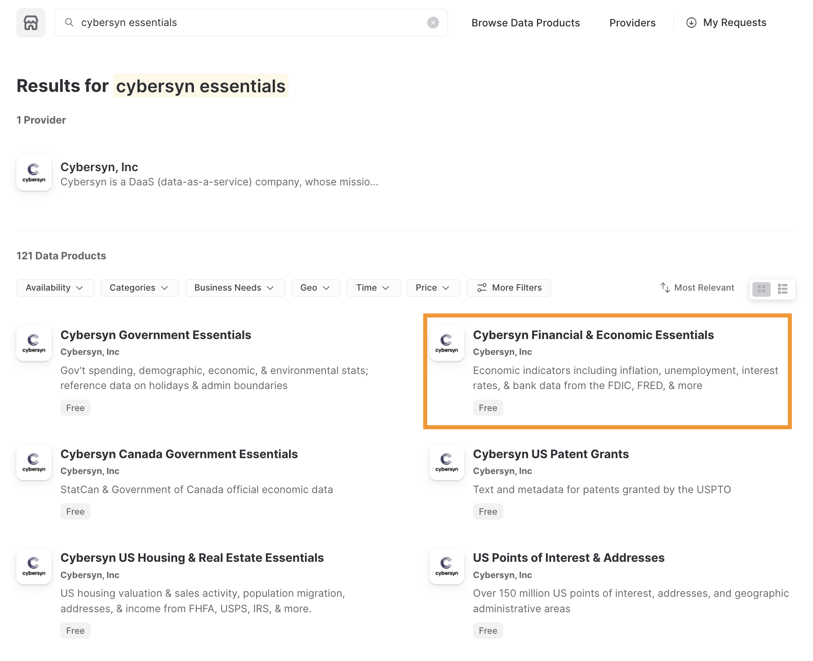
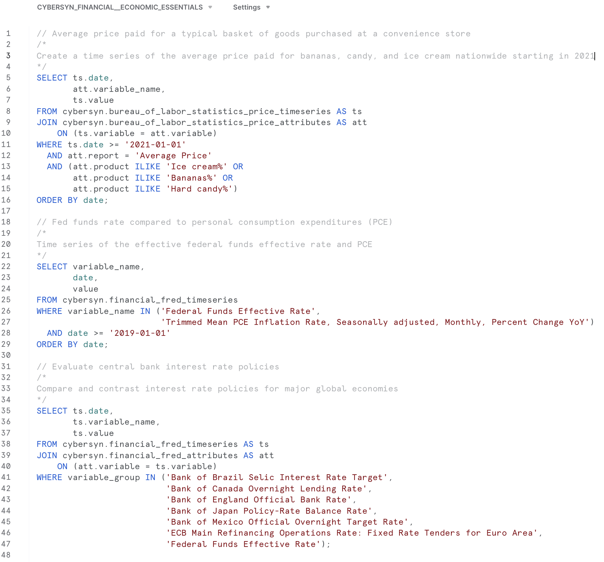
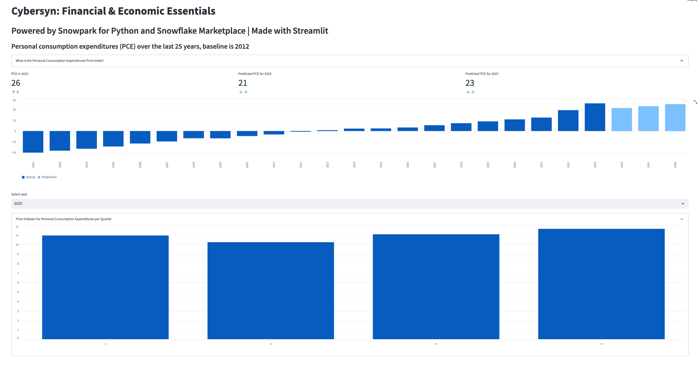

author: 
id: data-apps-summit-lab-it
categories: snowflake-site:taxonomy/solution-center/certification/quickstart, snowflake-site:taxonomy/product/applications-and-collaboration, snowflake-site:taxonomy/snowflake-feature/marketplace-and-integrations, snowflake-site:taxonomy/snowflake-feature/build
language: it
summary: questo è un esempio di guida di Snowflake
environments: web
status: Published 
feedback link: https://github.com/Snowflake-Labs/sfguides/issues


# Creare una data application con il Marketplace Snowflake, Snowpark e Streamlit

## Panoramica

In questo lab pratico creerai una data application che utilizza il data set Economical Data Atlas pubblicato da Knoema nel Marketplace Snowflake.

Elaborerai i dati con Snowpark, svilupperai un semplice modello ML e creerai una User Defined Function (UDF) Python in Snowflake, quindi visualizzerai i dati con Streamlit.

### Tecnologia e funzionalità chiave

* Marketplace Snowflake
* Snowpark per Python
* Librerie Python
* User Defined Function (UDF) Python
* Streamlit

### Prerequisiti

* Accesso con il ruolo ACCOUNTADMIN in Snowflake o un account di prova Snowflake: [https://signup.snowflake.com/](https://signup.snowflake.com/?utm_source=snowflake-devrel&utm_medium=developer-guides&utm_cta=developer-guides)
* Conoscenza di base di SQL, dei concetti di database e degli oggetti
* Familiarità con Python. Tutto il codice necessario viene fornito durante il workshop.
* La possibilità di installare ed eseguire software sul tuo computer
* [VS Code](https://code.visualstudio.com/download) installato

### Cosa imparerai

* Come utilizzare data set nel Marketplace Snowflake.
* Come eseguire query sui dati in Python utilizzando i DataFrame
* Come sfruttare librerie Python esistenti
* Come creare una User Defined Function Snowpark Python in Snowflake
* Come creare una data application con Streamlit per visualizzare i dati

### Cosa realizzerai

* Un notebook Python che si connette a Snowflake con Snowpark per Python e prepara le caratteristiche per l’addestramento di un modello di regressione lineare.
* Una User Defined Function (UDF) Snowflake basata su un modello addestrato Python
* Una data application dashboard Streamlit

<!-- ------------------------ -->

## Preparare l’ambiente del workshop


1. Installa conda per gestire un ambiente separato eseguendo il comando pip install conda. NOTA: in alternativa puoi utilizzare [Miniconda](https://docs.conda.io/en/latest/miniconda.html)
2. Apri il Terminale o il prompt dei comandi

> 
IMPORTANTE: se usi un computer con chip Apple M1, segui [queste istruzioni](https://docs.snowflake.com/en/developer-guide/snowpark/python/setup) per creare l’ambiente virtuale e installare Snowpark Python invece della procedura descritta qui.

3. Crea l’ambiente eseguendo `conda create --name snowpark -c https://repo.anaconda.com/pkgs/snowflake python=3.8`
4. Attiva l’ambiente conda eseguendo `conda activate snowpark`
5. Installa Snowpark per Python, Pandas e scikit-learn eseguendo `conda install -c https://repo.anaconda.com/pkgs/snowflake snowflake-snowpark-python pandas scikit-learn`
6. Installa Streamlit eseguendo `pip install streamlit` o `conda install streamlit`
7. Crea una cartella, ad esempio “Summit HOL PCE”, e scarica/salva i file del workshop in quella cartella.
    * Link ai file necessari: https://drive.google.com/drive/folders/1CN6Ljj59XWv2B3Epqxk4DtfDmCH1co_Q?usp=sharing

---

### Risoluzione dei problemi relativi a `pyarrow`

- Se la libreria `pyarrow` è già installata nel tuo sistema, disinstallala prima di installare Snowpark.
- Se `pyarrow` non è installata, non c’è bisogno di farlo separatamente: la versione appropriata verrà installata automaticamente insieme a Snowpark.
- Non reinstallare una versione diversa di `pyarrow` dopo avere installato Snowpark.

<!-- ------------------------ -->
## Preparare l’ambiente Snowflake


### Lavorare con il Marketplace Snowflake

Il Marketplace Snowflake fornisce visibilità a un’ampia varietà di data set offerti da custodi di dati di terze parti che ampliano l’accesso a punti dati in grado di trasformare i processi aziendali. Inoltre, il Marketplace Snowflake elimina la necessità di integrare e modellare i dati, assicurando l’accesso sicuro a data set interamente gestiti dal provider di dati.


Prima di iniziare a esaminare l’utilizzo dei data set del Marketplace Snowflake, verifica di avere installato una versione di prova di Snowflake. In caso contrario, fai clic su Install Snowflake Trial. Con un account di prova attivo e dopo avere effettuato l’accesso alla console Snowflake, esegui i seguenti passaggi.


* Nell’angolo superiore destro, verifica di avere effettuato l’accesso come ACCOUNTADMIN; in caso contrario, cambia ruolo
* Fai clic su Marketplace
* Nella barra di ricerca, digita: Knoema Economy, quindi fai clic sul riquadro dal titolo Economy Data Atlas.




* Nell’angolo superiore destro, seleziona Get Data
* Seleziona i ruoli appropriati per accedere al database che stiamo creando e accetta i termini per i data consumer di Snowflake e i termini di utilizzo di Knoema.
* Crea il database


## 


* A questo punto puoi selezionare Query Data per aprire un foglio di lavoro con alcune query di esempio.




* Ci interessano i dati sull’inflazione negli Stati Uniti, quindi utilizzeremo questa query per esplorare i dati per l’applicazione: `What is the US inflation over time?`

    ``` SQL
    SELECT * FROM "ECONOMY"."BEANIPA" 
    WHERE "Table Name" = 'Price Indexes For Personal Consumption Expenditures By Major Type Of Product' 
    AND "Indicator Name" = 'Personal consumption expenditures (PCE)' 
    AND "Frequency" = 'A' 
    ORDER BY "Date"
    ```

### Creare un nuovo database

Ora che abbiamo creato un database con i dati di Economy Data Atlas, dobbiamo creare un database per la nostra applicazione in cui memorizzare la User Defined Function.

Seleziona “Worksheets” dal menu Home di Snowflake. Crea un nuovo foglio di lavoro selezionando il pulsante 


.

Nel foglio di lavoro, copia questo script:


``` SQL
-- First create database using the Knoema Economical Data Atlas 
-- Go to Marketplace to get database

-- Setup database, need to be logged in as accountadmin role */ 
--Set role and warehouse (compute) 
USE ROLE accountadmin; 
USE WAREHOUSE compute_wh;

--Create database and stage for the Snowpark Python UDF 
CREATE DATABASE IF NOT EXISTS summit_hol; 
CREATE STAGE IF NOT EXISTS udf_stage;

--Test the data 
-- What is the size? 
SELECT COUNT(*) FROM ECONOMY_DATA_ATLAS.ECONOMY.BEANIPA;

-- What is the US inflation over time? 
SELECT * FROM 
ECONOMY_DATA_ATLAS.ECONOMY.BEANIPA 
WHERE "Table Name" = 'Price Indexes For Personal Consumption Expenditures By Major Type Of Product' 
AND "Indicator Name" = 'Personal consumption expenditures (PCE)' 
AND "Frequency" = 'A' 
ORDER BY "Date" ;

-- Now create UDF in VS Code / Notebook 
-- Once we created the UDF with the Python Notebook we can test the UDF 
SELECT predict_pce_udf(2021); 
```

<!-- ------------------------ -->

## Esplorare i dati con un notebook (Jupyter)


Ora che abbiamo un database da utilizzare per l’applicazione, vogliamo esplorare i dati e creare un modello ML in una User Defined Function (UDF) utilizzabile dalla nostra applicazione.

Apri VS Code, quindi apri la cartella contenente gli script Python che abbiamo creato in precedenza.

Puoi aprire il notebook Python (my_snowpark_pce.ipynb) e lo script dell’applicazione Streamlit (my_snowpark_streamlit_app_pce.py). Esamineremo in sequenza le varie sezioni del codice.

VS Code potrebbe richiedere l’ambiente Python: \


Assicurati di selezionare l’ambiente conda ‘snowpark’ creato in precedenza.

Puoi selezionare l’interprete facendo clic nell’angolo inferiore destro: \


### Inizializzare il notebook, importare le librerie e creare la connessione a Snowflake

Per iniziare, creiamo uno script Python e aggiungiamo le istruzioni di importazione per includere le librerie richieste.


``` python 
from snowflake.snowpark.session import Session 
from snowflake.snowpark.types import IntegerType, FloatType 
from snowflake.snowpark.functions import avg, sum, col, udf, call_udf, call_builtin, year 
import streamlit as st 
import pandas as pd 
from datetime import date

# scikit-learn (install: pip install -U scikit-learn)
from sklearn.linear_model import LinearRegression 
```


### Effettuare la connessione a Snowflake

In questo passaggio creerai un [oggetto sessione](https://docs.snowflake.com/en/LIMITEDACCESS/snowpark-python.html#creating-a-session) per effettuare la connessione a Snowflake. Qui utilizzeremo un metodo rapido per farlo, ma tieni presente che negli ambienti di produzione non è consigliato specificare le credenziali direttamente nel codice. In un ambiente di produzione, un approccio migliore sarebbe caricare le credenziali da [AWS Secrets Manager](https://github.com/iamontheinet/sf-code-snippets/blob/main/aws_secrets_manager_sf_connection.py) o da [Azure Key Vault](https://github.com/iamontheinet/sf-code-snippets/blob/main/azure_key_vault_sf_connection.py), ad esempio.

Utilizzeremo il database che abbiamo creato nella sezione Preparare l’ambiente Snowflake.


``` python
# Session
connection_parameters = { 
    "account": "<account_identifier>", 
    "user": "<username>", 
    "password": "<password>", 
    "warehouse": "compute_wh", 
    "role": "accountadmin", 
    "database": "summit_hol", 
    "schema": "public" 
} 
session = Session.builder.configs(connection_parameters).create()
# test if we have a connection
session.sql("select current_warehouse() wh, current_database() db, current_schema() schema, current_version() v").show() 
```


Nel frammento di codice precedente, sostituisci le variabili delimitate da “<>” con i tuoi valori.


### Interrogare i dati utilizzando un’istruzione SQL e con il DataFrame Snowpark

In questo passaggio interrogheremo i dati seguendo il metodo tradizionale che consiste nell’eseguire un’istruzione SQL nell’oggetto sessione, in modo analogo alle query sui dati con il connettore Snowflake per Python.


``` python
# SQL query to explore the data
session.sql("SELECT * FROM ECONOMY_DATA_ATLAS.ECONOMY.BEANIPA WHERE \"Table Name\" = 'Price Indexes For Personal Consumption Expenditures By Major Type Of Product' AND \"Indicator      Name\" = 'Personal consumption expenditures (PCE)' AND \"Frequency\" = 'A' ORDER BY \"Date\"").show() 
```


Ora interrogheremo i dati utilizzando un DataFrame Snowpark. Poiché Snowpark utilizza la valutazione lazy, vengono create la query e le condizioni di filtro, quindi il metodo _show()_ le invia al server Snowflake dove viene eseguita la query. Questo riduce la quantità di dati scambiati tra Snowflake e il client o l’applicazione.


``` python
# Now use Snowpark dataframe
snow_df_pce = (session.table("ECONOMY_DATA_ATLAS.ECONOMY.BEANIPA") 
                            .filter(col('Table Name') == 'Price Indexes For Personal Consumption Expenditures By Major Type Of Product') 
                            .filter(col('Indicator Name') == 'Personal consumption expenditures (PCE)') 
                            .filter(col('"Frequency"') == 'A') 
                            .filter(col('"Date"') >= '1972-01-01')) 
snow_df_pce.show() 
```


### Creare caratteristiche per l’addestramento ML

Nell’applicazione vogliamo ottenere alcune previsioni dell’indice dei prezzi al consumo degli Stati Uniti “Personal Consumption Expenditures (PCE) price index”. Creeremo quindi un DataFrame Pandas che può essere utilizzato per l’addestramento con il modello di regressione lineare scikit. La Snowpark API per Python espone un metodo per convertire i DataFrame Snowpark in Pandas. Di nuovo, con la valutazione lazy di Snowpark possiamo creare la query del DataFrame e la funzione _to_pandas()_ la invierà a Snowflake e restituirà i risultati sotto forma di DataFrame Pandas. 


``` python
# Let Snowflake perform filtering using the Snowpark pushdown and display results in a Pandas dataframe
snow_df_pce = (session.table("ECONOMY_DATA_ATLAS.ECONOMY.BEANIPA") 
                        .filter(col('"Table Name"') == 'Price Indexes For Personal Consumption Expenditures By Major Type Of Product') 
                        .filter(col('"Indicator Name"') == 'Personal consumption expenditures (PCE)') 
                        .filter(col('"Frequency"') == 'A') 
                        .filter(col('"Date"') >= '1972-01-01')) 
pd_df_pce_year = snow_df_pce.select(year(col('"Date"')).alias('"Year"'), col('"Value"').alias('PCE') ).to_pandas() 
pd_df_pce_year 
```


### Addestrare il modello di regressione lineare

Ora che abbiamo creato le caratteristiche, possiamo addestrare il modello. In questo passaggio trasformeremo il DataFrame Pandas che contiene le caratteristiche in array utilizzando la libreria NumPy. Una volta completato l’addestramento, potremo visualizzare una previsione.


``` python
# train model with PCE index
x = pd_df_pce_year["Year"].to_numpy().reshape(-1,1) 
y = pd_df_pce_year["PCE"].to_numpy()

model = LinearRegression().fit(x, y)

# test model for 2021
predictYear = 2021 pce_pred = model.predict([[predictYear]])
# print the last 5 years
print (pd_df_pce_year.tail() )
# run the prediction for 2021
print ('Prediction for '+str(predictYear)+': '+ str(round(pce_pred[0],2))) 
```


### Creare una User Defined Function in Snowflake con il modello addestrato

In questo passaggio creeremo una funzione Python che utilizzerà il modello addestrato per prevedere un indice dei prezzi al consumo (PCE) in base all’input della funzione. Quindi utilizzeremo la Snowpark API per creare un’UDF. La libreria Snowpark carica il codice (e il modello addestrato) per la funzione in uno stage interno. Quando richiami l’UDF, la libreria Snowpark esegue la funzione sul server, dove si trovano i dati. Di conseguenza non è necessario trasferire i dati al client per consentire alla funzione di elaborare i dati. 


``` python 
def predict_pce(predictYear: int) -> float: 
    return model.predict([[predictYear]])[0].round(2).astype(float)

_ = session.udf.register(predict_pce, 
                        return_type=FloatType(), 
                        input_type=IntegerType(), 
                        packages= ["pandas","scikit-learn"], 
                        is_permanent=True, 
                        name="predict_pce_udf", 
                        replace=True, 
                        stage_location="@udf_stage") 
```


Ora possiamo testare l’UDF utilizzando un comando SQL in Python.


``` python
session.sql("select predict_pce_udf(2021)").show()
```

<!-- ------------------------ -->
## Creare l’applicazione Streamlit


### Importare le librerie richieste

Ora che disponiamo di un modello ML addestrato e abbiamo creato un’UDF per generare le previsioni, possiamo creare l’applicazione Streamlit.

In modo analogo al notebook, creiamo uno script Python e aggiungiamo istruzioni di importazione per includere le librerie richieste.


``` python
# Import required libraries
# Snowpark
from snowflake.snowpark.session import Session 
from snowflake.snowpark.types import IntegerType 
from snowflake.snowpark.functions import avg, sum, col, call_udf, lit, call_builtin, year
# Pandas
import pandas as pd 
#Streamlit 
import streamlit as st 
```


### Impostare il contesto per la pagina dell’applicazione

Dobbiamo impostare il contesto per la pagina dell’applicazione.


``` python
#Set page context
st.set_page_config(
    page_title="Economical Data Atlas",
    page_icon="🧊",
    layout="wide",
    initial_sidebar_state="expanded",
    menu_items={
        'Get Help': 'https://developers.snowflake.com',
        'About': "This is an *extremely* cool app powered by Snowpark for Python, Streamlit, and Snowflake Marketplace"
    }
)
```


### Effettuare la connessione a Snowflake

In questo passaggio creerai un [oggetto sessione](https://docs.snowflake.com/en/LIMITEDACCESS/snowpark-python.html#creating-a-session) per effettuare la connessione a Snowflake. Qui utilizzeremo un metodo rapido per farlo, ma tieni presente che negli ambienti di produzione non è consigliato specificare le credenziali direttamente nel codice. In un ambiente di produzione, un approccio migliore sarebbe caricare le credenziali da [AWS Secrets Manager](https://github.com/iamontheinet/sf-code-snippets/blob/main/aws_secrets_manager_sf_connection.py) o da [Azure Key Vault](https://github.com/iamontheinet/sf-code-snippets/blob/main/azure_key_vault_sf_connection.py), ad esempio.

Utilizzeremo il database che abbiamo creato nella sezione Preparare l’ambiente Snowflake.


``` python
# Create Session object
def create_session_object(): 
    connection_parameters = { 
        "account": "<account_identifier>", 
        "user": "<username>", 
        "password": "<password>", 
        "warehouse": "compute_wh", 
        "role": "accountadmin", 
        "database": "SUMMIT_HOL", 
        "schema": "PUBLIC" 
    } 
    session = Session.builder.configs(connection_parameters).create() 
    print(session.sql('select current_warehouse(), current_database(), current_schema()').collect()) 
    return session 
```


Nel frammento di codice precedente, sostituisci le variabili delimitate da “<>” con i tuoi valori.


### Caricare dati nei DataFrame Snowpark

In questo passaggio creeremo un DataFrame con i dati annuali sull’inflazione al consumo degli Stati Uniti (l’indice PCE). Utilizzeremo la tabella BEANIPA (BEA NIPA: Bureau of Economic Analysis - National Income and Product Accounts). Questa tabella contiene circa 1,6 milioni di righe; utilizzando la valutazione lazy di Snowpark, questi dati vengono elaborati in Snowflake.

Creeremo un DataFrame con i valori dell’indice PCE effettivi e previsti basato sull’UDF con un modello ML addestrato che abbiamo creato nella sezione dedicata al notebook.

Quindi combineremo i DataFrame con i valori effettivi e previsti in un nuovo DataFrame per visualizzare i dati in un unico grafico.

Nota anche che lavorando con Streamlit ci servono DataFrame Pandas e Snowpark API per Python espone un metodo per convertire i DataFrame Snowpark in Pandas.

Inoltre vogliamo visualizzare alcune metriche chiave, quindi le estrarremo dai DataFrame.

Infine vogliamo visualizzare i dati dell’indice PCE per trimestre per un anno selezionato e suddividerli in base ai principali tipi di prodotto. Creeremo due DataFrame per questi dati.


``` python 
#US Inflation, Personal consumption expenditures (PCE) per year 
#Prepare data frame, set query parameters 
snow_df_pce = (session.table("ECONOMY_DATA_ATLAS.ECONOMY.BEANIPA") 
                .filter(col('Table Name') == 'Price Indexes For Personal Consumption Expenditures By Major Type Of Product') 
                .filter(col('Indicator Name') == 'Personal consumption expenditures (PCE)') 
                .filter(col('"Frequency"') == 'A') 
                .filter(col('"Date"') >= '1972-01-01')) 
#Select columns, substract 100 from value column to reference baseline 
snow_df_pce_year = snow_df_pce.select(
                year(col('"Date"')).alias('"Year"'), 
                (col('"Value"')-100).alias('PCE')).sort('"Year"', ascending=False) 
#convert to pandas dataframe 
pd_df_pce_year = snow_df_pce_year.to_pandas() 
#round the PCE series 
pd_df_pce_year["PCE"] = pd_df_pce_year["PCE"].round(2) 
#create metrics 
latest_pce_year = pd_df_pce_year.loc[0]["Year"].astype('int')
latest_pce_value = pd_df_pce_year.loc[0]["PCE"] 
delta_pce_value = latest_pce_value - pd_df_pce_year.loc[1]["PCE"]

#Use Snowflake UDF for Model Inference 
snow_df_predict_years = session.create_dataframe([ \
                        [int(latest_pce_year+1)], \ 
                        [int(latest_pce_year+2)], \
                        [int(latest_pce_year+3)] \
                        ], schema=["Year"]) 
pd_df_pce_predictions = snow_df_predict_years.select(
                        col("year"), \
                        call_udf("predict_pce_udf", col("year")).as_("pce")
                        ).sort(col("year")).to_pandas() 
pd_df_pce_predictions.rename(columns={"YEAR": "Year"}, inplace=True) 

#round the PCE prediction series 
pd_df_pce_predictions["PCE"] = pd_df_pce_predictions["PCE"].round(2).astype(float)-100


# Combine actual and predictions dataframes 
pd_df_pce_all = ( pd_df_pce_year.set_index('Year').sort_index()\
                .rename(columns={"PCE": "Actual"})\
                .append(pd_df_pce_predictions.set_index('Year').sort_index()\
                .rename(columns={"PCE": "Prediction"})) )

# Data per quarter 
snow_df_pce_q = (session.table("ECONOMY_DATA_ATLAS.ECONOMY.BEANIPA")\
                .filter(col('Table Name') == 'Price Indexes For Personal Consumption Expenditures By Major Type Of Product')\
                .filter(col('Indicator Name') == 'Personal consumption expenditures (PCE)')\
                .filter(col('"Frequency"') == 'Q')\
                .select(year(col('"Date"')).alias('Year'),\ 
                call_builtin("date_part", 'quarter', col('"Date"')).alias('"Quarter"') , \
                (col('"Value"')-100).alias('PCE'))\
                .sort('Year', ascending=False))


# by Major Type Of Product 
snow_df_pce_all = (session.table("ECONOMY_DATA_ATLAS.ECONOMY.BEANIPA")\
                 .filter(col('"Table Name"') == \
                 'Price Indexes For Personal Consumption Expenditures By Major Type Of Product')\
                 .filter(col('"Indicator Name"') != 'Personal consumption expenditures (PCE)')\
                 .filter(col('"Frequency"') == 'A') \
                 .filter(col('"Date"') >= '1972-01-01')\
                .select('"Indicator Name"',\
                         year(col('"Date"')).alias('Year'),\
                        (col('"Value"')-100).alias('PCE') )) 
```

### Aggiungere i componenti della pagina web

In questo passaggio aggiungerai


1. Un’intestazione e una sotto-intestazione, oltre a utilizzare container e colonne per organizzare il contenuto dell’applicazione utilizzando gli elementi _columns()_ e _container()_ di Streamlit
2. Una visualizzazione delle metriche con delta utilizzando la funzione metric() di Streamlit.
3. Un grafico a barre interattivo utilizzando gli elementi selectbox_()_ e _bar_chart()_ di Streamlit


``` python 
# Add header and a subheader 
st.title("Knoema: Economical Data Atlas") 
st.header("Powered by Snowpark for Python and Snowflake Marketplace | Made with Streamlit") 
st.subheader("Personal consumption expenditures (PCE) over the last 25 years, baseline is 2012") 
# Add an explanation on the PCE Price Index that can be expanded with 
st.expander("What is the Personal Consumption Expenditures Price Index?"): 
        st.write(""" The prices you pay for goods and services change all the time – moving at different rates and even in different directions. Some prices may drop while others are going up. A price index is a way of looking beyond individual price tags to measure overall inflation (or deflation) for a group of goods and services over time.


        The Personal Consumption Expenditures Price Index is a measure of the prices that people living in the United States, or those buying on their behalf, pay for goods and services.The PCE price index is known for capturing inflation (or deflation) across a wide range of consumer expenses and reflecting changes in consumer behavior.
       """)
# Use columns to display metrics for global value and predictions 
col11, col12, col13 = st.columns(3) 
with st.container(): 
   with col11: 
        st.metric("PCE in " + str(latest_pce_year), round(latest_pce_value), round(delta_pce_value), delta_color=("inverse")) 
    with col12: 
        st.metric("Predicted PCE for " + str(int(pd_df_pce_predictions.loc[0]["Year"])), round(pd_df_pce_predictions.loc[0]["PCE"]), round((pd_df_pce_predictions.loc[0]["PCE"] - latest_pce_value)), delta_color=("inverse")) 
    with col13: 
        st.metric("Predicted PCE for " + str(int(pd_df_pce_predictions.loc[1]["Year"])), round(pd_df_pce_predictions.loc[1]["PCE"]), round((pd_df_pce_predictions.loc[1]["PCE"] - latest_pce_value)), delta_color=("inverse"))

# Barchart with actual and predicted PCE 
st.bar_chart(data=pd_df_pce_   all.tail(25), width=0, height=0, use_container_width=True)

# Display interactive chart to visualize PCE per quarter and per major type of product. 
with st.container():
    year_selection = st.selectbox('Select year', pd_df_pce_year['Year'].head(25),index=0 )
    pd_df_pce_q = snow_df_pce_q.filter(col('Year') == year_selection).sort(col('"Quarter"')).to_pandas().set_index('Quarter')
with st.expander("Price Indexes For Personal Consumption Expenditures per Quarter"):
    st.bar_chart(data=pd_df_pce_q['PCE'], width=0, height=500, use_container_width=True)
    pd_df_pce_all = snow_df_pce_all.filter(col('Year') == year_selection).sort(col('"Indicator Name"')).to_pandas().set_index('Indicator Name')
    st.write("Price Indexes For Personal Consumption Expenditures By Major Type Of Product")
    st.bar_chart(data=pd_df_pce_all['PCE'], width=0, height=500, use_container_width=True)
```


Nel frammento di codice riportato sopra, viene creato un grafico a barre utilizzando l’elemento _bar_chart()_ di Streamlit, che richiede un DataFrame come primo parametro. Nel nostro caso, si tratta di un sottoinsieme (25 anni) del DataFrame che contiene l’indice PCE filtrato per data mediante la funzione DataFrame di Snowpark filter() combinato con i valori previsti dell’indice PCE sfruttando la User Defined Function Snowflake che contiene un modello ML addestrato. Metriche chiave, come l’ultimo valore dell’indice PCE e le prossime due previsioni, insieme al delta rispetto all’anno precedente, sono visualizzate utilizzando la funzione metric() di Streamlit.

È possibile visualizzare altri dettagli selezionando un anno (funzione selectbox() di Streamlit) e un grafico con i valori trimestrali per l’anno selezionato, nonché un grafico dettagliato dei valori dell’indice PCE dei principali tipi di prodotti per l’anno selezionato. Ogni volta che si seleziona un anno, la query viene eseguita su Snowflake e i risultati vengono visualizzati da Snowpark e Streamlit.


<!-- ------------------------ -->
## Eseguire l’applicazione web


Questa è la parte divertente! Se lo script Python non presenta errori di sintassi o di collegamento, ora puoi eseguire l’applicazione.

Per farlo, esegui: \
 <code>streamlit run my_snowpark_streamlit_app_pce.py</code></strong> dalla riga di comando o nella sezione Terminale di VS Code. (Sostituisci <em>my_snowpark_streamlit_app_pce.py</em> con il nome del tuo script Python.)

Assicurati di avere attivato l’ambiente conda ‘snowpark’ utilizzando questo comando dal Terminale: <code>conda activate snowpark</code></strong>

Un prompt del Terminale indicherà che hai selezionato l’ambiente conda corretto:


``` sql 
(base) user SummitHOL % conda activate snowpark 
(snowpark) user SummitHOL %
```


Nell’applicazione:


1. Puoi fare clic sulle sezioni indicate dal segno “+” per espanderle
2. Puoi selezionare un anno per visualizzare informazioni dettagliate
3. I valori trimestrali dell’indice PCE sono compressi per impostazione predefinita; puoi espanderli facendo clic su “+”




