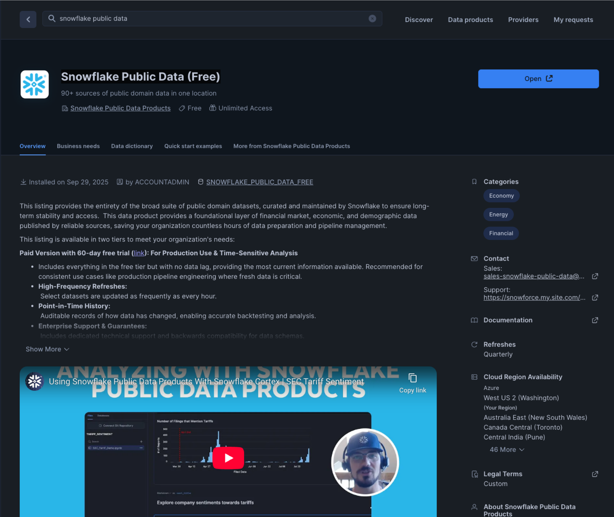
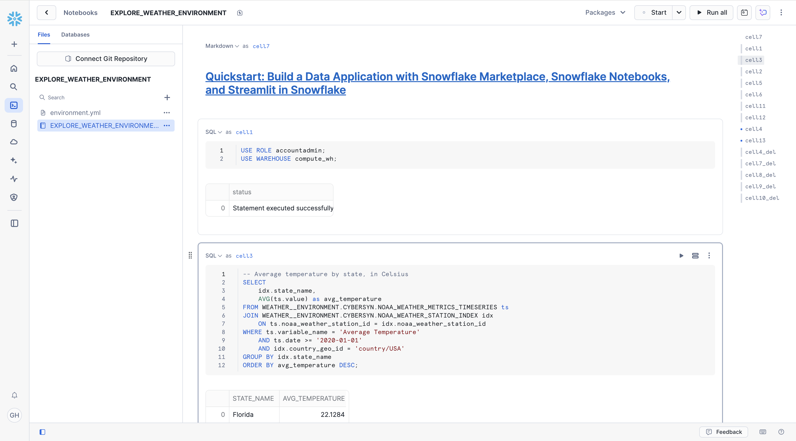
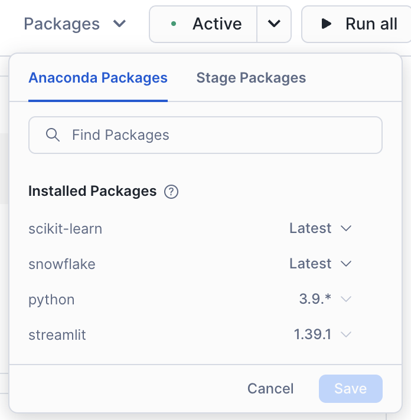
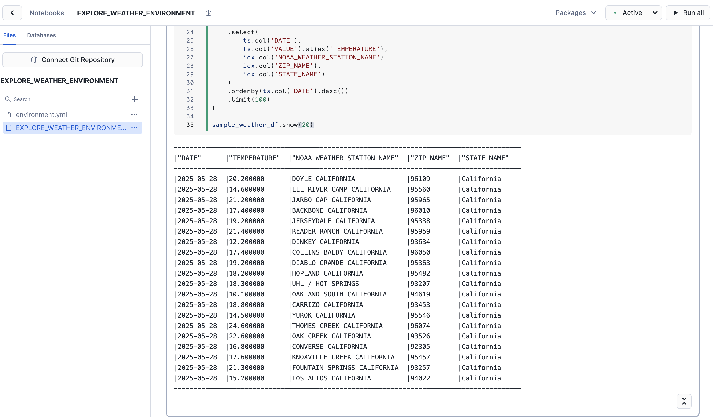
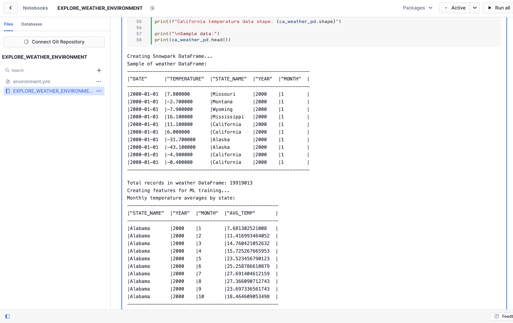
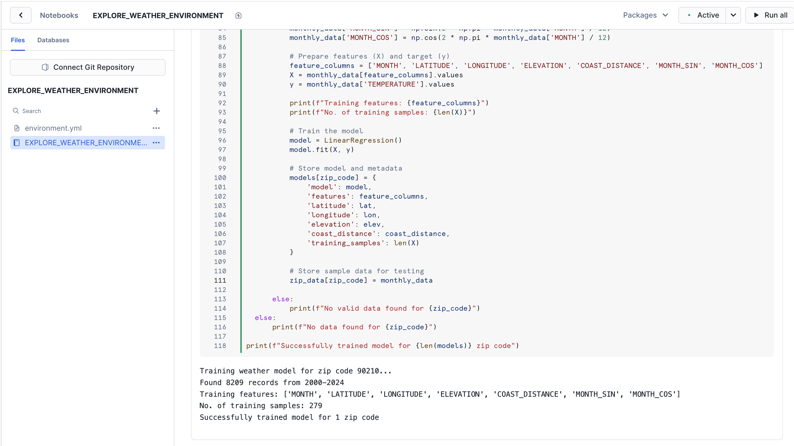
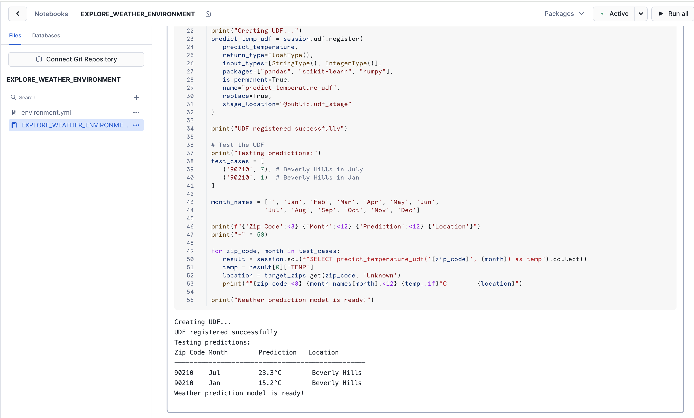
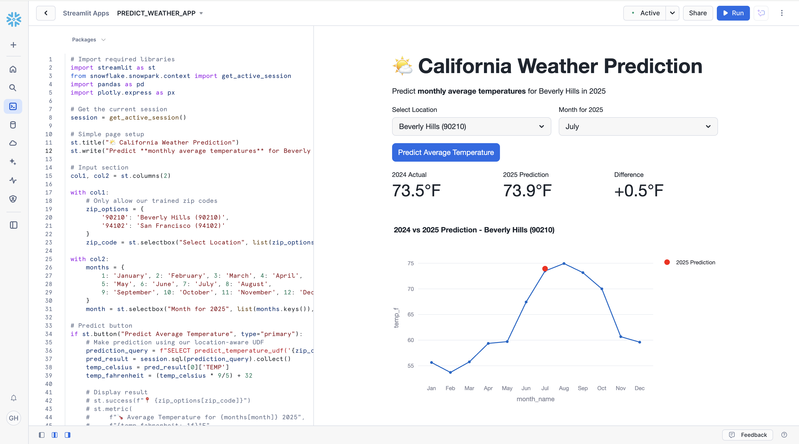
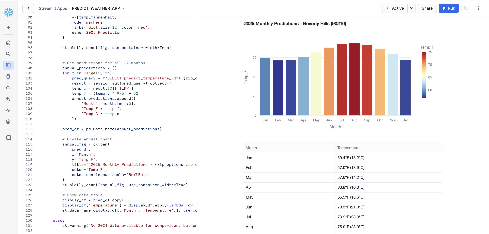

author: Gilberto Hernandez
id: data-apps-summit-lab
categories: snowflake-site:taxonomy/solution-center/certification/quickstart, snowflake-site:taxonomy/product/applications-and-collaboration, snowflake-site:taxonomy/snowflake-feature/marketplace-and-integrations
language: en
summary: Build a weather prediction app using Snowflake Marketplace data, Snowflake Notebooks for ML training, and Streamlit.
environments: web
status: Published 
feedback link: https://github.com/Snowflake-Labs/sfguides/issues


# Build a Data Application with Snowflake Marketplace, Snowflake Notebooks, and Streamlit in Snowflake

## Overview

In this hands-on lab, you will build a weather prediction data application entirely within Snowflake. You'll leverage Weather & Environment data from Snowflake Marketplace, train a simple ML model using sklearn within Snowflake Notebooks, and create an interactive Streamlit application, all without leaving Snowflake.

You will process NOAA weather data with SQL, Snowpark, and develop a simple ML model to predict temperatures. You'll also create a Python User Defined Function (UDF) in Snowflake, then visualize historical weather data and predictions using Streamlit in Snowflake.

### Key Features & Technology

* Snowflake Marketplace
* Snowflake Notebooks
* Snowpark for Python
* User-Defined Functions (UDFs)
* Streamlit in Snowflake
* NOAA Weather Data

### Prerequisites

* **ACCOUNTADMIN** role access in Snowflake or a Snowflake trial account: [https://signup.snowflake.com/](https://signup.snowflake.com/?utm_source=snowflake-devrel&utm_medium=developer-guides&utm_cta=developer-guides)
* You'll need the companion repo for this lab: [sfguide-data-apps-summit-lab](https://github.com/Snowflake-Labs/sfguide-data-apps-summit-lab/)
* Basic knowledge of SQL, database concepts, and objects
* Familiarity with Python (all code is provided)

### What You'll Learn

* How to consume weather datasets from Snowflake Marketplace
* How to use Snowflake Notebooks for data exploration and ML model development
* How to perform queries on weather data using Snowpark DataFrames
* How to create a Snowpark for Python User-Defined Function (UDF) in Snowflake
* How to create a weather prediction application with Streamlit in Snowflake
* How to work with time series weather data for machine learning

### What You'll Build

* A Snowflake Notebook that explores weather data and trains a Linear Regression model
* A Snowflake User-Defined Function (UDF) based on a trained weather prediction model
* A Streamlit application in Snowflake for weather visualization and predictions

<!-- ------------------------ -->
## Open a Snowflake Trial Account

To complete this lab, you'll need a Snowflake account. A free Snowflake trial account will work just fine. To open one:

1. Navigate to [https://signup.snowflake.com/](https://signup.snowflake.com/?utm_source=snowflake-devrel&utm_medium=developer-guides&trial=student&cloud=aws&region=us-west-2&utm_campaign=introtosnowflake&utm_cta=developer-guides)

2. Start the account creation by completing the first page of the form on the page.

3. On the next section of the form,  set the Snowflake edition to "Enterprise (Most popular").

4. Select "AWS – Amazon Web Services" as the cloud provider.

5. Select "US West (Oregon)" as the region.

6. Complete the rest of the form and click "Get started".


<!-- ------------------------ -->
## Data from Snowflake Marketplace

Snowflake Marketplace provides visibility to a wide variety of datasets from third-party data stewards which broaden access to data points used to transform business processes. 

Snowflake Marketplace also removes the need to integrate and model data by providing secure access to data sets fully maintained by the data provider.

 Because of this, we don't actually need to copy any data to our Snowflake account with any logic. Instead, we can directly access the weather data shared by a trusted provider in Snowflake Marketplace. Let's begin.

 1. Log into your Snowflake account.

2. Click on "Data Products".

3. Click on "Marketplace".

4. In the search bar, search for "Snowflake Public Data (Free)".

5. The first result should be "Snowflake Public Data (Free)" by the "Snowflake Public Data Products" provider. Click on the listing.

6. The dataset is free. On the right, click "Get".

7. In the ensuing modal, click "Get" once more. Do **NOT** rename the dataset.

This is a live dataset! No need to write ingestion logic to bring the data into your account. The data is maintained and kept fresh by the provider.



<!-- ------------------------ -->
## Load the Snowflake Notebook

Let's prepare our Snowflake environment so that we can begin exploring the weather data. We'll explore the data in a Snowflake Notebook.

Snowflake Notebooks offer an interactive, cell-based programming environment for Python and SQL. With a Snowflake Notebook, you can perform exploratory data analysis, experiment with feature engineering for machine learning, and perform other data science tasks within Snowflake.

Let's begin.

1. Create a new SQL worksheet.

2. We'll need to create a database and schema for the notebook we'll run. In the worksheet, paste and run the following:

```sql
USE ROLE accountadmin;
USE WAREHOUSE compute_wh;

CREATE OR REPLACE DATABASE weather_lab;
CREATE OR REPLACE SCHEMA weather_schema;

USE DATABASE weather_lab;
CREATE OR REPLACE STAGE weather_schema.udf_stage;
```

The last line of SQL creates a stage that will be used when we deploy our user-defined function. We'll go into more detail on that in a later step.

3. Next, [download the notebook from the companion repo for this guide](https://github.com/Snowflake-Labs/sfguide-data-apps-summit-lab/blob/main/EXPLORE_WEATHER_ENVIRONMENT.ipynb). On the GitHub page, click on the "Download raw file" button at the top right.

4. Next, navigate back to Snowflake. Click on "Projects", then click on "Notebooks". 

5. Create a new Notebook using the button at the top right. Click the drop-down menu, and select "Import .ipynb file". Select the notebook file that you downloaded in the previous step.

6. In the ensuing modal, name the notebook "WEATHER_ENVIRONMENT_APP". Set the location to the `weather_lab` database and `weather_schema` schema.

7. Select **COMPUTE_WH** as the query warehouse. 

8. Leave everything else as-is and click "Create". The notebook session will be created for you with the notebook loaded and ready to run.




<!-- ------------------------ -->
## Explore data with SQL and Snowpark for Python

The notebook contains all of the code necessary to complete the rest of the lab. In this step, we'll explore the weather data using SQL and Snowpark for Python.

Recall that the Weather & Environment dataset serves as a central source of global weather, energy, and environmental metrics. A single, unified schema joins together data across numerous sources that track global environmental factors.

It covers topics like:

* Daily weather events (e.g. temperature, precipitation) across 180 countries

* Energy sales, generation, prices, and consumption in the US

* FEMA disaster declarations by county

*  Greenhouse gas emissions by gas type, country, source, and sector

* Global temperature change

...and much more.

We'll use this data to build an application that lets us predict weather for the 90210 zip code (Beverly Hills) in California. We'll specifically explore and use the **SNOWFLAKE_PUBLIC_DATA_FREE.PUBLIC_DATA_FREE.NOAA_WEATHER_METRICS_TIMESERIES** and **SNOWFLAKE_PUBLIC_DATA_FREE.PUBLIC_DATA_FREE.NOAA_WEATHER_STATION_INDEX** datasets.

Let's begin.

1. Let's make sure our notebook has the correct packages that our code will use. Click the "Packages" drop-down at the top of the notebook and type in "snowflake". Click on the relevant result. This will instantly install this package into the notebook environment. That was easy!

2. Let's do it again, only this time, type in "scikit-learn". Click on the relevant result. Your notebook should have the following installed:



3. Now run the first cell that sets our context:

```sql
USE ROLE accountadmin;
USE WAREHOUSE compute_wh;
USE DATABASE weather_lab;
USE SCHEMA weather_schema;
```

4. We are interested in the NOAA weather data, so let's explore temperature data. Run the next SQL cell that contains the code below. It'll return the average temperature by state, in Celsius.

```sql
-- Average temperature by state, in Celsius
SELECT 
    idx.state_name,
    AVG(ts.value) as avg_temperature
FROM SNOWFLAKE_PUBLIC_DATA_FREE.PUBLIC_DATA_FREE.NOAA_WEATHER_METRICS_TIMESERIES ts
JOIN SNOWFLAKE_PUBLIC_DATA_FREE.PUBLIC_DATA_FREE.NOAA_WEATHER_STATION_INDEX idx 
    ON ts.noaa_weather_station_id = idx.noaa_weather_station_id
WHERE ts.variable_name = 'Average Temperature'
    AND ts.date >= '2020-01-01'
    AND idx.country_geo_id = 'country/USA'
GROUP BY idx.state_name
ORDER BY avg_temperature DESC;
```

5. Let's drill down a little more. Since we're going to be predicting weather for a zip code in California, let's take a look at the average temperature in California zip codes where there is a weather station present. Run the next SQL cell that contains the following code:

```sql
-- Sample temperature data for zip codes for weather stations in California
SELECT 
    ts.date,
    ts.value as temperature,
    idx.noaa_weather_station_name,
    idx.zip_name,
    idx.state_name
FROM SNOWFLAKE_PUBLIC_DATA_FREE.PUBLIC_DATA_FREE.NOAA_WEATHER_METRICS_TIMESERIES ts
JOIN SNOWFLAKE_PUBLIC_DATA_FREE.PUBLIC_DATA_FREE.NOAA_WEATHER_STATION_INDEX idx 
    ON ts.noaa_weather_station_id = idx.noaa_weather_station_id
WHERE ts.variable_name = 'Average Temperature'
    AND idx.state_name = 'California'
    AND ts.date >= '2023-01-01'
    AND idx.zip_name IS NOT NULL
ORDER BY ts.date DESC
LIMIT 20;
```

6. OK, great! We've become a little more familiar with the data by exploring it with SQL. Now let's perform an equivalent exploratory query, but this time in Python. We'll use Snowpark for Python to do this. Since we're going to be training an ML model in Python, using the scikit-learn Python package, it's important to become familiar with how to use the Snowpark DataFrame API to build the data frames we'll use to train the model. 

7. Run the next cell containing the Python code below. The code below is the Snowpark for Python equivalent of the prior SQL query. It uses `session.table()` to create a Snowpark DataFrame that we can easily manipulate. Don't worry about the other package imports at the top, we'll use them later on in the notebook.

```py
from snowflake.snowpark import Session
from snowflake.snowpark.types import IntegerType, FloatType, StringType
from snowflake.snowpark.functions import avg, sum, col, udf, call_udf, call_builtin, year, month, dayofyear
import pandas as pd
from datetime import date
import numpy as np

# scikit-learn for training ML models, used later in notebook
from sklearn.linear_model import LinearRegression
from sklearn.metrics import mean_squared_error, r2_score

session = Session.builder.getOrCreate()

# Snowpark DataFrame equivalent to previous SQL query
ts = session.table("SNOWFLAKE_PUBLIC_DATA_FREE.PUBLIC_DATA_FREE.NOAA_WEATHER_METRICS_TIMESERIES")
idx = session.table("SNOWFLAKE_PUBLIC_DATA_FREE.PUBLIC_DATA_FREE.NOAA_WEATHER_STATION_INDEX")

sample_weather_df = (
    ts.join(idx, ts.col("NOAA_WEATHER_STATION_ID") == idx.col("NOAA_WEATHER_STATION_ID"))
    .filter(ts.col('VARIABLE_NAME') == 'Average Temperature')
    .filter(idx.col('STATE_NAME') == 'California')
    .filter(ts.col('DATE') >= '2023-01-01')
    .filter(idx.col('ZIP_NAME').isNotNull())
    .select(
        ts.col('DATE'),
        ts.col('VALUE').alias('TEMPERATURE'),
        idx.col('NOAA_WEATHER_STATION_NAME'),
        idx.col('ZIP_NAME'),
        idx.col('STATE_NAME')
    )
    .orderBy(ts.col('DATE').desc())
    .limit(100)
)

sample_weather_df.show(20)
```



Great job! In just a few simple queries, in both SQL and Python, you were able to explore the dataset and get a sense of the type of data it contains. 

In the next steps, we'll dive deeper into the dataset, and use several more columns in the data to get ready to train our ML model.

<!-- ------------------------ -->
## Create features for ML training

To train our ML model, we'll need to prepare the data that will be used to train the model. In this step, we'll perform the data preparation by transforming the raw weather measurements into a clean, structured dataset suitable for machine learning.

We'll take the daily temperature readings from thousands of weather stations and consolidate them into consistent monthly averages by location. All of what we'll do in this step is also known as feature engineering.

1. Run the next Python cell in the notebook that starts with `# Create Snowpark DataFrame for temperature data`. It could take around 30 seconds to execute. Once done, you should see output similar to the following:



Here's what the code does:

* Joins measurement data with location metadata to add geographic context

* Filters for relevant records (US temperatures only, removing nulls)

* Extracts the time components (year/month) to use as predictive features

* Converts daily readings into monthly averages that reduce variability

* Scopes data to  California to create location-specific training datasets

All of this is setting up the foundation that will feed into the linear regression models we'll train in the next step.

<!-- ------------------------ -->
## Train Linear Regression Model

In this step, we'll train our ML model. We're specifically going to train a linear regression model to predict weather for the 90210 (Beverly Hills) zip code.

1. Run the next Python cell in the notebook that starts with `# Train model for 90210`. It could take around 30 seconds to execute. Once done, you should see output similar to the following:



Here's what the code does:

* Uses 25 years of historical temperature data (2000-2024) specifically for Beverly Hills from the NOAA weather database.

* Calculates geographic features including the zip code's latitude, longitude, elevation, and distance from the Pacific coast.

* Trains a Linear Regression model with features: month, latitude, longitude, elevation, coast distance, and month encodings. The model predicts monthly average temperatures based on these factors.

The result is a weather prediction model for the Beverly Hills area in California. Rather than using a generic, California-wide model, the features we use in the training helps the model account for the area's geographic characteristics.

In the next step, we'll deploy the model as a User Defined Function (UDF) for  making temperature predictions in our application.

<!-- ------------------------ -->
## Create and Register the UDF

Let's now deploy this model as a user-defined function (UDF) in Snowflake. By deploying it as a UDF, we're able to quickly call it throughout our Snowflake environment, whether in a SQL worksheet, or in an application. We're going to call this UDF from our application's front-end, so that we can make weather predictions for specific months.

1. Run the next Python cell in the notebook that starts with `def predict_temperature`. It could take around 15 seconds to execute. Once done, you should see output similar to the following:



Here's what the code does:

* Creates a UDF called `predict_temperature` that accepts a zip code and month to make a prediction

* The UDF makes a prediction based on the arguments passed in, using the linear regression model trained in earlier steps

* We register the UDF in a stage, so that we can use it throughout our Snowflake environment

* Quickly test the UDF with a couple of sample predictions (i.e., `test_cases`)

With our model now deployed as a UDF, we can use easily use it within our Streamlit in Snowflake application.

<!-- ------------------------ -->
## Creating the Streamlit Application in Snowflake

Now that we've trained our ML model and created a UDF that allows us to easily use it, we'll build an interactive Streamlit application directly in Snowflake to make predictions about the weather in zip code 90210.

1. In Snowflake, click on "Projects", then click on "Streamlit".

2. At the top right, create a new Streamlit app. Name the app "PREDICT_WEATHER_APP". Select `weather_lab` as the database, and `weather_schema` as the schema. Leave everything else as-is and create the app.

3. You'll notice a sample Streamlit app boot up. Click the "Edit" button at the top right. It'll expand the code editor, which contains the code for the sample Streamlit app. Delete all of the sample code.

4. [Copy the code for the Streamlit app in this file](https://github.com/Snowflake-Labs/sfguide-data-apps-summit-lab/blob/main/app.py). Navigate back to your Streamlit app and paste it into the code editor. 

5. Using the "Packages" drop down at the top of the code editor, search for "plotly" and install the package by clicking on the returned result.

6. Click "Run" to create and run the app.

7. The application should start up on the right-hand side. There, you can select a month to predict weather for, and then predict the weather using the "Predict Average Temperature" button.

8. Select "July" as the month to predict weather for, then click the button to predict the weather. Clicking the button will call the UDF, which will use 90210 and "July" as arguments to the trained model.

9. You should see a chart rendered, with two important pieces of information. The blue line is the historical weather per month for the year 2024. The red dot represents the prediction for the current year. The model is pretty accurate! You'll notice the weather is returned in Fahrenheit thanks to line 39 of the app code, where we do client-side conversion of units.



10. Scroll down to reveal the predictions for the entire year for 90210, visualized with a nice chart.



Great job! You successfully created the application.


<!-- ------------------------ -->
## Conclusion

Congratulations! You've built a data application using data from Snowflake Marketplace. You used the data to train a linear regression model to predict weather in a zip code, and you created a Streamlit in Snowflake app that uses the model to make predictions for different months. Let's recap what you did. 

### What You Learned

You built a data app that predicts weather for the 90210 zip code in California. It uses a trained linear regression model to make the predictions, and the model was trained using 20+ years of weather data for that area. You also did the feature engineering to account for other geographic variables in the area.

* **Snowflake Marketplace**

You used the free Weather & Environment data from Snowflake Marketplace, provided by Snowflake.

* **Snowflake Notebooks**

You explored the data within a Snowflake Notebook, using SQL and Snowpark for Python. You also trained the model within the notebook.

* **User-Defined Functions (UDFs)**

You deployed the trained model as a UDF, so that it can be used throughout the Snowflake environment, like in our app.

* **Streamlit in Snowflake**

You built a Streamlit in Snowflake application that uses the model to make predictions about the weather for different months for the 90210 zip code.


Congratulations! 

### Resources

For more resources, check out the following:

- [Snowflake Notebooks Guide](https://docs.snowflake.com/en/user-guide/notebooks)
- [Snowpark for Python](https://docs.snowflake.com/en/developer-guide/snowpark/python/index)
- [Streamlit in Snowflake](https://docs.snowflake.com/en/developer-guide/streamlit/index)
- [User Defined Functions](https://docs.snowflake.com/en/developer-guide/udf/python/index)

- [Time Series Forecasting Guide](https://docs.snowflake.com/en/user-guide/ml-functions-time-series-forecasting)

* Learn more at [Snowflake Northstar](/en/developers/northstar/) for developers.

