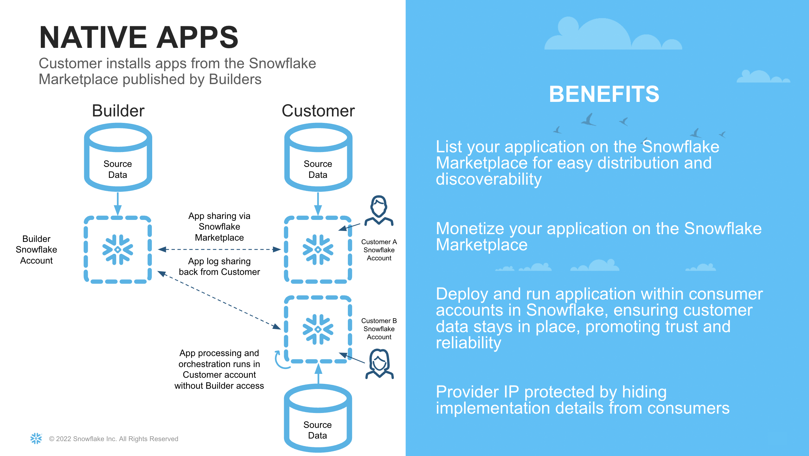
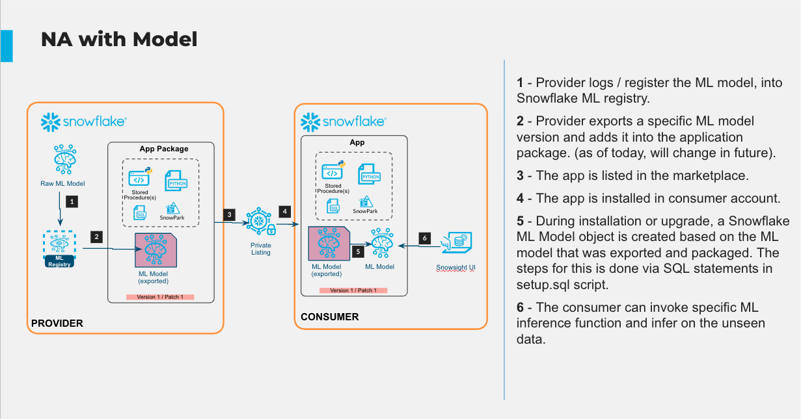
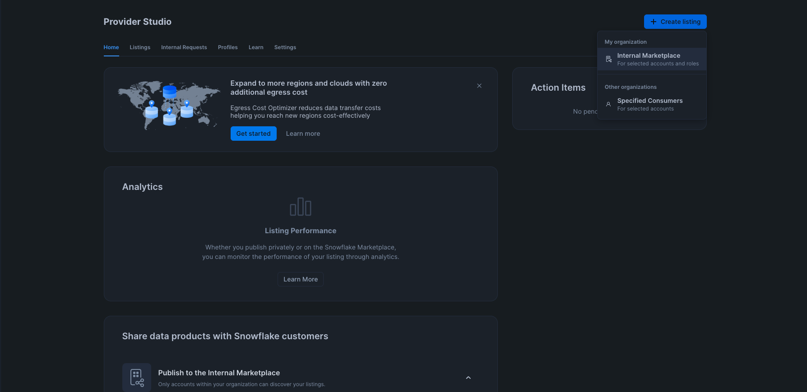
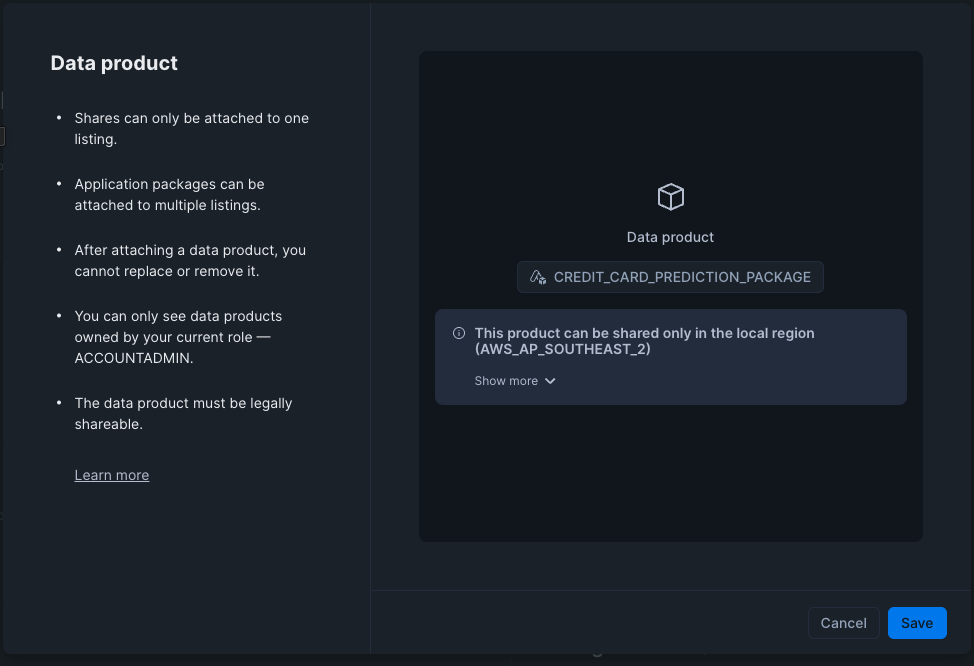
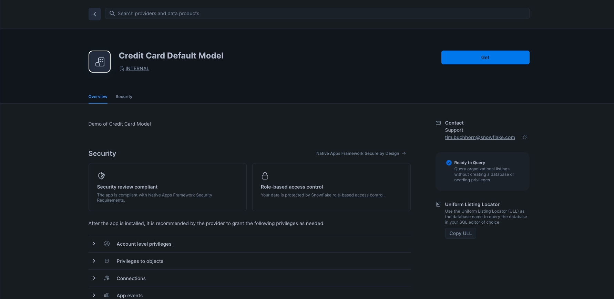
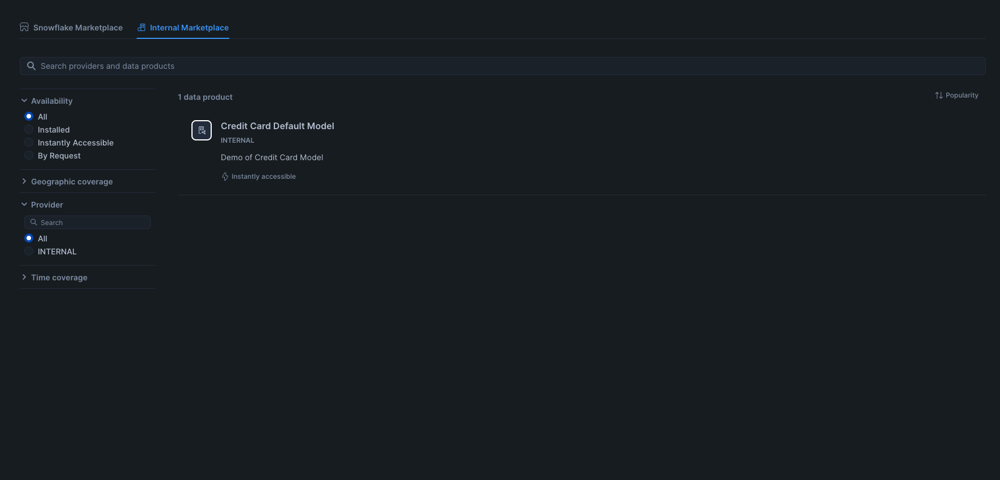
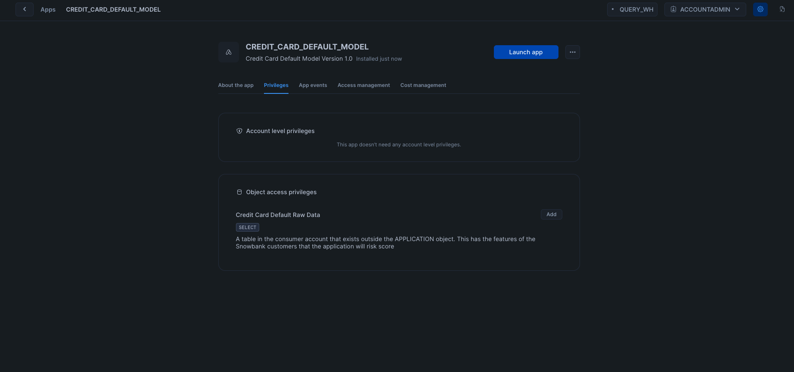
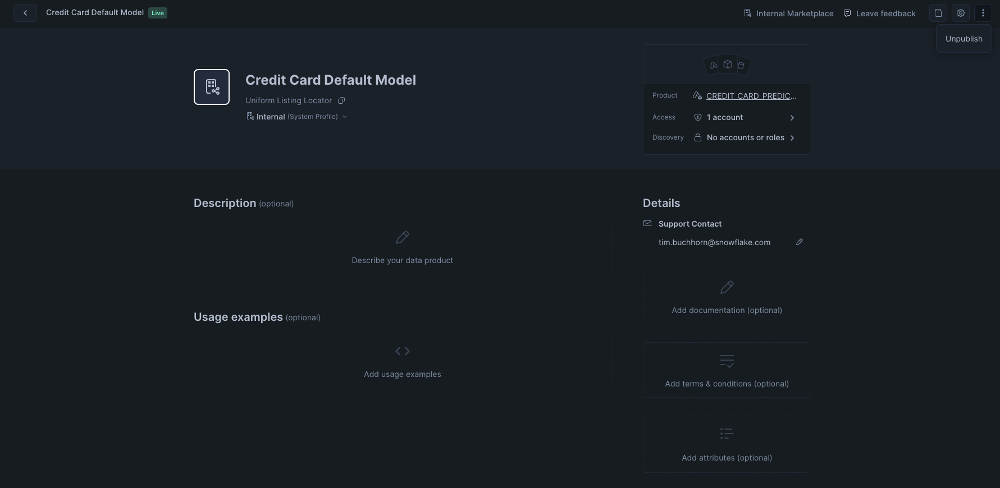

author: Tim Buchhorn
id: data-collaboration-native-app
categories: snowflake-site:taxonomy/solution-center/certification/quickstart, snowflake-site:taxonomy/product/ai, snowflake-site:taxonomy/snowflake-feature/native-apps
language: en
summary: Turn ML models into Snowflake Native Apps for secure data collaboration and sharing with customers, partners, and third-party data consumers.
environments: web
status: Published 
feedback link: https://github.com/Snowflake-Labs/sfguides/issues


# Getting Started With Model Sharing Using Native Apps
<!-- ------------------------ -->
## Overview 

This Quickstart guide is the second in a series of Collaboration & Applications in Snowflake. Part One of the series can be found [here](/en/developers/guides/data-collaboration-two-way/)

In Part One, we showed how using Snowflake's unique collaboration features, we could:
- share data from an organisation to another
- score that data using an ML model
- share it back with the original provider
all in an automated pipeline

In this Quickstart, we will show how we can leverage the Native Apps Framework to simplify this process even further.

The Native App Framework is a collaboration framework that allows providers to share data and/or related business logic to other Snowflake customers. In the previous Quickstart guide, we set up a bi-directional share between two organisations. With the Native App framework, we can simplify this relationship by allowing one party to share its logic in the form of an application to the other. Therefore, we have brought the app to the data, as opposed to bringing the data to the app



There are numerous benefits to leveraging the Native App framework for our Use Case. For example:
- Data Sovereignty and Security for the Consumer. In the previous quickstart, it was necessary for the provider to share data with another entity. This could be potentially sensitive information, and therefore a bigger hurdle for security and governance teams to approve. With Native Apps, the app logic is brought to the consumers dataset, so no customer data is leaving their security perimeter
- Compliance Risk Reduction for the Provider. Similar to the above, the provider of the model may not want to have access to customer data. This requires extra consideration with how to securely handle this data, which is not necessary if the model is shared to their customers to run against their own data.
- Increased Margin. By sharing the model to the consumer, the infrastructure cost to execute the model are now with the consumer. This means the provider can monetise the model, without worrying about infrastructure costs. Similarly the consumer can set warehouse sizes appropriate to the SLAs and budgets of the consumer organisation.
- Faster Onboarding. By having a replicable model, the provider can simply leverage the Snowflake Marketplace for distribution. They no longer need to go through a lengthy process of approvals to set up a data pipeline with their customers.

### What You Will Learn 
- How to train an ML model in Snowflake
- How to package the ML Model in an Application Package
- How to privately list a Native Application 
- How to Consume a Native Application 

### What You Will Build 
- A Native Application that contains an ML Model shared via a Private Listing

The architecture of what we will build is shown below



### Prerequisites
- [Git](https://git-scm.com/book/en/v2/Getting-Started-Installing-Git) installed
    **Download the git repo here: https://github.com/Snowflake-Labs/sfguide-data-collaboration-native-app**
- [Anaconda](https://www.anaconda.com/) installed
- [Python 3.10](https://www.python.org/downloads/) installed
    - Note that you will be creating a Python environment with 3.10 in the **Consumer Account - Create Model** step
- Snowflake accounts with [Anaconda Packages enabled by ORGADMIN](https://docs.snowflake.com/en/developer-guide/udf/python/udf-python-packages.html#using-third-party-packages-from-anaconda). If you do not have a Snowflake account, you can register for a [free trial account](https://signup.snowflake.com/?utm_source=snowflake-devrel&utm_medium=developer-guides&utm_cta=developer-guides).
- Snowflake accounts with the Snowflake Marketplace T&C's accepted. This will allow you to create Listings.
- A Snowflake account login with a role that has the ability to create Listings, Databases, Schemas, Tables, Stages, User-Defined Functions, and Stored Procedures. If not, you will need to register for free trials or use a different role.
- The [Snowpark ML](https://docs.snowflake.com/developer-guide/snowpark-ml/index#installing-snowpark-ml-from-the-snowflake-conda-channel) package installed

<!-- ------------------------ -->
## Business Use Case and Context

The Business Use case follows a similar scenario as Part One.

In this guide, we are playing the role of Zamboni and Snowbank. The Credit Risk team at Snowbank has noticed a rise in credit card default rates which affects the bottom line of the business. Previously, it has shared data with an external organisation (Zamboni) who assist with analysing the data and scoring which customers are most likely to default.

This time, the compliance team has said that it is too risky to share this customer data with an external party without proper procedures being followed, which could take a few months to complete. Zamboni have proposed a solution that utilises the Native Application Framework.

Since both companies use Snowflake, Zamboni has proposed sharing their proprietary Credit Default Scoring Model via the Native Application Framework. The advantages of doing this for Snowbank are:
- No customer data leaves Snowbank's Snowflake Account
- The Native App runs within the Snowbank Account. Since Snowflake has been approved for use internally, it is not subject to longer onboarding and cybersecurity checks

The advantages for Zamboni are:
- Simple deployment. Zamboni can simply share the model using a similar listing paradigm as sharing a dataset.
- Reduced compliance risk. Zamboni's security and compliance team are similarly pleased in being able to satisfy the business needs without needing Snowbank's data hosted on their servers
- Increased Margin. Zamboni are now able to share their proprietary logic safely, without having to provision infrastructure to run the model on behalf of Snowbank.
- Speed to Market. Zamboni can simply distribute the model via the Native App framework in a private listing. They no longer need to set up data pipelines. They can also build once, and distribute to lots of different customers by leveraging Snowflake's multitenancy framework.

What is different in this scenario compared to Part One, is that it is no longer a bi-directional share of data. Now Zamboni becomes the provider of an Application, and Snowbank becomes the consumer.

### Dataset Details

We will use a publicly available dataset to train our ML model for the purposes of this demo. The dataset contains aggregated profile features for each customer at each statement date. Features are anonymized and normalized, and fall into the following general categories:

D_* = Delinquency variables
S_* = Spend variables
P_* = Payment variables
B_* = Balance variables
R_* = Risk variables

### Dataset Citation

Addison Howard, AritraAmex, Di Xu, Hossein Vashani, inversion, Negin, Sohier Dane. (2022). American Express - Default Prediction. Kaggle. https://kaggle.com/competitions/amex-default-prediction

<!-- ------------------------ -->
## Setup

Navigate to the [Snowflake Trial Landing Page](https://signup.snowflake.com/?utm_source=snowflake-devrel&utm_medium=developer-guides&utm_cta=developer-guides). Follow the prompts to create a Snowflake Account. You should receive an email to activate your trial account.

Navigate to a new worksheet and execute the following commands to create a second account in the Organisation. The second account will be the account we share the model to (Snowbank). In trial accounts we cannot share the Native App externally, although the same process can be followed to share the app externally if you have a non-trial account.

```SQL
USE ROLE ORGADMIN;

CREATE ACCOUNT SNOWBANK
  ADMIN_NAME = ADMIN
  ADMIN_PASSWORD = 'ENTER PASSWORD HERE'
  EMAIL = 'ENTER YOUR EMAIL HERE'
  EDITION = ENTERPRISE;
```
Note down the account locator and the url from the output of the command above for use in later steps


### Provider Account (Zamboni)

In this part of the lab we'll set up our Provider Snowflake account. In our business scenario, this step represents Zamboni developing their proprietary Credit Card Default model from their own datasets. Stay in the same account from the previous section.

### Initial Set Up

Next, open up a new worksheet and run all following steps as the ACCOUNTADMIN role

```SQL
  -- Change role to accountadmin
  USE ROLE ACCOUNTADMIN;
```

Next we create two [Virtual Warehouses](https://docs.snowflake.com/en/user-guide/warehouses-overview) that can be used to load the initial dataset, and do our model training respectively.

```SQL
-- Create a virtual warehouse for loading and ad-hoc queries
CREATE OR REPLACE WAREHOUSE QUERY_WH WITH 
  WAREHOUSE_SIZE = 'X-SMALL' 
  WAREHOUSE_TYPE = 'STANDARD' 
  AUTO_SUSPEND = 300 
  AUTO_RESUME = TRUE 
  MIN_CLUSTER_COUNT = 1 
  MAX_CLUSTER_COUNT = 1;

-- Create a virtual warehouse for training
CREATE OR REPLACE WAREHOUSE training_wh with 
  WAREHOUSE_SIZE = 'MEDIUM' 
  WAREHOUSE_TYPE = 'snowpark-optimized' 
  MAX_CLUSTER_COUNT = 1
  AUTO_SUSPEND = 300 
  AUTO_RESUME = TRUE;
```

### Load Data 

Next we will create a database and schema that will house the tables to train our model.

```SQL
-- Create the application database and schema
CREATE OR REPLACE DATABASE NATIVE_APP_DEMO;
CREATE OR REPLACE SCHEMA NATIVE_APP_DEMO;
USE SCHEMA NATIVE_APP_DEMO.NATIVE_APP_DEMO;
```

Our data is in Parquet format, so we will create a file format object

```SQL
CREATE OR REPLACE FILE FORMAT parquet_format
TYPE = PARQUET;
```

Next we set up our [External Stage](https://docs.snowflake.com/en/user-guide/data-load-s3-create-stage#external-stages) to our data. In our business scenario, we would have a secure [Storage Integration](https://docs.snowflake.com/en/sql-reference/sql/create-storage-integration) to the external stage rather than a public s3 bucket.

```SQL
CREATE OR REPLACE STAGE quickstart_cc_default_training_data
    URL = 's3://sfquickstarts/two_way_data_share/train/'
    FILE_FORMAT = parquet_format;
```

This DDL will create the structure for the table which is the main source of data for our lab.

```SQL
CREATE OR REPLACE TABLE cc_default_training_data
  USING TEMPLATE (
    SELECT ARRAY_AGG(OBJECT_CONSTRUCT(*))
      FROM TABLE(
        INFER_SCHEMA(
          LOCATION=>'@quickstart_cc_default_training_data',
          FILE_FORMAT=>'parquet_format'
        )
      ));
```

Now we will load the data in the tables. We can scale up the warehouse temporarily so we do not have to wait as long

```SQL
ALTER WAREHOUSE query_wh SET warehouse_size=MEDIUM;
```

The code below loads the data in to the tables.

```SQL
COPY INTO cc_default_training_data 
  FROM @quickstart_cc_default_training_data 
  FILE_FORMAT = (FORMAT_NAME= 'parquet_format') 
  MATCH_BY_COLUMN_NAME=CASE_INSENSITIVE;
```
We can now scale down the warehouse since we have finished loading data for the lab

```SQL
ALTER WAREHOUSE query_wh SET warehouse_size=XSMALL;
```

You should have loaded over 5.5 million rows in a few minutes. To check, query the data in the worksheet

```SQL
SELECT COUNT(*) 
  FROM CC_DEFAULT_TRAINING_DATA;
```

We have loaded all the data in Zamboni. We can now proceed with training the model

<!-- ------------------------ -->
## Create Model

### Provider Account (Zamboni)

For this section, make sure you download the corresponding [git repo](https://github.com/Snowflake-Labs/sfguide-getting-started-with-model-sharing-using-native-app) so you have the files referenced in this section.

### Set Up Snowpark for Python and Snowpark ML

The first step is to set up the python environment to develop our model. To do this:

- Download and install the miniconda installer from [https://conda.io/miniconda.html](https://conda.io/miniconda.html). (OR, you may use any other Python environment with Python 3.10, for example, [virtualenv](https://virtualenv.pypa.io/en/latest/)).

- Open a new terminal window in the downloaded directory with the conda_env.yml file and execute the following commands in the same terminal window:

  1. Create the conda environment.
  ```
  conda env create -f conda_env.yml
  ```

  2. Activate the conda environment.
  ```
  conda activate data-collaboration-native-app
  ```

  3. Start notebook server:
  ```
  jupyter notebook
  ```
  Open the jupyter notebook Credit Card Default Native App Notebook

- Update connection.json with your Snowflake Account Identifier details and User Name in a code editor of your choice.
  Here's a sample based on the object names we created in the last step:

```
{
  "account"        : "<your_account_identifier_goes_here>",
  "user"           : "<your_username_goes_here>",
  "password"       : "<your_password_goes_here>",
  "role"           : "ACCOUNTADMIN",
  "warehouse"      : "QUERY_WH",
  "database"       : "NATIVE_APP_DEMO",
  "schema"         : "NATIVE_APP_DEMO"
}
```

You can find your account identifier by running the following SQL

```SQL
SELECT CURRENT_ORGANIZATION_NAME() || '-' || CURRENT_ACCOUNT_NAME();
```

### Train and Register Model
Open up the Credit Card Default Native App notebook and follow the steps. Once you have completed those, you will have trained and deployed a ML Model in Snowflake that predicts credit card default risk. You will also have registered the model in the Snowflake Model Registry.

Stay in the Zamboni account for the next step.

<!-- ------------------------ -->
## Build Native App

### Provider Account (Zamboni)

Now we have trained the model, we want to encapsulate it in an Application Package, so we can distribute it via the Native App Framework. More information on the Native Application framework can be found in the documentation [here](https://docs.snowflake.com/en/developer-guide/native-apps/native-apps-about). We will be working through the [Native App Development Workflow](https://docs.snowflake.com/en/developer-guide/native-apps/native-apps-workflow#development-workflow).

Continue to work through the python notebook. The SQL commands below can be run from the python notebook.

The next step is to create an Application Package object that will hold the assets we wish to distribute to Snowbank. An Application Package encapsulates the data content, application logic, metadata, and setup script required by an application. An Application Package also contains information about versions and patch levels defined for the application. We do this by running the following SQL.

```SQL
GRANT CREATE APPLICATION PACKAGE ON ACCOUNT TO ROLE ACCOUNTADMIN;
CREATE APPLICATION PACKAGE IF NOT EXISTS CREDIT_CARD_PREDICTION_APP_PACKAGE;
SHOW APPLICATION PACKAGES;
```

Next, we need to create a stage within the Application Package for us to put our model assets. We run the following SQL commands

```SQL
USE APPLICATION PACKAGE CREDIT_CARD_PREDICTION_PACKAGE;
CREATE SCHEMA IF NOT EXISTS MODEL_ASSETS;
CREATE OR REPLACE STAGE CREDIT_CARD_PREDICTION_APP_PACKAGE.MODEL_ASSETS.MODEL_STAGE FILE_FORMAT = (TYPE = 'csv' FIELD_DELIMITER = '|' SKIP_HEADER = 1);
```

So we share a model that is consistent with what is in the model registry, we are going to export the model from the registry, and put it in the Application Package. We do this in the following code block

```python
# Retrieve the model from the registry
m = registry.get_model("NATIVE_APP_DEMO.NATIVE_APP_DEMO.CREDIT_CARD_DEFAULT_MODEL")
mv = m.version("default")

# Create a temp directory to export the model
import tempfile, pathlib, shutil, os
local_dir = pathlib.Path(tempfile.mkdtemp(prefix="model_export_"))

# export the full artefact set into that folder
mv.export(local_dir.as_posix(), export_mode=ExportMode.FULL)

# Upload the files and folder structure to the Application Package Stage
stage_root = "@CREDIT_CARD_PREDICTION_PACKAGE.MODEL_ASSETS.MODEL_STAGE/models"

for file_path in pathlib.Path(local_dir).rglob('*'):
    if file_path.is_file():
        rel_path = file_path.relative_to(local_dir).as_posix()   # e.g. runtimes/env.yml or manifest.yml
        subdir   = os.path.dirname(rel_path)                     # '' or 'runtimes'

        # remote prefix **must end with a slash** and contain no file-name
        remote_prefix = f"{stage_root}/{subdir}/" if subdir else f"{stage_root}/"

        session.file.put(
            file_path.as_posix(),
            remote_prefix,
            overwrite=True,
            auto_compress=False
        )

# Check that all our artefacts have been uploaded
session.sql("LIST @CREDIT_CARD_PREDICTION_PACKAGE.MODEL_ASSETS.MODEL_STAGE/models;").collect()
```

An application requires a manifest file, and a setup script (as outlined in the Native App Development Workflow). We upload them to our Application Package in the following commands

```SQL
PUT file://scripts/setup.sql @CREDIT_CARD_PREDICTION_APP_PACKAGE.MODEL_ASSETS.MODEL_STAGE/scripts overwrite=true auto_compress=false;

PUT file://manifest.yml @CREDIT_CARD_PREDICTION_APP_PACKAGE.MODEL_ASSETS.MODEL_STAGE overwrite=true auto_compress=false;
```

The setup script contains the SQL statements that define the components created when a consumer installs your application. For us, this will include creating stored procedures to perform feature engineering, as well as registering our model for the app to use on the consumer side (documentation [here](https://docs.snowflake.com/LIMITEDACCESS/native-apps/models)). This is done in the following lines that were run as part of setup.sql on installation of the app:

```SQL
create or replace model APP_CODE.CREDIT_CARD_DEFAULT_MODEL from @CREDIT_CARD_PREDICTION_PACKAGE.MODEL_ASSETS.MODEL_STAGE/models/;

grant usage on model APP_CODE.CREDIT_CARD_DEFAULT_MODEL to application role app_user;
```


<!-- ------------------------ -->
## Perform Local Testing

### Provider Account (Zamboni)

Now the Application has been created from the Application Package in our Provider Account, we can perform some testing to ensure it behaves as expected. In this Quickstart, we have exposed more views and functions than what is necessary, so we can follow along and see how the app in functioning.

You will need a SQL worksheet for this part of the Quickstart. We can load some testing data by executing the following:

```SQL
USE SCHEMA NATIVE_APP_DEMO.NATIVE_APP_DEMO;

CREATE OR REPLACE STAGE quickstart_cc_default_unscored_data
    URL = 's3://sfquickstarts/two_way_data_share/unscored/'
    FILE_FORMAT = parquet_format;

-- Create below to be the template of the above (without the target column)
CREATE OR REPLACE TABLE cc_default_unscored_data LIKE cc_default_training_data;
ALTER TABLE cc_default_unscored_data DROP COLUMN "target";

ALTER WAREHOUSE query_wh SET warehouse_size=MEDIUM;

USE WAREHOUSE query_wh;

COPY INTO cc_default_unscored_data 
  FROM @quickstart_cc_default_unscored_data 
  FILE_FORMAT = (FORMAT_NAME= 'parquet_format') 
  MATCH_BY_COLUMN_NAME=CASE_INSENSITIVE;

ALTER WAREHOUSE query_wh SET warehouse_size=XSMALL;
```

This app requires the consumer to explicitly provide a reference to a table in the Snowflake instance it is installed as an input. References are a way for Native App consumers to be explicit in their permissioning to any existing object in a Snowflake account that is required. This ensures that Native Applications run as "isolated objects" within a Consumer Account, and must be granted explicit permission to access other objects. More information can be foind [here](https://docs.snowflake.com/en/developer-guide/native-apps/requesting-refs). We can achieve referencing through the UI, or running the following SQL.

```SQL
-- Bind the reference to a table in our own Snowflake Account. This can be done via SQL or the UI
CALL credit_card_prediction_app.app_code.register_single_reference('RAW_TABLE' , 'ADD', SYSTEM$REFERENCE('TABLE', 'NATIVE_APP_DEMO.NATIVE_APP_DEMO.CC_DEFAULT_UNSCORED_DATA', 'PERSISTENT', 'SELECT'));

-- Check that the reference worked
SHOW REFERENCES IN APPLICATION credit_card_prediction_app;
```

Next let's run through the commands and see if they are working as expected. Note that we are running code inside an isolated Application object. This application object will eventually be shared with our consumer (Snowbank).

```SQL
-- This should be empty, as we have not called the procedure to populate the table yet
SELECT * FROM CREDIT_CARD_PREDICTION_APP.APP_CODE.RAW_TABLE_VIEW;

-- Now we call the procedure
CALL CREDIT_CARD_PREDICTION_APP.APP_CODE.CREATE_TABLE_FROM_REFERENCE_RAW();

-- And the table should now be populated
SELECT * FROM CREDIT_CARD_PREDICTION_APP.APP_CODE.RAW_TABLE_VIEW LIMIT 10;
SELECT COUNT(*) FROM CREDIT_CARD_PREDICTION_APP.APP_CODE.RAW_TABLE_VIEW;

-- Next we call the procedure to do the feature engineering. This will take 5 mins to complete
CALL CREDIT_CARD_PREDICTION_APP.APP_CODE.CC_PROFILE_PROCESSING();

-- The feature table should now be populated
SELECT * FROM CREDIT_CARD_PREDICTION_APP.APP_CODE.TRANSFORMED_TABLE_VIEW LIMIT 10;

-- Next we call the procedure that infers our model
USE WAREHOUSE TRAINING_WH;
CALL CREDIT_CARD_PREDICTION_APP.APP_CODE.CC_BATCH_PROCESSING();

-- And we can now see the scored table
SELECT * FROM CREDIT_CARD_PREDICTION_APP.APP_CODE.SCORED_TABLE_VIEW LIMIT 10;
```
We are satisfied with the testing. The next step is to distribute the app.

<!-- ------------------------ -->
## Distribute Native App

### Provider Account (Zamboni)

We need to create a version before and a release directive before we can share. We can do this in the manifest file, or with the code below

```SQL

ALTER APPLICATION PACKAGE CREDIT_CARD_PREDICTION_PACKAGE
  ADD VERSION v1
  USING '@CREDIT_CARD_PREDICTION_PACKAGE.MODEL_ASSETS.MODEL_STAGE'
  LABEL = 'Credit Card Default Model Version 1.0';

SHOW VERSIONS IN APPLICATION PACKAGE CREDIT_CARD_PREDICTION_PACKAGE;
```

Below is how we set a Release Directive. A Release Directive is a way for Providers to control which Apps versions are available for their consumers. More information can be found in the [documentation](https://docs.snowflake.com/en/developer-guide/native-apps/update-app-release-directive)

```SQL
ALTER APPLICATION PACKAGE CREDIT_CARD_PREDICTION_PACKAGE
  SET DEFAULT RELEASE DIRECTIVE
  VERSION = v1
  PATCH = 0;
```

Now we can distribute the app to our consumer - Snowbank.

On the left panel, navigate to Data Products > Provider Studio

Select Create Listing > Internal Listing



Fill in the name of the listing in the UI as "Credit Card Default Model". Then select "Add data product"



Select the CREDIT_CARD_PREDICTION_PACKAGE, and click save.

Select "Access Control" to open up the modal. Under "Who can access this data product?" select "Selected accounts and roles". In the Accounts dropdown, select SNOWBANK.

For the Allow Discovery section, select "Not discoverable by users without access".

Click Save



Add a support email to the listing.

Finally, click Publish.


<!-- ------------------------ -->
## Consume Model via Native App

In this next step, we will log in to our consumer account (Snowbank). You should have saved the details such as the account URL and username from step 3. Log in to the Snowbank Account, and follow the steps to reset your password.

Next, lets ingest the data into this completely separate account by running the following commands in a SQL worksheet.

### Setup and Load Data

```SQL
USE ROLE ACCOUNTADMIN;

CREATE OR REPLACE WAREHOUSE QUERY_WH WITH 
  WAREHOUSE_SIZE = 'X-SMALL' 
  WAREHOUSE_TYPE = 'STANDARD' 
  AUTO_SUSPEND = 300 
  AUTO_RESUME = TRUE 
  MIN_CLUSTER_COUNT = 1 
  MAX_CLUSTER_COUNT = 1;

CREATE OR REPLACE DATABASE NATIVE_APP_CONSUMER;
CREATE OR REPLACE SCHEMA NATIVE_APP_CONSUMER;
USE SCHEMA NATIVE_APP_CONSUMER.NATIVE_APP_CONSUMER;

CREATE OR REPLACE FILE FORMAT parquet_format
TYPE = PARQUET;

CREATE OR REPLACE STAGE quickstart_cc_default_unscored_data
    URL = 's3://sfquickstarts/two_way_data_share/unscored/'
    FILE_FORMAT = parquet_format;

CREATE OR REPLACE TABLE cc_default_unscored_data 
  USING TEMPLATE (
    SELECT ARRAY_AGG(OBJECT_CONSTRUCT(*))
      FROM TABLE(
        INFER_SCHEMA(
          LOCATION=>'@quickstart_cc_default_unscored_data',
          FILE_FORMAT=>'parquet_format'
        )
      ));

ALTER WAREHOUSE query_wh SET warehouse_size=MEDIUM;

COPY INTO cc_default_unscored_data 
  FROM @quickstart_cc_default_unscored_data 
  FILE_FORMAT = (FORMAT_NAME= 'parquet_format') 
  MATCH_BY_COLUMN_NAME=CASE_INSENSITIVE;

ALTER WAREHOUSE query_wh SET warehouse_size=XSMALL;
```

### Accept Shared Model

On the left menu, navigate through to Data Products > Marketplace. Then select the Internal Marketplace tab. You should see your app ready to be installed.



Select Credit Card Default Model, and on the next screen, select Get. If you do not see the Get button, ensure that you are operating as the ACCOUNTADMIN role. Wait for it to install, and then click "Configure".

Select the Privileges tab, and then click "Add" to let our App refer to data in the consumer account



Click "Select Data" and navigate to the CC_DEFAULT_UNSCORED_DATA in the NATIVE_APP_CONSUMER database and the NATIVE_APP_CONSUMER schema. Click save.

<!-- ------------------------ -->
## Use Shared Model

### Consumer Account (Snowbank)

Open up a SQL Worksheet, and run the tests again. This time, the model has been shared with a segregated account, and the data that is being used for inference has not left the account.

```SQL
-- This should be empty, as we have not called the procedure to populate the table yet
SELECT * FROM CREDIT_CARD_DEFAULT_MODEL.APP_CODE.RAW_TABLE_VIEW;

-- Now we call the procedure
CALL CREDIT_CARD_DEFAULT_MODEL.APP_CODE.CREATE_TABLE_FROM_REFERENCE_RAW();

-- And the table should now be populated
SELECT * FROM CREDIT_CARD_DEFAULT_MODEL.APP_CODE.RAW_TABLE_VIEW LIMIT 10;
SELECT COUNT(*) FROM CREDIT_CARD_DEFAULT_MODEL.APP_CODE.RAW_TABLE_VIEW;

-- Next we call the procedure to do the feature engineering. It will take 5 minutes to complete
CALL CREDIT_CARD_DEFAULT_MODEL.APP_CODE.CC_PROFILE_PROCESSING();

-- The feature table should now be populated
SELECT * FROM  CREDIT_CARD_DEFAULT_MODEL.APP_CODE.TRANSFORMED_TABLE_VIEW LIMIT 10;

-- Next we call the procedure that infers our model. This will take 5 mins to complete
CALL CREDIT_CARD_DEFAULT_MODEL.APP_CODE.CC_BATCH_PROCESSING();

-- And we can now see the scored table
SELECT * FROM CREDIT_CARD_DEFAULT_MODEL.APP_CODE.SCORED_TABLE_VIEW LIMIT 10;
```

We have successfully used a ML Model shared to us within our own environment.

<!-- ------------------------ -->
## Clean Up

### Consumer Account (Snowbank)

Run the following SQL commands

```SQL
USE ROLE ACCOUNTADMIN;
DROP APPLICATION CREDIT_CARD_DEFAULT_MODEL;
DROP DATABASE NATIVE_APP_CONSUMER;
DROP WAREHOUSE QUERY_WH;
```

### Provider Account (Zamboni)

Navigate to Data Products > Provider Studio > Listings and select Credit Card Default Model

Click the vertical ellipses in the top right, and the select Unpublish



Click the vertical ellipses again and select "Delete"

Open a new SQL worksheet and run the following

```SQL
USE ROLE ACCOUNTADMIN;
DROP APPLICATION IF EXISTS CREDIT_CARD_PREDICTION_APP;
DROP APPLICATION PACKAGE CREDIT_CARD_PREDICTION_PACKAGE;
DROP DATABASE IF EXISTS NATIVE_APP_DEMO;
DROP WAREHOUSE TRAINING_WH;
DROP WAREHOUSE QUERY_WH;
```

<!-- ------------------------ -->
## Conclusion And Resources

Congratulations, you have just shared an ML Model over the Snowflake Marketplace via the Snowflake Native App framework. By sharing the ML Model to the Consumer account, we have realised the following benefits:

- Data Sovereignty and Security for the Consumer. With Native Apps, the app logic is brought to the consumers dataset, so no customer data is leaving their security perimeter
- Compliance Risk Reduction for the Provider. Similar to the above, the provider of the model may not want to have access to customer data. This requires extra consideration with how to securely handle this data, which is not necessary if the model is shared to their customers to run against their own data.
- Increased Margin. By sharing the model to the consumer, the infrastructure cost to execute the model are now with the consumer. This means the provider can monetise the model, without worrying about infrastructure costs. Similarly the consumer can set warehouse sizes appropriate to the SLAs and budgets of the consumer organisation.
- Faster Onboarding. By having a replicable model, the provider can simple leverage the Snowflake Marketplace for distribution. They no longer need to go through a lengthy process of approvals to set up a data pipeline with their customers.

### What You Learned
- How to train an ML model in Snowflake
- How to package the ML Model in an Application Package
- How to privately list a Native Application 
- How to consume a Native Application 

### Resources
- [GitHub Repo for Quickstart Assets](https://github.com/Snowflake-Labs/sfguide-getting-started-with-model-sharing-using-native-app)
- [Snowflake Developer Documentation for Native Applications](https://docs.snowflake.com/en/developer-guide/native-apps/native-apps-about)
- [CLI for Native Apps](https://docs.snowflake.com/en/developer-guide/snowflake-cli/native-apps/overview)
- [Developer Guide on End-to-End Machine Learning in Snowflake](https://docs.snowflake.com/en/developer-guide/snowpark-ml/index)
