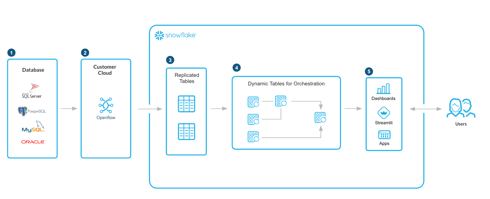

author: Snowflake Developer Relations
id: data-connectivity-with-snowflake-openflow
summary: Snowflake Openflow is an open, extensible, managed multi-modal data integration service that makes data movement effortless between data sources and destinations, supporting all data types including structured and unstructured, batch and streaming.
categories: snowflake-site:taxonomy/solution-center/certification/quickstart
environments: web
language: en
status: Published
feedback link: https://github.com/Snowflake-Labs/sfguides/issues
heroButtonOverrideLabel: View Documentation
heroButtonOverrideLink: https://docs.snowflake.com/en/user-guide/data-integration/openflow/about

# Data Connectivity with Snowflake Openflow
<!-- ------------------------ -->
## Overview

[**Snowflake Openflow**](https://www.snowflake.com/en/product/features/openflow/) is an open, extensible, managed multi-modal data integration service that makes data movement effortless between data sources and destinations, supporting all data types including structured and unstructured, batch and streaming.

Openflow revolutionizes data movement directly with Snowflake, enabling ETL for AI. All data integration is unified in one platform with limitless extensibility and interoperability to connect to any data source, and facilitates any data architecture, with enterprise-grade reliability and governance.

With Snowflake Openflow, you can move data effortlessly and scale with confidence for all your integration needs, in one single platform.

Get real-time insights from your most critical business applications without risking application performance or building complex pipelines. With Openflow, you can turn your OLTP data into a powerful analytical asset in minutes, not months, and empower your business with near real-time operational intelligence.

Openflow Connectors for MySQL, PostgreSQL, or SQL Server managed connectors stream changes directly from the source database's logs into Snowflake, creating a near real-time replica of the operational data without impacting the source system's performance.

Build faster real-time analytics applications on your streaming pipelines (Kafka, Kinesis) at lower cost and complexity of your current environment. Eliminate infrastructure management entirely and empower your teams to focus on business logic and insights. Write the insights generated in Snowflake back to Kafka for triggering downstream actions.

Compared to other solutions, streaming connectors on Openflow are easy to use (no-code), interoperable with Iceberg support, support in-flight transformations and automatically scale according to your throughput so you only pay for what you use.

Transform your scattered enterprise multi-modal data into a secure, centralized, and AI-ready knowledge base. Build powerful generative AI applications and search tools in days, not months, by leveraging Snowflake's single, integrated platform with both  connectivity to multi-modal data and AI. Stop building complex pipelines and start innovating with your most valuable data.

Instead of building complex, manual pipelines to extract text, parse documents, chunk content, and then generate embeddings, use Snowflake Openflow to extract directly from source systems with built-in processors to parse and chunk documents leveraging Snowflake Cortex.

<!-- ------------------------ -->
## Solution Architecture

<!-- ------------------------ -->
## Get Started

- [view documentation](https://docs.snowflake.com/en/user-guide/data-integration/openflow/about)
