authors: Dmytro Yaroshenko
id: data-engineering-deploying-pipelines-with-snowflake-and-dbt-labs
categories: snowflake-site:taxonomy/solution-center/certification/quickstart, snowflake-site:taxonomy/product/data-engineering
language: en
summary: Deploy production data pipelines with dbt and Snowflake for tested, documented, versioned, and orchestrated transforms.
environments: web
status: Published 
feedback link: https://github.com/Snowflake-Labs/sfguides/issues

# Deploying Pipelines with Snowflake and dbt labs
<!-- ------------------------ -->
## Overview 

### Introduction  

Modern businesses require data strategies that support agility, scalability, and operational efficiency.  

### Why Snowflake?  
[Snowflake](/) is a powerful Data Cloud that allows you to build data-intensive applications without the operational overhead. Unique architecture and years of innovation made Snowflake the best platform for mobilizing data in your organization.  

### Why dbt?  
[dbt](https://www.getdbt.com/) (Data Build Tool) is a transformation workflow that empowers teams to develop analytics code using best practices from software engineering—such as modularity, portability, CI/CD, and documentation. With dbt, anyone proficient in SQL can create production-ready data pipelines, transforming data directly within cloud data platforms like Snowflake.  

### What You’ll Learn
* How to build and deploy pipelines using dbt and Snowflake
* How to change materialization options to achieve your service objectives
* How to benefit from recent Snowflake innovations, in particular Dynamic Tables
* How to upload data via SnowSight UI
* How to access data from Snowflake Marketplace and use it for your analysis
* How to use Snowflake Notebooks to deploy environment changes
* How to use Snowflake DevOps features, including CREATE OR ALTER
* How to execute SQL scripts from your Git repository directly in Snowflake
* How to build CI/CD pipelines using Snowflake's Git Integration

### What You'll Build

Build a **Snowflake + dbt** data pipelines to:  
- Analyze trading **P&L** and normalize multi-currency trades  
- Extract insights using **LLMs** from trader execution notes  
- Compare actual P&L to portfolio targets  

#### Data Sources  

**Snowflake Marketplace Sources**  
- **FX rates** – Foreign exchange rates for currency normalization  
- **US equity trading price history** – Historical price data for US equities  

**Manual Datasets**  
- **Trading history** – Records of executed trades  
- **Target allocation ratios** – Portfolio targets for FX and equity allocations  

#### Key Objectives  

- **Calculate deal desk P&L** across multiple currencies  
- **Blend trading data with portfolio targets** to assess performance  
- **Analyze trader decision-making** using LLMs on trade execution notes  

Here's a quick visual overview of what we'll accomplish in this Quickstart:

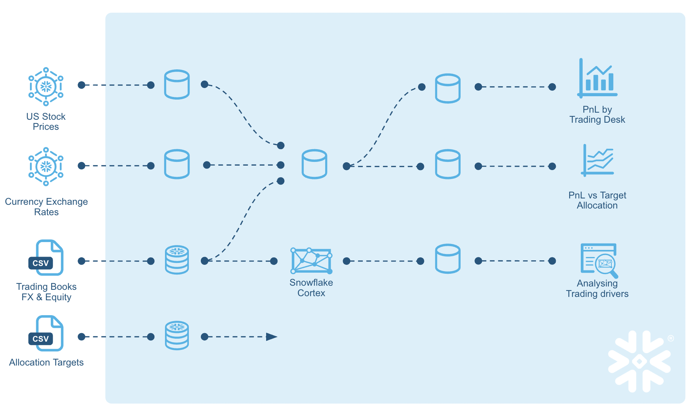


### Prerequisites
* Familiarity with dbt
* Familiarity with Snowflake
* Familiarity with Git repositories and GitHub

### What You’ll Need
You will need the following things before beginning:

* Snowflake account
    * **A Snowflake Account**. Visit the [Snowflake Account Sign In](https://app.snowflake.com/) page to log into your account or to sign up for a trial account.
    * **A Snowflake user created with ACCOUNTADMIN permissions**. This user will be used to get things setup in Snowflake.
    * **Anaconda Terms & Conditions accepted**. See Getting Started section in [Third-Party Packages](https://docs.snowflake.com/en/developer-guide/udf/python/udf-python-packages.html#getting-started).
* GitHub account
    * **A GitHub account**. If you don't already have a GitHub account you can create one for free. Visit the [Join GitHub](https://github.com/signup) page to get started.

Let's get started! 🚀  

<!-- ------------------------ -->
## Setup

### Create a GitHub Personal Access Token
In order for Snowflake to authenticate to your GitHub repository, you will need to generate a personal access token. Please follow the [Creating a personal access token](https://docs.github.com/en/authentication/keeping-your-account-and-data-secure/managing-your-personal-access-tokens#creating-a-personal-access-token-classic) instructions to create your token.

Make sure to save the token before leaving the page, as we will be using it a couple of times during this Quickstart.

### Fork and clone the Quickstart Repository
You'll need to fork and clone of the repository for this Quickstart from your GitHub account. Visit the [Deploying Pipelines with Snowflake and dbt labs](https://github.com/Snowflake-Labs/sfguide-deploying-pipelines-with-snowflake-and-dbt-labs) and click on the "Code" button near the top right. 

```shell
gh repo clone Snowflake-Labs/sfguide-deploying-pipelines-with-snowflake-and-dbt-labs
```

### Import the notebook
Some steps in this quickstart will be initiated from **Snowflake Notebooks** for transparency. In a real-world scenario, these steps would typically be part of your codebase and executed using the [Snowflake CLI](https://docs.snowflake.com/en/developer-guide/snowflake-cli/index) and/or **GitHub Actions**.  

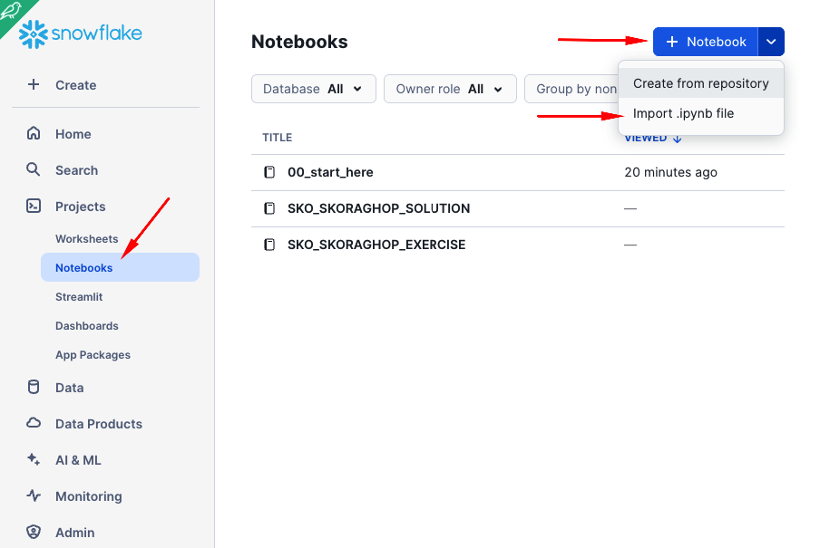

Pick `00_start_here.ipynb` that is in the root folder of the cloned repository. 

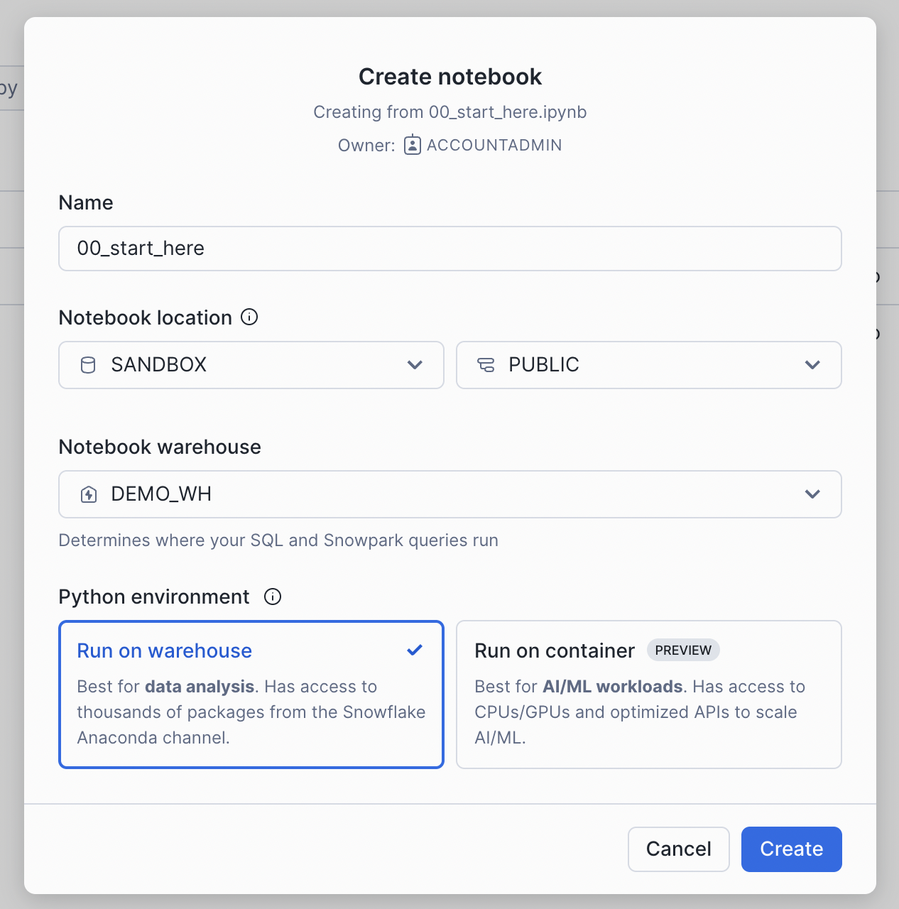

Once imported, it should look like this. **Congratulations! The first step is complete!** 🎉  

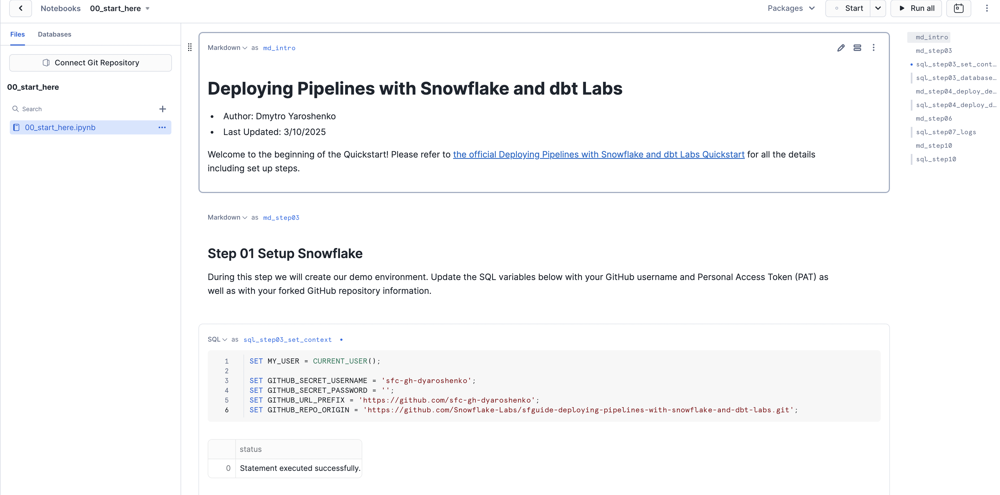


### Configure local dbt environment
In the repository you just checked out, there is a `./dbt_project` folder containing pre-built dbt pipelines. In `./dbt_project/dbt_project.yml`, you can see that the project expects to find a connection profile called `dbt_project`, which it will use later to access your Snowflake environment.

Let's open `~/.dbt/profiles.yml` and add the following content. (Note: You will need to update the configuration with your Snowflake account locator and password for the dbt_hol_user.)

```yml
dbt_project:
  outputs:
    dev:
      account: your_snowflake_account_locator
      database: dbt_hol_2025_dev
      password: your_snowflake_user_password
      role: dbt_hol_role_dev
      schema: public
      threads: 100
      type: snowflake
      user: dbt_hol_user
      warehouse: vwh_dbt_hol_dev
    prod:
      account: your_snowflake_account_locator
      database: dbt_hol_2025_prod
      password: your_snowflake_user_password
      role: dbt_hol_role_prod
      schema: public
      threads: 100
      type: snowflake
      user: dbt_hol_user
      warehouse: vwh_dbt_hol_prod
  target: dev
```
As you can see, we are setting up two targets: **dev** and **prod**, with **dev** as the default.
For more info on configuring your local dbt profiles configuration please refer to the [docs](https://docs.getdbt.com/docs/core/connect-data-platform/profiles.yml).

<!-- ------------------------ -->
## Access Data Products in Snowflake Marketplace

Now, let's get access to the datasets we can work with. **Snowflake Marketplace** makes this process very easy. There are thousands of well-curated, ready-to-use data products (as well as Native apps and models) right at your fingertips. In this quickstart, we will onboard two datasets, both of which are free/free-to-try as a trial:

### US equity trading price history
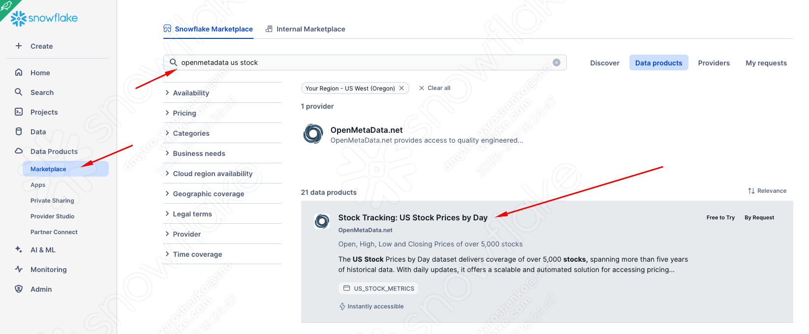
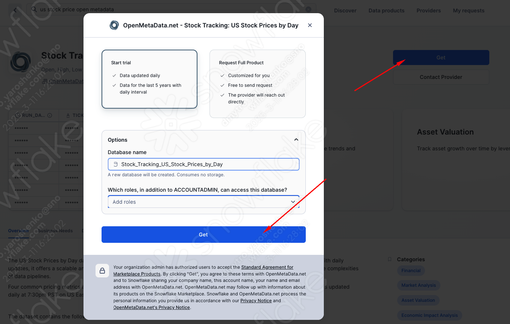

### FX rates
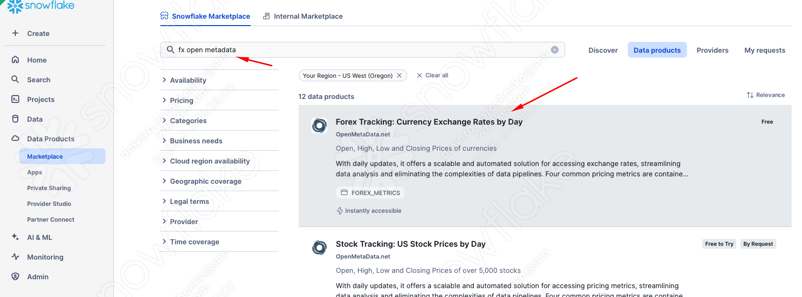
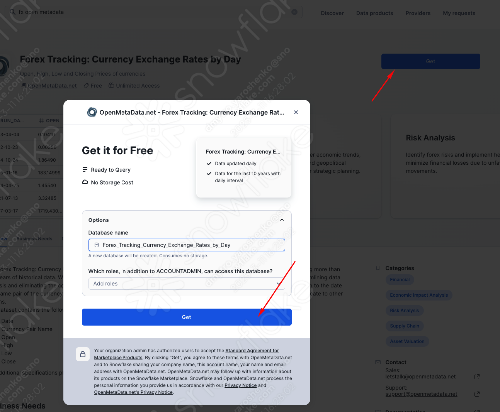

### Validate
Great! So easy. Now, if we go back to the notebook we uploaded and click **'Databases'**, we can see two new databases with tables shared with our account by the provider. No ETL, no latency, no extra storage, and as performant as if they were in your account.  

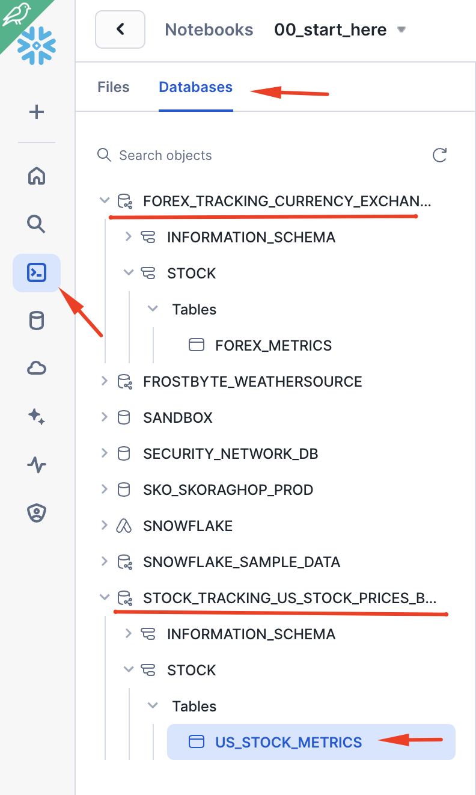

With that, let's move on to the next step 🚀 

<!-- ------------------------ -->
## Create Development Environment

### Connect to Git from Snowflake
ow, let's go back to the notebook we uploaded and start executing the cells.  
Before we do that, please ensure you have updated the information in cell ***Step 01 Setup Snowflake*** (`sql_step03_set_context`) with your credentials.
```sql
SET MY_USER = CURRENT_USER();

SET GITHUB_SECRET_USERNAME = 'yourgithubusername';
SET GITHUB_SECRET_PASSWORD = 'yourgithubtoken';
SET GITHUB_URL_PREFIX = 'https://github.com/yourgithubusername';
SET GITHUB_REPO_ORIGIN = 'https://github.com/Snowflake-Labs/sfguide-deploying-pipielines-with-snowflake-and-dbt-labs.git';
```
Once you execute cells `sql_step03_set_context` and `sql_step03_database_objects` in Step 01 Setup Snowflake, this should create a Git repository object in the SANDBOX.PUBLIC schema. If you click on the details arrow, you should see the content of the Git repository/branch.

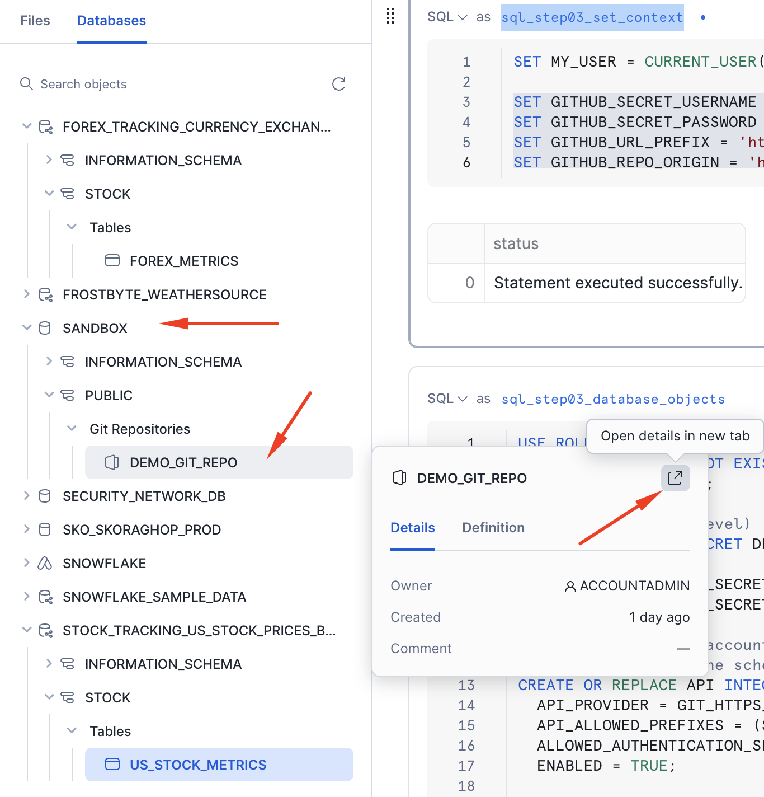

### Create development environment

Now, let's run cell ***Step 02 Setup dev environment*** (`sql_step04_deploy_dev_notebooks`).  
Let's take a moment to discuss what's happening here. We just mounted the Git repository, and it’s a good idea to ensure we fetch the latest changes from the main branch before using its content. Technically, the content of the repo is acting like a stage object in Snowflake. As the next step, we issue the `EXECUTE IMMEDIATE FROM @GIT/..` command, which runs a script maintained externally, passing `env='DEV'` as an argument.

```sql
USE ROLE ACCOUNTADMIN;
USE DATABASE SANDBOX;

ALTER GIT REPOSITORY DEMO_GIT_REPO FETCH;
EXECUTE IMMEDIATE FROM @DEMO_GIT_REPO/branches/main/scripts/deploy_environment.sql USING (env => 'DEV');
```
If you look inside the `deploy_environment.sql` file, you'll notice that it uses two very useful constructs:
- **Jinja macro**: This allows running the same code with different parameters (in our case, it helps provision multiple template-based environments).
- **`CREATE OR ALTER`** construct: This greatly simplifies the process of generating delta DDL commands to change or create your target environment. In this scenario, we are using it for fairly basic tasks, but it is an important step towards a declarative definition of your environment and good DevOps practices. You can read more about it in the [docs](https://docs.snowflake.com/en/sql-reference/sql/create-or-alter).

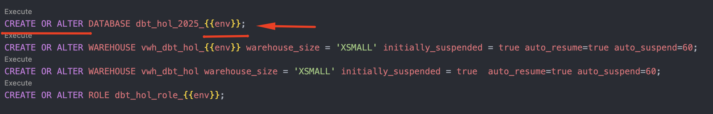

Great. Once cell executed we should now have a dev environment(database, roles, warehouses) and be ready to start running pipelines! 

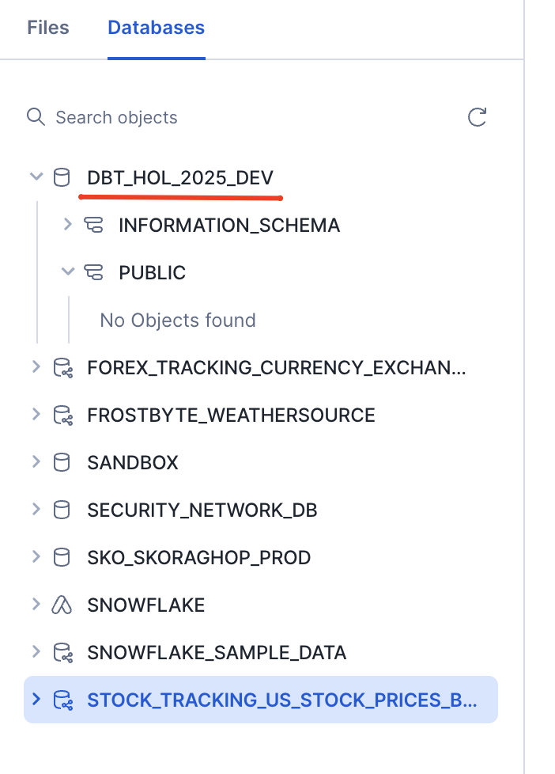

<!-- ------------------------ -->
## Upload Manual Sources

With all this prep next step should go swiftly.
For this, let's change the directory to the `./dbt_project`  in the repo and run dbt seed command:

```shell
cd dbt_project
dbt seed
```

What's happening now is that dbt will connect to the default connection profile (dev) and will automatically create tables for all CSV files located in the `dbt_project/seed` folder.  

In our scenario, this represents the idea of loading static data, such as allocation weights, that could be maintained as part of the codebase.
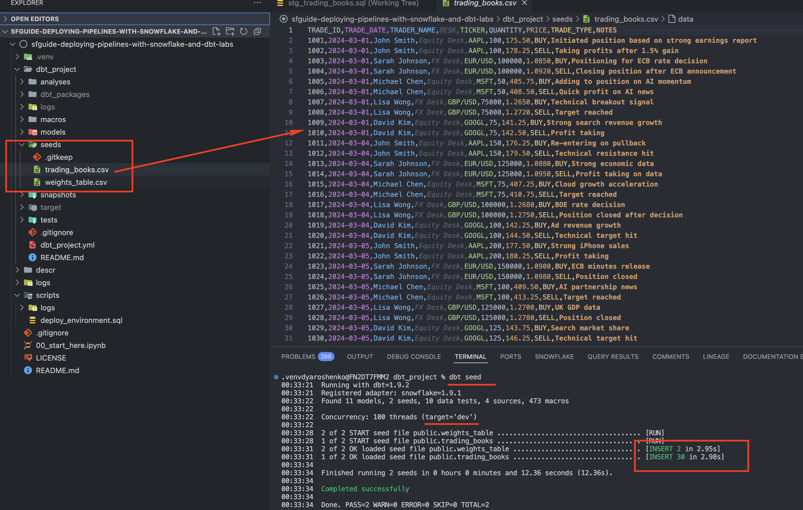


<!-- ------------------------ -->
## Deploy Dev Pipelines

Amazing! Let’s start creating models to represent our pipeline. As you can see from the screenshot below, in `dbt_project/models`, there are three subfolders representing the logical grouping of models into staging, intermediate, and marts. It’s up to you to decide which breakdown will fit your solution best, but this is a great technique for making quick changes at the layer level in `dbt_project.yml`. In our quickstart, for example, models in these folders will be persisted in different schemas on the database side.

Let’s run the project:

```shell
cd dbt_project
dbt run
```

As you can see from the logs, models by default have a materialization of view, which is super fast to change during the prototyping stage. These can then be selectively adjusted if and when necessary.

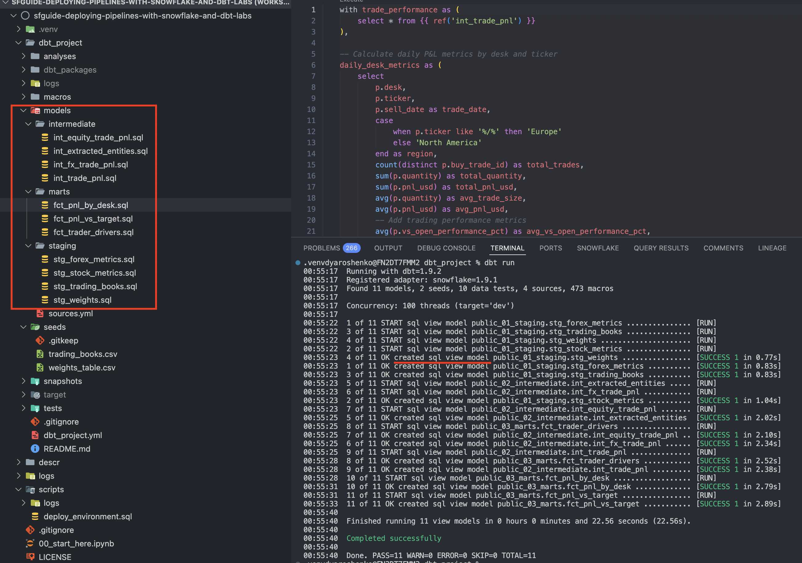

Congratulations! You just deployed your first pipelines! You can now query any of these objects or generate dbt documentation to share with your colleagues to better understand what you are building.

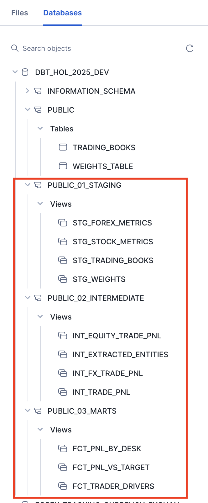

```shell
cd dbt_project
dbt docs generate
dbt docs serve
```

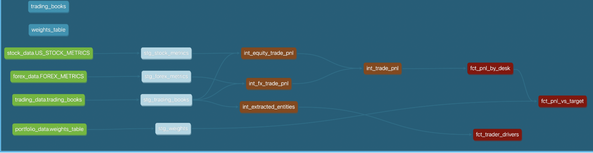

Since all models are materialized as views, the results are always up-to-date. However, they are calculated at runtime, using the compute power provided by the user when querying. With Snowflake, you can achieve a lot with virtual transformations, but if your objects need to be accessed by many users, materializing results starts to make sense. How can you do it efficiently? Let's see in the next chapter.

<!-- ------------------------ -->
## Change Materializations

In a previous chapter, we deployed all models as views and discussed the trade-offs. In this chapter, we will demonstrate the ease of changing model materialization by converting them into tables. This means every time the `dbt run` command is issued, it will generate a CTAS query to re-deploy the entire content. This is great for illustration purposes, but in real life, please be pragmatic: materialize results that make sense to be materialized for reuse and learn about [incremental](https://docs.getdbt.com/docs/build/incremental-models) materialization to maintain the efficiency of the pipeline.

For now, to keep things simple lets open `dbt_project/dbt_project.yml` and update materialization settings for all model folders from `view` to `table`.

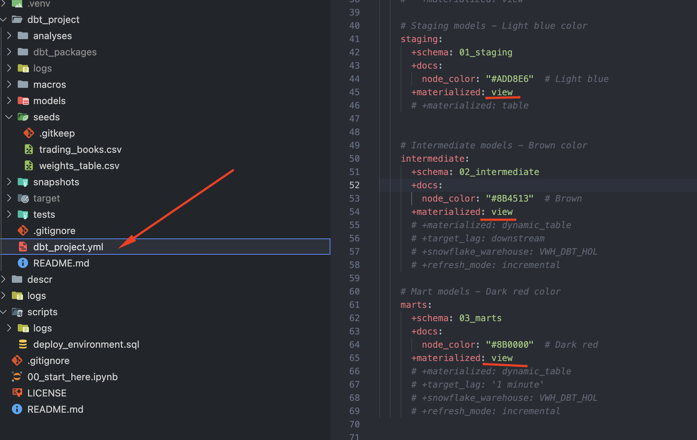

Once done, lets run dbt again:

```shell
cd dbt_project
dbt run
```

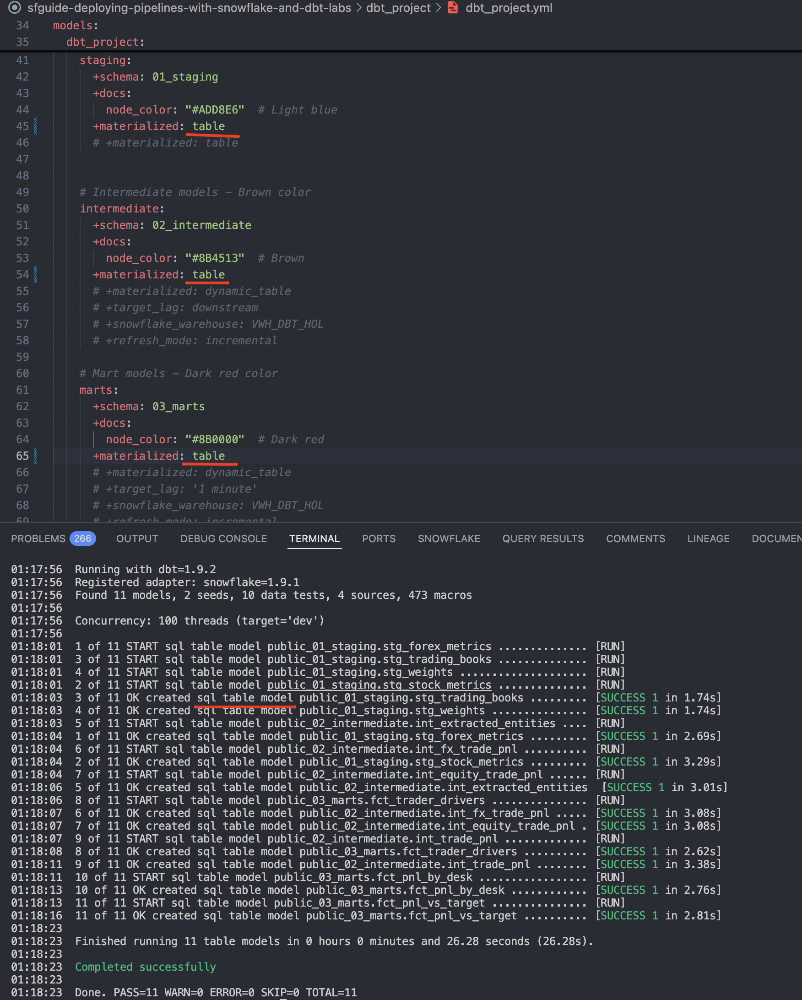
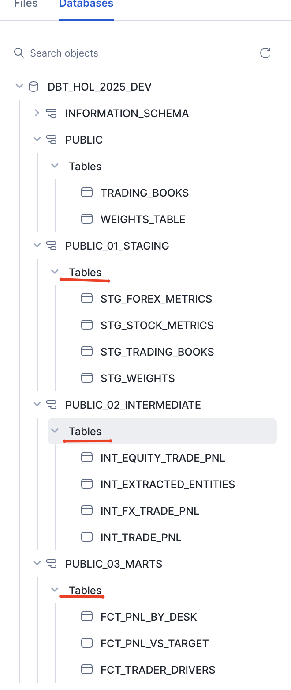

Now you see another angle of why dbt is such a force multiplier. It allows you to focus on the content of your data products, while the framework takes care of generating the DDL to deploy them with various materialization options.

<!-- ------------------------ -->
## Change Materializations: Dynamic Tables
As the next step in optimization, let's try something new. Go back to `dbt_project/dbt_project.yml` and change the `intermediate` and `mart` models to be deployed as [Dynamic Tables](https://docs.snowflake.com/en/sql-reference/sql/create-dynamic-table). Uncomment the code provided in the repository, similar to what you see in the screenshot below. You might notice that I am deliberately forcing the `refresh_mode=incremental` (the default is AUTO) to illustrate a few ideas later on. In real scenarios, we recommend the default value, allowing the constantly-improving Snowflake engine to decide the best refresh mode based on the context.

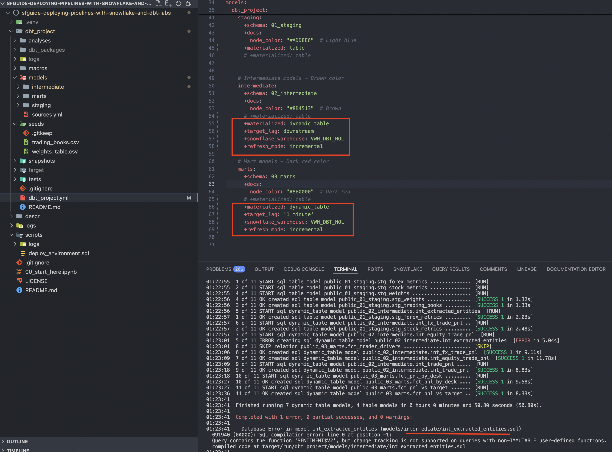

```shell
cd dbt_project
dbt run
```

Once you run it, you'll notice that the run failed because one of the models (**int_extracted_entities**) uses a non-deterministic function and can't be reliably refreshed incrementally. We will use this as an opportunity to illustrate the possibility of overwriting settings defined at the project level (**dbt_project.yml**) with settings directly inside the model file. While we are here, it is a great opportunity to highlight how easy it is to use the power of LLMs with Snowflake Cortex functions. In this scenario, we first ask the LLM to extract meaningful signals from the notes provided by a trader and subsequently classify them either as a strategy or a reaction to a market signal. Cool, isn't it? 

Let's update `int_extracted_entities.sql` and its downstream model `fct_trader_drivers.sql` to implement `refresh_mode=full` and run dbt again:

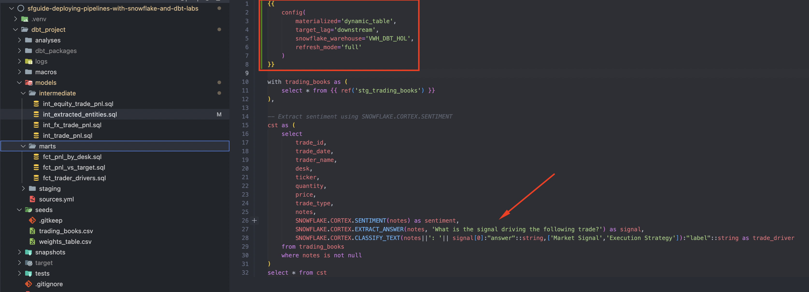
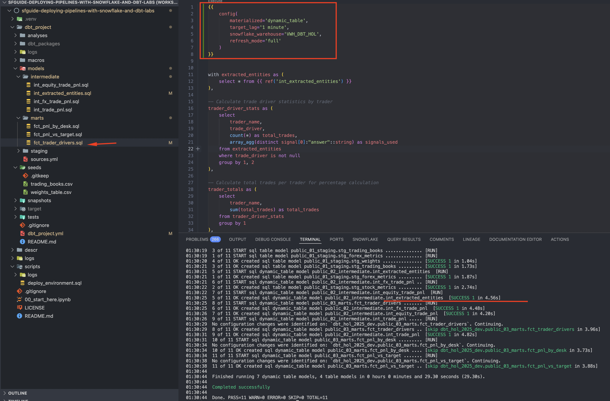

```shell
cd dbt_project
dbt run
```

Now we can validate from the Snowflake UI that the changes are successfully deployed and will be managed incrementally:
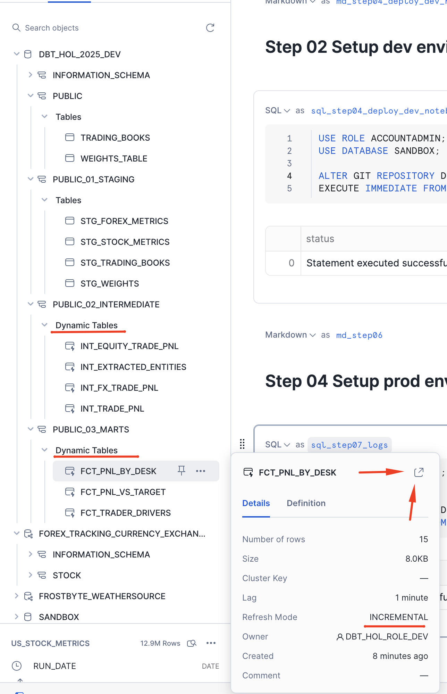
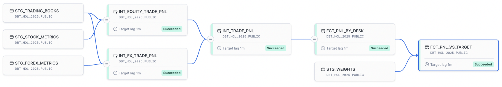


<!-- ------------------------ -->
## Create and Deploy to Production Envirornment

### Create production environment

Similar to a way we created `dev` environment before we can go back to our notebook and execute cell `04 Setup Prod environment` to build the `prod` environment. 

```sql
USE ROLE ACCOUNTADMIN;
USE DATABASE SANDBOX;

ALTER GIT REPOSITORY DEMO_GIT_REPO FETCH;
EXECUTE IMMEDIATE FROM @DEMO_GIT_REPO/branches/main/scripts/deploy_environment.sql USING (env => 'PROD');
```

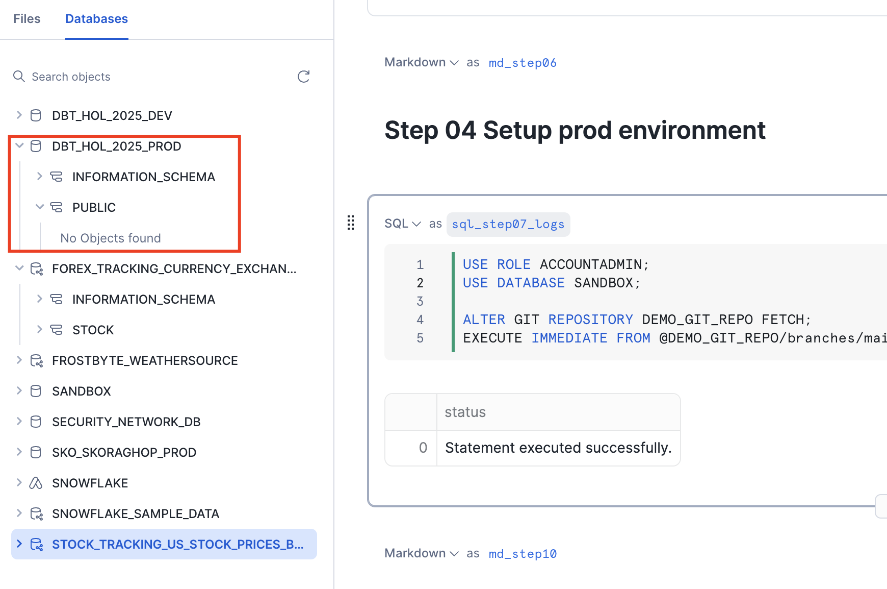

### Deploy latest version of dbt pipelines to prod

```shell
dbt seed --target=prod
dbt run  --target=prod
```

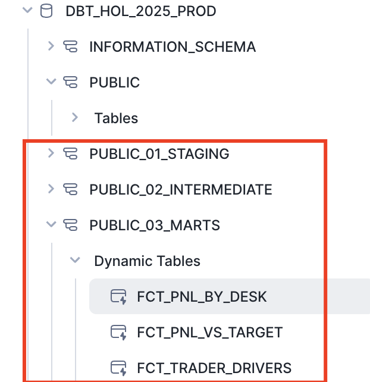

As you can see, we start by deploying sample data and then simply change the target. Behind the scenes, dbt will use another database, role, and warehouse to deploy the production codebase and schedule its dynamic tables to run. Voilà! In a real-world scenario, such a deployment can be performed by GitHub Actions once a pull request is merged from the release candidate branch into the main branch.

Hope you can see how this can help building and deploying reliable pipelines. 

<!-- ------------------------ -->
## Cleanup

Once you're finished with the Quickstart and want to clean things up, toggle back to the `00_start_here` Notebook and scroll down to the "Step 10 Teardown" section. Then just run the SQL commands in the `sql_step10` cell to remove all the objects created during the Quickstart.

Finally, you can delete the `00_start_here` Notebook. With the Notebook open click on the ":" button near the top right of the window and click on "Delete".

<!-- ------------------------ -->
## Conclusion And Resources

Congratulations! You have now built end-to-end data engineering pipelines with dbt and Snowflake. You've also seen how to follow a complete Software Development Life Cycle (SDLC) for data engineering with Notebooks, including integration with Git, deploying to multiple environments through a CI/CD pipeline, instrumenting your code for monitoring and debugging, and orchestrating the pipelines with Dynamic Tables. Here's a quick visual recap:


Hopefully you now have the building blocks, and examples, you need to get started building your own data engineering pipelines with dbt and Snowflake. So, what will you build now?

### What You Learned
* How to build and deploy pipelines using dbt and Snowflake
* How to change materialization options to achieve your service objectives
* How to upload data via SnowSight UI
* How to access data from Snowflake Marketplace and use it for your analysis
* How to use Snowflake Notebooks to deploy environment changes
* How to use Snowflake DevOps features, including CREATE OR ALTER
* How to execute SQL scripts from your Git repository directly in Snowflake
* How to build CI/CD pipelines using Snowflake's Git Integration

### Related Resources
* [Source Code on GitHub](https://github.com/Snowflake-Labs/sfguide-deploying-pipelines-with-snowflake-and-dbt-labs)
* [Data Engineering Pipelines with Snowpark Python](/en/developers/guides/data-engineering-pipelines-with-snowpark-python/) (Advanced Quickstart)
* [About Snowflake Notebooks](https://docs.snowflake.com/en/user-guide/ui-snowsight/notebooks)
* [Snowflake CLI](https://docs.snowflake.com/en/developer-guide/snowflake-cli-v2/index)
