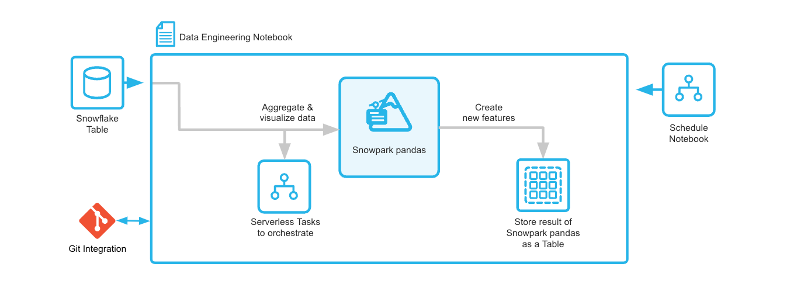
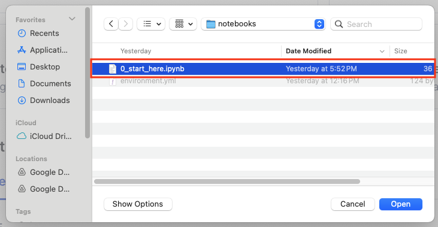
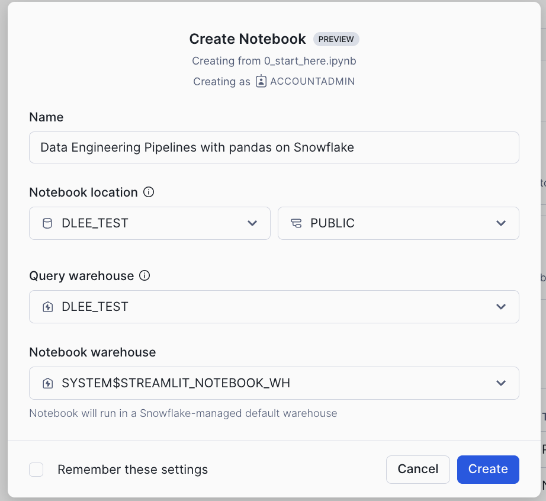
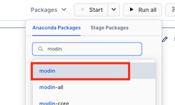

author: Mats Stellwall, Doris Lee
id: data-engineering-pipelines-with-snowpark-pandas
categories: snowflake-site:taxonomy/solution-center/certification/quickstart, snowflake-site:taxonomy/solution-center/certification/certified-solution, snowflake-site:taxonomy/solution-center/includes/architecture, snowflake-site:taxonomy/product/data-engineering, snowflake-site:taxonomy/snowflake-feature/transformation
language: en
summary: Build data engineering pipelines with Snowpark pandas for familiar DataFrame transformations at Snowflake scale.
environments: web
status: Published 
feedback link: https://github.com/Snowflake-Labs/sfguides/issues


# Data Engineering Pipeline with pandas on Snowflake
<!-- ------------------------ -->
## Overview 

Through this quickstart, you will learn how to use [Snowflake Notebooks](https://docs.snowflake.com/user-guide/ui-snowsight/notebooks), [pandas on Snowflake](https://docs.snowflake.com/developer-guide/snowpark/python/snowpark-pandas), [Git integration](https://docs.snowflake.com/en/user-guide/ui-snowsight/notebooks-snowgit), and [Serverless Tasks](https://docs.snowflake.com/en/user-guide/tasks-intro) to build an end-to-end data engineering pipeline.

You will create a customer profile using the [Snowflake Sample TPC-H dataset](https://docs.snowflake.com/en/user-guide/sample-data-tpch), save it into a Snowflake table and to create a serverless task to schedule the feature engineering.



### What You’ll Learn

* how to build a Python data pipeline with Snowflake Notebooks
* how to aggregate and transform data to create new features with pandas on Snowflake
* how to version control and collaborate with Git integration
* how to create a Serverless Task to schedule the feature engineering

### What is pandas on Snowflake?

pandas on Snowflake lets you run your pandas code in a distributed manner scalably and securely directly on your data in Snowflake. Just by changing the import statement and a few lines of code, you can get the same pandas-native experience you know and love with the scalability and security benefits of Snowflake. With pandas on Snowflake this API, you can work with much larger datasets and avoid the time and expense of porting your pandas pipelines to other big data frameworks or provisioning large and expensive machines. It runs workloads natively in Snowflake through transpilation to SQL, enabling it to take advantage of parallelization and the data governance and security benefits of Snowflake. 

### Why use pandas on Snowflake?
pandas is the go-to data processing library for millions worldwide, including countless Snowflake users. However, pandas was never built to handle data at the scale organizations are operating today. Running pandas code requires transferring and loading all of the data into a single in-memory process. It becomes unwieldy on moderate-to-large data sets and breaks down completely on data sets that grow beyond what a single node can handle. With pandas on Snowflake, you can run the same pandas code, but with all the pandas processing pushed down to run in a distributed fashion in Snowflake. Your data never leaves Snowflake, and your pandas workflows can process much more efficiently using the Snowflake elastic engine. This brings the power of Snowflake to pandas developers everywhere.

pandas on Snowflake is delivered through the Snowpark pandas API as part of the Snowpark Python library, which enables scalable data processing of Python code within the Snowflake platform. You will learn how to use Snowpark pandas as part of this quickstart. This quickstart will focus on getting started with Snowpark pandas API, and enable you to perform common pandas operations on large volumes of data while leveraging the power of Snowflake.

Learn more about [Snowpark Pandas API](https://docs.snowflake.com/en/developer-guide/snowpark/python/snowpark-pandas).


### Prerequisites
* [Git](https://git-scm.com/book/en/v2/Getting-Started-Installing-Git) installed
    >
    >Clone or download the [git repo](https://github.com/Snowflake-Labs/sfguide-data-engineering-pipelines-with-pandas-on-snowflake)
* A Snowflake account. If you do not have a Snowflake account, you can register for a [free trial account](https://signup.snowflake.com/?utm_source=snowflake-devrel&utm_medium=developer-guides&utm_cta=developer-guides).
* A Snowflake account login with a role that has the ability to create database, schema and tables. If not, you will need to register for a free trial or use a different role.

### What You’ll Build 
A Customer profile table using the Snowpark Pandas API and a serverless task that will run the feature engineering pipeline on a schedule.

<!-- ------------------------ -->
## Setup The Snowflake Environment

### Overview
This section covers cloning of the GitHub repository and creating the needed Snowflake objects (i.e role, warehouse, database, schema, etc..)

### Clone The Git Repository
The very first step is to clone the [GitHub repository](https://github.com/Snowflake-Labs/sfguide-data-engineering-pipelines-with-pandas-on-snowflake). This repository contains all the code you will need to successfully complete this QuickStart Guide.

Using HTTPS:

```shell
git clone https://github.com/Snowflake-Labs/sfguide-data-engineering-pipelines-with-pandas-on-snowflake.git
```

OR, using SSH:

```shell
git clone git@github.com:Snowflake-Labs/sfguide-data-engineering-pipelines-with-pandas-on-snowflake.git
```

You can also use the Git integration feature of Snowflake Notebooks, in order to do that you need to fork the [GitHub repository](https://github.com/Snowflake-Labs/sfguide-data-engineering-pipelines-with-pandas-on-snowflake) to be allowed to commit changes. For instructions how to set up Git integration for your Snowflake account see [here](https://docs.snowflake.com/developer-guide/git/git-setting-up) and for using it with Snowflake Notebooks see [this page](https://docs.snowflake.com/en/user-guide/ui-snowsight/notebooks-snowgit). You can refer to [this video](https://www.youtube.com/watch?v=4GOa1eUccmQ) for a walkthrough on how you can set up Git integration and use it with Snowflake Notebooks.

<!-- ------------------------ -->
## Setup Snowflake


During this step you will verify that the [Snowflake Sample TPC-H dataset](https://docs.snowflake.com/en/user-guide/sample-data-tpch) is available in your account, and if not add the share.

### Verify That The Snowflake Sample TPC-H Dataset Is Available

1. Log into [Snowsight](https://docs.snowflake.com/en/user-guide/ui-snowsight.html#) for your account
2. Navigate to **Databases**
3. Verify that you can see the **SNOWFLAKE_SAMPLE_DATA** database, if it is missing then you can add it folling the instructions [here](https://docs.snowflake.com/en/user-guide/sample-data-using).

### Create Database, Schema And Warehouse To Be Used

```SQL
USE ROLE ACCOUNTADMIN;

CREATE DATABASE SNOW_PANDAS_DE_QS;
CREATE SCHEMA SNOW_PANDAS_DE_QS.NOTEBOOKS;
CREATE SCHEMA SNOW_PANDAS_DE_QS.DATA;

CREATE WAREHOUSE SNOW_PANDAS_DE_QS_WH;
```
### Create Snowflake Notebook

### Navigate To Snowflake Notebooks

1. Navigate to the Notebooks section by clicking **Projects** and then **Notebooks**  

      
2. Click on the **down arrow* next to **+ Notebook**  

      
3. If you have set up git integration choose  **Create from repository**. If not, then choose **import .ipynb file**.

      

### Import .ipynb File
1. Navigate to where you have cloned the [GitHub repository](https://github.com/Snowflake-Labs/sfguide-data-engineering-pipelines-with-pandas-on-snowflake) and select **Customer Profile Creation Pipeline.ipynb** and click **Open**  
  
2. Give the notebook a name, then select **SNOW_PANDAS_DE_QS** and **NOTEBOOKS** for **Notebook location**, **SNOW_PANDAS_DE_QS_WH** for **Notebook warehouse** and click **Create**  
  

### Create From Repository

If you have forked the [GitHub repository](https://github.com/Snowflake-Labs/sfguide-data-engineering-pipelines-with-snowpark-pandas) and create a Git integration to it in Snowflake you can open the notebook directly from the repository. See [here](https://docs.snowflake.com/en/developer-guide/git/git-overview) for instructions on how to set up Git integration.

1. In the **Create Notebook from Repository** dialog, click on **Select .ipynb file**  
  
2. In the **Select file from Git Repository** dialog, click on the repository integration you are using and select the notebook file and click **Select File**, if you do not see the file press **Fetch** to refresh with the latest changes from the repository  
3. Back to the **Create Notebook from Repository** dialog, give the notebook a name, then select **SNOW_PANDAS_DE_QS**, **NOTEBOOKS** for **Notebook location** and **SNOW_PANDAS_DE_QS_WH** for **Notebook warehouse** and click **Create**  

### Add Required Python Libraries

Before you run the notebook you need to add the following Python libraries:
* modin
* snowflake
* matplotlib
* seaborn

1. In the Notebook click on **Packages**  
2. Search for **modin** and select **modin** in the list  
  
3. Do the same for **snowflake**, **matplotlib** and **seaborn**. When done you should have the same packages as the list below (the versions might differ)  
  


<!-- ------------------------ -->
## Data Engineering with pandas on Snowflake

During this step you will learn how to use pandas on Snowflake to:
* Create datframe from a Snowflake table
* Aggregate data to create new features
* Join dataframes
* Save the result into a Snowflake table
* Create a serverless task to schedule the feature engineering pipeline (Currently in Private Preview)

Follow along and run each of the cells in [the Notebook](https://github.com/Snowflake-Labs/sfguide-data-engineering-pipelines-with-pandas-on-snowflake/blob/main/notebooks/0_start_here.ipynb).

Within this Notebook, we will use Snowpark Pandas API to create DataFrames, join them, create new features and create a serverless task to schedule the feature engineering pipeline.

<!-- ------------------------ -->
## Conclusion And Resources

Congratulations, you have successfully completed this quickstart! Through this quickstart, we were able to showcase how you can use [Snowflake Notebooks](https://docs.snowflake.com/user-guide/ui-snowsight/notebooks), [pandas on Snowflake](https://docs.snowflake.com/developer-guide/snowpark/python/snowpark-pandas), [Git integration](https://docs.snowflake.com/en/user-guide/ui-snowsight/notebooks-snowgit), and [Serverless Tasks](https://docs.snowflake.com/en/user-guide/tasks-intro) to build an end-to-end data engineering pipeline.

### What You Learned

- how to build a Python data pipeline with Snowflake Notebooks
- how to aggregate and transform data to create new features with pandas on Snowflake
- how to version control and collaborate with Git integration
- how to create a Serverless Task to schedule the feature engineering

### Related Resources

* [Source Code on GitHub](https://github.com/Snowflake-Labs/sfguide-data-engineering-pipelines-with-pandas-on-snowflake)
* [pandas on Snowflake Developer Guide](https://docs.snowflake.com/en/developer-guide/snowpark/python/snowpark-pandas)
* [Getting Started with pandas on Snowflake Quickstart](/en/developers/guides/getting-started-with-pandas-on-snowflake/)
* [Download Reference Architecture](/content/dam/snowflake-site/developers/2024/07/End-to-end-Data-Engineering-with-Snowpark-Pandas.pdf)
* [Read the Medium Blog](/en/blog/run-pandas-tb-enterprise-data-snowflake/)
* [Watch the Demo](https://youtu.be/qbcHE1FcX4g?list=TLGG_7g9SQPseKoyMjA5MjAyNQ)
