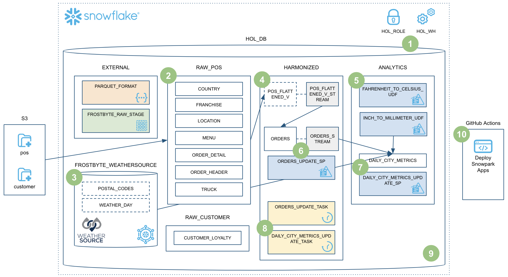
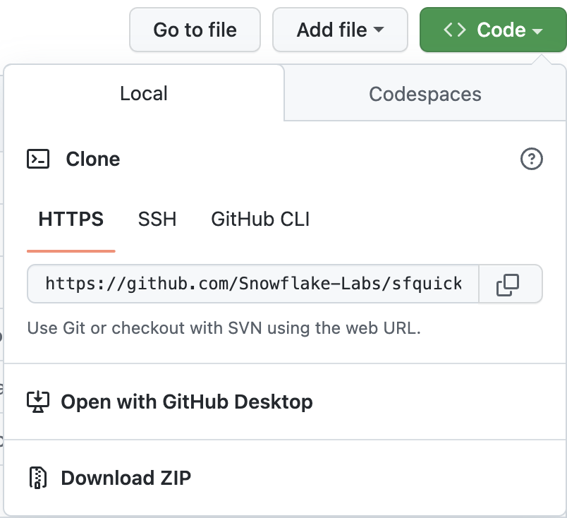
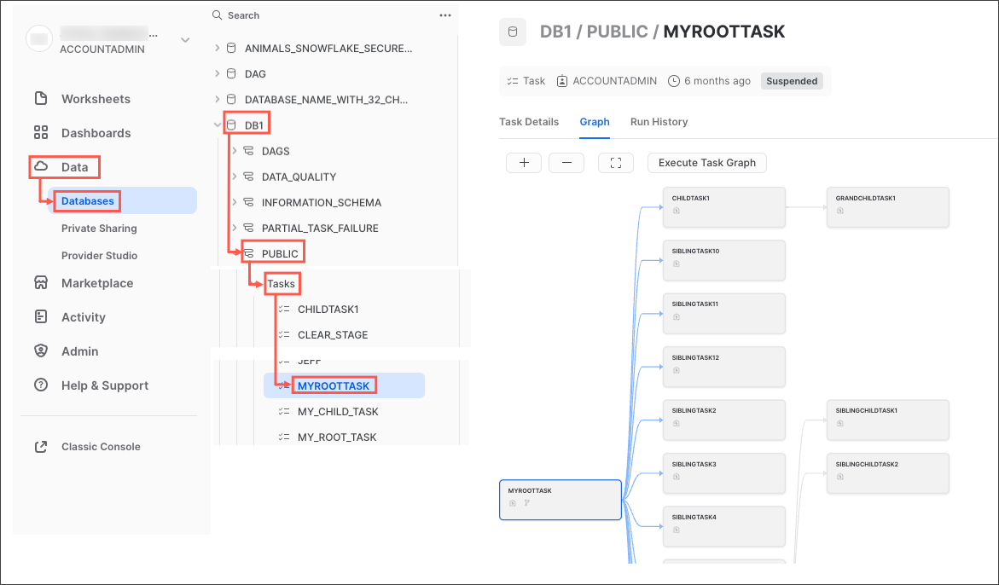
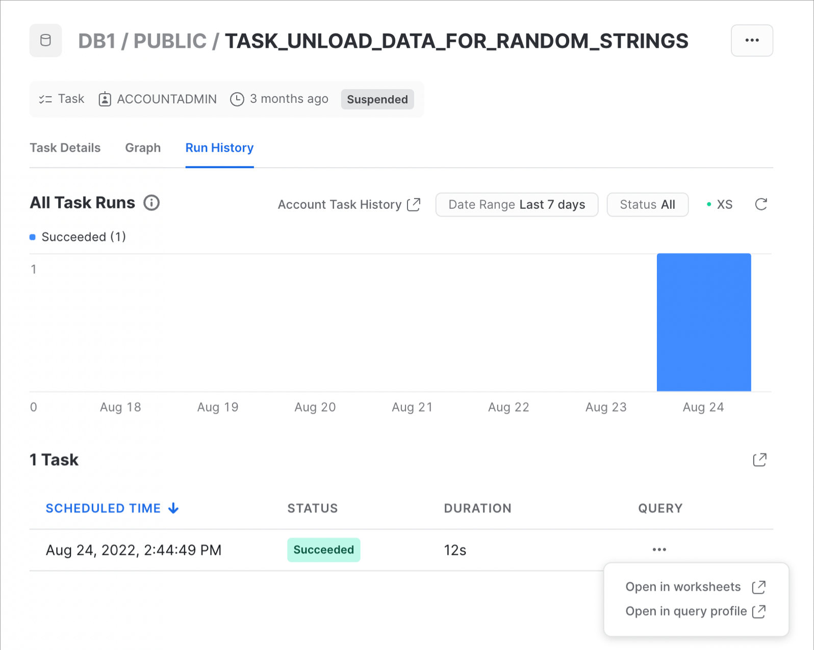
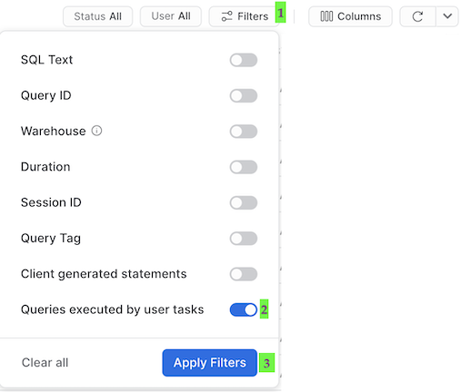
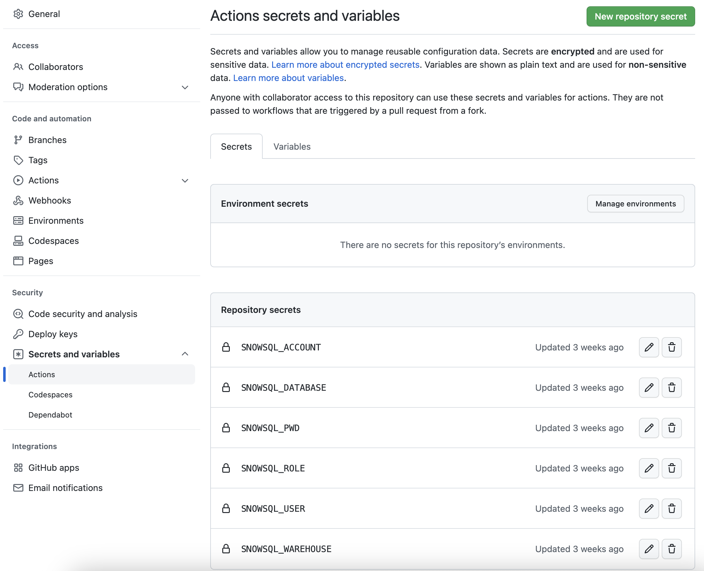
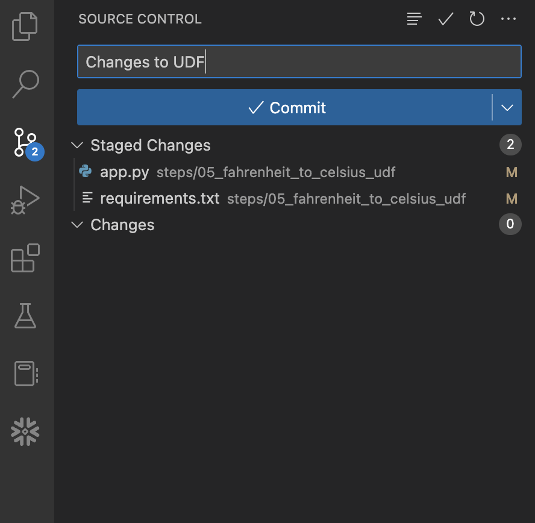

authors: Jeremiah Hansen
id: data-engineering-pipelines-with-snowpark-python-it
categories: snowflake-site:taxonomy/solution-center/certification/quickstart, snowflake-site:taxonomy/product/data-engineering
language: it
summary: Questa guida fornisce indicazioni dettagliate per creare pipeline di data engineering con Snowpark Python
environment: web
status: Pubblished
feedback link: https://github.com/Snowflake-Labs/sfguides/issues

# Pipeline di data engineering con Snowpark Python
<!-- ------------------------ -->
## Panoramica 

> “I data engineer si concentrano principalmente sulla creazione e la manutenzione delle pipeline di dati, che trasportano i dati attraverso vari passaggi per restituirli in uno stato utilizzabile… Il processo di data engineering include tutto il lavoro necessario per creare **pipeline di dati** che automatizzano il trasferimento di dati da un luogo all’altro e li trasformano in un formato specifico per un determinato tipo di analisi. In questo senso, il data engineering non è un compito che si svolge una sola volta. È una procedura che continua nel tempo e comporta la raccolta, la preparazione, la trasformazione e la distribuzione dei dati. Una pipeline di dati aiuta ad automatizzare queste attività perché possano essere ripetute in modo affidabile. È una procedura più che una specifica tecnologia.” (Da Cloud Data Engineering for Dummies, Snowflake Special Edition)

Ti interessa sfruttare la potenza di Snowpark Python per creare pipeline di data engineering? Allora questo quickstart fa al caso tuo! Qui ci concentreremo sulla creazione di pipeline di data engineering con Python, non sulla data science. Per alcuni esempi di come utilizzare Snowpark Python per la data science, prova il nostro quickstart [Machine Learning with Snowpark Python: - Credit Card Approval Prediction](/en/developers/guides/getting-started-snowpark-machine-learning/).

Questo quickstart tratterà molti argomenti e al termine avrai creato una solida pipeline di data engineering utilizzando le stored procedure di Snowpark Python. La pipeline elaborerà i dati in modo incrementale, sarà orchestrata con task di Snowflake e sarà distribuita tramite una pipeline CI/CD. Inoltre imparerai come utilizzare il nuovo strumento CLI per sviluppatori e l’estensione Visual Studio Code di Snowflake. Ecco una rapida panoramica grafica:




Allaccia le cinture e preparati a partire!

> aside negative
> 
> **Nota**: al 1 febbraio 2023, sia l’[estensione Visual Studio Code di Snowflake](https://marketplace.visualstudio.com/items?itemName=snowflake.snowflake-vsc) che lo [strumento SnowCLI](https://github.com/Snowflake-Labs/snowcli) sono ancora in preview.


### Prerequisiti
* Familiarità con Python
* Familiarità con la DataFrame API
* Familiarità con Snowflake
* Familiarità con i repository Git e con GitHub

### Cosa imparerai
Nel corso di questo quickstart esplorerai le seguenti caratteristiche di Snowflake:

* Formato di tabella di Snowflake
* Ingestion di dati con COPY
* Inferenza dello schema
* Condivisione dei dati/Marketplace (invece di ETL)
* Stream per l’elaborazione incrementale (CDC)
* Stream sulle viste
* UDF Python (con pacchetti di terze parti)
* Stored procedure di Python
* Snowpark DataFrame API
* Programmabilità di Snowpark Python
* Elasticità dei warehouse (scalabilità dinamica)
* Estensione nativa Visual Studio Code di Snowflake (public preview, integrazione Git)
* SnowCLI (public preview)
* Task (con attivazione tramite stream)
* Osservabilità dei task
* Integrazione delle GitHub Actions (CI/CD)

### Cosa ti serve
Prima di iniziare dovrai disporre di:

* Snowflake
    * **Un account Snowflake**
    * **Un utente Snowflake creato con autorizzazioni ACCOUNTADMIN**. Utilizzeremo questo utente per configurare l’ambiente in Snowflake.
    * **Termini e condizioni di Anaconda accettati**. Consulta la sezione Getting Started della [documentazione sull’uso di pacchetti di terze parti](https://docs.snowflake.com/en/developer-guide/udf/python/udf-python-packages.html#getting-started).
* Miniconda
    * **Miniconda installato sul tuo computer**. Scarica e installa [Miniconda](https://conda.io/miniconda.html). In alternativa, puoi usare qualsiasi altro ambiente Python con Python 3.8.
* SnowSQL
    * **SnowSQL installato sul tuo computer**. Vai alla [pagina di download di SnowSQL](https://developers.snowflake.com/snowsql/) e consulta la pagina [Installare SnowSQL](https://docs.snowflake.com/en/user-guide/snowsql-install-config.html) per maggiori informazioni.
* Git
    * **Git installato sul tuo computer**. Per maggiori informazioni, consulta la pagina [Per iniziare - Installazione di Git](https://git-scm.com/book/en/v2/Getting-Started-Installing-Git).
    * **Git configurato con il tuo nome utente e indirizzo email**. Se non l’hai ancora fatto, [imposta il tuo nome utente Git](https://docs.github.com/en/get-started/getting-started-with-git/setting-your-username-in-git#setting-your-git-username-for-every-repository-on-your-computer) e [imposta il tuo indirizzo email Git](https://docs.github.com/en/account-and-profile/setting-up-and-managing-your-personal-account-on-github/managing-email-preferences/setting-your-commit-email-address#setting-your-email-address-for-every-repository-on-your-computer) sul tuo computer locale.
* Visual Studio Code con le estensioni richieste
    * **Visual Studio Code installato sul tuo computer**. Vai alla home page di [Visual Studio Code](https://code.visualstudio.com/) per il link alla pagina di download.
    * **Estensione Python installata**. Cerca e installa l’estensione “Python” (fornita da Microsoft) nel riquadro *Extensions* in VS Code.
    * **Estensione Snowflake installata**. Cerca e installa l’estensione “Snowflake” (fornita da Snowflake) nel riquadro *Extensions* in VS Code.
* Account GitHub con un fork del repository del workshop clonato localmente
    * **Un account GitHub**. Se non hai già un account GitHub, puoi crearne uno gratuitamente. Visita la [pagina di registrazione di GitHub](https://github.com/signup) per iniziare.

### Cosa realizzerai
Nel corso di questo quickstart eseguirai le seguenti operazioni:

* Caricare i dati Parquet in Snowflake utilizzando l’inferenza dello schema
* Configurare l’accesso ai dati del Marketplace Snowflake
* Creare un’UDF Python per convertire la temperatura
* Creare una pipeline di data engineering con stored procedure di Python per elaborare i dati in modo incrementale
* Orchestrare le pipeline con i task
* Monitorare le pipeline con Snowsight
* Distribuire le stored procedure di Snowpark Python tramite una pipeline CI/CD


<!-- ------------------------ -->
## Configurare il quickstart

### Creare e clonare un fork del repository per il quickstart
Dovrai creare un fork del repository per questo quickstart nel tuo account GitHub. Visita il [repository Data Engineering Pipelines with Snowpark Python su GitHub](https://github.com/Snowflake-Labs/sfguide-data-engineering-with-snowpark-python) e fai clic sul pulsante “Fork” in alto a destra. Completa gli eventuali campi richiesti e fai clic su “Create Fork”.

Per impostazione predefinita le GitHub Actions disabilitano qualsiasi flusso di lavoro (o pipeline CI/CD) definito nel fork del repository. Questo repository contiene un flusso di lavoro per distribuire le tue UDF e stored procedure di Snowpark Python, che utilizzeremo più avanti. Per il momento, abilita questo flusso di lavoro aprendo il tuo fork del repository in GitHub, facendo clic sulla scheda `Actions` al centro nella parte superiore della pagina e poi facendo clic sul pulsante verde `I understand my workflows, go ahead and enable them`.


A questo punto devi clonare il nuovo fork del repository sul tuo computer locale. Per i dettagli sulla connessione del nuovo repository Git, apri il repository, fai clic sull’icona verde “Code” nella parte superiore della pagina e copia il link “HTTPS”.



Utilizza il link in VS Code per clonare il repository sul tuo computer. Per maggiori informazioni, segui le istruzioni in [Clonare e usare un repository GitHub in Visual Studio Code](https://learn.microsoft.com/it-it/azure/developer/javascript/how-to/with-visual-studio-code/clone-github-repository). Puoi anche clonare il repository dalla riga di comando, se per te è più semplice, eseguendo i seguenti comandi:

``` bash
git clone <your-forked-repo-url>
cd sfguide-data-engineering-with-snowpark-python/
```

Una volta clonato il fork del repository sul tuo computer locale, apri la cartella con VS Code.

### Configurare le credenziali
Per questo quickstart non utilizzeremo direttamente [il client della riga di comando SnowSQL](https://docs.snowflake.com/en/user-guide/snowsql.html), ma memorizzeremo i dettagli della connessione a Snowflake nel file di configurazione di SnowSQL in `~/.snowsql/config`. Se il file di configurazione di SnowSQL non esiste, creane uno vuoto.

Crea una configurazione SnowSQL per questo workshop aggiungendo la seguente sezione al file `~/.snowsql/config` (sostituendo myaccount, myusername e mypassword con il tuo account, il tuo nome utente e la tua password):

```
[connections.dev]
accountname = myaccount
username = myusername
password = mypassword
rolename = HOL_ROLE
warehousename = HOL_WH
dbname = HOL_DB
```

**Nota:** lo strumento SnowCLI (e per estensione questo quickstart) attualmente non può essere utilizzato con l’autenticazione a coppia di chiavi. Recupera semplicemente il tuo nome utente e la tua password dal file di configurazione condiviso di SnowSQL.

### Creare l’ambiente Anaconda
Crea e attiva un ambiente conda per questo workshop utilizzando il file `conda_env.yml` fornito a questo scopo. Esegui questi comandi da una finestra di Terminale nella directory root del tuo fork del repository locale.

``` bash
conda env create -f conda_env.yml
conda activate pysnowpark
```


<!-- ------------------------ -->
## Configurare Snowflake

### Estensioni Snowflake per VS Code
Puoi eseguire query SQL sui dati contenuti in Snowflake in molti modi diversi (tramite l’interfaccia utente Snowsight, SnowSQL, ecc.), ma per questo quickstart utilizzeremo l’estensione Snowflake per VS Code. Per una breve panoramica dell’estensione nativa di Snowflake per VS Code, consulta la [pagina dell’estensione VS Code nel Marketplace Snowflake](https://marketplace.visualstudio.com/items?itemName=snowflake.snowflake-vsc).

### Eseguire lo script
Per configurare tutti gli oggetti che ci serviranno in Snowflake per questo quickstart, esegui lo script `steps/01_setup_snowflake.sql`.

Per iniziare, fai clic sull’estensione Snowflake nella barra di navigazione sulla sinistra in VS Code. Quindi effettua il login al tuo account Snowflake con un utente dotato di autorizzazioni ACCOUNTADMIN. Una volta effettuato l’accesso a Snowflake, apri lo script `steps/01_setup_snowflake.sql` in VS Code tornando al browser dei file nella barra di navigazione sulla sinistra.

Per eseguire tutte le query di questo script, utilizza il pulsante “Execute All Statements” nell’angolo superiore destro della finestra dell’editor. In alternativa, se desideri eseguire le query in blocchi separati, puoi evidenziare quelle che vuoi eseguire e premere CMD/CTRL+Invio. 


<!-- ------------------------ -->
## Caricare i dati grezzi

In questo passaggio caricheremo i dati grezzi sui POS e sulla fidelizzazione dei clienti di Tasty Bytes dai file Parquet non elaborati in `s3://sfquickstarts/data-engineering-with-snowpark-python/` negli schemi `RAW_POS` e `RAW_CUSTOMER` in Snowflake. Orchestrerai questo processo dal tuo computer in Python utilizzando la Snowpark API per Python. Per contestualizzare, siamo al passaggio **2** della nostra panoramica del flusso di dati:


### Eseguire lo script
Per caricare i dati grezzi, esegui lo script `steps/02_load_raw.py`. Puoi farlo in diversi modi in VS Code, da un Terminale o direttamente tramite VS Code. Per questa demo devi eseguire gli script Python dal Terminale. Apri un Terminale in VS Code (Terminal -> New Terminal) nella barra dei menu in alto, assicurati che l’ambiente conda `pysnowpark` sia attivo, quindi esegui i seguenti comandi (che presuppongono che nel Terminale sia aperta la directory root del tuo repository):

``` bash
cd steps
python 02_load_raw.py
```

Mentre viene eseguito questo script, aprilo in VS Code e continua a leggere questa pagina per capire che cosa sta succedendo.

### Eseguire Snowpark Python localmente
In questo passaggio eseguirai il codice Snowpark Python localmente sul tuo computer. In fondo allo script compare un blocco di codice utilizzato per il debug locale (sotto il blocco `if __name__ == "__main__":`):

``` python
# For local debugging
if __name__ == "__main__": 
    # Add the utils package to our path and import the snowpark_utils function 
    import os, sys
    current_dir = os.getcwd() parent_dir = os.path.dirname(current_dir) sys.path.append(parent_dir)

    from utils import snowpark_utils
    session = snowpark_utils.get_snowpark_session()

    load_all_raw_tables(session)
#    validate_raw_tables(session)

    session.close()
```

Ci sono alcune cose da notare a questo punto. Per prima cosa, la sessione Snowpark viene creata nel modulo `utils/snowpark_utils.py`. Dispone di vari metodi per ottenere le tue credenziali e per questo quickstart le recupera dal file di configurazione di SnowSQL in `~/.snowsql/config`. 

Quindi, dopo avere ottenuto la sessione Snowpark, richiama il metodo `load_all_raw_tables(session)` che si occupa delle operazioni più impegnative. Nelle prossime sezioni evidenzieremo i passaggi più importanti.

Infine, quasi tutti gli script Python in questo quickstart includono un blocco di debug locale. Più avanti creeremo stored procedure e UDF di Snowpark Python e tali script Python includeranno un blocco simile, quindi è importante capire questo schema.

### Visualizzare le operazioni effettuate in Snowflake
[Query History](https://docs.snowflake.com/en/user-guide/ui-snowsight-activity.html#query-history) in Snowflake è una funzionalità molto potente che registra ogni query eseguita sul tuo account Snowflake, indipendentemente dallo strumento o dal processo che l’ha avviata. Questo è particolarmente utile quando si lavora con API e strumenti client.

Lo script Python che hai appena eseguito ha svolto alcune operazioni localmente, limitandosi in pratica a orchestrare il processo eseguendo un loop su ogni tabella e inviare il comando di caricamento dei dati a Snowflake. Ma tutte le operazioni più impegnative sono state eseguite all’interno di Snowflake. Questo trasferimento delle operazioni è un’importante caratteristica della Snowpark API, che consente di sfruttare la scalabilità e la potenza di calcolo di Snowflake.

Effettua l’accesso al tuo account Snowflake e dai una rapida occhiata al codice SQL generato dalla Snowpark API. Questo ti aiuterà a comprendere meglio le attività svolte dall’API e a eseguire le eventuali operazioni di debug se dovessero verificarsi problemi.


### Inferenza dello schema
Una funzionalità molto utile in Snowflake è la possibilità di dedurre lo schema dei file con cui si desidera lavorare. In SQL, per farlo si utilizza la funzione [`INFER_SCHEMA()`](https://docs.snowflake.com/en/sql-reference/functions/infer_schema.html). La Snowpark API per Python lo fa automaticamente quando richiami il metodo `session.read()`. Questo è il frammento di codice:

``` python
    # we can infer schema using the parquet read option
    df = session.read.option("compression", "snappy") \
                            .parquet(location)
```

### Ingestion di dati con COPY
Per caricare i dati in una tabella Snowflake utilizzeremo il metodo `copy_into_table()` su un DataFrame. Questo metodo crea la tabella di destinazione in Snowflake utilizzando lo schema dedotto (se non esiste) e poi richiama il [comando `COPY INTO &lt;table&gt;`](https://docs.snowflake.com/en/sql-reference/sql/copy-into-table.html) altamente ottimizzato di Snowflake. Questo è il frammento di codice:

``` python
    df.copy_into_table("{}".format(tname))
```

### Formato di tabella di Snowflake
Uno dei vantaggi principali di Snowflake è che può eliminare la necessità di gestire un data lake basato su file. Snowflake è stato progettato a questo scopo fin dall’inizio. In questo passaggio carichiamo i dati grezzi in una tabella gestita Snowflake strutturata. Tuttavia, le tabelle Snowflake possono supportare in modo nativo dati strutturati e semi-strutturati e sono memorizzate nel formato di tabella cloud ben consolidato di Snowflake (precedente a Hudi, Delta o Iceberg).

Una volta caricati in Snowflake, i dati vengono archiviati e gestiti in modo sicuro, senza bisogno di preoccuparsi di proteggere e gestire file di dati grezzi. Inoltre i dati, sia grezzi che strutturati, possono essere trasformati e interrogati in Snowflake utilizzando SQL o il linguaggio che preferisci, senza bisogno di gestire servizi di calcolo separati come Spark.

Questo è un vantaggio enorme per i clienti Snowflake.


### Elasticità dei warehouse (scalabilità dinamica)
Con Snowflake esiste un solo tipo di cluster di calcolo definito dall’utente, il [virtual warehouse](https://docs.snowflake.com/en/user-guide/warehouses.html), indipendentemente dal linguaggio utilizzato per elaborare i dati (SQL, Python, Java, Scala, Javascript, ecc.) Questo semplifica molto le operazioni con i dati in Snowflake. Inoltre, la governance dei dati è completamente separata dal cluster di calcolo; in altri termini, non c’è modo di aggirare la governance di Snowflake, indipendentemente dalle impostazioni del warehouse o dal linguaggio utilizzato.

In più, questi virtual warehouse possono essere scalati dinamicamente e l’operazione richiede meno di un secondo per la maggior parte delle dimensioni dei warehouse. Questo significa che nel tuo codice puoi ridimensionare dinamicamente l’ambiente di calcolo, aumentando la capacità per eseguire una sezione di codice in un tempo nettamente inferiore, quindi ridimensionarlo di nuovo dinamicamente per ridurne la capacità. E grazie al nostro pricing al secondo (con un minimo di sessanta secondi) non pagherai extra per eseguire quella sezione di codice a tempo di record!

Vediamo come è facile. Questo è il frammento di codice:

``` python 
_ = session.sql("ALTER WAREHOUSE HOL_WH SET WAREHOUSE_SIZE = XLARGE WAIT_FOR_COMPLETION = TRUE").collect()

    # Some data processing code

    _ = session.sql("ALTER WAREHOUSE HOL_WH SET WAREHOUSE_SIZE = XSMALL").collect()
```

Nota anche che abbiamo incluso il parametro `WAIT_FOR_COMPLETION` nella prima istruzione `ALTER WAREHOUSE`. Impostando questo parametro su `TRUE` si blocca il completamento del comando `ALTER WAREHOUSE` finché non sarà terminato il ridimensionamento di tutte le sue risorse di calcolo. In questo modo possiamo assicurarci che l’intero cluster sia disponibile prima di utilizzarlo per elaborare i dati.

Utilizzeremo ancora questo schema nel corso di questo quickstart, quindi è importante comprenderlo.


<!-- ------------------------ -->
## Caricare i dati meteorologici

In questo passaggio “caricheremo” i dati meteorologici grezzi in Snowflake. Tuttavia, “caricare” non è la parola giusta in questo caso. Poiché utilizziamo l’esclusiva funzionalità di condivisione dei dati di Snowflake, in realtà non abbiamo bisogno di copiare i dati nel nostro account Snowflake con un processo ETL personalizzato. Possiamo invece accedere direttamente ai dati meteorologici condivisi da Weather Source nel Marketplace Snowflake. Per contestualizzare, siamo al passaggio **3** della nostra panoramica del flusso di dati:


### Marketplace Snowflake
Weather Source è un fornitore leader di dati meteorologici e climatici globali e la sua suite di prodotti OnPoint fornisce alle aziende i dati meteorologici e climatici necessari per generare rapidamente insight pratici e significativi per un’ampia gamma di casi d’uso in tutti i settori. Connettiamoci al feed `Weather Source LLC: frostbyte` di Weather Source nel Marketplace Snowflake seguendo questi passaggi:

* Effettua il login a Snowsight
* Fai clic sul link `Marketplace` nella barra di navigazione a sinistra
* Inserisci “Weather Source LLC: frostbyte” nella barra di ricerca e premi Invio
* Fai clic sul riquadro del prodotto "Weather Source LLC: frostbyte"
* Fai clic sul pulsante blu “Get”
    * Espandi la finestra di dialogo “Options”
    * Modifica il nome del database in “FROSTBYTE_WEATHERSOURCE” (tutte maiuscole)
    * Seleziona il ruolo “HOL_ROLE” per avere accesso al nuovo database
* Fai clic sul pulsante blu “Get”

Ecco fatto. D’ora in poi non avremo bisogno di fare nulla per mantenere aggiornati questi dati. Sarà il provider a occuparsene, e la condivisione dei dati significa che vedremo sempre tutto ciò che ha pubblicato. Non è fantastico? Pensa a tutte le operazioni che non hai bisogno di eseguire per avere accesso a un data set di terze parti sempre aggiornato!

### Eseguire lo script
Apri lo script `steps/03_load_weather.sql` in VS Code dal browser dei file nella barra di navigazione sulla sinistra ed eseguilo. Nota come è facile interrogare i dati condivisi utilizzando il Marketplace Snowflake. Puoi accedervi esattamente come a qualsiasi altra tabella o vista in Snowflake:

``` sql
SELECT * FROM FROSTBYTE_WEATHERSOURCE.ONPOINT_ID.POSTAL_CODES LIMIT 100;
```


<!-- ------------------------ -->
## Creare una vista POS

In questo passaggio creeremo una vista per semplificare lo schema dei dati grezzi sui POS mettendo in join sei tabelle diverse e scegliendo solo le colonne che ci servono. Ma la cosa veramente interessante è che definiremo questa vista con la Snowpark DataFrame API! Poi creeremo uno stream Snowflake su questa vista per poter elaborare in modo incrementale le modifiche a qualsiasi tabella dei POS. Per contestualizzare, siamo al passaggio **4** della nostra panoramica del flusso di dati:


### Eseguire lo script
Per creare la vista e lo stream, esegui lo script `steps/04_create_pos_view.py`. Come nel passaggio 2, lo eseguiremo dal Terminale. Apri un Terminale in VS Code (Terminal -> New Terminal) nella barra dei menu in alto, assicurati che l’ambiente conda `pysnowpark` sia attivo, quindi esegui i seguenti comandi (che presuppongono che nel Terminale sia aperta la directory root del tuo repository):

``` bash
cd steps
python 04_create_pos_view.py
```

Mentre viene eseguito questo script, aprilo in VS Code e continua a leggere questa pagina per capire che cosa sta succedendo.

### Snowpark DataFrame API
La prima cosa da notare nella funzione `create_pos_view()` è che definiamo la vista Snowflake utilizzando la Snowpark DataFrame API. Dopo avere definito l’ultimo DataFrame, che raccoglie tutta la logica che ci serve per la vista, possiamo semplicemente richiamare il metodo `create_or_replace_view()` di Snowpark. Questa è la riga finale della funzione `create_pos_view()`:

``` python
    final_df.create_or_replace_view('POS_FLATTENED_V')
```

Per maggiori informazioni sulla Snowpark Python DataFrame API, consulta [Lavorare con i DataFrame in Snowpark Python](https://docs.snowflake.com/en/developer-guide/snowpark/python/working-with-dataframes.html).

### Stream per l’elaborazione incrementale (CDC)
Elaborare i dati in modo incrementale è molto semplice con Snowflake. Tradizionalmente il data engineer doveva tenere traccia di una soglia di riferimento (normalmente una colonna di tipo datetime) per elaborare solo i nuovi record di una tabella. Per farlo, doveva monitorare e memorizzare da qualche parte questa soglia, per poi utilizzarla in ogni query sulla tabella sorgente. Con gli stream di Snowflake, invece, è Snowflake a farsi carico del lavoro pesante. Per maggiori informazioni consulta la nostra guida per l’utente [Monitoraggio delle modifiche tramite stream delle tabelle](https://docs.snowflake.com/en/user-guide/streams.html).

Tu devi solo creare un oggetto [`STREAM`](https://docs.snowflake.com/en/sql-reference/sql/create-stream.html) in Snowflake sulla tabella o sulla vista di base, quindi interrogare tale stream esattamente come qualsiasi altra tabella in Snowflake. Lo stream restituirà solo i record modificati dopo l’ultima operazione DML che hai effettuato. Per aiutarti a lavorare con i record modificati, gli stream Snowflake forniscono le seguenti colonne di metadati insieme alle colonne della tabella o della vista di base:

* METADATA$ACTION
* METADATA$ISUPDATE
* METADATA$ROW_ID

Per maggiori informazioni su queste colonne di metadati degli stream, consulta la sezione [Colonne degli stream](https://docs.snowflake.com/en/user-guide/streams-intro.html#stream-columns) della nostra documentazione.

### Stream sulle viste
Ciò che rende veramente interessante la funzionalità degli stream incrementali/CDC di Snowflake è la possibilità di creare uno stream su una vista. In questo esempio creeremo uno stream su una vista che mette in join sei tabelle di dati grezzi sui POS. Questo è il codice necessario:

``` python
def create_pos_view_stream(session):
    session.use_schema('HARMONIZED')
    _ = session.sql('CREATE OR REPLACE STREAM POS_FLATTENED_V_STREAM \
                        ON VIEW POS_FLATTENED_V \
                        SHOW_INITIAL_ROWS = TRUE').collect()
```

Ora, quando interroghiamo lo stream `POS_FLATTENED_V_STREAM` per trovare i record modificati, Snowflake in realtà cerca i record modificati nelle sei tabelle incluse nella vista. Se hai mai provato a creare processi incrementali/CDC basati su schemi dematerializzati come questo, apprezzerai l’incredibile potenza di questa funzionalità offerta da Snowflake.

Per maggiori informazioni, consulta la sezione [Stream sulle viste](https://docs.snowflake.com/en/user-guide/streams-intro.html#streams-on-views) della documentazione.


<!-- ------------------------ -->
## UDF per la conversione da Fahrenheit a Celsius

In questo passaggio creeremo e distribuiremo su Snowflake il nostro primo oggetto Snowpark Python, una User Defined Function (UDF). Inizialmente l’UDF sarà molto semplice, ma in un passaggio successivo la aggiorneremo per includere un pacchetto Python di terze parti. In questo passaggio incontrerai anche il nuovo strumento della riga di comando per sviluppatori SnowCLI. SnowCLI trasforma la creazione e la distribuzione di oggetti Snowpark Python in un’esperienza coerente per lo sviluppatore. Più avanti troverai maggiori informazioni su SnowCLI. Per contestualizzare, siamo al passaggio **5** della nostra panoramica del flusso di dati:


### Eseguire l’UDF localmente
Per testare l’UDF localmente, esegui lo script `steps/05_fahrenheit_to_celsius_udf/app.py`. Come nei passaggi precedenti, lo eseguiremo dal Terminale. Apri un Terminale in VS Code (Terminal -> New Terminal) nella barra dei menu in alto, assicurati che l’ambiente conda `pysnowpark` sia attivo, quindi esegui i seguenti comandi (che presuppongono che nel Terminale sia aperta la directory root del tuo repository):

``` bash
cd steps/05_fahrenheit_to_celsius_udf
python app.py 35
```

Mentre sviluppi l’UDF puoi eseguirla localmente in VS Code. Se la tua UDF non ha bisogno di interrogare dati contenuti in Snowflake, il processo sarà interamente locale.

### Distribuire l’UDF su Snowflake
Per distribuire l’UDF su Snowflake utilizzeremo lo strumento SnowCLI. Lo strumento SnowCLI si occupa di tutte le operazioni necessarie per pacchettizzare l’applicazione, copiarla in uno stage di Snowflake e creare l’oggetto in Snowflake. Come nei passaggi precedenti, lo eseguiremo dal Terminale. Apri un Terminale in VS Code (Terminal -> New Terminal) nella barra dei menu in alto, assicurati che l’ambiente conda `pysnowpark` sia attivo, quindi esegui i seguenti comandi (che presuppongono che nel Terminale sia aperta la directory root del tuo repository):

``` bash
cd steps/05_fahrenheit_to_celsius_udf
snow function create
```

Mentre viene eseguito questo script, aprilo in VS Code e continua a leggere questa pagina per capire che cosa sta succedendo.

### Eseguire l’UDF in Snowflake
Per eseguire l’UDF in Snowflake sono disponibili varie opzioni. Qualsiasi UDF in Snowflake può essere richiamata tramite SQL in questo modo:

``` sql
SELECT ANALYTICS.FAHRENHEIT_TO_CELSIUS_UDF(35);
```

Con l’utility SnowCLI, puoi anche richiamare l’UDF dal Terminale in VS Code, in questo modo:

``` bash
snow function execute -f "fahrenheit_to_celsius_udf(35)"
```

Così facendo, lo strumento SnowCLI genera la query SQL riportata sopra e la esegue sul tuo account Snowflake.

### Panoramica dello strumento SnowCLI
[SnowCLI](https://github.com/Snowflake-Labs/snowcli) è uno strumento della riga di comando per sviluppatori e viene eseguito come `snow` dalla riga di comando. 

> aside negative
**Nota**: non confondere SnowCLI con lo strumento della riga di comando [SnowSQL](https://docs.snowflake.com/en/user-guide/snowsql.html), che è un client che consente di effettuare la connessione a Snowflake per eseguire query SQL e tutte le operazioni DDL e DML e viene eseguito come `snowsql` dalla riga di comando.

SnowCLI semplifica lo sviluppo e la distribuzione dei seguenti oggetti Snowflake:

* UDF di Snowpark Python
* Stored procedure di Snowpark Python
* Applicazioni Streamlit

Per questo quickstart ci concentreremo sui primi due. Nel caso delle UDF e delle stored procedure di Snowpark Python, SnowCLI si occupa delle operazioni necessarie per distribuire gli oggetti su Snowflake. Ecco un breve riepilogo dei passaggi svolti automaticamente dal comando “deploy” di SnowCLI:

* Gestire i pacchetti di terze parti
    * Nel caso dei pacchetti direttamente accessibili dal canale Anaconda, li aggiunge all’elenco `PACKAGES` nel comando SQL `CREATE PROCEDURE` o `CREATE FUNCTION`
    * Nel caso dei pacchetti attualmente non disponibili nel canale Anaconda, scarica il codice e li include nel file .zip del progetto
* Creare un file .zip di tutto il contenuto del tuo progetto
* Copiare il file .zip del progetto nel tuo stage Snowflake
* Creare l’oggetto funzione o stored procedure di Snowflake

Questo ti consente anche di sviluppare e testare l’applicazione Python senza preoccuparti di incapsularla in un oggetto di database Snowflake corrispondente.

> aside negative
> 
> **Nota**: al 1 febbraio 2023 lo strumento SnowCLI è ancora in preview.

### Altre informazioni sulle UDF di Snowpark Python
In questo passaggio abbiamo distribuito un’UDF Python molto semplice su Snowflake. In un passaggio futuro la aggiorneremo per utilizzare un pacchetto di terze parti. Inoltre, poiché l’hai distribuita su Snowflake con il comando SnowCLI, non hai dovuto preoccuparti della sintassi DDL SQL per creare l’oggetto in Snowflake. A scopo di riferimento, tuttavia, consulta la nostra guida per sviluppatori [Creare UDF Python](https://docs.snowflake.com/en/developer-guide/udf/python/udf-python.html).

Di seguito è riportata la query SQL generata dallo strumento SnowCLI per distribuire la funzione:

``` sql
CREATE OR REPLACE  FUNCTION fahrenheit_to_celsius_udf(temp_f float)
         RETURNS float
         LANGUAGE PYTHON
         RUNTIME_VERSION=3.8
         IMPORTS=('@HOL_DB.ANALYTICS.deployments/fahrenheit_to_celsius_udftemp_f_float/app.zip')
         HANDLER='app.main'
         PACKAGES=();
```


<!-- ------------------------ -->
## Stored procedure per l’aggiornamento degli ordini

In questo passaggio creeremo e distribuiremo su Snowflake la nostra prima stored procedure (o sproc) Snowpark Python. Questa stored procedure farà il merge delle modifiche dallo stream `HARMONIZED.POS_FLATTENED_V_STREAM` con la tabella target `HARMONIZED.ORDERS`. Per contestualizzare, siamo al passaggio **6** della nostra panoramica del flusso di dati:


### Eseguire la stored procedure localmente
Per testare la stored procedure localmente, esegui lo script `steps/06_orders_update_sp/app.py`. Come nei passaggi precedenti, lo eseguiremo dal Terminale. Apri un Terminale in VS Code (Terminal -> New Terminal) nella barra dei menu in alto, assicurati che l’ambiente conda `pysnowpark` sia attivo, quindi esegui i seguenti comandi (che presuppongono che nel Terminale sia aperta la directory root del tuo repository):

``` bash
cd steps/06_orders_update_sp
python app.py
```

Mentre sviluppi la stored procedure puoi eseguirla localmente in VS Code. Il codice Python viene eseguito localmente sul tuo computer, ma il codice DataFrame di Snowpark invia query SQL al tuo account Snowflake.

### Distribuire la stored procedure su Snowflake
Per distribuire la stored procedure su Snowflake utilizzeremo lo strumento SnowCLI. Come nei passaggi precedenti, lo eseguiremo dal Terminale. Apri un Terminale in VS Code (Terminal -> New Terminal) nella barra dei menu in alto, assicurati che l’ambiente conda `pysnowpark` sia attivo, quindi esegui i seguenti comandi (che presuppongono che nel Terminale sia aperta la directory root del tuo repository):

``` bash
cd steps/06_orders_update_sp
snow procedure create
```

Mentre viene eseguito questo script, aprilo in VS Code e continua a leggere questa pagina per capire che cosa sta succedendo.

### Eseguire la stored procedure in Snowflake
Per eseguire la stored procedure in Snowflake sono disponibili varie opzioni. Qualsiasi stored procedure in Snowflake può essere richiamata tramite SQL in questo modo:

``` sql
CALL ORDERS_UPDATE_SP();
```

Con l’utility SnowCLI, puoi anche richiamare l’UDF dal Terminale in VS Code, in questo modo:

``` bash
snow procedure execute -p "orders_update_sp()"
```

Così facendo, lo strumento SnowCLI genera la query SQL riportata sopra e la esegue sul tuo account Snowflake.

### Altre informazioni sulle stored procedure di Snowpark Python
In questo passaggio hai distribuito una stored procedure Python su Snowflake. Inoltre, poiché l’hai distribuita su Snowflake con il comando SnowCLI, non hai dovuto preoccuparti della sintassi DDL SQL per creare l’oggetto in Snowflake. A scopo di riferimento, tuttavia, consulta la nostra guida [Creare stored procedure in Snowpark (Python)](https://docs.snowflake.com/en/sql-reference/stored-procedures-python.html).

Questa è la query SQL generata dallo strumento SnowCLI per distribuire la stored procedure:

``` sql
CREATE OR REPLACE  PROCEDURE orders_update_sp()
         RETURNS string
         LANGUAGE PYTHON
         RUNTIME_VERSION=3.8
         IMPORTS=('@HOL_DB.HARMONIZED.deployments/orders_update_sp/app.zip')
         HANDLER='app.main'
         PACKAGES=('snowflake-snowpark-python','toml')
        EXECUTE AS CALLER;
```

### Altre informazioni sulla Snowpark API
In questo passaggio iniziamo a utilizzare veramente la Snowpark DataFrame API per le trasformazioni dei dati. La Snowpark API fornisce la stessa funzionalità della [Spark SQL API](https://spark.apache.org/docs/latest/api/python/reference/pyspark.sql/index.html). Per iniziare devi creare un oggetto sessione Snowpark. Come in PySpark, per farlo si utilizzano i metodi `Session.builder.configs().create()`. Per l’esecuzione locale, utilizziamo la funzione di supporto `utils.snowpark_utils.get_snowpark_session()` per creare automaticamente l’oggetto sessione. Quando è distribuito su Snowflake, invece, Snowflake provvede automaticamente al provisioning dell’oggetto sessione. Quando si crea una stored procedure di Snowpark Python, il primo argomento passato alla funzione di ingresso (o handler) deve essere una sessione Snowpark.

La prima cosa da notare nello script `steps/06_orders_update_sp/app.py` è che abbiamo alcune funzioni che utilizzano SQL per creare oggetti in Snowflake e verificarne lo stato. Per inviare un’istruzione SQL a Snowflake con la Snowpark API, come prevedibile, si usa la funzione `session.sql()`. Ecco un esempio:

``` python
def create_orders_stream(session):
    _ = session.sql("CREATE STREAM IF NOT EXISTS HARMONIZED.ORDERS_STREAM ON TABLE HARMONIZED.ORDERS \
                    SHOW_INITIAL_ROWS = TRUE;").collect()
```

La seconda cosa da notare è come stiamo utilizzando i DataFrame per fare il merge delle modifiche dalla vista sorgente alla tabella target. La Snowpark DataFrame API fornisce un metodo `merge()` che alla fine genererà un comando `MERGE` in Snowflake.

``` python 
    source = session.table('HARMONIZED.POS_FLATTENED_V_STREAM') 
    target = session.table('HARMONIZED.ORDERS')

    # TODO: Is the if clause supposed to be based on "META_UPDATED_AT"?
    cols_to_update = {c: source[c] for c in source.schema.names if "METADATA" not in c}
    metadata_col_to_update = {"META_UPDATED_AT": F.current_timestamp()}
    updates = {**cols_to_update, **metadata_col_to_update}

    # merge into DIM_CUSTOMER
    target.merge(source, target['ORDER_DETAIL_ID'] == source['ORDER_DETAIL_ID'], \
                        [F.when_matched().update(updates), F.when_not_matched().insert(updates)])
```

Di nuovo, per maggiori informazioni sulla Snowpark Python DataFrame API, consulta [Lavorare con i DataFrame in Snowpark Python](https://docs.snowflake.com/en/developer-guide/snowpark/python/working-with-dataframes.html).


<!-- ------------------------ -->
## Stored procedure per l’aggiornamento delle metriche giornaliere per città

In questo passaggio creeremo e distribuiremo su Snowflake la nostra seconda stored procedure di Snowpark Python. Questa stored procedure esegue il join dei dati di `HARMONIZED.ORDERS` con i dati di Weather Source per creare una tabella aggregata finale per l’analisi, chiamata `ANALYTICS.DAILY_CITY_METRICS`. Elaboreremo i dati della tabella `HARMONIZED.ORDERS` in modo incrementale utilizzando un altro stream Snowflake. Inoltre, utilizzeremo di nuovo il metodo `merge()` dei DataFrame di Snowpark per eseguire un merge/upsert dei dati. Per contestualizzare, siamo al passaggio **7** della nostra panoramica del flusso di dati:


### Eseguire la stored procedure localmente
Per testare la stored procedure localmente, esegui lo script `steps/07_daily_city_metrics_update_sp/app.py`. Come nei passaggi precedenti, lo eseguiremo dal Terminale. Apri un Terminale in VS Code (Terminal -> New Terminal) nella barra dei menu in alto, assicurati che l’ambiente conda `pysnowpark` sia attivo, quindi esegui i seguenti comandi (che presuppongono che nel Terminale sia aperta la directory root del tuo repository):

``` bash
cd steps/07_daily_city_metrics_update_sp
python app.py
```

Mentre sviluppi la stored procedure puoi eseguirla localmente in VS Code. Il codice Python viene eseguito localmente sul tuo computer, ma il codice DataFrame di Snowpark invia query SQL al tuo account Snowflake.

### Distribuire la stored procedure su Snowflake
Per distribuire la stored procedure su Snowflake utilizzeremo lo strumento SnowCLI. Come nei passaggi precedenti, lo eseguiremo dal Terminale. Apri un Terminale in VS Code (Terminal -> New Terminal) nella barra dei menu in alto, assicurati che l’ambiente conda `pysnowpark` sia attivo, quindi esegui i seguenti comandi (che presuppongono che nel Terminale sia aperta la directory root del tuo repository):

``` bash
cd steps/07_daily_city_metrics_update_sp
snow procedure create
```

Mentre viene eseguito questo script, aprilo in VS Code e continua a leggere questa pagina per capire che cosa sta succedendo.

### Eseguire la stored procedure in Snowflake
Per eseguire la stored procedure in Snowflake sono disponibili varie opzioni. Qualsiasi stored procedure in Snowflake può essere richiamata tramite SQL in questo modo:

``` sql
CALL DAILY_CITY_METRICS_UPDATE_SP();
```

Con l’utility SnowCLI, puoi anche richiamare l’UDF dal Terminale in VS Code, in questo modo:

``` bash
snow procedure execute -p "daily_city_metrics_update_sp()"
```

Così facendo, lo strumento SnowCLI genera la query SQL riportata sopra e la esegue sul tuo account Snowflake.

### Best practice per la modellazione dei dati
Una best practice per la modellazione dei dati per l’analisi consiste nel definire e gestire chiaramente lo schema della tabella. Nel passaggio 2, quando abbiamo caricato i dati grezzi da Parquet, ci siamo avvalsi della funzionalità di rilevamento dello schema di Snowflake per creare una tabella con lo stesso schema dei file Parquet. In questo passaggio definiamo esplicitamente lo schema nella sintassi DataFrame e lo utilizziamo per creare la tabella.

``` python 
def create_daily_city_metrics_table(session): 
    SHARED_COLUMNS= \
    [T.StructField("DATE", T.DateType()), T.StructField("CITY_NAME", T.StringType()), T.StructField("COUNTRY_DESC", T.StringType()), T.StructField("DAILY_SALES", T.StringType()), T.StructField("AVG_TEMPERATURE_FAHRENHEIT", T.DecimalType()), T.StructField("AVG_TEMPERATURE_CELSIUS", T.DecimalType()), T.StructField("AVG_PRECIPITATION_INCHES", T.DecimalType()), T.StructField("AVG_PRECIPITATION_MILLIMETERS", T.DecimalType()), T.StructField("MAX_WIND_SPEED_100M_MPH", T.DecimalType()), ] DAILY_CITY_METRICS_COLUMNS = \
    [*SHARED_COLUMNS, T.StructField("META_UPDATED_AT", T.TimestampType())] DAILY_CITY_METRICS_SCHEMA = T.StructType(DAILY_CITY_METRICS_COLUMNS)

    dcm = session.create_dataframe([[None]*len(DAILY_CITY_METRICS_SCHEMA.names)], schema=DAILY_CITY_METRICS_SCHEMA) \
                        .na.drop() \
                        .write.mode('overwrite').save_as_table('ANALYTICS.DAILY_CITY_METRICS')
    dcm = session.table('ANALYTICS.DAILY_CITY_METRICS')
```

### Query di aggregazione complessa
La funzione `merge_daily_city_metrics()` contiene una query di aggregazione complessa utilizzata per fare il join dei dati dei POS e di Weather Source e aggregarli. Osserva la serie complessa di join e aggregazioni che vengono espresse e come sfruttiamo persino la Snowpark User Defined Function che abbiamo creato nel passaggio 5!

La query di aggregazione complessa viene poi unita alla tabella di analisi finale utilizzando il metodo `merge()` di Snowpark. Se non l’hai ancora fatto, esamina la Query History di Snowflake per vedere le query generate dalla Snowpark API. In questo caso, vedrai come la Snowpark API ha raccolto tutta la logica complessa, incluso il merge, per creare un’unica query Snowflake.


<!-- ------------------------ -->
## Orchestrare i processi

In questo passaggio orchestreremo le nuove pipeline Snowpark con la funzionalità di orchestrazione nativa di Snowflake chiamata Tasks. Creeremo due task, uno per ogni stored procedure, poi li concateneremo e infine li eseguiremo. Per contestualizzare, siamo al passaggio **8** della nostra panoramica del flusso di dati:


### Eseguire lo script
Poiché questo è uno script SQL, utilizzeremo l’estensione nativa VS Code per eseguirlo. Quindi, apri semplicemente lo script `steps/08_orchestrate_jobs.sql` in VS Code ed eseguilo tutto utilizzando il pulsante “Execute All Statements” nell’angolo superiore destro della finestra dell’editor.

Mentre viene eseguito questo script, consultalo in VS Code e continua a leggere questa pagina per capire che cosa sta succedendo.

### Eseguire i task
In questo passaggio non abbiamo creato una pianificazione per il DAG dei task, quindi a questo punto non verrà eseguito automaticamente. Di conseguenza, in questo script puoi notare che eseguiamo manualmente il DAG, in questo modo:

``` sql
EXECUTE TASK ORDERS_UPDATE_TASK;
```

Per vedere cosa è successo quando hai eseguito questo task, evidenzia ed esegui (utilizzando CMD/CTRL+Invio) la seguente query impostata come commento nello script:

``` sql
SELECT *
FROM TABLE(INFORMATION_SCHEMA.TASK_HISTORY(
    SCHEDULED_TIME_RANGE_START=>DATEADD('DAY',-1,CURRENT_TIMESTAMP()),
    RESULT_LIMIT => 100))
ORDER BY SCHEDULED_TIME DESC
;
```

Nell’output della cronologia dei task noterai che ha saltato il task `ORDERS_UPDATE_TASK`. Questo è corretto, dato che lo stream `HARMONIZED.POS_FLATTENED_V_STREAM` non contiene dati. Nel prossimo passaggio aggiungeremo nuovi dati ed eseguiremo nuovamente i task.

### Altre informazioni sui task
I task sono la funzionalità di pianificazione/orchestrazione nativa di Snowflake. Con un task puoi eseguire uno dei seguenti tipi di codice SQL:

* Singola istruzione SQL
* Chiamata a una stored procedure
* Logica procedurale utilizzando la guida allo sviluppo con Snowflake Scripting (Snowflake Scripting Developer Guide)

In questo quickstart richiameremo le nostre Snowpark Stored Procedures. Questo è il codice DDL SQL per creare il secondo task:

``` sql
CREATE OR REPLACE TASK DAILY_CITY_METRICS_UPDATE_TASK
WAREHOUSE = HOL_WH
AFTER ORDERS_UPDATE_TASK
WHEN
  SYSTEM$STREAM_HAS_DATA('ORDERS_STREAM')
AS
CALL ANALYTICS.DAILY_CITY_METRICS_UPDATE_SP();
```

Ci sono alcune cose da notare. Per prima cosa si specifica quale virtual warehouse Snowflake utilizzare durante l’esecuzione del task con la clausola `WAREHOUSE`. La clausola `AFTER` ti consente di definire la relazione tra i task, e la struttura di questa relazione è un grafo aciclico diretto (o DAG) come quelli forniti dalla maggior parte degli strumenti di orchestrazione. La clausola `AS` ti consente di definire che cosa deve fare il task quando viene eseguito, in questo caso richiamare la stored procedure.

La clausola `WHEN` è veramente interessante. Abbiamo già visto come funzionano gli stream in Snowflake, consentendoti di elaborare i dati in modo incrementale. Abbiamo anche visto come puoi creare uno stream su una vista (che mette in join numerose tabelle) e creare uno stream su quella vista per elaborare i suoi dati in modo incrementale. Qui, nella clausola `WHEN` richiamiamo la funzione di sistema `SYSTEM$STREAM_HAS_DATA()`, che restituisce “true” se lo stream specificato contiene nuovi dati. Grazie alla clausola `WHEN`, il virtual warehouse viene avviato solo quando lo stream contiene nuovi dati. Quindi, se non ci sono nuovi dati quando viene eseguito il task, il warehouse non viene avviato e non ti viene addebitato alcun costo. L’addebito si verifica solo quando ci sono nuovi dati da elaborare. Non male, eh?

Come accennato sopra, non abbiamo definito una `SCHEDULE` per il task principale, quindi questo DAG non verrà eseguito automaticamente. Questo è appropriato per il nostro quickstart, ma in una situazione reale definiresti una pianificazione. Per i dettagli, consulta [CREATE TASK](https://docs.snowflake.com/en/sql-reference/sql/create-task.html).

Per maggiori informazioni sui task, consulta [Introduzione ai task](https://docs.snowflake.com/en/user-guide/tasks-intro.html).

### Metadati dei task
Snowflake memorizza metadati per quasi tutte le operazioni eseguite e li mette a tua disposizione per consentirti di interrogarli (e di usarli come base per qualsiasi tipo di processo). Questo vale anche per i task: Snowflake conserva un’ampia gamma di metadati per aiutarti a monitorare l’esecuzione dei tuoi task. Ecco alcuni esempi di query SQL che puoi utilizzare per monitorare l’esecuzione dei task:

``` sql 
-- Get a list of tasks 
SHOW TASKS;

-- Task execution history in the past day 
SELECT * FROM TABLE(INFORMATION_SCHEMA.TASK_HISTORY( SCHEDULED_TIME_RANGE_START=>DATEADD('DAY',-1,CURRENT_TIMESTAMP()), RESULT_LIMIT => 100)) ORDER BY SCHEDULED_TIME DESC ;

-- Scheduled task runs 
SELECT TIMESTAMPDIFF(SECOND, CURRENT_TIMESTAMP, SCHEDULED_TIME) NEXT_RUN, SCHEDULED_TIME, NAME, STATE FROM TABLE(INFORMATION_SCHEMA.TASK_HISTORY()) WHERE STATE = 'SCHEDULED' ORDER BY COMPLETED_TIME DESC; 
```

### Monitorare i task
Come abbiamo visto, anche se puoi creare i processi operativi o di monitoraggio che preferisci, Snowflake fornisce alcune funzionalità avanzate per l’osservabilità dei task nell’interfaccia utente Snowsight. Provale subito seguendo questi passaggi:

1. Nel menu di navigazione di Snowsight, fai clic su **Data** » **Databases**.
1. Nel riquadro di destra, utilizzando il browser degli oggetti, vai a un database e a uno schema.
1. Nello schema scelto, seleziona ed espandi **Tasks**.
1. Seleziona un task. Vengono visualizzate informazioni sul task, che includono le sottoschede **Task Details**, **Graph** e **Run History**.
1. Seleziona la scheda **Graph**. Compare il grafico del task, che mostra una gerarchia di task secondari.
1. Seleziona un task per visualizzarne i dettagli.

Il grafico del task è simile a questo:



E questo è un esempio della cronologia di esecuzione del task:



Per maggiori informazioni e per scoprire come visualizzare la cronologia dei task a livello di account, consulta [Visualizzazione della cronologia dei task](https://docs.snowflake.com/en/user-guide/ui-snowsight-tasks.html) nella nostra documentazione.


<!-- ------------------------ -->
## Elaborare in modo incrementale

In questo passaggio aggiungeremo nuovi dati alle tabelle degli ordini dei POS e poi eseguiremo l’intera pipeline end-to-end per elaborare i nuovi dati. Questa pipeline completa elaborerà i dati in modo incrementale grazie all’avanzata funzionalità degli stream/CDC di Snowflake. Per contestualizzare, siamo al passaggio **9** della nostra panoramica del flusso di dati:


### Eseguire lo script
Poiché questo è uno script SQL, utilizzeremo l’estensione nativa VS Code per eseguirlo. Quindi, apri semplicemente lo script `steps/09_process_incrementally.sql` in VS Code ed eseguilo tutto utilizzando il pulsante “Execute All Statements” nell’angolo superiore destro della finestra dell’editor.

Mentre viene eseguito lo script, discutiamo brevemente le operazioni che stiamo svolgendo. Come nel passaggio 2, caricheremo dati da Parquet nelle tabelle di dati grezzi sui POS. Nel passaggio 2 abbiamo caricato tutti i dati degli ordini tranne i dati del 2022 per `ORDER_HEADER` e `ORDER_DETAIL`. Quindi ora caricheremo i dati rimanenti.

Questa volta useremo SQL invece di Python per caricare i dati, ma il processo è lo stesso. Ridimensioneremo il warehouse, scalando verticalmente per poter caricare i dati più rapidamente e poi riducendo nuovamente le dimensioni al termine dell’operazione. Dopo avere caricato i dati, eseguiremo nuovamente il DAG dei task, e questa volta entrambi i task verranno eseguiti ed elaboreranno i nuovi dati.

### Visualizzare la cronologia dei task
Come nel passaggio precedente, per vedere cosa è successo quando hai eseguito questo DAG dei task, evidenzia ed esegui (utilizzando CMD/CTRL+Invio) questa query impostata come commento nello script:

``` sql
SELECT *
FROM TABLE(INFORMATION_SCHEMA.TASK_HISTORY(
    SCHEDULED_TIME_RANGE_START=>DATEADD('DAY',-1,CURRENT_TIMESTAMP()),
    RESULT_LIMIT => 100))
ORDER BY SCHEDULED_TIME DESC
;
```

Questa volta potrai notare che il task `ORDERS_UPDATE_TASK` non viene saltato, dato che lo stream `HARMONIZED.POS_FLATTENED_V_STREAM` contiene nuovi dati. In pochi minuti sia il task `ORDERS_UPDATE_TASK` che il task `DAILY_CITY_METRICS_UPDATE_TASK` dovrebbero essere completati correttamente.

### Query History per i task
Una cosa importante da capire in relazione ai task è che le query che vengono eseguite dai task non vengono visualizzate con le impostazioni predefinite dell’interfaccia utente di Query History. Per vedere le query appena eseguite devi procedere come segue:

* Rimuovi i filtri nella parte alta di questa tabella, compreso il tuo nome utente, poiché alcuni task pianificati più avanti verranno eseguiti da “System”:


* Fai clic su “Filter”, aggiungi l’opzione del filtro “Queries executed by user tasks” e fai clic su “Apply Filters”:



Ora dovresti vedere tutte le query eseguite dai task. Dai un’occhiata a ciascuno dei comandi MERGE in Query History per vedere quanti record sono stati elaborati da ciascun task. E naturalmente, nota che abbiamo appena elaborato l’intera pipeline e l’abbiamo fatto in modo incrementale!


<!-- ------------------------ -->
## Distribuire tramite CI/CD

In questo passaggio modificheremo l’UDF `FAHRENHEIT_TO_CELSIUS_UDF()` e poi la distribuiremo tramite una pipeline CI/CD. Aggiorneremo l’UDF `FAHRENHEIT_TO_CELSIUS_UDF()` per utilizzare un pacchetto Python di terze parti, la invieremo al fork del repository GitHub e infine la distribuiremo utilizzando SnowCLI in un flusso di lavoro GitHub Actions. Per contestualizzare, siamo al passaggio **n. 10** della nostra panoramica del flusso di dati:


### Aggiornare l’UDF per la conversione da Fahrenheit a Celsius
Sostituiremo la conversione della temperatura specificata nel codice con un pacchetto della libreria `scipy`. Per prima cosa apporteremo alcune modifiche allo script `steps/05_fahrenheit_to_celsius_udf/app.py`. In questo file aggiungeremo un comando `import` e sostituiremo il corpo della funzione `main()`. Apri lo script `steps/05_fahrenheit_to_celsius_udf/app.py` in VS Code e sostituisci questa sezione:

``` python 
import sys

def main(temp_f: float) -> float: 
    return (float(temp_f) - 32) * (5/9) 
```

Con questa:

``` python 
import sys from scipy.constants import convert_temperature

def main(temp_f: float) -> float: 
    return convert_temperature(float(temp_f), 'F', 'C') 
```

Non dimenticare di salvare le modifiche.

La seconda modifica da fare è aggiungere `scipy` al file `requirements.txt`. Apri il file `steps/05_fahrenheit_to_celsius_udf/requirements.txt` in VS Code, aggiungi una nuova riga con `scipy` e salva il file.

### Testare le modifiche localmente
Per testare l’UDF localmente, esegui lo script `steps/05_fahrenheit_to_celsius_udf/app.py`. Come nei passaggi precedenti, lo eseguiremo dal Terminale. Apri un Terminale in VS Code (Terminal -> New Terminal) nella barra dei menu in alto, assicurati che l’ambiente conda `pysnowpark` sia attivo, quindi esegui i seguenti comandi (che presuppongono che nel Terminale sia aperta la directory root del tuo repository):

``` bash
cd steps/05_fahrenheit_to_celsius_udf
pip install -r requirements.txt
python app.py 35
```

Nota che questa volta eseguiamo anche pip install per assicurarci che vengano installati i pacchetti dipendenti. Quando la funzione sarà stata eseguita con successo, potremo distribuirla tramite CI/CD!

### Configurare il fork del progetto GitHub
Perché il flusso di lavoro GitHub Actions sia in grado di connettersi al tuo account Snowflake devi memorizzare le tue credenziali Snowflake in GitHub. In GitHub, i segreti Actions consentono di memorizzare in modo sicuro valori o variabili che verranno utilizzati nelle pipeline CI/CD. In questo passaggio creeremo segreti per ciascuno dei parametri utilizzati da SnowCLI.

Dal repository, fai clic sulla scheda `Settings` nella parte superiore della pagina. Dalla pagina Settings, fai clic su `Secrets and variables` e poi sulla scheda `Actions` nella barra di navigazione sulla sinistra. Dovrebbero essere selezionati i segreti `Actions`. Per ogni segreto elencato sotto, fai clic su `New repository secret` in alto a destra e inserisci il nome elencato sotto insieme al valore appropriato.

<table>
    <thead>
        <tr>
            <th>Nome del segreto</th>
            <th>Valore del segreto</th>
        </tr>
    </thead>
    <tbody>
        <tr>
            <td>SNOWSQL_ACCOUNT</td>
            <td>il tuo account</td>
        </tr>
        <tr>
            <td>SNOWSQL_USER</td>
            <td>il tuo nome utente</td>
        </tr>
        <tr>
            <td>SNOWSQL_PWD</td>
            <td>la tua password</td>
        </tr>
        <tr>
            <td>SNOWSQL_ROLE</td>
            <td>HOL_ROLE</td>
        </tr>
        <tr>
            <td>SNOWSQL_WAREHOUSE</td>
            <td>HOL_WH</td>
        </tr>
        <tr>
            <td>SNOWSQL_DATABASE</td>
            <td>HOL_DB</td>
        </tr>
    </tbody>
</table>

> aside positive
> 
>  **Suggerimento**: per maggiori informazioni su come strutturare il nome dell’account in SNOWSQL_ACCOUNT, vedi la discussione del nome dell’account nella [Guida all’installazione del connettore Snowflake per Python](https://docs.snowflake.com/en/user-guide/python-connector-install.html#step-2-verify-your-installation).

Dopo avere aggiunto tutti i segreti, la pagina dovrebbe essere simile alla seguente:



> aside positive
> 
>  **Suggerimento**: per gestire in modo ancora migliore i segreti, puoi utilizzare gli [ambienti GitHub Actions](https://docs.github.com/en/actions/reference/environments), che ti consentono di raggruppare i segreti e definire regole di protezione per ciascuno dei tuoi ambienti.


### Inviare le modifiche al fork del repository
Ora che abbiamo eseguito e testato le modifiche e le nostre credenziali Snowflake sono memorizzate in GitHub, è il momento di fare il commit delle modifiche nel repository locale e poi inviarle al tuo fork del repository. È certamente possibile farlo dalla riga di comando, ma in questo passaggio utilizzeremo VS Code per facilitare l’operazione.

Per iniziare, apri l’estensione “Source Control” nella barra di navigazione a sinistra; dovrebbero comparire due file con modifiche. Fai clic sul segno `+` (più) a destra del nome di ogni file per includere le modifiche nel commit. Quindi inserisci un messaggio nella casella “Message” e fai clic sul pulsante blu `Commit` per eseguire il commit delle modifiche a livello locale. Prima di premere il pulsante, dovresti vedere quanto segue:



A questo punto le modifiche sono salvate solo a livello locale e non sono state inviate al tuo fork del repository in GitHub. Per inviare i commit a GitHub, fai clic sul pulsante blu `Sync Changes`. Prima di premere il pulsante, dovresti vedere quanto segue:


### Visualizzare il flusso di lavoro GitHub Actions
Questo repository è già configurato con una semplice pipeline CI/CD GitHub Actions. Puoi esaminare il codice del flusso di lavoro aprendo il file `.github/workflows/build_and_deploy.yaml` in VS Code.

Il flusso di lavoro è stato avviato non appena hai inviato le modifiche al tuo fork del repository GitHub. Per vedere i risultati, torna alla home page del tuo repository GitHub e segui questa procedura:

* Dal repository, fai clic sulla scheda `Actions` nella parte superiore centrale della pagina.
* Nella barra di navigazione a sinistra, fai clic sul nome del flusso di lavoro `Deploy Snowpark Apps`
* Fai clic sul nome dell’esecuzione specifica più recente (che dovrebbe corrispondere al commento che avevi immesso)
* Dalla pagina riassuntiva dell’esecuzione, fai clic sul processo `deploy` e poi sfoglia l’output dei diversi passaggi. In particolare potrà essere utile esaminare l’output del passaggio `Deploy Snowpark apps`.


L’output del passaggio `Deploy Snowpark apps` dovrebbe ormai esserti familiare e dovrebbe essere uguale a ciò che hai visto nel Terminale in VS Code quando hai eseguito SnowCLI nei passaggi precedenti. L’unica cosa che potrebbe essere diversa è l’ordine dell’output, ma dovresti comunque riuscire a vedere le operazioni svolte.


<!-- ------------------------ -->
## Pulizia

Una volta completato questo quickstart, puoi eliminare gli oggetti non più necessari eseguendo lo script `steps/11_teardown.sql`. Poiché questo è uno script SQL, utilizzeremo l’estensione nativa VS Code per eseguirlo. Apri semplicemente lo script `steps/11_teardown.sql` in VS Code ed eseguilo tutto utilizzando il pulsante “Execute All Statements” nell’angolo superiore destro della finestra dell’editor.


<!-- ------------------------ -->
## Conclusione

Abbiamo davvero fatto molta strada in questo quickstart! A questo punto hai creato una solida pipeline di data engineering utilizzando le stored procedure di Snowpark Python. La pipeline elabora i dati in modo incrementale, è orchestrata con task di Snowflake ed è distribuita tramite una pipeline CI/CD. Inoltre hai imparato come utilizzare il nuovo strumento CLI per sviluppatori e l’estensione Visual Studio Code di Snowflake. Ecco una rapida sintesi grafica:


Tuttavia, abbiamo visto solo una minima parte di ciò che è possibile fare con Snowpark. Ora dovresti disporre delle nozioni fondamentali e degli esempi necessari per iniziare a creare una tua pipeline di data engineering con Snowpark Python. Non ti resta che scegliere un progetto da realizzare!

### Cosa abbiamo visto
In questo quickstart abbiamo trattato molti argomenti, in particolare:

* Formato di tabella di Snowflake
* Ingestion di dati con COPY
* Inferenza dello schema
* Condivisione dei dati/Marketplace (invece di ETL)
* Stream per l’elaborazione incrementale (CDC)
* Stream sulle viste
* UDF Python (con pacchetti di terze parti)
* Stored procedure di Python
* Snowpark DataFrame API
* Programmabilità di Snowpark Python
* Elasticità dei warehouse (scalabilità dinamica)
* Estensione nativa Visual Studio Code di Snowflake (public preview, integrazione Git)
* SnowCLI (public preview)
* Task (con attivazione tramite stream)
* Osservabilità dei task
* Integrazione delle GitHub Actions (CI/CD)

### Risorse correlate
Infine, ecco un breve riepilogo delle risorse correlate:

* [Codice sorgente su GitHub](https://github.com/Snowflake-Labs/sfguide-data-engineering-with-snowpark-python)
* [Snowpark per Python - Guida allo sviluppo](https://docs.snowflake.com/en/developer-guide/snowpark/python/index.html)
    * [Creare UDF Python](https://docs.snowflake.com/en/developer-guide/udf/python/udf-python.html)
    * [Creare stored procedure in Snowpark (Python)](https://docs.snowflake.com/en/sql-reference/stored-procedures-python.html)
    * [Working with DataFrames in Snowpark Python](https://docs.snowflake.com/en/developer-guide/snowpark/python/working-with-dataframes.html)
* Strumenti correlati
    * [Estensione Visual Studio Code di Snowflake](https://marketplace.visualstudio.com/items?itemName=snowflake.snowflake-vsc)
    * [Strumento SnowCLI](https://github.com/Snowflake-Labs/snowcli)
