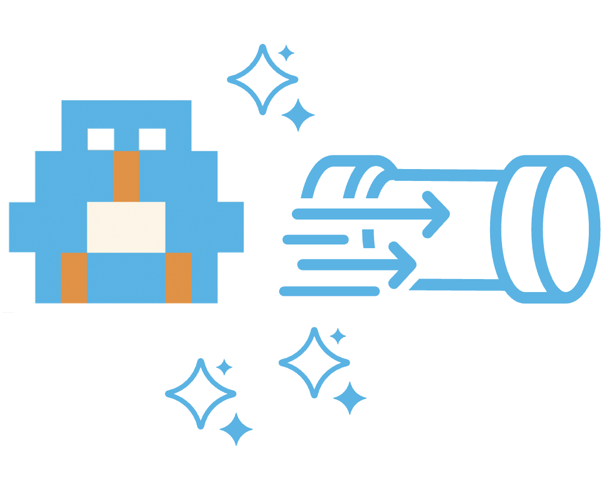
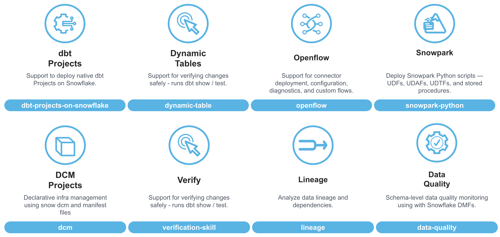
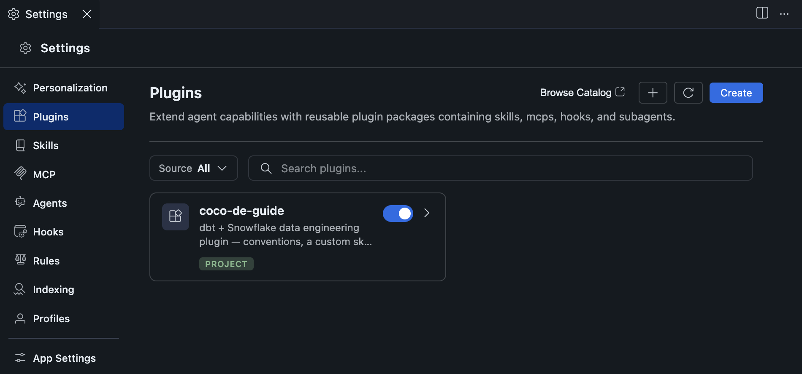
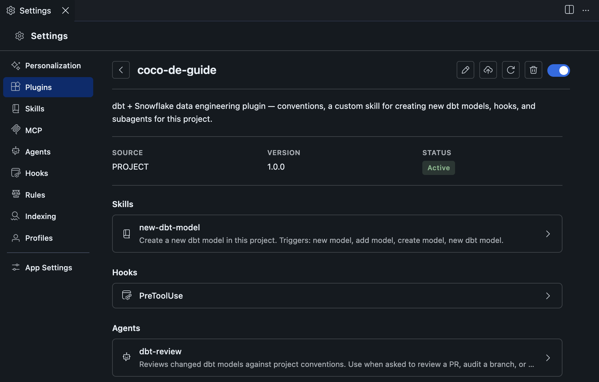
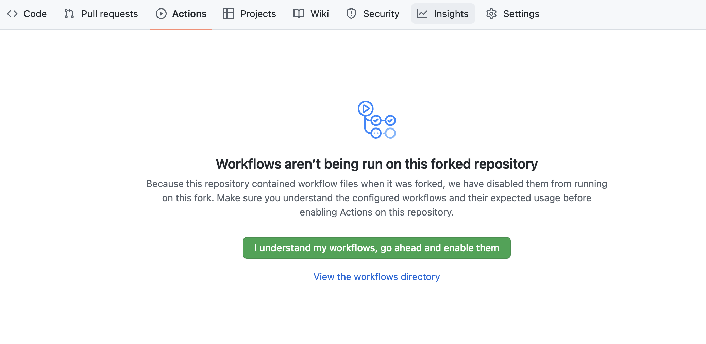

authors: Jeremiah Hansen
id: data-engineering-with-coco
categories: snowflake-site:taxonomy/solution-center/certification/quickstart, snowflake-site:taxonomy/solution-center/certification/community-sourced, snowflake-site:taxonomy/product/data-engineering, snowflake-site:taxonomy/product/ai, snowflake-site:taxonomy/snowflake-feature/coco
language: en
summary: Learn how to use CoCo Skills, Plugins, and Agents to turn your team's data engineering standards into reproducible, automated outcomes.
environments: web
status: Published
feedback link: https://github.com/Snowflake-Labs/sfquickstarts/issues
fork repo link: https://github.com/Snowflake-Labs/sfguide-data-engineering-with-coco


# Data Engineering with CoCo



<!-- ------------------------ -->
## Overview
Duration: 5

Anyone can get an AI agent to produce a result. Professionals ensure the right result, every time.

AI coding agents are completely reshaping the data engineering landscape — and if you're not already using them regularly, I'd encourage you to start today. But here's the thing: the fact that an AI agent can generate code isn't actually that interesting anymore. What *is* interesting is how professional data engineers should be thinking about and leveraging these tools to create repeatable, high-quality outcomes.

That's exactly what this Quickstart is about. We're going to use Snowflake's AI coding agent — [Cortex Code](https://docs.snowflake.com/en/user-guide/cortex-code/cortex-code) (or "CoCo") — to build a real data engineering project. But more importantly, we're going to do it the *right way*, by encoding our standards and conventions into reusable Skills and Plugins so that every member of your team gets consistent, professional results from the agent — not just you, and not just today.

### What You'll Learn
* What Cortex Code is, how to install it, and why it's particularly powerful for Snowflake data engineers
* How to use `AGENTS.md` to give your AI coding agent project-level context and conventions
* What agent Skills are, how they're structured, and when to create custom ones vs. using bundled ones
* How to create a custom skill that encodes your team's specific conventions
* What CoCo Plugins are, how all the pieces fit together, and why they're the right packaging unit for sharing agent capabilities
* How to add a lifecycle hook to protect your production environment
* How to define a subagent for autonomous, repeatable tasks
* How to run a CoCo subagent from a GitHub Actions CI/CD pipeline

### What You'll Build
* An `AGENTS.md` file that gives CoCo project-level context for every session
* A custom agent Skill that encodes your team's dbt conventions
* A new dbt model built by CoCo using that custom skill
* A CoCo Plugin that bundles your skill, a production safety hook, and a dbt review subagent together into a single deployable unit
* A GitHub Actions CI/CD pipeline that automatically reviews dbt changes on every pull request using CoCo

### Prerequisites
* Familiarity with dbt (models, sources, tests)
* Familiarity with Snowflake
* Familiarity with Git and GitHub

### What You'll Need
* **A Snowflake Account**. If you don't already have a Snowflake account you can create a trial account for free. Visit the [Snowflake Trial Account for CoCo Sign Up](https://signup.snowflake.com/cortex-code) page to get started.
* **A GitHub account**. If you don't already have a GitHub account you can create one for free. Visit the [Join GitHub](https://github.com/signup) page to get started.
* **CoCo Desktop** installed on your local machine. Visit the [CoCo Desktop Installation](https://docs.snowflake.com/en/user-guide/cortex-code/cortex-code-desktop/onboarding-and-authentication) page to get started.
* **dbt Core** installed on your local machine. Visit the [dbt Core Install](https://docs.getdbt.com/docs/core/installation-overview) page to get started.


<!-- ------------------------ -->
## Setup
Duration: 10

Before we start building, let's get CoCo and the starter dbt project connected to your Snowflake account.

### Create a Snowflake Personal Access Token
In order to connect to your Snowflake account from CoCo Desktop and GitHub Actions, we will use a Snowflake Personal Access Token (or PAT). Please follow the steps in [Generating a programmatic access token](https://docs.snowflake.com/en/user-guide/programmatic-access-tokens#generating-a-programmatic-access-token) to create a Snowflake PAT for your user. Use these values when creating the PAT, in the "New programmatic access token" dialog:

* **Name**: DEMO_PAT (upper case)
* **Expires in**: Leave with default (15 days)
* **Grant access**: Select **Single role (recommended)**, then the `DEMO_ROLE` role

Make sure to save the PAT before leaving the page, as you won't be able to view it again. We will use the PAT in the next section to configure dbt as well as in the final CI/CD section to connect to Snowflake from GitHub Actions.

Finally, run the following command in a SQL script in Workspaces. This will allow you to bypass the active network policy rule temporarily, for 60 minutes, in order to test out the CI/CD pipeline. For long-term access you need to create a network policy allowing access from the GitHub Actions environment. For more details check out our [Controlling network traffic with network policies](https://docs.snowflake.com/en/user-guide/network-policies) page.

```sql
ALTER USER <YOUR_USER_NAME> MODIFY PROGRAMMATIC ACCESS TOKEN DEMO_PAT
  SET MINS_TO_BYPASS_NETWORK_POLICY_REQUIREMENT = 60;
```

> **Note** — You may need to put double-quotes around the PAT token name in this query if you didn't name your token with all uppercase letters.

### Fork and Clone the Quickstart Repository

This Quickstart uses a starter repository that includes a pre-built dbt project. The two existing models (`customers` and `orders_summary`) are there as a starting point — you'll add the third model yourself using a custom skill you create later on.

Start by forking the starter repository to your own GitHub account. Visit the [Data Engineering with CoCo Quickstart Repository](https://github.com/Snowflake-Labs/sfguide-data-engineering-with-coco) and click the **Fork** button near the top right. Complete any required fields and click **Create Fork**.

Then clone your fork to your local machine:

```bash
git clone https://github.com/<YOUR_USERNAME>/sfguide-data-engineering-with-coco
cd sfguide-data-engineering-with-coco
```

Take a moment to look at what's in the starter:

```
├── dbt/
│   ├── dbt_project.yml
│   ├── profiles.yml.example
│   └── models/
│       ├── _sources.yml
│       ├── customers.sql
│       └── orders_summary.sql
├── scripts/
│   └── setup.sql
├── .gitignore
├── LICENSE
├── README.md
```

### Configure CoCo Desktop and Open the Project

If you haven't already installed CoCo Desktop, follow the [installation instructions](https://docs.snowflake.com/en/user-guide/cortex-code/cortex-code-desktop/onboarding-and-authentication) for your operating system.

Once installed, open CoCo Desktop and configure your Snowflake connection. CoCo supports several authentication methods, for this Guide use Password authentication with your Snowflake PAT as the password. See the [CoCo authentication documentation](https://docs.snowflake.com/en/user-guide/cortex-code/cortex-code-desktop/onboarding-and-authentication#authentication-methods) for all options.

Finally, use **File → Open Folder** to open the `sfguide-data-engineering-with-coco` directory you cloned above. The first time you open the folder CoCo Desktop will ask you if you Trust the files, go ahead and Trust them. CoCo is context-aware: opening the project folder means the agent can see your files, read your code, and run commands in the right place.

### Create the Snowflake Demo Environment

The dbt project is pointed at `SNOWFLAKE_SAMPLE_DATA.TPCH_SF1`, which is available in every Snowflake account. There's nothing to load — the data is already there.

> **Note** — The `SNOWFLAKE_SAMPLE_DATA` sample database is created by default for newer accounts. If the database has not been created for your account and you want access to it follow the instructions on the [Use the sample database](https://docs.snowflake.com/en/user-guide/sample-data-using) page.

But we need to create the demo environment in Snowflake so that dbt can write to it. The `scripts/setup.sql` script contains all the code needed to create the role, warehouse, database and schema for the demo environment.

And the good part is you can run SQL scripts directly from CoCo Desktop by following these steps:
* Open the `scripts/setup.sql` script
* Run all of the SQL statements in this script by clicking on the down arrow and "Run all", next to the blue play button at the top right of the script, or using the shortcut CMD/CTRL+Shift+Enter

### Configure dbt

dbt looks for `profiles.yml` in `~/.dbt/` by default. If you don't have one yet, copy the example file:

```bash
mkdir -p ~/.dbt
cp dbt/profiles.yml.example ~/.dbt/profiles.yml
```

If you already have a `~/.dbt/profiles.yml`, open it and add the `coco_de_guide` profile block from `dbt/profiles.yml.example` alongside your existing profiles — each top-level key is a separate profile and they won't conflict.

Open `~/.dbt/profiles.yml` (CMD/CTRL+p) and replace the placeholders in the `coco_de_guide` block with your values:

```yaml
coco_de_guide:
  target: dev
  outputs:
    dev:
      type: snowflake
      account: "<YOUR_ACCOUNT>"
      user: "<YOUR_USERNAME>"
      password: "<YOUR_PERSONAL_ACCESS_TOKEN>"
      role: DEMO_ROLE
      database: DEMO_DB
      warehouse: DEMO_WH
      schema: TPCH_TRANSFORMED
      threads: 4
```

> **Note** — `~/.dbt/profiles.yml` lives outside your repository so your credentials are never at risk of being committed.

### Verify Your dbt Setup

Make sure dbt can connect to your Snowflake account. Open a terminal in CoCo Desktop and run the following command:

```bash
dbt debug --project-dir dbt/
```

You should see `All checks passed!` at the end of the output. If you run into any connection issues, double-check your `profiles.yml` values and make sure your Snowflake account identifier is in the correct format (e.g., `xy12345.us-east-1`).


<!-- ------------------------ -->
## What is Cortex Code?
Duration: 5


[Cortex Code](https://docs.snowflake.com/en/user-guide/cortex-code/cortex-code) (CoCo) is Snowflake's AI coding agent — an autonomous, context-aware agent optimized for data engineering, analytics, and machine learning tasks. Unlike generic coding assistants, CoCo has deep native knowledge of Snowflake: it understands your schemas, respects your RBAC configuration, and knows Snowflake best practices without being told. Critically for enterprises, the model and the data it touches never leave Snowflake's security perimeter.

### Form Factors

CoCo is available in three form factors, and the right choice depends on how you work:

| Form factor | Best for |
|-------------|----------|
| **CoCo in Snowsight** | Web-based access directly inside Snowflake's UI. Great for SQL and notebook authoring without installing anything. |
| **CoCo Desktop** | A standalone IDE for macOS and Windows (built on VS Code). Full agent experience with local file access, native Git integration, and complete support for plugins, skills, hooks, and subagents. |
| **CoCo CLI** | A terminal-native agent for power users who prefer the command line or want to integrate CoCo into scripts and automation. |

This Quickstart uses **CoCo Desktop** throughout. Local file access and full extensibility support — skills, plugins, hooks, and subagents — are central to what we're building, and Desktop is the right tool for all of it.


<!-- ------------------------ -->
## Create an AGENTS.md
Duration: 10

Before you write a single prompt, there's one thing that will improve every single interaction you have with CoCo in this project: an `AGENTS.md` file.

### What is AGENTS.md?

`AGENTS.md` is a Markdown file at the root of your project that contains conventions, context, and commands that you want the agent to know about — every single session, automatically. Without it, you'd have to re-explain your database names, your naming conventions, and your preferred commands every time you start a new chat. With it, that context is always there.

Think of it as the onboarding document you'd write for a new team member — except this team member reads it perfectly every time, never forgets it, and follows it consistently. Here's the key guidance I follow when writing `AGENTS.md`:

* **Keep it short.** The context window is a shared, finite resource. Challenge every sentence: does the agent *actually* need this, or will it figure it out on its own?
* **Encode what the model can't infer.** Don't write instructions telling CoCo how to use dbt — it already knows how dbt works. Do write down your database name, your schema naming conventions, and the exact command to use for building and testing.
* **It doesn't change session-to-session.** Stable project facts belong here. Session-specific instructions belong in your prompts.

### Create Your AGENTS.md

Let's create an `AGENTS.md` for this project. In the CoCo chat panel, enter the following prompt:

```
Create an AGENTS.md file at the root of this project. Include:
- The Snowflake database (DEMO_DB), schema (TPCH_TRANSFORMED), and warehouse (DEMO_WH)
- The dbt build command to use: `dbt build --project-dir dbt/`
- The command to build a single model: `dbt build --select <model_name> --project-dir dbt/`
- Snake_case naming convention for model files
- The source data is TPCH_SF1 in SNOWFLAKE_SAMPLE_DATA; all raw tables must be referenced through _sources.yml
- Feature branches should follow the pattern: feature/<description>
- PRs are required before merging to main
- This project uses CoCo Desktop — do not use the `cortex` CLI command
```

CoCo will generate an `AGENTS.md` file. Review it and accept/save the changes by clicking on the "Keep" button. Your `AGENTS.md` may be slightly different, and that's OK, but it should look something like this:

```markdown
# Project: CoCo DE Guide

## Snowflake
- Database: DEMO_DB
- Schema: TPCH_TRANSFORMED
- Warehouse: DEMO_WH

## dbt Commands
- Build + test: `dbt build --project-dir dbt/`
- Single model: `dbt build --select <model_name> --project-dir dbt/`

## Naming Conventions
- Model files: snake_case
- Source schema: TPCH_SF1 in SNOWFLAKE_SAMPLE_DATA
- Transformed schema: TPCH_TRANSFORMED

## Branching
- Feature branches: `feature/<description>`
- PRs required before merging to main

## CoCo
- This project uses CoCo Desktop — do not use the `cortex` CLI command
```

> **Note** — CoCo has bundled skills that know about the CoCo CLI `cortex` command. Those skills can activate and cause CoCo to attempt CLI operations. The `AGENTS.md` instruction to not use the `cortex` CLI should prevent this.

### Validate the Starter Code Against Your Conventions

Now let's put `AGENTS.md` to immediate use. The starter project was built before these conventions were established — which is exactly the situation you'll often face when inheriting a codebase. Let's have CoCo audit the existing models and bring them into compliance.

In the CoCo chat panel, enter:

```
Review all dbt models in this project against the conventions in AGENTS.md
and fix any violations you find.
```

CoCo will read `AGENTS.md`, then inspect each model SQL file. It should find that `orders_summary.sql` references source tables directly by their fully-qualified Snowflake path instead of going through `_sources.yml`:

```sql
-- Violation: direct source reference
FROM SNOWFLAKE_SAMPLE_DATA.TPCH_SF1.ORDERS o
LEFT JOIN SNOWFLAKE_SAMPLE_DATA.TPCH_SF1.LINEITEM l ...
```

CoCo will rewrite the model to use the correct `{{ source() }}` references:

```sql
-- Fixed: references go through _sources.yml
FROM {{ source('tpch', 'orders') }} o
LEFT JOIN {{ source('tpch', 'lineitem') }} l ...
```

Click on "Keep" to accept that changes. Once the fix is applied, run `dbt build` to confirm nothing broke:

```bash
dbt build --project-dir dbt/
```

This is `AGENTS.md` doing its job. CoCo didn't need to be told what the violation was or what the fix should look like — it read the conventions, read the code, and connected the two. That's the value: not any single dramatic prompt, but every prompt in the session being grounded in your actual standards rather than the model's best guess.

> **Tip** — Your `AGENTS.md` should evolve as your project grows. Any time you find yourself repeating the same context in multiple prompts (a team convention, a frequently-used command, an important constraint), that's a signal it belongs in `AGENTS.md`.


<!-- ------------------------ -->
## What is a Skill?
Duration: 10

We've seen `AGENTS.md` handle project context and enforce existing conventions. But what about when you're creating something new? When the task is "build a new dbt model," `AGENTS.md` tells CoCo the database name and the build command — but it doesn't tell it the specific workflow your team follows or the standards that must hold for every new model. That's what Skills are for.

Let's take a few minutes to understand what Skills actually are — because this concept is central to everything that follows in this Quickstart.

### Skills Defined

Agent Skills are used for implementing repeatable, multi-step workflows. They're made up of instructions that tell the agent how to perform a specific type of task. Skills are supported by most AI coding agents, and the emerging open standard is documented at [agentskills.io](https://agentskills.io/).

Here's the key insight: **Skills encode what the model can't infer on its own.** This is worth repeating because it's the most common mistake I see when teams start writing skills. The frontier LLM models are incredibly capable and already know how to do most data engineering tasks. You don't need to write a Skill teaching CoCo what dbt is or how to write a SQL transformation — it already knows. What you *do* need to capture in a Skill is any repeatable process that is *specific to your team*: your naming conventions, your testing standards, your deployment workflow, the exact steps you want followed in a particular order.

### The SKILL.md File

At its core, a Skill is a folder containing a single required file: `SKILL.md`. This file has two parts:

1. **YAML Frontmatter** — metadata about the skill, including its name and description
2. **Markdown body** — the actual instructions the agent will follow

The `description` field is especially important: CoCo uses it to decide when to automatically invoke the Skill. Write it as a clear, one-sentence trigger — think of it as answering the question "when should CoCo use this skill?"

Here's the minimum structure of a `SKILL.md` file:

```markdown
---
name: my-skill
description: Brief description of when this skill should be used.
---

# Instructions

Your workflow steps and conventions go here.
```

### Skill Folder Structure

A Skill lives in a folder, and that folder can contain more than just `SKILL.md`. You can bundle scripts, templates, and reference materials alongside your instructions:

```
my-skill/
├── SKILL.md          # Required — instructions and metadata
└── scripts/          # Optional — reusable scripts the agent can run
    └── my-script.py
```

For many Skills, the `SKILL.md` file alone is enough. The scripts folder becomes useful when your workflow requires running a specific piece of code consistently.

### Bundled vs. Custom Skills

CoCo ships with a set of bundled Skills for Snowflake-specific workflows that require specialized knowledge the base model doesn't have on its own — things like deploying dbt projects as Snowflake-native objects via the `snow dbt` CLI, managing Dynamic Tables, working with Iceberg catalogs, and more. These are maintained by Snowflake and are automatically available without any setup.



For common tasks that are well-represented in the model's training data — standard SQL, Python, dbt syntax, general software engineering practices — you typically don't need a skill at all. CoCo's base knowledge handles those.

Custom Skills are ones you write yourself, for your specific team and project. They don't teach CoCo how to use a tool — it already knows. They encode the *choices* your team has made: which conventions to follow, which steps to run in which order, which guardrails to apply.

A useful rule of thumb: if you find yourself starting a prompt with "remember, we always..." — that's a custom skill waiting to be written.

> **Best practices**
> * Keep Skills under 500 lines — long skills are hard to maintain and can dilute the context window
> * Write the `description` as a clear, specific trigger phrase
> * Don't repeat general knowledge — only encode what CoCo can't infer
> * Test your skill by invoking it and checking if CoCo follows every convention without extra prompting


<!-- ------------------------ -->
## Using CoCo Without a Skill
Duration: 10

Before writing your first custom Skill, it's worth understanding what you *don't* need to encode. The frontier model behind CoCo has broad, deep knowledge of the software and data engineering ecosystem — and that means for a lot of common tasks, you can just ask.

### Add Schema Tests Without Any Skill

Our starter project has two models — `customers` and `orders_summary` — but neither has schema tests defined in `_schema.yml`. Schema tests validate your data against expectations (like `not_null` and `unique`) every time you run `dbt build`, catching data quality issues before they reach downstream consumers.

Let's ask CoCo to add them. No skill invocation, no special instructions — just a direct prompt:

```
Add schema tests to the existing models in this project.
Save the results in dbt/models/_schema.yml.
At a minimum, each model's primary key should have not_null and unique tests.
Add any other tests that make sense given the columns in each model.
For parameterized tests like accepted_values, nest all test parameters under an arguments: key.
```

CoCo will read the model SQL files, identify the primary key columns, and generate `dbt/models/_schema.yml` with appropriate tests for `customer_key` in `customers` and `order_key` in `orders_summary`, along with additional column-level tests where they make sense. Review the changes and click on "Keep" to accept/save them. Run `dbt build` to confirm everything passes:

```bash
dbt build --project-dir dbt/
```

> **Note** — If any tests fail, it likely means the source data doesn't meet the expected constraints. Inspect the failure message and adjust the tests accordingly. Not every column that *looks* like a primary key actually has unique values in the TPC-H dataset.

### What This Demonstrates

CoCo just added a complete set of schema tests without being told what the primary keys were, how `_schema.yml` is structured, or what test types are available in dbt. It already knew all of that.

Notice, though, that we had to specify the filename `_schema.yml` explicitly — without it, CoCo defaults to `schema.yml`. Both are valid dbt, but your project uses the underscore prefix by convention. This is a small but telling example of the broader point: **the model knows the tool, not your team's choices**. It doesn't know that you always use `dbt build` rather than `dbt run`, that primary key tests are required on every new model, or that source references must go through `_sources.yml`. Those are your team's specific conventions, and without being told, the model will handle them inconsistently from one session to the next. That's exactly what a custom Skill addresses.


<!-- ------------------------ -->
## Create a Custom Skill
Duration: 15

CoCo's base knowledge is great for standard dbt tasks. But for the conventions that are *specific to this project* — the ones that need to hold consistently across every new model your team builds — that's where a custom Skill comes in.

### Why We Need a Custom Skill

CoCo knew the dbt test syntax, the `_schema.yml` structure, and the right test types — all general knowledge. What it doesn't know is the three conventions your team has agreed on for this project: always use `dbt build` (not `dbt run`), every primary key must have `not_null` and `unique` tests, and raw tables must always go through `_sources.yml`. Those choices aren't right or wrong in any absolute sense — they're just the standards *your team* has decided to follow. A custom Skill is how you encode them so CoCo applies them consistently, without being reminded.

### Create the Skill Folder Structure

Skills need to live somewhere CoCo can find them. CoCo auto-discovers **project skills** from a `.snowflake/cortex/skills/` folder inside the open workspace — no registration or install step required. As soon as the folder exists and contains a `SKILL.md`, the skill is live. Let's create it:

```bash
mkdir -p .snowflake/cortex/skills/new-dbt-model
```

> **Note** — The `.snowflake/cortex/skills/` path is intentional. CoCo scans this folder automatically whenever your workspace is open, which means the skill will be available immediately after you write it — no further setup needed.

### Write the SKILL.md

Now let's write the Skill. In the CoCo chat panel, enter:

```
Create a custom skill at .snowflake/cortex/skills/new-dbt-model/SKILL.md for creating 
new dbt models in this project.

The skill should have exactly two sections:

# Conventions — a numbered list of these three rules:
1. Always use `dbt build` (not `dbt run`) so tests run together with compilation
2. Every model's primary key must have not_null and unique tests in _schema.yml
3. All raw tables must be referenced through _sources.yml using source() — never reference the source database directly in model SQL

# Workflow — a numbered list of these four steps:
1. Confirm which source table(s) to model — ask if not specified
2. Write the model SQL using source() references
3. Add the model entry to _schema.yml with a description and primary key tests
4. Run dbt build --select <model_name> --project-dir dbt/ and report the result

Use the name new-dbt-model. Write a one-sentence description that tells CoCo when 
to invoke this skill. Keep the skill concise — no sub-steps, no examples, no error 
handling instructions. The model is smart enough to infer the details.
```

Review the generated `SKILL.md` and click on "Keep" to accept/save the changes. It should have a clean YAML frontmatter block with `name` and `description`, followed by the four workflow steps and the three conventions. The description should read something like: *"Create a new dbt model in this project. Use when adding a model for a new source table or analytical use case."*

If anything looks off — a missing convention, a step out of order — correct it now. Your `SKILL.md` may be slightly different, and that's OK, but it should look something like this:

```markdown
---
name: new-dbt-model
description: Create a new dbt model in this project. Use when adding a model for a new source table or analytical use case.
---

# Conventions

1. Always use `dbt build` (not `dbt run`) so tests run together with compilation.
2. Every model's primary key must have `not_null` and `unique` tests in `_schema.yml`.
3. Reference all raw tables through `_sources.yml`. Never reference the source database directly in model SQL.

# Workflow

1. Confirm which source table(s) to model — ask if not specified.
2. Write the model SQL in `dbt/models/<model_name>.sql` using `{{ source('<source>', '<table>') }}` references.
3. Add the model entry to `dbt/models/_schema.yml` with a description and tests for the primary key.
4. Run `dbt build --select <model_name> --project-dir dbt/` and report the result.
```

### Invoke the Skill to Build a New Model

Now for the payoff: let's use the skill we just wrote to build the third model in our project. In the CoCo chat panel, enter:

```
Use the new-dbt-model skill to create a supplier_performance model.
It should summarize performance metrics per supplier from the supplier and lineitem source tables.
Include total orders, total revenue, and average discount.
```

Watch what happens. CoCo auto-discovers the skill from `.snowflake/cortex/skills/`, matches the prompt against its description, and invokes it automatically. It will follow the workflow steps in order and apply all three conventions — without you having to repeat any of them:

1. Identify the `supplier` and `lineitem` source tables from `_sources.yml`
2. Write `dbt/models/supplier_performance.sql` using `{{ source() }}` references
3. Add the model entry to `_schema.yml` with primary key tests
4. Run `dbt build --select supplier_performance --project-dir dbt/` and report the result

That's the difference between a one-off prompt and a Skill. The conventions are encoded once. The team benefits every time. Accept the changes by clicking "Keep" on each new/modified file.

> **Tip** — Resist the urge to put too much into a single Skill. A focused Skill for "create a new dbt model" is more useful than a sprawling one for "do everything dbt-related." Smaller, well-named Skills are easier to maintain and easier for CoCo to invoke correctly.


<!-- ------------------------ -->
## What is a Plugin?
Duration: 10

We now have a working custom Skill. Let's talk about Plugins before we build one — because understanding *why* Plugins exist makes it much easier to understand what we're about to put together.

### Skills Alone Have Limitations

The project skill you just built works great — for you, in this workspace. But what if you want to use this skill in a different project/repository? You'd have to create a copy of it in the other project, and then you'd have multiple copies to maintain. And there are other important extensibility features for AI coding agents besides skills. For example, what if you want to add a production safety hook alongside it? Or a subagent for PR review? Now you're managing three separate things, none of them versioned together or installable as a unit. And what if your hook or subagent needs to be shared across multiple repositories, not just this one?

That's where Plugins come in. A Plugin is a single installable unit that bundles everything together — skills, hooks, subagents, and MCP servers — with a version number, a formal validation step, and a one-command install. Plugins were designed to be the right packaging unit for distributing agent capabilities, both within a team and across an organization.

Here's a short list of why a Plugin is a better packaging unit than a raw Skill folder:

* **Versioned** — the manifest has a `version` field; raw Skill folders don't
* **Validatable** — the manifest is formally parsed and checked when you install; no equivalent check exists for raw Skill folders
* **Single installable unit** — one Add Local Plugin action in the Agent Settings panel registers everything; individual Skills require separate registration per Skill
* **Updatable** — GitHub-sourced plugins have a Sync button that pulls the latest version; Skills have no equivalent lifecycle
* **Bundling** — one Plugin can carry Skills, hooks, subagents, and MCP servers as a coherent capability
* **Registry tracking** — installed Plugins are recorded with source, install time, and active state; you always know exactly what's deployed

### Plugin Folder Structure

A Plugin is a self-contained directory with a manifest file at a well-known path:

```
my-plugin/
├── .cortex-plugin/
│   ├── plugin.json       # Manifest (required)
│   └── activation.md     # Optional — displayed when the plugin is activated
├── skills/               # Auto-discovered if present
│   └── my-skill/
│       └── SKILL.md
├── agents/               # Auto-discovered if present
│   └── my-agent.md
└── hooks/
    └── hooks.json        # Lifecycle hooks
```

> **Note** — CoCo uses the `.cortex-plugin/` directory name. If you use `.claude-plugin/`, that works too for Claude-compatible tooling, but `.cortex-plugin/` is the standard for CoCo.

### The plugin.json Manifest

The `plugin.json` file is the heart of the Plugin. It declares everything the Plugin contains, who made it, and how it behaves. Here's a minimal example:

```json
{
  "name": "my-plugin",
  "description": "What this plugin does",
  "version": "1.0.0",
  "author": { "name": "Your Team" },
  "skills": ["./skills"],
  "agents": ["./agents"],
  "hooks": "./hooks/hooks.json"
}
```

### Plugin Elements

Let's briefly cover each element a Plugin can contain:

**Skills** — the Skill folders we already know about, now bundled and versioned together. Pointed to via the `"skills"` array in the manifest.

**Agents (Subagents)** — Markdown files that define autonomous, specialized agents. Like Skills, they have YAML frontmatter with `name`, `description`, and optionally `tools` and `model`. The body contains instructions the agent follows when invoked. The key difference from a Skill: a subagent is designed to run autonomously to completion on a specific task, whereas a Skill guides an interactive session.

**Hooks** — shell commands that run on lifecycle events. The most useful for data engineers is `PreToolUse`, which fires before CoCo executes a tool (like running a Bash command). This is how you add guardrails — for example, blocking direct production deployments. Hooks are defined in a `hooks.json` file and reference shell scripts.

**MCP Servers** — Model Context Protocol servers that expose external tools to the agent. For example, you could wire up a connection to your internal issue tracker or GitHub so CoCo can pull context from outside the codebase. We won't cover MCP Servers in depth in this Quickstart, but you can find full details in the [CoCo documentation](https://docs.snowflake.com/en/user-guide/cortex-code/extensibility#model-context-protocol-mcp).

**activation.md** — an optional Markdown file displayed to the user when the Plugin is activated. Use it to explain what the Plugin does and how to enable it.


<!-- ------------------------ -->
## Create a Custom Plugin
Duration: 20

We have all the pieces — a custom Skill, a clear understanding of what Plugins are, and a project that's ready to be hardened. Now let's bundle everything into a proper Plugin. The first thing we'll do is migrate the skill from its project-local home into the plugin folder, then add a production safety hook and a dbt review subagent alongside it.

### Move the Skill into the Plugin

The skill currently lives at `.snowflake/cortex/skills/new-dbt-model/` — scoped to this workspace. We're going to move it into `.cortex/plugins/coco-de-guide/` — the project-scoped plugin directory that CoCo auto-discovers. Run these commands in the terminal:

```bash
mkdir -p .cortex/plugins/coco-de-guide/skills
mv .snowflake/cortex/skills/new-dbt-model .cortex/plugins/coco-de-guide/skills/
rm -rf .snowflake/
```

The skill is now in `.cortex/plugins/coco-de-guide/skills/new-dbt-model/SKILL.md`. CoCo auto-discovers plugins in `.cortex/plugins/`, so once the manifest is in place, the plugin will be live — no separate install step needed.

### Create the Plugin Manifest

Let's create the `.cortex-plugin/` directory and write the manifest. In the CoCo chat panel, enter:

```
Consult the CoCo Desktop plugin
documentation at https://docs.snowflake.com/en/user-guide/cortex-code/cortex-code-desktop/plugins
for the correct plugin.json schema and file structure.

Create a CoCo plugin manifest for this project at .cortex/plugins/coco-de-guide/.cortex-plugin/plugin.json.

The manifest must include all of the following fields:
- name: "coco-de-guide"
- version: 1.0.0
- author: me
- skills: pointing to ./skills
- agents: pointing to ./agents
- hooks: pointing to ./hooks/hooks.json

Also create .cortex/plugins/coco-de-guide/.cortex-plugin/activation.md that briefly explains
what the plugin includes.

Do not use the cortex CLI — write the files directly.
```

> **Note** — CoCo has bundled skills that know about the `cortex` CLI's plugin commands (`cortex plugin install`, `cortex plugin validate`, etc.). Those skills can activate here and cause CoCo to attempt CLI operations instead of just writing files. The `AGENTS.md` instruction to not use the `cortex` CLI should prevent this, but if CoCo does try to run CLI commands, remind it: *"Do not use the cortex CLI — write the files directly."*

CoCo will create both `plugin.json` and `activation.md`. Accept the changes by clicking "Keep" on each new/modified file. Your `plugin.json` manifest may be slightly different, and that's OK, but it should look something like this:

```json
{
  "name": "coco-de-guide",
  "description": "dbt/Snowflake data engineering plugin for the CoCo DE Guide",
  "version": "1.0.0",
  "author": { "name": "<YOUR_NAME>" },
  "skills": ["./skills"],
  "agents": ["./agents"],
  "hooks": "./hooks/hooks.json"
}
```

### Add a Production Safety Hook

One of the most valuable things a Plugin can do is protect your environment from mistakes. A common problem with AI coding agents is that they'll happily run whatever command you ask — including commands that write directly to production. We can prevent that with a `PreToolUse` hook.

Let's add a hook that blocks any `dbt` command that targets production:

```
Consult the CoCo Desktop hooks documentation at
https://docs.snowflake.com/en/user-guide/cortex-code/cortex-code-desktop/hooks
for the correct hooks.json schema and shell script format.

Create a PreToolUse hook at .cortex/plugins/coco-de-guide/hooks/validate-bash.sh that blocks
any dbt command that includes --target prod. If the command is blocked, return a clear error
message explaining that direct production dbt runs are not allowed and to use the CI/CD
pipeline instead.
Also create .cortex/plugins/coco-de-guide/hooks/hooks.json that wires this script to the
PreToolUse event using the matcher value "bash" (lowercase).
```

CoCo will create both files. The shell script reads the tool input from stdin (as JSON), extracts the command, and checks it against the pattern. The `hooks.json` wires it up. Accept the changes by clicking the 'Keep' button. Your `hooks.json` may be slightly different, and that's OK, but it should look something like this:

```json
{
  "hooks": {
    "PreToolUse": [
      {
        "matcher": "bash",
        "hooks": [
          {
            "type": "command",
            "command": "bash .cortex/plugins/coco-de-guide/hooks/validate-bash.sh",
            "timeout": 10
          }
        ]
      }
    ]
  }
}
```

We'll test the hook in the next step.

### Add a dbt Review Subagent

The final piece of our Plugin is a subagent for reviewing dbt model changes. Unlike a Skill — which guides an interactive session — this subagent is designed to run autonomously to completion. We'll use it both locally (before opening a PR) and in CI/CD (on every PR automatically). That "same agent, two contexts" pattern is one of the most powerful things you can build with CoCo.

```
Consult the CoCo Desktop agents documentation at
https://docs.snowflake.com/en/user-guide/cortex-code/cortex-code-desktop/agents
for the correct agent definition format and frontmatter schema.

Create a dbt-review subagent at .cortex/plugins/coco-de-guide/agents/dbt-review.md.
The subagent should:
- Find all changed dbt model files compared to origin/main
- For each changed model, run dbt build --select <model> --project-dir dbt/
- Verify that each convention from the new-dbt-model skill is met
- Produce a concise PASS/FAIL report per convention with specific remediation steps for any failures

It should use the bash, read, grep, and glob tools. Set the model to auto.
```

Review the generated `dbt-review.md` and click on "Keep" to accept/save the changes. It should have YAML frontmatter with `name`, `description`, `tools`, and `model` fields, followed by the review steps and output format.

### Activate the Plugin

Because the plugin lives in `.cortex/plugins/coco-de-guide/`, CoCo Desktop will discover it automatically when the workspace is opened. To verify it is active:

1. Click the **Settings** tab (gear icon) in the bottom of the left sidebar
2. Open the **Plugins** section
3. Look for `coco-de-guide` in the Plugins grid

If the plugin appears but is toggled off, click the toggle to enable it. If it doesn't appear at all, click the **↻** (refresh) button in the Plugins toolbar to force a reload of the plugin registry.



> **Note** — Project-scoped plugins require workspace trust before they auto-activate. If your workspace is not trusted, the plugin will appear in the Plugins panel but will be disabled. Enable it individually via the toggle, or trust the workspace to activate all project plugins automatically.

Click the plugin card to open its detail view and verify that all three components — the skill, the hook, and the subagent — are listed.




> **Tip** — File watchers detect changes to plugin files automatically, so edits to `plugin.json`, `SKILL.md`, the hook script, or the subagent take effect immediately. Use the **↻** button only if a change isn't appearing after a bulk file operation.

### Test the Hook

Now that the plugin is active, the hook is live. Try to get CoCo to run a production deployment by entering this prompt in the chat panel (not in the terminal):

```
Run dbt build --target prod --project-dir dbt/
```

You should see the hook fire and block the command with a clear explanation before CoCo can execute it. This is a small but important example of the broader principle: **agents should not make changes directly in production**. Even with clear instructions, agents generate content dynamically — and that non-determinism is not something you want in a production pipeline. Hooks give you hard guardrails that enforce that boundary regardless of what the agent decides.

### Try the Subagent Locally

Before wiring this subagent into CI/CD, try it from the chat panel first. Type:

```
Use the dbt-review agent to review the changes in this branch.
```

The subagent will run to completion autonomously — finding changed model files, running `dbt build` for each, checking conventions, and producing a PASS/FAIL report. If you've made any changes that violate the `new-dbt-model` skill conventions, you'll see specific remediation steps in the output.


<!-- ------------------------ -->
## Publish to the Plugin Catalog
Duration: 7

So far, your plugin lives at `.cortex/plugins/coco-de-guide/` inside this repository. Teammates can install it by cloning the repo or using **Add from GitHub** in CoCo Desktop. That works — but Snowflake has a better option for teams that want centralized discovery and access control: the **Plugins Catalog**.

### What is the Plugins Catalog?

The Plugins Catalog is Snowflake's built-in registry for sharing and discovering plugins across your organization. Publishing to it gives you:

* **Governance** — access is controlled by Snowflake roles and grants, not Git permissions
* **Discoverability** — teammates can browse and search for plugins from CoCo Desktop
* **No credentials required** — consumers install directly from Snowflake, no GitHub access needed
* **Versioning** — each publish creates a new version; consumers sync to get the latest

### Where the Plugin Lives in Snowflake

When you publish a plugin, CoCo creates a `CORTEX EXTENSION` object in your Snowflake account. A Cortex Extension is a schema-level object (`TYPE = PLUGIN`) that stores your plugin's files as a live, versioned stage and holds the `READ` grants that control who can use it.

The naming follows a convention: the plugin's `name` field is uppercased and hyphens are replaced with underscores. The object is created in a `SKILL_SHARING` schema inside your personal database:

```
USER$<YOUR_USERNAME>.SKILL_SHARING.COCO_DE_GUIDE
```

Once published, the plugin has a **share URI** — a `snow://` link that uniquely identifies this version:

```
snow://skill_catalog/USER$<YOUR_USERNAME>.SKILL_SHARING.COCO_DE_GUIDE/versions/version$1/
```

This is what you share with your team. It's stable, access-controlled, and works regardless of whether the recipient has access to your Git repository.

### Publish from CoCo Desktop

1. Click the **Settings** tab (gear icon) in the bottom of the left sidebar
2. Open the **Plugins** section
3. Click the `coco-de-guide` plugin card to open its detail view
4. Click the **Publish to Plugins Catalog** button (cloud-upload icon)

A chat session opens and the `share-skill-and-plugin` skill runs automatically. It will:

1. Prompt you to confirm the plugin name and description
2. Create the `SKILL_SHARING` schema in your personal database (if it doesn't exist) and grant `USAGE` to `PUBLIC`
3. Create the `COCO_DE_GUIDE` Cortex Extension object
4. Upload all plugin files to the extension's versioned stage
5. Commit the version and apply your chosen access settings

At the end, CoCo reports the share URI:

```
snow://skill_catalog/USER$<YOUR_USERNAME>.SKILL_SHARING.COCO_DE_GUIDE/versions/version$1/
```

> **Note** — By default the plugin is not discoverable in the catalog browser — it's reachable only by anyone you share the URI with. You can change this during the publish flow if you want the plugin to be visible to everyone in your organization.

### Installing a Catalog Plugin

This Quickstart doesn't walk through the consumer-side flow, but here's how a teammate would install your published plugin:

1. Click the **Settings** tab (gear icon) in the bottom of the left sidebar
2. Open the **Plugins** section
3. Click **+** and choose **Add from Plugins Catalog**
4. Paste the `snow://skill_catalog/...` URI and click **Import**

CoCo downloads the plugin files from Snowflake, validates the manifest, and registers it. The plugin appears in the grid with a **CATALOG** badge. They can sync to newer versions at any time from the plugin's detail view.


<!-- ------------------------ -->
## Enforce Standards Automatically in CI/CD
Duration: 15

Everything we've built so far — the `AGENTS.md`, the Skill, the Plugin, the hook, the subagent — was designed with this moment in mind. We're going to take the exact same dbt-review subagent we've been running locally and wire it into a GitHub Actions workflow so it runs automatically on every pull request that touches a dbt model. Same agent. Same conventions. Now running in CI.

This is the payoff of building a Plugin instead of a loose collection of Skill files. But there's one important note about what's different here: while this Quickstart uses **CoCo Desktop** for the interactive development sections, the CI/CD pipeline uses the **CoCo CLI** — the terminal-native form of the same agent. The CLI is the right tool for automation: it runs headlessly, connects via a credentials file, and is installable in any CI environment. The plugin you built in `.cortex/plugins/` is auto-discovered by the CLI just as it is by Desktop — no separate install step needed.

### Configure GitHub Secrets

From your forked repository on GitHub, click **Settings → Secrets and variables → Actions**. Add the following repository secrets:

| Secret name | Value |
|-------------|-------|
| `SNOWFLAKE_ACCOUNT` | Your Snowflake account identifier |
| `SNOWFLAKE_USER` | Your Snowflake username |
| `SNOWFLAKE_PASSWORD` | Your Snowflake PAT |

### Create the GitHub Actions Workflow

Let's have CoCo write the workflow file. In the CoCo chat panel, enter:

```
Create a GitHub Actions workflow at .github/workflows/pr-review.yml.
Trigger on pull requests that touch dbt/models/** and also allow manual dispatch.
Grant permissions: contents read and pull-requests write.

For the CoCo steps:
- Configure a Snowflake connection by writing ~/.snowflake/connections.toml with a
  [default] profile using keys account, user, and password sourced from the
  SNOWFLAKE_ACCOUNT, SNOWFLAKE_USER, and SNOWFLAKE_PASSWORD secrets. Set file
  permissions to 600.
- Install the CoCo CLI:
    curl -LsS https://ai.snowflake.com/static/cc-scripts/install.sh | sh
  and add $HOME/.local/bin to PATH. No plugin install step is needed — the plugin
  in .cortex/plugins/ is auto-discovered.
- Run the dbt-review agent:
    cortex --print "Use the dbt-review agent to review the changes in this PR" \
      > review.md 2>/dev/null || true

Post the contents of review.md as a comment on the pull request.
```

Review the generated workflow and click "Keep" to accept/save the changes. Your workflow may be slightly different, and that's OK, but it should look something like this:


```yaml
name: dbt-review Agent PR Review

on:
  pull_request:
    paths:
      - 'dbt/models/**'

  # Allows you to run this workflow manually from the Actions tab
  workflow_dispatch:


permissions:
  contents: read
  pull-requests: write

jobs:
  review:
    runs-on: ubuntu-latest
    steps:
      - name: Checkout repository
        uses: actions/checkout@v7
        with:
          fetch-depth: 0   # need base branch to diff changed files

      - name: Configure Snowflake connection for Cortex Code
        run: |
          mkdir -p ~/.snowflake
          cat > ~/.snowflake/connections.toml <<EOF
          [default]
          account = "${{ secrets.SNOWFLAKE_ACCOUNT }}"
          user = "${{ secrets.SNOWFLAKE_USER }}"
          password = "${{ secrets.SNOWFLAKE_PASSWORD }}"
          EOF
          chmod 600 ~/.snowflake/connections.toml

      - name: Install Cortex Code CLI
        run: |
          curl -LsS https://ai.snowflake.com/static/cc-scripts/install.sh | sh
          echo "$HOME/.local/bin" >> "$GITHUB_PATH"

      - name: Run Cortex Code and the dbt-review agent
        run: |
          cortex --print "Use the dbt-review agent to review the changes in this PR" \
            > review.md 2>/dev/null || true
          echo "----- review.md -----"; cat review.md

      - name: Post review as PR comment
        uses: actions/github-script@v9
        with:
          script: |
            const fs = require('fs');
            let body = '## dbt-review Agent (Cortex Code)\n\n';
            try { body += fs.readFileSync('review.md', 'utf8'); }
            catch (e) { body += '_No review output produced._'; }
            const issue_number = context.payload.pull_request?.number ?? context.issue.number;
            if (!issue_number) {
              console.log('No PR number found (workflow_dispatch run). Skipping comment.');
              console.log(body);
              return;
            }
            await github.rest.issues.createComment({
              owner: context.repo.owner,
              repo: context.repo.repo,
              issue_number,
              body,
            });
```

A few things worth noting. `fetch-depth: 0` is essential — the dbt-review agent uses `git diff origin/main...HEAD` to find changed files, which requires full history. The Snowflake connection is configured as a `connections.toml` file rather than environment variables — this is how the CoCo CLI picks up credentials. The plugin in `.cortex/plugins/` is auto-discovered by the CLI the same way it is by Desktop, so no install step is needed. And the intelligence lives entirely in the subagent definition, not in this workflow — the workflow is just infrastructure.

### Enable GitHub Actions

By default, GitHub Actions workflows are disabled in forked repositories. Enable them by going to the **Actions** tab in your forked repository and clicking **I understand my workflows, go ahead and enable them**.




### Test the Workflow

Commit all the files you've created in this Quickstart to a new feature branch and push to GitHub using CoCo Desktop's built-in Source Control panel.

**Create a new branch**

Click the branch name in the bottom status bar (it will show `main` or whatever branch you're on). Select **Create new branch...** and enter `feature/add-coco-plugin`.

**Stage and commit your changes**

Open the Source Control panel by clicking the Source Control icon in the Activity Bar on the left, or press `Cmd+Shift+G` (macOS) / `Ctrl+Shift+G` (Windows/Linux). You'll see all the files you've created listed under **Changes**.

Click the **+** icon next to **Changes** to stage everything, then type a commit message in the input box at the top of the panel:

```
Add AGENTS.md, custom skill, plugin, and CI workflow
```

Click the **Commit** button, or press `Cmd+Enter` / `Ctrl+Enter`.

**Push and open a pull request**

Click **Publish Branch** in the Source Control panel (or the sync icon in the status bar) to push `feature/add-coco-plugin` to your fork on GitHub.

Then switch to GitHub in your browser and open a pull request from `feature/add-coco-plugin` to `main` in your forked repository. When creating the pull request, make sure the base repository is *your fork*, not the upstream Snowflake-Labs repository. GitHub defaults to comparing against the upstream, which you'll need to change.

Navigate to the **Actions** tab to watch the workflow run. Once it completes, you'll see the dbt-review agent's PASS/FAIL report as output in the workflow logs. You will also see the agent's output in the PR itself as a comment.

<!-- ------------------------ -->
## Conclusion And Resources
Duration: 2

Congratulations! You've built a complete, professional-grade data engineering workflow with Cortex Code. Let's take a moment to look back at what you actually built — and more importantly, *why* each piece matters.

You started with an empty project and an AI coding agent. The first thing you did wasn't write a prompt — it was write an `AGENTS.md`. That single file changed the quality of every subsequent interaction. From there, you used the agent to add test coverage to existing models, then created a custom Skill that encoded your team's specific conventions. You immediately proved that Skill worked by using it to build a new model. Then you packaged that Skill — along with a production safety hook and a dbt review subagent — into a Plugin: a versioned, validatable, single-installable unit that can be shared across your entire team. And finally, you took that same subagent and wired it into GitHub Actions, so code review by your AI agent now happens automatically on every pull request.

That last part is the real payoff. The `dbt-review` subagent didn't get smarter when you moved it to CI/CD — it just became *consistent*. And consistency, at scale, is what separates a professional data engineering practice from a collection of one-off prompts.

### What You Learned
* How to use `AGENTS.md` to establish project-level context for every CoCo session
* What agent Skills are, how they're structured, and how the `description` field drives automatic invocation
* How to create a custom Skill that encodes team-specific conventions
* What CoCo Plugins are and why they're the right packaging unit for sharing agent capabilities
* How to add a `PreToolUse` hook to protect your production environment
* How to define a subagent for autonomous, repeatable tasks
* How to run a CoCo subagent from a GitHub Actions CI/CD pipeline

### Related Resources
* [Source Code on GitHub](https://github.com/Snowflake-Labs/sfguide-data-engineering-with-coco)
* [Cortex Code documentation](https://docs.snowflake.com/en/user-guide/cortex-code/cortex-code)
* [CoCo Plugins reference](https://docs.snowflake.com/en/user-guide/cortex-code/cortex-code-plugins)
* [CoCo Extensibility (Skills, Agents, Hooks, MCP)](https://docs.snowflake.com/en/user-guide/cortex-code/extensibility)
* [Cortex Code for Data Engineers](https://jeremiahhansen.medium.com/cortex-code-for-data-engineers-8db01c77bf03) — companion blog post
