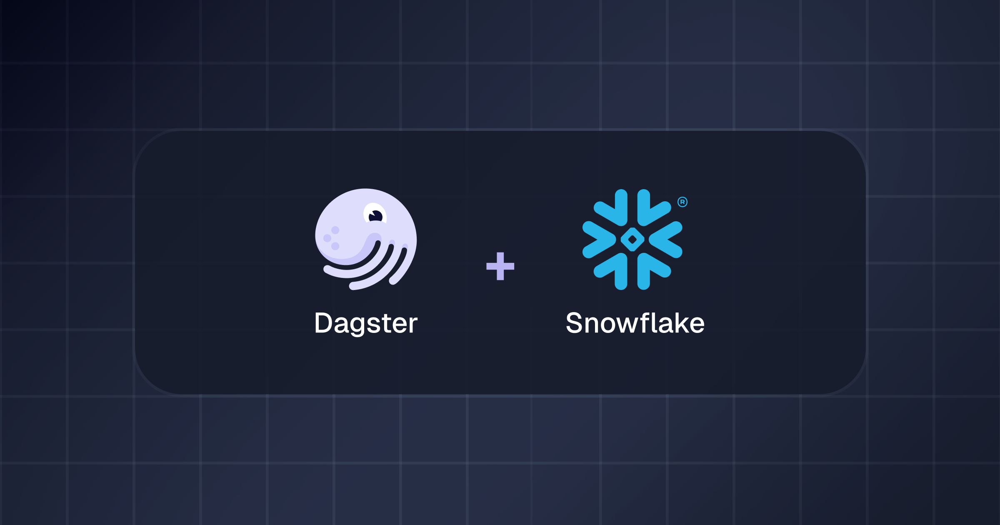
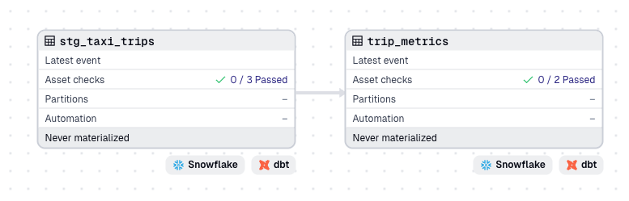
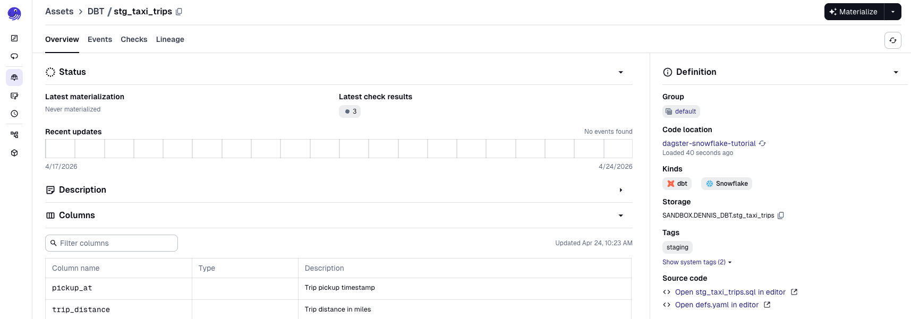
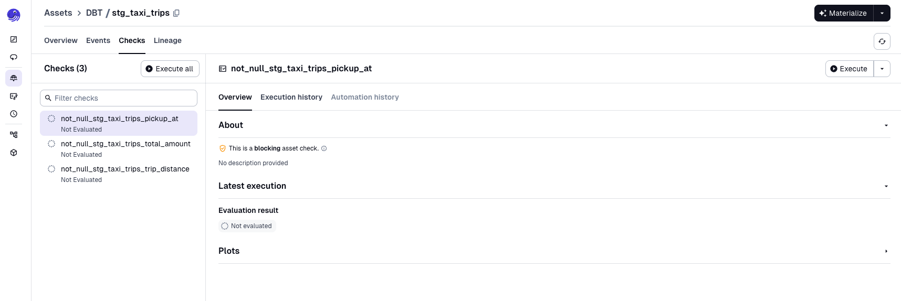
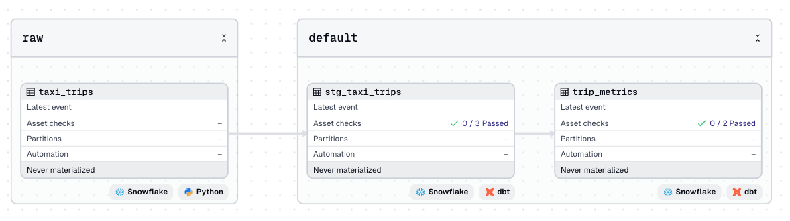
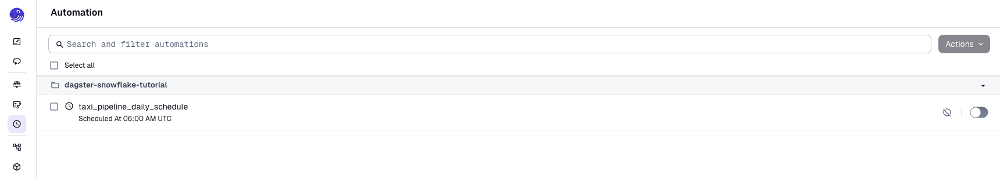

author: Dennis Hume
id: data-engineering-with-dagster-dbt-snowflake
categories: snowflake-site:taxonomy/solution-center/certification/quickstart, snowflake-site:taxonomy/solution-center/certification/partner-solution, snowflake-site:taxonomy/product/data-engineering
language: en
summary: Orchestrate Snowflake data pipelines using Dagster with dbt for full asset lineage from S3 ingestion to analytics marts.
environments: web
status: Published
feedback link: https://github.com/Snowflake-Labs/sfguides/issues

# Data Engineering with Dagster, dbt, and Snowflake
<!-- ------------------------ -->
## Overview



Modern data teams face a common challenge: raw data arrives from external sources, needs to be loaded into Snowflake, transformed through multiple layers, and made available for analytics — all while maintaining clear visibility into what ran, when, and why.

[Dagster](https://dagster.io) solves this by treating every data artifact — a Snowflake table, a dbt model, a file — as an [asset](https://docs.dagster.io/guides/build/assets). The Dagster asset graph becomes the source of truth for your entire pipeline. You can see every upstream dependency and every downstream consumer in one view, trigger any subset of the pipeline with a click, and know exactly what data exists in your warehouse at any moment.

In this guide, you will build a pipeline that loads NYC yellow taxi trip data from a public S3/CloudFront URL into Snowflake, transforms it through two [dbt](https://www.getdbt.com/) model layers (staging and marts), and exposes the full lineage in the Dagster UI from raw parquet file through every transformation to the final analytics table.

### Prerequisites
This guide assumes basic familiarity with Python, SQL, and the command line. No prior Dagster or dbt experience is required.

### What You'll Learn
- How to create a Dagster project using the [`dg` CLI](https://docs.dagster.io/api/clis/cli)
- How to configure a dbt project as a [Dagster component](https://docs.dagster.io/guides/build/components) using YAML
- How to write a Dagster Python asset that creates a Snowflake table
- How dbt sources, dbt models, and Dagster Python assets connect in a single asset graph

### What You'll Need
1. **A Snowflake Account** with `ACCOUNTADMIN` access to create roles, warehouses, and databases
2. **Python 3.10 or newer** installed on your machine
3. **uv** — the Python package manager used by the Dagster `dg` CLI. Install with:
   ```bash
   curl -LsSf https://astral.sh/uv/install.sh | sh
   ```
4. **A code editor** — [Visual Studio Code](https://code.visualstudio.com/) is recommended

### What You'll Build
- Full end-to-end asset lineage in the Dagster UI from raw Snowflake table through all dbt transformations
- A daily schedule that refreshes the entire pipeline automatically

<!-- ------------------------ -->
## Set Up Snowflake

Before writing any orchestration code, create the Snowflake objects the pipeline will use: a dedicated database, two schemas (one for raw ingested data, one for dbt-managed objects), a virtual warehouse, and a role with the minimum necessary permissions.

Log into your Snowflake account as `ACCOUNTADMIN`, open a SQL worksheet, and run the following script in its entirety:

```sql
USE ROLE ACCOUNTADMIN;

-- Database and schemas
CREATE DATABASE IF NOT EXISTS TAXI_DATA;
CREATE SCHEMA IF NOT EXISTS TAXI_DATA.RAW;
CREATE SCHEMA IF NOT EXISTS TAXI_DATA.DBT;

-- XSmall warehouse that auto-suspends after 2 minutes of inactivity
CREATE WAREHOUSE IF NOT EXISTS TAXI_WH
  WITH WAREHOUSE_SIZE = 'XSMALL'
       AUTO_SUSPEND    = 120
       AUTO_RESUME     = TRUE
       INITIALLY_SUSPENDED = TRUE;

-- Dedicated role for Dagster
CREATE ROLE IF NOT EXISTS DAGSTER_ROLE;
GRANT USAGE  ON WAREHOUSE TAXI_WH              TO ROLE DAGSTER_ROLE;
GRANT USAGE  ON DATABASE  TAXI_DATA            TO ROLE DAGSTER_ROLE;
GRANT USAGE  ON SCHEMA    TAXI_DATA.RAW        TO ROLE DAGSTER_ROLE;
GRANT USAGE  ON SCHEMA    TAXI_DATA.DBT        TO ROLE DAGSTER_ROLE;
GRANT CREATE TABLE ON SCHEMA TAXI_DATA.RAW     TO ROLE DAGSTER_ROLE;
GRANT CREATE TABLE ON SCHEMA TAXI_DATA.DBT     TO ROLE DAGSTER_ROLE;
GRANT CREATE VIEW  ON SCHEMA TAXI_DATA.DBT     TO ROLE DAGSTER_ROLE;

-- User for Dagster (replace <YOUR_PASSWORD> with a strong password)
CREATE USER IF NOT EXISTS DAGSTER_USER
  PASSWORD         = '<YOUR_PASSWORD>'
  DEFAULT_ROLE     = DAGSTER_ROLE
  DEFAULT_WAREHOUSE = TAXI_WH;
GRANT ROLE DAGSTER_ROLE TO USER DAGSTER_USER;
```

Keep your Snowflake account identifier, username, and password handy for the `.env` file you will create in the next section.

<!-- ------------------------ -->
## Create the Dagster Project

The `dg` CLI (part of the `dagster` package, invoked via `uvx create-dagster`) scaffolds a fully-structured Python project with all the configuration files Dagster needs.

Run the following commands to create the project, set up its environment, and add the Snowflake and dbt integration libraries:

```bash
uvx create-dagster@latest project dagster-snowflake-tutorial
cd dagster-snowflake-tutorial
uv add dagster-snowflake dagster-dbt dbt-snowflake
```

- `dagster-snowflake` provides the `SnowflakeResource` used in the ingestion asset
- `dagster-dbt` provides the `DbtProjectComponent` that turns your dbt project into Dagster assets
- `dbt-snowflake` is the dbt adapter that compiles the project manifest against Snowflake — without it, `dbt parse` fails and no dbt assets load

Activate the virtual environment:

```bash
source .venv/bin/activate
```

### The Generated Project Structure

The `create-dagster` command produces this layout:

```
.
├── pyproject.toml
├── README.md
├── src
│   └── dagster_snowflake_tutorial
│       ├── __init__.py
│       ├── definitions.py
│       └── defs
│           └── __init__.py
├── tests
│   └── __init__.py
└── uv.lock
```

The critical file is `definitions.py`, which contains the auto-discovery pattern:

```python
from pathlib import Path

from dagster import definitions, load_from_defs_folder


@definitions
def defs():
    return load_from_defs_folder(path_within_project=Path(__file__).parent)
```

This single file automatically discovers every asset, schedule, sensor, and component placed anywhere inside the `defs/` directory. You never need to manually import new definitions as the project evolves.

### Set Environment Variables

Create the `.env` file at the project root:

```bash
SNOWFLAKE_ACCOUNT=<your-account-identifier>
SNOWFLAKE_USER=DAGSTER_USER
SNOWFLAKE_PASSWORD=<your-password>
```

The `.env` file is loaded automatically when you run `dg dev`. It is already listed in `.gitignore` by the project scaffold — never commit credentials to source control.

<!-- ------------------------ -->
## Create the dbt Project

The dbt project lives inside the Dagster project directory, keeping everything in one repository.

### Initialize the dbt Project

From inside `dagster-snowflake-tutorial/`:

```bash
uv run dbt init analytics --skip-profile-setup
```

This creates an `analytics/` directory at the project root. The `--skip-profile-setup` flag skips the interactive profile wizard; you will configure the Snowflake profile manually below.

### Configure the dbt Profile

Create `analytics/profiles.yml`:

```yaml
analytics:
  target: dev
  outputs:
    dev:
      type: snowflake
      account: "{{ env_var('SNOWFLAKE_ACCOUNT') }}"
      user: "{{ env_var('SNOWFLAKE_USER') }}"
      password: "{{ env_var('SNOWFLAKE_PASSWORD') }}"
      role: DAGSTER_ROLE
      warehouse: TAXI_WH
      database: TAXI_DATA
      schema: DBT
      threads: 4
```

Using `env_var()` keeps credentials out of version control.

### Configure `dbt_project.yml`

Replace the generated content of `analytics/dbt_project.yml`:

```yaml
name: analytics
version: "1.0.0"
config-version: 2
profile: analytics

model-paths:    ["models"]
analysis-paths: ["analyses"]
test-paths:     ["tests"]
seed-paths:     ["seeds"]
macro-paths:    ["macros"]
snapshot-paths: ["snapshots"]

models:
  analytics:
    staging:
      +materialized: view
      +schema: DBT
    marts:
      +materialized: table
      +schema: DBT
```

Staging models are materialized as views (fast to rebuild, no storage cost), while marts are materialized as tables (fast to query for downstream BI tools).

### Create the dbt Model Files

Replace the generated `models/example/` directory and create the following structure:

```
analytics/models/
├── sources/
│   └── raw_taxi.yml
├── staging/
│   ├── stg_taxi_trips.sql
│   └── staging.yml
└── marts/
    ├── trip_metrics.sql
    └── marts.yml
```

**`analytics/models/sources/raw_taxi.yml`** — declares the Snowflake raw table as a dbt source. The `meta` tag connects it to the `taxi_trips` Dagster asset:

```yaml
version: 2

sources:
  - name: raw
    database: TAXI_DATA
    schema: RAW
    tables:
      - name: taxi_trips
        description: "Raw NYC yellow taxi trip data loaded from S3/CloudFront by Dagster"
        meta:
          dagster:
            asset_key: ["taxi_trips"]
```

**`analytics/models/staging/stg_taxi_trips.sql`** — cleans and renames the raw parquet columns:

```sql
with source as (
    select * from {{ source('raw', 'taxi_trips') }}
),

renamed as (
    select
        VendorID                                        as vendor_id,
        tpep_pickup_datetime                            as pickup_at,
        tpep_dropoff_datetime                           as dropoff_at,
        passenger_count,
        trip_distance,
        PULocationID                                    as pickup_location_id,
        DOLocationID                                    as dropoff_location_id,
        payment_type,
        fare_amount,
        tip_amount,
        total_amount,
        datediff(
            'minute',
            tpep_pickup_datetime,
            tpep_dropoff_datetime
        )                                               as trip_duration_minutes
    from source
    where trip_distance > 0
      and total_amount  > 0
      and tpep_pickup_datetime >= '2023-01-01'
      and tpep_pickup_datetime <  '2023-02-01'
)

select * from renamed
```

**`analytics/models/staging/staging.yml`** — dbt documentation and data quality tests:

```yaml
version: 2

models:
  - name: stg_taxi_trips
    description: "Cleaned and renamed staging model for NYC yellow taxi trips"
    config:
      tags: ["staging"]
    columns:
      - name: pickup_at
        description: "Trip pickup timestamp"
        tests:
          - not_null
      - name: trip_distance
        description: "Trip distance in miles"
        tests:
          - not_null
      - name: total_amount
        description: "Total fare charged to the passenger"
        tests:
          - not_null
```

**`analytics/models/marts/trip_metrics.sql`** — aggregated business-level mart with hourly trip statistics by pickup location:

```sql
with trips as (
    select * from {{ ref('stg_taxi_trips') }}
),

metrics as (
    select
        date_trunc('hour', pickup_at)       as pickup_hour,
        pickup_location_id,
        count(*)                            as trip_count,
        avg(trip_distance)                  as avg_trip_distance,
        avg(trip_duration_minutes)          as avg_trip_duration_minutes,
        avg(total_amount)                   as avg_total_amount,
        sum(total_amount)                   as total_revenue,
        avg(tip_amount)                     as avg_tip_amount
    from trips
    group by 1, 2
)

select * from metrics
```

**`analytics/models/marts/marts.yml`:**

```yaml
version: 2

models:
  - name: trip_metrics
    description: "Hourly trip metrics by pickup location — materialized as a Snowflake table"
    config:
      tags: ["marts"]
    columns:
      - name: pickup_hour
        description: "Hour bucket of trip pickup time"
        tests:
          - not_null
      - name: trip_count
        description: "Number of trips in this hour and pickup location"
        tests:
          - not_null
```

<!-- ------------------------ -->
## Configure the dbt Component

A single `dg scaffold` command generates a YAML configuration file for the dbt project. Dagster reads this YAML, runs `dbt parse` to build the manifest, and automatically creates one Dagster asset for every dbt model and source in the project.

### Scaffold the Component

From inside `dagster-snowflake-tutorial/`:

```bash
dg scaffold defs dagster_dbt.DbtProjectComponent dbt_transforms --project-path analytics
```

This creates `src/dagster_snowflake_tutorial/defs/dbt_transforms/defs.yaml`.

```yaml
type: dagster_dbt.DbtProjectComponent

attributes:
  project: "{{ context.project_root }}/analytics"
```

### Verify the Component Loads

```bash
dg check defs
```

If dbt parses successfully, all definitions are valid. Any syntax errors will surface here before you start the Dagster server.

The dbt project, represented as Dagster assets, can be viewed in the Dagster UI.

```bash
dg dev
```

Open `http://localhost:3000` to view your asset graph.



More information can be viewed about each individual asset.



This includes the dbt tests associated with each dbt model, represented as [asset checks](https://docs.dagster.io/guides/test/asset-checks).



<!-- ------------------------ -->
## Write the Ingestion Asset

The dbt component handles transformations, but raw data still needs to arrive in Snowflake before we can execute our pipeline. This section adds a Dagster Python asset that creates the raw `TAXI_TRIPS` table and loads a month of NYC taxi parquet data from a public CloudFront URL using Snowflake's native `COPY INTO`.

### Create the Asset File

Scaffold the ingestion asset:

```bash
dg scaffold defs dagster.asset assets/ingestion.py
```

Replace the contents of the generated file with:

```python
import dagster as dg
from dagster_snowflake import SnowflakeResource


@dg.asset(
    group_name="raw",
    description="Load January 2023 NYC yellow taxi trips from S3 into Snowflake",
    kinds={"snowflake", "python"},
)
def taxi_trips(snowflake: SnowflakeResource) -> dg.MaterializeResult:
    with snowflake.get_connection() as conn:
        cursor = conn.cursor()

        cursor.execute("""
            CREATE TABLE IF NOT EXISTS TAXI_DATA.RAW.TAXI_TRIPS (
                VendorID              INTEGER,
                tpep_pickup_datetime  TIMESTAMP,
                tpep_dropoff_datetime TIMESTAMP,
                passenger_count       FLOAT,
                trip_distance         FLOAT,
                RatecodeID            FLOAT,
                store_and_fwd_flag    STRING,
                PULocationID          INTEGER,
                DOLocationID          INTEGER,
                payment_type          INTEGER,
                fare_amount           FLOAT,
                extra                 FLOAT,
                mta_tax               FLOAT,
                tip_amount            FLOAT,
                tolls_amount          FLOAT,
                improvement_surcharge FLOAT,
                total_amount          FLOAT,
                congestion_surcharge  FLOAT,
                airport_fee           FLOAT
            )
        """)

        cursor.execute("TRUNCATE TABLE TAXI_DATA.RAW.TAXI_TRIPS")

        cursor.execute("""
            COPY INTO TAXI_DATA.RAW.TAXI_TRIPS
            FROM 'https://d37ci6vzurychx.cloudfront.net/trip-data/yellow_tripdata_2023-01.parquet'
            FILE_FORMAT = (
                TYPE                = PARQUET
                SNAPPY_COMPRESSION  = TRUE
            )
            MATCH_BY_COLUMN_NAME = CASE_INSENSITIVE
            ON_ERROR             = ABORT_STATEMENT
        """)

        cursor.execute("SELECT COUNT(*) FROM TAXI_DATA.RAW.TAXI_TRIPS")
        rows_loaded = cursor.fetchone()[0]

    return dg.MaterializeResult(
        metadata={
            "rows_loaded": dg.MetadataValue.int(rows_loaded),
            "source_url": dg.MetadataValue.url(
                "https://d37ci6vzurychx.cloudfront.net/trip-data/yellow_tripdata_2023-01.parquet"
            ),
        }
    )
```

A few things worth noting:

- **`CREATE TABLE IF NOT EXISTS`** — the asset owns the schema of its output. The table is created on first run and left in place on subsequent runs.
- **`TRUNCATE` before `COPY INTO`** — ensures the asset is idempotent. Re-materializing it always produces the same result.
- **`MaterializeResult` with metadata** — the row count and source URL are recorded in the Dagster UI asset details panel after every run, giving you an audit trail without any custom logging.
- **`snowflake: SnowflakeResource`** — Dagster injects this resource at runtime. You declare the dependency; Dagster supplies it.

### Configure the SnowflakeResource

Scaffold a resource to make the `SnowflakeResource` available to all assets in the project.

```bash
dg scaffold defs dagster.resources resources.py
```

Replace the code at `src/dagster_snowflake_tutorial/defs/resources.py` with:

```python
import dagster as dg
from dagster_snowflake import SnowflakeResource

defs = dg.Definitions(
    resources={
        "snowflake": SnowflakeResource(
            account=dg.EnvVar("SNOWFLAKE_ACCOUNT"),
            user=dg.EnvVar("SNOWFLAKE_USER"),
            password=dg.EnvVar("SNOWFLAKE_PASSWORD"),
            warehouse="TAXI_WH",
            database="TAXI_DATA",
            schema="RAW",
        )
    }
)
```

`dg.EnvVar` reads environment variables at runtime rather than import time.

### View the Graph

If you have closed the UI, launch it again with:

```bash
dg dev
```

The asset graph at `http://localhost:3000` now shows the ingestion asset alongside the dbt assets:



<!-- ------------------------ -->
## Add a Daily Schedule

Dagster's schedule system triggers asset materializations on a cron expression. Create a daily schedule that refreshes the entire pipeline.

```bash
dg scaffold defs dagster.schedule schedules.py
```

Replace the contents of `src/dagster_snowflake_tutorial/defs/schedules.py` with a job and schedule:

```python
import dagster as dg

taxi_pipeline_job = dg.define_asset_job(
    name="taxi_pipeline_daily",
    selection=dg.AssetSelection.all(),
    description="Full refresh: ingest from S3, build staging view, build marts table",
)

daily_schedule = dg.ScheduleDefinition(
    name="taxi_pipeline_daily_schedule",
    job=taxi_pipeline_job,
    cron_schedule="0 6 * * *",
)
```

Restart `dg dev` and navigate to **Automation**. The `taxi_pipeline_daily_schedule` will be listed with its next scheduled run time.



<!-- ------------------------ -->
## Materialize the Pipeline

With the asset graph fully wired up, run the pipeline end-to-end. Dagster materializes assets in dependency order: first `taxi_trips` (which creates and loads the Snowflake table), then `stg_taxi_trips` (which runs `dbt build` for the staging model), then `trip_metrics` (which runs `dbt build` for the marts model).

### Materialize from the UI

In the Dagster asset graph view:

1. Click **Materialize all** in the top-right corner
2. Watch the run progress — each node turns green as it completes

Click on any asset node to open the asset detail panel and see the run logs and metadata for that specific asset.

### Verify in Snowflake

Switch to your Snowflake worksheet and run the following queries to confirm data flowed through every layer:

```sql
-- Confirm raw data loaded (~3 million rows for January 2023)
SELECT COUNT(*) FROM TAXI_DATA.RAW.TAXI_TRIPS;

-- Inspect the staging view (cleaned column names, filtered rows)
SELECT * FROM TAXI_DATA.DBT.STG_TAXI_TRIPS LIMIT 10;

-- Query the final mart
SELECT
    pickup_hour,
    SUM(trip_count)        AS total_trips,
    AVG(avg_total_amount)  AS avg_fare,
    SUM(total_revenue)     AS total_revenue
FROM TAXI_DATA.DBT.TRIP_METRICS
GROUP BY 1
ORDER BY 1
LIMIT 24;
```

<!-- ------------------------ -->
## Conclusion

You have built a production-ready data engineering pipeline using Dagster, dbt, and Snowflake. You started with raw parquet files on S3 and ended with a clean, tested, documented analytics mart in Snowflake with full lineage visible in the Dagster UI at every step.

### What You've Covered
- How to use `create-dagster` and the `dg` CLI to scaffold a Dagster project with auto-discovery of definitions
- How to configure a `DbtProjectComponent` with a YAML file to connect your dbt project to Dagster
- How to write a Dagster Python asset that creates a Snowflake table and idempotently loads data via `COPY INTO`, with row count metadata surfaced in the UI
- How to add a daily schedule with a single `ScheduleDefinition`
- How to materialize the full pipeline from the Dagster UI and verify results in Snowflake

### Additional Resources:
- [dagster-dbt integration reference](https://docs.dagster.io/integrations/libraries/dbt)
- [dagster-snowflake integration reference](https://docs.dagster.io/integrations/libraries/snowflake)
- [NYC TLC Trip Record Data](https://www.nyc.gov/site/tlc/about/tlc-trip-record-data.page)
- [Dagster community Slack](https://dagster.io/slack)
