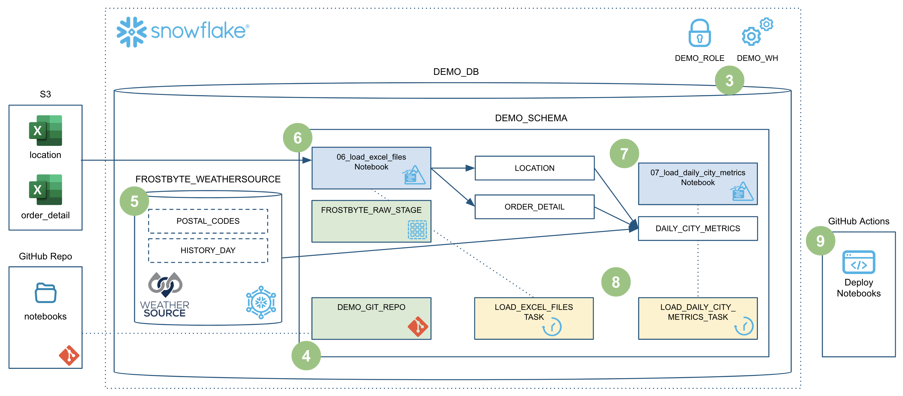
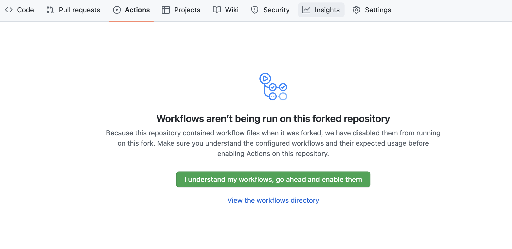
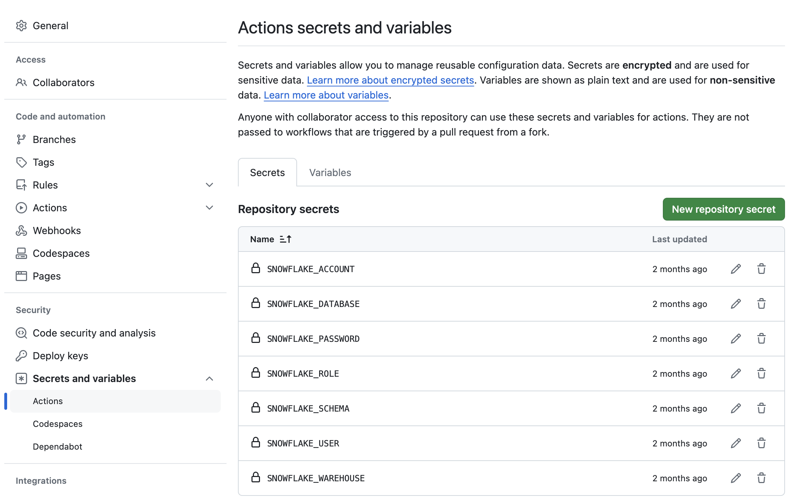
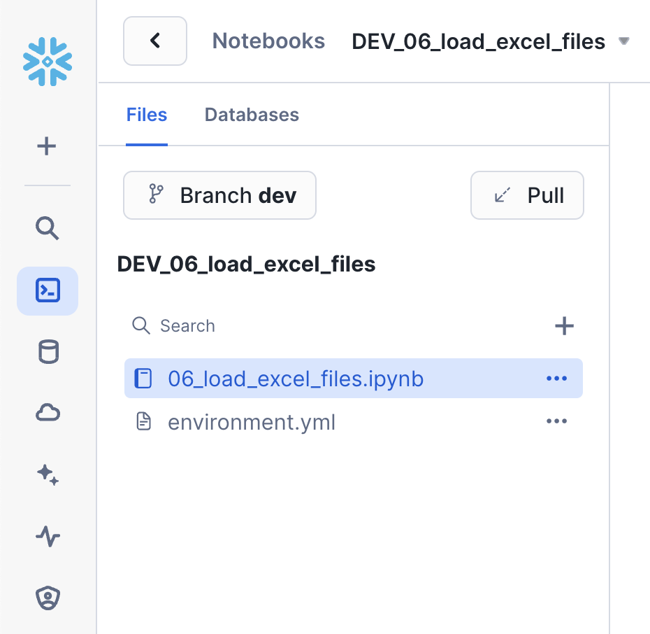
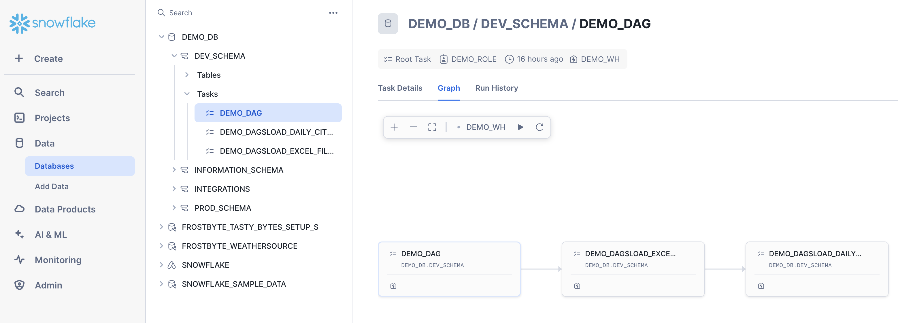
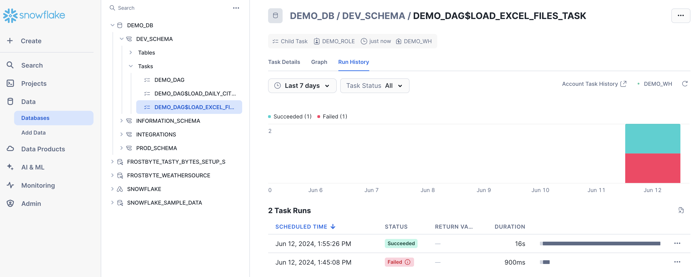
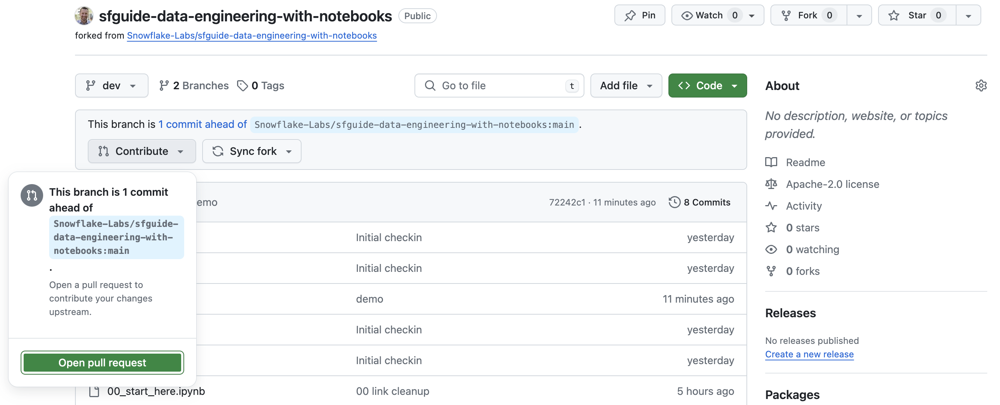
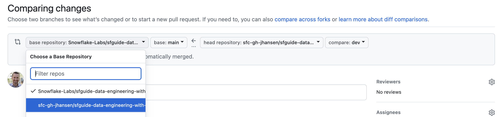
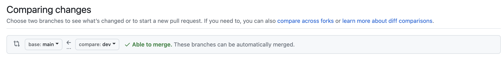
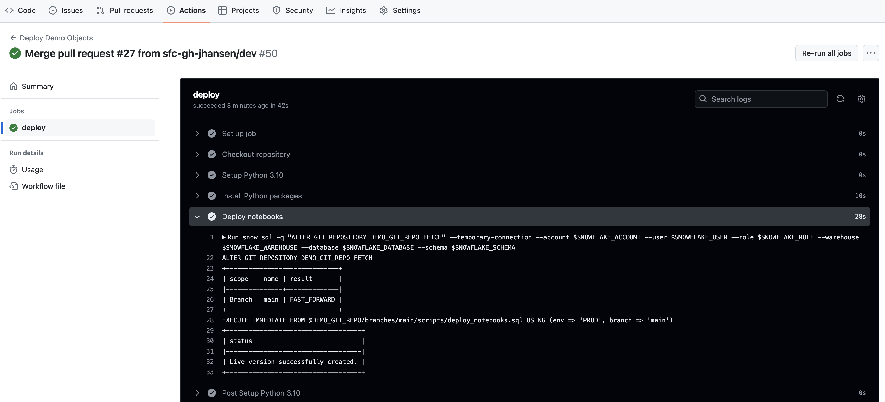

authors: Jeremiah Hansen
id: data-engineering-with-notebooks
categories: snowflake-site:taxonomy/solution-center/certification/quickstart, snowflake-site:taxonomy/solution-center/certification/community-sourced, snowflake-site:taxonomy/solution-center/includes/architecture, snowflake-site:taxonomy/product/data-engineering
language: en
summary: Build data engineering pipelines using Snowflake Notebooks with Python and SQL for interactive, collaborative pipeline development.
environments: web
status: Published 
feedback link: https://github.com/Snowflake-Labs/sfguides/issues

# Getting Started with Data Engineering using Snowflake Notebooks
<!-- ------------------------ -->
## Overview 

Notebooks are a very popular tool that are used to do everything from ad-hoc exploration of data to productionalized data engineering pipelines. While Notebooks can contain a mix of both Python and SQL, most of the time they're used for Python coding. In my previous Quickstart I detailed [how to build Python data engineering pipelines in Snowflake](/en/developers/guides/data-engineering-pipelines-with-snowpark-python/) using Visual Studio Code, from a lower-level developer perspective.

This Quickstart will focus on how to build Python data engineering pipelines using Snowflake native Notebooks! Additionally, it will provide all the details needed to manage and deploy those Notebooks through an automated CI/CD pipeline from development to production! Here's a quick visual overview of what we'll accomplish in this Quickstart:



### What You’ll Learn
* How to ingest custom file formats (like Excel) with Snowpark from an external stage (such as an S3 bucket) into a Snowflake table
* How to access data from Snowflake Marketplace and use it for your analysis
* How to use Snowflake Notebooks and the Snowpark DataFrame API to build data engineering pipelines
* How to add logging to your Python data engineering code and monitor from within Snowsight
* How to use the Snowflake Python Management API to programmatically work with Snowflake objects
* How to use the Python Task DAG API to programatically manage Snowflake Tasks
* How to build CI/CD pipelines using Snowflake's Git Integration, the Snowflake CLI, and GitHub Actions
* How to deploy Snowflake Notebooks from dev to production

### What You'll Build
* A data share from the Snowflake Marketplace to access weather data
* A data engineering pipeline with a Notebook to ingest Excel files into Snowflake
* A data engineering pipeline with a Notebook to transform and aggreggate data
* A DAG (or Directed Acyclic Graph) of Tasks to orchestrate/schedule the pipelines
* A CI/CD pipeline to deploy the Notebooks to production

### Prerequisites
* Familiarity with Python
* Familiarity with the DataFrame API
* Familiarity with Snowflake
* Familiarity with Git repositories and GitHub

### What You’ll Need
You will need the following things before beginning:

* Snowflake account
    * **A Snowflake Account**. Visit the [Snowflake Account Sign In](https://app.snowflake.com/) page to log into your account or to sign up for a trial account.
    * **A Snowflake user created with ACCOUNTADMIN permissions**. This user will be used to get things setup in Snowflake.
* GitHub account
    * **A GitHub account**. If you don't already have a GitHub account you can create one for free. Visit the [Join GitHub](https://github.com/signup) page to get started.


<!-- ------------------------ -->
## Quickstart Setup

### Create a GitHub Personal Access Token
In order for Snowflake to authenticate to your GitHub repository, you will need to generate a personal access token. Please follow the [Creating a personal access token](https://docs.github.com/en/authentication/keeping-your-account-and-data-secure/managing-your-personal-access-tokens#creating-a-personal-access-token-classic) instructions to create your token.

Make sure to save the token before leaving the page, as we will be using it a couple of times during this Quickstart.

### Fork the Quickstart Repository
You'll need to create a fork of the repository for this Quickstart in your GitHub account. Visit the [Data Engineering with Snowflake Notebooks associated GitHub Repository](https://github.com/Snowflake-Labs/sfguide-data-engineering-with-notebooks) and click on the "Fork" button near the top right. Complete any required fields and click "Create Fork".

### Configure GitHub Actions
By default GitHub Actions disables any workflows (or CI/CD pipelines) defined in the forked repository. This repository contains a workflow to deploy your Snowpark Notebooks, which we'll use later on. So for now enable this workflow by opening your forked repository in GitHub, clicking on the `Actions` tab near the top middle of the page, and then clicking on the `I understand my workflows, go ahead and enable them` green button.



The last step to enable your GitHub Actions workflow is to create the required secrets. In order for your GitHub Actions workflow to be able to connect to your Snowflake account you will need to store your Snowflake credentials in GitHub. Action Secrets in GitHub are used to securely store values/variables which will be used in your CI/CD pipelines. In this step we will create secrets for each of the parameters used to connect to your Snowflake account.

From the repository, click on the "Settings" tab near the top of the page. From the Settings page, click on the `Secrets and variables` then `Actions` tab in the left hand navigation. The `Actions` secrets should be selected. For each secret listed below click on `New repository secret` near the top right and enter the name given below along with the appropriate value (adjusting as appropriate).

| Secret name | Secret value |
|-------------|--------------|
| SNOWFLAKE_ACCOUNT | myaccount |
| SNOWFLAKE_USER | myusername |
| SNOWFLAKE_PASSWORD | mypassword |
| SNOWFLAKE_ROLE | DEMO_ROLE |
| SNOWFLAKE_WAREHOUSE | DEMO_WH |
| SNOWFLAKE_DATABASE | DEMO_DB |
| SNOWFLAKE_SCHEMA | INTEGRATIONS |

>  **Tip** - For more details on how to structure the account name in SNOWFLAKE_ACCOUNT, see the account name discussion in [the Snowflake Python Connector install guide](https://docs.snowflake.com/en/user-guide/python-connector-install.html#step-2-verify-your-installation).

When you’re finished adding all the secrets, the page should look like this:



>  **Tip** - For an even better solution to managing your secrets, you can leverage [GitHub Actions Environments](https://docs.github.com/en/actions/reference/environments). Environments allow you to group secrets together and define protection rules for each of your environments.


<!-- ------------------------ -->
## Setup Snowflake

In this section we're going to set up the required objects in Snowflake to use notebooks in Workspaces and have that Workspace connected directly to our forked Git repository.

### Create GitHub API Integration

To connect a Workspace to your GitHub repository, you'll need to create an API integration that allows Snowflake to communicate with GitHub. In your Snowflake environment, run the following in a SQL script in your default Workspace:

```sql
USE ROLE ACCOUNTADMIN;

CREATE OR REPLACE API INTEGRATION GITHUB_API_INTEGRATION
    API_PROVIDER = GIT_HTTPS_API
    API_ALLOWED_PREFIXES = ('https://github.com/')
    ALLOWED_AUTHENTICATION_SECRETS = ALL
    ENABLED = TRUE;

--GRANT USAGE ON INTEGRATION github_api_integration TO ROLE DEMO_ROLE;
```

This API integration allows Snowflake to access GitHub repositories. The `ALLOWED_AUTHENTICATION_SECRETS = ALL` setting allows the integration to use any secret for authentication, which we'll need for private repositories or to push changes back to GitHub.

> **Note**: Only users with ACCOUNTADMIN privileges (or the CREATE INTEGRATION privilege) can create API integrations. If you don't have these privileges, ask your Snowflake administrator to create this integration for you.

### Create External Access Integration for PyPI

Notebooks in Workspaces may need to install Python packages from PyPI (the Python Package Index). To allow this, we need to create a network rule and an external access integration. This integration will be used by the `01_load_excel_files.ipynb` notebook to install the `openpyxl` package for reading Excel files.

Run the following SQL script in your default Workspace:

```sql
USE ROLE ACCOUNTADMIN;

-- This is a schema level object
CREATE OR REPLACE NETWORK RULE USER$.PUBLIC.PYPI_NETWORK_RULE
MODE = EGRESS
TYPE = HOST_PORT
VALUE_LIST = ('pypi.org', 'pypi.python.org', 'pythonhosted.org', 'files.pythonhosted.org');

-- This is an account level object
CREATE OR REPLACE EXTERNAL ACCESS INTEGRATION PYPI_ACCESS_INTEGRATION
ALLOWED_NETWORK_RULES = (PYPI_NETWORK_RULE)
ENABLED = true;
```

The network rule defines which external hosts the notebook can connect to, and the external access integration makes this rule available to notebook services. When creating your notebook service later, you'll be able to select this integration to enable PyPI access.

### Create Workspace

Now let's create a Git-integrated workspace connected to your forked repository. Workspaces provide a unified development environment where you can create, organize, and manage notebooks and other code files. Git-integrated workspaces allow you to sync your work with a Git repository for version control and collaboration.

1. In the left navigation menu, select **Projects → Workspaces**

2. In the Workspaces menu at the top left, under "Create", select **From Git repository**

3. In the "Create Workspace" dialog:
   - **Repository URL**: Paste the URL of your forked repository (e.g., `https://github.com/YOUR_USERNAME/sfguide-data-engineering-with-notebooks`)
   - **Workspace name**: Leave it as-is, or enter a name you prefer (e.g., `sfguide-data-engineering-with-notebooks`)
   - **API Integration**: Select the `GITHUB_API_INTEGRATION` we created from the dropdown

4. For authentication, select **Personal access token** and then click **+ Secret** to create a new secret with your GitHub Personal Access Token

5. Click **Create**

Snowflake will now clone the repository and create your workspace. This may take a few moments. Once complete, you'll see all the files from the GitHub repository in the left pane of your workspace. You can now open these files directly within Snowflake.

> **Note** - The Workspace provides a Jupyter-compatible notebook experience with direct access to governed Snowflake data. Notebooks run in a pre-built container environment optimized for AI/ML development with fully-managed access to CPUs and GPUs.

Throughout this Quickstart, when we reference a file (like "Open **00_start_here.ipynb**"), you'll open it from your Workspace rather than from a local clone.

### Create and Switch to Dev Branch

During this Quickstart we will do our development work in a `dev` branch of the repository. One of the great features of Git-integrated Workspaces is the ability to create and manage branches directly within Snowsight.

Let's create the `dev` branch now:

1. In your Workspace, look at the top of the file explorer pane on the left
2. Click on the **Changes** tab to open the Git panel
3. You'll see the current branch displayed (likely `main`)
4. Click on the branch dropdown to open the branch selector
5. Click **+ New** to create a new branch
6. Enter "dev" (all lowercase) as the branch name and click **Create**

Your new `dev` branch will be created and you'll automatically be switched to it. You can verify this by looking at the branch name displayed in the Changes panel.

Once you're on the `dev` branch, you're ready to start running the setup cells.

### Create the Notebook Service

Notebooks in Workspaces run on Snowpark Container Services (SPCS) compute pools rather than traditional warehouses. A compute pool in Snowflake is a collection of virtual machine (VM) nodes that run containerized workloads. Snowflake provides a default system compute pool, which is available to all accounts, that we will use for this Quickstart, named `SYSTEM_COMPUTE_POOL_CPU`.

But before you can run notebooks interactively, you need to create a notebook service in the default system compute pool. A notebook service is a Snowflake-managed container service that hosts the notebook kernel and executes your code. Each notebook service is scoped to a single user and can be shared by multiple notebooks.

> **Note** - Notebook services can currently only be created through the Workspaces UI, not via SQL.

To create your notebook service:

1. In your Workspace, open the `00_start_here.ipynb` Notebook
2. Click the **Connect** button at the top of the notebook
3. Enter the following values in the "Connect your notebook" dialog (and expand "Service settings"):
   - **Service name**: Enter `NOTEBOOK_SERVICE`
   - **External access integrations**: Select `PYPI_ACCESS_INTEGRATION`
   - **Service settings**:
      - **Compute type**: Leave with default of `CPU`
      - **Python version**: Leave with default
      - **Runtime version**: Leave with default
      - **Compute pool**: Select `SYSTEM_COMPUTE_POOL_CPU`
      - **Idle timeout**: Select `1 hour`
4. Click **Create and connect**

The notebook service will start up, which may take a minute or two for the first time. Once connected, you'll see a green "Connected" indicator.

> **Tip** - Since notebook services can be shared across multiple notebooks, you only need to create one service. When you open other notebooks in your workspace, you can connect them to the same `NOTEBOOK_SERVICE` to share compute resources.

### Run the 00 Setup Snowflake Step

Now that you're connected to your notebook service, you're ready to run cells in the Notebook. Scroll down to the "Step 01 Setup Snowflake" section and run the cells in this section to create the required database objects. To run a given cell simply click anywhere in the cell to select it and press CMD/CTRL+Enter. You can alternatively click on the Run arrow near the top right of the cell.


<!-- ------------------------ -->
## Load Weather

During this step we will be "loading" the raw weather data to Snowflake. But "loading" is the really the wrong word here. Because we're using Snowflake's unique data sharing capability we don't actually need to copy the data to our Snowflake account with a custom ETL process. Instead we can directly access the weather data shared by Weather Source in the Snowflake Marketplace. To put this in context, we are on step **#2** in our data flow overview:


### Load Weather Data from Snowflake Marketplace
Weather Source is a leading provider of global weather and climate data and their OnPoint Product Suite provides businesses with the necessary weather and climate data to quickly generate meaningful and actionable insights for a wide range of use cases across industries. Let's connect to the `Weather Source LLC: frostbyte` feed from Weather Source in the Snowflake Marketplace by following these steps:

* Login to Snowsight
* Click on the `Marketplace` -> `Snowflake Marketplace` link in the left navigation bar
* Enter "Weather Source LLC: frostbyte" in the search box and click return
* Click on the "Weather Source LLC: frostbyte" listing tile
* Click the blue "Get" button
    * Expand the "Options" dialog
    * Change the "Database name" to read "FROSTBYTE_WEATHERSOURCE" (all capital letters)
    * Select the "DEMO_ROLE" role to have access to the new database
* Click on the blue "Get" button

That's it... we don't have to do anything from here to keep this data updated. The provider will do that for us and data sharing means we are always seeing whatever they have published. How amazing is that? Just think of all the things you didn't have do here to get access to an always up-to-date, third-party dataset!


<!-- ------------------------ -->
## Load Excel Files

During this step we will be loading data from two Excel files in S3 into the `LOCATION` and `ORDER_DETAIL` tables. To do this we'll take advantage of the [Snowpark Python file access feature](https://docs.snowflake.com/en/developer-guide/snowpark/python/creating-sprocs#reading-dynamically-specified-files-with-snowflakefile). For more details on this please see my related blog post [Simplify data ingestion with Snowpark Python file access](https://medium.com/snowflake/simplify-data-ingestion-with-snowpark-python-file-access-f2bc0e4cd887).

> **Note** - Workspace Notebooks do not yet support [Scoped URLs](https://docs.snowflake.com/en/sql-reference/functions/build_scoped_file_url) or [Stage URLs](https://docs.snowflake.com/en/sql-reference/functions/build_stage_file_url). So as a workaround for now we will copy the Excel files from the external stage to a temporary internal stage and open from there. This note was last updated on 2/11/26.

To put this in context, we are on step **#3** in our data flow overview:


### Run the Notebook

In Workspaces, open the `01_load_excel_files` notebook,  click on the "Run all" button near the top right of the window. This will execute all cells in the notebook, in order.

>  **Tip** - Since we will be going back to the `00_start_here` Notebook later, it might be easier to open a new Snowsight tab and set the default role to `DEMO_ROLE` there, and leave your current tab with the `00_start_here` Notebook open as well.

### Notebook Git Integration

You will notice that to the left of the main Notebook area there is a sidebar which shows the files in the Workspace. The two notebooks that we'll be running and deploying in this Quickstart can be found in the `/notebooks` folder. Above the file viewer you will see a **Changes** button/tab which contains the Git related controls that are built into Workspaces. Here you are able to work with branches, push and pull changes, and view diffs. Here's a screenshot:



### Notebook Cell References

Workspace Notebooks provide powerful interoperability between SQL and Python cells. You can easily pass data between cells using standard Jupyter patterns.

For example, you can run a SQL query in one cell and then use the results in a Python cell. The results of SQL cells are automatically available as DataFrames. Here's an example:

In the `sql_get_spreadsheets` SQL cell we have:
```sql
SELECT '@INTEGRATIONS.FROSTBYTE_RAW_STAGE/intro/order_detail.xlsx' AS STAGE_FILE_PATH, 'order_detail' AS WORKSHEET_NAME, 'ORDER_DETAIL' AS TARGET_TABLE
UNION
SELECT '@INTEGRATIONS.FROSTBYTE_RAW_STAGE/intro/location.xlsx', 'location', 'LOCATION';
```

And then in the subsequent `py_process_spreadsheets` Python cell we can access the prior result like this:
```python
# Process each file from the sql_get_spreadsheets cell above
files_to_load = dataframe_1
for index, excel_file in files_to_load.iterrows():
    print(f"Processing Excel file {excel_file['STAGE_FILE_PATH']}")
    load_excel_worksheet_to_table(session, excel_file['STAGE_FILE_PATH'], excel_file['WORKSHEET_NAME'], excel_file['TARGET_TABLE'])
```

For more details, please see the [Notebooks in Workspaces documentation](https://docs.snowflake.com/en/user-guide/ui-snowsight/notebooks-in-workspaces/notebooks-in-workspaces-edit-run) for information on cell references.

### Dynamic File Access

Like I mentioned at the beginning of this section, we're able to read and process Excel files with the [Snowpark Python file access feature](https://docs.snowflake.com/en/developer-guide/snowpark/python/creating-sprocs#reading-dynamically-specified-files-with-snowflakefile). And this same principle applies to more than just Excel files, you can use it to process any file format you'd like. For more details on this please see my related blog post [Simplify data ingestion with Snowpark Python file access](https://medium.com/snowflake/simplify-data-ingestion-with-snowpark-python-file-access-f2bc0e4cd887).

> **Note** - Workspace Notebooks do not yet support [Scoped URLs](https://docs.snowflake.com/en/sql-reference/functions/build_scoped_file_url) or [Stage URLs](https://docs.snowflake.com/en/sql-reference/functions/build_stage_file_url). So as a workaround for now we will copy the Excel files from the external stage to a temporary internal stage and open from there. This note was last updated on 2/11/26.


<!-- ------------------------ -->
## Load Daily City Metrics

During this step we will be joining data from our `LOCATION` and `ORDER_DETAIL` tables (from the previous step) with the weather data we set up in step 2 to produce an aggregated reporting table `DAILY_CITY_METRICS`. We'll leverage the Snowpark DataFrame API to perform the data transformations, and will also show how to incorporate logging into your code. To put this in context, we are on step **#4** in our data flow overview:


### Run the Notebook

Open the `02_load_daily_city_metrics` Notebook click on the "Run all" button near the top right of the window. This will execute all cells in the notebook, in order.

### Snowpark DataFrame API

In this step we're starting to really use the Snowpark DataFrame API for data transformations. The Snowpark API provides the same functionality as the [Spark SQL API](https://spark.apache.org/docs/latest/api/python/reference/pyspark.sql/index.html). To begin with you need to create a Snowpark session object. Like in PySpark, this can be accomplished with the `Session.builder.configs().create()` methods. But within a Snowflake Notebook this is simplified and can be accomplished with just `session = get_active_session()`.

One you have a Snowpark session you can begin working with data. In this Notebook we're using DataFrames to join the data from different tables into an `order_detail` DataFrame using the `join()` API.

```python
order_detail = order_detail.join(location, order_detail['LOCATION_ID'] == location['LOCATION_ID'])
order_detail = order_detail.join(history_day, (F.builtin("DATE")(order_detail['ORDER_TS']) == history_day['DATE_VALID_STD']) & (location['ISO_COUNTRY_CODE'] == history_day['COUNTRY']) & (location['CITY'] == history_day['CITY_NAME']))
```

After that we're then aggregating the DataFrame using APIs such as `agg()`, `group_by()`, and `select()`.

```python
final_agg = order_detail.group_by(F.col('DATE_VALID_STD'), F.col('CITY_NAME'), F.col('ISO_COUNTRY_CODE')) \
                        .agg( \
                            F.sum('PRICE').alias('DAILY_SALES_SUM'), \
                            F.avg('AVG_TEMPERATURE_AIR_2M_F').alias("AVG_TEMPERATURE_F"), \
                            F.avg("TOT_PRECIPITATION_IN").alias("AVG_PRECIPITATION_IN"), \
                        ) \
                        .select(F.col("DATE_VALID_STD").alias("DATE"), F.col("CITY_NAME"), F.col("ISO_COUNTRY_CODE").alias("COUNTRY_DESC"), \
                            F.builtin("ZEROIFNULL")(F.col("DAILY_SALES_SUM")).alias("DAILY_SALES"), \
                            F.round(F.col("AVG_TEMPERATURE_F"), 2).alias("AVG_TEMPERATURE_FAHRENHEIT"), \
                            F.round(F.col("AVG_PRECIPITATION_IN"), 2).alias("AVG_PRECIPITATION_INCHES"), \
                        )
```

And finally if the target table exists we're using the `merge()` DataFrame API to perform and Upsert operation on the target table. This is what enables us to perform incremental processing.

```python
    dcm.merge(final_agg, (dcm['DATE'] == final_agg['DATE']) & (dcm['CITY_NAME'] == final_agg['CITY_NAME']) & (dcm['COUNTRY_DESC'] == final_agg['COUNTRY_DESC']), \
                        [F.when_matched().update(cols_to_update), F.when_not_matched().insert(cols_to_update)])
```

For more details about the Snowpark Python DataFrame API, please check out our [Working with Dataframe in Snowpark Python](https://docs.snowflake.com/en/developer-guide/snowpark/python/working-with-dataframes.html) page.

### Python Management API

The new Python Management API allows us to programmatically interact with Snowflake with native Python objects. This API can be used to both inspect and manage Snowflake objects. In the previous Quickstart we checked for the existing of an object by using SQL like this:

```sql
def table_exists(session, database_name='', schema_name='', table_name=''):
    exists = session.sql("SELECT EXISTS (SELECT * FROM {}.INFORMATION_SCHEMA.TABLES WHERE TABLE_SCHEMA = '{}' AND TABLE_NAME = '{}') AS TABLE_EXISTS".format(database_name, schema_name, table_name)).collect()[0]['TABLE_EXISTS']
    return exists
```

But with the Python Management API this can now be done with native Python objects like this:

```python
def table_exists(session, database_name='', schema_name='', table_name=''):
    root = Root(session)
    tables = root.databases[database_name].schemas[schema_name].tables.iter(like=table_name)
    for table_obj in tables:
        if table_obj.name == table_name:
            return True

    return False
```

And this is really just the beginning of what you can do with this new library. Please check out the [Snowflake Python Management API](https://docs.snowflake.com/en/developer-guide/snowflake-python-api/snowflake-python-overview) documentation for more details.

### Logging in Python

A key aspect of building robust data engineering pipelines involves instrumenting our code. This enables the monitoring and operations of our code, and is especially important when automating the deployment and monitoring of our pipelines with DevOps. Snowflake has a rich set of [Logging and Tracing](https://docs.snowflake.com/en/developer-guide/logging-tracing/logging-tracing-overview) capabilities to help.

You'll notice that in the `py_initialize` cell of this Notebook we're using Snowflake's logging capabilities. There are two steps to do so in your code. The first is to create a logger to use:

```python
logger_name = 'demo_logger'
logger = logging.getLogger(logger_name)
logger.setLevel(logging.INFO)
```

And the second is to actually log debugging and informational messages at the appropriate places in your code:

```python
logger.info(f"Begin executing notebook {notebook_name}", extra = {'logger_name': logger_name})
```

In addition to custom logging, Snowflake is instrumenting all services/features to take advantage of logging and tracing as well. For example, when you ran this Notebook earlier it logged a number of messages by default, like when each cell executed.

All of your log messages can be found in your default logging table, which we created in step 1. If you look back at the code from step 1 you'll find that we created an event table named `DEMO_DB.INTEGRATIONS.DEMO_EVENTS` and then set that as the default event table for the account. You can now use this table just like any other table in Snowflake to query and act on the log data.


<!-- ------------------------ -->
## Deploy Notebook Project to Dev

During this step we will be deploying the dev versions of our two data engineering Notebooks: `01_load_excel_files` and `02_load_daily_city_metrics`. To deploy notebooks to Snowflake we will create a `NOTEBOOK PROJECT` object in our `DEV_SCHEMA`, along with the other resources in our development environment.

To put this in context, we are on step **#5** in our data flow overview:


### NOTEBOOK PROJECT Object

Notebook Project Objects (NPOs) are the key to deploying and scheduling notebooks in production with Workspace Notebooks. An NPO is a schema-level object that encapsulates your notebook files and their dependencies, making them ready for scheduled execution.

Key characteristics of NPOs:

* **Schema-level object**: NPOs exist within a specific schema (`database_name.schema_name.npo_name`)
* **Encapsulation**: An NPO captures all notebook files from your workspace, ensuring all dependencies are available during execution
* **Versioning**: NPOs support versioned deployments, allowing you to track changes and roll back if needed
* **Execution**: You execute an NPO using the `EXECUTE NOTEBOOK PROJECT` command, specifying which notebook file to run with the `MAIN_FILE` parameter

The NPO deployment model provides a clean separation between interactive development (in Workspaces) and production execution (via NPOs and Tasks). This ensures that your scheduled notebooks run exactly the code that was deployed, not whatever is currently in your workspace.

### Deploy Notebooks

To deploy the dev versions of our notebooks, we'll create an NPO using a simple Python script. The `scripts/deploy_notebooks.py` script handles the deployment by:

1. Getting a temporary stage from the Snowpark session
2. Uploading all notebook files from the local folder to the stage
3. Creating or updating the Notebook Project Object from the staged files

Run the deployment cell in the `00_start_here` Notebook to deploy the notebooks. The cell uses the `%run` magic to execute the deployment script:

```python
%run scripts/deploy_notebooks.py DEMO_DB DEV_SCHEMA DEMO_PIPELINES_NP ./notebooks
```

This command deploys all notebooks from the `./notebooks` folder to a Notebook Project Object named `DEMO_PIPELINES_NP` in `DEMO_DB.DEV_SCHEMA`.

You can verify the deployment by running:

```sql
SHOW NOTEBOOK PROJECTS IN DEMO_DB.DEV_SCHEMA;
```

Once deployed, you'll be able to execute these notebooks on a schedule using Snowflake Tasks.


<!-- ------------------------ -->
## Orchestrate Pipelines

During this step we will be orchestrating our new Snowpark Notebook pipelines with Snowflake's native orchestration feature named Tasks. You can create and deploy Snowflake Task objects using SQL as well as with our Python Task APIs. For this Quickstart, we will use Snowflake Python Task APIs to create the Tasks. We will create two tasks, one for each Notebook, and chain them together. To put this in context, we are on step **#6** in our data flow overview:


### Deploy Task DAG

Toggle back to the `00_start_here` Notebook, scroll down to the "Step 06 Orchestrate Pipelines" section, and run each of the cells.

### Python Task DAG API

In this step we will create a DAG (or Directed Acyclic Graph) of Tasks using the new [Snowflake Python Management API](https://docs.snowflake.com/en/developer-guide/snowflake-python-api/snowflake-python-overview). The Task DAG API builds upon the Python Management API to provide advanced Task management capabilities. And if you've used Airflow before, this Python API should look familiar as it's similar to the Airflow v1 Python API. For more details see [Managing Snowflake tasks and task graphs with Python](https://docs.snowflake.com/en/developer-guide/snowflake-python-api/snowflake-python-managing-tasks).

Here is the key part of the code:

```python
# Define the DAG
with DAG(dag_name, schedule=timedelta(days=1), warehouse=warehouse_name) as dag:
    dag_task1 = DAGTask("LOAD_EXCEL_FILES_TASK", definition=f'''
        EXECUTE NOTEBOOK PROJECT {database_name}.{schema_name}.{notebook_project_name}
            MAIN_FILE = '01_load_excel_files.ipynb'
            COMPUTE_POOL = {compute_pool}
            RUNTIME = '{runtime}'
            QUERY_WAREHOUSE = {warehouse_name}
        ''', warehouse=warehouse_name)
    dag_task2 = DAGTask("LOAD_DAILY_CITY_METRICS", definition=f'''
        EXECUTE NOTEBOOK PROJECT {database_name}.{schema_name}.{notebook_project_name}
            MAIN_FILE = '02_load_daily_city_metrics.ipynb'
            COMPUTE_POOL = {compute_pool}
            RUNTIME = '{runtime}'
            QUERY_WAREHOUSE = {warehouse_name}
        ''', warehouse=warehouse_name)

    # Define the dependencies between the tasks
    dag_task1 >> dag_task2 # dag_task1 is a predecessor of dag_task2

# Create the DAG in Snowflake
dag_op.deploy(dag, mode="orreplace")
```

You can see that we're defining two tasks, one for each Notebook, and that each task calls `EXECUTE NOTEBOOK PROJECT` for the corresponding Notebook in our NPO. The key parameters are:

* **MAIN_FILE**: The notebook file to execute within the NPO
* **COMPUTE_POOL**: The SPCS compute pool to run the notebook on
* **RUNTIME**: The container runtime version (e.g., `V2.2-CPU-PY3.12`)
* **QUERY_WAREHOUSE**: The warehouse to use for SQL queries

We then define the dependencies and deploy the DAG. As you can see this makes managing complex Task DAGs much easier!

This code is also available in the `scripts/deploy_task_dag.py` script which could be used to automate the Task DAG deployment further.

### Task Viewer in Snowsight

Now, after your DAG is deployed, all the tasks in your DAG will be running as per the defined schedule. However, as a Snowflake user, how can you peek into the success and failure of each run, look at the task run time, and more?

Snowflake provides some rich task observability features in the Snowsight UI. Try it out for yourself by following these steps:

1. In the Snowsight left navigation menu, click **Catalog** » **Database Explorer**.
1. In the "Database Explorer" pane, navigate to the `DEMO_DB` database and `DEV_SCHEMA` schema.
1. For the selected schema, select and expand **Tasks**.
1. Select the `DEMO_DAG` task. Task information is displayed, including **Task Details**, **Graph**, and **Run History** sub-tabs.
1. Select the **Graph** tab. The task graph appears, displaying a hierarchy of child tasks.
1. Select a task to view its details.

Here's what the task graph looks like:



And here's an example of the task run history:



For more details, and to learn about viewing account level task history, please check out our [Viewing Task History](https://docs.snowflake.com/en/user-guide/ui-snowsight-tasks.html) documentation.

### Executing the DAG

The easiest way to manually kick off the Task DAG execution is to open up the root `DEMO_DAG` task, click on the "Graph" tab and then click on the "Run Task Graph" play button above the diagram. If not already set, you may have to pick a warehouse to use.

### Task Metadata

Snowflake keeps metadata for almost everything you do, and makes that metadata available for you to query (and to create any type of process around). Tasks are no different, Snowflake maintains rich metadata to help you monitor your task runs. Here are a few sample SQL queries you can use to monitor your tasks runs:

```sql
-- Get a list of tasks
SHOW TASKS;

-- Task execution history in the past day
SELECT *
FROM TABLE(INFORMATION_SCHEMA.TASK_HISTORY(
    SCHEDULED_TIME_RANGE_START=>DATEADD('DAY',-1,CURRENT_TIMESTAMP()),
    RESULT_LIMIT => 100))
ORDER BY SCHEDULED_TIME DESC
;

-- Scheduled task runs
SELECT
    TIMESTAMPDIFF(SECOND, CURRENT_TIMESTAMP, SCHEDULED_TIME) NEXT_RUN,
    SCHEDULED_TIME,
    NAME,
    STATE
FROM TABLE(INFORMATION_SCHEMA.TASK_HISTORY())
WHERE STATE = 'SCHEDULED'
ORDER BY COMPLETED_TIME DESC;
```

<!-- ------------------------ -->
## Deploy to Production

During this step we will be deploying our Notebooks to production using a CI/CD pipeline. We will make a small change to a Notebook and then commit that change to our Git repo all within Snowsight. After that we will create a Pull Request (or PR), merge our changes to `main` and deploy with GitHub Actions. To put this in context, we are on step **#7** in our data flow overview:


### Update the 01 Notebook

Let's make a change to the `01_load_excel_files` Notebook and commit it to our forked repository. So begin by opening the `01_load_excel_files` Notebook. For this Quickstart we will make a trivial change just so we can see how the overall process works. So scroll down to the bottom to the `sql_debugging` cell and uncomment the final line, like this:

```sql
--DESCRIBE TABLE LOCATION;
--SELECT * FROM LOCATION;
SHOW TABLES;
```

In the left sidebar you will now see the letter "M" next to the `01_load_excel_files.ipynb` Notebook file indicating that you've modified it. To commit this change to the `dev` branch, first switch to the **Changes** tab, then click on the "Push" button near the top of the **Changes** pane. Enter a basic commit message in the "Write commit message" dialog and click on the "Push" button at the bottom.

Once that completes you will have committed your first change to your forked Git repository.

### Create PR and Merge to Main

In order to create the Pull Request (PR) and merge our changes to the `main` branch we will need to use the GitHub UI. So toggle back over to your GitHub repository and open up the main repository code page by clicking on the "<> Code" tab near the top of the page. In order to create the PR you will need to switch to the `dev` branch. To do this, simply click on the branch selector just above the list of files in the repository and click on the `dev` branch.

Next click on the "Contribute" button just below the branch selector and click on the green "Open pull request" button (see screenshot below).



**Important**: By default GitHub will compare the `dev` branch in your forked repository with the `main` branch in the official Quickstart repository. You must change this. To change it click on the drop down that says "base repository" and change it to your forked repository. It should start with your GitHub username, not with "Snowflake-Labs" (see screenshot below).



Once you change it the "Comparing changes" box should look like this:



Finally enter a simple title and description, and then scroll down to verify that the change you made appears correctly. Then click on the green "Create pull request" button. You will be taken to the PR page.

To merge the PR all you need to do is click on the green "Merge pull request" button and then click on the green "Confirm merge" button that appears. You will see a message saying "Pull request successfully merged and closed". At this point the changes have been merged to the `main` branch, the PR has been closed, and the GitHub Actions CI/CD pipeline has been initiated.

### GitHub Action Pipeline

This repository is already set up with a very simple GitHub Actions CI/CD pipeline. You can review the code for the workflow by opening the `.github/workflows/deploy_demo_objects.yaml` file in the GitHub repo file explorer.

As soon as you pushed the changes to your GitHub forked repo the workflow kicked off. To view the results go back to the homepage for your GitHub repository and do the following:

* From the repository, click on the `Actions` tab near the top middle of the page
* In the left navigation bar click on the name of the workflow `Deploy Demo Objects`
* Click on the name of most recent specific run (which should match the comment you entered)
* From the run overview page click on the `deploy` job and then browse through the output from the various steps. In particular you might want to review the output from the `Deploy Notebooks` step.



### GitHub Actions Workflow

So what exactly happened when the GitHub Actions CI/CD pipeline ran? Let's take a quick look at the `.github/workflows/deploy_demo_objects.yaml` workflow definition to see. Here is the core part:

```yaml
jobs:
  deploy:
    runs-on: ubuntu-latest

    steps:
      - name: Checkout repository
        uses: actions/checkout@v4

      - name: Setup Python 3.10
        uses: actions/setup-python@v5
        with:
          python-version: '3.10'

      - name: Install Python packages
        run: pip install -r requirements.txt

      - name: Deploy notebooks
        env:
          SNOWFLAKE_ACCOUNT: ${{ secrets.SNOWFLAKE_ACCOUNT }}
          SNOWFLAKE_USER: ${{ secrets.SNOWFLAKE_USER }}
          SNOWFLAKE_PASSWORD: ${{ secrets.SNOWFLAKE_PASSWORD }}
          SNOWFLAKE_ROLE: ${{ secrets.SNOWFLAKE_ROLE }}
          SNOWFLAKE_WAREHOUSE: ${{ secrets.SNOWFLAKE_WAREHOUSE }}
          SNOWFLAKE_DATABASE: ${{ secrets.SNOWFLAKE_DATABASE }}
          SNOWFLAKE_SCHEMA: ${{ secrets.SNOWFLAKE_SCHEMA }}
        run: |
          python scripts/deploy_notebooks.py DEMO_DB PROD_SCHEMA NOTEBOOK_PIPELINES ./notebooks
          python scripts/deploy_task_dag.py DEMO_DB PROD_SCHEMA NOTEBOOK_PIPELINES
```

We're running two Python scripts for the deployment:

1. **deploy_notebooks.py**: This script uploads the notebook files to a temporary stage and creates (or updates) the Notebook Project Object in the `PROD_SCHEMA`. It uses the Snowpark Python API to interact with Snowflake.

2. **deploy_task_dag.py**: This script creates the Task DAG using the Python Task DAG API. Each task calls `EXECUTE NOTEBOOK PROJECT` to run the appropriate notebook from our NPO.

Notice that the scripts use environment variables for Snowflake credentials, which are populated from GitHub Secrets. This keeps your credentials secure and out of your code.

### Executing the Production DAG

The GitHub Actions deployment pipeline just deployed the production version of both your Notebook Project object (which contains the actual notebook files) and your Task DAG, into the `PROD_SCHEMA`. The final step here is optional, but if you want to actually run the production version of your Notebooks you'll need to manually execute the production version of the Task DAG as follows:

1. In the Snowsight navigation menu, click **Catalog** » **Database Explorer**
2. In the **Database Explorer** pane, navigate to the `DEMO_DB` database and `PROD_SCHEMA` schema
3. For the selected schema, select and expand **Tasks**
4. Select the root `DEMO_DAG` task
5. Select the **Graph** tab
6. Click on the "Run Task Graph" play button above the diagram (and if not already set, you may have to pick a warehouse to execute)

Alternatively, you can run the DAG manually using SQL:

```sql
USE ROLE DEMO_ROLE;
EXECUTE TASK DEMO_DB.PROD_SCHEMA.DEMO_DAG;
```


<!-- ------------------------ -->
## Teardown

Once you're finished with the Quickstart and want to clean things up, toggle back to the `00_start_here` Notebook and scroll down to the "Step 08 Teardown" section. Then just run the SQL commands in the `sql_step08_teardown` cell to remove all the objects created during the Quickstart.

Finally, if you want, you can also delete the demo Workspace you created and the forked copy of the repository in your GitHub account.

<!-- ------------------------ -->
## Conclusion And Resources

Congratulations! You have now built end-to-end data engineering pipelines with Notebooks in Snowflake. You've also seen how to follow a complete Software Development Life Cycle (SDLC) for data engineering with Notebooks, including integration with Git, deploying to multiple environments through a CI/CD pipeline, instrumenting your code for monitoring and debugging, and orchestrating the pipelines with Task DAGs. Here's a quick visual recap:


Hopefully you now have the building blocks, and examples, you need to get started building your own data engineering pipelines with Notebooks. So, what will you build now?

### What You Learned
* How to ingest custom file formats (like Excel) with Snowpark from an external stage (such as an S3 bucket) into a Snowflake table
* How to access data from Snowflake Marketplace and use it for your analysis
* How to use Snowflake Notebooks and the Snowpark DataFrame API to build data engineering pipelines
* How to add logging to your Python data engineering code and monitor from within Snowsight
* How to use the Snowflake Python Management API to programmatically work with Snowflake objects
* How to use the Python Task DAG API to programatically manage Snowflake Tasks
* How to build CI/CD pipelines using Snowflake's Git Integration, the Snowflake CLI, and GitHub Actions
* How to deploy Snowflake Notebooks from dev to production

### Related Resources
* [Source Code on GitHub](https://github.com/Snowflake-Labs/sfguide-data-engineering-with-notebooks)
* [Data Engineering Pipelines with Snowpark Python](/en/developers/guides/data-engineering-pipelines-with-snowpark-python/) (Advanced Quickstart)
* [Snowflake Notebooks in Workspaces](https://docs.snowflake.com/en/user-guide/ui-snowsight/notebooks-in-workspaces/notebooks-in-workspaces-overview)
* [Run and Schedule Notebooks in Workspaces](https://docs.snowflake.com/en/user-guide/ui-snowsight/notebooks-in-workspaces/notebooks-in-workspaces-schedule)
* [Git-integrated Workspaces](https://docs.snowflake.com/en/user-guide/ui-snowsight/workspaces-git)
* [Snowflake CLI](https://docs.snowflake.com/en/developer-guide/snowflake-cli/index)
* [Snowflake Python Management API](https://docs.snowflake.com/en/developer-guide/snowflake-python-api/snowflake-python-overview)
* [Download Reference Architecture](https://github.com/Snowflake-Labs/sfquickstarts/blob/master/site/sfguides/src/data-engineering-with-notebooks/assets/quickstart_overview.png)
