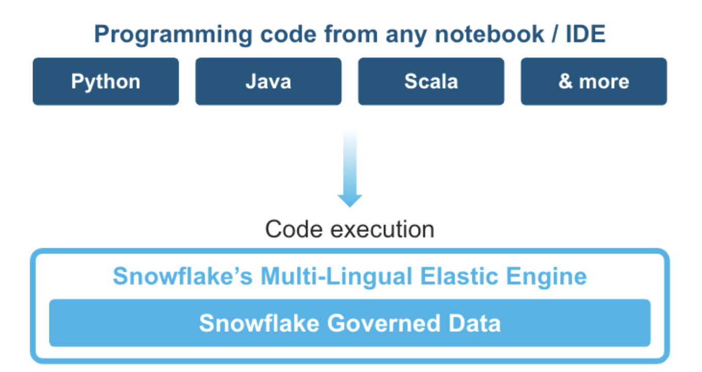
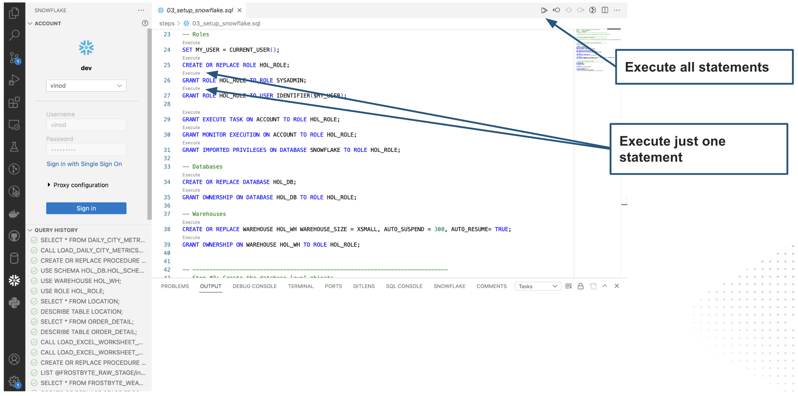
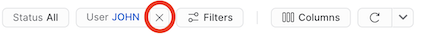

author: Vino Duraisamy
id: data-engineering-with-snowpark-python-intro
summary: This guide will provide step-by-step details for building data engineering pipelines with Snowpark Python
categories: Getting-Started, featured, data-engineering
environments: web
status: Published 
feedback link: https://github.com/Snowflake-Labs/sfguides/issues
tags: Getting Started, Data Engineering, Snowpark, Python, Intro

# Intro to Data Engineering with Snowpark Python
<!-- ------------------------ -->
## Overview

Duration: 15

This Quickstart will cover the basics of data engineering with Snowpark Python. By completing this guide, you will be able to build a data pipeline to process data from different sources, and periodically run the pipeline to update your data tables in Snowflake. 

Here is a summary of what you will be able to learn in each step by following this quickstart:

- **Setup Environment**: Use stages and tables to ingest and organize raw data from S3 into Snowflake
- **Snowflake Marketplace**: Download the data you need from Snowflake Marketplace and use it for your analysis
- **Data Engineering**: Leverage Snowpark for Python Dataframes to perform data transformations such as group by, aggregate, and join to prep for the data for downstream applications
- **Orchestrating Pipelines**: Use Snowflake Tasks API to turn your data pipeline code into operational pipelines with integrated monitoring

In case you are new to some of the technologies mentioned above, here is a quick summary with the links to documentation.

### What is Snowpark?

The set of libraries and runtimes in Snowflake that securely deploy and process non-SQL code, including Python, Java and Scala.

**Familiar Client Side Libraries** - Snowpark brings deeply integrated, DataFrame-style programming and OSS compatible APIs to the languages data practitioners like to use. It also includes the Snowpark ML API for more efficient ML modeling (public preview) and ML operations (private preview).

**Flexible Runtime Constructs** - Snowpark provides flexible runtime constructs that allow users to bring in and run custom logic. Developers can seamlessly build data pipelines, ML models, and data applications with User-Defined Functions and Stored Procedures.

Learn more about [Snowpark](https://www.snowflake.com/snowpark/).



### Working with Snowflake Marketplace

Snowflake Marketplace provides visibility to a wide variety of datasets from third-party data stewards which broaden access to data points used to transform business processes. Snowflake Marketplace also removes the need to integrate and model data by providing secure access to data sets fully maintained by the data provider.

### What you will learn

- How to ingest data from an external stage such as an S3 bucket into a Snowflake table
- How to access data from Snowflake marketplace and use it for your analysis
- How to analyze data and perform data engineering tasks using Snowpark dataframe API, Python Stored procedures and more
- How to use open-source Python libraries from curated Snowflake Anaconda channel
- How to create Snowflake Tasks and use the Python Tasks API to schedule data pipelines
- How to use VS Code extension for Snowflake to perform standard snowflake operations from VS Code and Snowsigt UI


### Prerequisites

- Familiarity with Python
- Familiarity with the DataFrame API
- Familiarity with Snowflake
- Familiarity with Git repositories and GitHub

### What You’ll Need 

You will need the following things before beginning:

- [Git](https://git-scm.com/book/en/v2/Getting-Started-Installing-Git) installed
- [Python 3.10](https://www.python.org/downloads/) installed
  - Note that you will be creating a Python environment with 3.10 in the **Get Started** step
- A Snowflake account with [Anaconda Packages enabled by ORGADMIN](https://docs.snowflake.com/en/developer-guide/udf/python/udf-python-packages.html#using-third-party-packages-from-anaconda). If you do not have a Snowflake account, you can register for a [free trial account](https://signup.snowflake.com/).
- A Snowflake account login with ACCOUNTADMIN role. If you have this role in your environment, you may choose to use it. If not, you will need to 1) Register for a free trial, 2) Use a different role that has the ability to create database, schema, tables, stages, tasks, user-defined functions, and stored procedures OR 3) Use an existing database and schema in which you are able to create the mentioned objects.

> aside positive
> IMPORTANT: Before proceeding, make sure you have a Snowflake account with Anaconda packages enabled by ORGADMIN as described [here](https://docs.snowflake.com/en/developer-guide/udf/python/udf-python-packages#getting-started).

<!-- ------------------------ -->
## Quickstart Setup

Duration: 10

### Fork the GitHub Repository

The very first step is to fork the GitHub repository [Intro to Data Engineering with Snowpark Python associated GitHub Repository](https://github.com/Snowflake-Labs/sfguide-data-engineering-with-snowpark-python-intro). This repository contains all the code you need to successfully complete this Quickstart guide.  Click on the "Fork" button near the top right. Complete any required fields and click "Create Fork".

### Create GitHub Codespace

For this Quickstart we will be using [GitHub Codespaces](https://docs.github.com/en/codespaces/overview) for our development environment. Codespaces offer a hosted development environment with a hosted, web-based VS Code environment. GitHub currently offers [60 hours for free each month](https://github.com/features/codespaces) when using a 2 node environment, which should be enough to work through this lab.

To create a GitHub Codespace, click on the green `<> Code` button from the GitHub repository homepage. In the Code popup, click on the `Codespaces` tab and then on the green `Create codespace on main`.


This will open a new tab and begin setting up your codespace. It will take a few minutes as it sets up the entire environment for this Quickstart. Here is what is being done for you:

- Creating a container for your environment
- Installing Anaconda (miniconda)
- SnowSQL setup
  - Installing SnowSQL
  - Creating a directory and default config file for SnowSQL
- Anaconda setup
  - Creating the Anaconda environment
  - Installing the Snowpark Python library
- VS Code setup
  - Installing VS Code
  - Installing the Snowflake VS Code extension
- Starting a hosted, web-based VS Code editor

Once the codepsace has been created and started you should see a hosted web-based version of VS Code with your forked repository set up! Just a couple more things and we're ready to start.

<!-- ------------------------ -->
## Setup Snowflake

Duration: 10

### Snowflake Extensions for VS Code

You can run SQL queries and Python APIs against Snowflake in many different ways through the Snowsight UI, SnowCLI, etc. But for this Quickstart we'll be using the Snowflake extension for VS Code. For a brief overview of Snowflake's native extension for VS Code, please check out our [VS Code Marketplace Snowflake extension page](https://marketplace.visualstudio.com/items?itemName=snowflake.snowflake-vsc).

### Installing Snowflake Extension for VS Code

Following the instructions mentioned in the [docs](https://docs.snowflake.com/en/user-guide/vscode-ext), you can install the Snowflake extension. Next, you need to connect to your Snowflake account from VS Code by logging in with your account details. Follow the instructions in the [docs](https://docs.snowflake.com/en/user-guide/vscode-ext#signing-in) to sign in.

### Create Roles, Databases, Tables, Schema and Stages

You can log into [Snowsight](https://docs.snowflake.com/en/user-guide/ui-snowsight.html#) or VS Code to create all the snowflake objects needed to work through this guide.

For the purpose of this quickstart, we will use VS Code to run the SQL commands and create the Snowflake objects. You can open the sql file `steps/03_setup_snowflake.sql` in VS Code. You can click on the `Execute` option above every SQL command to run each command separately or click on `Execute All` to run all the commands sequentially.

---



---

> aside positive
> IMPORTANT:
>
> - If you use different names for objects created in this section, be sure to update scripts and code in the following sections accordingly.
>
> - For each SQL script block below, select all the statements in the block and execute them top to bottom.

To put this in context, we are on step **#3** in our data flow overview:

Let's run through the commands individually and understand what each command does.

### Creating Account Level Objects

- In this step, we create the role `HOL_ROLE` and assign this role to `CURRENT_USER()` within Snowflake. This role will have access permissions to create all the Snowflake objects needed for the quickstart. First, grant the `HOL_ROLE` the same permissions as `SYSADMIN` role. Then, grant permissions to run tasks, monitor the execution of tasks and to import privileges on the database to `HOL_ROLE`. 

```sql
SET MY_USER = CURRENT_USER();
CREATE OR REPLACE ROLE HOL_ROLE;
GRANT ROLE HOL_ROLE TO ROLE SYSADMIN;
GRANT ROLE HOL_ROLE TO USER IDENTIFIER($MY_USER);

GRANT EXECUTE TASK ON ACCOUNT TO ROLE HOL_ROLE;
GRANT MONITOR EXECUTION ON ACCOUNT TO ROLE HOL_ROLE;
GRANT IMPORTED PRIVILEGES ON DATABASE SNOWFLAKE TO ROLE HOL_ROLE;
```

- Create a new database `HOL_DB` and assign ownership of the database to `HOL_ROLE`.

```sql
CREATE OR REPLACE DATABASE HOL_DB;
GRANT OWNERSHIP ON DATABASE HOL_DB TO ROLE HOL_ROLE;
```

- Create a new warehouse `HOL_WH` to serve the compute requirements for the quickstart. I have used a XSMALL warehouse, and configured it to auto suspend after 300 seconds (5 mins), and enabled auto resume on it. I have assigned ownership of the warehouse to the `HOL_ROLE` too.

```sql
CREATE OR REPLACE WAREHOUSE HOL_WH WAREHOUSE_SIZE = XSMALL, AUTO_SUSPEND = 300, AUTO_RESUME= TRUE;
GRANT OWNERSHIP ON WAREHOUSE HOL_WH TO ROLE HOL_ROLE;
```

### Creating Database Level Objects

- In this step, we will set the Snowflake scope to `HOL_ROLE`, `HOL_DB` and `HOL_WH` and create the schema and stage.

```sql
CREATE OR REPLACE SCHEMA HOL_SCHEMA;

USE SCHEMA HOL_SCHEMA;
CREATE OR REPLACE STAGE FROSTBYTE_RAW_STAGE
    URL = 's3://sfquickstarts/data-engineering-with-snowpark-python/'
;
```

> aside positive
> IMPORTANT:
>
> - If you use different names for objects created in this section, be sure to update scripts and code in the following sections accordingly.

<!-- ------------------------ -->
## Load Weather

Duration: 4

During this step we will be "loading" the raw weather data to Snowflake. But "loading" is the really the wrong word here. Because we're using Snowflake's unique data sharing capability we don't actually need to copy the data to our Snowflake account with a custom ETL process. Instead we can directly access the weather data shared by Weather Source in the Snowflake Data Marketplace. 

To put this in context, we are on step **#4** in our data flow overview:


### Snowflake Data Marketplace
Weather Source is a leading provider of global weather and climate data and their OnPoint Product Suite provides businesses with the necessary weather and climate data to quickly generate meaningful and actionable insights for a wide range of use cases across industries. Let's connect to the `Weather Source LLC: frostbyte` feed from Weather Source in the Snowflake Data Marketplace by following these steps:

* Login to Snowsight
* Click on the `Marketplace` link in the left navigation bar
* Enter "Weather Source LLC: frostbyte" in the search box and click return
* Click on the "Weather Source LLC: frostbyte" listing tile
* Click the blue "Get" button
    * Expand the "Options" dialog
    * Change the "Database name" to read "FROSTBYTE_WEATHERSOURCE" (all capital letters)
    * Select the "HOL_ROLE" role to have access to the new database
* Click on the blue "Get" button

That's it... we don't have to do anything from here to keep this data updated. The provider will do that for us and data sharing means we are always seeing whatever they have published. How amazing is that? Just think of all the things you didn't have do here to get access to an always up-to-date, third-party dataset!

### Run the Script
Open the `steps/03_load_weather.sql` script in VS Code from the file Explorer in the left navigation bar, and run the script. Notice how easy it is to query data shared through the Snowflake Marketplace! You access it just like any other table or view in Snowflake:

```sql
SELECT * FROM FROSTBYTE_WEATHERSOURCE.ONPOINT_ID.POSTAL_CODES LIMIT 100;
```

<!-- ------------------------ -->
## Load Excel Files
Duration: 10

During this step we will be loading the raw excel files containing location and order details from an external stage using Snowflake's dynamic file access feature. You can look at the data files from the [Git repo]] (https://github.com/Snowflake-Labs/sfguide-data-engineering-with-snowpark-python-intro/tree/main/data). We load the data to `LOCATION` and `ORDER_DETAIL` tables in Snowflake using the Python Stored procedure. 

To put this in context, we are on step **#5** in our data flow overview:


### Dynamic File Access

You can read a file from a stage using the `SnowflakeFile` class in the Snowpark `snowflake.snowpark.files` module. The `SnowflakeFile` class provides dynamic file access, which lets you stream files of any size.

In this quickstart, we will use dynamic file access to load the excel files from an s3 bucket (an external stage).

```python
from snowflake.snowpark.files import SnowflakeFile
from openpyxl import load_workbook 
  with SnowflakeFile.open(file_path, 'rb') as f:
     workbook = load_workbook(f)
     sheet = workbook.get_sheet_by_name(worksheet_name)
     data = sheet.values
```

### Creating the Stored Procedure

During this step we will be creating and deploying our first Snowpark Python stored procedure (or sproc) to Snowflake. This SPROC `LOAD_EXCEL_WORKSHEET_TO_TABLE_SP` will load the excel data files into snowflake tables for further analysis.

Here is the SQL query to create the SPROC:

```sql
CREATE OR REPLACE PROCEDURE LOAD_EXCEL_WORKSHEET_TO_TABLE_SP(file_path string, worksheet_name string, target_table string)
RETURNS VARIANT
LANGUAGE PYTHON
RUNTIME_VERSION = '3.10'
PACKAGES = ('snowflake-snowpark-python', 'pandas', 'openpyxl')
HANDLER = 'main'
AS
$$
from snowflake.snowpark.files import SnowflakeFile
from openpyxl import load_workbook
import pandas as pd
 
def main(session, file_path, worksheet_name, target_table):
 with SnowflakeFile.open(file_path, 'rb') as f:
     workbook = load_workbook(f)
     sheet = workbook.get_sheet_by_name(worksheet_name)
     data = sheet.values
 
     # Get the first line in file as a header line
     columns = next(data)[0:]
     # Create a DataFrame based on the second and subsequent lines of data
     df = pd.DataFrame(data, columns=columns)
 
     df2 = session.create_dataframe(df)
     df2.write.mode("overwrite").save_as_table(target_table)
 
 return True
$$;
```
### Running the Sproc in Snowflake
In order to run the sproc in Snowflake you have a few options. Any sproc in Snowflake can be invoked through SQL as follows:

```sql
CALL LOAD_EXCEL_WORKSHEET_TO_TABLE_SP();
```

You can also simply run the entire script from Snowsight UI or VS Code. Execute the `steps/05_load_excel_files.sql` script by selecting Run all from VS Code.

<!-- ------------------------ -->

## Daily City Metrics Update Sproc
Duration: 10

During this step we will be creating and deploying our second Snowpark Python sproc to Snowflake. This sproc will join the `ORDER_DETAIL` table with the `LOCATION` table and `HISTORY_DAY` table to create a final, aggregated table for analysis named `DAILY_CITY_METRICS`.

To put this in context, we are on step **#6** in our data flow overview:


Here is the SQL query to create the SPROC:

```sql
CREATE OR REPLACE PROCEDURE LOAD_DAILY_CITY_METRICS_SP()
RETURNS VARIANT
LANGUAGE PYTHON
RUNTIME_VERSION = '3.10'
PACKAGES = ('snowflake-snowpark-python')
HANDLER = 'main'
AS
$$
from snowflake.snowpark import Session
import snowflake.snowpark.functions as F

def table_exists(session, schema='', name=''):
    exists = session.sql("SELECT EXISTS (SELECT * FROM INFORMATION_SCHEMA.TABLES WHERE TABLE_SCHEMA = '{}' AND TABLE_NAME = '{}') AS TABLE_EXISTS".format(schema, name)).collect()[0]['TABLE_EXISTS']
    return exists

def main(session: Session) -> str:
    schema_name = "HOL_SCHEMA"
    table_name = "DAILY_CITY_METRICS"

    # Define the tables
    order_detail = session.table("ORDER_DETAIL")
    history_day = session.table("FROSTBYTE_WEATHERSOURCE.ONPOINT_ID.HISTORY_DAY")
    location = session.table("LOCATION")

    # Join the tables
    order_detail = order_detail.join(location, order_detail['LOCATION_ID'] == location['LOCATION_ID'])
    order_detail = order_detail.join(history_day, (F.builtin("DATE")(order_detail['ORDER_TS']) == history_day['DATE_VALID_STD']) & (location['ISO_COUNTRY_CODE'] == history_day['COUNTRY']) & (location['CITY'] == history_day['CITY_NAME']))

    # Aggregate the data
    final_agg = order_detail.group_by(F.col('DATE_VALID_STD'), F.col('CITY_NAME'), F.col('ISO_COUNTRY_CODE')) \
                        .agg( \
                            F.sum('PRICE').alias('DAILY_SALES_SUM'), \
                            F.avg('AVG_TEMPERATURE_AIR_2M_F').alias("AVG_TEMPERATURE_F"), \
                            F.avg("TOT_PRECIPITATION_IN").alias("AVG_PRECIPITATION_IN"), \
                        ) \
                        .select(F.col("DATE_VALID_STD").alias("DATE"), F.col("CITY_NAME"), F.col("ISO_COUNTRY_CODE").alias("COUNTRY_DESC"), \
                            F.builtin("ZEROIFNULL")(F.col("DAILY_SALES_SUM")).alias("DAILY_SALES"), \
                            F.round(F.col("AVG_TEMPERATURE_F"), 2).alias("AVG_TEMPERATURE_FAHRENHEIT"), \
                            F.round(F.col("AVG_PRECIPITATION_IN"), 2).alias("AVG_PRECIPITATION_INCHES"), \
                        )

    # If the table doesn't exist then create it
    if not table_exists(session, schema=schema_name, name=table_name):
        final_agg.write.mode("overwrite").save_as_table(table_name)

        return f"Successfully created {table_name}"
    # Otherwise update it
    else:
        cols_to_update = {c: final_agg[c] for c in final_agg.schema.names}

        dcm = session.table(f"{schema_name}.{table_name}")
        dcm.merge(final_agg, (dcm['DATE'] == final_agg['DATE']) & (dcm['CITY_NAME'] == final_agg['CITY_NAME']) & (dcm['COUNTRY_DESC'] == final_agg['COUNTRY_DESC']), \
                            [F.when_matched().update(cols_to_update), F.when_not_matched().insert(cols_to_update)])

        return f"Successfully updated {table_name}"
$$;
```
### Running the Sproc in Snowflake
In order to run the sproc in Snowflake you have a few options. Any sproc in Snowflake can be invoked through SQL as follows:

```sql
CALL LOAD_DAILY_CITY_METRICS_SP();
```

You can also simply run the entire script from Snowsight UI or VS Code. Execute the `steps/06_load_daily_city_metrics.sql` script by selecting Run all from VS Code.


### Viewing What Happened in Snowflake
The [Query History](https://docs.snowflake.com/en/user-guide/ui-snowsight-activity.html#query-history) in Snowflake is a very power feature, that logs every query run against your Snowflake account, no matter which tool or process initiated it. And this is especially helpful when working with client tools and APIs.

The stored procedure we invoked in the previous step `LOAD_DAILY_CITY_METRICS_SP` would be logged in the Query History tab in the Snowsight UI. 

### More on the Snowpark API
In this step we're starting to really use the Snowpark DataFrame API for data transformations. The Snowpark API provides the same functionality as the [Spark SQL API](https://spark.apache.org/docs/latest/api/python/reference/pyspark.sql/index.html). To begin with you need to create a Snowpark session object. Like PySpark, this is accomplished with the `Session.builder.configs().create()` methods.

 When building a Snowpark Python sproc the contract is that the first argument to the entry point (or handler) function is a Snowpark session.

The first thing you'll notice in the `steps/06_load_daily_city_metrics.sql` script is that we have some functions which use SQL to create objects in Snowflake and to check object status. To issue a SQL statement to Snowflake with the Snowpark API you use the `session.sql()` function, like you'd expect. Here's one example:

```python
def table_exists(session, schema='', name=''):
    exists = session.sql("SELECT EXISTS (SELECT * FROM INFORMATION_SCHEMA.TABLES WHERE TABLE_SCHEMA = '{}' AND TABLE_NAME = '{}') AS TABLE_EXISTS".format(schema, name)).collect()[0]['TABLE_EXISTS']
    return exists
```

The second thing to point out is how we're using DataFrames to join the data from different data sources into an `ORDER_DETAIL` df using functions such as `join()`. 

```python
order_detail = order_detail.join(location, order_detail['LOCATION_ID'] == location['LOCATION_ID'])
    order_detail = order_detail.join(history_day, (F.builtin("DATE")(order_detail['ORDER_TS']) == history_day['DATE_VALID_STD']) & (location['ISO_COUNTRY_CODE'] == history_day['COUNTRY']) & (location['CITY'] == history_day['CITY_NAME']))
```

The last thing to point out is how we are using the Python Dataframe APIs to aggregate dataframes into a final aggregate df using functions such as `agg(), group_by(), select()`. 

```python
final_agg = order_detail.group_by(F.col('DATE_VALID_STD'), F.col('CITY_NAME'), F.col('ISO_COUNTRY_CODE')) \
                        .agg( \
                            F.sum('PRICE').alias('DAILY_SALES_SUM'), \
                            F.avg('AVG_TEMPERATURE_AIR_2M_F').alias("AVG_TEMPERATURE_F"), \
                            F.avg("TOT_PRECIPITATION_IN").alias("AVG_PRECIPITATION_IN"), \
                        ) \
                        .select(F.col("DATE_VALID_STD").alias("DATE"), F.col("CITY_NAME"), F.col("ISO_COUNTRY_CODE").alias("COUNTRY_DESC"), \
                            F.builtin("ZEROIFNULL")(F.col("DAILY_SALES_SUM")).alias("DAILY_SALES"), \
                            F.round(F.col("AVG_TEMPERATURE_F"), 2).alias("AVG_TEMPERATURE_FAHRENHEIT"), \
                            F.round(F.col("AVG_PRECIPITATION_IN"), 2).alias("AVG_PRECIPITATION_INCHES"), \
                        )
```

Again, for more details about the Snowpark Python DataFrame API, please check out our [Working with DataFrames in Snowpark Python](https://docs.snowflake.com/en/developer-guide/snowpark/python/working-with-dataframes.html) page.

<!-- ------------------------ -->

## Orchestrate Jobs
Duration: 10

During this step we will be orchestrating our new Snowpark pipelines with Snowflake's native orchestration feature named Tasks. We will create two tasks, one for each stored procedure, and chain them together. We will then run the tasks. 

To put this in context, we are on step **#7** in our data flow overview:


### Run the Task
To orchestrate the stored procedures we created and run them periodically, we can use Snowflake Tasks. There are two ways to create tasks in Snowflake. SQL commands, and Python APIs. 

In this quickstart, we will use Python APIs to create and run Tasks. 

### Creating DAGs
In this step, let us create a dag and configure the schedule and transformations we want to run as part of the dag. 

Here is an example of how it looks like:
```python

dag_name = "HOL_DAG"
    dag = DAG(dag_name, schedule=timedelta(days=1), warehouse=warehouse_name)
    with dag:
        dag_task1 = DAGTask("LOAD_ORDER_DETAIL_TASK", definition="CALL LOAD_EXCEL_WORKSHEET_TO_TABLE_SP(BUILD_SCOPED_FILE_URL(@FROSTBYTE_RAW_STAGE, 'intro/order_detail.xlsx'), 'order_detail', 'ORDER_DETAIL')", warehouse=warehouse_name)
        dag_task2 = DAGTask("LOAD_LOCATION_TASK", definition="CALL LOAD_EXCEL_WORKSHEET_TO_TABLE_SP(BUILD_SCOPED_FILE_URL(@FROSTBYTE_RAW_STAGE, 'intro/location.xlsx'), 'location', 'LOCATION')", warehouse=warehouse_name)
        dag_task3 = DAGTask("LOAD_DAILY_CITY_METRICS_TASK", definition="CALL LOAD_DAILY_CITY_METRICS_SP()", warehouse=warehouse_name)

```
The above dag runs daily on the specified warehouse and it consists of 3 different tasks. 

Here is how we define the order of execution of the tasks:
```python
        dag_task3 >> dag_task1
        dag_task3 >> dag_task2
```
### Running DAGs

So far, we have only created the dag and defined the order of execution of tasks within the dag. To start running the dags, we have to `deploy()` and `run()` them as shown here:

```python
    dag_op.deploy(dag, mode="orreplace")
    dag_op.run(dag)
```
### More on Tasks
Tasks are Snowflake's native scheduling/orchestration feature. 
A few things to note in the dag creation step above. First we specify the schedule and warehouse on which the tasks will be run. Then we specify the order of tasks in the dag using the `>>` operator similar to other orchestration tools like Apache Airflow.  

And for more details on Tasks see [Introduction to Tasks](https://docs.snowflake.com/en/user-guide/tasks-intro.html).

### Task Metadata
Snowflake keeps metadata for almost everything you do, and makes that metadata available for you to query (and to create any type of process around). Tasks are no different, Snowflake maintains rich metadata to help you monitor your task runs. Here are a few sample SQL queries you can use to monitor your tasks runs:

```sql
-- Get a list of tasks
SHOW TASKS;

-- Task execution history in the past day
SELECT *
FROM TABLE(INFORMATION_SCHEMA.TASK_HISTORY(
    SCHEDULED_TIME_RANGE_START=>DATEADD('DAY',-1,CURRENT_TIMESTAMP()),
    RESULT_LIMIT => 100))
ORDER BY SCHEDULED_TIME DESC
;

-- Scheduled task runs
SELECT
    TIMESTAMPDIFF(SECOND, CURRENT_TIMESTAMP, SCHEDULED_TIME) NEXT_RUN,
    SCHEDULED_TIME,
    NAME,
    STATE
FROM TABLE(INFORMATION_SCHEMA.TASK_HISTORY())
WHERE STATE = 'SCHEDULED'
ORDER BY COMPLETED_TIME DESC;
```

### Monitoring Tasks
So while you're free to create any operational or monitoring process you wish, Snowflake provides some rich task observability features in our Snowsight UI. Try it out for yourself by following these steps:

* In the Snowsight navigation menu, click **Data** » **Databases**.
* In the right pane, using the object explorer, navigate to a database and schema.
* For the selected schema, select and expand **Tasks**.
* Select a task. Task information is displayed, including **Task Details**, **Graph**, and **Run History** sub-tabs.
* Select the **Graph** tab. The task graph appears, displaying a hierarchy of child tasks.
* Select a task to view its details.

For more details, and to learn about viewing account level task history, please check out our [Viewing Task History](https://docs.snowflake.com/en/user-guide/ui-snowsight-tasks.html) documentation.

### Query History for Tasks
One important thing to understand about tasks, is that the queries which get executed by the task won't show up with the default Query History UI settings. In order to see the queries that just ran you need to do the following:

* Remove filters at the top of this table, including your username, as later scheduled tasks will run as "System":



* Click "Filter", and add filter option 'Queries executed by user tasks' and click "Apply Filters":


You should now see all the queries run by your tasks! Take a look at each of the MERGE commands in the Query History to see how many records were processed by each task. And don't forget to notice that we processed the whole pipeline just now, and did so incrementally!

<!-- ------------------------ -->
## Teardown
Duration: 2

Once you're finished with the Quickstart and want to clean things up, you can simply run the `steps/09_teardown.sql` script. Since this is a SQL script we will be using our native VS Code extension to execute it. So simply open the `steps/09_teardown.sql` script in VS Code and run the whole thing using the "Execute All Statements" button in the upper right corner of the editor window.

<!-- ------------------------ -->

## Conclusion
Duration: 4

In this Quickstart covered the basics of data engineering with Snowpark Python. We created the pipeline to load the data from different data sources (external stage and Snowflake Marketplace). We then used Snowpark Python dataframe APIs and Stored procedures for the ETL process, and orchestrated the tasks by creating dags using Tasks Python API. 

Here is the overview of what we built:


Hopefully you now have the building blocks, and examples, you need to get started building your own data engineering pipeline with Snowpark Python. So, what will you build now?

### What we've covered 
We've covered a ton in this Quickstart, and here are the highlights:

* Loading data from an external stage
* Data Sharing/marketplace
* Snowpark Python Dataframe APIs
* Python Task APIs
* Stored Procedures
* Visual Studio Code Snowflake Native Extension

### Related Resources
And finally, here's a quick recap of related resources:

* [Source Code on GitHub](https://github.com/Snowflake-Labs/sfguide-data-engineering-with-snowpark-python-intro)
* [Snowpark Developer Guide for Python](https://docs.snowflake.com/en/developer-guide/snowpark/python/index.html)
    * [Writing Stored Procedures in Snowpark (Python)](https://docs.snowflake.com/en/sql-reference/stored-procedures-python.html)
    * [Working with DataFrames in Snowpark Python](https://docs.snowflake.com/en/developer-guide/snowpark/python/working-with-dataframes.html)
* Related Tools
    * [Snowflake Visual Studio Code Extension](https://marketplace.visualstudio.com/items?itemName=snowflake.snowflake-vsc)

