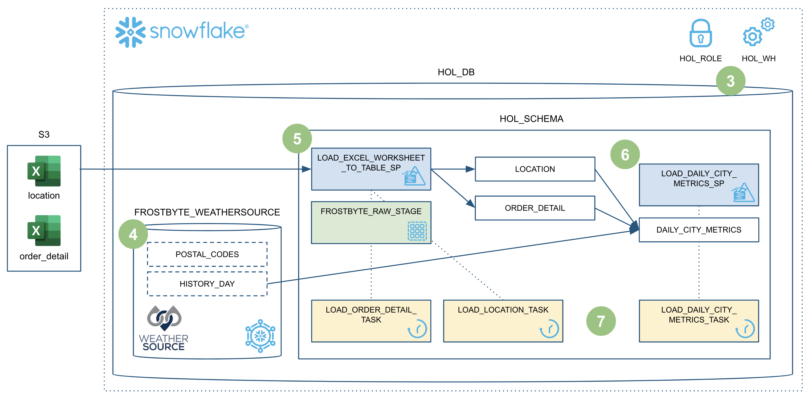
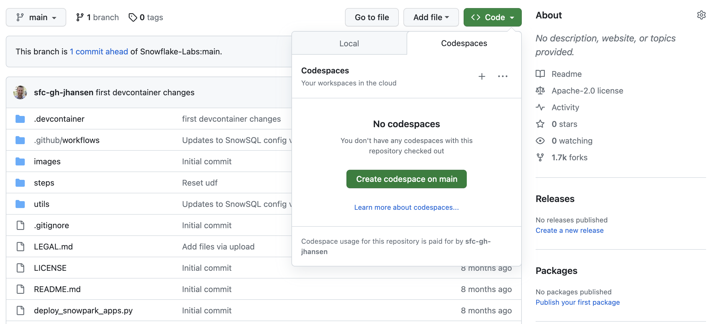

author: Vino Duraisamy
id: data-engineering-with-snowpark-python-intro
summary: This guide will provide step-by-step details for building data engineering pipelines with Snowpark Python
categories: Getting-Started, featured, data-engineering
environments: web
status: Published 
feedback link: https://github.com/Snowflake-Labs/sfguides/issues
tags: Getting Started, Data Engineering, Snowpark, Python, Intro

# Intro to Data Engineering with Snowpark Python
<!-- ------------------------ -->
## Overview 
Duration: 15

Are you interested in unleashing the power of Snowpark Python to build data engineering pipelines? Well then, this Quickstart is for you! The focus here will be on building data engineering pipelines with Python, and not on data science. For examples of doing data science with Snowpark Python please check out our [Machine Learning with Snowpark Python: - Credit Card Approval Prediction](https://quickstarts.snowflake.com/guide/getting_started_snowpark_machine_learning/index.html?index=..%2F..index#0) Quickstart.

This Quickstart will cover the basics of data engineering with Snowpark Python. The pipeline will load the data from different data sources (your local machine and Snowflake Marketplace). It uses Snowpark Python dataframe APIs and Stored procedures for ETL, and Tasks Python API for orchestration.  Here is the overview of what we will build:



Let's dive right in!

### Prerequisites
* Familiarity with Python
* Familiarity with the DataFrame API
* Familiarity with Snowflake
* Familiarity with Git repositories and GitHub

### What You’ll Learn 
You will learn about the following Snowflake features during this Quickstart:

* Loading data from local
* Data Sharing/marketplace
* Snowpark Python Dataframe APIs
* Snowpark Python Task APIs
* Python Stored Procedures
* Visual Studio Code Snowflake Native Extension

### What You’ll Need 
You will need the following things before beginning:

* Snowflake account
    * **A Snowflake Account**
    * **A Snowflake user created with ACCOUNTADMIN permissions**. This user will be used to get things setup in Snowflake.
    * **Anaconda Terms & Conditions accepted**. See Getting Started section in [Third-Party Packages](https://docs.snowflake.com/en/developer-guide/udf/python/udf-python-packages.html#getting-started).
* GitHub account
    * **A GitHub account**. If you don't already have a GitHub account you can create one for free. Visit the [Join GitHub](https://github.com/signup) page to get started.

### What You’ll Build 
During this Quickstart you will accomplish the following things:

* Load Excel files from your local machine using Python Stored Procedures
* Setup access to Snowflake Marketplace data
* Create a data pipeline using Python stored procedures to calculate daily city metrics
* Orchestrate the pipeline with Tasks API
* Monitor the pipelines with Snowsight


<!-- ------------------------ -->
## Quickstart Setup
Duration: 10

### Fork the Quickstart Repository and Enable GitHub Actions
You'll need to create a fork of the repository for this Quickstart in your GitHub account. Visit the [Intro to Data Engineering with Snowpark Python associated GitHub Repository](https://github.com/Snowflake-Labs/sfguide-data-engineering-with-snowpark-python-intro) and click on the "Fork" button near the top right. Complete any required fields and click "Create Fork".

### Create GitHub Codespace
For this Quickstart we will be using [GitHub Codespaces](https://docs.github.com/en/codespaces/overview) for our development environment. Codespaces offer a hosted development environment with a hosted, web-based VS Code environment. GitHub currently offers [60 hours for free each month](https://github.com/features/codespaces) when using a 2 node environment, which should be more than enough for this lab.

To create a GitHub Codespace, click on the green `<> Code` button from the GitHub repository homepage. In the Code popup, click on the `Codespaces` tab and then on the green `Create codespace on main`.



This will open a new tab and begin setting up your codespace. This will take a few minutes as it sets up the entire environment for this Quickstart. Here is what is being done for you:

* Creating a container for your environment
* Installing Anaconda (miniconda)
* SnowSQL setup
    * Installing SnowSQL
    * Creating a directory and default config file for SnowSQL
* Anaconda setup
    * Creating the Anaconda environment
    * Installing the Snowpark Python library
* VS Code setup
    * Installing VS Code
    * Configuring VS Code for the Python Anaconda environment
    * Installing the Snowflake VS Code extension
* Starting a hosted, web-based VS Code editor

Once the codepsace has been created and started you should see a hosted web-based version of VS Code with your forked repository set up! Just a couple more things and we're ready to start.

### Configure Snowflake Credentials
We will not be directly using [the SnowSQL command line client](https://docs.snowflake.com/en/user-guide/snowsql.html) for this Quickstart, but we will be storing our Snowflake connection details in the SnowSQL config file located at `~/.snowsql/config`. A default config file was created for you during the codespace setup.

The easiest way to edit the default `~/.snowsql/config` file is directly from VS Code in your codespace. Type `Command-P`, type (or paste) `~/.snowsql/config` and hit return. The SnowSQL config file should now be open. You just need to edit the file and replace the `accountname`, `username`, and `password` with your values. Then save and close the file.

### Verify Your Anaconda Environment is Activated
During the codespace setup we created an Anaconda environment named `snowflake-demo`. And when VS Code started up it should have automatically activated the environment in your terminal. You should see something like this in the terminal, and in particular you should see `(snowflake-demo)` before your bash prompt.


If for some reason it wasn't activiated simply run `conda activate snowflake-demo` in your terminal.


It is important to set the correct metadata for your Snowflake Guide. The metadata contains all the information required for listing and publishing your guide and includes the following:


<!-- ------------------------ -->
## Setup Snowflake
Duration: 10

### Snowflake Extensions for VS Code
You can run SQL queries against Snowflake in many different ways (through the Snowsight UI, SnowSQL, etc.) but for this Quickstart we'll be using the Snowflake extension for VS Code. For a brief overview of Snowflake's native extension for VS Code, please check out our [VS Code Marketplace Snowflake extension page](https://marketplace.visualstudio.com/items?itemName=snowflake.snowflake-vsc).

### Run the Script
To set up all the objects we'll need in Snowflake for this Quickstart you'll need to run the `steps/01_setup_snowflake.sql` script.

Start by clicking on the Snowflake extension in the left navigation bar in VS Code. Then login to your Snowflake account with a user that has ACCOUNTADMIN permissions. Once logged in to Snowflake, open the `steps/03_setup_snowflake.sql` script in VS Code by going back to the file Explorer in the left navigation bar.

To run all the queries in this script, use the "Execute All Statements" button in the upper right corner of the editor window. Or, if you want to run them in chunks, you can highlight the ones you want to run and press CMD/CTRL+Enter. 


<!-- ------------------------ -->


A single sfguide consists of multiple steps. These steps are defined in Markdown using Header 2 tag `##`. 

```markdown
## Step 1 Title
Duration: 3

All the content for the step goes here.

## Step 2 Title
Duration: 1

All the content for the step goes here.
```

To indicate how long each step will take, set the `Duration` under the step title (i.e. `##`) to an integer. The integers refer to minutes. If you set `Duration: 4` then a particular step will take 4 minutes to complete. 

The total sfguide completion time is calculated automatically for you and will be displayed on the landing page. 

<!-- ------------------------ -->
## Code Snippets, Info Boxes, and Tables
Duration: 2

Look at the [markdown source for this sfguide](https://raw.githubusercontent.com/Snowflake-Labs/sfguides/master/site/sfguides/sample.md) to see how to use markdown to generate code snippets, info boxes, and download buttons. 

### JavaScript
```javascript
{ 
  key1: "string", 
  key2: integer,
  key3: "string"
}
```

### Java
```java
for (statement 1; statement 2; statement 3) {
  // code block to be executed
}
```

### Info Boxes
> aside positive
> 
>  This will appear in a positive info box.


> aside negative
> 
>  This will appear in a negative info box.

### Buttons
<button>

  [This is a download button](link.com)
</button>

### Tables
<table>
    <thead>
        <tr>
            <th colspan="2"> **The table header** </th>
        </tr>
    </thead>
    <tbody>
        <tr>
            <td>The table body</td>
            <td>with two columns</td>
        </tr>
    </tbody>
</table>

### Hyperlinking
[Youtube - Halsey Playlists](https://www.youtube.com/user/iamhalsey/playlists)

<!-- ------------------------ -->
## Images, Videos, and Surveys, and iFrames
Duration: 2

Look at the [markdown source for this guide](https://raw.githubusercontent.com/Snowflake-Labs/sfguides/master/site/sfguides/sample.md) to see how to use markdown to generate these elements. 

### Images


### Videos
Videos from youtube can be directly embedded:
<video id="KmeiFXrZucE"></video>

### Inline Surveys
<form>
  <name>How do you rate yourself as a user of Snowflake?</name>
  <input type="radio" value="Beginner">
  <input type="radio" value="Intermediate">
  <input type="radio" value="Advanced">
</form>

### Embed an iframe


<!-- ------------------------ -->
## Conclusion
Duration: 1

At the end of your Snowflake Guide, always have a clear call to action (CTA). This CTA could be a link to the docs pages, links to videos on youtube, a GitHub repo link, etc. 

If you want to learn more about Snowflake Guide formatting, checkout the official documentation here: [Formatting Guide](https://github.com/googlecodelabs/tools/blob/master/FORMAT-GUIDE.md)

### What we've covered
- creating steps and setting duration
- adding code snippets
- embedding images, videos, and surveys
- importing other markdown files