author: Andries Engelbrecht, James Sun
id: data-lake-using-apache-iceberg-with-snowflake-and-aws-glue
categories: snowflake-site:taxonomy/solution-center/certification/quickstart, snowflake-site:taxonomy/product/data-engineering, snowflake-site:taxonomy/snowflake-feature/apache-iceberg
language: en
summary: Build open table format data lakes with Apache Iceberg using Snowflake Catalog-Linked Datbases, Vended Credentials, AWS S3, Lake Formation and Glue Data Catalog.
environments: web
status: Published 
feedback link: https://github.com/Snowflake-Labs/sfguides/issues


# Build Data Lakes using Apache Iceberg with Snowflake and AWS Glue
<!-- ------------------------ -->
## Overview 

[Apache Iceberg](https://iceberg.apache.org/) is an open table format for huge analytical datasets that enables high performance analytics on open data formats with ACID compliance. Snowflake and AWS both support Iceberg format that enables customers to drastically improve data interoperability, speed of implementation and performance for integrated data lakes.

This guide will take you through the steps of converting existing parquet data to Iceberg and using it to build open analytic environments using Snowflake and [AWS Glue](https://aws.amazon.com/glue/) with [AWS Lake Formation](https://aws.amazon.com/lake-formation/) providing fine-grained access controls and [temporary access token](https://docs.aws.amazon.com/lake-formation/latest/dg/aws-lake-formation-api-credential-vending.html) to Iceberg tables.


For this guide we will use a Financial Services use case where Insurance data is analyzed. The Quotes data is collected from systems and stored as parquet on S3, while Customer and Policy data is already available as internal Snowflake tables. We will try to identify customers who are likely to churn or potential fraud with a high number of recent quote requests. 

### Prerequisites
- Familiarity with Snowflake, basic SQL, Snowsight UI and Snowflake Objects
- Familiarity with AWS Services (S3, Glue, CloudFormation, IAM) and the Management Console


### What You’ll Learn 
- How to create an Iceberg table in the [Glue Data Catalog](https://docs.aws.amazon.com/prescriptive-guidance/latest/serverless-etl-aws-glue/aws-glue-data-catalog.html) and convert parquet data on S3 in place (no rewrite) to Iceberg format
- How to configure Lake Formation for fine-grained access control on Iceberg tables
- How to configure a [Snowflake Catalog-linked database](https://docs.snowflake.com/en/user-guide/tables-iceberg-catalog-linked-database) with the Glue Data Catalog via [Iceberg Rest Catalog APIs](https://docs.aws.amazon.com/lake-formation/latest/dg/aws-lake-formation-api-credential-vending.html)
- How to read iceberg tables, create iceberg tables and write to iceberg tables using Snowflake Catalog-Linked Database with the Glue Catalog

### What You’ll Need 
- A [Snowflake Enterprise Account](https://signup.snowflake.com/?utm_source=snowflake-devrel&utm_medium=developer-guides&utm_cta=build_datalake_with_glue_and_iceberg) with `ACCOUNTADMIN` access in US WEST (OREGON REGION)
- An [AWS Account](https://aws.amazon.com/free/) with `Administrator Access`

### What You’ll Build 
- A Glue Catalog Database with Iceberg tables on S3
- Configure Lake Formation to provide Vended Credentials
- Integrations between Snowflake and AWS Glue Catalog using IRC and Vended Credentials for storage access
- Snowflake Catalog-linked Database with the Glue Catalog to read and write Iceberg tables

<!-- ------------------------ -->
## Configure the AWS Account

In this step we will use CloudFormation to configure objects in the AWS account needed for the quickstart, we will also cover basics of the AWS console and how to leverage browser tabs to multi task with various AWS services.

- Start by logging into your AWS Console.

- Once logged in to the AWS Console look for the AWS Region in the top right hand corner and select the **US West (Oregon) us-west-2** region. 


We will now run a CloudFormation Template to configure a S3 bucket and Role with specific Policies in the AWS account.

- In the top left menu bar enter **Cloudformation** in the Search bar, then select the CloudFormation service from the dropdown list.


- Once in the CloudFormation screen **verify** the AWS Region that it is the **US West (Oregon) us-west-2** region.


- It is recommended to duplicate the browser tab 3 times to make it simple to use multiple AWS services in the same browser session.

- You can now deploy a CloudFormation Stack by clicking [here](https://console.aws.amazon.com/cloudformation/home#/stacks/new?stackName=Glue-IRC-Int&templateURL=https://snowflake-corp-se-workshop.s3.us-west-1.amazonaws.com/VHOL_Iceberg_SNOW_AWS/setup/glue-snflk-devday-v1.5.yaml). This creates a S3 bucket and a role with necessary policies attached that Glue can assume to perform tasks.


- Click **Next**

- On the next screen **Specify stack details** enter a name for the stack in **Stack name**, leave the default stack name `Glue-IRC-Int` then click **Next**

- The following screen **Configure stack options** scroll down to the bottom and **select the check box** next to `I acknowledge that AWS CloudFormation might create IAM resources.` and then click **Next**

- On the last screen **Review and create** simply click **Submit** to create the stack.

It will take a few seconds to create the resources in your AWS account. In the Events screen you can click the refresh button to see updates.

- Once complete click on the **Outputs** Tab in the center top. This will display the Role name and S3 bucket name that was created. These will be used later to configure the integrations with Snowflake.


<!-- ------------------------ -->
## Use AWS Glue to create the Iceberg table

In this step we will use AWS Glue to create an iceberg table and convert parquet data to iceberg format. Glue Studio will be used.

- In one of the browser tabs with the AWS console type **S3** in the search bar and select **S3**. This will allow you to quickly see what data and folders are created in S3. **Verify** the AWS Region in the S3 screen.

### Create Glue Database

- In the next browser tab type **Glue** and then select **AWS Glue**.

- Once in the AWS Glue screen **verify** the AWS Region that it is the **US West (Oregon) us-west-2** region.


- In the left navigation pane, under **Data Catalog**, click **Databases** .
- Click **Add database** in the window on the right hand side pane.

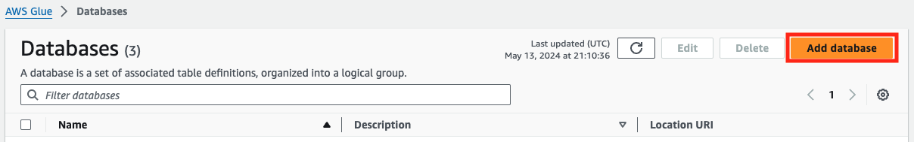

- On Create a database tab, provide a name for the new database as `iceberg`, add Description(optional) as `Database to store
iceberg table` and click **Create database**.

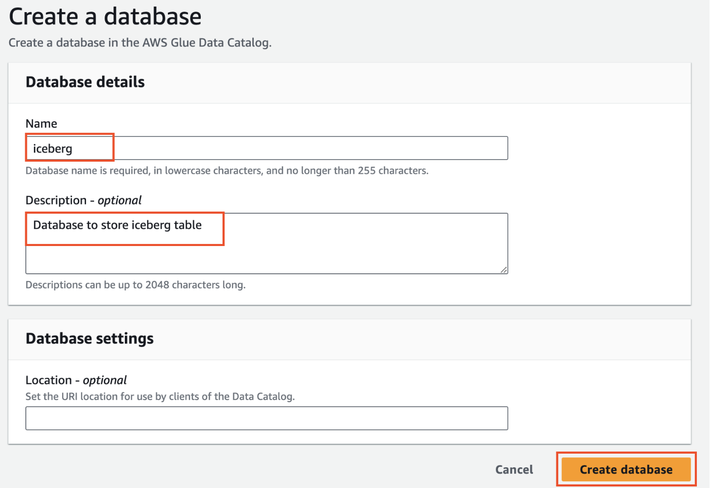

### Create Glue Table

- On the left hand menu in the Glue console click on **Data Catalog > Databases > Tables**
- Then click on **Add table**

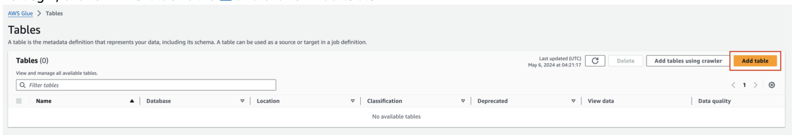

- Set table properties as follows and click **Next**
- - Name: **quotes**
- - Database: **iceberg**
- - Table format: **Apache Iceberg table**
- - Select IAM role: This is the role from the Output in the Cloudformation Template **Glue-IRC-Int-GlueSnowflakeLabRole-xxxx**
- - Acknowledge the Caution by clicking the checkbox
- - Data location : **s3://glue-snowflake-lab-xxxx/iceberg/quotes/** .The bucket has been pre-provisioned for you. Replace the
**glue-snowflake-lab-xxxx** with the one corresponding to your account and append **/iceberg/quotes/**

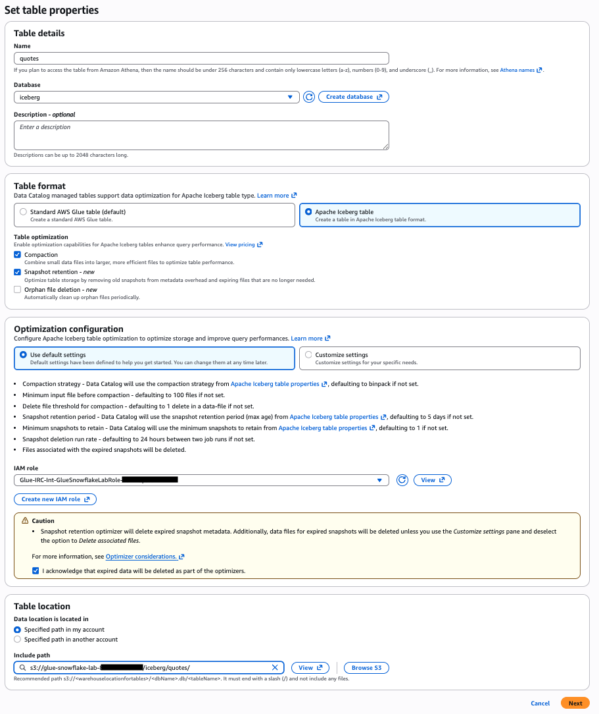

- Click **Next**

- Choose or define schema by selecting **Edit schema as JSON**

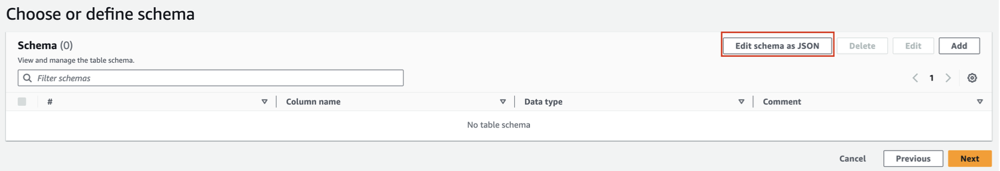

- **Download** 
[quotes_schema.json](https://snowflake-corp-se-workshop.s3.us-west-1.amazonaws.com/VHOL_Iceberg_SNOW_AWS/setup/quotes_schema.json) . 
**Remove** the '[ ]' on the screen, **paste** the contents of the **quotes_schema.json** file there,
and **Click Save**.

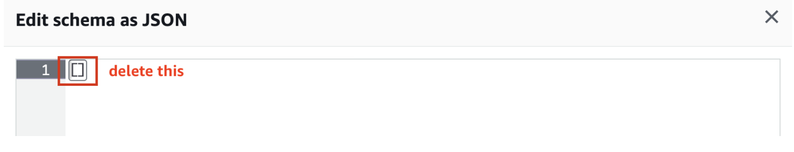

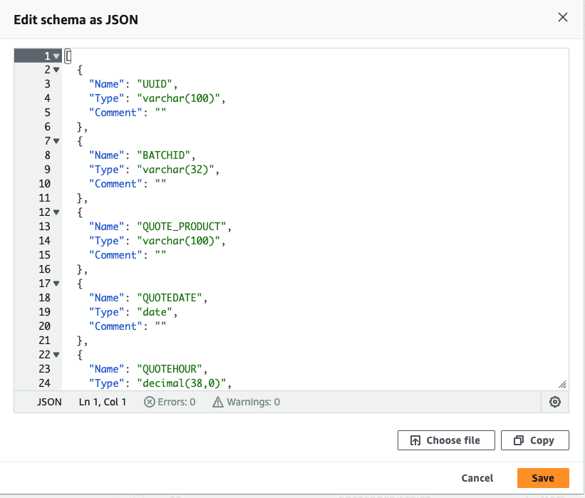

- After adding the schema, it will look like the screenshot below. Click **Next**.

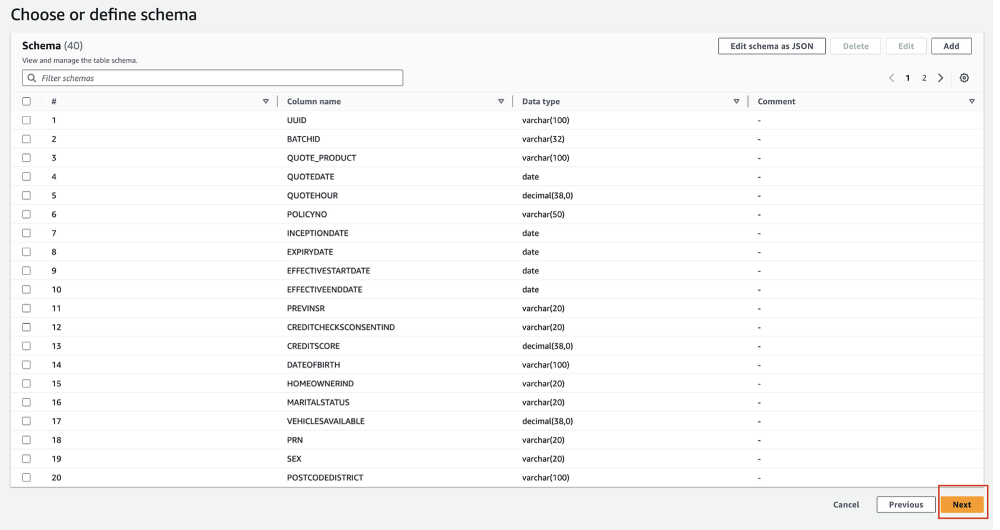

- Review and Create the table by clicking on **Create** on Step 3.

### Create Glue ETL Job

In this section, we will show you how to create an ETL job in Glue Studio visual interface.

- To begin, click on **Visual ETL** link on the left menu pane under ETL jobs and click on the Visual ETL button.

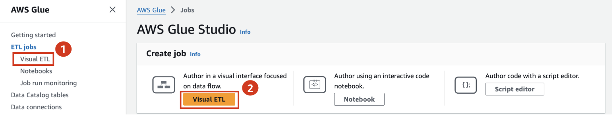

- Rename the job from Untitled job to **Quotes - Raw to Iceberg**
- Navigate to the **Job details** tab, select the **IAM Role** that the cloudformation template created for you.
- Optional: You can reduce the **Requested number of workers** to 2

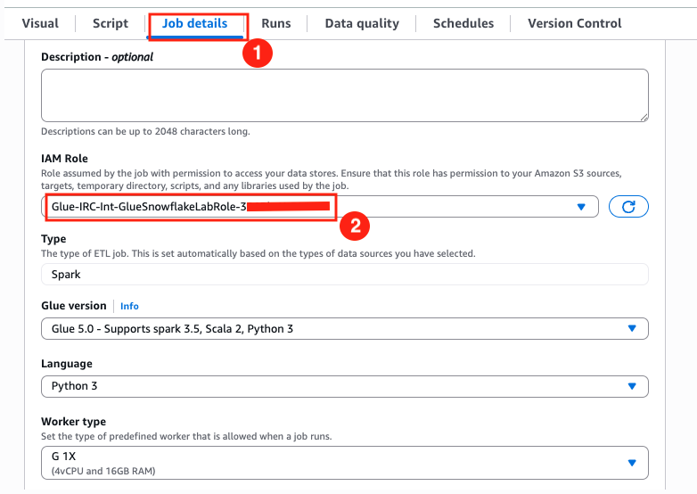

- Save your progress using the **Save** button on the top right corner. A green banner will confirm that the job progress has been
saved.

- Click on the **Visual** tab and then expand the **+** button, and add a source node S3.

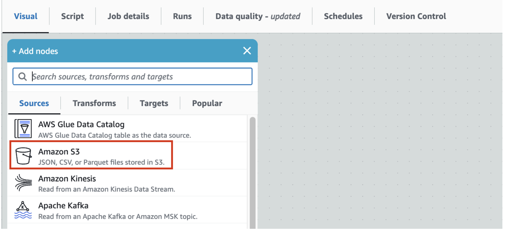

- - This should add S3 source node to the canvas.
- - Click on the S3 node to configure it as the screenshot below
- - - Name : **Quotes - Raw**
- - - S3 URL: Set S3 Source URL to `s3://aws-data-analytics-workshops/aws_glue/glue-snowflake/raw-data/quotes/` . This is a
public bucket where our raw quotes file resides.
- - - Data format: **Parquet**

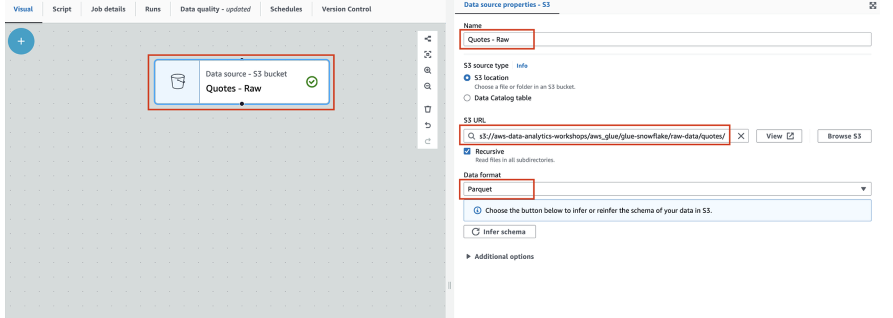

- Keeping the **Quotes-Raw** node selected, expand the **+** button, and add a simple **Transform - Change Schema**


- - This should add Change Schema Transform to the canvas with its Node parent as Quotes-Parquet S3 node.

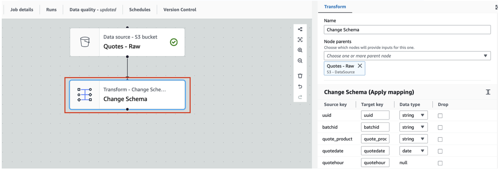

- In **Change Schema** change the **Data type** for `uuid` to **varchar**

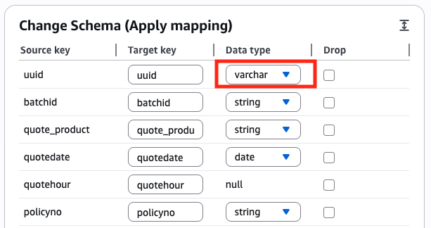

- Let us now store the Quotes-parquet to Amazon S3 in Iceberg format. For that, with **Change Schema** selected, search and locate **Amazon S3** in the **Targets** tab. Add it to the canvas.

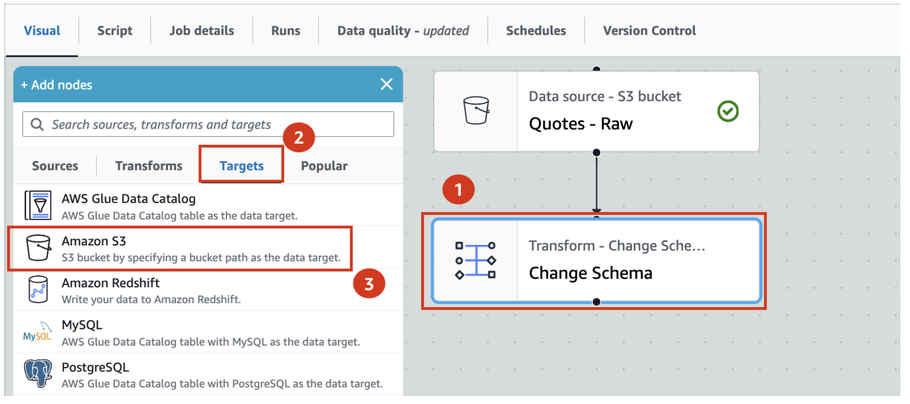

- With **Amazon S3 target node** selected
- - Rename **Amazon S3** to **Quotes - Iceberg**
- - Set **Format** to **Apache Iceberg**
- - Set **Compression Type** to **Snappy**
- - Set **S3 Target Location** to **s3://glue-snowflake-lab-xxxx/iceberg/quotes/** . The bucket has been pre-provisioned for you. You can use the Browse S3 button to locate the S3 bucket and folders. Replace the **glue-snowflake-lab-xxxx** with the one corresponding to your account.
- - Under **Data Catalog update options** select **Create a table in the Data Catalog and on subsequent runs, keep existing schema and add new partitions**
- - Select **iceberg** as the database
- - Set table name to **quotes**

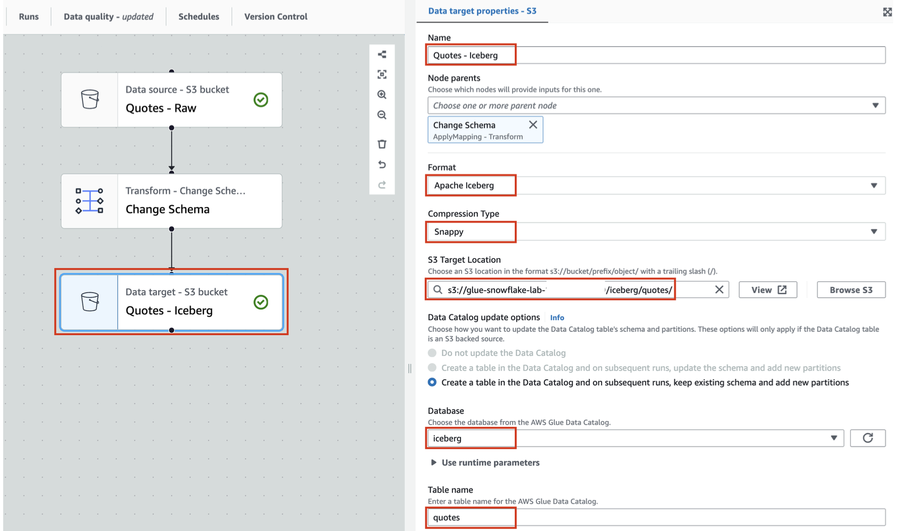

- Save the job using the **Save** button on the top right corner. A green banner confirms that the job has been saved.

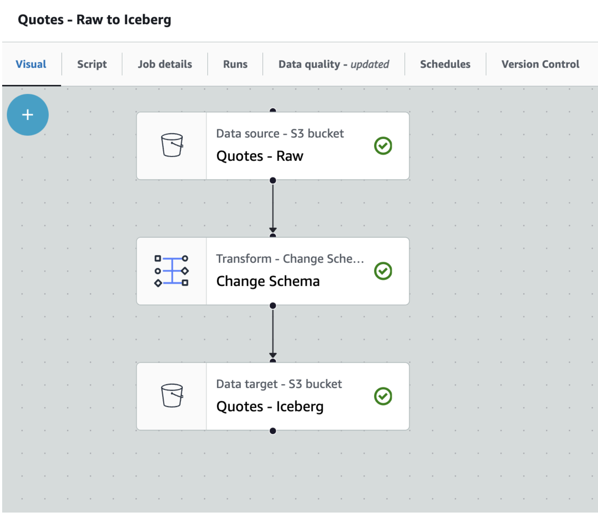

We can now run the Glue job to convert raw parquet files and save it as an Iceberg table.

- Click the **Run** button on the top right and navigate to the **Runs** tab


- You can monitor the job run status on this page. Once the job completes, the status turns to **Succeeded**

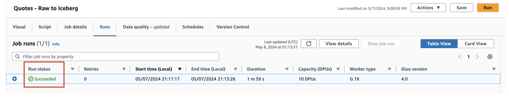

You have successfully created an Iceberg table in your AWS account from parquet files using Glue Studio.

As a bonus step you can open the browser tab with the S3 console and see the new folders and files where the data and metadata/manifest files are stored.

<!-- ------------------------ -->
## Configure AWS Lake Formation

In this step we will configure the AWS Lake Formation control access to the Iceberg tables. In Lake Formation, this means fine-grained access control to Data Catalog resources and Amazon S3 locations.

### Configure Lake Formation access controls
To configure your Lake Formation access controls, first set up the application integration:

- Sign in to the [Lake Formation console](https://console.aws.amazon.com/lakeformation/) as a data lake administrator.
- Choose `Administration` in the navigation pane.
Select `Application integration settings`.
- Enable `Allow external engines to access data in Amazon S3 locations with full table access`.
- Choose `Save`.

Next you can grant data locations to the role that was created.
- Select `Data locations` under `Permissions` in the left pane.
- Click on `Grant` located at the top-right corner.
- For `IAM users and roles`, select the role that was created.
- For `Storage locations`, click on `Browse` and select the S3 bucket.
- Check `Grantable` box.
- Leave the other fields as default and click on `Grant`.


Now you can register the data lake location:
- Select `Data lake locations` under `Administration` in the left pane.
- Click on `Register location` located at the top-right corner.
- For `Amazon S3 path`, enter the S3 bucket path created earlier.
- For `IAM role`, select the role that was created.  
- For `Permission mode`, select `Lake Formation`.
- Leave the other fields as default and click on `Register location`.

Now you can grant permissions to the IAM role that was created earlier:

- Choose `Data permissions` in the navigation pane.
- Choose `Grant`.
- Configure the following settings:
  - For `Principals`, select `IAM users and roles` and choose the role that was created.
  - For `Resources`, select `Named Data Catalog resources`.
  - For `Catalog`, choose your AWS account ID.
  - For `Database`, choose `iceberg`.
  - For `Database permissions`, select `SUPER`.
  - For `Grantable permissions`, select `SUPER`, leave everything else as default.
  - Choose `Grant`.
  - Click the refresh button to show the new permissions.

SUPER access is required for mounting the Iceberg table in Amazon S3 as a Snowflake table.

Now you are ready to setup Snowflake account and configure the AWS integrations.

<!-- ------------------------ -->
## Setup Snowflake account and configure the AWS integrations

In this step we will configure the Snowflake account with Internal tables to represent Customer and Policy data. We will also create Snowflake objects such as a databaase, warehouse and role that are used in the quickstart. Then we will configure the external volume to allow Snowflake to read and write on S3. We will also create an integration with the Glue Data Catalog to allow Snowflake to retrieve the Iceberg Catalog information directly from the Glue Catalog.

### Configure your Snowflake account

- First we will download 2 SQL files to your local system, which will be used to run the lab.

- First is the **Setup SQL script**

<button>

  [Setup SQL](https://snowflake-corp-se-workshop.s3.us-west-1.amazonaws.com/VHOL_Iceberg_SNOW_AWS/setup/hol_ice_setup_v1.2.sql)
</button>

- Next is the **Workflow SQL**

<button>

  [Workflow SQL](https://snowflake-corp-se-workshop.s3.us-west-1.amazonaws.com/VHOL_Iceberg_SNOW_AWS/setup/hol_ice_workflow_v1.6.sql)
</button>

- Open a browser tab and log into your Snowflake account as a user with `ACCOUNTADMIN` privileges.

- On the left hand menu select **Projects** and then **Workspaces** in that section.

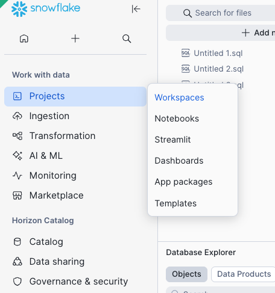

- Click on the **+ Add new button** under My Workspace and select **Upload Files**

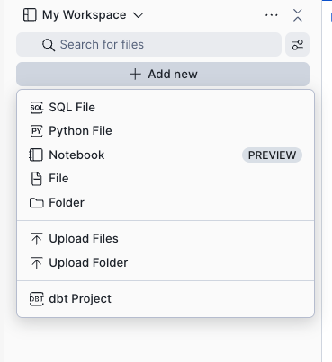

- Select the 2 SQL files you downloaded earlier, which will typically be on your local system's Downloads folder. The files are called hol_ice_setup_vxxx.sql & hol_ice_workflow_vxxx.sql.

- The files will appear under **My Workspace**

- Now click the **hol_ice_setup_vxx.sql** file and it will appear on a tab on the right hand side of the Snowsight window.

- This script is used to create a Snowflake Role, Database, Warehouse and the tables used for the Quickstart. We will execute the script in sections, by highlighting a section and then pressing the blue **Run button** in the top corner.


- Select the following SQL statements with the mouse cursor and then click the run/play button
```sql
USE ROLE SECURITYADMIN;

CREATE OR REPLACE ROLE HOL_ICE_RL COMMENT='Iceberg Role';
GRANT ROLE HOL_ICE_RL TO ROLE SYSADMIN;
```
- Once completed repeat for the following SQL statements

```sql
USE ROLE ACCOUNTADMIN;

GRANT CREATE INTEGRATION ON ACCOUNT TO ROLE HOL_ICE_RL;
GRANT CREATE EXTERNAL VOLUME ON ACCOUNT TO ROLE HOL_ICE_RL;
GRANT CREATE DATABASE ON ACCOUNT TO ROLE HOL_ICE_RL;
GRANT CREATE WAREHOUSE ON ACCOUNT TO ROLE HOL_ICE_RL;
```

- Then for the next section

```sql
USE ROLE HOL_ICE_RL;

CREATE OR REPLACE DATABASE HOL_ICE_DB;

CREATE OR REPLACE WAREHOUSE HOL_ICE_WH
  WITH WAREHOUSE_SIZE = 'XSMALL'
  INITIALLY_SUSPENDED = TRUE;
```

- **You can now select the rest of the SQL statements and execute them to create the tables and load data.**
This is line 44 to 110 on the worksheet.

### Configure the Snowflake Catalog integration with Glue and a Catalog-Linked Database

- We can now go through the main workflow in Snowflake. Click on the **hol_ice_workflow_vxxx.sql** file under **My Workspace**. This will open a new tab on the right side of Snowsight. 

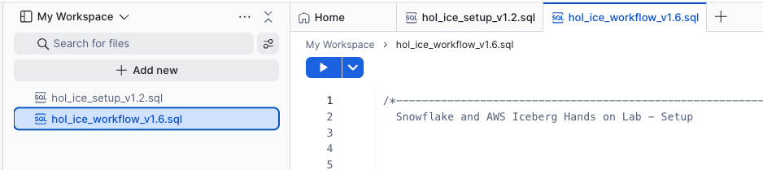

- Run lines 16 - 20 to set the context for the worksheet.

```sql
USE ROLE HOL_ICE_RL;

USE HOL_ICE_DB.PUBLIC;

USE WAREHOUSE HOL_ICE_WH;
```

- Get your AWS Account ID from the AWS console top right corner 

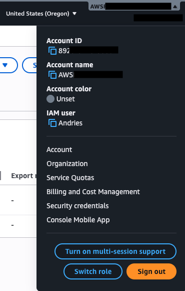

- Lastly copy the AWS role that was created from the CloudFormation Output window into the `your AWS Role that was created`
- Your AWS region will be **us-west-2** or look at the region drop down in the top left of your AWS console

Now we will create the integration with the `Glue Data Catalog`.

- Go back to the Snowflake worksheet and look at lines 37 to 53. You will again have to replace some values with those of your AWS account.

- In the **CATALOG_NAME** replace `<enter your AWS account ID>` with your AWS account ID (you can simply copy and paste the values from the earlier external volume command). Also replace the `<your AWS Role that was created>` with the AWS role that was created
- In the **SIGV4_IAM_ROLE** replace the `<enter your AWS account ID>` with your AWS account ID and `<your AWS Role that was created>` with the role ARN that was created.
- Also, in the **SIGV4_SIGNING_REGION** and **CATALOG_URI** replace `<enter your AWS region>` with your AWS region name.

It will look something like this
```sql
CREATE OR REPLACE CATALOG INTEGRATION glue_catalog_irc_int
CATALOG_SOURCE = ICEBERG_REST
TABLE_FORMAT = ICEBERG
CATALOG_NAMESPACE = 'iceberg'
REST_CONFIG = (
    CATALOG_URI = 'https://glue.us-west-2.amazonaws.com/iceberg'
    CATALOG_API_TYPE = AWS_GLUE
    CATALOG_NAME = '6546xxxxxxxxx'
    ACCESS_DELEGATION_MODE = VENDED_CREDENTIALS
)
REST_AUTHENTICATION = (
    TYPE = SIGV4
    SIGV4_IAM_ROLE = 'arn:aws:iam::6546xxxxxxxx:role/glue-snowflake-GluesnowflakedevdayLabRole-xxxxxxxxxxxx'
    SIGV4_SIGNING_REGION = 'us-west-2'
    SIGV4_EXTERNAL_ID = 'snow-glue-ext-id'
)
ENABLED = TRUE;
```

- Run the above SQL statement to create the Catalog integration once you filled in your account values

- Now run the describe catalog integration

```sql
DESC CATALOG INTEGRATION glue_catalog_irc_int;
```

- Go back to the CloudFormation browser tab and create a duplicate browser tab for the AWS Console. In the new tab Search for **IAM** and click on that option. This will open the IAM service.

- On the left hand menu click on **Roles** and then find the Role that was created. Click on that Role.
- In the middle of the screen you will see a number of tabs, click on the **Trust Relationships** tab. 
- Click on **Edit trust policy**. This will then display a JSON editor screen.

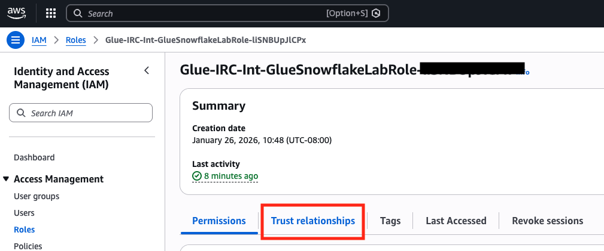

Select everything in the JSON policy and replace with the JSON below.

```json
{
    "Version": "2012-10-17",
    "Statement": [
        {
            "Effect": "Allow",
            "Principal": {
				"Service": [
					"lakeformation.amazonaws.com",
					"glue.amazonaws.com"
				]
            },
            "Action": "sts:AssumeRole"
        },
        {
            "Effect": "Allow",
            "Principal": {
                "AWS": "<API_AWS_IAM_USER_ARN>"
            },
            "Action": "sts:AssumeRole",
            "Condition": {
                "StringEquals": {
                    "sts:ExternalId": [
                        "snow-glue-ext-id"
                    ]
                }
            }
        }
    ]
}
```
Take your time and be careful when pasting the values into the JSON policy in the next few steps.

- From the Snowflake output copy the value from **API_AWS_IAM_USER_ARN** and paste it into the IAM policy by replacing `<API_AWS_IAM_USER_ARN>` with that value.


Your IAM Trust policy will look something like this
```json
{
    "Version": "2012-10-17",
    "Statement": [
        {
            "Effect": "Allow",
            "Principal": {
                "Service": "glue.amazonaws.com"
            },
            "Action": "sts:AssumeRole"
        },
        {
            "Effect": "Allow",
            "Principal": {
                "AWS": "arn:aws:iam::90541xxxxxx:user/vvyk0000-s"
            },
            "Action": "sts:AssumeRole",
            "Condition": {
                "StringEquals": {
                    "sts:ExternalId": [
                        "snow-glue-ext-id"
                    ]
                }
            }
        }
    ]
}
```

- Click the **Update policy** button and your trust relationship will be configured.

**This now completes the integration to the Glue Catalog**

Now go back to the worksheet and run this command to validate that the integration is working.
```sql
SELECT SYSTEM$VERIFY_CATALOG_INTEGRATION('glue_catalog_irc_int');
```
The result should say success with no error codes or messages.

<!-- ------------------------ -->
## Working with Iceberg tables in Snowflake

In this step we will create a [catalog-linked database](https://docs.snowflake.com/en/user-guide/tables-iceberg-catalog-linked-database) in Snowflake using the integrations with Lake Formation and Glue catalog IRC API to create an Iceberg table object referring the Quotes Iceberg table. That will be used for analysis with the internal Customer and Policy tables. We will then create an aggregate table written in Iceberg format on S3 and use Snowflake to query it.

Execute line 68 in the worksheet:

```sql
CREATE OR REPLACE DATABASE iceberg_linked_db
  LINKED_CATALOG = (
    CATALOG = 'glue_catalog_irc_int',
    NAMESPACE_MODE = FLATTEN_NESTED_NAMESPACE,
    NAMESPACE_FLATTEN_DELIMITER = '-',
    ALLOWED_NAMESPACES = ('iceberg')
  ) ;
```

Check sync status:
```sql
SELECT SYSTEM$CATALOG_LINK_STATUS('iceberg_linked_db');
```

The result should be something similar to this:
```code
{"failureDetails":[],"executionState":"RUNNING","lastLinkAttemptStartTime":"2025-10-06T16:32:42.426Z"}
```

Now that the database is linked to glue catalog, we should be able to query
the existing iceberg table in glue:

Let's read the Quotes data in Iceberg format from S3. Note that you need to use the
double quotes for the glue objects such as databases, schemas, and tables.

```sql
use database iceberg_linked_db;
use schema "iceberg";
SELECT * FROM "quotes" LIMIT 20;
```

We can now create an iceberg table and register it with Glue catalog by replacing `<Enter your S3 bucket name that was created>` with your S3 bucket and run the SQL command shown below.

```sql
CREATE OR REPLACE ICEBERG TABLE iceberg_linked_db."iceberg"."quote_analysis_ice" (
    "fullname" STRING,
    "postcode" STRING,
    "custid" STRING,
    "ipid" NUMBER(18,0),
    "productname" STRING,
    "quotecount" NUMBER(18,0),
    "policyno" STRING,
    "quotedate" DATE,
    "quote_product" STRING,
    "originalpremium" NUMBER(28,2),
    "totalpremiumpayable" NUMBER(28,2),
    "createddate" DATE,
    "brand" STRING,
    "branchcode" STRING,
    "policy_status_desc" STRING,
    "typeofcover_desc" STRING,
    "insurer_name" STRING,
    "inceptiondate" DATE,
    "renewaldate" DATE
)
BASE_LOCATION = 's3://<Enter your S3 bucket name that was created>/iceberg/quote-analysis-iceberg';
```

We can now combine internal Snowflake tables `CUSTOMER` and `POLICIES` with the existing `quotes` iceberg table
 and insert into the new Iceberg table `quote_analysis_ice`.

```sql
insert into iceberg_linked_db."iceberg"."quote_analysis_ice"
select
    c.fullname, c.postcode, c.custid, c.ipid, c.productname, c.quotecount,
    q."policyno", q."quotedate", q."quote_product", q."originalpremium", q."totalpremiumpayable",
    p.createddate, p.brand, p.branchcode, p.policy_status_desc,
    p.typeofcover_desc, p.insurer_name, p.inceptiondate, p.renewaldate
from
    hol_ice_db.public.customer c,
    "quotes" q,
    hol_ice_db.public.policies p
where
    c.fullname = q."fullname"
    and c.postcode = q."postcode"
    and c.quotecount > 5
    and c.custid = p.custid;
```

This aggregate data can also be written in Iceberg format back to S3 for consumption by other services and engines.

Now we can query the newly created Iceberg table in glue catalog.
```sql
select * from iceberg_linked_db."iceberg"."quote_analysis_ice" limit 10;
```

This completes the creation of iceberg tables in Snowflake using the Glue Data Catalog IRC API and Lake Formation credential vending. You also used the iceberg table with internal tables to perform analysis on insurance customers, quotes and policies. This demonstrates the powerful integration which provides read and write capabilities to glue from Snowflake.

Optional: Refresh the Database Explorer in SnowSight to see the Catalog-Linked Database and the Iceberg tables in it. Also explore the S3 bucket to see the new folder for the table created by Snowflake and also open a new tab browser tab with the AWS console to use Athen aor other AWS service to explore the table created by Snowflake in the Glue Catalog.

<!-- ------------------------ -->
## Cleanup

Follow the steps below to ensure the deployed resources are cleaned up.
Snowflake:
  - Drop Snowflake warehouse
  ```sql
  DROP DATABASE HOL_ICE_WH;
  ```
  - Drop Snowflake database
  ```sql
  DROP DATABASE HOL_ICE_DB;
  ```
  - Drop Catalog-linked database
  ```sql
  DROP DATABASE iceberg_linked_db;
  ```
  - Drop Glue catalog integration 
  ```sql
  DROP CATALOG INTEGRATION glue_catalog_irc_int;
  ```
AWS:
  - Delete the Glue Studio Job
  - Delete the tables and database in Glue
  - Remove data locations in Lake Formation
  - De-register data lake locations in Lake Formation
  - Empty the S3 bucket
  - Delete Cloudformation Template


<!-- ------------------------ -->
## Conclusion and Resources

You've successfully converted parquet data to Iceberg format using AWS Glue, integrated Snowflake with S3 and the Glue Data Catalog Iceberg Rest, then combined Iceberg table data with Internal Snowflake data for analytics, wrote aggregate data in Iceberg format to S3 and finally used Snowflake to analyze the Iceberg data.

### What You Learned
- how Snowflake integrates with S3 and the Glue Data Catalog to modernize Data Lakes with Iceberg
- converting parquet files to Iceberg tables using AWS Glue
- configuring the Snowflake integrations with Glue Data Catalog leveraging IRC and vended credentails for storage access
- creating a Snowflake a Catalog-Linked Database to an External Catalog such as the Glue Data Catalog and using it to read and write Iceberg tables

### Related Resources 
- [Snowflake Iceberg documentation](https://docs.snowflake.com/en/user-guide/tables-iceberg)
- [AWS Glue Iceberg Documentation](https://docs.aws.amazon.com/glue/latest/dg/aws-glue-programming-etl-format-iceberg.html)
- [Snowflake Catalog-Linked Database](https://docs.snowflake.com/en/user-guide/tables-iceberg-catalog-linked-database)
- [Configure a catalog integration for AWS Glue Iceberg REST](https://docs.snowflake.com/en/user-guide/tables-iceberg-configure-catalog-integration-rest-glue)
- [AWS Lake Formation Credential Vending](https://docs.aws.amazon.com/lake-formation/latest/dg/aws-lake-formation-api-credential-vending.html)


