author: Andries Engelbrecht
id: data-lake-using-apache-iceberg-with-snowflake-and-aws-glue
summary: This guide shows how to integrate Snowflake with External Volumes to S3 and the Glue Data Catalog for use with Iceberg tables
<!--- Categories below should be hyphenated, i.e., Getting-Started. Do not leave blank. Visit site for available categories. -->
categories: Data-Engineering
environments: web
status: Published 
feedback link: https://github.com/Snowflake-Labs/sfguides/issues
tags: Data Lake, Iceberg, Apache Iceberg 

# Build Data Lakes using Apache Iceberg with Snowflake and AWS Glue
<!-- ------------------------ -->
## Overview 
Duration: 4

[Apache Iceberg](https://iceberg.apache.org/) is an open table format for huge analytical datasets that enables high performance analytics on open data formats with ACID compliance. Snowflake and AWS both support Iceberg format that enables customers to drastically improve data interoperability, speed of implmentation and peformance for integrated data lakes.

This guide will take you through the steps of converting existing parquet data to Iceberg and using it to build open analytic environments using Snowflake and [AWS Glue](https://aws.amazon.com/glue/).

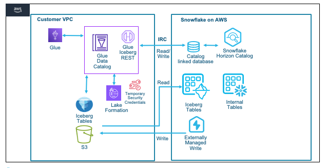

For this guide we will use a Financial Services use case where Insurance data is analyzed. The Quotes data is collected from systems and stored as parquet on S3, while Customer and Policy data is already available as internal Snowflake tables. We will try and identify customers who are likely to churn or potential fraud with a high number of recent quote requests. 

### Prerequisites
- Familiarity with Snowflake, basic SQL, Snowsight UI and Snowflake Objects
- Familiarity with AWS Services (S3, Glue, CloudFormation, IAM) and the Management Console
- Basic knowledge of Python

### What You’ll Learn 
- How to create an Iceberg table in the [Glue Data Catalog](https://docs.aws.amazon.com/prescriptive-guidance/latest/serverless-etl-aws-glue/aws-glue-data-catalog.html) and convert parquet data on S3 in place(no rewrite) to Iceberg format
- How to configure a [Snowflake External Volume](https://docs.snowflake.com/en/user-guide/tables-iceberg-configure-external-volume#configure-an-external-volume-for-amazon-s3) with S3 
- How to configure a [Snowflake External Catalog](https://docs.snowflake.com/en/user-guide/tables-iceberg-configure-catalog-integration#configure-a-catalog-integration-for-aws-glue) with the Glue Data Catalog
- How to create Snowflake [Managed](https://docs.snowflake.com/en/user-guide/tables-iceberg-create#create-an-iceberg-table-with-snowflake-as-the-catalog) and [Unmanaged](https://docs.snowflake.com/en/user-guide/tables-iceberg-create#create-an-iceberg-table-with-aws-glue-as-the-catalog) Iceberg Tables  

### What You’ll Need 
- A [Snowflake Enterprise Account](https://signup.snowflake.com/) with `ACCOUNTADMIN` access in US WEST (OREGON REGION)
- An [AWS Account](https://aws.amazon.com/free/) with `Administartor Access`

### What You’ll Build 
- A Glue Database with Iceberg table on S3
- Integrations between Snowflake and AWS for External Volume and External Catalog
- Snowflake Managed and Unmanaged Iceberg tables

<!-- ------------------------ -->
## Configure the AWS Account
Duration: 4

`In this step we will use CloudFormation to configure objects in the AWS account needed for the quickstart, we will also cover basics of the AWS console and how to leverage browser tabs to multi task with various AWS services.`

Start by logging into your AWS Console.

Once logged in to the AWS Console look for the AWS Region in the top right hand corner and select the **US West (Oregon) us-west-2** region. 

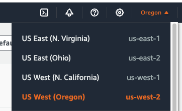

We will now run a CloudFormation Template to configure a S3 bucket and Role with specific Policies in the AWS account.

In the top left menu bar enter **Cloudformation** in the Search bar, then select the CloudFormation service from the dropdown list.

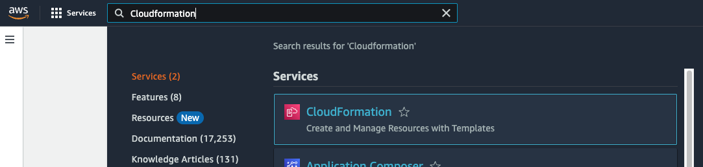

Once in the CLoudFormation screen **verify** the AWS Region that it is the **US West (Oregon) us-west-2** region.


Then it is recommended to duplicate the browser tab 3 times to make it simple to use multiple AWS services in the same browser session.


You can now create a CloudFormtion Stack. You can click the **Create stack** button, or if it is not visible click on the **3 Horizontal bars** top left corner and then select **Stacks** to see the **Create stack** button.

Once you are in the Create stack screen select the following options:
- Prepare template > Choose an existing template
- Template source > Amazon S3 URL

Then copy the CloudFormation Template URL below into the Amazon S3 URL box.


<https://snowflake-corp-se-workshop.s3.us-west-1.amazonaws.com/VHOL_Iceberg_SNOW_AWS/setup/glue-snflk-devday-v1.2.yaml>


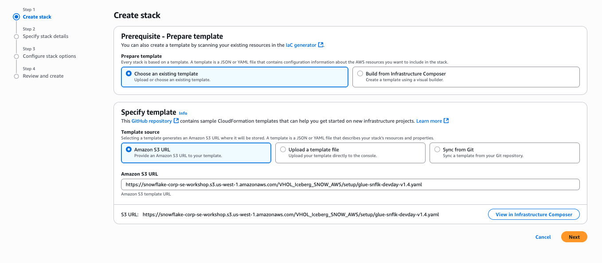

Click **Next**

On the next screen **Specify stack details** enter a name for the stack in **Stack name**, in this case you can use `iceberg-devday` then click **Next**

The following screen **Configure stack options** simply click **Next**

On the last screen **Review and create** scroll down to the bottom and **select the check box** next to ``I acknowledge that AWS CloudFormation might create IAM resources.`` and then click **Submit** to create the stack.

It will take a few seconds to create the resources in your AWS account. In the Events screen you can click the refresh button to see updates.

Once complete click on the **Outputs** Tab in the center top. This will display the Role name and S3 bucket name that was created. These will be used later to configure the integrations with Snowflake.

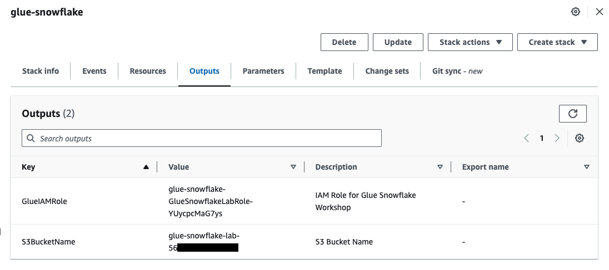


<!-- ------------------------ -->
## Use Glue to create Iceberg table and convert parquet data in place
Duration: 6

`In this step we will use AWS Glue to create an icebrg table and convert parquet data without rewriting the data on S3 to iceberg format. Glue Notebooks will be used.`

In one of the browser tabs with the AWS console type **S3** in the search bar and select **S3**. This will allow you to quickly see what data and folders are created in S3. **Verify** the AWS Region in the S3 screen.

In the next browser tab type **Glue** and then select **AWS Glue**.

Once in the AWS Glue screen **verify** the AWS Region that it is the **US West (Oregon) us-west-2** region.


Click on the 3 horizonal bars on the top left side to open the side left side menu. Then select **Notebooks** under **ETL jobs**.

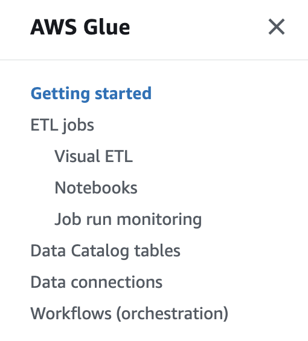

We have developed a Python notebook that can be downloaded to your local system. Click on the Download Notebook button below, which will download a .ipynb file to your downloads folder.

<button>

  [Download Notebook](https://snowflake-corp-se-workshop.s3.us-west-1.amazonaws.com/VHOL_Iceberg_SNOW_AWS/setup/iceberg_hol_v1.3.ipynb)
</button>


In the **AWS Glue Studio** main frame click on the **Notebook button**

- Select the **Spark(Python)** Engine
- Select **Upload Notebook** and choose the Notebook file that was just downloaded
- For **IAM Role** select the Role that created by the CloudFormation template
- Then click **Create notebook**

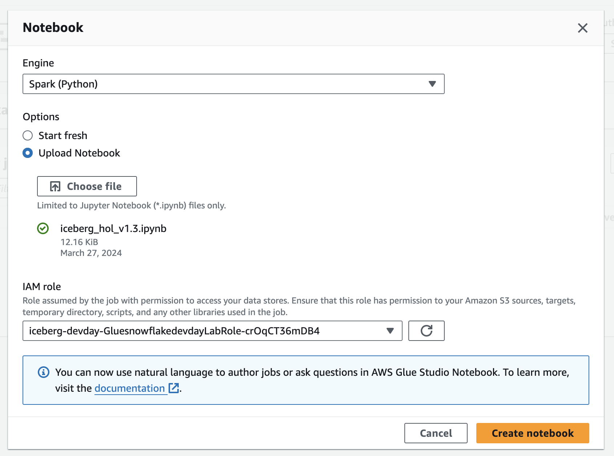

Give the notebook a little time to start.

We will execute notebook code cells one at a time to step through the process. To run notebook code cells, simple select the code cell and then click the **little run button at the top** or **Shift + Return** on the keyboard.

- Execute the first cell to configure the Glue session and resources

In the next cell we will configure the variables for the notebook session. You first need to update the **bucket_name** variable with `your S3 bucket name` that was created by the CloudFormation Template. The bucket name can be found on the browser tab with the **CloudFormation Outputs**


This step will take a little time as Glue is provisioning resources to support execution of he notebook.

Next we will copy parquet data to your S3 bucket from a public bucket. Run the **Configure S3 path and copy files** code cell.

Now we will create a Glue Data Catalog Database to be used for the lab by executing the **Create Glue Database** code cell.

Run the **Initialize Spark Session** code cell to configure the Spark environment.

In the next 2 code cells we will just verify that there ar eno tables in the Glue database we created.

We can now create a temporary view to generate the DDL for the Iceberg table that will be created. Run the code to **create the temporary view** . 

Then run the cell to **create the Iceberg table** in the database using this temporary view.

We can now verify the Iceberg table is created by running the **Show Tables** cell

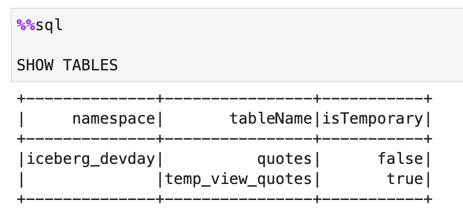

We are now ready to add the parquet files to the Iceberg table. It is important to note that we are not rewriting the data, but just adding it in place to the Iceberg table.

Run the **Execute add_files procedure** code cell to use Glue to add the files and generate the Iceberg metadata and manifest files.

Lastly we will verify that the parquet files we added to the iceberg table and the manifest files were generated. Run the **Check data files** and **Check new metadata files** code cells.

Run the **Stop session** cell to shutdown the resources used in Glue.

As a bonus step you can open the bowser tab with the S3 console and see the new folders and files where the data and metadata/manifest files are stored.


<!-- ------------------------ -->
## Setup Snowflake account and configure the External Volume and Catalog integrations
Duration: 7

`In this step we will configure the Snowflake account with Internal tables to represent Customer and Policy data. We will also create SNowflake objects such as a databaase, warehouse and role that are used the quickstart. Then we will configure the external volume to allow Snowflake to read and write on S3. We will also create an integration with the Glue Data Catalog to allow Snowflake to retrieve the Iceberg Catalog information directly from the the Glue Catalog.`

First we will download 2 SQL files to your local system, which will be used to run the lab.

First is the **Setup SQL script**

<button>

  [Setup SQL](https://snowflake-corp-se-workshop.s3.us-west-1.amazonaws.com/VHOL_Iceberg_SNOW_AWS/setup/hol_ice_setup_v1.2.sql)
</button>

Next is the **Workflow SQL**

<button>

  [Workflow SQL](https://snowflake-corp-se-workshop.s3.us-west-1.amazonaws.com/VHOL_Iceberg_SNOW_AWS/setup/hol_ice_workflow_v1.2.sql)
</button>

Open a browser tab and log into your Snowflake account as a user with `ACCOUNTADMIN` priviliges.

On the left hand menu select **Projects** and then **Worksheet** in that section.
Click on the **Blue + button** in the top right corner to create a new worksheet and select **SQL Worksheet**.

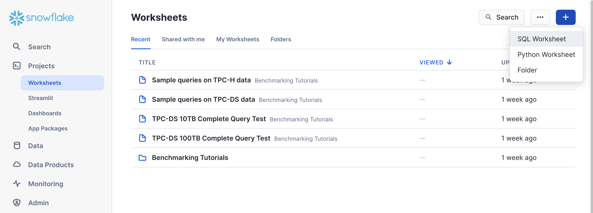

The worksheet screen will appear with a new tab with a timestamp on it, when you hover the mouse over the tab 3 dots will appear, click on it and select **Import SQL from File**

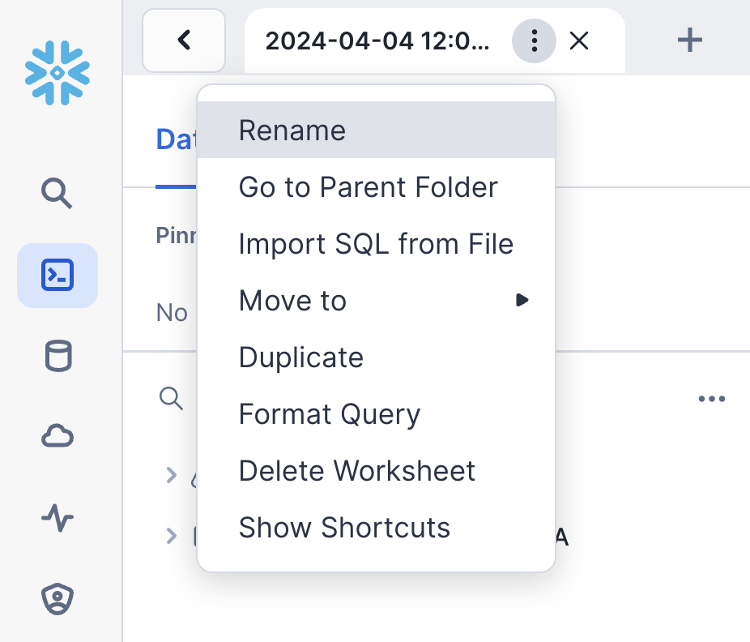

Now select the **hol_ice_setup_vxx.sql** file that you downloaded earlier, and click **Open**.

This script is used to create a Snowflake Role, Database, Warehouse and the tables used for the Quickstart. We will execute the script in sections, by highlighting a section and then pressing the blue **Run button** in the top corner.

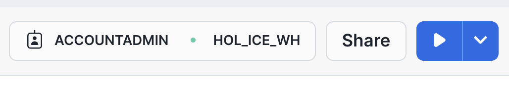

Select the following SQL statements with the mouse cursor and then click play
```sql
USE ROLE SECURITYADMIN;

CREATE OR REPLACE ROLE HOL_ICE_RL COMMENT='Iceberg Role';
GRANT ROLE HOL_ICE_RL TO ROLE SYSADMIN;
```
Once completed repeat for the following SQL statements

```sql
USE ROLE ACCOUNTADMIN;

GRANT CREATE INTEGRATION ON ACCOUNT TO ROLE HOL_ICE_RL;
GRANT CREATE EXTERNAL VOLUME ON ACCOUNT TO ROLE HOL_ICE_RL;
GRANT CREATE DATABASE ON ACCOUNT TO ROLE HOL_ICE_RL;
GRANT CREATE WAREHOUSE ON ACCOUNT TO ROLE HOL_ICE_RL;
```

Then for the next section

```sql
USE ROLE HOL_ICE_RL;

CREATE OR REPLACE DATABASE HOL_ICE_DB;

CREATE OR REPLACE WAREHOUSE HOL_ICE_WH
  WITH WAREHOUSE_SIZE = 'XSMALL'
  INITIALLY_SUSPENDED = TRUE;
```

**You can now select the rest of the SQL statements and execute them to create the tables and load data.**
This is line 44 to 110 on the worksheet.

### We are ready to go through the Snowflake workflow of the Quickstart.

On the top tabs next to the existing worksheet click on the + button to create a new worksheet. Again select **SQL Worksheet**

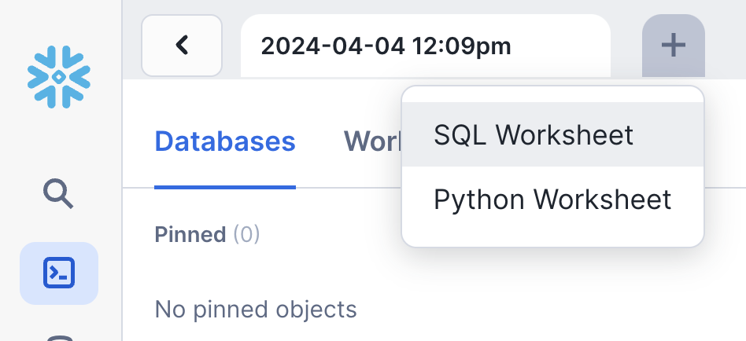

Following the same steps as before load the SQL script file into the worksheet. This time however select the **hol_ice_workflow_vxx.sql** file that you downloaded earlier, and click **Open**.

Run lines 16 - 20 to set the context for the worksheet.

```sql
USE ROLE HOL_ICE_RL;

USE HOL_ICE_DB.PUBLIC;

USE WAREHOUSE HOL_ICE_WH;
```

We will now create an `External Volume` and configure it to work with your Snowflake account.

First in the **STORAGE_BASE_URL** make sure to change the `enter your S3 bucket name` by going back to your CloudFormation Output window to copy in your S3 bucket name in. 

Then in the STORAGE_AWS_ROLE_ARN change the `enter your AWS account ID` by going back to the AWS console and copying the AWS account ID. You do this by clicking on the AWS account name in the top right corner adn then the copy button next to the account ID.

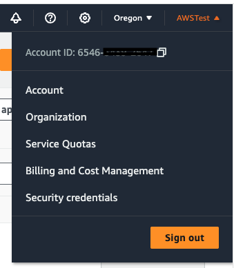

Lastly copy the AWS role that was created from the CloudFormation Output window into the `your AWS Role that was created`

Now execute the SQL statement, that will look something like this.

```sql
CREATE OR REPLACE EXTERNAL VOLUME HOL_ICE_EXT_VOL
   STORAGE_LOCATIONS =
      (
         (
            NAME = 'my-s3-ice-ext-vol'
            STORAGE_PROVIDER = 'S3'
            STORAGE_BASE_URL = 's3://glue-snowflake-devday-lab-6546xxxxxxx/iceberg/'
            STORAGE_AWS_ROLE_ARN = 'arn:aws:iam::6546xxxxxxx:role/iceberg-devday-GluesnowflakedevdayLabRole-xxxxxxxxxxx'

         )
      );
```

**We will now setup the trust relationship with your AWS account role**

Run the describe external command to get the Snowflake values of the object.

```sql
DESC EXTERNAL VOLUME HOL_ICE_EXT_VOL;
```

The storage locations  output row will have a property value in JSON that looks like this

```json
{"NAME":"my-s3-ice-ext-vol",
"STORAGE_PROVIDER":"S3",
"STORAGE_BASE_URL":"s3://glue-snowflake-devday-lab-6546xxxxxxxx/iceberg/",
"STORAGE_ALLOWED_LOCATIONS":["s3://glue-snowflake-devday-lab-6546xxxxxxxx/iceberg/*"],
"STORAGE_AWS_ROLE_ARN":"arn:aws:iam::65465xxxxxxx:role/iceberg-devday-GluesnowflakedevdayLabRole-crOqCT36mDB4",
"STORAGE_AWS_IAM_USER_ARN":"arn:aws:iam::90541xxxxxxxxxx:user/vvyk0000-s",
"STORAGE_AWS_EXTERNAL_ID":"YJB50193_SFCRole=2_f1IsD5b8/DAFxxxxxxxxxxxx",
"ENCRYPTION_TYPE":"NONE",
"ENCRYPTION_KMS_KEY_ID":""}
```

Go back to the CloudFormation browser tab and create a duplicate browser tab for the AWS Console. In the new tab Search for **IAM** and click on that option. This will open the IAM service.

- On the left hand menu click on **Roles** and then find the Role that was created. Click on that Role.
- In the middle of the screen you will see a number of tabs, click on the **Trust Relationship** tab. 
- Click on **Edit trust policy**. This will then display a JSON editor screen.

Select everything in the JSON policy and replace with the JSON below.

```json
{
    "Version": "2012-10-17",
    "Statement": [
      {
        "Effect": "Allow",
        "Principal": {
          "AWS": "<snowflake storage arn>"
        },
        "Action": "sts:AssumeRole",
        "Condition": {
          "StringEquals": {
            "sts:ExternalId": "<snowflake external id ext volume>"
          }
        }
      },
      {
        "Effect": "Allow",
        "Principal": {
          "AWS": "<snowflake glue arn>"
        },
        "Action": "sts:AssumeRole",
        "Condition": {
          "StringEquals": {
            "sts:ExternalId": "<snowflake external id glue catalog>"
          }
        }
      }
    ]
  }
```

Take your time and be careful when pasting the values into the JSON policy in the next few steps.

- From the Snowflake output copy the value from **STORAGE_AWS_IAM_USER_ARN** and paste it into the IAM policy by replacing `snowflake storage arn` with that value.
- Next copy the Snowflake **STORAGE_AWS_EXTERNAL_ID** and paste it into IAM policy by replacing the `snowflake external id ext volume`


Next we will create the integration with the `Glue Data Catalog`, which works in a very similar manner.

Go back to the Snowflake worksheet and look at lines 62 to 68. You will again have to repalce some values with those of your AWS account.

- In the **GLUE_AWS_ROLE_ARN** replace `enter your AWS account ID` with your AWS account ID (you can simply copy and paste the values from the earlier external volume command). Also replace the `your AWS Role that was created` with the AWS role that was created
- In the **GLUE_CATALOG_ID** replace the `enter your AWS account ID` with your AWS account ID

It will look something like this
```sql
CREATE or REPLACE CATALOG INTEGRATION HOL_ICE_GLUE_CAT_INT
  CATALOG_SOURCE=GLUE
  CATALOG_NAMESPACE='iceberg_devday'
  TABLE_FORMAT=ICEBERG
  GLUE_AWS_ROLE_ARN='arn:aws:iam::6546xxxxxxxx:role/iceberg-devday-GluesnowflakedevdayLabRole-xxxxxxxxxxxx'
  GLUE_CATALOG_ID='6546xxxxxxxxx'
  ENABLED=TRUE; 
```

Now run the describe catalog integration, line 70

```sql
DESC CATALOG INTEGRATION HOL_ICE_GLUE_CAT_INT;
```

The Results will have the 2 property values needed to finalize the IAM Trust Policy in AWS.
**GLUE_AWS_IAM_USER_ARN** and **GLUE_AWS_EXTERNAL_ID**

In the IAM Trust Policy update the following
- `snowflake glue arn` with the value from the Snowflake output **GLUE_AWS_IAM_USER_ARN**
- `snowflake external id glue catalog` with the value from the Snowflake output **GLUE_AWS_EXTERNAL_ID**


Your IAM Trust policy will look something like this
```json
{
    "Version": "2012-10-17",
    "Statement": [
      {
        "Effect": "Allow",
        "Principal": {
          "AWS": "arn:aws:iam::90541xxxxxx:user/vvyk0000-s"
        },
        "Action": "sts:AssumeRole",
        "Condition": {
          "StringEquals": {
            "sts:ExternalId": "YJB50193_SFCRole=2_f1IsD5b8/DAFYPxxxxxxxxxxxx"
          }
        }
      },
      {
        "Effect": "Allow",
        "Principal": {
          "AWS": "arn:aws:iam::90541xxxxxxx:user/vvyk0000-s"
        },
        "Action": "sts:AssumeRole",
        "Condition": {
          "StringEquals": {
            "sts:ExternalId": "YJB50193_SFCRole=2_cTvotHxxxxxxxxxxxxxxxx"
          }
        }
      }
    ]
  }
```

Click the **Update policy** button and your trust relationship will be configured.

**This now completes the integration to both S3 and the Glue Catalog**


<!-- ------------------------ -->
## Create the Iceberg Table, Perform Analysis and write aggregate data as Iceberg table
Duration: 4


`In this step we will use the integrations with S3 adn Glue to create an Iceberg table object refering the Quotes Iceberg table. THat will be used for analysis with the internal Customer and Policy tables. We will then create an aggregate table written in Iceberg format on S3 and use Snowflake to query it`

We can now create an Iceberg table by referencing the Glue catalog. We simply execute the command below. Line 80 to 83.

```sql
CREATE OR REPLACE ICEBERG TABLE QUOTES_ICE
  EXTERNAL_VOLUME='HOL_ICE_EXT_VOL'
  CATALOG='HOL_ICE_GLUE_CAT_INT'
  CATALOG_TABLE_NAME='QUOTES';
```
Let's read the Quotes data in Iceberg format from S3

```sql
SELECT * FROM QUOTES_ICE LIMIT 10;
```

We can now do some analysis by combining the Iceberg table (Quotes data) withe inetrnal Snowflake Customer table data.

```sql
SELECT C.FULLNAME, C.POSTCODE, C.CUSTID, C.IPID, C.PRODUCTNAME, C.QUOTECOUNT,
Q.POLICYNO, Q.QUOTEDATE, Q.QUOTE_PRODUCT, Q.ORIGINALPREMIUM, Q.TOTALPREMIUMPAYABLE 
FROM CUSTOMER C, QUOTES_ICE Q
WHERE C.FULLNAME = Q.FULLNAME
AND C.POSTCODE = Q.POSTCODE
AND C.QUOTECOUNT > 5
ORDER BY C.QUOTECOUNT DESC;
```

We can now also create an aggreagte data set by combining the Quotes data in Iceberg with Customer and Policy data in internal Snowfake tables.

```sql
WITH CUSTQUOTE AS
(SELECT C.FULLNAME, C.POSTCODE, C.CUSTID, C.IPID, C.PRODUCTNAME, C.QUOTECOUNT,
Q.POLICYNO, Q.QUOTEDATE, Q.QUOTE_PRODUCT, Q.ORIGINALPREMIUM, Q.TOTALPREMIUMPAYABLE 
FROM CUSTOMER C, QUOTES_ICE Q
WHERE C.FULLNAME = Q.FULLNAME
AND C.POSTCODE = Q.POSTCODE
AND C.QUOTECOUNT > 5)
SELECT CQ.FULLNAME, CQ.POSTCODE, CQ.CUSTID, CQ.IPID, CQ.PRODUCTNAME,
CQ.QUOTECOUNT, CQ.POLICYNO, CQ.QUOTEDATE, CQ.QUOTE_PRODUCT,
CQ.ORIGINALPREMIUM, CQ.TOTALPREMIUMPAYABLE, 
P.CREATEDDATE, P.BRAND, P.BRANCHCODE, P.POLICY_STATUS_DESC,
P.TYPEOFCOVER_DESC, P.INSURER_NAME, P.INCEPTIONDATE, P.RENEWALDATE
FROM CUSTQUOTE CQ, POLICIES P
WHERE CQ.CUSTID = P.CUSTID;
```

This aggregate data can also be written in Iceberg format back to S3 for consumption by other services and engines.

```sql
CREATE OR REPLACE ICEBERG TABLE QUOTE_ANALYSIS_ICE  
  CATALOG='SNOWFLAKE'
  EXTERNAL_VOLUME='HOL_ICE_EXT_VOL'
  BASE_LOCATION='quoteanalysisiceberg'
  AS 
  WITH CUSTQUOTE AS
(SELECT C.FULLNAME, C.POSTCODE, C.CUSTID, C.IPID, C.PRODUCTNAME, C.QUOTECOUNT,
Q.POLICYNO, Q.QUOTEDATE, Q.QUOTE_PRODUCT, Q.ORIGINALPREMIUM, Q.TOTALPREMIUMPAYABLE 
FROM CUSTOMER C, QUOTES_ICE Q
WHERE C.FULLNAME = Q.FULLNAME
AND C.POSTCODE = Q.POSTCODE
AND C.QUOTECOUNT > 5)
SELECT CQ.FULLNAME, CQ.POSTCODE, CQ.CUSTID, CQ.IPID, CQ.PRODUCTNAME,
CQ.QUOTECOUNT, CQ.POLICYNO, CQ.QUOTEDATE, CQ.QUOTE_PRODUCT,
CQ.ORIGINALPREMIUM, CQ.TOTALPREMIUMPAYABLE, 
P.CREATEDDATE, P.BRAND, P.BRANCHCODE, P.POLICY_STATUS_DESC,
P.TYPEOFCOVER_DESC, P.INSURER_NAME, P.INCEPTIONDATE, P.RENEWALDATE
FROM CUSTQUOTE CQ, POLICIES P
WHERE CQ.CUSTID = P.CUSTID;
```

Lastly we can also use Snowflake to query the aggregate data in Iceberg.
Let's see which customer with more the 5 quotes have Policy that is Renewed and also a premium higher than 100.

```sql
SELECT DISTINCT(CUSTID), FULLNAME, POSTCODE,IPID, PRODUCTNAME, QUOTECOUNT,
POLICYNO, QUOTEDATE, QUOTE_PRODUCT, ORIGINALPREMIUM, TOTALPREMIUMPAYABLE,
CREATEDDATE, BRAND, BRANCHCODE, POLICY_STATUS_DESC, TYPEOFCOVER_DESC,
INSURER_NAME, INCEPTIONDATE, RENEWALDATE
FROM QUOTE_ANALYSIS_ICE
WHERE TOTALPREMIUMPAYABLE >100
AND POLICY_STATUS_DESC = 'Renewed' 
ORDER BY CREATEDDATE DESC;
```


<!-- ------------------------ -->
## Conclusion
Duration: 1

This lab provides ways of integrating Snowflake with the Glue Catalog, as well as how to modernize data lakes using Iceberg table format for improved performance and transactional capabilities with various services.

Please see 
- [Snowflake Iceberg documentation](https://docs.snowflake.com/en/user-guide/tables-iceberg)
- [AWS Glue Iceberg Documentation](https://docs.aws.amazon.com/glue/latest/dg/aws-glue-programming-etl-format-iceberg.html)


### What we've covered
- how Snowflake integrates with S3 and the Glue Data Catalog to modernize Data Lakes wiht Iceberg
- converting paruqet files to Iceberg tables using AWS Glue
- configuring the Snowflake integrations with S3 and Glue Data Catalog
- creating Snowflake Icebrg tables with External Catalog as well as Snowflake Catalog