author: Andries Engelbrecht, James Sun
id: data-lake-using-apache-iceberg-with-snowflake-and-aws-glue
categories: snowflake-site:taxonomy/solution-center/certification/quickstart, snowflake-site:taxonomy/product/data-engineering, snowflake-site:taxonomy/snowflake-feature/apache-iceberg
language: en
summary: Build open table format data lakes with Apache Iceberg using Snowflake Catalog-Linked Databases, Vended Credentials, AWS S3, Lake Formation and Glue Data Catalog.
environments: web
status: Published 
feedback link: https://github.com/Snowflake-Labs/sfguides/issues


# Build Data Lakes using Apache Iceberg with Snowflake and AWS Glue
<!-- ------------------------ -->
## Overview 

[Apache Iceberg](https://iceberg.apache.org/) is an open table format for huge analytical datasets that enables high performance analytics on open data formats with ACID compliance. Snowflake and AWS both support Iceberg format that enables customers to drastically improve data interoperability, speed of implementation and performance for integrated data lakes.

This guide will take you through the steps of converting existing parquet data to Iceberg and using it to build open analytic environments using Snowflake and [AWS Glue](https://aws.amazon.com/glue/) with [AWS Lake Formation](https://aws.amazon.com/lake-formation/) providing fine-grained access controls and [temporary access token](https://docs.aws.amazon.com/lake-formation/latest/dg/aws-lake-formation-api-credential-vending.html) to Iceberg tables.

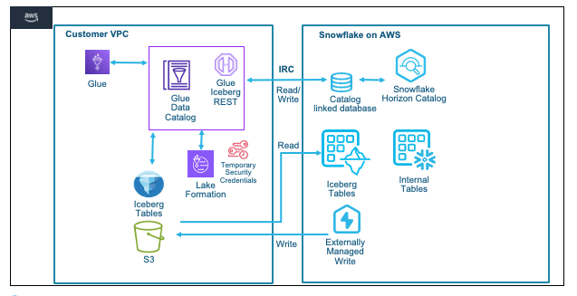

For this guide we will use a Financial Services use case where Insurance data is analyzed. The Quotes data is collected from systems and stored as parquet on S3, while Customer and Policy data is already available as internal Snowflake tables. We will try to identify customers who are likely to churn or potential fraud with a high number of recent quote requests. 

### Prerequisites
- Familiarity with Snowflake, basic SQL, and the Snowsight UI
- Familiarity with AWS services — S3, Glue, Lake Formation, IAM, and CloudFormation

### What You'll Learn
- How to convert Parquet files on S3 to Apache Iceberg format using an [AWS Glue ETL job](https://docs.aws.amazon.com/glue/latest/dg/aws-glue-programming-etl-format-iceberg.html) — no data rewrite, in-place conversion
- How to configure [AWS Lake Formation](https://aws.amazon.com/lake-formation/) for fine-grained access control on Iceberg tables using credential vending
- How to create a Snowflake [Catalog Integration](https://docs.snowflake.com/en/user-guide/tables-iceberg-configure-catalog-integration-rest-glue) that connects to AWS Glue via the Iceberg REST Catalog (IRC) API using SIGV4 authentication and Lake Formation vended credentials
- How to create a [Catalog-Linked Database](https://docs.snowflake.com/en/user-guide/tables-iceberg-catalog-linked-database) in Snowflake to auto-discover and sync all Iceberg tables from the Glue Data Catalog
- How to read from, write to, and create Iceberg tables in Snowflake via the Catalog-Linked Database

### What You'll Need
- A [Snowflake Enterprise Account](https://signup.snowflake.com/?utm_source=snowflake-devrel&utm_medium=developer-guides&utm_cta=build_datalake_with_glue_and_iceberg) with `ACCOUNTADMIN` access, deployed in **AWS US West 2 (Oregon)**
- An [AWS Account](https://aws.amazon.com/free/) with Administrator access

### What You'll Build
- An AWS Glue Data Catalog database with Apache Iceberg tables backed by S3
- AWS Lake Formation permissions with credential vending for fine-grained Iceberg access control
- A Snowflake External Volume, Catalog Integration, and Catalog-Linked Database connected to the Glue catalog
- An end-to-end read/write workflow: query, create, and write Iceberg tables from Snowflake using the Catalog-Linked Database

<!-- ------------------------ -->
## Set Up with Cortex Code (Fast Path)

[Cortex Code](https://docs.snowflake.com/en/user-guide/cortex-code/cortex-code) is Snowflake's AI coding agent, built into the Snowflake CLI. You can use it to automate the entire setup in this guide — from deploying the AWS infrastructure to creating the Snowflake catalog integration and Catalog-Linked Database.

**Prerequisites for this path:**
- AWS CLI installed and configured with Administrator access (`aws configure`)
- [Snowflake CLI](https://docs.snowflake.com/en/developer-guide/snowflake-cli/installation/installation) installed and connected to your Snowflake account
- Snowflake Enterprise account with `ACCOUNTADMIN` access in **AWS us-west-2**

Use the prompts below in sequence. Each one picks up where the previous left off.

For the Snowflake-side steps, Cortex Code automatically loads the right skill based on your prompt — you don't need to invoke anything manually.

---

**1. Deploy the AWS infrastructure (CloudFormation):**
```
Deploy this CloudFormation template in us-west-2 and show me the stack outputs when complete — stack name: Glue-IRC-Int, template: https://snowflake-corp-se-workshop.s3.us-west-1.amazonaws.com/VHOL_Iceberg_SNOW_AWS/setup/glue-snflk-devday-v1.5.yaml
```
*CoCo runs this via AWS CLI — no specific skill, uses your `aws configure` credentials directly.*

**2. Create the Glue Data Catalog database and Iceberg table:**
```
Create a Glue Data Catalog database named 'iceberg' in us-west-2, then create a Glue ETL job that reads Parquet files from s3://aws-data-analytics-workshops/aws_glue/glue-snowflake/raw-data/quotes/ and writes them as Apache Iceberg to s3://<your-bucket>/iceberg/quotes/ — use the IAM role from the CloudFormation outputs and register the table in the 'iceberg' database
```
*CoCo uses AWS CLI and boto3 to create the Glue database, table definition, and ETL job script.*

**3. Configure Lake Formation for credential vending:**
```
Configure Lake Formation in us-west-2 to enable credential vending for the Iceberg tables in the 'iceberg' Glue database: enable external engine access, register the S3 bucket, and grant the CloudFormation IAM role SUPER permissions on the iceberg database
```
*CoCo runs `aws lakeformation` CLI commands — no specific skill.*

**4. Create the Snowflake catalog integration:**
```
Help me create a catalog integration for AWS Glue Iceberg REST with vended credentials
```
*CoCo auto-invokes the **`glueirc-catalog-integration-setup`** skill — collects your AWS account ID, region, IAM role ARN, and access delegation preference, generates and executes the SQL, then guides you through the trust policy update.*

**5. Create the Catalog-Linked Database:**
```
Create a catalog-linked database from my Glue catalog integration
```
*CoCo auto-invokes the **`catalog-linked-database`** skill — creates the CLD, verifies the connection, and lists the auto-discovered Iceberg tables from the Glue catalog.*

Once Cortex Code completes step 5, your Snowflake environment is connected to the Glue catalog and ready to query. Skip directly to the [Query Iceberg Tables](#query-iceberg-tables) section.

---

> **Have your own S3 data instead of the sample dataset?** Use `Help me set up my S3 data as Glue Iceberg tables` — CoCo auto-invokes the **`aws-setup`** workflow to walk you through S3 discovery, Glue crawler setup, schema validation, and Parquet-to-Iceberg conversion. Pick up at step 4 above once your Glue tables are registered.

> **Prefer to follow the steps manually?** Continue to the next section for the full console walkthrough.

<!-- ------------------------ -->
## Configure the AWS Account

> **Used the Cortex Code fast path?** Skip this section and the next two — go directly to [Setup Snowflake account and configure the AWS integrations](#setup-snowflake-account-and-configure-the-aws-integrations).

In this step you'll use a CloudFormation template to provision the AWS resources needed for this quickstart: an S3 bucket and an IAM role with the policies that Glue needs to access it.

1. Log in to your [AWS Console](https://console.aws.amazon.com/) and confirm the region in the top-right corner is **US West (Oregon) us-west-2**.

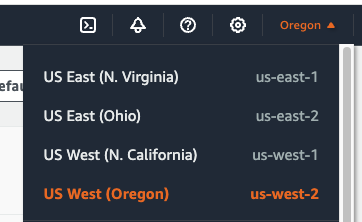

2. Deploy the CloudFormation stack by clicking [here](https://console.aws.amazon.com/cloudformation/home#/stacks/new?stackName=Glue-IRC-Int&templateURL=https://snowflake-corp-se-workshop.s3.us-west-1.amazonaws.com/VHOL_Iceberg_SNOW_AWS/setup/glue-snflk-devday-v1.5.yaml). This creates the S3 bucket and IAM role used throughout the guide.

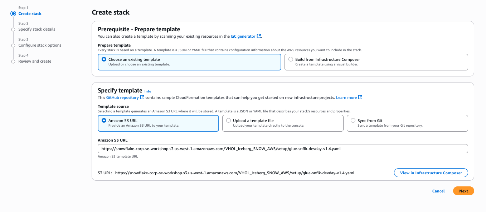

3. Click **Next** on the **Create stack** screen.
4. On **Specify stack details**, leave the default stack name `Glue-IRC-Int` and click **Next**.
5. On **Configure stack options**, scroll to the bottom, check `I acknowledge that AWS CloudFormation might create IAM resources`, and click **Next**.
6. On **Review and create**, click **Submit**.

Stack creation takes about a minute. Use the **Events** tab and the refresh button to monitor progress.

7. Once the stack status shows **CREATE_COMPLETE**, click the **Outputs** tab. Copy the **Role ARN** and **S3 bucket name** — you'll need both in later steps.

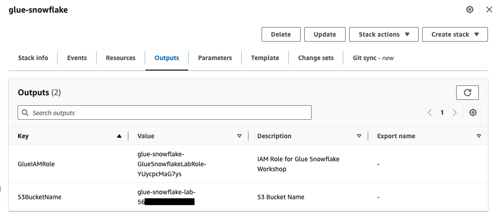


<!-- ------------------------ -->
## Use AWS Glue to create the Iceberg table

In this step you'll create a Glue Data Catalog database and table, then run a Glue ETL job to convert raw Parquet data on S3 to Apache Iceberg format.

### Create a Glue Database

1. In the AWS Console, navigate to **AWS Glue** and confirm the region is **US West (Oregon) us-west-2**.


2. In the left navigation pane under **Data Catalog**, click **Databases**, then click **Add database**.

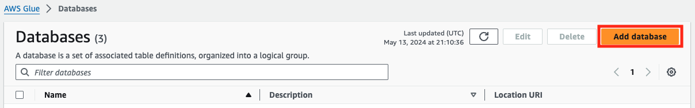

3. Name the database `iceberg` and click **Create database**.

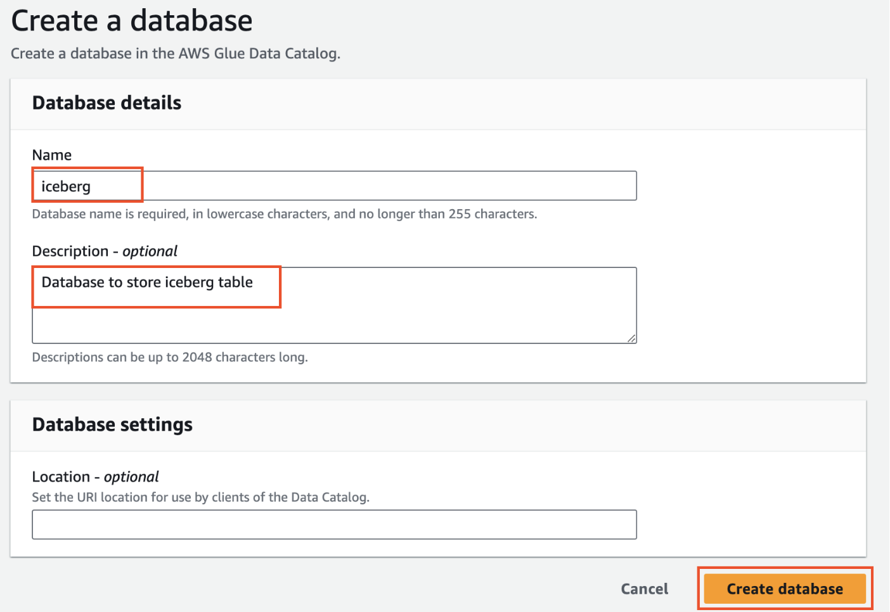

### Create a Glue Table

1. In the left menu, click **Data Catalog > Databases > Tables**, then click **Add table**.

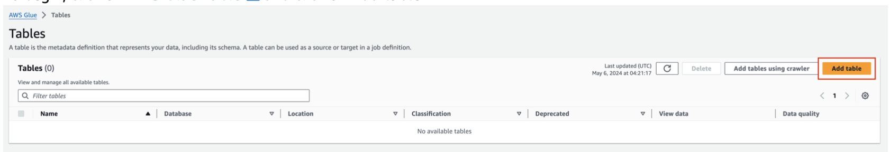

2. Set the following table properties and click **Next**:
   - **Name:** `quotes`
   - **Database:** `iceberg`
   - **Table format:** Apache Iceberg table
   - **IAM role:** Select the role from the CloudFormation Outputs (e.g. `Glue-IRC-Int-GlueSnowflakeLabRole-xxxx`)
   - Check the acknowledgment checkbox
   - **Data location:** `s3://glue-snowflake-lab-xxxx/iceberg/quotes/` — replace `glue-snowflake-lab-xxxx` with your S3 bucket name from the CloudFormation Outputs

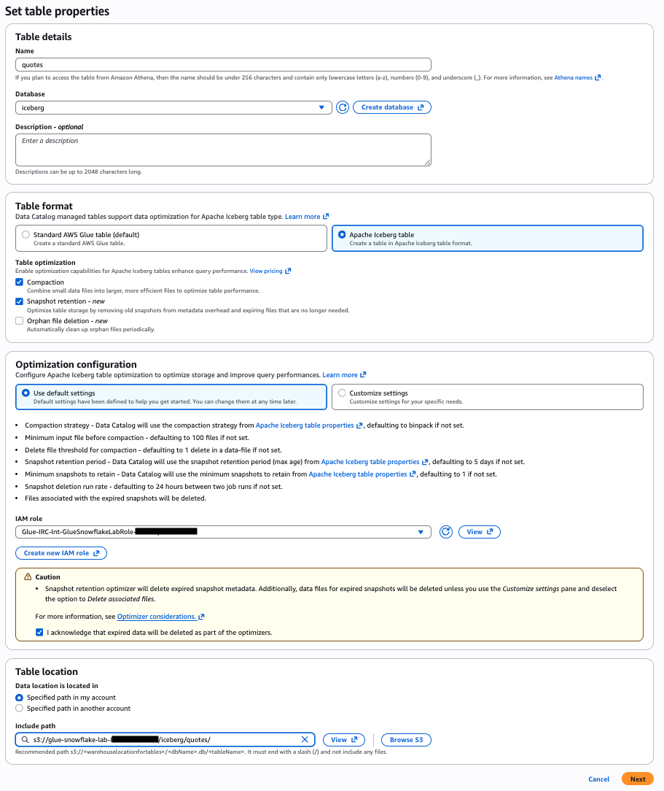

3. On the schema screen, click **Edit schema as JSON**.

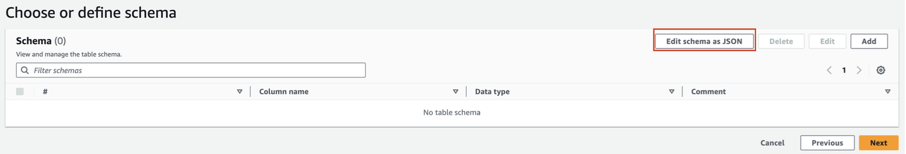

4. Download [quotes_schema.json](https://snowflake-corp-se-workshop.s3.us-west-1.amazonaws.com/VHOL_Iceberg_SNOW_AWS/setup/quotes_schema.json). Clear the `[ ]` placeholder, paste in the file contents, and click **Save**.

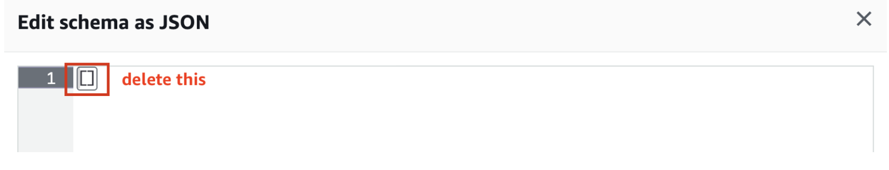

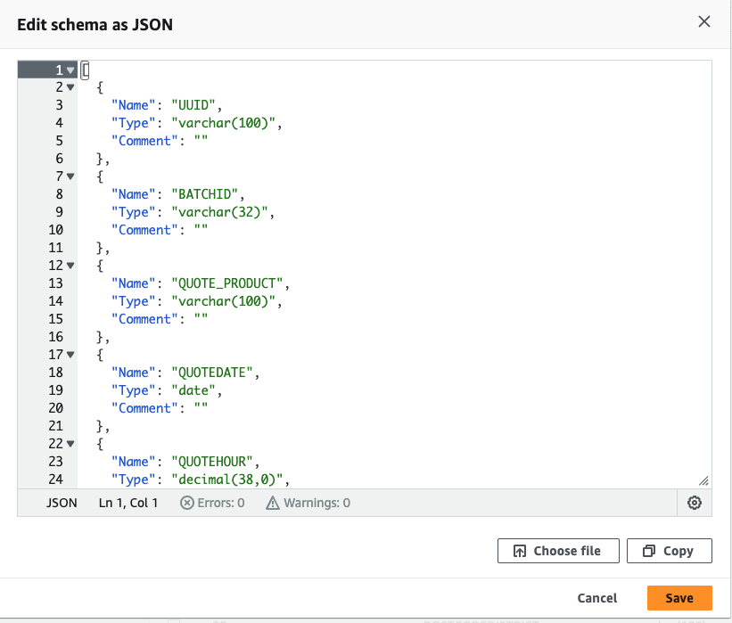

5. Verify the schema looks correct and click **Next**.

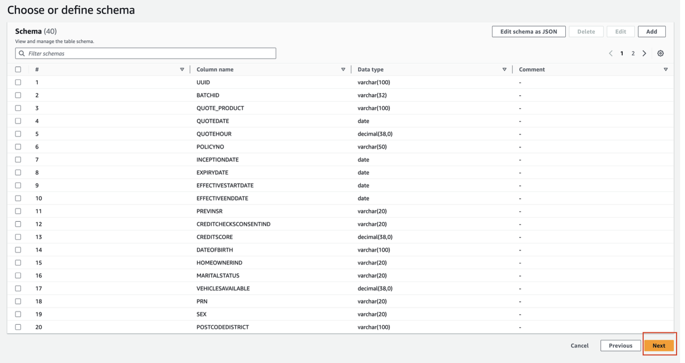

6. Click **Create** to finish creating the table.

### Create and Run the Glue ETL Job

This job reads raw Parquet quotes data from a public S3 bucket and writes it to your S3 bucket as an Iceberg table — no data copy or rewrite. The Glue Data Catalog table you just created is updated in place.

1. In the left menu under **ETL jobs**, click **Visual ETL**, then click the **Visual ETL** button.

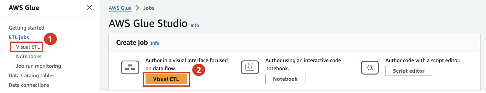

2. Rename the job to `Quotes - Raw to Iceberg`.
3. Under the **Job details** tab, select the IAM role from the CloudFormation Outputs.
4. Optionally reduce **Requested number of workers** to 2.

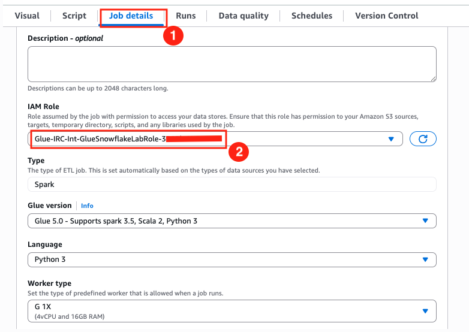

5. Click **Save**. A green banner confirms the job is saved.
6. On the **Visual** tab, click the **+** button and add an **S3** source node. Configure it:
   - **Name:** `Quotes - Raw`
   - **S3 URL:** `s3://aws-data-analytics-workshops/aws_glue/glue-snowflake/raw-data/quotes/`
   - **Data format:** Parquet

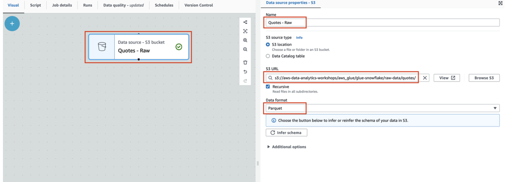

7. With the **Quotes - Raw** node selected, click **+** and add a **Transform - Change Schema** node.

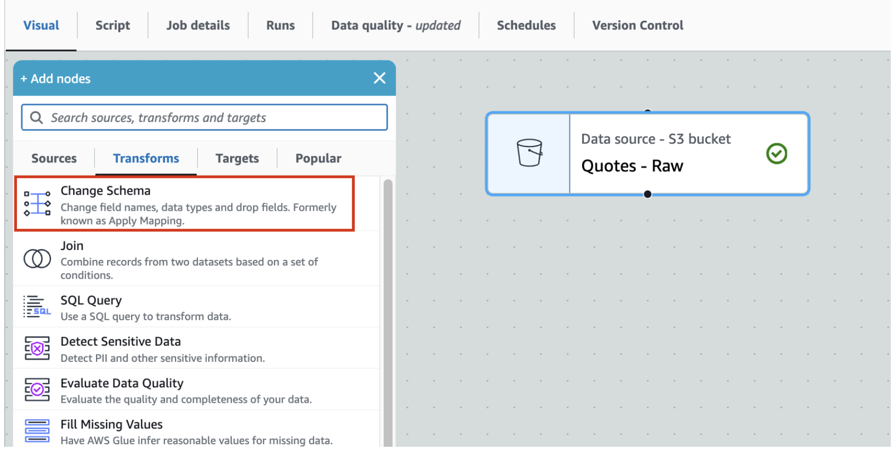

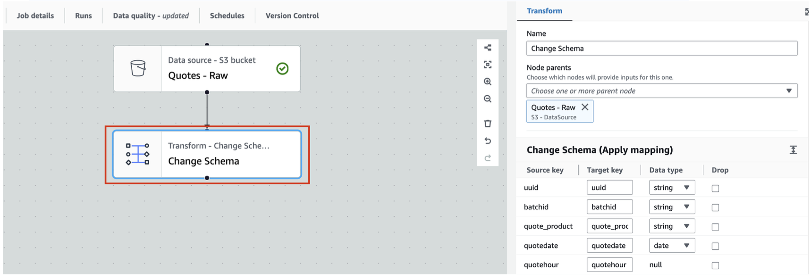

8. In **Change Schema**, change the data type of `uuid` to **varchar**.

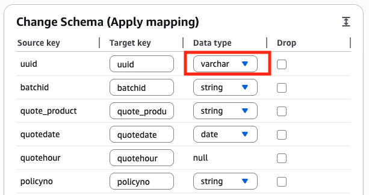

9. With **Change Schema** selected, click **+** and add an **Amazon S3** target node from the **Targets** tab. Configure it:
   - **Name:** `Quotes - Iceberg`
   - **Format:** Apache Iceberg
   - **Compression Type:** Snappy
   - **S3 Target Location:** `s3://glue-snowflake-lab-xxxx/iceberg/quotes/` — replace `glue-snowflake-lab-xxxx` with your bucket name
   - **Data Catalog update options:** Create a table in the Data Catalog and on subsequent runs, keep existing schema and add new partitions
   - **Database:** `iceberg`
   - **Table name:** `quotes`

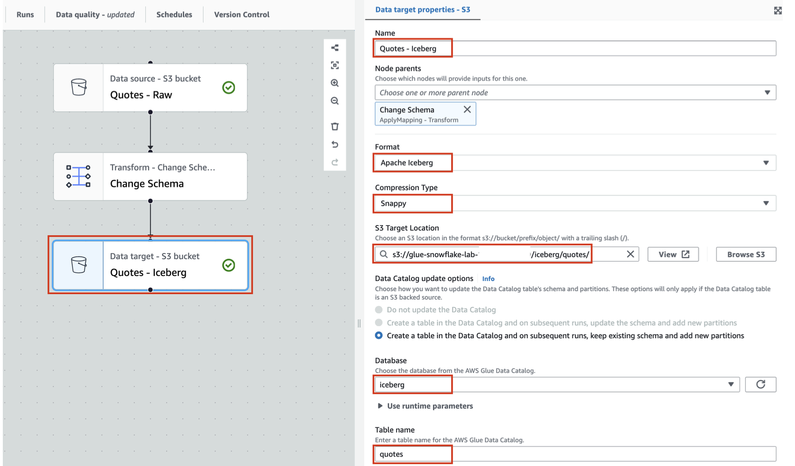

10. Click **Save**, then click **Run**. Navigate to the **Runs** tab to monitor progress.

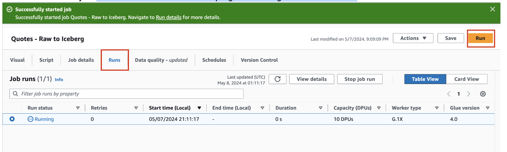

Once the job status shows **Succeeded**, the Iceberg table is live in your Glue Data Catalog.

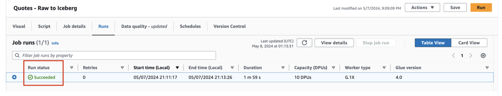

As a bonus step, open the S3 console and browse your bucket — you'll see the Iceberg data and metadata/manifest files Glue created under `iceberg/quotes/`.

<!-- ------------------------ -->
## Configure AWS Lake Formation

In this step you'll configure AWS Lake Formation to grant fine-grained access to the Iceberg table and enable credential vending. Credential vending allows Snowflake to request temporary S3 credentials from Lake Formation at query time — no external volume configuration needed on the Snowflake side.

### Step 1: Enable external engine access

1. Sign in to the [Lake Formation console](https://console.aws.amazon.com/lakeformation/) as a data lake administrator.
2. In the left navigation pane, choose **Administration > Application integration settings**.
3. Enable **Allow external engines to access data in Amazon S3 locations with full table access**.
4. Click **Save**.

### Step 2: Grant data location permissions

1. Under **Permissions**, select **Data locations** and click **Grant**.
2. For **IAM users and roles**, select the role created by CloudFormation.
3. For **Storage locations**, click **Browse** and select your S3 bucket.
4. Check **Grantable** and click **Grant**.

### Step 3: Register the data lake location

1. Under **Administration**, select **Data lake locations** and click **Register location**.
2. For **Amazon S3 path**, enter the S3 bucket path from the CloudFormation Outputs.
3. For **IAM role**, select the role created by CloudFormation.
4. For **Permission mode**, select **Lake Formation**.
5. Click **Register location**.

### Step 4: Grant table permissions to the IAM role

1. Under **Permissions**, choose **Data permissions** and click **Grant**.
2. Configure the following:
   - **Principals:** IAM users and roles → select the role created by CloudFormation
   - **Resources:** Named Data Catalog resources
   - **Catalog:** your AWS account ID
   - **Database:** `iceberg`
   - **Database permissions:** SUPER
   - **Grantable permissions:** SUPER
3. Click **Grant** and confirm the permission appears in the list.

> **Note:** SUPER permission is required for Snowflake to mount the Iceberg table via the Catalog-Linked Database using credential vending.

Your AWS setup is complete. Continue to the next step to configure Snowflake.

<!-- ------------------------ -->
## Setup Snowflake account and configure the AWS integrations

> **Used the Cortex Code fast path?** Skip this section — go directly to [Working with Iceberg tables in Snowflake](#working-with-iceberg-tables-in-snowflake).

In this step you'll create the Snowflake role, database, warehouse, and internal tables used in the lab, then create the Catalog Integration and Catalog-Linked Database that connect Snowflake to the Glue Data Catalog.

### Configure your Snowflake account

Download the two SQL files for this lab:

<button>

  [Setup SQL](https://snowflake-corp-se-workshop.s3.us-west-1.amazonaws.com/VHOL_Iceberg_SNOW_AWS/setup/hol_ice_setup_v1.2.sql)
</button>

<button>

  [Workflow SQL](https://snowflake-corp-se-workshop.s3.us-west-1.amazonaws.com/VHOL_Iceberg_SNOW_AWS/setup/hol_ice_workflow_v1.6.sql)
</button>

1. Log into your Snowflake account as a user with `ACCOUNTADMIN` privileges.
2. In the left menu, go to **Projects > Workspaces**, click **+ Add new**, and select **Upload Files**.

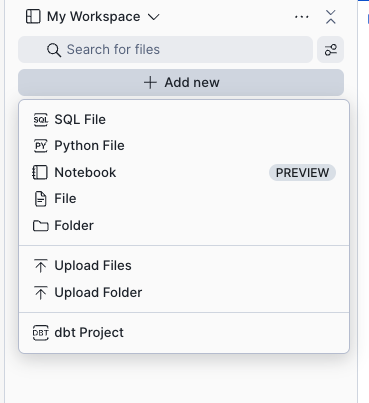

3. Upload both SQL files. They'll appear under **My Workspace**.
4. Open `hol_ice_setup_vxx.sql`. Run the following sections in order by selecting each block and clicking **Run**.

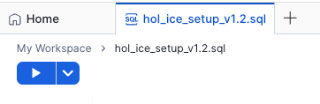

Create the role and grant account-level privileges:

```sql
USE ROLE SECURITYADMIN;

CREATE OR REPLACE ROLE HOL_ICE_RL COMMENT='Iceberg Role';
GRANT ROLE HOL_ICE_RL TO ROLE SYSADMIN;
```

```sql
USE ROLE ACCOUNTADMIN;

GRANT CREATE INTEGRATION ON ACCOUNT TO ROLE HOL_ICE_RL;
GRANT CREATE EXTERNAL VOLUME ON ACCOUNT TO ROLE HOL_ICE_RL;
GRANT CREATE DATABASE ON ACCOUNT TO ROLE HOL_ICE_RL;
GRANT CREATE WAREHOUSE ON ACCOUNT TO ROLE HOL_ICE_RL;
```

Create the database and warehouse:

```sql
USE ROLE HOL_ICE_RL;

CREATE OR REPLACE DATABASE HOL_ICE_DB;

CREATE OR REPLACE WAREHOUSE HOL_ICE_WH
  WITH WAREHOUSE_SIZE = 'XSMALL'
  INITIALLY_SUSPENDED = TRUE;
```

5. Select lines 44–110 and run them to create the internal `CUSTOMER` and `POLICIES` tables and load data.

### Configure the Snowflake Catalog Integration with Glue

Open `hol_ice_workflow_vxx.sql` from **My Workspace**. Set the worksheet context (lines 16–20):

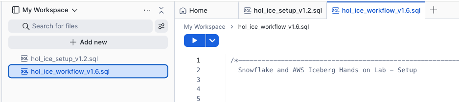

```sql
USE ROLE HOL_ICE_RL;

USE HOL_ICE_DB.PUBLIC;

USE WAREHOUSE HOL_ICE_WH;
```

You'll need two values from your AWS environment:
- **AWS Account ID** — from the top-right corner of the AWS Console

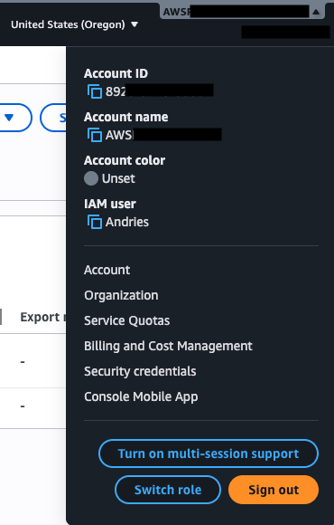

- **IAM Role ARN** — from the CloudFormation Outputs tab

> **Note:** This guide uses `CATALOG_SOURCE = ICEBERG_REST` with `CATALOG_API_TYPE = AWS_GLUE` — the current recommended approach for connecting to the Glue Data Catalog via the Iceberg REST API. If you have an older integration using `CATALOG_SOURCE = GLUE`, migrate to this approach to get access to Catalog-Linked Databases, vended credentials, and full IRC feature support.

Replace the placeholders and run the `CREATE CATALOG INTEGRATION` statement (lines 37–53):

```sql
CREATE OR REPLACE CATALOG INTEGRATION glue_catalog_irc_int
  CATALOG_SOURCE = ICEBERG_REST
  TABLE_FORMAT = ICEBERG
  CATALOG_NAMESPACE = 'iceberg'
  REST_CONFIG = (
    CATALOG_URI = 'https://glue.us-west-2.amazonaws.com/iceberg'
    CATALOG_API_TYPE = AWS_GLUE
    CATALOG_NAME = '<your-aws-account-id>'
    ACCESS_DELEGATION_MODE = VENDED_CREDENTIALS
  )
  REST_AUTHENTICATION = (
    TYPE = SIGV4
    SIGV4_IAM_ROLE = 'arn:aws:iam::<your-aws-account-id>:role/<your-cloudformation-role-name>'
    SIGV4_SIGNING_REGION = 'us-west-2'
    SIGV4_EXTERNAL_ID = 'snow-glue-ext-id'
  )
  ENABLED = TRUE;
```

> **`SIGV4_EXTERNAL_ID`**: This is a custom value you set — it ties to the trust policy in the next step. `snow-glue-ext-id` is the value used in this lab. You can use any string, or omit it to have Snowflake auto-generate one (retrieve the generated value via `DESC CATALOG INTEGRATION` afterward).

Run `DESC CATALOG INTEGRATION` to retrieve the value needed for the IAM trust policy:

```sql
DESC CATALOG INTEGRATION glue_catalog_irc_int;
```

Note the **`GLUE_AWS_IAM_USER_ARN`** value from the output — you'll paste it into the trust policy next.

### Update the IAM trust policy

1. In the AWS Console, navigate to **IAM > Roles** and open the CloudFormation role.
2. Click the **Trust relationships** tab, then **Edit trust policy**.

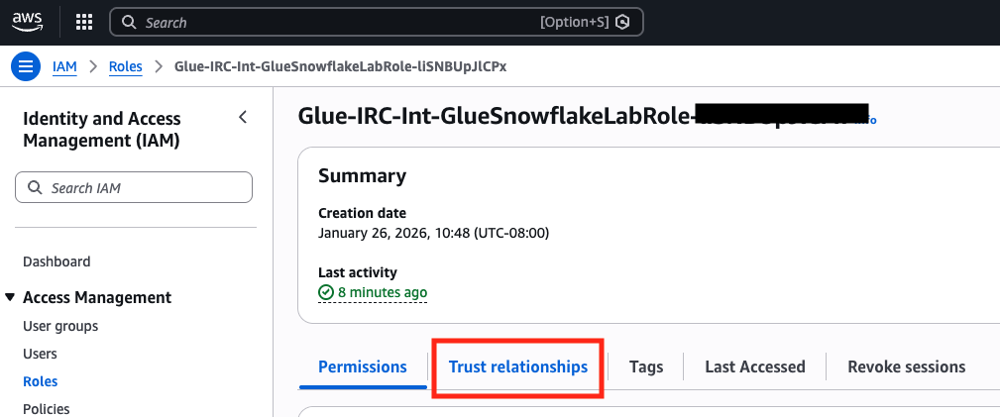

3. Replace the entire policy with the JSON below, substituting `GLUE_AWS_IAM_USER_ARN` from the Snowflake output:

```json
{
  "Version": "2012-10-17",
  "Statement": [
    {
      "Effect": "Allow",
      "Principal": {
        "Service": [
          "lakeformation.amazonaws.com",
          "glue.amazonaws.com"
        ]
      },
      "Action": "sts:AssumeRole"
    },
    {
      "Effect": "Allow",
      "Principal": {
        "AWS": "<GLUE_AWS_IAM_USER_ARN>"
      },
      "Action": "sts:AssumeRole",
      "Condition": {
        "StringEquals": {
          "sts:ExternalId": ["snow-glue-ext-id"]
        }
      }
    }
  ]
}
```

4. Click **Update policy**.

Verify the catalog integration is working:

```sql
SELECT SYSTEM$VERIFY_CATALOG_INTEGRATION('glue_catalog_irc_int');
```

The result should return success with no error codes or messages.

<!-- ------------------------ -->
## Working with Iceberg tables in Snowflake

In this step you'll create a [Catalog-Linked Database](https://docs.snowflake.com/en/user-guide/tables-iceberg-catalog-linked-database) (CLD) that auto-discovers the Iceberg tables in your Glue catalog, query the data from Snowflake, create a new Iceberg table, and write aggregate results back to S3.

### Create the Catalog-Linked Database

```sql
CREATE OR REPLACE DATABASE iceberg_linked_db
  LINKED_CATALOG = (
    CATALOG = 'glue_catalog_irc_int',
    NAMESPACE_MODE = FLATTEN_NESTED_NAMESPACE,
    NAMESPACE_FLATTEN_DELIMITER = '-',
    ALLOWED_NAMESPACES = ('iceberg')
  );
```

Check sync status:
```sql
SELECT SYSTEM$CATALOG_LINK_STATUS('iceberg_linked_db');
```

The result shows `"executionState":"RUNNING"` while tables are being discovered. Once sync completes, the Glue `iceberg` database and its tables appear in Snowflake.

### Query Iceberg tables

> **Note:** Glue object names (databases, schemas, tables) require double quotes in Snowflake SQL — Glue names are case-sensitive and may contain characters that conflict with Snowflake identifiers.

```sql
USE DATABASE iceberg_linked_db;
USE SCHEMA "iceberg";
SELECT * FROM "quotes" LIMIT 20;
```

### Create a new Iceberg table and write data

> **Why no external volume?** This lab uses `ACCESS_DELEGATION_MODE = VENDED_CREDENTIALS` — Lake Formation issues temporary S3 credentials at query time. Snowflake uses those credentials to write Iceberg data directly, so no separate external volume configuration is needed.

Replace `<your-s3-bucket>` with your bucket name from the CloudFormation Outputs:

```sql
CREATE OR REPLACE ICEBERG TABLE iceberg_linked_db."iceberg"."quote_analysis_ice" (
  "fullname"            STRING,
  "postcode"            STRING,
  "custid"              STRING,
  "ipid"                NUMBER(18,0),
  "productname"         STRING,
  "quotecount"          NUMBER(18,0),
  "policyno"            STRING,
  "quotedate"           DATE,
  "quote_product"       STRING,
  "originalpremium"     NUMBER(28,2),
  "totalpremiumpayable" NUMBER(28,2),
  "createddate"         DATE,
  "brand"               STRING,
  "branchcode"          STRING,
  "policy_status_desc"  STRING,
  "typeofcover_desc"    STRING,
  "insurer_name"        STRING,
  "inceptiondate"       DATE,
  "renewaldate"         DATE
)
BASE_LOCATION = 's3://<your-s3-bucket>/iceberg/quote-analysis-iceberg';
```

Combine the internal `CUSTOMER` and `POLICIES` tables with the Glue-backed `quotes` Iceberg table and write results to the new table:

```sql
INSERT INTO iceberg_linked_db."iceberg"."quote_analysis_ice"
SELECT
  c.fullname, c.postcode, c.custid, c.ipid, c.productname, c.quotecount,
  q."policyno", q."quotedate", q."quote_product", q."originalpremium", q."totalpremiumpayable",
  p.createddate, p.brand, p.branchcode, p.policy_status_desc,
  p.typeofcover_desc, p.insurer_name, p.inceptiondate, p.renewaldate
FROM
  hol_ice_db.public.customer c,
  "quotes" q,
  hol_ice_db.public.policies p
WHERE
  c.fullname   = q."fullname"
  AND c.postcode   = q."postcode"
  AND c.quotecount > 5
  AND c.custid     = p.custid;
```

Query the aggregate Iceberg table:

```sql
SELECT * FROM iceberg_linked_db."iceberg"."quote_analysis_ice" LIMIT 10;
```

This data is written as Iceberg to S3 and immediately visible in the Glue Data Catalog — other AWS query engines (Athena, EMR, etc.) can read it directly.

> **Optional:** Refresh the Database Explorer in Snowsight to see `iceberg_linked_db` and its tables. Open the S3 console to see the Iceberg data and metadata files Snowflake created under `iceberg/quote-analysis-iceberg/`. Open the Glue console to confirm the new table is registered.

<!-- ------------------------ -->
## Cleanup

Follow the steps below to ensure the deployed resources are cleaned up.
Snowflake:
  - Drop Snowflake warehouse
  ```sql
  DROP DATABASE HOL_ICE_WH;
  ```
  - Drop Snowflake database
  ```sql
  DROP DATABASE HOL_ICE_DB;
  ```
  - Drop Catalog-linked database
  ```sql
  DROP DATABASE iceberg_linked_db;
  ```
  - Drop Glue catalog integration 
  ```sql
  DROP CATALOG INTEGRATION glue_catalog_irc_int;
  ```
AWS:
  - Delete the Glue Studio Job
  - Delete the tables and database in Glue
  - Remove data locations in Lake Formation
  - De-register data lake locations in Lake Formation
  - Empty the S3 bucket
  - Delete Cloudformation Template


<!-- ------------------------ -->
## Conclusion and Resources

You've converted Parquet data to Iceberg format using AWS Glue, connected Snowflake to the Glue Data Catalog via the Iceberg REST API with Lake Formation vended credentials, and used a Catalog-Linked Database to query, create, and write Iceberg tables — all from Snowflake.

### What You Learned
- How to convert Parquet files to Iceberg format in-place using an AWS Glue ETL job
- How to configure Lake Formation credential vending for fine-grained Iceberg access control
- How to create a Snowflake Catalog Integration for AWS Glue using SIGV4 authentication and vended credentials
- How to create a Catalog-Linked Database to auto-discover and sync Iceberg tables from the Glue catalog
- How to read from, write to, and create Iceberg tables in Snowflake via the Catalog-Linked Database

### Related Resources
- [Snowflake Iceberg documentation](https://docs.snowflake.com/en/user-guide/tables-iceberg)
- [Configure a catalog integration for AWS Glue Iceberg REST](https://docs.snowflake.com/en/user-guide/tables-iceberg-configure-catalog-integration-rest-glue)
- [Snowflake Catalog-Linked Database](https://docs.snowflake.com/en/user-guide/tables-iceberg-catalog-linked-database)
- [AWS Glue Iceberg Documentation](https://docs.aws.amazon.com/glue/latest/dg/aws-glue-programming-etl-format-iceberg.html)
- [AWS Lake Formation Credential Vending](https://docs.aws.amazon.com/lake-formation/latest/dg/aws-lake-formation-api-credential-vending.html)


