summary: Design data models visually with SqlDBM for collaborative schema design, documentation, and direct Snowflake deployment.
id: data-modeling-with-sqldbm
categories: snowflake-site:taxonomy/solution-center/certification/quickstart, snowflake-site:taxonomy/solution-center/certification/partner-solution, snowflake-site:taxonomy/product/data-engineering
language: en
environments: web
status: Published 
feedback link: https://github.com/Snowflake-Labs/sfguides/issues
authors: Eric Ruiz

# Data Modeling With Snowflake + SqlDBM
<!-- ------------------------ -->
## Overview 

Relational database modeling enables instant visual review of a database landscape and the relationships between its entities, serving as a blueprint for your data.

[SqlDBM](https://www.SqlDBM.com) is an online database modeling platform that works with leading cloud platforms such as Snowflake and requires absolutely no coding to get started. In this Quickstart, you will see how you can model a sample Snowflake database in just a few clicks and begin taking advantage of all the time-saving features that SqlDBM delivers. 

### What you’ll learn 
* How to quickly diagram an existing schema through reverse engineering
* Create and manipulate database objects using time-saving features like copying and templates
* Collaboration when working on data modeling projects
* Sharing, documenting & data governance for your data models
* Track change history using revisions
* Forward engineering & deployment of changes to Snowflake

### What You’ll Use During the Lab

* An existing or trial [SqlDBM account](https://sqldbm.com/Home/)  

### What You’ll Build
* Automatically bring your models into the cloud with SqlDBM
* Enable both the business and IT personas with your data models
* Collaborate and share your data models
* Foward-Engineer data models into Snowflake

A sample schema diagram like the one we will create:

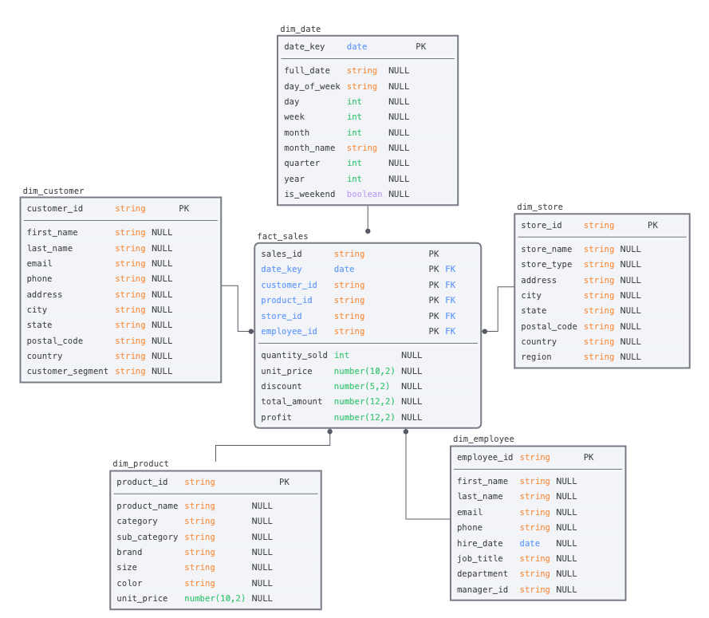

<!-- ------------------------ -->
## Creating a Project in SqlDBM

After logging in to [SqlDBM](https://www.SqlDBM.com), you will be taken to the Projects Dashboard. Otherwise, select “Dashboard” from the top-right dropdown.

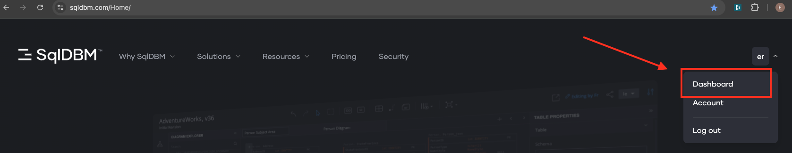  

### Reverse-Engineer Using Example Schema 
Follow the steps to create a Snowflake project and bring your schema: 

* Download our [example DDL](https://github.com/Snowflake-Labs/sfquickstarts/blob/master/site/sfguides/src/sqldbmguide/assets/sample_schema.sql) 
* Click the “Create Project” button at the top to get started.

* Hover over the “Snowflake” as the database type.

* Click the “Existing Database” to create a live connection to Snowflake.

* You can paste the contents directly into the text area on the screen.

* or upload the file by pressing the "Drop your file" button

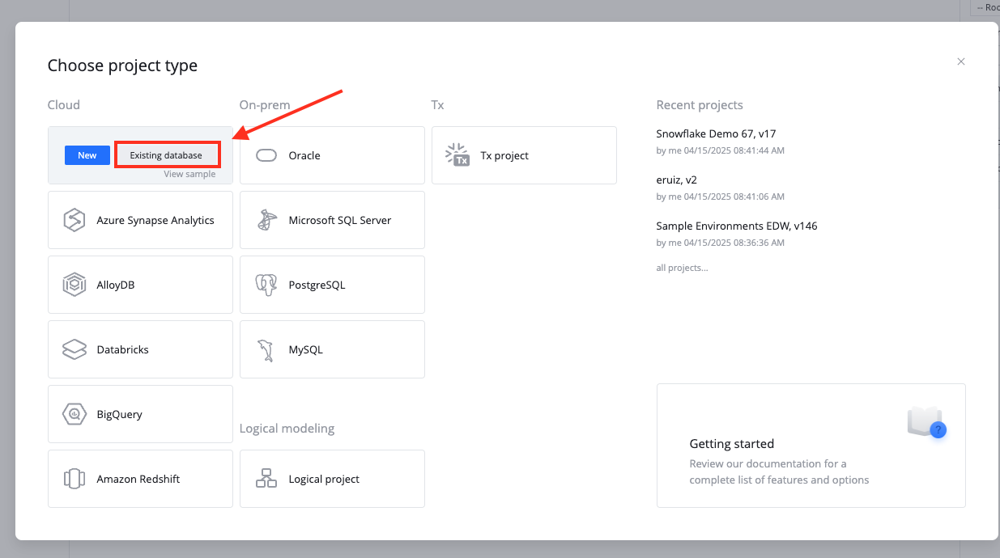

### Parse the script to create a project

* Press the up arrow icon / “Upload SQL Script” button at the top to parse the DDL provided.

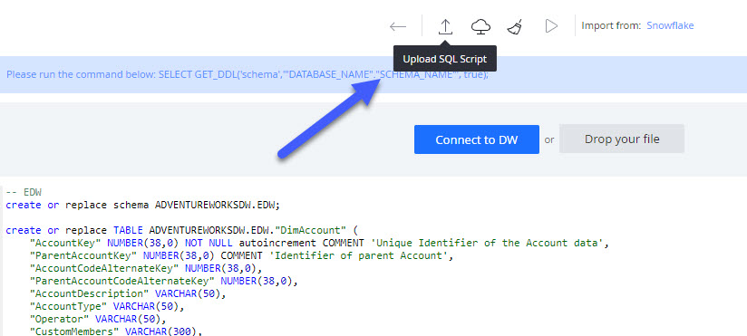

7. Review the objects that are being imported on the left panel. Optionally, you can exclude individual items from being imported by de-selecting the check-box next to them. 

8. Press the “Import” button to create a project with the selected objects. 

    * Parsing and importing DDL into a project is called **Reverse Engineering** in SqlDBM and is not limited to new projects. This can be done at any point to retrieve changes to the database made outside of SqlDBM from the Reverse Engineering screen. 
    * Note, this will not re-initiate the entire project. Users will be able to choose which objects are added, updated, or deleted from a project depending on whether or not they currently exist. 

    
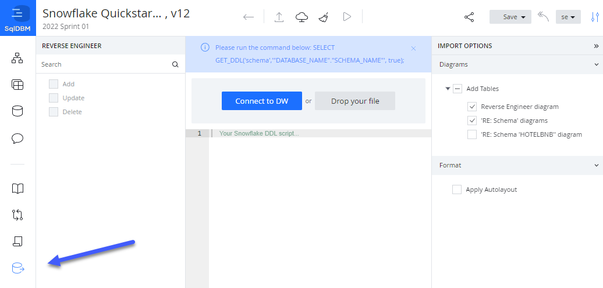

<!-- ------------------------ -->
## Organizing Your Data Model

### Add new diagram
1. There are several ways to create a new diagram.

2. Choose objects, hold the "Ctrl" key and click the "Plus" icon. That is the easiest way to add a new diagram with chosen objects.

3. Use the context menu by diagram item of Diagrams level on the side panel.

4. Use the bottom bar of Diagrams level on the side panel.

### Create a Subject Area
Subject areas serve as folders for keeping diagrams organized by categories such as department or project. Right-click on “Subject Areas” in the Diagrams screen and select “Add a Subject Area.”

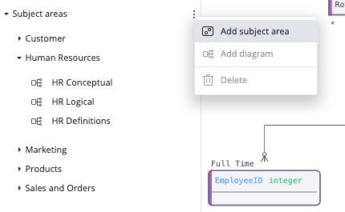

<!-- ------------------------ -->
## Standards, Conventions, and Mappings

You can add prefixes and suffixes to the names of different object types, define attribute names using naming rules and for bulk renaming of individual fields or auto-expansion of naming abbreviations using **Name Mappings**, **Case Standards** and **Glossary Terms**  .

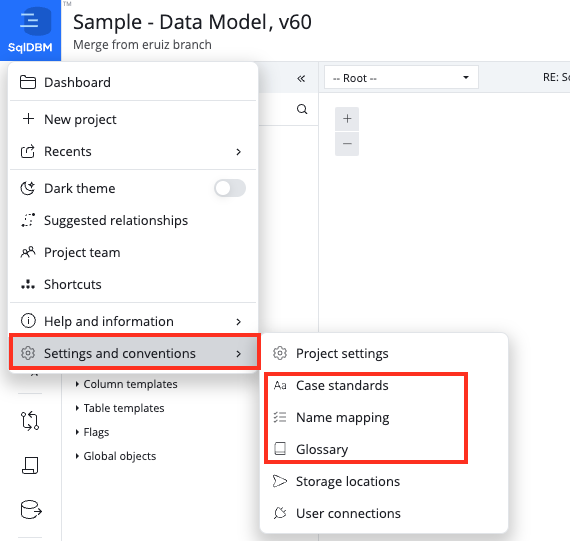

### Case Standards
1. Click the blue SqlDBM logo in the top left
2. Go down to the bottom option "Settings and Conventions"
3. Select "Case Standards" and use the option for UPPER_CASE
4. Click the button "Apply to existing objects"

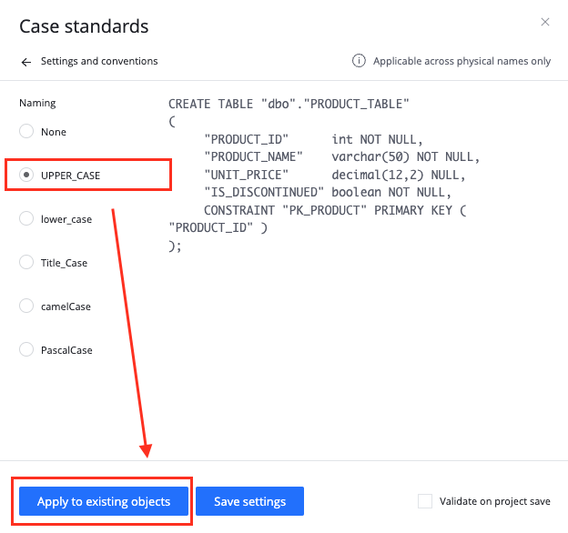

### Glossary
1. Go Back to the Menu and Select "Glossary"
2. Enter "CUSTOMER_ID" in the Name column
3. Enter "CUS_ID" in the Change To column
4. Click the button "Apply to existing objects"

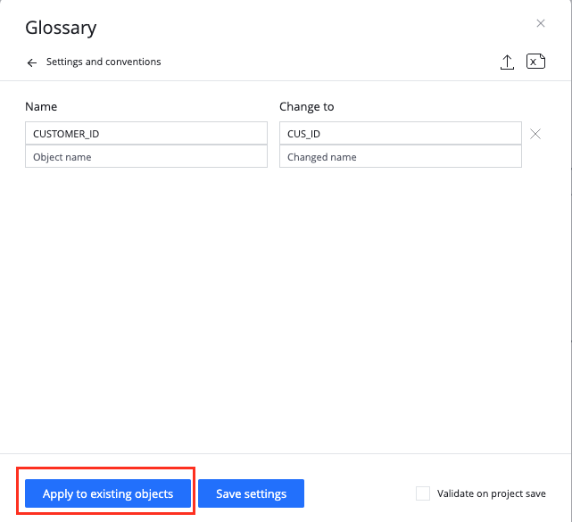

### Name Mappings
* Go Back to the Menu and Select "Name Mappings"
* Check the box next to Tables
* Add a "_T" for all your tables end with this(Example: ${TableName}_T)
* Click the button "Apply to existing objects"

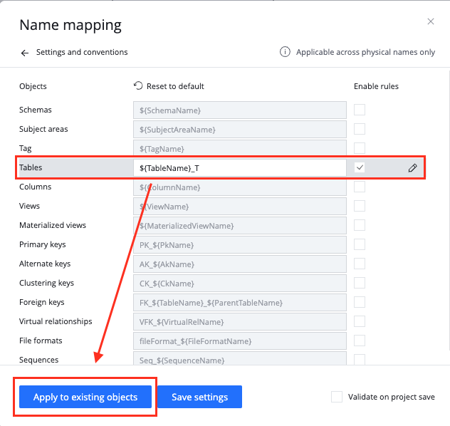

### Templates

1. Click on Database Explorer in left hand menu
2. Navigate to Column Templates
3. Hover your mouse over the Column template option and select "Create New"
4. Name your Template "Auditlog"
5. Add a new column to your template called "LastUpdated" with a data type of "timestamp"
6. Highlight your new AuditLog template and select the "Apply To Current Objects" setting
7. Your table template should now be applied to all objects

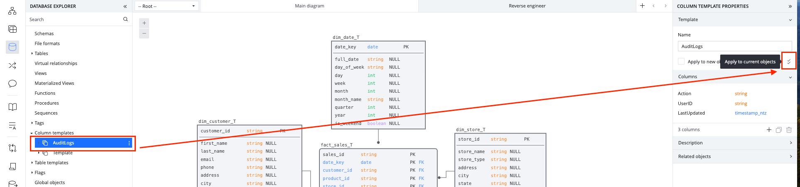

Templates come standard with SqlDBM wether you want to build templates for a set of columns or a template for an entire table.

* Table templates allow you to accelerate the build of tables that would follow a consistent pattern and reduce design time.
* Column Templates are a way to create and reuse common columns across the entire project. This allows you to automate one of the most redundant tasks associated with table creation and standardize those columns across your data model.

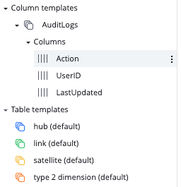

<!-- ------------------------ -->
## Share, Document & Model Governance

### Sharing Data Models

Sharing your data model is a crucial step in fostering transparency, collaboration, and alignment across teams. By making your data models accessible to stakeholders, developers, analysts, and business users, you enable a shared understanding of the data structure, which helps reduce miscommunication and speeds up decision-making. 

1. Invite users as consumers. This will give users read-only access to the data modeling project allow them to look at the data model and use SqlDBM's collaboration features to leave feedback and collaborate on data models. 

2. Use SqlDBM's iFrame feature to automatically integrate your ERD diagrams from SqlDBM into any tool of your choosing.

3. Use SqlDBM's integration with Confluence to share your models directly in your pages in Confluence.

4. Export out models as an image or excel file.

### Database Documentation

1. Click On Database documentation option from the left hand menu
2. Metadata can be added, edit or deleted within your data models from here
3. A **Report Page** can be generated that can be used to search and navigate through metadata within your data models

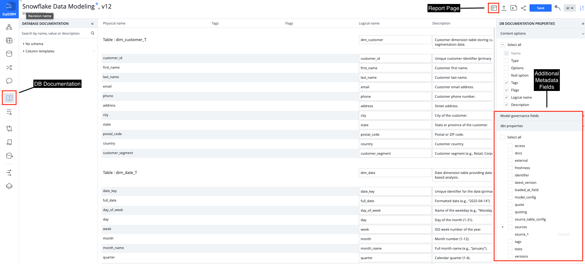

SqlDBM’s **Database Documentation** allows users to review and edit object-level comments in one centralized and searchable screen. The descriptions provided here are intended to help the team go beyond object definitions and provide meaningful details about the data contained in the tables.

### Model Governance

Model Governance will supplement existing projects and offer its own role, allowing users to administer new functionality, like Fields, Pages, and Reports, and open them up to everyone on the project team.

* Fields - Governance fields are additional metadata columns that can be added and maintained on the Database documentation screen. SqlDBM also provides dbt-specific properties through pre-built field templates such as freshness, tests and more. All of this metadata will be available for output as complete dbt compatible source and model YAML.

*  Pages - Extend documentation beyond the object level with rich text full-length content, embedded images, diagrams, styling, and formatting. Pages allow teams to maintain project-level overviews of things like metrics and KPI definitions, business terms, and operational outlines.

* Reports - An all-in-one project information portal in HTML format for end users with searchable object details, descriptions, and references. Reports offer a sleek interface for finding and navigating between related project assets.

<!-- ------------------------ -->
## Track Changes and Compare Model Versions

Every save in SqlDBM generates a versioned _revision_, which allows for change tracking and version control. SqlDBM projects store an infinite revision history, and any two revisions can be compared to track changes. The latest revision is indicated next to the project name at the top of the screen. 

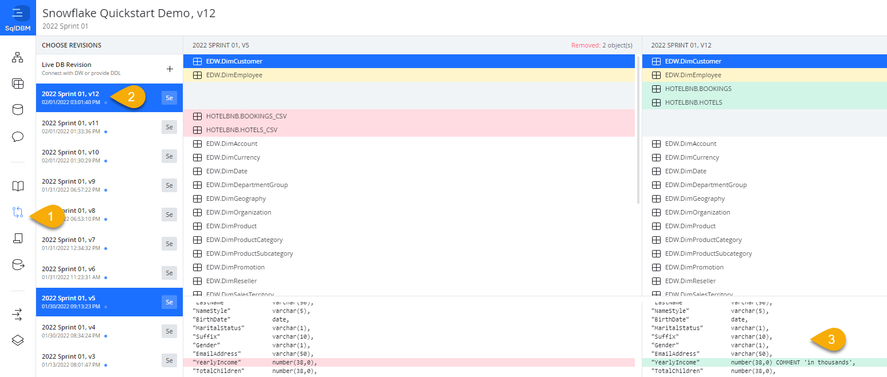

### Compare Revisions
Use the Compare Revisions feature to identify differences between your SqlDBM revisions within seconds. This feature helps you detect possible mistakes when migrating DB/DW across environments by comparing the tables and DDL scripts.

Click on "Compare Revisions" in the left pane. 

Select the two revisions that you would like to compare. 

You will see all the database objects listed in the revisions you have selected. Changes are highlighted based on the following colors: 

* Red - deleted objects
* Green - created objects
* Yellow - modified objects

<!-- ------------------------ -->
## Forward Engineer & Code Generation

### DDL and ALTER Script Generation
Forward Engineering allows users to export the database objects created in SqlDBM projects by generating SQL scripts. Through Forward Engineering, users can generate complete CREATE statements for selected objects or ALTER scripts for changes between project versions or environments.

### dbt YAML Genration
Users can forward engineer dbt-compatible source or model YAML for tables and views. By default, YAML output will include the object name, columns, and descriptions. Additional properties and meta fields can be maintained in Database documentation or enabled on the Forward engineering screen for complete control over the final YAML output.

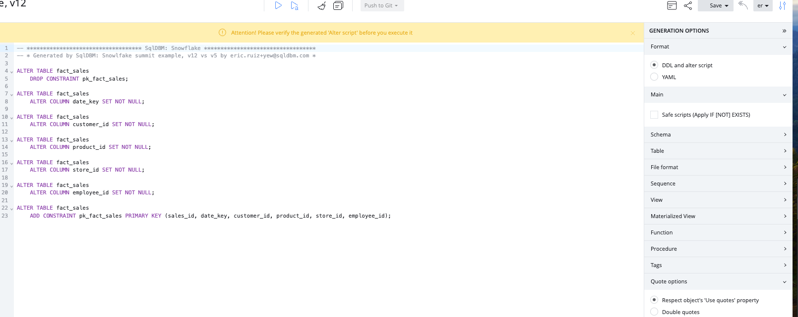

<!-- ------------------------ -->
## Collaborate and Work Together on Data Modeling Projects

### How to add collaborators
From the top menu of a project, click the share icon and enter an email address for a project member that has previously been added in the Admin Console.

### Team Communication
Team communication allows users to communicate with other team members directly through the tool. Comments can be linked to specific objects and are searchable and actionable through the functions provided by SqlDBM.

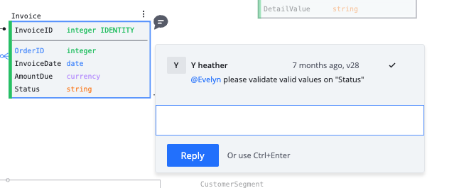

See below for details on the following features: 
* Create comments
* Tag team members
* Review and dismiss comments
* Edit comments
* Search and filter

### Concurrent Working

Concurrent Working allows users to work in parallel branches without having to lock a project. Changes made in any branch can be compared before merging to main and synchronized with any new updates that happen meanwhile.

Allows:
* Setup Concurrent Working
* Create branch
* Project sharing at the branch level
* Maintaining branches

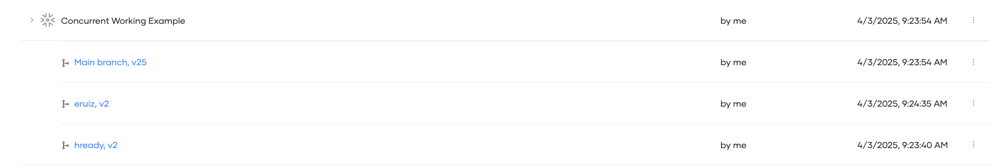

<!-- ------------------------ -->
## Logical Projects

### Database Agnostic Business Modeling
Logical modeling allows users to design independently of a specific database type and establish a foundational business model that can be shared or converted. Logical projects offer full control over the data type mapping, normalization, and naming convention settings for easy import and export from physical. 

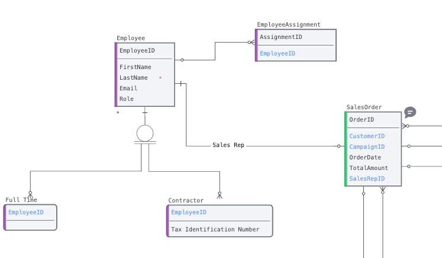

<!-- ------------------------ -->
## Schema Change Management

### DB Schema Monitoring 

DB Schema Monitoring periodically polls your cloud databases and alerts designated recipients if DDL changes are detected giving you the opportunity to take proactive measures.

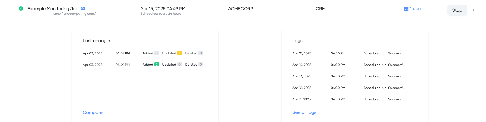

<!-- ------------------------ -->
## Conclusion & Next Steps

Visually guided database modeling can help an enterprise data team make sense of, and accelerate database development. In this Quickstart, we followed a simple development workflow: from creating and instantiating a new Snowflake project and schema, to making changes, all the way to deployment. However, the benefits of a centralized modeling tool extend well beyond the role of a developer. 

Whether it’s a project manager using **Compare Revisions** to track changes, a business user familiarizing themselves with a previously-unknown datamart through a relational diagram, or a new team-member becoming appraised of an organization through **Database Documentation** - doing this in a single tool and a coordinated fashion makes everyone’s job easier and ensures consistency throughout. 

### What we’ve covered
* Creating a project
* Reverse engineering a Snowflake database
* Configuring project defaults and the look and feel
* GUI-based no-code editing
* Collaboration
* Change tracking
* Forward Engineer & Code Generation

### Additional resources 
* If you have questions about any of the topics described in this Quickstart or additional functionality, please request a guided demo through our website: [SqlDBM](https://www.SqlDBM.com).
* Full documentation of all our features can be found in our [Help Center](https://intercom.help/SqlDBMhelpcenter/en).
* To learn more about database modeling best practices, find out about upcoming features, and stay connected to our growing data community, be sure to follow us on [LinkedIn](https://www.linkedin.com/company/sqldbm).
* Training videos, webinars, and new feature demos on our [Youtube channel](https://www.youtube.com/channel/UCxzY9EOGgPPhHCXj6h3ufsA).
