summary: Implement data mesh architecture with dbt Cloud on Snowflake for domain-driven data products and federated governance.
id: data-products-data-mesh-dbt-cloud
categories: snowflake-site:taxonomy/solution-center/certification/quickstart, snowflake-site:taxonomy/product/data-engineering
language: en
environments: web
status: Published
feedback link: https://github.com/Snowflake-Labs/sfguides/issues
authors: Sean McIntyre, Doug Guthrie


# Build Data Products and a Data Mesh with dbt platform

<!-- ------------------------ -->
## Overview

Welcome to the Build Data Products and Data Mesh with dbt platform Quickstart guide! Before you begin getting your hands into the technology, let's define what a data mesh is and describe what motivates the topic.

### What is a data mesh?

A data mesh is a decentralized data management architecture comprising domain-specific data. Instead of having a single centralized data platform, teams own the processes around their own data.

In a data mesh framework, teams own not only their own data, but also the data pipelines and processes associated with transforming it. A central data engineering team maintains both key data sets and a suite of self-service tools to enable individual data ownership. Domain-specific data teams then exchange data via well-defined and versioned contracts.

Data mesh architecture aims to solve the lingering issues in data systems by adopting the same approach to data systems that software engineering teams take to software systems. It does so by enacting the following four principles:

1. Decentralized domain-oriented data
2. Data as a product
3. Self-service data platform
4. Federated computational governance

In the end, an operational data mesh architecture may look something like this:

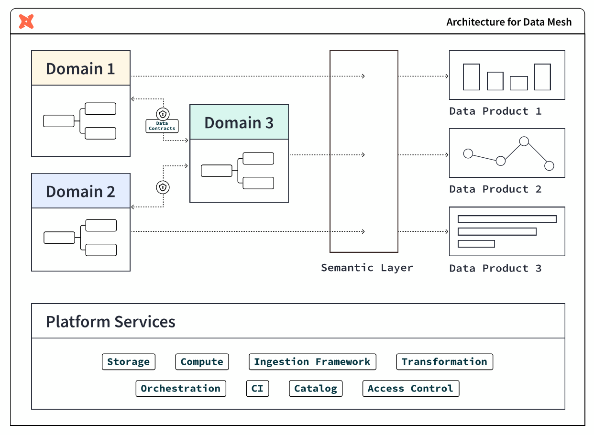

### Why you might need a data mesh

The following two conditions are indicators that you may benefit from a data mesh architecture.

#### Slowdowns and silos in the data monolith

The architectural choice to use a data monolith has numerous knock-on effects. Monolithic approaches break down a data processing pipeline into several stages-ingestion, processing, and serving.

A single team often handles all of these stages. This approach can work at first but breaks down with scale. As more and more requests come in, the data engineering team finds itself unable to respond to them promptly. This leads to an ever-growing backlog of feature requests and bug fixes. This slows down the pace of innovation and also leads to the system becoming more brittle over time.

In this approach, data engineering teams often can't gain the full context behind the underlying data in this model. Since they're responsible for maintaining data sets from multiple disparate teams, they often don't fully understand the business rationale behind the data.

This can lead them to make uninformed -- and, sometimes, harmful -- decisions that impact business decision-making. For example, a data engineering team may format data in a way that the sales department doesn't expect. This can lead to broken reports or even lost data.

#### Complex and brittle systems

Monolithic systems rarely have clear contracts or boundaries. This means that data formatting changes upstream can break an untold number of downstream consumers. The result? This can cause teams to avoid making necessary changes for fear of breaking everything. This leads to monolithic systems gradually becoming outdated, brittle, and hard to maintain.

Finally, collaboration also becomes more difficult in a monolithic system. Since no one is familiar with the entire codebase, it takes more people and more time to complete data-related tasks. This affects time to market for new products and features -- which impacts the company’s bottom line.

### What is a data product?

A data product is a useful information asset, accessed by a clearly defined interface, with an expectation of timeliness and correctness by the consumer. Teams build and maintain data products using processes and technologies that they are responsible for, though they could be supported by other platform-oriented teams.

The properties of a data product are:

- **Discoverable:** it is easy to find
- **Addressable:** it has a unique, labeled location for retrieval
- **Trustworthy and truthful:** it is worthy of consumer trust
- **Self-describing:** it comes with product information
- **Interoperable:** it works with other products
- **Secure and governed:** it has proper access controls
- **Useful:** it has value

### What you will learn

Throughout this guide, imagine yourself building a data platform with Snowflake and dbt platform for your organization, starting with two teams:

1. **Central data team:** a team of experienced data engineers who build foundational data marts in Snowflake organized in a star schema of fact and dimensional tables
2. **Finance team:** a team that includes data analysts in the finance department who want to own their data and data processes

Each step of the guide will learn how to use features of both Snowflake and dbt platform to achieve building **data products**.

### What you will build

At the end of this guide, you will have achieved:
- **Federated governance**
- A small scale **data mesh** 
- And **self-service data platforms**, as an alternative to a monolithic data architecture

### What this guide doesn't cover

- **Interfaces other than SQL:** This guide focuses on building data products within Snowflake using batch-processing of data with SQL. The access interface is SQL, which is powerful due to its ubiquity in the data management industry, however is not all encompassing. Other kinds of data products interfaces include: REST APIs, FTPs, dashboards, and spreadsheet management tools. They are outside of the scope of this guide.

- **Organizational structure:** Data mesh is a broad organizational strategy that covers not only technology and process, but also crucially the organization of people. You will not receive advice in this guide on how to organize people -- instead this is already in-place at your organization through the various teams, business units, departments, subsidiaries, and so on -- cobbled together through the passage of time.

- **Building a business case for data mesh:** This guide also doesn't cover how to build a business case for data mesh. Adopting the principles in this guide are good general best practices for any data team. However, if you are looking to tackle larger organizational inefficiencies to meet business goals by rolling out a data mesh strategy, then you may likely need a business case in order to show the value and return on investment of your endeavors to your management and leadership, and attach it to strategic initiatives. To learn more about this step, you can refer to dbt Labs' [Guide to Data Mesh e-book](https://8698602.fs1.hubspotusercontent-na1.net/hubfs/8698602/Guide%20to%20data%20mesh%20eBook%20V2.pdf).

### What you will need

#### Snowflake

Here are the requirements for this Quickstart Guide:

- Account admin access to a Snowflake Enterprise or Business Critical account
- Access to the TPCH dataset, specifically in the `SNOWFLAKE_SAMPLE_DATA` database and the `TPCH_SF1` schema.

In the following step within this Quickstart Guide, you will be given instructions on how to sign-up for a Snowflake account.

> 
> 
> **You must use a Snowflake Enterprise account.** Snowflake Standard Edition is not sufficient, due to usage of Snowflake Enterprise features.

#### dbt platform

Here are the requirements for this Quickstart Guide:

- Account admin access to a dbt platform Enterprise account
- Set your development and deployment [environments](https://docs.getdbt.com/docs/dbt-cloud-environments) to use dbt version 1.6 or later. You can also choose the "Keep on latest version" option to always use the latest version of dbt.

In the following step within this Quickstart Guide, you will be given instructions on how to sign-up for a dbt platform account. Live webinar attendees should use this workshop signup page[https://cloud.getdbt.com/workshop] and the passcode provided by your instructor. For others, we recommend using Snowflake Partner Connect.

> 
> 
> **You should use a dbt platform Enterprise account.** It is possible to complete most of the steps with other editions of dbt platform, but some steps require Enterprise.

<!-- ------------------------ -->
## Launch Snowflake and dbt platform for this Quickstart

In this step, you will set up Snowflake and dbt platform accounts for use in the rest of the Quickstart guide.

### Sign up for a Snowflake Enterprise trial account

Navigate to [signup.snowflake.com](https://signup.snowflake.com/?utm_source=snowflake-devrel&utm_medium=developer-guides&utm_cta=developer-guides) and follow the steps. A few things to note:
- Select an Enterprise account
- Select a cloud provider - Microsoft Azure, Amazon Web Services, or Google Cloud Platform.  Choose the one that makes the most sense for you.
- Additionally, select a region.  Select one of the US West regions as it's known to have partner connect available.

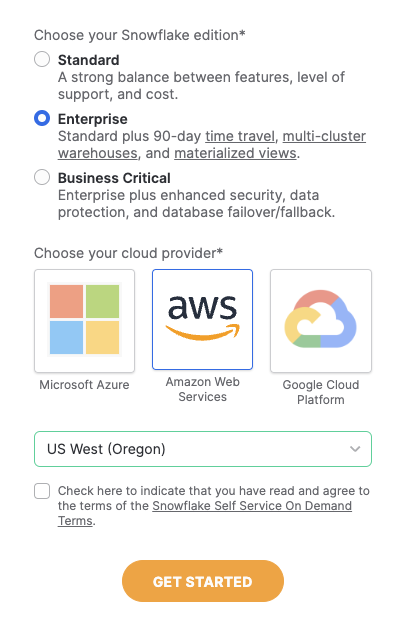<br>

An email to activate your account will be sent after following the steps in the sign up flow.  Click the button in the email "Click to Activate"

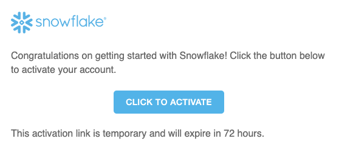<br>

Next, specify a username and password for your account.

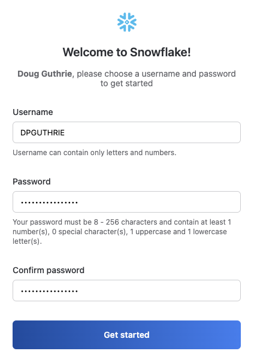<br>

When prompted to either explore a sample data set or load data into snowflake, select the "Skip for Now" button.

**Your Snowflake account is ready!**

### Option A (for live webinar or workshop attendees): Register for a dbt platform Enterprise account 

1. Go to this workshop [signup page](https://cloud.getdbt.com/workshop).
2. Enter your first and last name. Select "Build Data Products at Scale with dbt platform (July 2025)" as the workshop name unless otherwise specified by your live instructor.
3. Use the passcode provided by your live instructor.
4. Magic! Save down your password. You can now skip Option B below and move to section 3 of the quickstart guide.

### Option B (for all others): Launching dbt platform by Snowflake Partner Connect

1. We recommend that you use [Snowflake Partner Connect](https://docs.snowflake.com/en/user-guide/ecosystem-partner-connect.html) to set up your dbt platform account and project. Using Partner Connect will allow you to create a complete dbt account with your [Snowflake connection](https://docs.getdbt.com/docs/dbt-cloud/cloud-configuring-dbt-cloud/connecting-your-database#connecting-to-snowflake), [managed repository](https://docs.getdbt.com/docs/dbt-cloud/cloud-configuring-dbt-cloud/cloud-using-a-managed-repository), [environments](https://docs.getdbt.com/docs/guides/managing-environments), and credentials with just a few clicks.

2. In the Snowflake UI, click on `Data Products` in the lefthand sidebar, then `Partner Connect` which is located within the `Data Products` section. <br>

    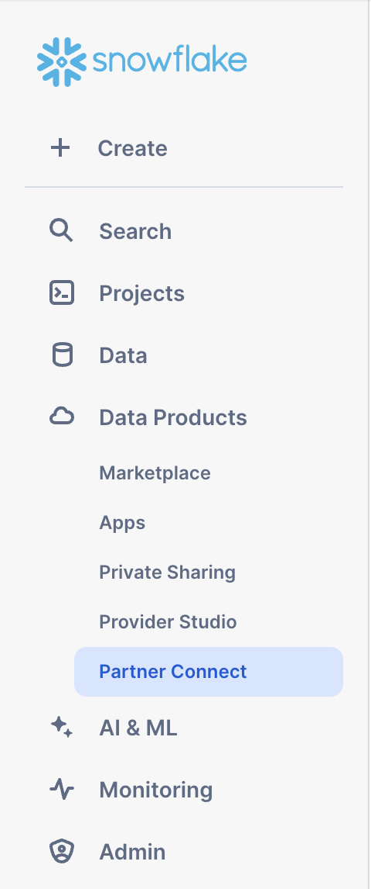<br>

    Check to make sure your role is set as the ACCOUNTADMIN role. If you're using the classic console, the Partner Connect button will be in the top bar just right of center.

3. Find the dbt tile by typing `dbt` into the `Search Partner Connect` search bar. Click on the dbt tile.

    

4. You should now see a popup that says `Connect to dbt` that contains all of the associated objects created by Partner Connect. Click on the `Optional Grant` dropdown menu and add `Snowflake_Sample_Data` in the text box. This will grant your new dbt user role access to the database. Once that’s entered, click `Connect`. This will create a dedicated dbt user, database, warehouse, and role for your dbt platform trial.

    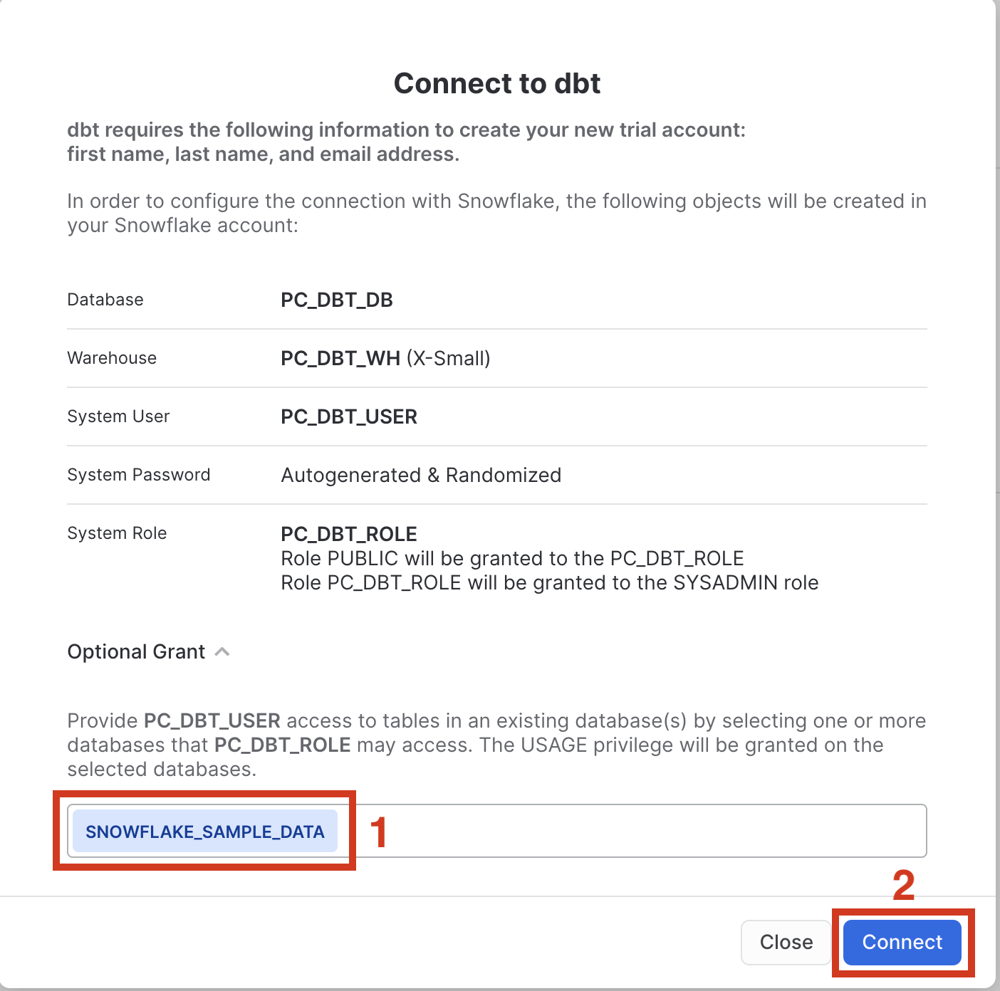

5. When you see the popup that says `Your partner account has been created`, click on `Activate`.

    

6. You should be redirected to a dbt platform registration page. If your email is already associated with a dbt platform account, you'll see the screen below.  Fill out the Account Name and click "Complete Registration".  That will then redirect you to the login screen.  Fill out the form and make sure to save the password somewhere for login in the future. <br>

    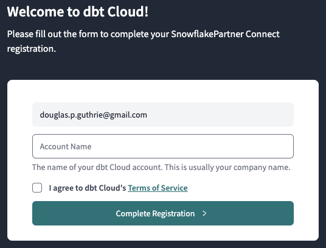

If this is your first time in dbt platform, you'll see the screen below.  Add your Account Name and a password for your user.

  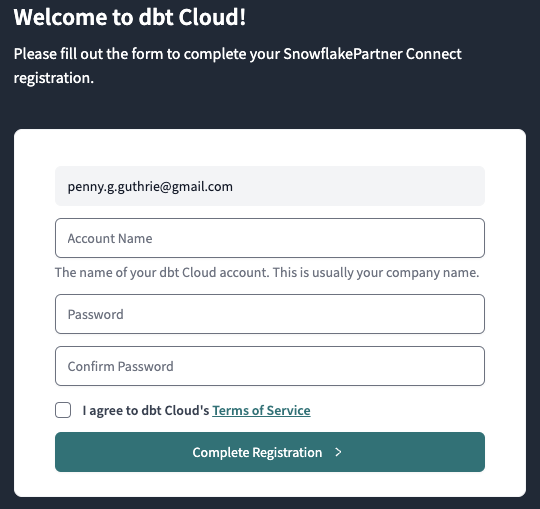

7. You should now be redirected to your dbt platform account, complete with a connection to your Snowflake account, a deployment and a development environment, as well as a sample job.

    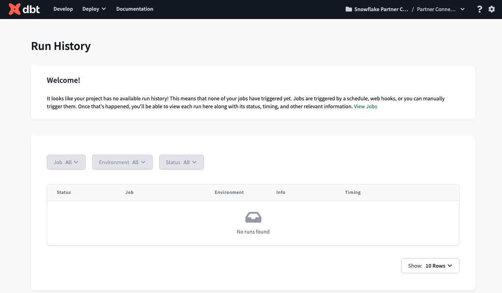

8. To help you version control your dbt project we have connected it to a [managed repository](https://docs.getdbt.com/docs/dbt-cloud/cloud-configuring-dbt-cloud/cloud-using-a-managed-repository), which means that dbt Labs will be hosting your repository for you. This will give you access to a git workflow without you having to create and host the repository yourself. You will not need to know git for this workshop; dbt platform will help guide you through the workflow. In the future, when you're developing your own project, feel free to use [your own repository](https://docs.getdbt.com/docs/dbt-cloud/cloud-configuring-dbt-cloud/cloud-installing-the-github-application). This will allow you to play with features like [Slim CI](https://docs.getdbt.com/docs/dbt-cloud/using-dbt-cloud/cloud-enabling-continuous-integration-with-github) builds after this workshop.

9. Now it is best to upgrade this dbt platform account to Enterprise. If you are participating in the **Snowflake Summit Hands On Lab session**, [please use this form](https://forms.gle/S7P9Rw1Udbfxf7TdA) to submit your account information so your account can be upgraded for the duration of the Hands On Lab.  The required information can be found by navigating to Account Settings.  The Account ID should be in the top section "Account Information" - this is what we'll need to upgrade your account.

<!-- ------------------------ -->
## Set up Snowflake and dbt platform

In this step, you will be setting up Snowflake and dbt platform for two teams: the central data team and the finance team, as shown in the diagram below. You will be using least privileged access principles in order to properly secure the data.


### About the two teams

The **central data team** is well-established in the organization and the average team member is capable of building data pipelines that powers business reporting across various domains: finance, marketing, sales, customer support, and so on. The team uses data management best practices like organizing data in dimensional models for maximum re-usability in various BI and AI/ML applications.

The **finance team** is an operational team. Finance team members are accustomed to consuming dashboards and building spreadsheets, however more and more demands on data has led to the finance team owning and managing more data to rapidly respond to changing demands. And so, the team has upskilled team members and brought on an analytics engineer to use Snowflake and dbt platform, in order to create data pipelines building off of the foundation project for daily reporting use-cases.

### Provision Snowflake and dbt platform the setup

> 
> 
> dbt platform Enterprise is required to create more than one project in an account. If you do not have a dbt platform Enterprise account and wish to try this, [please contact dbt Labs](https://www.getdbt.com/contact).

[Use this app](https://sf-dbt-mesh-setup.streamlit.app/) to quickly provision the Snowflake and dbt platform setup for this Quickstart Guide. To do so, you'll need to first locate the account ID (Settings > Account) and then create a Service Token with Account Admin priveleges:

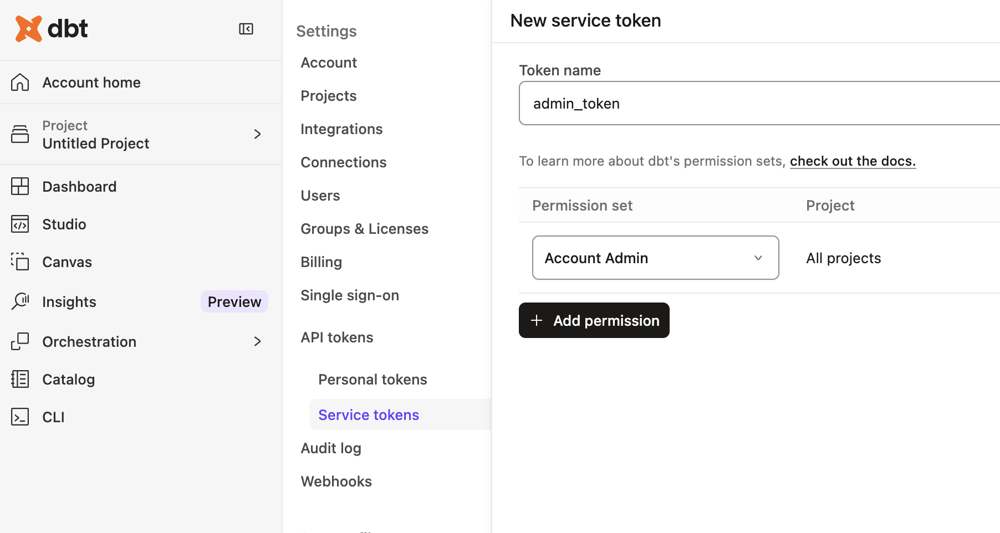

Come back to this guide when you have successfully followed the steps in the app!

The app creates the following resources for you:

- A `foundational_role` Snowflake role for creating and managing resources in the `foundational_db` database using the `foundational_wh` warehouse. It will also be able to administer data governance responsibilities, and grant appropriate permissions for masking and tagging.
- A `foundational_pii_reader_role` Snowflake role for users who can access PII data unmasked.
- A `finance_role` Snowflake role for creating and managing resources in the `finance_db` database using the `finance_wh` warehouse.
- A `Foundational Project` dbt platform Project for the central data team to build their transformations.
- A `Finance Project` dbt platform Project for the finance team to build their transformations on top of the Foundational Project.

Before we jump into the next section, let's take a moment to setup our developer credentials (click **Account Settings** and then **Credentials**) for both the foundational and finance projects. Add in the Snowflake username and password you just created: 

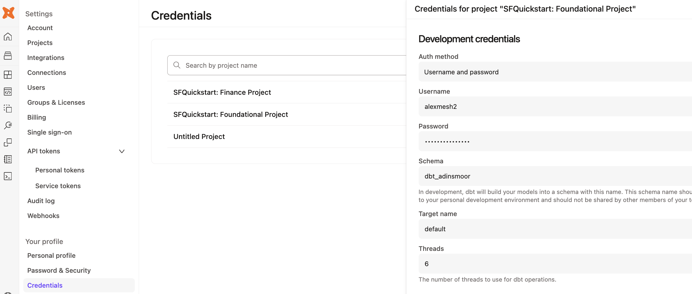

### Additional features to secure dbt platform and Snowflake

When setting up dbt platform for production, there are four recommended security options to configure. They are out-of-scope for this particular Quickstart Guide, but worth mentioning at this point:

- [**Snowflake OAuth:**](https://docs.getdbt.com/docs/cloud/manage-access/set-up-snowflake-oauth) Require developers to connect their dbt platform Developer account to their Snowflake account, in order to govern data access. When this is setup, dbt platform users will only be able to access the data that their Snowflake user has been granted.
- [**Snowflake Key Pair authentication:**](https://docs.getdbt.com/docs/cloud/connect-data-platform/connect-snowflake#key-pair) For scheduled production workloads in dbt platform, use the Snowflake Key Pair authentication mechanism rather than username and password, in order to rotate credentials as per your organization's policy.
- [**dbt platform Role Based Access Controls:**](https://docs.getdbt.com/docs/cloud/manage-access/about-user-access#role-based-access-control) Set up roles within dbt platform to govern what dbt platform permissions users can have. For example, you can set up a finance team role so they do not have write access to the central data team project resources.
- [**dbt platform SSO:**](https://docs.getdbt.com/docs/cloud/manage-access/sso-overview) Require developers to use your organization's SSO platform to log into dbt platform, and exchange SAML information to auto-assign dbt platform roles based on the permissions set in your organization's Identity Provider.

### Wrapping up this step

With the Snowflake and dbt platform resources provisioned in this step, you have begun laying the first layer of an interoperable and secure data mesh. dbt platform adds a layer of addressability and discoverability to the data platform. In the next step, you will build your first data product.

Here is where you are in the journey towards a data product:

- 👉🔜 **Discoverable:** it is easy to find
- 👉🔜 **Addressable:** it has a unique, labeled location for retrieval
- **Trustworthy and truthful:** it is worthy of consumer trust
- **Self-describing:** it comes with product information
- 👉🔜 **Interoperable:** it works with other products
- 👉🔜 **Secure and governed:** it has proper access controls
- **Useful:** it has value

<!-- ------------------------ -->
## Build foundational project

Now it's time for you to add dbt code in the foundational project using the dbt platform IDE. Using the sample TPCH dataset provided by Snowflake, the dbt code will create a `fct_orders` table representing all of the orders within our organization. The code below has three layers of transformations: raw data sources, staging models, and core business logic. And by using dbt, you automatically have end-to-end data lineage.

### Setup the new project

Here are the steps:

1. Navigate back to the foundational project via the account / project dropdown in the top-right section of the navbar.
2. Then, navigate to the **dbt platform Studio (IDE)** via the **Studio** dropdown in the navbar to verify your setup.
3. If the repo you are working on is empty, click the **Initialize dbt project** button and commit the changes.
4. Create a new branch.
5. Delete the `models/example` folder.  
6. Navigate to the `dbt_project.yml` file and rename the project (line 5) from `my_new_project` to `foundational_project`.
7. In your `dbt_project.yml` file, remove lines 39-42 (the `my_new_project` model reference).
8. In the **File Explorer**, hover over the models directory and click the **...**, then select **Create Folder**.
9. Create two new folders: `staging` and `marts`.  **If you've done this right, these directories will be inside the `models` directory.**

### Create the staging layer

Now that you've set up the foundational project, let's start building the data assets. Set up the staging layer as follows:

1. Create a new YAML file `models/staging/sources.yml`.
2. Declare the sources by copying the following into the file and clicking **Save**.

```yaml
sources:
  - name: tpch
    description: "TPCH data source from Snowflake Sample Data"
    database: snowflake_sample_data
    schema: tpch_sf1
    tables:
      - name: orders
        description: "One record per order"
      - name: customer
        description: "One record per customer"
      - name: lineitem
        description: "One record per line item within a single order (1 -> n)"
```

3. Create a `models/staging/stg_customers.sql` file to select from the `customers` table in the `tpch` source.

```sql
with source as (

    select * from {{ source('tpch', 'customer') }}

),

cleanup as (

    select
    
        c_custkey as customer_key,
        c_name as name,
        c_address as address, 
        c_nationkey as nation_key,
        c_phone as phone_number,
        c_acctbal as account_balance,
        c_mktsegment as market_segment,
        c_comment as comment

    from source

)

select * from cleanup
```

4. Create a `models/staging/stg_orders.sql` file to select from the `orders` table in the `tpch` source.

```sql
with source as (

    select * from {{ source('tpch', 'orders') }}

),

renamed as (

    select
    
        o_orderkey as order_key,
        o_custkey as customer_key,
        o_orderstatus as status_code,
        o_totalprice as total_price,
        o_orderdate as order_date,
        o_clerk as clerk_name,
        o_orderpriority as priority_code,
        o_shippriority as ship_priority,
        o_comment as comment

    from source

)

select * from renamed
```

5. Create a `models/staging/stg_line_items.sql` file to select from the `line_items` table in the `tpch` source.

```sql
with source as (

    select * from {{ source('tpch', 'lineitem') }}

),

renamed as (

    select
    
        l_orderkey as order_key,
        l_partkey as part_key,
        l_suppkey as supplier_key,
        l_linenumber as line_number,
        l_quantity as quantity,
        l_extendedprice as gross_item_sales_amount,
        l_discount as discount_percentage,
        l_tax as tax_rate,
        l_returnflag as return_flag,
        l_linestatus as status_code,
        l_shipdate as ship_date,
        l_commitdate as commit_date,
        l_receiptdate as receipt_date,
        l_shipinstruct as ship_instructions,
        l_shipmode as ship_mode,
        l_comment as comment,

        -- extended_price is actually the line item total,
        -- so we back out the extended price per item
        (gross_item_sales_amount/nullif(quantity, 0))::decimal(16,4) as base_price,
        (base_price * (1 - discount_percentage))::decimal(16,4) as discounted_price,
        (gross_item_sales_amount * (1 - discount_percentage))::decimal(16,4) as discounted_item_sales_amount,

        -- We model discounts as negative amounts
        (-1 * gross_item_sales_amount * discount_percentage)::decimal(16,4) as item_discount_amount,
        ((gross_item_sales_amount + item_discount_amount) * tax_rate)::decimal(16,4) as item_tax_amount,
        (
            gross_item_sales_amount + 
            item_discount_amount + 
            item_tax_amount
        )::decimal(16,4) as net_item_sales_amount

    from source

)

select * from renamed
```

### Create the marts layer

Now set up the marts layer by creating a file `models/marts/fct_orders.sql` to build a fact table with order details:

```sql
{{
    config(
        materialized='table',
    )
}}

with orders as (
    
    select * from {{ ref('stg_orders') }}

),

line_items as (
    
    select * from {{ ref('stg_line_items') }}

),

customers as (

    select * from {{ ref('stg_customers') }}
),

order_item_summary as (

    select 
        order_key,
        sum(gross_item_sales_amount) as gross_item_sales_amount,
        sum(item_discount_amount) as item_discount_amount,
        sum(item_tax_amount) as item_tax_amount,
        sum(net_item_sales_amount) as net_item_sales_amount
    from line_items
    group by 1

),

final as (

    select 
        orders.order_key, 
        orders.order_date,
        orders.customer_key,
        orders.status_code,
        orders.priority_code,
        orders.ship_priority,
        orders.clerk_name,
        customers.name,
        customers.market_segment,
        order_item_summary.gross_item_sales_amount,
        order_item_summary.item_discount_amount,
        order_item_summary.item_tax_amount,
        order_item_summary.net_item_sales_amount
    from orders
    inner join order_item_summary
        on orders.order_key = order_item_summary.order_key
    inner join customers
        on orders.customer_key = customers.customer_key
)

select *
from final
order by order_date
```

### Build the project

Navigate to the **Command bar** at the very bottom of the IDE and execute `dbt build`. This will both validate the work you've done thus far and build out the requisite models into your sandbox within Snowflake.

At this point, you may also see what you have built by looking at the **Lineage tab** in the dbt platform IDE, and as shown in the graphic below.

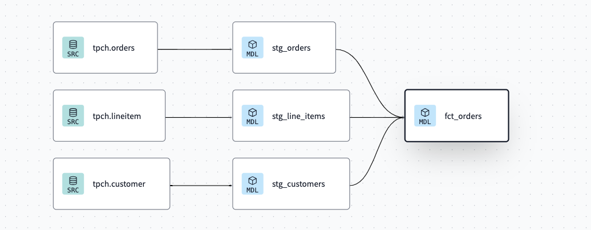

### Committing your changes

To finish this step up, go to the **Version control** section in the IDE to:

1. Click the **Commit and Sync** button to commit your changes.
2. **Merge** your changes to the main or production branch.

### Additional features to build data products

- [**dbt platform CLI:**](https://docs.getdbt.com/docs/cloud/cloud-cli-installation) In this guide, we are using the dbt platform IDE available within the web browser. dbt platform enables data practitioners to also develop with a local dbt platform CLI using a locally-installed code editor of their choice.
- [**dbt Visual Studio (VS) Code Extension:**](https://docs.getdbt.com/docs/install-dbt-extension) Additionally, the dbt extensions for VS Code and Cursor enhance local development. The dbt extension is powered by the dbt Fusion engine..
- [**dbt platform IDE linting and formatting:**](https://docs.getdbt.com/docs/cloud/dbt-cloud-ide/lint-format) To keep data product code quality high and follow your team's coding standards, you can use the built-in linters and formatters in dbt platform.

### Wrapping up this step

You now have built the first useful tables in the foundational project, which any user or application can access using SQL. In the next step, you will secure the PII access to privileged users.

Here is where you are in the journey towards a data product:

- 🔜 **Discoverable:** it is easy to find
- 🔜 **Addressable:** it has a unique, labeled location for retrieval
- **Trustworthy and truthful:** it is worthy of consumer trust
- **Self-describing:** it comes with product information
- 👉✅ **Interoperable:** it works with other products
- 🔜 **Secure and governed:** it has proper access controls
- 👉✅ **Useful:** it has value

<!-- ------------------------ -->
## Apply Snowflake masking to PII data

Congratulations! You built a useful dataset. But, it's not secure. Organizational data privacy policies require Personally Identifiable Information (PII) to be restricted only to a few select people within the organization. Naturally, this restriction is best checked within Snowflake itself, as various applications within the organization access data, so restricting the data at the source helps protect your customers' privacy.

### Setting up data masking tags and policies in Snowflake

Use Snowsight to execute the following commands to create [object tags](https://docs.snowflake.com/en/user-guide/object-tagging#label-object-tags-ddl-privilege-summary) and a [data masking policy](https://docs.snowflake.com/en/user-guide/security-column-ddm-intro).

```sql
use role foundational_role;
use database foundational_db;

-- Create a tag for PII data
create tag if not exists foundational_db.prod.pii_data;

-- Create a masking policy for string data
create or replace masking policy foundational_db.prod.pii_mask_string as (val string) returns string ->
  case
    when is_role_in_session('foundational_pii_reader_role') then val
    else '****'
  end;
  
-- Assign the masking policy to the tag
alter tag foundational_db.prod.pii_data set masking policy foundational_db.prod.pii_mask_string;
```

### Apply the Snowflake tags while building dbt models

Now it's time to jump into dbt platform to use a [model post-hook](https://docs.getdbt.com/reference/resource-configs/pre-hook-post-hook) to apply the masking policy to the `name` column of the `fct_orders` dbt model immediately after the table is built.

Open up the `fct_orders.sql` file and modify the config block at the top to include the `post_hook` argument:

```sql
{{
    config(
        materialized='table',
        post_hook="alter table {{ this }} modify column name set tag foundational_db.prod.pii_data = 'name'"
    )
}}
```

### Additional features to govern and secure

- [**dbt-tags package:**](https://dbt-tags.iflambda.com/latest/index.html) In the above steps, you created tags and masking policies directly in Snowflake using SQL statements. To scale this approach further, you can use the dbt-tags package to manage these tags in configuration files within your dbt platform project and use a DataOps approach to apply the policies. This package was created by the dbt and Snowflake experts at Infinite Lambda.

### Wrapping up this step

You have now secured the PII produced in this data product so it is restricted to privileged users, governed by native Snowflake features. In the next step, you will add model contracts and enforce grants with dbt.

Here is where you are in the journey towards a data product:

- 🔜 **Discoverable:** it is easy to find
- 🔜 **Addressable:** it has a unique, labeled location for retrieval
- **Trustworthy and truthful:** it is worthy of consumer trust
- **Self-describing:** it comes with product information
- ✅ **Interoperable:** it works with other products
- 👉✅ **Secure and governed:** it has proper access controls
- ✅ **Useful:** it has value

<!-- ------------------------ -->
## Add model contracts and enforce Snowflake grants

Now that you have set up with data masking, it's time to set up proper grants to the foundational project's `fct_orders` table, add a model contract, and make it accessible to other dbt projects.

By using these configurations within your project, you'll be, in effect, creating a stable set of APIs that your downstream projects are able to reliably consume.

### Adding the model YAML metadata

To begin, add the file `models/marts/core.yml` and add the code below:

```yaml
models:
  - name: fct_orders
    description: "This model contains order information from the transactional systems of the company."
    
    # Model access setting
    access: public
    
    config:
      # Model contract setting
      contract:
        enforced: true
      
      # Grant setting
      grants:
        select: ['foundational_pii_reader_role', 'finance_role']
    
    columns:
      - name: order_key
        data_type: int
        description: "The unique identifier for each order"
        tests:
          - unique
          - not_null

      - name: order_date
        data_type: date
        description: "The date and time when the order was placed"

      - name: customer_key
        data_type: int
        description: "The identifier for the customer who placed the order"
        tests:
          - not_null

      - name: status_code
        data_type: varchar
        description: "A code representing the current status of the order"

      - name: priority_code
        data_type: varchar
        description: "A code indicating the priority level of the order"

      - name: ship_priority
        data_type: int
        description: "The priority level for shipping the order"

      - name: clerk_name
        data_type: varchar
        description: "The name of the clerk responsible for processing the order"

      - name: name
        data_type: varchar
        description: "The name associated with the order, such as the product name or order name"

      - name: market_segment
        data_type: varchar
        description: "The segment of the market to which the order is targeted or classified"

      - name: gross_item_sales_amount
        data_type: numeric(38, 3)
        description: "The total sales amount for items in the order before any discounts or taxes"

      - name: item_discount_amount
        data_type: numeric(38, 3)
        description: "The total discount amount applied to items in the order"

      - name: item_tax_amount
        data_type: numeric(38, 3)
        description: "The total tax amount applied to items in the order"

      - name: net_item_sales_amount
        data_type: numeric(38, 3)
        description: "The total sales amount for items in the order after discounts and taxes have been applied"
```

This YAML file does the following:

- It sets the `fct_orders` [model access level](https://docs.getdbt.com/docs/collaborate/govern/model-access) to public, which means other projects in the dbt platform account are now able to reference it.
- It will add and enforce a [model contract](https://docs.getdbt.com/docs/collaborate/govern/model-contracts). This will enable dbt to do a couple things: 1) run a "preflight" check that ensures the model's query will return a set of columns with names and data types matching the ones you have defined and 2) include the column names, data types, and constraints in the DDL statements it submits to the data platform, which will be enforced while building or updating the model's table.
- The [grants](https://docs.getdbt.com/reference/resource-configs/grants) config is used to set permissions or grants for a resource. When a model is run, dbt will run grant and/or revoke statements to ensure that the permissions on the database object match the grants you have configured on the resource.

### Committing your changes

To finish this step up, go to the **Version control** section in the IDE and:

1. Click the **Commit and Sync** button to commit your changes.
2. **Merge** your changes to the main or production branch.

### Additional features for model governance

- [**dbt model versions:**](https://docs.getdbt.com/docs/collaborate/govern/model-versions) How do you make a change to the structure of the `fct_orders` model once downstream users and applications use it and expect its structure to remain the same due to the model contract? That is where dbt model versions come in, to allow for multiple versions of a model to co-exist for a limited period of time, while downstream queries are migrated.
- [**Snowflake Private Listings:**](https://other-docs.snowflake.com/en/collaboration/provider-listings-creating-publishing) With Marketplace features now native to Snowflake, you can use dbt platform to manage listings and deploy them alongside your code, keeping the listings governed in version control.
- [**Persisting docs to Snowflake:**](https://docs.getdbt.com/reference/resource-configs/persist_docs) Enabling the `persist_docs` configuration will commit the dbt documentation directly to Snowflake as comments, for use by other applications.

### Wrapping up this step

In this step you added a straightforward YAML file, and now `fct_orders` is a tested data model with documentation, will have the proper grants applied when built, and is publicly available for other dbt platform projects to use. In the next step, you will build the foundational project in production.

Here is where you are in the journey towards a data product:

- 🔜 **Discoverable:** it is easy to find
- 👉🔜 **Addressable:** it has a unique, labeled location for retrieval
- 👉✅ **Trustworthy and truthful:** it is worthy of consumer trust
- 👉✅ **Self-describing:** it comes with product information
- ✅ **Interoperable:** it works with other products
- ✅ **Secure and governed:** it has proper access controls
- ✅ **Useful:** it has value

<!-- ------------------------ -->
## Create and run a dbt platform job

Before a downstream team can leverage assets from this foundational project, you will need to run a [deployment job](https://docs.getdbt.com/docs/deploy/deploy-jobs) successfully.

### Setting up the job

To run your first deployment dbt platform job, you will need to create a new dbt platform job.

1. Click **Orchestration** and then **Jobs**. 
2. Click **Create job** and then **Deploy job**.
3. Fill in details about the job, calling it **Daily Job**.
4. Select the **Generate docs on run** option. This will enable dbt platform to pull in metadata from the warehouse to supplement the documentation found in the **Catalog** section.

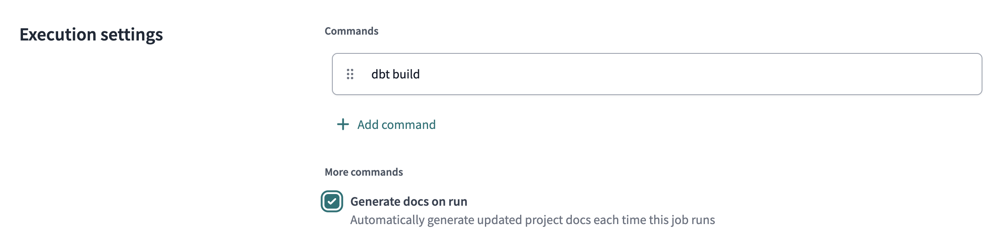

5. You may optionally set a schedule for the the job to run on.
6. Save the job
7. Then, click **Run now** to trigger the job.

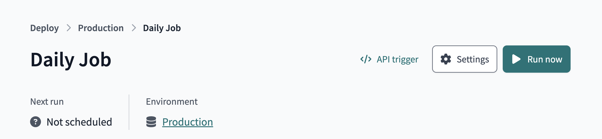

### Additional job features for a data mesh

- [**Continuos integration (CI) jobs:**](https://docs.getdbt.com/docs/deploy/ci-jobs) How can you catch data quality and contract errors, before your production runs? That's where CI jobs can help -- to check data quality on every Pull Request.
- [**Job chaining:**](https://docs.getdbt.com/docs/deploy/deploy-jobs#trigger-on-job-completion--) The "Trigger Job On Completion" option in dbt platform Jobs allows for jobs not only to run on a schedule, but also one after another.
- [**Model timing tab:**](https://docs.getdbt.com/docs/deploy/run-visibility#model-timing) The model timing tab within each dbt platform job run page helps identify the longest-running queries on Snowflake within the particular job, in order to optimize them and save on platform costs.

### Wrapping up this step

In this step, you ran a dbt platform job that deployed a production version of the data to Snowflake and registered the project metadata in dbt platform's metadata storage. This was necessary for the next step, which is to reference the Foundational data from within the Finance dbt platform project.

Here is where you are in the journey towards a data product:

- 🔜 **Discoverable:** it is easy to find
- 👉🔜 **Addressable:** it has a unique, labeled location for retrieval
- ✅ **Trustworthy and truthful:** it is worthy of consumer trust
- ✅ **Self-describing:** it comes with product information
- ✅ **Interoperable:** it works with other products
- ✅ **Secure and governed:** it has proper access controls
- ✅ **Useful:** it has value

<!-- ------------------------ -->
## Adding the Finance project

In this penultimate step, you will now set up dbt platform to build the finance team's data product by building off the foundational data product, the result of which is an architecture as shown in the diagram below.

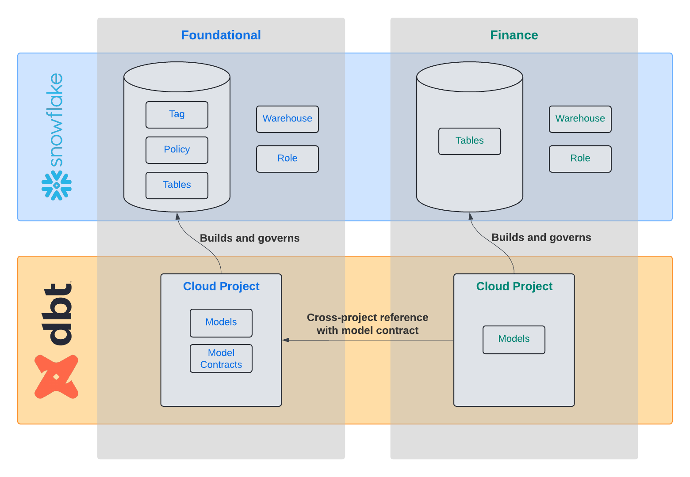

### Setup the project

> 
> 
> ⚠️ This section requires a dbt platform Enterprise account.
> 
> If you are participating in the **Snowflake Summit Hands On Lab session**, [please use this form](https://forms.gle/S7P9Rw1Udbfxf7TdA) to submit your account information so your account can be upgraded for the duration of the Hands On Lab.
>
> Otherwise, you may request a dbt platform Enterprise account for evaluation purposes [from the dbt Labs team](https://www.getdbt.com/contact).

1. First, select the **Finance Project** from the dbt platform project selector.
2. Now, open up the **dbt platform IDE** in the **Studio** toolbar.
3. If you’ve also started with a new git repo, click **Initialize dbt project** button under the **Version control** section and commit the changes.
4. Delete the `models/example` folder
5. Navigate to the `dbt_project.yml` file and rename the project (line 5) from `my_new_project` to `finance_project`.
5. In your `dbt_project.yml` file, remove lines 39-42 (the `my_new_project` model reference).
6. In the **File Explorer**, hover over the project directory, click the **...**, then select **Create file**.
7. Name the file `dependencies.yml` and add the upstream platform project and click **Save**.

```yaml
projects:
  - name: foundational_project
```

8. You're now set to add a model that references the `fct_orders` model created in the separate project by your platform team. In your models directory, create a file `models/agg_segment_revenue.sql`

```sql
select
    market_segment,
    sum(gross_item_sales_amount) as total_revenue
from {{ ref('foundational_project', 'fct_orders') }}
group by 1
```

Notice the cross-project `ref` by using two arguments to the function: 1) name of the project, as defined within that upstream project and declared in `dependencies.yml`, and 2) the name of a public model in that project.

9. **Save** your file and notice the lineage in the bottom pane.
10. **Compile** the code and notice that this model is now referencing the production version of the foundational project's `fct_orders` table.

### Committing your changes

To finish this step up, go to the **Version control** section in the IDE to:

11. Click the **Commit and Sync** button to commit your changes.
12. **Merge** your changes to the main or production branch.

### Setting up a finance job

Now run a production dbt platform Job of the finance project, as you did with the foundational project.

13. Click **Orchestration** and then **Jobs**. 
14. Click **Create job** and then **Deploy job**.
15. Select the **Generate docs on run** option. This will enable dbt platform to pull in metadata from the warehouse to supplement the documentation found in the **Catalog** section.
16. Then, click **Run now** to trigger the job.

### Wrapping up this step

With a few lines of code, the finance team now is building directly off of the central data team's work. They are synchronized which ensures data consistency, but autonomous to create their data product to power their own applications. The finance team can also feel confident that the data they are addressing will be reliable, due to the model contract that's in-place with the `fct_orders` model.

Here is where you are in the journey towards a data product:

- 🔜 **Discoverable:** it is easy to find
- 👉✅ **Addressable:** it has a unique, labeled location for retrieval
- 👉✅ **Trustworthy and truthful:** it is worthy of consumer trust
- ✅ **Self-describing:** it comes with product information
- 👉✅ **Interoperable:** it works with other products
- 👉✅ **Secure and governed:** it has proper access controls
- 👉✅ **Useful:** it has value

<!-- ------------------------ -->
## Using dbt Catalog to discover data products

You have now completed building projects for this Quickstart Guide. Now it is time to try out **dbt Catalog** to discover and drill into the dbt assets available within your dbt platform account.

### Exploring dbt Catalog

1. Head back to the foundational project.
2. Click **Catalog** from the upper menu bar.
3. Using the **Search bar** at the top left of the page, search for **orders**.

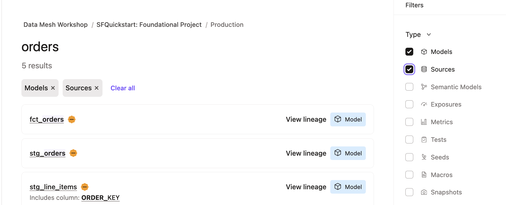

3. Click on `fct_orders` and scroll through the page, noting **Lineage,** **Build Status,** and **Description**.

4. Click on the **Columns** tab, and then expand the `order_key` column to see the **Column Level Lineage**.

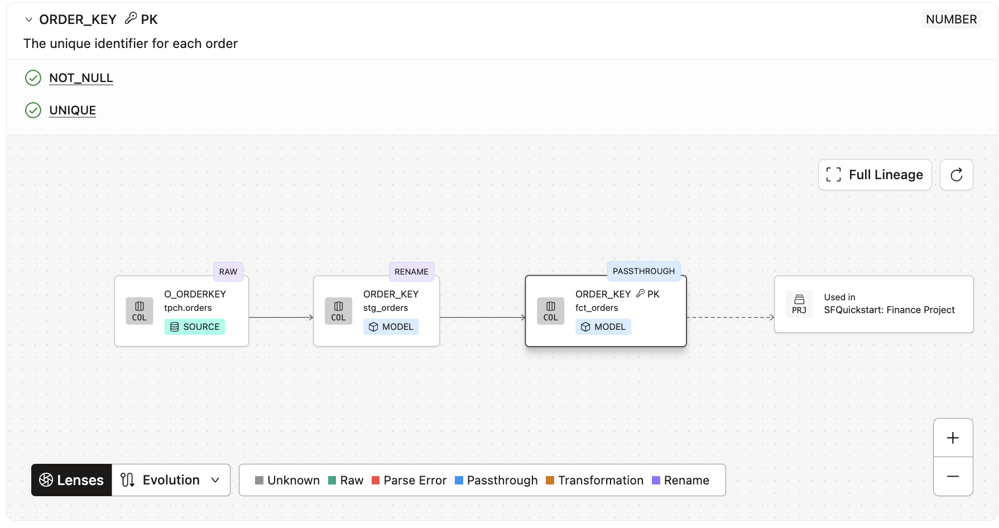

5. Lastly, click on the **Project Recommendations** tab on the left hand side of the page to see best practices directly in dbt Catalog.

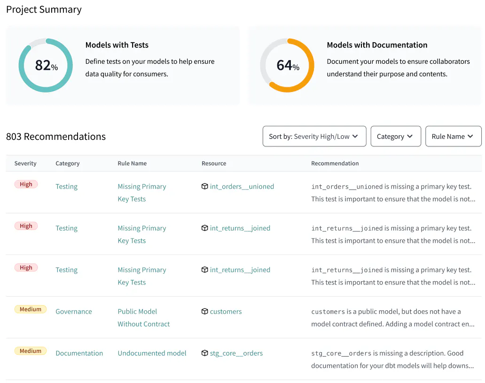

### Wrapping up this step

With dbt Catalog, data products built with dbt are automatically published and searchable, allowing for easy discovery and re-usability. Furthermore, you can use dbt Catalog to drill into data product details including documentation, build status, and lineage at the column-level, model-level, or project-level.

You have now completed your data product journey!

- 👉✅ **Discoverable:** it is easy to find
- ✅ **Addressable:** it has a unique, labeled location for retrieval
- ✅ **Trustworthy and truthful:** it is worthy of consumer trust
- ✅ **Self-describing:** it comes with product information
- ✅ **Interoperable:** it works with other products
- ✅ **Secure and governed:** it has proper access controls
- ✅ **Useful:** it has value

<!-- ------------------------ -->
## Conclusion and Resources

During this quickstart guide, you used native features of Snowflake and dbt platform that can be combined to create data products. By using dbt platform, you gained additional governance, automation, and interoperability mechanisms than from Snowflake alone. Overall, these two self-service platforms combined increase the likelihood of success of a data mesh project.

### What we've covered

- Creating Snowflake resources with a least privileged access principle
- Setting up dbt platform with two projects that relate to each other
- Added dbt models to build core datasets in Snowflake
- Added data masking with Snowflake, applied with dbt platform
- Created model contracts in dbt that govern the data used by other teams
- Executed the SQL code on Snowflake with dbt platform jobs
- Used dbt Catalog in order to explore data assets that were created by dbt

### Related resources

If you are interested in this solution for your organization, [contact dbt Labs](https://www.getdbt.com/contact) to get started!

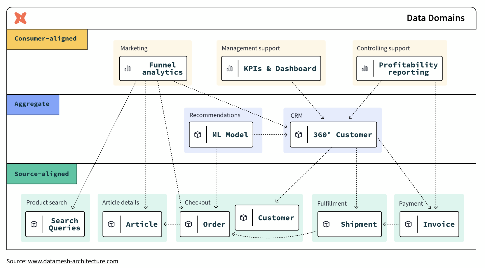
