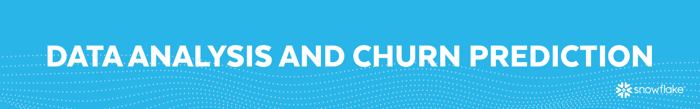
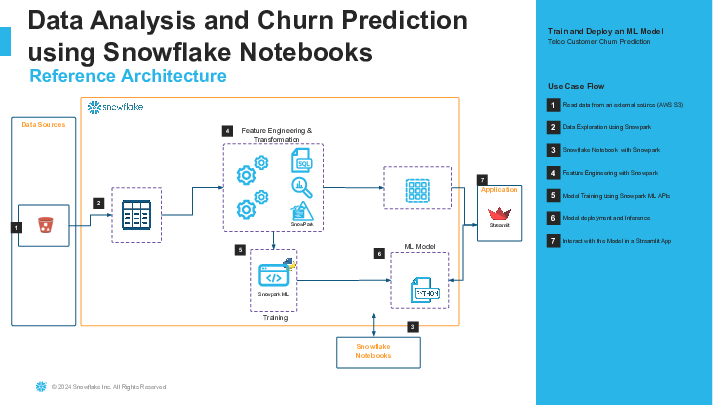
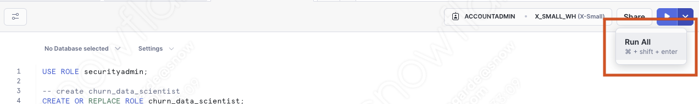
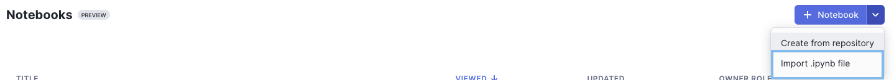
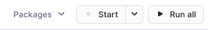

author: Joviane Bellegarde
id: data_analysis_and_churn_prediction_using_snowflake_notebooks
summary: Data Analysis and Churn Prediction Using Snowflake Notebooks
categories: Churn, Prediction, Getting-Started
environments: web
status: Unpublished
feedback link: https://github.com/Snowflake-Labs/sfguides/issues
tags: Getting Started, Churn, Prediction, Notebooks

# Data Analysis and Churn Prediction Using Snowflake Notebooks
<!-- ------------------------ -->

## Overview
Duration: 5


Churn prediction relies on data analysis to be effective. Through data analysis, businesses gather, clean, and model customer data to uncover patterns and trends. This understanding of customer behavior is key for building accurate churn prediction models. By applying data analysis techniques, businesses can identify at-risk customers and take targeted actions to retain them. Essentially, data analysis provides the necessary foundation for effective churn prediction, helping businesses reduce churn and boost customer loyalty.

In this Quickstart, we will play the role of a data scientist at a telecom company that wants to identify users who are at high risk of churning. To accomplish this, we need to build a model that can learn how to identify such users. We will demonstrate how to use Snowflake Notebooks in conjunction with Snowflake/Snowpark to build a Random Forest Classifier to help us with this task.

This Quickstart uses Snowflake Notebooks to import and load data, train a Random Forest with Snowpark ML model, visualize the predicted results from the forcasting model by building an interactive web application and make predictions on new users.

### Prerequisites
- Familiarity with basic Python and SQL
- Familiarity with training ML models
- Familiarity with data science notebooks
- Go to the [Snowflake](https://signup.snowflake.com/?utm_cta=quickstarts_) sign-up page and register for a free account. After registration, you will receive an email containing a link that will take you to Snowflake, where you can sign in.



### What You Will Learn
- How to import/load data with Snowflake Notebook
- How to train a Random Forest with Snowpark ML model
- How to visualize the predicted results from the forecasting model
- How to build an interactive web app and make predictions on new users

<!-- ------------------------ -->
## Setting Up Snowflake Environment

### Overview
Duration: 5
You will use [Snowsight](https://docs.snowflake.com/en/user-guide/ui-snowsight.html#), the Snowflake web interface to create Snowflake objects (warehouse, database, schema, role).

#### Creating Objects, Loading Data, and Joining Data
- Navigate to Worksheets, click `+` in the top-right corner to create a new Worksheet, and choose `SQL Worksheet`

- Copy and paste the following code to create Snowflake objects (warehouse, database, schema, role) and click `Run All` at the top of the Worksheet

```
USE ROLE securityadmin;

-- create churn_data_scientist
CREATE OR REPLACE ROLE churn_data_scientist;

USE ROLE accountadmin;

/*---------------------------*/
-- Create our Database
/*---------------------------*/
CREATE OR REPLACE DATABASE churn_prod;

/*---------------------------*/
-- Create our Schema
/*---------------------------*/
CREATE OR REPLACE SCHEMA churn_prod.analytics;

/*---------------------------*/
-- Create our Warehouse
/*---------------------------*/

-- data science warehouse
CREATE OR REPLACE WAREHOUSE churn_ds_wh
    WAREHOUSE_SIZE = 'xsmall'
    WAREHOUSE_TYPE = 'standard'
    AUTO_SUSPEND = 60
    AUTO_RESUME = TRUE
    INITIALLY_SUSPENDED = TRUE
COMMENT = 'data science warehouse for churn prediction';

-- Use our Warehouse
USE WAREHOUSE churn_ds_wh;

-- grant churn_ds_wh priviledges to churn_data_scientist role
GRANT USAGE ON WAREHOUSE churn_ds_wh TO ROLE churn_data_scientist;
GRANT OPERATE ON WAREHOUSE churn_ds_wh TO ROLE churn_data_scientist;
GRANT MONITOR ON WAREHOUSE churn_ds_wh TO ROLE churn_data_scientist;
GRANT MODIFY ON WAREHOUSE churn_ds_wh TO ROLE churn_data_scientist;

-- grant churn_ds_wh database privileges
GRANT ALL ON DATABASE churn_prod TO ROLE churn_data_scientist;

GRANT ALL ON SCHEMA churn_prod.analytics TO ROLE churn_data_scientist;
GRANT CREATE STAGE ON SCHEMA churn_prod.analytics TO ROLE churn_data_scientist;

GRANT ALL ON ALL STAGES IN SCHEMA churn_prod.analytics TO ROLE churn_data_scientist;
GRANT ALL ON ALL STAGES IN SCHEMA churn_prod.public TO ROLE churn_data_scientist;

-- set my_user_var variable to equal the logged-in user
SET my_user_var = (SELECT  '"' || CURRENT_USER() || '"' );

-- grant the logged in user the churn_data_scientist role
GRANT ROLE churn_data_scientist TO USER identifier($my_user_var);

USE ROLE churn_data_scientist;

/*---------------------------*/
-- sql completion note
/*---------------------------*/
SELECT 'data analysis and churn prediction sql is now complete' AS note;
```

<!-- ------------------------ -->
## Using Snowflake Notebooks

### Overview
Duration: 10

For this Quickstart, there are 2 Snowflake Notebooks and they need to be executed in order. Make sure to run the first Notebook fully before running the second Notebook.
1. The first Snowflake Notebook [1_telco_churn_ingest_data.ipynb](https://github.com/Snowflake-Labs/sfguide-data-analysis-churn-prediction-in-snowflake-notebooks/blob/main/notebooks/1_telco_churn_ingest_data.ipynb) contains scripts for importing and exploring our data.
2. The second Snowflake Notebook [2_telco_churn_ml_feature_engineering.ipynb](https://github.com/Snowflake-Labs/sfguide-data-analysis-churn-prediction-in-snowflake-notebooks/blob/main/notebooks/2_telco_churn_ml_feature_engineering.ipynb) contains scripts for feature engineering and model training to use in the Streamlit app within the Notebook.

### Import Snowflake Notebooks
You will use [Snowsight](https://docs.snowflake.com/en/user-guide/ui-snowsight.html#), the Snowflake web interface, to create the Snowflake Notebooks by importing the Notebooks
1. Navigate to Notebooks in [Snowsight](https://docs.snowflake.com/en/user-guide/ui-snowsight.html#) by clicking on `Projects` `->` `Notebook`

2. Switch Role to `CHURN_DATA_SCIENTIST`

3. Download the [1_telco_churn_ingest_data.ipynb](https://github.com/Snowflake-Labs/sfguide-data-analysis-churn-prediction-in-snowflake-notebooks/blob/main/notebooks/1_telco_churn_ingest_data.ipynb) and [2_telco_churn_ml_feature_engineering.ipynb](https://github.com/Snowflake-Labs/sfguide-data-analysis-churn-prediction-in-snowflake-notebooks/blob/main/notebooks/2_telco_churn_ml_feature_engineering.ipynb) Notebooks

4. Using the `Import .ipynb file`, import the downloaded Notebooks


5. Select the `CHURN_PROD` database and `ANALYTICS` schema for the Notebook Location and `CHURN_DS_WH` for the Notebook warehouse and click `Create`

6. Click on either Notebook to upload the [environment.yml](https://github.com/Snowflake-Labs/sfguide-data-analysis-churn-prediction-in-snowflake-notebooks/blob/main/notebooks/environment.yml) file by clicking the plus button on the file explorer in the left pane. This file adds the following packages: `altair`, `imbalanced-learn`, `numpy`, `pandas`, and `snowflake-ml-python`.

7. At the top of the page, click `Start` to start the Notebook session and run the cells by clicking `Run All`


<!-- ------------------------ -->
## Clean Up
Duration: 1

### Remove Snowflake Objects
- Navigate to Worksheets, click `+` in the top-right corner to create a new Worksheet, and choose `SQL Worksheet`
- Copy and paste the following SQL statements in the worksheet to drop all Snowflake objects created in this Quickstart
```
USE ROLE securityadmin;
DROP ROLE IF EXISTS churn_data_scientist;
USE ROLE accountadmin;
DROP DATABASE IF EXISTS churn_prod;
DROP WAREHOUSE IF EXISTS churn_ds_wh;
```

<!-- ------------------------ -->
## Conclusion and Resources
Duration: 1

**Congrats!** You're reached the end of this Quickstart!

### What We Learned
With the completion of this Quickstart, you have now delved into:
- How to import/load data with Snowflake Notebook
- How to train a Random Forest with Snowpark ML model
- How to visualize the predicted results from the forecasting model
- How to build an interactive web app and make predictions on new users

### Resources
- [Snowflake Documentation](https://docs.snowflake.com/)
- [Snowflake Notebooks](https://docs.snowflake.com/en/user-guide/ui-snowsight/notebooks)
- [Snowpark API](https://docs.snowflake.com/en/developer-guide/snowpark/index)