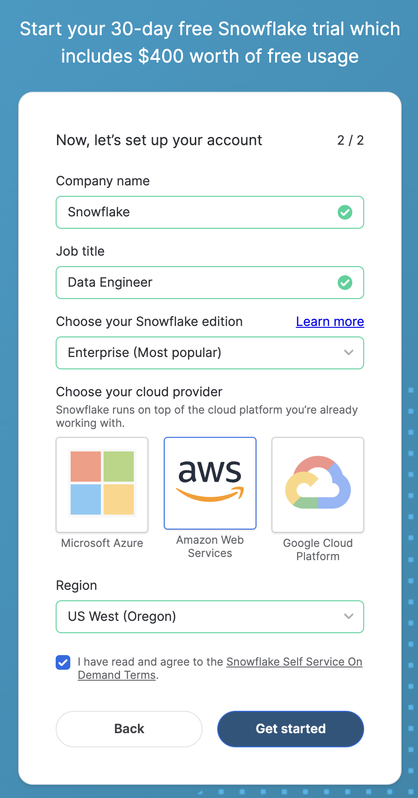
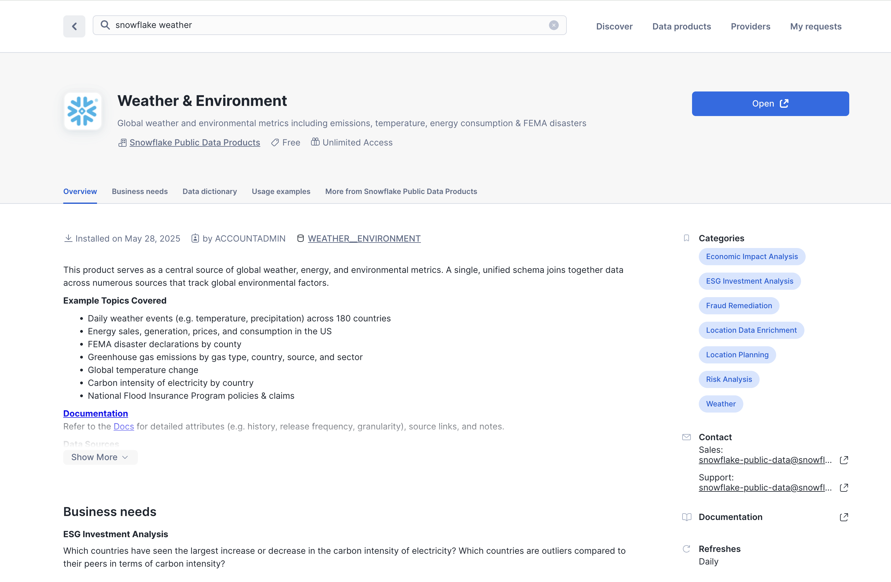

author: Daniel Myers, Gilberto Hernandez
id: data_apps_summit_lab
summary: This is a sample Snowflake Guide
categories: featured,app-development
environments: web
status: Published 
feedback link: https://github.com/Snowflake-Labs/sfguides/issues
tags: Getting Started, Data Science, Data Engineering, Twitter 

# Building a data application with Snowflake Marketplace, Snowpark and Streamlit

## Overview
Duration: 2

In this hands-on lab, you will build a data application that leverages Financial & Economic Essentials published by Cybersyn on Snowflake Marketplace.

You will process data with Snowpark, develop a simple ML model and create a Python User Defined Function (UDF) in Snowflake, then visualize the data with Streamlit.

### Key Features & Technology

* Snowflake Marketplace
* Snowpark for Python
* Python libraries
* Python User Defined Functions (UDF)
* Streamlit

### Prerequisites

* Accountadmin role access in Snowflake or a Snowflake trial account: [https://signup.snowflake.com/](https://signup.snowflake.com/?utm_cta=quickstarts_)
* Basic knowledge of SQL, database concepts, and objects
* Familiarity with Python.  All code for the lab is provided.
* Ability to install and run software on your computer
* [VSCode](https://code.visualstudio.com/download) installed

### What You'll Learn

* How to consume datasets in Snowflake Marketplace.
* How to perform queries on data in Python using Dataframes
* How to leverage existing Python libraries
* How to create a Snowpark Python User Defined Function in Snowflake
* How to create a data application with Streamlit to visualize data

### What You’ll Build

* A Python notebook that connects to Snowflake with Snowpark for Python and prepares features for a Linear Regression model training.
* A Snowflake User Defined Function (UDF) based on a Python trained model
* A Streamlit dashboard data application

<!-- ------------------------ -->
## Open a Snowflake Trial Account
Duration: 5

To complete this lab, you'll need a Snowflake account. A free Snowflake trial account will work just fine. To open one:

1. Navigate to [https://signup.snowflake.com/](https://signup.snowflake.com/?trial=student&cloud=aws&region=us-west-2&utm_source=coursera&utm_campaign=introtosnowflake)

2. Start the account creation by completing the first page of the form on the page.

3. On the next section of the form,  set the Snowflake edition to "Enterprise (Most popular").

4. Select "AWS – Amazon Web Services" as the cloud provider.

5. Select "US West (Oregon)" as the region.

6. Complete the rest of the form and click "Get started".




<!-- ------------------------ -->
## Finance & Economics Data From Snowflake Marketplace
Duration: 5

Let's start by "loading" our finance and economics data into Snowflake. It turns out that "loading" is really the wrong word here. 

We're using Snowflake's unique data sharing capability in Snowflake Marketplace. Because of this, we don't actually need to copy any data to our Snowflake account with any logic. Instead, we can directly access the weather data shared by a trusted provide in Snowflake Marketplace. Let's go ahead and do this.

1. Log into your Snowflake account.

2. Click on "Data Products".

3. Click on "Marketplace".

4. In the search bar, search for "finance and economics".

5. The first result should be "Finance & Economics
" by the "Snowflake Data" provider. Click on the listing.

6. The dataset is free. On the right, click "Get".

7. In the ensuing modal, click "Get" once more. Do **NOT** rename the dataset.

This is a live dataset! No need to write ingestion logic to bring the data into your account. The data is maintained and kept fresh by the provider.



<!-- ------------------------ -->
## Explore the Data Using Snowflake Notebooks
Duration: 10

The Finance & Economics dataset provides comprehensive daily stock price data for all U.S. equities and ETFs traded on the Nasdaq, including essential metrics such as pre-market opening prices, after-hours closing prices, daily high/low prices, and trading volumes. It's updated daily at 6 AM ET, which means it can be used for detailed analysis of stock performance across different trading sessions and time periods. 

We'll use this dataset to build an interactive stock analysis dashboard that calculates technical indicators and visualizes market trends to simulate real-world financial analytics workflows.

Let's start by exploring the data using a Snowflake Notebook.

1. First create a database and schema for the notebook. In a SQL worksheet, run the following:

```sql
USE ROLE accountadmin;
USE WAREHOUSE compute_wh;

CREATE OR REPLACE DATABASE fe_app_db;
CREATE OR REPLACE SCHEMA fe_app_schema;
```

2. Next, click on "Projects", then click on "Notebooks". Create a new Notebook using the button at the top right.

3. Name the notebook "EXPLORE_FINANCE_ECONOMICS". Set the location to the `fe_app_db` database and `fe_app_schema` schema.

4. Select **COMPUTE_WH** as the query warehouse. 

5. Leave everything else as-is and click "Create".

6. Once the notebook is loaded, you'll see three cells that are pre-loaded with code. Delete all of them.

Ok, let's now explore the data in the dataset.

1. Create a new SQL cell and paste in and run the following to set the context:

```sql
USE ROLE accountadmin;
USE WAREHOUSE compute_wh;
```

2. Next, create another SQL cell. Paste in and run the following:

```sql
SELECT * FROM FINANCE__ECONOMICS.CYBERSYN.STOCK_PRICE_TIMESERIES LIMIT 20;
```

This will give you a sense of the data in the dataset. You'll notice there is market data for tickers. We'll use the data in this dataset to build an app.

3. We can do some neat things with this data. For example, we can find out which stocks had the highest price volatility in the past month. Create a new SQL cell and run this query:

```sql
-- Find stocks with highest price volatility in the past month
-- Find stocks with highest price volatility in the past month
WITH daily_stats AS (
  SELECT 
    ticker,
    date,
    MAX(CASE WHEN variable_name = 'All-Day High' THEN value END) AS day_high,
    MAX(CASE WHEN variable_name = 'All-Day Low' THEN value END) AS day_low
  FROM finance__economics.cybersyn.stock_price_timeseries
  WHERE date >= DATEADD(month, -1, CURRENT_DATE())
  GROUP BY ticker, date
)
SELECT 
  ticker,
  AVG((day_high - day_low) / day_low * 100) AS avg_daily_volatility
FROM daily_stats
WHERE day_low > 0
GROUP BY ticker
HAVING COUNT(date) >= 15  -- Ensure sufficient data points
ORDER BY avg_daily_volatility DESC
LIMIT 10;
```

You should see the 10 tickers with the most price volatility returned.

4. Create a new SQL cell and now run this query to return stocks with largest single-day percentage gains:

```sql
-- Find stocks with largest single-day percentage gains
WITH daily_close AS (
  SELECT 
    ticker,
    date,
    value AS close_price,
    LAG(value) OVER (PARTITION BY ticker ORDER BY date) AS prev_close
  FROM finance__economics.cybersyn.stock_price_timeseries
  WHERE variable_name = 'Post-Market Close'
  AND date >= DATEADD(month, -3, CURRENT_DATE())
)
SELECT 
  ticker,
  date,
  close_price,
  prev_close,
  ((close_price / prev_close) - 1) * 100 AS pct_gain
FROM daily_close
WHERE prev_close > 0
ORDER BY pct_gain DESC
LIMIT 15;
```

5. Finally, let's take a look at volume trends for some tech stocks. Create a new SQL cell and run the following:

```sql
-- Analyze volume trends for popular tech stocks
WITH volume_data AS (
  SELECT 
    ticker,
    date,
    value AS volume
  FROM finance__economics.cybersyn.stock_price_timeseries
  WHERE variable_name = 'Nasdaq Volume'
  AND ticker IN ('AAPL', 'MSFT', 'GOOGL', 'AMZN', 'META', 'NVDA')
  AND date >= DATEADD(month, -2, CURRENT_DATE())
)
SELECT 
  ticker,
  date,
  volume,
  AVG(volume) OVER (PARTITION BY ticker ORDER BY date ROWS BETWEEN 4 PRECEDING AND CURRENT ROW) AS moving_avg_volume
FROM volume_data
ORDER BY ticker, date;
```

Now that we have a database that we can use for the Application, we want to explore the data and create a ML model in a User Defined Function (UDF) that can be used by our application.

Open VS code and open the folder with the Python scripts that we created earlier.

You can open the Python notebook (my_snowpark_pce.ipynb) and Streamlit application script (my_snowpark_streamlit_app_pce.py). We will be walking through the sections of the code.

VS Code might ask for the Python environment: \


Make sure you select the ‘snowpark’ Conda environment that was created earlier.

You can select the Interpreter by clicking in the lower right corner: \


### Initialize Notebook, import libraries and create Snowflake connection

Let's start by creating a Python script and adding the import statements to include the required libraries.


``` python
from snowflake.snowpark.session import Session
from snowflake.snowpark.types import IntegerType, FloatType
from snowflake.snowpark.functions import avg, sum, col, udf, call_udf, call_builtin, year, month
import streamlit as st
import pandas as pd
from datetime import date

# scikit-learn (install: pip install -U scikit-learn)
from sklearn.linear_model import LinearRegression
```


### Connect to Snowflake

In this step, you'll create a [Session object](https://docs.snowflake.com/en/developer-guide/snowpark/python/creating-session) to connect to your Snowflake. Here's a quick way of doing that, but note that hard coding credentials directly in code is not recommended in production environments. In production environments a better approach would be to load credentials from [AWS Secrets Manager](https://github.com/iamontheinet/sf-code-snippets/blob/main/aws_secrets_manager_sf_connection.py) or [Azure Key Vault](https://github.com/iamontheinet/sf-code-snippets/blob/main/azure_key_vault_sf_connection.py), for example.

We will be using the database that we created in the Snowflake setup section.


``` python
# Session
connection_parameters = {
   "account": "<account_identifier>",
   "user": "<username>",
   "password": "<password>",
   "warehouse": "compute_wh",
   "role": "accountadmin",
   "database": "summit_hol",
   "schema": "public"
}
session = Session.builder.configs(connection_parameters).create()
# test if we have a connection
session.sql("select current_account() acct, current_warehouse() wh, current_database() db, current_schema() schema, current_version() v").show()
```


In the above code snippet, replace variables enclosed in "&lt;>" with your values.


### Query the data using a SQL statement and with the Snowpark Dataframe

In this step we will query the data using the traditional method of executing a SQL statement in the Session object, similar to querying data with the Snowflake for Python connector.


``` python 
# SQL queries to explore the data

# What financial data is available as a time-series from FRED?
session.sql("SELECT DISTINCT variable_name FROM CYBERSYN_FINANCIAL__ECONOMIC_ESSENTIALS.CYBERSYN.FINANCIAL_FRED_TIMESERIES").show()

# What is the size of all the time-series data?
session.sql("SELECT COUNT(*) FROM CYBERSYN_FINANCIAL__ECONOMIC_ESSENTIALS.CYBERSYN.FINANCIAL_FRED_TIMESERIES").show()
```


Now we will query the data using a Snowpark DataFrame. As Snowpark uses lazy evaluation, the query and filter conditions are created and the _show()_ method will push this to the Snowflake server where the query will be executed. This reduces the amount of data exchanged between Snowflake and the client/application.


``` python
# Now use Snowpark dataframe
snow_df_pce = (session.table("CYBERSYN_FINANCIAL__ECONOMIC_ESSENTIALS.CYBERSYN.FINANCIAL_FRED_TIMESERIES")
               .filter(col('VARIABLE_NAME') == 'Personal Consumption Expenditures: Chain-type Price Index, Seasonally adjusted, Monthly, Index 2017=100')
               .filter(col('DATE') >= '1972-01-01')
               .filter(month(col('DATE')) == 1)
               .orderBy(col('DATE'))) 
snow_df_pce.show()
```


### Creating features for ML training

As part of the application we would like to have some predictions of the Personal consumption expenditures price index. So we will create a Pandas dataframe that can be used for training the model with the scikit-learn Linear Regression model.  The Snowpark API for Python exposes a method to convert Snowpark DataFrames to Pandas. Again with the Snowpark lazy evaluation we can construct the dataframe query and the _to_pandas()_ function will push the query to Snowflake and return the results as a Pandas dataframe. 


``` python
# Let Snowflake perform filtering using the Snowpark pushdown and display results in a Pandas dataframe
snow_df_pce = (session.table("CYBERSYN_FINANCIAL__ECONOMIC_ESSENTIALS.CYBERSYN.FINANCIAL_FRED_TIMESERIES")
               .filter(col('VARIABLE_NAME') == 'Personal Consumption Expenditures: Chain-type Price Index, Seasonally adjusted, Monthly, Index 2017=100')
               .filter(col('DATE') >= '1972-01-01')
               .filter(month(col('DATE')) == 1))
pd_df_pce_year = snow_df_pce.select(year(col('DATE')).alias('"Year"'), col('VALUE').alias('PCE')).orderBy(col('DATE')).to_pandas()
pd_df_pce_year
```


### Train the Linear Regression model

Now that we have created the features, we can train the model. In this step we will transform the Pandas dataframe with the features to arrays using the NumPy library. Once trained we can display a prediction.


``` python
# train model with PCE index

x = pd_df_pce_year["Year"].to_numpy().reshape(-1,1)
y = pd_df_pce_year["PCE"].to_numpy()

model = LinearRegression().fit(x, y)

# test model for 2022
predictYear = 2022
pce_pred = model.predict([[predictYear]])
# print the last 5 years
print (pd_df_pce_year.tail() )
# run the prediction for 2022
print ('Prediction for '+str(predictYear)+': '+ str(round(pce_pred[0],2)))
```


### Creating a User Defined Function in Snowflake with the trained model

In this step we will create a Python function that will use the trained model to predict a PCE index based on the function input. We will then use the Snowpark API to create an UDF. The Snowpark library uploads the code (and trained model)  for your function to an internal stage. When you call the UDF, the Snowpark library executes your function on the server, where the data is. As a result, the data doesn’t need to be transferred to the client in order for the function to process the data. 


``` python
def predict_pce(predictYear: int) -> float:
   return model.predict([[predictYear]])[0].round(2).astype(float)

_ = session.udf.register(predict_pce,
                       return_type=FloatType(),
                       input_type=IntegerType(),
                       packages= ["pandas","scikit-learn"],
                       is_permanent=True,
                       name="predict_pce_udf",
                       replace=True,
                       stage_location="@udf_stage")
```


Now we can test the UDF using a SQL command in Python.


``` python
session.sql("select predict_pce_udf(2022)").show()
```


<!-- ------------------------ -->
## Creating the Streamlit application

Duration: 5

Now that we have a trained ML model and created a UDF to do predictions we can create the Streamlit application. We can do this directly inside Snowflake using Streamlit!

To do this, we will create a new Streamlit app:

1. Navigate to your Snowflake Console in your browser and click `Streamlit` on the left navbar. 
2. Click `+ Streamlit App` on the top right.
3. Name your app `Snowflake Lab`
4. Select an available warehouse. In this case `compute_wh`
5. Select `summit_hol` for the database. This is the database we created earlier that contains our UDF that will be used to predict PCE.
6. Select `PUBLIC` for the schema. 
7. Click `Create`

From here you will see a full-fledge browser based development environment for developing your Streamlit web app! 

Copy and paste the code from the file `streamlit_in_snowflake.py` to run our web app for this lab:


<button><a href="https://github.com/Snowflake-Labs/sfquickstarts/tree/master/site/sfguides/src/data_apps_summit_lab/assets/project_files" download>Lab Files</a></button>


> aside positive
> 
> Fun Fact: When creating a new Streamlit inside Snowflake, you can share your web app with other Snowflake users! To do this, click `Share` in the top right of you Streamlit app and select other roles that you want to share with. 


<!-- ------------------------ -->
## Creating the Streamlit application (Locally)

Duration: 7


### Import the required libraries

Now that we have a trained ML model and created a UDF to do predictions we can create the Streamlit application.

Similar to the notebook we create a Python script and add import statements to include the required libraries.


``` python
# Import required libraries
# Snowpark
from snowflake.snowpark.session import Session
from snowflake.snowpark.types import IntegerType
from snowflake.snowpark.functions import avg, sum, col, call_udf, lit, call_builtin, year, month
# Pandas
import pandas as pd
#Streamlit
import streamlit as st
```


### Set the application page context

We need to set the context for the application page.


``` python
#Set page context
st.set_page_config(
    page_title="Financial & Economic Essentials",
    page_icon="🧊",
    layout="wide",
    initial_sidebar_state="expanded",
    menu_items={
        'Get Help': 'https://developers.snowflake.com',
        'About': "This is an *extremely* cool app powered by Snowpark for Python, Streamlit, and Snowflake Marketplace"
    }
)
```


### Connect to Snowflake

In this step, you'll create a [Session object](https://docs.snowflake.com/en/developer-guide/snowpark/python/creating-session) to connect to your Snowflake. Here's a quick way of doing that, but note that hard coding credentials directly in code is not recommended in production environments. In production environments a better approach would be to load credentials from [AWS Secrets Manager](https://github.com/iamontheinet/sf-code-snippets/blob/main/aws_secrets_manager_sf_connection.py) or [Azure Key Vault](https://github.com/iamontheinet/sf-code-snippets/blob/main/azure_key_vault_sf_connection.py), for example.

We will be using the database that we created in the Snowflake setup section.


``` python
# Create Session object
def create_session_object():
   connection_parameters = {
   "account": "<account_identifier>",
   "user": "<username>",
   "password": "<password>",
   "warehouse": "compute_wh",
   "role": "accountadmin",
   "database": "SUMMIT_HOL",
   "schema": "PUBLIC"
  }
   session = Session.builder.configs(connection_parameters).create()
   print(session.sql('select current_account(), current_warehouse(), current_database(), current_schema()').collect())
   return session
```


In the above code snippet, replace variables enclosed in "&lt;>" with your values.


### Load Data in Snowpark DataFrames

In this step, we’ll create a dataframe with US Inflation (Personal Consumption Expenditures - PCE) data per year. We will be using the FINANCIAL_FRED_TIMESERIES table from Cybersyn. Federal Reserve Economic Data (FRED) is aggregated information from various government sources published by the St. Louis Federal Reserve. This table contains over 2 million rows, using Snowpark lazy evaluation this data is processed in Snowflake.

We’ll create a dataframe with actual and predicted PCE values based on the UDF with a trained ML model we created in the Notebook section.

And we will combine the actual and predicted dataframes in a new dataframe so we can display the data in a single chart.

Note that when working with Streamlit we need Pandas DataFrames and Snowpark API for Python exposes a method to convert Snowpark DataFrames to Pandas.

We also want to show some key metrics, so we will extract metrics from the dataframes.

As a bonus we will show the PCE data per quarter for a selected year using a separate data frame.


``` python
# Create Snowpark DataFrames that load data from Cybersyn Financial & Economic Essentials
def load_data(session): 
    #US Inflation, Personal consumption expenditures (PCE) per year
    #Prepare data frame, set query parameters
    snow_df_pce = (session.table("CYBERSYN_FINANCIAL__ECONOMIC_ESSENTIALS.CYBERSYN.FINANCIAL_FRED_TIMESERIES")
               .filter(col('VARIABLE_NAME') == 'Personal Consumption Expenditures: Chain-type Price Index, Seasonally adjusted, Monthly, Index 2017=100')
               .filter(col('DATE') >= '1972-01-01')
               .filter(month(col('DATE')) == 1))
    #Select columns, subtract 100 from value column to reference baseline
    snow_df_pce_year = snow_df_pce.select(year(col('DATE')).alias('"Year"'), (col('VALUE')-100).alias('PCE')).sort('"Year"', ascending=False)
    #convert to pandas dataframe 
    pd_df_pce_year = snow_df_pce_year.to_pandas()
    #round the PCE series
    pd_df_pce_year["PCE"] = pd_df_pce_year["PCE"].round(2)
  
    #create metrics
    latest_pce_year = pd_df_pce_year.loc[0]["Year"].astype('int')
    latest_pce_value = pd_df_pce_year.loc[0]["PCE"]
    delta_pce_value = latest_pce_value - pd_df_pce_year.loc[1]["PCE"]

    #Use Snowflake UDF for Model Inference
    snow_df_predict_years = session.create_dataframe([[int(latest_pce_year+1)], [int(latest_pce_year+2)],[int(latest_pce_year+3)]], schema=["Year"])
    pd_df_pce_predictions = snow_df_predict_years.select(col("year"), call_udf("predict_pce_udf", col("year")).as_("pce")).sort(col("year")).to_pandas()
    pd_df_pce_predictions.rename(columns={"YEAR": "Year"}, inplace=True)
    #round the PCE prediction series
    pd_df_pce_predictions["PCE"] = pd_df_pce_predictions["PCE"].round(2).astype(float)-100
    print(pd_df_pce_predictions)
    
    #Combine actual and predictions dataframes
    pd_df_pce_all = (
        pd_df_pce_year.set_index('Year').sort_index().rename(columns={"PCE": "Actual"})
        ._append(pd_df_pce_predictions.set_index('Year').sort_index().rename(columns={"PCE": "Prediction"}))
    )
   
    #Data per quarter
    snow_df_pce_q = (session.table("CYBERSYN_FINANCIAL__ECONOMIC_ESSENTIALS.CYBERSYN.FINANCIAL_FRED_TIMESERIES")
                     .filter(col('VARIABLE_NAME') == 'Personal Consumption Expenditures: Chain-type Price Index, Seasonally adjusted, Monthly, Index 2017=100')
                     .filter(month(col('DATE')).in_(lit(1), lit(4), lit(7), lit(10)))
                     .select(year(col('DATE')).alias('"Year"'), 
                             call_builtin("date_part", 'quarter', col('DATE')).alias('"Quarter"'),
                             (col('VALUE')-100).alias('PCE'))
                            .sort('"Year"', ascending=False)) 
```


### Add Web Page Components

In this step, you'll add...


1. A header and sub-header and also use containers and columns to organize the application content using Streamlit's _columns()_ and _container()_
2. Display of metrics with delta using Streamlit's metric function.
3. Interactive bar chart using Streamlit's selectbox_()_ and _bar_chart()_


``` python
    # Add header and a subheader
    st.title("Cybersyn: Financial & Economic Essentials")
    st.header("Powered by Snowpark for Python and Snowflake Marketplace | Made with Streamlit")
    st.subheader("Personal consumption expenditures (PCE) over the last 25 years, baseline is 2017")
    with st.expander("What is the Personal Consumption Expenditures Price Index?"):
        st.write("""
         The prices you pay for goods and services change all the time – moving at different rates and even in different directions. Some prices may drop while others are going up. A price index is a way of looking beyond individual price tags to measure overall inflation (or deflation) for a group of goods and services over time.
         
         The Personal Consumption Expenditures Price Index is a measure of the prices that people living in the United States, or those buying on their behalf, pay for goods and services.The PCE price index is known for capturing inflation (or deflation) across a wide range of consumer expenses and reflecting changes in consumer behavior.
        """)

    # Use columns to display metrics for global value and predictions
    col11, col12, col13 = st.columns(3)
    with st.container():
        with col11:
            st.metric("PCE in " + str(latest_pce_year), round(latest_pce_value), round(delta_pce_value), delta_color=("inverse"))
        with col12:
            st.metric("Predicted PCE for " + str(int(pd_df_pce_predictions.loc[0]["Year"])), round(pd_df_pce_predictions.loc[0]["PCE"]), 
                round((pd_df_pce_predictions.loc[0]["PCE"] - latest_pce_value)), delta_color=("inverse"))
        with col13:
            st.metric("Predicted PCE for " + str(int(pd_df_pce_predictions.loc[1]["Year"])), round(pd_df_pce_predictions.loc[1]["PCE"]), 
                round((pd_df_pce_predictions.loc[1]["PCE"] - latest_pce_value)), delta_color=("inverse"))

    # Barchart with actual and predicted PCE
    st.bar_chart(data=pd_df_pce_all.tail(25), width=0, height=0, use_container_width=True)

    # Display interactive chart to visualize PCE per quarter 
    with st.container():
        year_selection = st.selectbox('Select year', pd_df_pce_year['Year'].head(25),index=3 )
        pd_df_pce_q = snow_df_pce_q.filter(col('"Year"') == year_selection).sort(col('"Quarter"')).to_pandas().set_index('Quarter')
        with st.expander("Price Indexes For Personal Consumption Expenditures per Quarter"):
             st.bar_chart(data=pd_df_pce_q['PCE'], width=0, height=500, use_container_width=True)

if __name__ == "__main__":
    session = create_session_object()
    load_data(session) 
```


In the above code snippet, a bar chart is constructed using Streamlit's _bar_chart()_ which takes a dataframe as one of the parameters. In our case, that is a subset (25 years) of the Personal consumption expenditures (PCE) price index dataframe filtered by date via Snowpark DataFrame's _filter() _combined with predicted PCE values leveraging the Snowflake User Defined Functions that contains a trained ML model. Key metrics like the last PCE value and the next 2 predictions including a delta with the last year are displayed using the Streamlit _metric() _function.

More details can be shown by using a year selection (Streamlit_ selectbox() _ function) and a chart with the quarterly values for the selected year and a detailed chart of the PCE values of the major product types for the selected year. Every time a year is selected, the query will be run on Snowflake and the results are displayed by Snowpark and Streamlit.


<!-- ------------------------ -->
### Run Web Application


The fun part! Assuming your Python script is free of syntax and connection errors, you’re ready to run the application.

You can run this by executing: `streamlit run my_snowpark_streamlit_app_pce.py` at the command line, or in the terminal section of VS code. (Replace <em>my_snowpark_streamlit_app_pce.py</em> with the name of your Python script.)

Make sure you have activated the ‘snowpark’ Conda environment by using this terminal command: `conda activate snowpark`

You will see a terminal prompt indicating that you have selected the right Conda environment:


``` bash
(base)      user SummitHOL % conda activate snowpark
(snowpark)  user SummitHOL % streamlit run my_snowpark_streamlit_app_pce.py
```

In the application:


1. You can click on expansion sections indicated with a “+”
2. You can select a year to show detailed information
3. The quarterly PCE values are collapsed by default, you can expand them by clicking the “+”


