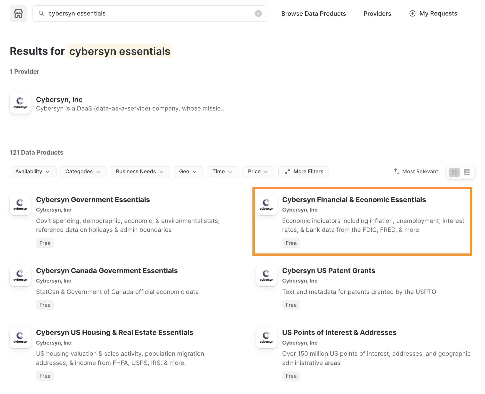
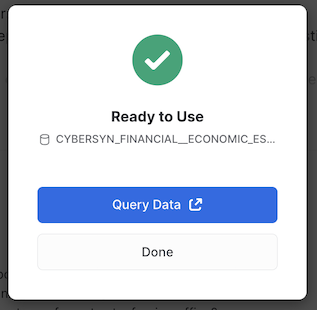
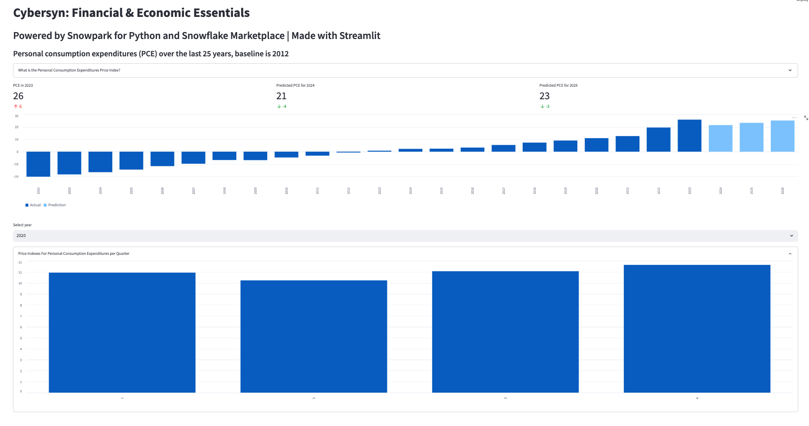

author: 
id: data_apps_summit_lab_ja
summary: これはサンプルのSnowflakeガイドのカテゴリーです
categories: featured,app-development
environments: web
status: Published 
feedback link: https://github.com/Snowflake-Labs/sfguides/issues
tags: Getting Started, Data Science, 日本語, Data Engineering, Twitter, ja 

# Snowflakeマーケットプレイス、Snowpark、Streamlitによるデータアプリケーションの構築

## 概要
Duration: 2

このハンズオンラボでは、KnoemaがSnowflakeマーケットプレイスで公開しているEconomical Data Atlasを活用するデータアプリケーションを構築します。

Snowparkでデータを処理し、Snowflakeで簡単なMLモデルを開発し、Pythonユーザー定義関数（UDF）を作成してから、Streamlitでデータを視覚化します。

### 主な機能とテクノロジー

* Snowflakeマーケットプレイス
* Snowpark for Python
* Pythonライブラリ
* Pythonユーザー定義関数（UDF）
* Streamlit

### 前提条件

* SnowflakeまたはSnowflakeトライアルアカウントでのアカウント管理者ロールアクセス：[https://signup.snowflake.com/](https://signup.snowflake.com/)
* SQL、データベース構想、オブジェクトについての基本知識
* Pythonに精通していること。  ラボ用のすべてのコードが提供されます。
* コンピュータにソフトウェアをインストールして実行できること
* [VSCode](https://code.visualstudio.com/download)がインストールされていること

### 学習する内容

* Snowflakeマーケットプレイスでデータセットを利用する方法
* DataFramesを使用してPythonでデータにクエリを実行する方法
* 既存のPythonライブラリを活用する方法
* SnowflakeでSnowpark Pythonユーザー定義関数を作成する方法
* Streamlitでデータアプリケーションを作成してデータを視覚化する方法

### 構築するもの

* Snowpark for PythonでSnowflakeに接続し、線形回帰モデルトレーニングのための特徴量を準備するPythonノートブック。
* Pythonでトレーニングしたモデルに基づくSnowflakeユーザー定義関数（UDF）
* Streamlitダッシュボードデータアプリケーション

<!-- ------------------------ -->
## ラボ環境の準備

Duration: 8

1. 別の環境を管理するため、pip install condaを実行してcondaをインストールします。注意：[Miniconda](https://docs.conda.io/en/latest/miniconda.html)を使用する方法もあります。
2. ターミナルまたはコマンドプロンプトを開きます。

> 重要：Apple M1チップを搭載したマシンを使用している場合は、以下で説明する手順ではなく、[こちらの手順](https://docs.snowflake.com/ja/developer-guide/snowpark/python/setup)に従って仮想環境を作成し、Snowpark Pythonをインストールしてください。

3. `conda create --name snowpark -c https://repo.anaconda.com/pkgs/snowflake python=3.8`を実行して環境を作成します。
4. `conda activate snowpark`を実行してconda環境をアクティブ化します。
5. `conda install -c https://repo.anaconda.com/pkgs/snowflake snowflake-snowpark-python pandas scikit-learn`を実行して、Snowpark for Python、pandas、scikit-learnをインストールします。
6. `pip install streamlit`または`conda install streamlit`を実行してStreamlitをインストールします。
7. 「Summit HOL PCE」などのフォルダを作成し、その中にLabファイルをダウンロード/保存します。
   * 必要なファイルへのリンク：https://drive.google.com/drive/folders/1CN6Ljj59XWv2B3Epqxk4DtfDmCH1co_Q?usp=sharing

---

### `pyarrow`関連の問題のトラブルシューティング

- `pyarrow`ライブラリがすでにインストールされている場合は、Snowparkをインストールする前にアンインストールしてください。
- `pyarrow`がインストールされていない場合は、自分でインストールする必要はありません。Snowparkをインストールすると、適切なバージョンが自動的にインストールされます。
- Snowparkのインストール後に、異なるバージョンの`pyarrow`を再インストールしないでください。

<!-- ------------------------ -->
## Snowflakeの環境の準備

Duration: 6

### Snowflakeマーケットプレイスの利用

Snowflakeマーケットプレイスは、ビジネスプロセスの変革に使用されるデータポイントへのアクセスを拡大するサードパーティのデータスチュワードからのさまざまなデータセットを可視化します。また、データプロバイダーによって完全に管理されるデータセットへの安全なアクセスを提供することで、データの統合とモデル化の必要性を排除します。

Snowflakeマーケットプレイスのデータセットの利用方法を確認する前に、Snowflakeの試用版がインストールされていることを確認してください。インストールされていない場合は、「Snowflakeトライアルをインストール」をクリックします。これで作業用のトライアルアカウントを取得し、Snowflakeコンソールにログインしたので、次の手順に従います。

* 左上で、アカウント管理者としてログインしていることを確認します。アカウント管理者としてログインしていない場合はロールを切り替えます。
* 「マーケットプレイス」をクリックします。
* 検索バーに「Knoema Economy」と入力し、「Economy Data Atlas」というラベルの付いたタイルボックスをクリックします。



* 右上の「データを取得」を選択します。
* 作成するデータベースにアクセスするための適切なロールを選択し、Snowflakeのコンシューマー規約とKnoemaの利用規約に同意します。
* データベースを作成します。

## 



* この時点で「クエリデータ」を選択できます。これを選択すると、クエリ例を含むワークシートが開きます。


* 米国のインフレデータに興味があるので、次のクエリを使用してアプリケーション`What is the US inflation over time?`のデータを調査します。
  
  ```
  SELECT * FROM "ECONOMY"."BEANIPA" WHERE "Table Name" = 'Price Indexes For Personal Consumption Expenditures By Major Type Of Product' AND "Indicator Name" = 'Personal consumption expenditures (PCE)' AND "Frequency" = 'A' ORDER BY "Date"
  
  ```

### 新しいデータベースの作成

Economy Data Atlasでデータベースを作成したので、次はユーザー定義関数を保存するアプリケーションのデータベースを作成する必要があります。

Snowflakeのホームメニューから「ワークシート」を選択します。新しいワークシートを、

ボタンを選択して作成します。

このワークシートに次のスクリプトをコピーします。

```python
-- First create database using the Knoema Economical Data Atlas
-- Go to Marketplace to get database

-- Setup database, need to be logged in as accountadmin role */
--Set role and warehouse (compute)
USE ROLE accountadmin;
USE WAREHOUSE compute_wh;

--Create database and stage for the Snowpark Python UDF
CREATE DATABASE IF NOT EXISTS summit_hol;
CREATE STAGE IF NOT EXISTS udf_stage;

--Test the data
-- What's the size?
SELECT COUNT(*) FROM ECONOMY_DATA_ATLAS.ECONOMY.BEANIPA;

-- What is the US inflation over time?
SELECT * FROM ECONOMY_DATA_ATLAS.ECONOMY.BEANIPA
   WHERE "Table Name" = 'Price Indexes For Personal Consumption Expenditures By Major Type Of Product'
     AND "Indicator Name" = 'Personal consumption expenditures (PCE)'
     AND "Frequency" = 'A'
ORDER BY "Date"
;

-- Now create UDF in VS Code / Notebook
-- Once we created the UDF with the Python Notebook we can test the UDF
SELECT predict_pce_udf(2021);
```

<!-- ------------------------ -->
## （Jupyter）ノートブックによるデータの探索

Duration: 15

アプリケーションで使用できるデータベースができたので、データを探索し、アプリケーションで使用できるユーザー定義関数（UDF）でMLモデルを作成したいと思います。

VSコードを開き、前に作成したPythonスクリプトのあるフォルダを開きます。

Pythonノートブック（my_snowpark_pce.ipynb）とStreamlitアプリケーションスクリプト（my_snowpark_streamlit_app_pce.py）を開きます。コードの各セクションを順を追って説明します。

VSコードからPython環境が要求される場合があります。\\


前に作成した「snowpark」Conda環境を選択してください。

右下をクリックしてインタープリタを選択できます。\\


### ノートブックの初期化、ライブラリのインポート、Snowflake接続の作成

まず、Pythonスクリプトを作成し、インポートステートメントを追加して必要なライブラリを含めましょう。

```python
from snowflake.snowpark.session import Session
from snowflake.snowpark.types import IntegerType, FloatType
from snowflake.snowpark.functions import avg, sum, col, udf, call_udf, call_builtin, year
import streamlit as st
import pandas as pd
from datetime import date

# scikit-learn (install: pip install -U scikit-learn)
from sklearn.linear_model import LinearRegression
```

### Snowflakeへの接続

このステップでは、Snowflakeに接続するための[Sessionオブジェクト](https://docs.snowflake.com/ja/LIMITEDACCESS/snowpark-python.html#creating-a-session)を作成します。以下はその簡単な方法ですが、認証情報をコードに直接ハードコーディングすることは、本番環境では推奨されないことに注意してください。本番環境では、[AWS Secrets Manager](https://github.com/iamontheinet/sf-code-snippets/blob/main/aws_secrets_manager_sf_connection.py)や[Azure Key Vault](https://github.com/iamontheinet/sf-code-snippets/blob/main/azure_key_vault_sf_connection.py)などから認証情報をロードすることをお勧めします。

Snowflakeの設定セクションで作成したデータベースを使用します。

```python
# Session
connection_parameters = {
   "account": "<account_identifier>",
   "user": "<username>",
   "password": "<password>",
   "warehouse": "compute_wh",
   "role": "accountadmin",
   "database": "summit_hol",
   "schema": "public"
}
session = Session.builder.configs(connection_parameters).create()
# test if we have a connection
session.sql("select current_warehouse() wh, current_database() db, current_schema() schema, current_version() v").show()
```

上記のコードスニペットで、「\<>」で囲まれた変数を実際の値に置き換えます。

### SQLステートメントとSnowpark Dataframeを使用したデータのクエリ

このステップでは、Snowflake for Pythonコネクタでデータをクエリするのと同様に、SessionオブジェクトでSQLステートメントを実行する従来の方法を使用してデータをクエリします。

```sql
# SQL query to explore the data
session.sql("SELECT * FROM ECONOMY_DATA_ATLAS.ECONOMY.BEANIPA WHERE \"Table Name\" = 'Price Indexes For Personal Consumption Expenditures By Major Type Of Product' AND \"Indicator Name\" = 'Personal consumption expenditures (PCE)' AND \"Frequency\" = 'A' ORDER BY \"Date\"").show()
```

次に、Snowpark DataFrameを使用してデータをクエリします。Snowparkは遅延評価を使用するため、クエリとフィルター条件が作成され、_show()_メソッドがこれをSnowflakeサーバーにプッシュし、そこでクエリが実行されます。これにより、Snowflakeとクライアント/アプリケーション間で交換されるデータ量が削減されます。

```python
# Now use Snowpark dataframe
snow_df_pce = (session.table("ECONOMY_DATA_ATLAS.ECONOMY.BEANIPA")
                           .filter(col('Table Name') == 'Price Indexes For Personal Consumption Expenditures By Major Type Of Product')
                           .filter(col('Indicator Name') == 'Personal consumption expenditures (PCE)')
                           .filter(col('"Frequency"') == 'A')
                           .filter(col('"Date"') >= '1972-01-01'))
snow_df_pce.show()
```

### MLトレーニングの特徴量の作成

アプリケーションの一部として、個人消費支出物価指数を予測したいと考えています。そこで、scikit-learn線形回帰モデルでモデルをトレーニングするために使用できるPandasデータフレームを作成します。  Snowpark API for Pythonは、Snowpark DataFramesをPandasに変換するメソッドを公開しています。再びSnowparkの遅延評価を使ってデータフレームクエリを構築すると、_to\_pandas()_関数がクエリをSnowflakeにプッシュし、結果をPandasデータフレームとして返します。

```python
# Let Snowflake perform filtering using the Snowpark pushdown and display results in a Pandas dataframe
snow_df_pce = (session.table("ECONOMY_DATA_ATLAS.ECONOMY.BEANIPA")
                       .filter(col('"Table Name"') == 'Price Indexes For Personal Consumption Expenditures By Major Type Of Product')
                       .filter(col('"Indicator Name"') == 'Personal consumption expenditures (PCE)')
                       .filter(col('"Frequency"') == 'A')
                       .filter(col('"Date"') >= '1972-01-01'))
pd_df_pce_year = snow_df_pce.select(year(col('"Date"')).alias('"Year"'), col('"Value"').alias('PCE') ).to_pandas()
pd_df_pce_year
```

### 線形回帰モデルのトレーニング

特徴量を作成したので、モデルをトレーニングします。このステップでは、NumPyライブラリを使用して、特徴量を含むPandasデータフレームを配列に変換します。トレーニングが完了したら、予測を表示できます。

```python
# train model with PCE index
x = pd_df_pce_year["Year"].to_numpy().reshape(-1,1)
y = pd_df_pce_year["PCE"].to_numpy()

model = LinearRegression().fit(x, y)

# test model for 2021
predictYear = 2021
pce_pred = model.predict([[predictYear]])
# print the last 5 years
print (pd_df_pce_year.tail() )
# run the prediction for 2021
print ('Prediction for '+str(predictYear)+': '+ str(round(pce_pred[0],2)))
```

### トレーニング済みモデルを使用したSnowflakeでのユーザー定義関数の作成

このステップでは、トレーニング済みのモデルを使用して、関数入力に基づいてPCEインデックスを予測するPython関数を作成します。次に、Snowpark APIを使用してUDFを作成します。Snowparkライブラリは、関数のコード（およびトレーニング済みモデル）を内部ステージにアップロードします。UDFを呼び出すと、Snowparkライブラリはデータがあるサーバー上で関数を実行します。その結果、関数でデータを処理するためにデータをクライアントに転送する必要はありません。

```python
def predict_pce(predictYear: int) -> float:
   return model.predict([[predictYear]])[0].round(2).astype(float)

_ = session.udf.register(predict_pce,
                       return_type=FloatType(),
                       input_type=IntegerType(),
                       packages= ["pandas","scikit-learn"],
                       is_permanent=True,
                       name="predict_pce_udf",
                       replace=True,
                       stage_location="@udf_stage")
```

これで、PythonでSQLコマンドを使用してUDFをテストできるようになりました。

```python
session.sql("select predict_pce_udf(2021)").show()
```

<!-- ------------------------ -->
## Streamlitアプリケーションの作成

Duration: 7

### 必要なライブラリのインポート

トレーニングされたMLモデルがあり、予測を行うUDFを作成したので、Streamlitアプリケーションを作成できます。

ノートブックと同様に、Pythonスクリプトを作成し、インポートステートメントを追加して必要なライブラリを含めます。

```python
# Import required libraries
# Snowpark
from snowflake.snowpark.session import Session
from snowflake.snowpark.types import IntegerType
from snowflake.snowpark.functions import avg, sum, col, call_udf, lit, call_builtin, year
# Pandas
import pandas as pd
#Streamlit
import streamlit as st
```

### アプリケーションページのコンテキストの設定

アプリケーションページのコンテキストを設定する必要があります。

```python
#Set page context
st.set_page_config(
    page_title="Economical Data Atlas",
    page_icon="🧊",
    layout="wide",
    initial_sidebar_state="expanded",
    menu_items={
        'Get Help': 'https://developers.snowflake.com',
        'About': "This is an *extremely* cool app powered by Snowpark for Python, Streamlit, and Snowflake Marketplace"
    }
)
```

### Snowflakeへの接続

このステップでは、Snowflakeに接続するための[Sessionオブジェクト](https://docs.snowflake.com/ja/LIMITEDACCESS/snowpark-python.html#creating-a-session)を作成します。以下はその簡単な方法ですが、認証情報をコードに直接ハードコーディングすることは、本番環境では推奨されないことに注意してください。本番環境では、[AWS Secrets Manager](https://github.com/iamontheinet/sf-code-snippets/blob/main/aws_secrets_manager_sf_connection.py)や[Azure Key Vault](https://github.com/iamontheinet/sf-code-snippets/blob/main/azure_key_vault_sf_connection.py)などから認証情報をロードすることをお勧めします。

Snowflakeの設定セクションで作成したデータベースを使用します。

```python
# Create Session object
def create_session_object():
   connection_parameters = {
   "account": "<account_identifier>",
   "user": "<username>",
   "password": "<password>",
   "warehouse": "compute_wh",
   "role": "accountadmin",
   "database": "SUMMIT_HOL",
   "schema": "PUBLIC"
  }
   session = Session.builder.configs(connection_parameters).create()
   print(session.sql('select current_warehouse(), current_database(), current_schema()').collect())
   return session
```

上記のコードスニペットで、「\<>」で囲まれた変数を実際の値に置き換えます。

### Snowpark DataFramesでのデータのロード

このステップでは、米国の年間インフレ（個人消費支出 - PCE）データを含むデータフレームを作成します。BEANIPAテーブル（BEA NIPA：経済分析局 - 国民所得および生産勘定データ）を使用します。このテーブルには約160万行が含まれており、Snowparkの遅延評価を使用して、このデータをSnowflakeで処理します。

「ノートブック」セクションで作成したトレーニング済みのMLモデルを使用したUDFに基づいて、実際のPCE値と予測されたPCE値を含むデータフレームを作成します。

さらに、実際のデータフレームと予測されたデータフレームを新しいデータフレームに結合して、1つのチャートにデータを表示できるようにします。

Streamlitを利用する場合はPandas DataFramesが必要であることに注意してください。Snowpark API for PythonはSnowpark DataFramesをPandasに変換するメソッドを公開しています。

また、主要なメトリックも表示したいので、データフレームからメトリックを抽出します。

ボーナスとして、選択した年の四半期ごとのPCEデータと、主要な製品タイプごとの内訳を表示したいと思います。このデータの2つのデータフレームを作成します。

```python
  #US Inflation, Personal consumption expenditures (PCE) per year
   #Prepare data frame, set query parameters
   snow_df_pce = (session.table("ECONOMY_DATA_ATLAS.ECONOMY.BEANIPA")
                           .filter(col('Table Name') == 'Price Indexes For Personal Consumption Expenditures By Major Type Of Product')
                           .filter(col('Indicator Name') == 'Personal consumption expenditures (PCE)')
                           .filter(col('"Frequency"') == 'A')
                           .filter(col('"Date"') >= '1972-01-01'))
   #Select columns, substract 100 from value column to reference baseline
   snow_df_pce_year = snow_df_pce.select(year(col('"Date"')).alias('"Year"'), (col('"Value"')-100).alias('PCE')).sort('"Year"', ascending=False)
   #convert to pandas dataframe
   pd_df_pce_year = snow_df_pce_year.to_pandas()
   #round the PCE series
   pd_df_pce_year["PCE"] = pd_df_pce_year["PCE"].round(2)
    #create metrics
   latest_pce_year = pd_df_pce_year.loc[0]["Year"].astype('int')
   latest_pce_value = pd_df_pce_year.loc[0]["PCE"]
   delta_pce_value = latest_pce_value - pd_df_pce_year.loc[1]["PCE"]

   #Use Snowflake UDF for Model Inference
   snow_df_predict_years = session.create_dataframe([[int(latest_pce_year+1)], [int(latest_pce_year+2)],[int(latest_pce_year+3)]], schema=["Year"])
   pd_df_pce_predictions = snow_df_predict_years.select(col("year"), call_udf("predict_pce_udf", col("year")).as_("pce")).sort(col("year")).to_pandas()
   pd_df_pce_predictions.rename(columns={"YEAR": "Year"}, inplace=True)
   #round the PCE prediction series
   pd_df_pce_predictions["PCE"] = pd_df_pce_predictions["PCE"].round(2).astype(float)-100


   #Combine actual and predictions dataframes
   pd_df_pce_all = (
       pd_df_pce_year.set_index('Year').sort_index().rename(columns={"PCE": "Actual"})
       .append(pd_df_pce_predictions.set_index('Year').sort_index().rename(columns={"PCE": "Prediction"}))
   )


   #Data per quarter
   snow_df_pce_q = (session.table("ECONOMY_DATA_ATLAS.ECONOMY.BEANIPA")
                           .filter(col('Table Name') == 'Price Indexes For Personal Consumption Expenditures By Major Type Of Product')
                           .filter(col('Indicator Name') == 'Personal consumption expenditures (PCE)')
                           .filter(col('"Frequency"') == 'Q')
                           .select(year(col('"Date"')).alias('Year'),
                                   call_builtin("date_part", 'quarter', col('"Date"')).alias('"Quarter"') ,
                                   (col('"Value"')-100).alias('PCE'))
                           .sort('Year', ascending=False))


   # by Major Type Of Product
   snow_df_pce_all = (session.table("ECONOMY_DATA_ATLAS.ECONOMY.BEANIPA")
                       .filter(col('"Table Name"') == 'Price Indexes For Personal Consumption Expenditures By Major Type Of Product')
                       .filter(col('"Indicator Name"') != 'Personal consumption expenditures (PCE)')
                       .filter(col('"Frequency"') == 'A')
                       .filter(col('"Date"') >= '1972-01-01')
                       .select('"Indicator Name"', year(col('"Date"')).alias('Year'), (col('"Value"')-100).alias('PCE') ))
```

### ウェブページコンポーネントの追加

このステップでは、以下を追加します。

1. ヘッダーとサブヘッダー。また、コンテナと列を使用してアプリケーションのコンテンツを整理します（Streamlitの_columns()_と_container()_を使用）。
2. Streamlitのメトリック関数を使用した差分を含むメトリックの表示。
3. Streamlitのselectbox\_()\_と_bar\_chart()_を使用したインタラクティブな棒グラフ。

```python
   # Add header and a subheader
   st.title("Knoema: Economical Data Atlas")
   st.header("Powered by Snowpark for Python and Snowflake Marketplace | Made with Streamlit")
   st.subheader("Personal consumption expenditures (PCE) over the last 25 years, baseline is 2012")
   # Add an explanation on the PCE Price Index that can be expanded
   with st.expander("What is the Personal Consumption Expenditures Price Index?"):
       st.write("""
        The prices you pay for goods and services change all the time – moving at different rates and even in different directions. Some prices may drop while others are going up. A price index is a way of looking beyond individual price tags to measure overall inflation (or deflation) for a group of goods and services over time.


        The Personal Consumption Expenditures Price Index is a measure of the prices that people living in the United States, or those buying on their behalf, pay for goods and services.The PCE price index is known for capturing inflation (or deflation) across a wide range of consumer expenses and reflecting changes in consumer behavior.
       """)
   # Use columns to display metrics for global value and predictions
   col11, col12, col13 = st.columns(3)
   with st.container():
       with col11:
           st.metric("PCE in " + str(latest_pce_year), round(latest_pce_value), round(delta_pce_value), delta_color=("inverse"))
       with col12:
           st.metric("Predicted PCE for " + str(int(pd_df_pce_predictions.loc[0]["Year"])), round(pd_df_pce_predictions.loc[0]["PCE"]),
               round((pd_df_pce_predictions.loc[0]["PCE"] - latest_pce_value)), delta_color=("inverse"))
       with col13:
           st.metric("Predicted PCE for " + str(int(pd_df_pce_predictions.loc[1]["Year"])), round(pd_df_pce_predictions.loc[1]["PCE"]),
               round((pd_df_pce_predictions.loc[1]["PCE"] - latest_pce_value)), delta_color=("inverse"))

   # Barchart with actual and predicted PCE
   st.bar_chart(data=pd_df_pce_all.tail(25), width=0, height=0, use_container_width=True)

   # Display interactive chart to visualize PCE per quarter and per major type of product.
   with st.container():


       year_selection = st.selectbox('Select year', pd_df_pce_year['Year'].head(25),index=0 )
       pd_df_pce_q = snow_df_pce_q.filter(col('Year') == year_selection).sort(col('"Quarter"')).to_pandas().set_index('Quarter')
       with st.expander("Price Indexes For Personal Consumption Expenditures per Quarter"):
            st.bar_chart(data=pd_df_pce_q['PCE'], width=0, height=500, use_container_width=True)
       pd_df_pce_all = snow_df_pce_all.filter(col('Year') == year_selection).sort(col('"Indicator Name"')).to_pandas().set_index('Indicator Name')
       st.write("Price Indexes For Personal Consumption Expenditures By Major Type Of Product")
       st.bar_chart(data=pd_df_pce_all['PCE'], width=0, height=500, use_container_width=True)
```

上記のコードスニペットでは、データフレームをパラメータの1つとして受け取るStreamlitの_bar\_chart()_を使用して棒グラフを作成しています。この場合、これは、Snowpark DataFrameの\_filter()\_によって日付別にフィルタリングされた個人消費支出（PCE）物価指数データフレームのサブセット（25年間）に、トレーニング済みのMLモデルを含むSnowflakeユーザー定義関数を活用した予測PCE値を組み合わせたものです。Streamlit \_metric()\_関数を使用して、直近のPCE値や、昨年との差分を含む次の2つの予測値などの主要なメトリックを表示します。

年の選択（Streamlit\_ selectbox()_関数）、選択した年の四半期値を含むチャート、選択した年の主要な製品タイプのPCE値の詳細チャートを使用することで、より詳しい情報を表示できます。年を選択するたびに、Snowflakeでクエリが実行され、結果がSnowparkとStreamlitで表示されます。

<!-- ------------------------ -->
## ウェブアプリケーションの実行

Duration: 4

楽しいパートです。Pythonスクリプトに構文エラーや接続エラーがなければ、アプリケーションを実行する準備は完了です。

アプリケーションを実行するには、次のコマンドを実行します。   
<code>streamlit run my_snowpark_streamlit_app_pce.py</code></strong>をコマンドラインで実行するか、VSコードのターミナルセクションで実行します（<em>my_snowpark_streamlit_app_pce.py</em>を実際のPythonスクリプトの名前に置き換えてください）。

ターミナルコマンド<code>conda activate snowpark</code>を使用して、「snowpark」Conda環境をアクティブ化していることを確認します。</strong>

正しいConda環境を選択したことを示すターミナルプロンプトが表示されます。

```sql
(base) user SummitHOL % conda activate snowpark
(snowpark) user SummitHOL %
           
```

アプリケーション：

1. 「+」で示された展開セクションをクリックできます。
2. 年を選択すると詳細情報を表示できます。
3. 四半期ごとのPCE値はデフォルトで折りたたまれています。「+」をクリックすると展開できます。



