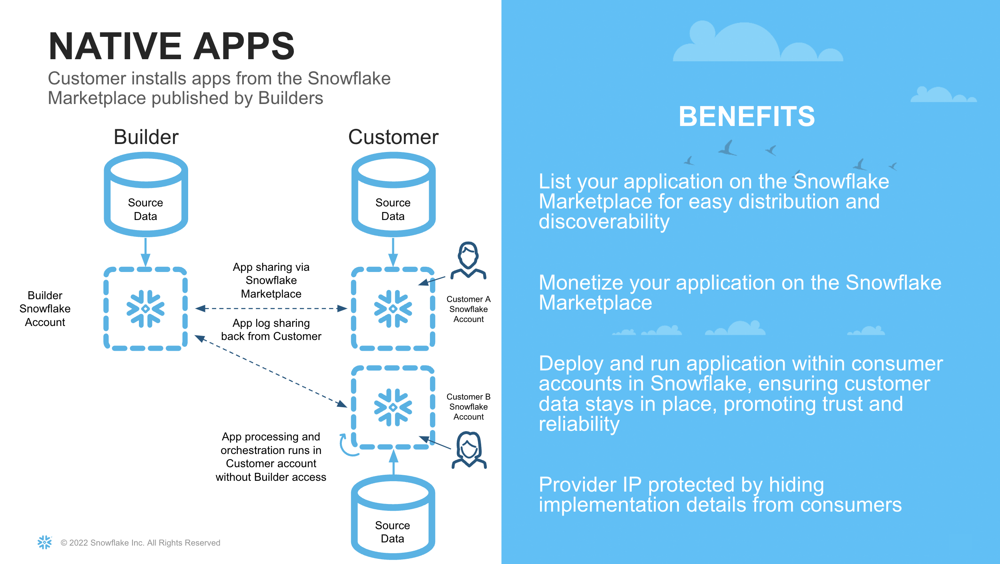
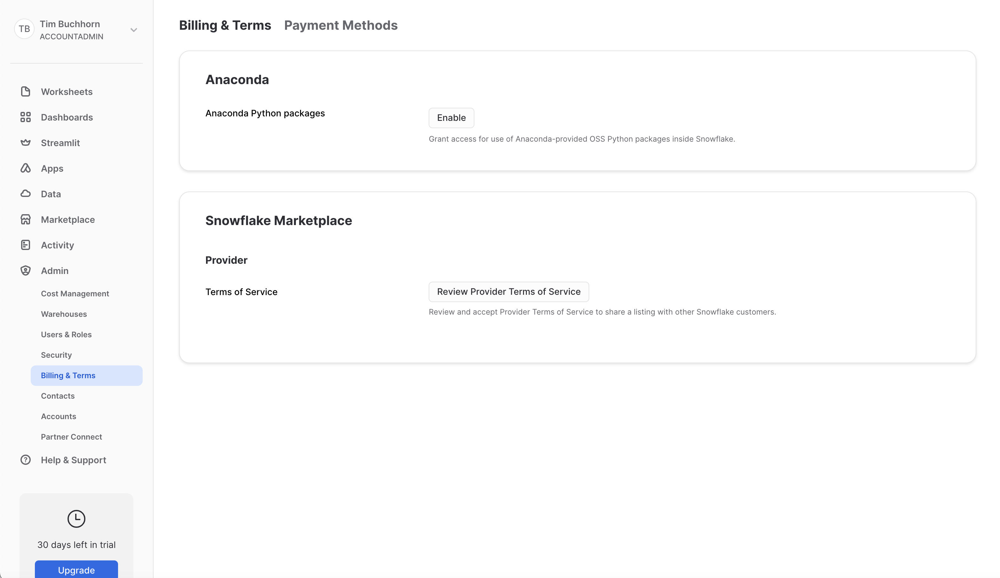

author: Tim Buchhorn
id: data_collaboration_native_app
summary: This is a sample Snowflake Guide
categories: Getting-Started
environments: web
status: Published 
feedback link: https://github.com/Snowflake-Labs/sfguides/issues
tags: Getting Started, Data Science, Data Engineering, Twitter 

# Snowflake Guide Template
<!-- ------------------------ -->
## Overview 
Duration: 1

This Quickstart guide is the second in a series of Collaboration & Applications in Snowflake. Part One of the series can be found [here](https://quickstarts.snowflake.com/guide/data_collaboration_two_way/index.html?index=..%2F..index#0)

In Part One, we showed how using Snowflake's unique collaboration features, we could:
- share data from an organisation to another
- score that data using an ML model
- share it back with the original provider
all in an automated pipeline

In this Quickstart, we will show how we can leverage the Native Apps Framework to simplify this process even further.

The Native App Framework is a collaboration framework that allows providers to share data and/or related business logic to other Snowflake customers. In the previous Quickstart guide, we set up a bi-directional share between two organisations. With the Native App framework, we can simplify this relationship by allowing one party to share its logic in the form of an application to the other. Therefore, we hacve brought the app to the data, as opposed to bringing the data to the app



There are numerous benefits to leveraging the Native App framework for our Use Case. 

### What You Will Learn 
- How to train an ML model and register it to the Model Registry
- How to package the ML Model in an Application Package 
- How to privately list a Native Application 
- How to Consume a Native Application 

### What You Will Build 
- A Native Application that contains an ML Model shared via a Private Listing 


### Prerequisites
- A [GitHub](https://github.com/) Account 
- [VSCode](https://code.visualstudio.com/download) Installed
- [NodeJS](https://nodejs.org/en/download/) Installed
- [GoLang](https://golang.org/doc/install) Installed

<!-- ------------------------ -->
## Business Use Case and Context
Duration: 5

The Business Use case follows a similar scenario as Part One.

In this guide, we are playing the role of Zamboni and Snowbank. The Credit Risk team at Snowbank has noticed a rise in credit card default rates which affects the bottom line of the business. Previously, it has shard data with an external organisation (Zamoboni) who assist with analysing the data and scoring which customers are most likely to default.

This time, the compliance team has said that it is too risky to share this customer data with an external party without proper procedures being followed, which could take a few months to complete. Zamboni have propsed a solution that utilises the Native Application Framework.

Since both companies use Snowflake, Zamboni has proposed sharing their proprietary Credit Default Scoring Model via the Native Application Framework. The advantages of doing this for Snowbank are:
- No customer data leaves Snowbank's Snowflake Account
- The Native App runs within the Snowbank Account. Since Snowflake has been approved for use internally, it is not subject to longer onboarding and cybersecurity checks

The advantages for Zamboni are:
- Simple deployment
- Flexible monetization options

What is different in this scenario compared to Part One, is that it is no longer a bi-directional share of data. Now Zamboni becomes the provider of an Application, and Snowbank becomes the consumer.

### Dataset Details

The dataset contains aggregated profile features for each customer at each statement date. Features are anonymized and normalized, and fall into the following general categories:

D_* = Delinquency variables
S_* = Spend variables
P_* = Payment variables
B_* = Balance variables
R_* = Risk variables

### Dataset Citation

Addison Howard, AritraAmex, Di Xu, Hossein Vashani, inversion, Negin, Sohier Dane. (2022). American Express - Default Prediction. Kaggle. https://kaggle.com/competitions/amex-default-prediction

<!-- ------------------------ -->
## Set up
Duration: 10

Navigate to the [Snowflake Trial Landing Page](https://signup.snowflake.com/?utm_cta=quickstarts_). Follow the prompts to create a Snowflake Account.

Repeat the process above. Be sure to select the same cloud and region as the first account your created. Although it is possible to share across clouds and regions, this guide will not cover this scenario.

Check your emails and follow the prompts to activate both the accounts. One will be the Provider of the Native App (Zamboni) and one will be the Consumer (Snowbank).

<!-- ------------------------ -->

## Provider Account (Zamboni) - Set Up
Duration: 20

In this part of the lab we'll set up our Provider Snowflake account. In our business scenario, this step represents Zamboni developing their proprietry Credit Card Default model from their own datasets.

### Initial Set Up

We first need to accept the terms and conditions to use Anaconda and Snowflake Marketplace. Navigate to Admin > Billings and Terms and enable both Anaconda and Snowflake Marketplace. Screenshot is below 

Next, open up a worksheet and run all following steps as the ACCOUNTADMIN role

```SQL
  -- Change role to accountadmin
  USE ROLE ACCOUNTADMIN;
```

First we can create a [Virtual Warehouse](https://docs.snowflake.com/en/user-guide/warehouses-overview) that can be used to load the initial dataset. We'll create this warehouse with a size of XS which is right sized for that use case in this lab.

```SQL
-- Create a virtual warehouse for data exploration
CREATE OR REPLACE WAREHOUSE QUERY_WH WITH 
  WAREHOUSE_SIZE = 'X-SMALL' 
  WAREHOUSE_TYPE = 'STANDARD' 
  AUTO_SUSPEND = 300 
  AUTO_RESUME = TRUE 
  MIN_CLUSTER_COUNT = 1 
  MAX_CLUSTER_COUNT = 1;
```

### Load Data 

Next we will create a database and schema that will house the tables that store our data to be shared with Zamboni.

```SQL
-- Create the application database and schema
CREATE OR REPLACE DATABASE NATIVE_APP_DEMO;
CREATE OR REPLACE SCHEMA NATIVE_APP_DEMO;
USE SCHEMA NATIVE_APP_DEMO.NATIVE_APP_DEMO;
```

Our data is in Parquet format, so we will create a file format object

```SQL
CREATE OR REPLACE FILE FORMAT parquet_format
TYPE = PARQUET;
```

Next we set up our [External Stage](https://docs.snowflake.com/en/user-guide/data-load-s3-create-stage#external-stages) to our data. In our business scenario, we would have a secure [Storage Integration](https://docs.snowflake.com/en/sql-reference/sql/create-storage-integration) to the external stage rather than a public s3 bucket.

```SQL
CREATE OR REPLACE STAGE quickstart_cc_default_training_data
    URL = 's3://sfquickstarts/two_way_data_share/train/'
    FILE_FORMAT = parquet_format;

CREATE OR REPLACE STAGE quickstart_cc_default_unscored_data
    URL = 's3://sfquickstarts/two_way_data_share/unscored/'
    FILE_FORMAT = parquet_format;
```

This DDL will create the structure for the table which is the main source of data for our lab.

```SQL
CREATE OR REPLACE TABLE cc_default_training_data
  USING TEMPLATE (
    SELECT ARRAY_AGG(OBJECT_CONSTRUCT(*))
      FROM TABLE(
        INFER_SCHEMA(
          LOCATION=>'@quickstart_cc_default_training_data',
          FILE_FORMAT=>'parquet_format'
        )
      ));

-- Create below to be the template of the above (without the target column)
CREATE OR REPLACE TABLE cc_default_unscored_data LIKE cc_default_training_data;
ALTER TABLE cc_default_unscored_data DROP COLUMN "target";

-- Create below to be the template of the above
CREATE OR REPLACE TABLE cc_default_new_data LIKE cc_default_unscored_data;
```

Now we will load the data in the tables. We can scale up the warehouse temporarily so we do not have to wait as long

```SQL
ALTER WAREHOUSE query_wh SET warehouse_size=MEDIUM;
```

The code below loads the data in to the tables.

```SQL
COPY INTO cc_default_training_data 
  FROM @quickstart_cc_default_training_data 
  FILE_FORMAT = (FORMAT_NAME= 'parquet_format') 
  MATCH_BY_COLUMN_NAME=CASE_INSENSITIVE;

COPY INTO cc_default_unscored_data 
  FROM @quickstart_cc_default_unscored_data 
  FILE_FORMAT = (FORMAT_NAME= 'parquet_format') 
  MATCH_BY_COLUMN_NAME=CASE_INSENSITIVE;
```
We can now scale down the warehouse since we have finished loading data for the lab

```SQL
ALTER WAREHOUSE query_wh SET warehouse_size=XSMALL;
```

You should have loaded over 5 million and 7 million rows in a few minutes. To check, query the data in the worksheet

```SQL
SELECT COUNT(*) 
  FROM CC_DEFAULT_TRAINING_DATA;

SELECT COUNT(*) 
  FROM CC_DEFAULT_UNSCORED_DATA;
```

We have loaded all the data in Zamboni. We can now proceed with training the model

<!-- ------------------------ -->
## Consumer Account (Zamboni) - Create Model
Duration: 45

For this section, make sure you download the corresponding [git repo](https://github.com/Snowflake-Labs/sfguide-two-way-data-collaboration) so you have the files referenced in this section.

### Set Up Snowpark for Python and Snowpark ML

The first step is to set up the python environment to develop our model. To do this:

- Download and install the miniconda installer from [https://conda.io/miniconda.html](https://conda.io/miniconda.html). (OR, you may use any other Python environment with Python 3.10, for example, [virtualenv](https://virtualenv.pypa.io/en/latest/)).

- Open a new terminal window in the downloaded directory with the conda_env.yml file and execute the following commands in the same terminal window:

  1. Create the conda environment.
  ```
  conda env create -f conda_env.yml
  ```

  2. Activate the conda environment.
  ```
  conda activate two-way-share-hol
  ```

  3. Start notebook server:
  ```
  $ jupyter notebook
  ```
  Open the jupyter notebook Credit Card Default Notebook

- Update connection.json with your Snowflake account details and credentials.
  Here's a sample based on the object names we created in the last step:

```
{
  "account"   : "<your_account_identifier_goes_here>",
  "user"      : "<your_username_goes_here>",
  "password"  : "<your_password_goes_here>",
  "role"      : "ACCOUNTADMIN",
  "warehouse" : "QUERY_WH",
  "database"  : "SCORED_MODEL",
  "schema"    : "SCORED_MODEL"
}
```

> aside negative
> 
> **Note:** For the account parameter above, specify your account identifier and do not include the snowflakecomputing.com domain name. Snowflake automatically appends this when creating the connection. For more details on that, refer to the documentation.

If you are having some trouble with the steps above, this could be due to having different architectures, such as an M1 chip. In that case, follow the instructions [here](https://docs.snowflake.com/developer-guide/snowpark-ml/index#installing-snowpark-ml-from-the-snowflake-conda-channel) and be sure to conda install jupyter notebooks and pyarrow.

### Train and Register Model
Open up the notebook and follow the steps. Once you have completed those, you will have trained and deployed a ML Model in Snowflake that predicts credit card default risk.

Stay in the Zamboni account for the next step.

<!-- ------------------------ -->
## Distribute Model as Native App
Duration: 2

<!-- ------------------------ -->
## Consume Model via Native App
Duration: 2


<!-- ------------------------ -->
## Metadata Configuration
Duration: 2

It is important to set the correct metadata for your Snowflake Guide. The metadata contains all the information required for listing and publishing your guide and includes the following:


- **summary**: This is a sample Snowflake Guide 
  - This should be a short, 1 sentence description of your guide. This will be visible on the main landing page. 
- **id**: sample 
  - make sure to match the id here with the name of the file, all one word.
- **categories**: data-science 
  - You can have multiple categories, but the first one listed is used for the icon.
- **environments**: web 
  - `web` is default. If this will be published for a specific event or  conference, include it here.
- **status**: Published
  - (`Draft`, `Published`, `Deprecated`, `Hidden`) to indicate the progress and whether the sfguide is ready to be published. `Hidden` implies the sfguide is for restricted use, should be available only by direct URL, and should not appear on the main landing page.
- **feedback link**: https://github.com/Snowflake-Labs/sfguides/issues
- **tags**: Getting Started, Data Science, Twitter 
  - Add relevant  tags to make your sfguide easily found and SEO friendly.
- **authors**: Daniel Myers 
  - Indicate the author(s) of this specific sfguide.

---

You can see the source metadata for this guide you are reading now, on [the github repo](https://raw.githubusercontent.com/Snowflake-Labs/sfguides/master/site/sfguides/sample.md).


<!-- ------------------------ -->
## Creating a Step
Duration: 2

A single sfguide consists of multiple steps. These steps are defined in Markdown using Header 2 tag `##`. 

```markdown
## Step 1 Title
Duration: 3

All the content for the step goes here.

## Step 2 Title
Duration: 1

All the content for the step goes here.
```

To indicate how long each step will take, set the `Duration` under the step title (i.e. `##`) to an integer. The integers refer to minutes. If you set `Duration: 4` then a particular step will take 4 minutes to complete. 

The total sfguide completion time is calculated automatically for you and will be displayed on the landing page. 

<!-- ------------------------ -->
## Code Snippets, Info Boxes, and Tables
Duration: 2

Look at the [markdown source for this sfguide](https://raw.githubusercontent.com/Snowflake-Labs/sfguides/master/site/sfguides/sample.md) to see how to use markdown to generate code snippets, info boxes, and download buttons. 

### JavaScript
```javascript
{ 
  key1: "string", 
  key2: integer,
  key3: "string"
}
```

### Java
```java
for (statement 1; statement 2; statement 3) {
  // code block to be executed
}
```

### Info Boxes
> aside positive
> 
>  This will appear in a positive info box.


> aside negative
> 
>  This will appear in a negative info box.

### Buttons
<button>

  [This is a download button](link.com)
</button>

### Tables
<table>
    <thead>
        <tr>
            <th colspan="2"> **The table header** </th>
        </tr>
    </thead>
    <tbody>
        <tr>
            <td>The table body</td>
            <td>with two columns</td>
        </tr>
    </tbody>
</table>

### Hyperlinking
[Youtube - Halsey Playlists](https://www.youtube.com/user/iamhalsey/playlists)

<!-- ------------------------ -->
## Images, Videos, and Surveys, and iFrames
Duration: 2

Look at the [markdown source for this guide](https://raw.githubusercontent.com/Snowflake-Labs/sfguides/master/site/sfguides/sample.md) to see how to use markdown to generate these elements. 

### Images


### Videos
Videos from youtube can be directly embedded:
<video id="KmeiFXrZucE"></video>

### Inline Surveys
<form>
  <name>How do you rate yourself as a user of Snowflake?</name>
  <input type="radio" value="Beginner">
  <input type="radio" value="Intermediate">
  <input type="radio" value="Advanced">
</form>

### Embed an iframe


<!-- ------------------------ -->
## Conclusion And Resources
Duration: 1

At the end of your Snowflake Guide, always have a clear call to action (CTA). This CTA could be a link to the docs pages, links to videos on youtube, a GitHub repo link, etc. 

If you want to learn more about Snowflake Guide formatting, checkout the official documentation here: [Formatting Guide](https://github.com/googlecodelabs/tools/blob/master/FORMAT-GUIDE.md)

### What You Learned
- creating steps and setting duration
- adding code snippets
- embedding images, videos, and surveys
- importing other markdown files

### Resources
- <link to github code repo>
- <link to documentation>
