author: Tim Buchhorn
id: data_collaboration_two_way
summary: This is a Snowflake Guide on how to use Snowflake's Data Collaboration features to share an enrich data. 
categories: Getting-Started
environments: web
status: Published 
feedback link: https://github.com/Snowflake-Labs/sfguides/issues
tags: Getting Started, Data Science, Data Engineering, Twitter 

# Two Way Data Collaboration
<!-- ------------------------ -->
## Overview 
Duration: 5

This guide will take you through Snowflake's Collaboration features, and highlight how easy it is to share data between two organisations.

It also highlights Snowflakes ability to perform feature engineering, host a ML Model, score data from shared data, and share the enriched (scored) data back to the original Provider. Hence, it is a 2-way sharing relationship, where both accounts are Providers and Consumers.

We will also build on these concepts, and introduce how we can utilise Streams and Tasks to automate this entire process.

### Prerequisites
- [Git](https://git-scm.com/book/en/v2/Getting-Started-Installing-Git) installed
    **Download the git repo here: insert repo**
- [Anaconda](https://www.anaconda.com/) installed
- [Python 3.10](https://www.python.org/downloads/) installed
    - Note that you will be creating a Python environment with 3.10 in the **Consumer Account - Create Model** step
- Snowflake accounts with [Anaconda Packages enabled by ORGADMIN](https://docs.snowflake.com/en/developer-guide/udf/python/udf-python-packages.html#using-third-party-packages-from-anaconda). If you do not have a Snowflake account, you can register for a [free trial account](https://signup.snowflake.com/).
- Snowflake accounts with the Snowflake Marketplace T&C's accepted. This will allow you to create Listings.
- A Snowflake account login with a role that has the ability to create Listings, Databases, Schemas, Tables, Stages, User-Defined Functions, and Stored Procedures. If not, you will need to register for free trials or use a different role.
- The [Snowpark ML](https://docs.snowflake.com/developer-guide/snowpark-ml/index#installing-snowpark-ml-from-the-snowflake-conda-channel) package installed

### What You’ll Learn
- How to become a Provider in Snowflake Marketplace (Private Listings)
- How to Consume a shared private asset in the Snowflake Marketplace
- How to Deploy a ML Model in Snowflake
- How to share seamlessly between two Snowflake Accounts
- How to automate the process using Streams and Tasks  

### What You’ll Need 
- Two [Snowflake](https://signup.snowflake.com/) Accounts in the same cloud and region
- Complete the prerequisites above

### What You’ll Build 
- Ingestion of Credit Card Customer Profile Data
- Sharing raw data seamlessly via a Private Listing
- Consuming shared data via a Private Listing
- Perform feature engineering
- Scoring shared data using a ML model
- Sharing back scored data to the original Provider account
- Automating the above data pipeline using Streams and Tasks

<!-- ------------------------ -->
## Business Use Case and Context
Duration: 5

In this hands-on-lab, we are playing the role of SnowBank. The Credit Risk team has noticed a rise in credit card default rates which affects the bottom line of the business. It has enlisted the help of an external organisation (Zamboni) to score the credit card default risk of their existing customers, based on a series of attributes in categories such as spending, balance, delinquency, payment and risk. The data needs to be shared between the two parties.

Both companies have chosen to use Snowflake. The advantages of doing this are:
- Direct access and no delay data sharing between the Provider and Consumer accounts
- Govern access to your data offering and monitor usage
- Enable targeted discovery with one or many organizations
- Rely on a multitude of built-in data security features
- Reduce extract, transform, load (ETL), and data pipeline maintenance costs

Below is a schematic of the data share
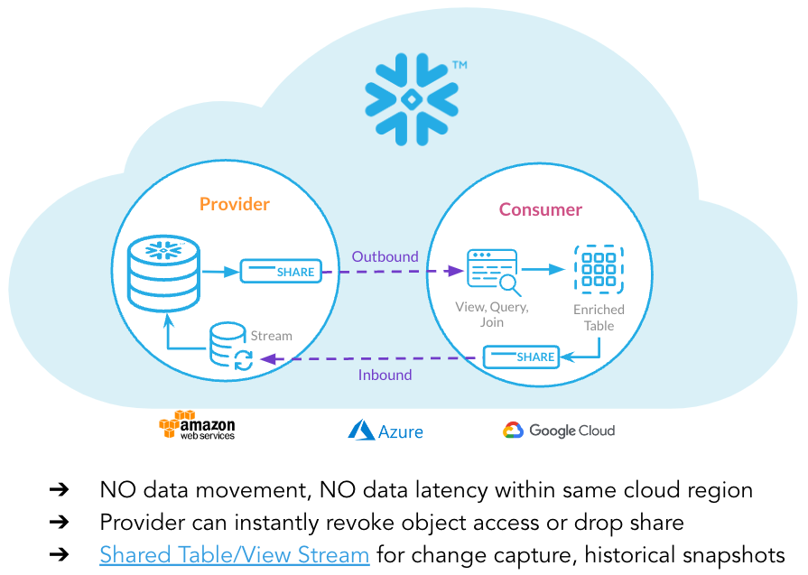

### Example Use Cases

From a business point of view, this architecture exists to satisfy several use cases. Examples include:
- This SnowBank and Zamoboni example. In the Financial Services Industry, there are often external partners that require a secure and governed way to share data. In this exmaple, Zamoboni required access to SnowBanks data to risk score their data. A specific example of this could be a Lenders Mortgage Insurance company that has a Group Contract with a bank. They could execute a default risk model over the customer attributes that the bank has.
- Superannuation and Life Insurance Companies. A more specific example above is claims processing for life insurance. Often times, the Superannuation companies have the necessary attributes required by the insurance companies for claims processing.
- Whitelabel Insurance. Some insurance companies have offerings to white label insurance to other businesses. The architectural pattern of sharing customer attributes from the whitelabel partner for risk scoring is analagous to this use case.

### Dataset Details

The dataset contains aggregated profile features for each customer at each statement date. Features are anonymized and normalized, and fall into the following general categories:

D_* = Delinquency variables
S_* = Spend variables
P_* = Payment variables
B_* = Balance variables
R_* = Risk variables

### Dataset Citation

Addison Howard, AritraAmex, Di Xu, Hossein Vashani, inversion, Negin, Sohier Dane. (2022). American Express - Default Prediction. Kaggle. https://kaggle.com/competitions/amex-default-prediction

<!-- ------------------------ -->
## Set up
Duration: 10

Navigate to the [Snowflake Trial Landing Page](https://signup.snowflake.com/). Follow the prompts to create a Snowflake Account.

Repeat the process above. Be sure to select the same cloud and region as the first account your created. Although it is possible to share accross clouds and regions, this guide will not cover this scenario.

Check your emails and follow the prompts to activate both the accounts. One will be the Provider (SnowBank) and one will be the Consumer (Zamboni).

<!-- ------------------------ -->
## Provider Account (SnowBank) - Set Up
Duration: 20

In this part of the lab we'll set up our Provider Snowflake account, create database structures to house our data, create a Virtual Warehouse to use for data loading, and finally load our credit card default prediction data into our tables.

In our business scenario, this step represents SnowBank loading data from their source systems in to Snowflake, and creating datasets that will be shared with an external partner (Zamboni) which has been tasked with creating a machine learning model to predict defaults on new data. The cc_default_training_data dataset would be sent for the partner to train and test the model, and the cc_default_unscored_data would be new data sent to the partner to be scored and returned. We will create a third stage for illustrative purposes that will simulate newly arriving data, and how the process is automated. We will come back to this in a later step.

### Initial Set Up

We first need to accept the terms and conditions to use Ananconda and Snowflake Marketplace. Navigate to Admin > Billings and Terms and enable both Anaconda and Snowflake Marketplace. Screenshot is below 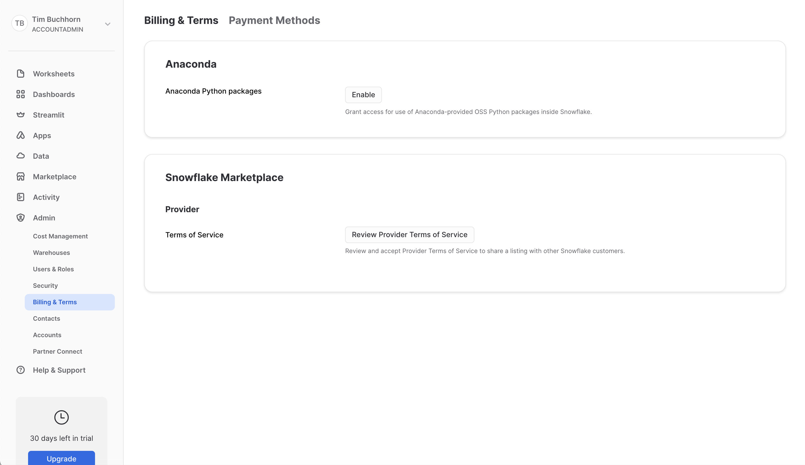

Next, open up a worksheet and run all following steps as the ACCOUNTADMIN role

```SQL
  -- Change role to accountadmin
  USE ROLE ACCOUNTADMIN;
```

First we can create a [Virtual Warehouse](https://docs.snowflake.com/en/user-guide/warehouses-overview) that can be used to load the initial dataset. We'll create this warehouse with a size of XS which is right sized for that use case in this lab.

```SQL
-- Create a virtual warehouse for data exploration
CREATE OR REPLACE WAREHOUSE QUERY_WH WITH 
  WAREHOUSE_SIZE = 'X-SMALL' 
  WAREHOUSE_TYPE = 'STANDARD' 
  AUTO_SUSPEND = 300 
  AUTO_RESUME = TRUE 
  MIN_CLUSTER_COUNT = 1 
  MAX_CLUSTER_COUNT = 1;
```

### Load Data 

Next we will create a database and schema that will house the tables that store our data to be shared with Zamoboni.

```SQL
-- Create the application database and schema
CREATE OR REPLACE DATABASE DATA_SHARING_DEMO;
CREATE OR REPLACE SCHEMA DATA_SHARING_DEMO;
```

Our data is in Parquet format, so we will create a file format object

```SQL
CREATE OR REPLACE FILE FORMAT parquet_format
TYPE = PARQUET;
```

Next we set up our [External Stage](https://docs.snowflake.com/en/user-guide/data-load-s3-create-stage#external-stages) to our data. In our business scenario, we would have a secure [Storage Integration](https://docs.snowflake.com/en/sql-reference/sql/create-storage-integration) to the external stage rather than a public s3 bucket.

```SQL
CREATE OR REPLACE STAGE quickstart_cc_default_training_data
    URL = 's3://sfquickstarts/two_way_data_share/train/'
    FILE_FORMAT = parquet_format;

CREATE OR REPLACE STAGE quickstart_cc_default_unscored_data
    URL = 's3://sfquickstarts/two_way_data_share/unscored/'
    FILE_FORMAT = parquet_format;

CREATE OR REPLACE STAGE quickstart_cc_default_new_data
  URL = 's3://sfquickstarts/two_way_data_share/new_data/'
  FILE_FORMAT = parquet_format;
```

This DDL will create the structure for the table which is the main source of data for our lab.

```SQL
CREATE OR REPLACE TABLE cc_default_training_data
  USING TEMPLATE (
    SELECT ARRAY_AGG(OBJECT_CONSTRUCT(*))
      FROM TABLE(
        INFER_SCHEMA(
          LOCATION=>'@quickstart_cc_default_training_data',
          FILE_FORMAT=>'parquet_format'
        )
      ));

-- Create below to be the template of the above (without the target column)
CREATE OR REPLACE TABLE cc_default_unscored_data LIKE cc_default_training_data;
ALTER TABLE cc_default_unscored_data DROP COLUMN "target";

-- Create below to be the template of the above
CREATE OR REPLACE TABLE cc_default_new_data LIKE cc_default_unscored_data;
```

Before we load data, we need to enable change tracking in one of the tables. We will come back to this in a later step, but we need to enable it noe before we load any data.

```SQL
ALTER TABLE DATA_SHARING_DEMO.DATA_SHARING_DEMO.CC_DEFAULT_UNSCORED_DATA SET CHANGE_TRACKING = TRUE;
```

Now we will load the data in the tables. We can scale up the warehouse temporarily so we do not have to wait as long

```SQL
ALTER WAREHOUSE query_wh SET warehouse_size=MEDIUM;
```

The code below loads the data in to the tables.

```SQL
  COPY INTO cc_default_training_data 
    FROM @quickstart_cc_default_training_data 
    FILE_FORMAT = (FORMAT_NAME= 'parquet_format') 
    MATCH_BY_COLUMN_NAME=CASE_INSENSITIVE;

  COPY INTO cc_default_unscored_data 
    FROM @quickstart_cc_default_unscored_data 
    FILE_FORMAT = (FORMAT_NAME= 'parquet_format') 
    MATCH_BY_COLUMN_NAME=CASE_INSENSITIVE;

  COPY INTO cc_default_new_data 
    FROM @quickstart_cc_default_new_data 
    FILE_FORMAT = (FORMAT_NAME= 'parquet_format') 
    MATCH_BY_COLUMN_NAME=CASE_INSENSITIVE;
```
We can now scale down the warehouse since we have finished loading data for the lab

```SQL
ALTER WAREHOUSE query_wh SET warehouse_size=XSMALL;
```

You should have loaded over 5 million and 7 million rows in a few minutes. To check, query the data in the worksheet

```SQL
  SELECT COUNT(*) 
    FROM cc_default_training_data;

  SELECT COUNT(*) 
    FROM CC_DEFAULT_UNSCORED_DATA;
```

We have loaded all the data in SnowBank. We can now switch over to our second account (Zamboni)

<!-- ------------------------ -->
## Consumer Account (Zamboni) - Set Up
Duration: 5

In this step, we set up the consumer account. Log in to the second trial account that was set up, and accept the Anaconda and Snowflake Marketplace Terms as we did in the last step. 

Next we will create a database and schema that will house the tables that store our scored data to be shared back with SnowBank.

```SQL
USE ROLE ACCOUNTADMIN;

-- Create the application database and schema
CREATE OR REPLACE DATABASE scored_model;
CREATE OR REPLACE SCHEMA scored_model;
```

We need to get the account details to share with SnowBank, so they can set up a Private Listing with us, as we do not want anyone outside of our partnership to have access to / discover the data. For this, we need to note the account identifier. Instructions on how to do this can be found [here](https://docs.snowflake.com/en/user-guide/admin-account-identifier). Once you have noted this, return to the Provider account.

A screenshot on how to find your account identifier from the Snowsight UI is shown below 
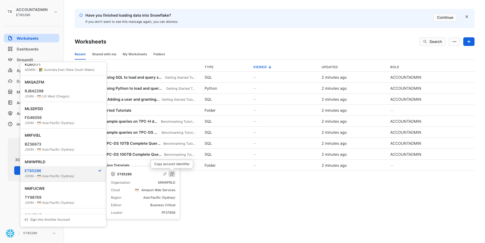

After you have noted / copied these details, switch back to the SnowBank account.

<!-- ------------------------ -->
## Provider Account (SnowBank) - Create Private Listing
Duration: 10

In the SnowBank account, open up Snowsight and navigate to Data > Provider Studio on the left hand menu. then click the blue "Listing" button in the top right. Screenshot is below: 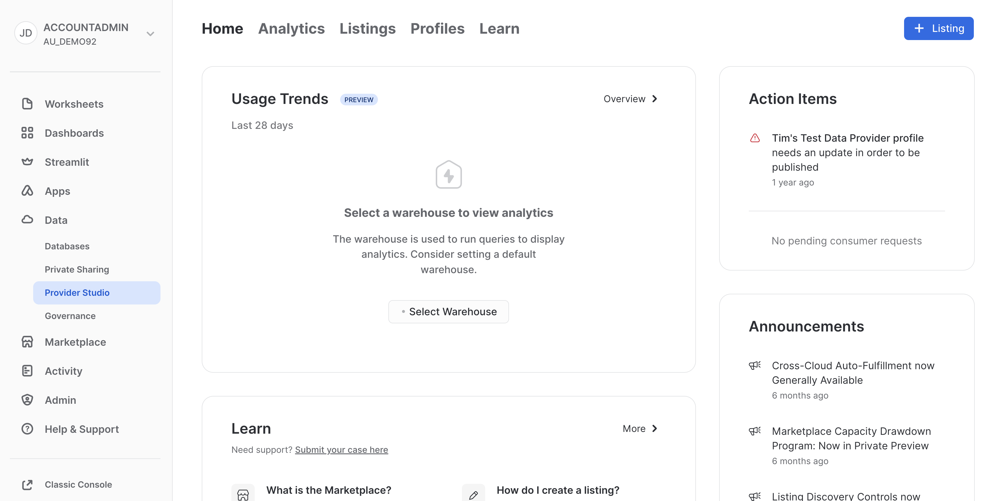

In the modal, enter the name of the Private Listing that we wish to share with our external partner (Zamboni). We have named it cc_default_training_data. They will securely access this data from their own Snowflake account, and share back the scored results. We have selected "Only Specified Consumers" in our discovery settings, so that our data can only be seen with the partners we explicitly want to share with. Screenshot is below: 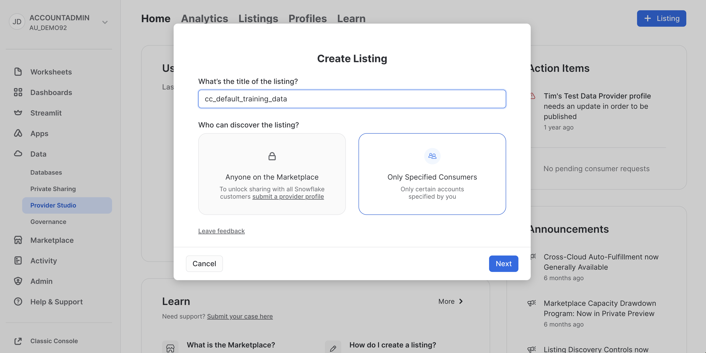

In the next modal, click the "+ Select" option. Select the CC_DEFAULT_TRAINING_DATA in the DATA_SHARING_DEMO database and schema. Add it to the listing by clicking "Done". Change the Secure Share Identifier to DATA_SHARING_DEMO and update the description of the listing. Lastly, we add the consumer account. Since we selected Private Listing, the accounts we specify in this option are the only accounts that will be able to discover and utilise this share. Add the consumer account identifier we noted from the previous section. A screenshow is below: 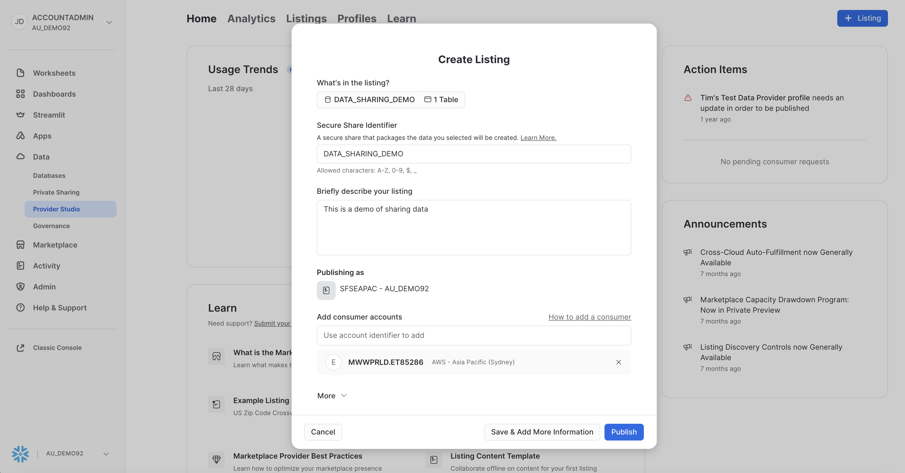

Click Publish, and now your listing is live and ready for the consumer. No movement of data, no SFTP. The data is live and ready to query. Next we switch over to the Zamboni account to accept the share.

<!-- ------------------------ -->
## Consumer Account (Zamboni) - Accept Share and Create Warehouses
Duration: 10

In this section, we assume the role of the consumer of the data (Zamboni). Our data science team will take the data shared with us securely, score it for credit card default risk, and share the results back with SnowBank (the original data provider).

The first step is to accept the share. Log in to the Zamboni and ensure you have assumed the ACCOUNTADMIN Role. Navigate to Data > Private Sharing and you should see the cc_default_training_data waiting for the ACCOUNTADMIN to accept. Screenshot below
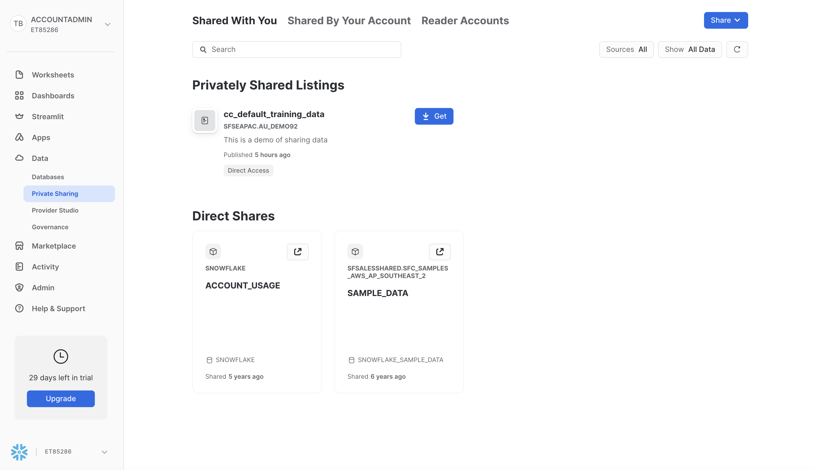

Click Get, and in the next modal, click Get.
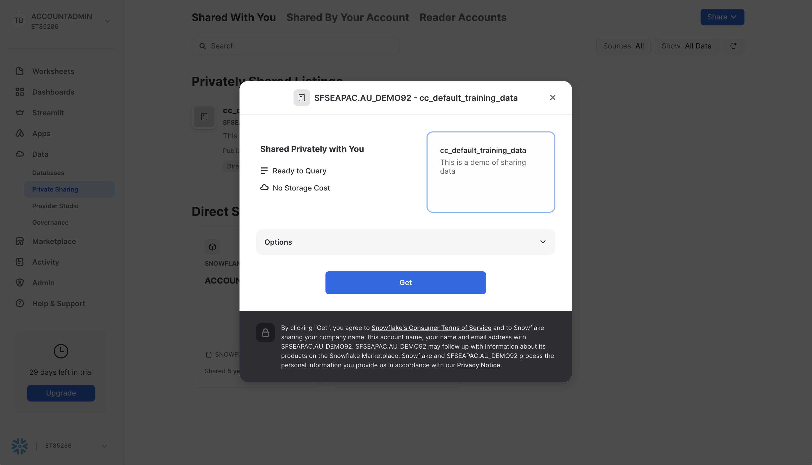

You should now see CC_DEFAULT_TRAINING_DATA as one of the Databases in your catalog, with the DATA_SHARING_DEMO schema and the CC_DEFAULT_TRAINING_DATA. We did not need to load any data, it is shared live from the Provider. Screenshot below
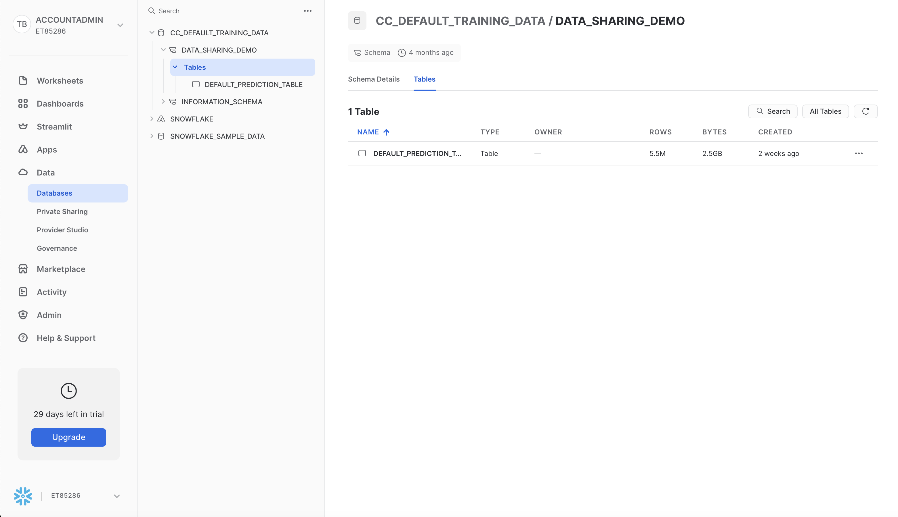

Next we will create some warehouses to query the shared data and to train our model in subsequent steps. We will create a [Snowpark Optimised Warehouse](https://docs.snowflake.com/en/developer-guide/snowpark/python/python-snowpark-training-ml) for our training jobs. Open up a worksheet and run the following commands. 

```SQL
  -- Change role to accountadmin
USE ROLE ACCOUNTADMIN;

  -- Create a virtual warehouse for data exploration
CREATE OR REPLACE WAREHOUSE QUERY_WH WITH 
  WAREHOUSE_SIZE = 'X-SMALL' 
  WAREHOUSE_TYPE = 'STANDARD' 
  AUTO_SUSPEND = 300 
  AUTO_RESUME = TRUE 
  MIN_CLUSTER_COUNT = 1 
  MAX_CLUSTER_COUNT = 1;

  -- Create a virtual warehouse for training
CREATE OR REPLACE WAREHOUSE training_wh with 
  WAREHOUSE_SIZE = 'MEDIUM' 
  WAREHOUSE_TYPE = 'snowpark-optimized' 
  MAX_CONCURRENCY_LEVEL = 1
  AUTO_SUSPEND = 300 
  AUTO_RESUME = TRUE;
```

We will train our model in the next step. We stay in this account.

<!-- ------------------------ -->
## Consumer Account (Zamboni) - Create Model
Duration: 45

For this section, make sure you download the corresponding git repo (https://github.com/Snowflake-Labs/sfguide-two-way-data-collaboration) so you have the files referenced in this section.

### Set Up Snowpark for Python and Snowpark ML

The first step is to set up the python environment to develop our model. To do this:

- Download and install the miniconda installer from [https://conda.io/miniconda.html](https://conda.io/miniconda.html). (OR, you may use any other Python environment with Python 3.10, for example, [virtualenv](https://virtualenv.pypa.io/en/latest/)).

- Open a new terminal window in the downloaded directory with the conda_env.yml file and execute the following commands in the same terminal window:

  1. Create the conda environment.
  ```
  conda env create -f conda_env.yml
  ```

  2. Activate the conda environment.
  ```
  conda activate two-way-share-hol
  ```

  3. Start notebook server:
  ```
  $ jupyter notebook
  ```
  Open the jupyter notebook Credit Card Default Notebook

- Update connection.json with your Snowflake account details and credentials.
  Here's a sample based on the object names we created in the last step:

```
{
  "account"   : "<your_account_identifier_goes_here>",
  "user"      : "<your_username_goes_here>",
  "password"  : "<your_password_goes_here>",
  "role"      : "ACCOUNTADMIN",
  "warehouse" : "QUERY_WH",
  "database"  : "SCORED_MODEL",
  "schema"    : "SCORED_MODEL"
}
```

> aside negative
> 
> **Note:** For the account parameter above, specify your account identifier and do not include the snowflakecomputing.com domain name. Snowflake automatically appends this when creating the connection. For more details on that, refer to the documentation.

If you are having some trouble with the steps above, this could be due to having different architectures, such as an M1 chip. In that case, follow the instructions [here](https://docs.snowflake.com/developer-guide/snowpark-ml/index#installing-snowpark-ml-from-the-snowflake-conda-channel) and be sure to conda install jupyter notebooks and pyarrow.

### Train Model
Open up the notebook and follow the steps. Once you have completed those, you will have trained and deployed a ML Model in Snowflake that predicts credit card default risk.

Stay in the Zamboni account for the next step.

<!-- ------------------------ -->
## Consumer Account (Zamboni) - Productionise the ML Pipeline
Duration: 15

Now we have trained the ML model, we will create some Stored Procedures which holds the feature engineering and scoring logic. In a subsequent step, we will encompass these in Streams and Tasks to automate this pipeline.

Open up a SQL Worksheet in Snowsight. First we can check that the UDF was deployed from the Jupyter Notebook by running the following:

```SQL
SHOW USER FUNCTIONS;
```

You should see BATCH_PREDICT_CC_DEFAULT Vectorized UDF we deployed in the previous steps.

Next we will create some stored procedures which hold our feature engineering logic. We will do this so we can later execute these Stored Procedures from a Task for automation.

Run the following coide in a worksheet to create the Stored Procedure.


```SQL
CREATE OR REPLACE PROCEDURE cc_profile_processing(rawTable VARCHAR, targetTable VARCHAR, imputeTable VARCHAR)
RETURNS STRING
LANGUAGE PYTHON
RUNTIME_VERSION = '3.8'
PACKAGES = ('snowflake-snowpark-python', 'snowflake-ml-python')
HANDLER = 'feature_transform'
EXECUTE AS CALLER
AS
$$
import snowflake.snowpark as snp
import snowflake.snowpark.window as W
import snowflake.snowpark.functions as F
import snowflake.snowpark.types as T
import snowflake.ml.modeling.impute as I

def feature_transform(session, raw_table, target_table, impute_table):
    input_df = session.table(raw_table)
    impute_df = session.table(impute_table)
    feature_cols = input_df.columns
    feature_cols.remove('"customer_ID"')

    for col_name in feature_cols:
        input_df = input_df.withColumn(col_name, F.col(col_name).cast(T.FloatType()))

    my_imputer = I.SimpleImputer(input_cols= feature_cols,
                           output_cols= feature_cols,
                           strategy='most_frequent')
    my_imputer.fit(impute_df)
    input_df = my_imputer.transform(input_df)
    
    # Feature engineer raw input
    #Average
    features_avg = ['B_1', 'B_2', 'B_3', 'B_4', 'B_5', 'B_6', 'B_8', 'B_9', 'B_10', 'B_11', 'B_12', 'B_13', 'B_14', 'B_15', 'B_16', 'B_17', 'B_18', 'B_19', 'B_20', 'B_21', 'B_22', 'B_23', 'B_24', 'B_25', 'B_28', 'B_29', 'B_30', 'B_32', 'B_33', 'B_37', 'B_38', 'B_39', 'B_40', 'B_41', 'B_42', 'D_39', 'D_41', 'D_42', 'D_43', 'D_44', 'D_45', 'D_46', 'D_47', 'D_48', 'D_50', 'D_51', 'D_53', 'D_54', 'D_55', 'D_58', 'D_59', 'D_60', 'D_61', 'D_62', 'D_65', 'D_66', 'D_69', 'D_70', 'D_71', 'D_72', 'D_73', 'D_74', 'D_75', 'D_76', 'D_77', 'D_78', 'D_80', 'D_82', 'D_84', 'D_86', 'D_91', 'D_92', 'D_94', 'D_96', 'D_103', 'D_104', 'D_108', 'D_112', 'D_113', 'D_114', 'D_115', 'D_117', 'D_118', 'D_119', 'D_120', 'D_121', 'D_122', 'D_123', 'D_124', 'D_125', 'D_126', 'D_128', 'D_129', 'D_131', 'D_132', 'D_133', 'D_134', 'D_135', 'D_136', 'D_140', 'D_141', 'D_142', 'D_144', 'D_145', 'P_2', 'P_3', 'P_4', 'R_1', 'R_2', 'R_3', 'R_7', 'R_8', 'R_9', 'R_10', 'R_11', 'R_14', 'R_15', 'R_16', 'R_17', 'R_20', 'R_21', 'R_22', 'R_24', 'R_26', 'R_27', 'S_3', 'S_5', 'S_6', 'S_7', 'S_9', 'S_11', 'S_12', 'S_13', 'S_15', 'S_16', 'S_18', 'S_22', 'S_23', 'S_25', 'S_26']
    feat = [F.col(c) for c in features_avg]
    exprs = {x: "avg" for x in features_avg}
    df_avg = (input_df
          .groupBy('"customer_ID"')
          .agg(exprs)
          .rename({F.col(f"AVG({f})"): f"{f}_avg" for f in features_avg})
         )
    
    # Minimum
    features_min = ['B_2', 'B_4', 'B_5', 'B_9', 'B_13', 'B_14', 'B_15', 'B_16', 'B_17', 'B_19', 'B_20', 'B_28', 'B_29', 'B_33', 'B_36', 'B_42', 'D_39', 'D_41', 'D_42', 'D_45', 'D_46', 'D_48', 'D_50', 'D_51', 'D_53', 'D_55', 'D_56', 'D_58', 'D_59', 'D_60', 'D_62', 'D_70', 'D_71', 'D_74', 'D_75', 'D_78', 'D_83', 'D_102', 'D_112', 'D_113', 'D_115', 'D_118', 'D_119', 'D_121', 'D_122', 'D_128', 'D_132', 'D_140', 'D_141', 'D_144', 'D_145', 'P_2', 'P_3', 'R_1', 'R_27', 'S_3', 'S_5', 'S_7', 'S_9', 'S_11', 'S_12', 'S_23', 'S_25']
    exprs_min = {x: "min" for x in features_min}
    df_min = (input_df
          .groupBy('"customer_ID"')
          .agg(exprs_min)
          .rename({F.col(f"MIN({f})"): f"{f}_min" for f in features_min})
         )
    
    # Maximum
    features_max = ['B_1', 'B_2', 'B_3', 'B_4', 'B_5', 'B_6', 'B_7', 'B_8', 'B_9', 'B_10', 'B_12', 'B_13', 'B_14', 'B_15', 'B_16', 'B_17', 'B_18', 'B_19', 'B_21', 'B_23', 'B_24', 'B_25', 'B_29', 'B_30', 'B_33', 'B_37', 'B_38', 'B_39', 'B_40', 'B_42', 'D_39', 'D_41', 'D_42', 'D_43', 'D_44', 'D_45', 'D_46', 'D_47', 'D_48', 'D_49', 'D_50', 'D_52', 'D_55', 'D_56', 'D_58', 'D_59', 'D_60', 'D_61', 'D_63', 'D_64', 'D_65', 'D_70', 'D_71', 'D_72', 'D_73', 'D_74', 'D_76', 'D_77', 'D_78', 'D_80', 'D_82', 'D_84', 'D_91', 'D_102', 'D_105', 'D_107', 'D_110', 'D_111', 'D_112', 'D_115', 'D_116', 'D_117', 'D_118', 'D_119', 'D_121', 'D_122', 'D_123', 'D_124', 'D_125', 'D_126', 'D_128', 'D_131', 'D_132', 'D_133', 'D_134', 'D_135', 'D_136', 'D_138', 'D_140', 'D_141', 'D_142', 'D_144', 'D_145', 'P_2', 'P_3', 'P_4', 'R_1', 'R_3', 'R_5', 'R_6', 'R_7', 'R_8', 'R_10', 'R_11', 'R_14', 'R_17', 'R_20', 'R_26', 'R_27', 'S_3', 'S_5', 'S_7', 'S_8', 'S_11', 'S_12', 'S_13', 'S_15', 'S_16', 'S_22', 'S_23', 'S_24', 'S_25', 'S_26', 'S_27']
    exprs_max = {x: "max" for x in features_max}
    df_max = (input_df
          .groupBy('"customer_ID"')
          .agg(exprs_max)
          .rename({F.col(f"MAX({f})"): f"{f}_max" for f in features_max})
         )
    
    # Last
    features_last = ['B_1', 'B_2', 'B_3', 'B_4', 'B_5', 'B_6', 'B_7', 'B_8', 'B_9', 'B_10', 'B_11', 'B_12', 'B_13', 'B_14', 'B_15', 'B_16', 'B_17', 'B_18', 'B_19', 'B_20', 'B_21', 'B_22', 'B_23', 'B_24', 'B_25', 'B_26', 'B_28', 'B_29', 'B_30', 'B_32', 'B_33', 'B_36', 'B_37', 'B_38', 'B_39', 'B_40', 'B_41', 'B_42', 'D_39', 'D_41', 'D_42', 'D_43', 'D_44', 'D_45', 'D_46', 'D_47', 'D_48', 'D_49', 'D_50', 'D_51', 'D_52', 'D_53', 'D_54', 'D_55', 'D_56', 'D_58', 'D_59', 'D_60', 'D_61', 'D_62', 'D_63', 'D_64', 'D_65', 'D_69', 'D_70', 'D_71', 'D_72', 'D_73', 'D_75', 'D_76', 'D_77', 'D_78', 'D_79', 'D_80', 'D_81', 'D_82', 'D_83', 'D_86', 'D_91', 'D_96', 'D_105', 'D_106', 'D_112', 'D_114', 'D_119', 'D_120', 'D_121', 'D_122', 'D_124', 'D_125', 'D_126', 'D_127', 'D_130', 'D_131', 'D_132', 'D_133', 'D_134', 'D_138', 'D_140', 'D_141', 'D_142', 'D_145', 'P_2', 'P_3', 'P_4', 'R_1', 'R_2', 'R_3', 'R_4', 'R_5', 'R_6', 'R_7', 'R_8', 'R_9', 'R_10', 'R_11', 'R_12', 'R_13', 'R_14', 'R_15', 'R_19', 'R_20', 'R_26', 'R_27', 'S_3', 'S_5', 'S_6', 'S_7', 'S_8', 'S_9', 'S_11', 'S_12', 'S_13', 'S_16', 'S_19', 'S_20', 'S_22', 'S_23', 'S_24', 'S_25', 'S_26', 'S_27', '"customer_ID"']
    w = snp.Window.partition_by('"customer_ID"').order_by(F.col('S_2').desc())
    df_last = input_df.withColumn("rn", F.row_number().over(w)).filter("rn = 1").select(features_last)
    
    # Join
    feature_df = df_min.natural_join(df_avg)
    feature_df = feature_df.natural_join(df_max)
    feature_df = feature_df.natural_join(df_last)

    feature_df.write.save_as_table(target_table, mode="overwrite")
    
    return "Success"
$$;
```

Next we will create a Stored Procedure that encompasses the UDF we created.

```SQL
CREATE OR REPLACE PROCEDURE cc_batch_processing(rawTable VARCHAR, targetTable VARCHAR)
RETURNS STRING
LANGUAGE PYTHON
RUNTIME_VERSION = '3.8'
PACKAGES = ('snowflake-snowpark-python')
HANDLER = 'cc_batch_processing'
AS
$$
from snowflake.snowpark.functions import call_udf
import snowflake.snowpark.functions as F

def cc_batch_processing(session, raw_table, target_table):

    batch_df = session.table(raw_table)
    feature_cols = batch_df.columns
    feature_cols.remove('"customer_ID"')
    
    scored_data = batch_df.select('"customer_ID"', call_udf("batch_predict_cc_default", [F.col(c) for c in feature_cols]).alias('Prediction'))
    
    scored_data.write.save_as_table(target_table, mode="append")

    return "Success"
$$;
```

Check we have created the Stored Procedures by running the following

```SQL
SHOW PROCEDURES;
```

You should see two Stored Procedures; CC_BATCH_PROCESSING and CC_PROFILE_PROCESSING.

Let's now switch over to the SnowBank account and share a new dataset to be scored.

<!-- ------------------------ -->
## Provider Account (SnowBank) - Share New Data
Duration: 10

In this section, we will go back to assuming the role of the bank. We will switch back to our original provider account and create another listing of unscored data to share to our partner to score for default risk. This time however, we will create a [stream on the shared table](https://docs.snowflake.com/en/user-guide/data-sharing-provider#label-data-sharing-streams) so the new data can be shared live (without etl). In order to set up a stream, the provider of data (SnowBank in this example) needs to have enables Change Tracking on the table. We have already done this in our set-up step.

Next, lets add this data to the listing. Navigate to Data > Private Sharing in Snowsight. Then select "Shared By Your Account" in the top menu, and select "DATA_SHARING_DEMO".

Scroll to the Data section and select "Edit". Screenshot below
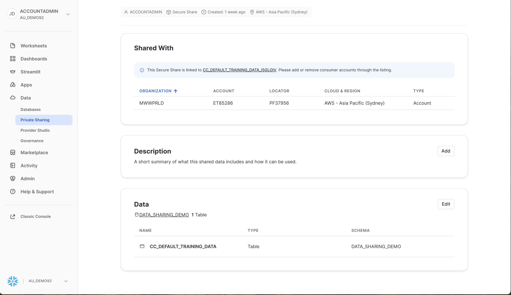

From this screen, select the "CC_DEFAULT_UNSCORED_DATA" and click "Done", then in the following screen, click "Save".

Your listing has now been updated, and the Consumer Account will be able to see the new table.

Switch over to the Zamboni account for the next step.

<!-- ------------------------ -->
## Consumer Account (Zamboni) - Automate Scoring Pipeline
Duration: 10

Switch over to the Consumer Account, and you should see the newly shared table in the databases tab. If not, click the ellipsis and click "Refresh". Screenshot below.
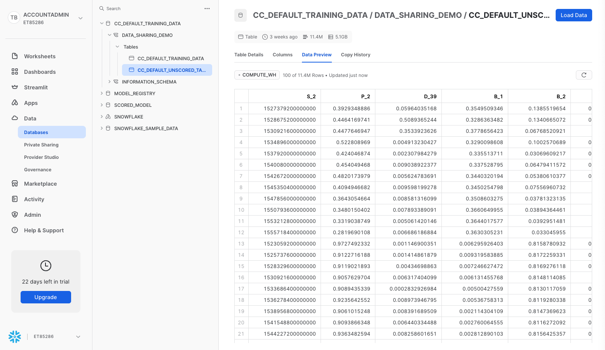

Let manually execute our pipeline for demonstrative purposes, and then later in this step we will use Streams and Tasks to score and share any newly arriving data.

In a worksheet, run the following code:

```SQL
CALL cc_profile_processing('CC_DEFAULT_TRAINING_DATA.DATA_SHARING_DEMO.CC_DEFAULT_UNSCORED_DATA', 'TRANSFORMED_TABLE', 'CC_DEFAULT_TRAINING_DATA.DATA_SHARING_DEMO.CC_DEFAULT_UNSCORED_DATA');
```
```SQL
CALL cc_batch_processing('TRANSFORMED_TABLE', 'SCORED_TABLE');
```

By running those two Stored Procedures sequentially, we chould now have feature engineered and scored the newly shared data! We can run the following and see the results

```SQL
SELECT * FROM SCORED_MODEL.SCORED_MODEL.SCORED_TABLE LIMIT 100;
```

Next we will create a pipeline from streams and tasks to automate the feature engineering of the newly shared data, score it, and make it available to the Bank.

First we will create a Stream on the newly shared table with the following code, and check it was created successfully. Open a worksheet and run the following:

```SQL
CREATE OR REPLACE STREAM CC_DEFAULT_DATA_STREAM ON TABLE CC_DEFAULT_TRAINING_DATA.DATA_SHARING_DEMO.CC_DEFAULT_UNSCORED_DATA;

SHOW STREAMS;
```
Next, lets set up a task to transform this data, using the Stored Procedures and UDFs we created in step 9.

The first task is Change Data Capture (CDC) which checks the stream for new arriving data, and moves it in to an intermediate table for feature engineering.

```SQL
-- Create intermediate table
CREATE OR REPLACE TABLE SCORED_MODEL.SCORED_MODEL.NEW_CC_DEFAULT_DATA LIKE CC_DEFAULT_TRAINING_DATA.DATA_SHARING_DEMO.CC_DEFAULT_UNSCORED_DATA;
```

```SQL
CREATE OR REPLACE TASK CDC
    WAREHOUSE = 'QUERY_WH'
    SCHEDULE = 'USING CRON 0 0 1 1 * UTC'
    -- We will not need the schedule once triggered tasks is GA
    WHEN system$stream_has_data('CC_DEFAULT_DATA_STREAM')
AS
INSERT INTO SCORED_MODEL.SCORED_MODEL.NEW_CC_DEFAULT_DATA
SELECT * exclude (metadata$row_id, metadata$action, metadata$isupdate) FROM CC_DEFAULT_DATA_STREAM
WHERE METADATA$ACTION = 'INSERT';
```
Then we create a second task dependant on the first that performs the feature engineering.

```SQL
CREATE OR REPLACE TASK FEATURE_ENG
    WAREHOUSE = 'QUERY_WH'
AFTER CDC
AS
    CALL cc_profile_processing('NEW_CC_DEFAULT_DATA', 'TRANSFORMED_TABLE', 'CC_DEFAULT_TRAINING_DATA.DATA_SHARING_DEMO.CC_DEFAULT_UNSCORED_DATA');
```

Then we make a task dependant on the above which scores the model.

```SQL
CREATE OR REPLACE TASK score_data 
    WAREHOUSE = 'QUERY_WH'
AFTER FEATURE_ENG
AS 
CALL cc_batch_processing('TRANSFORMED_TABLE', 'SCORED_TABLE');
```

Finally, we add a task that runs when the data is successfully processed and clears the intermediate table

```SQL
CREATE OR REPLACE TASK clean_int_table 
    WAREHOUSE = 'QUERY_WH'
AFTER SCORE_DATA
AS 
TRUNCATE TABLE IF EXISTS SCORED_MODEL.SCORED_MODEL.NEW_CC_DEFAULT_DATA;
```

Check the tasks are created by running the following

```SQL
SHOW TASKS;
```
We should see the four tasks we just created.

We now need to switch these tasks on from a suspended state. Since they are dependant on each other, we need to do these in reverse order. Run the following commands

```SQL
ALTER TASK CLEAN_INT_TABLE RESUME;
ALTER TASK SCORE_DATA RESUME;
ALTER TASK FEATURE_ENG RESUME;
ALTER TASK CDC RESUME;
```

Now lets share our scored table back to the Bank. This process is the same as step 6 in reverse. Navigate to Data > Provider Studio on the left hand menu. then click the Listings button in the top right. Screenshot is below: 

In the modal, enter the name of the Private Listing that we wish to share with our external partner. We have named it SCORED_DATA. Screenshot is below: 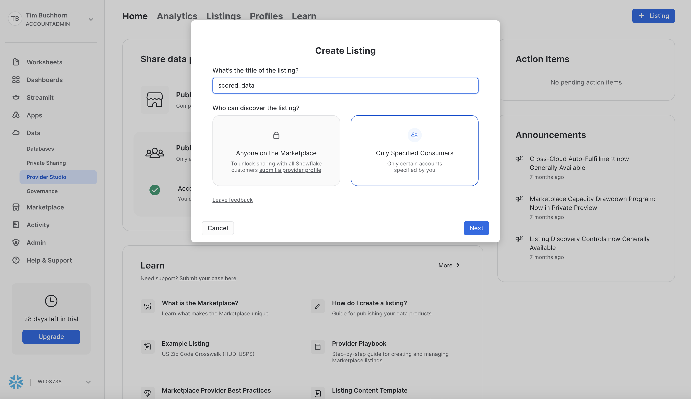

In the next modal, click the "+ Select" option. In this next modal, select the SCORED_TABLE in the SCORED_MODEL database and schema. Add it to the listing. Change the Secure Share Identifier to SCORED_MODEL and update the description of the listing. Lastly, we add the consumer accounts. Since we selected Private Listing, the accounts we specify in this option are the only accounts that will be able to discover and utilise this share. Add the consumer account identifier for SnowBank. You will have to switch over to that account and get the detials as we did in step 5. A screenshot is below: 

Switch over to the SnowBank account for the next step.

<!-- ------------------------ -->
## Provider Account (SnowBank) - Accept Share and Use Scored Data
Duration: 5

Open up the SnowBank account, and accept the share from Zamboni of the newly scored data. This is the same process in reverse of Step 7.

Navigate to Data > Private Sharing and you should see the scored_data waiting for the ACCOUNTADMIN to accept. Screenshot below
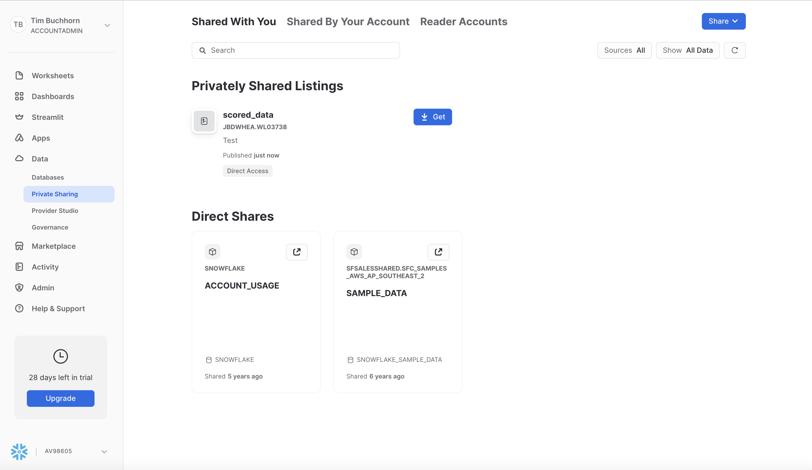

Click Get, and in the next modal, click Get.
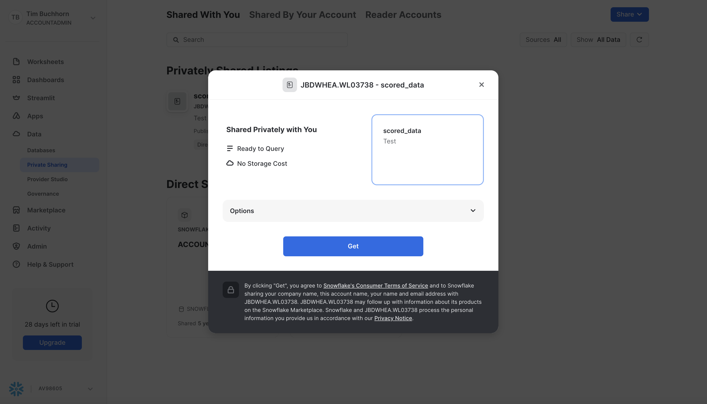

You should now see SCORED_DATA as one of the Databases in your catalog, with the SCORED_MODEL schema and the SCORED_TABLE. We did not need to load any data, it is shared live from the Zamboni.

<!-- ------------------------ -->
## Provider Account (SnowBank) -  Add New Data
Duration: 10

In this section, we will add some new data to demonstate how the automated pipeline would operate between the two accounts.

Specifically, we will add the credit card default information of 2 customers (new_customer_1 and new_customer_2) to the CC_DEFAULT_UNSCORED_DATA in the SnowBank account. This will then trigger the Stream in the Zamboni account via the live share. Thereafter, the feature engineering task will run, and the scoring model will run sequentially via tasks, and the new data will be appended to the SCORED_TABLE in the Zamboni Account. Since that table is shared live with SnowBank, we will see the new scored results. This entire pipeline is automated using Snowflake Features.

The first step is to add new data to the CC_DEFAULT_UNSCORED_DATA table in the SnowBank account. Run the following SQL to add the new data to the table

```SQL
INSERT INTO DATA_SHARING_DEMO.DATA_SHARING_DEMO.CC_DEFAULT_UNSCORED_DATA
SELECT * FROM DATA_SHARING_DEMO.DATA_SHARING_DEMO.CC_DEFAULT_NEW_DATA;
```

In a fully automated scenario where the CDC task runs on a schedule, this is all we would need to do. The second account would recognise the newly incoming data and run the pipeline. 

We have not run ours on a schedule so we can step through what is happening. However the principle is the same. Let's switch over to the Zamboni account and see it in action.

<!-- ------------------------ -->
## Consumer Account (Zamoboni) -  Manually Inspect Automated Pipeline
Duration: 15

In production, this step would most likely be an automated ingestion pipeline form a source system. However for this example we have set the schedule to once a year to avoind unnecessary credit consumption

First, lets check if our stream has picked up the changes in our shared table

```SQL
SELECT system$stream_has_data('CC_DEFAULT_DATA_STREAM');
```

We should see TRUE. Lets run the following command to see exactly what has changed

```SQL
SELECT * exclude (metadata$row_id, metadata$action, metadata$isupdate) FROM CC_DEFAULT_DATA_STREAM;
```

Since the task CDC has system$stream_has_data('CC_DEFAULT_DATA_STREAM') as its predicate, this would kick off when checked. Since we do not want to wait a year for this, lets execute it immediately by running the following command.

```SQL
EXECUTE TASK CDC;
```

We can see the progress of the task by running the following

```SQL
select *
  from table(information_schema.task_history())
  order by scheduled_time;
```

To recap, the updated data has now updated the stream. This will then execute the first task to update the temporary table as an input for the feature engineering. A second dependant task executes after this to perform the feature engineering. This table is overwritten each time to avoid duplicates. Thereafter, the next task is triggered which would invoke our model and score the data. This new scored data would be appended to the shared table, and automatically shared back to the original provider.

Lets switch back to SnowBank and see if we can see the newly scored data.

<!-- ------------------------ -->
## Consumer Account (SnowBank) - Inspect Newly Scored Data
Duration: 5

Open up a SQL worksheet in SnowBank and test the new data is there by running the following query in a worksheet.

```SQL
SELECT
  *
FROM
  SCORED_DATA.SCORED_MODEL.SCORED_TABLE
WHERE "customer_ID" = 'new_customer_1';
```

```SQL
SELECT
  *
FROM
  SCORED_DATA.SCORED_MODEL.SCORED_TABLE
WHERE "customer_ID" = 'new_customer_2';
```

We should see from the results that the newly scored data is in our Snowflake Account.

<!-- ------------------------ -->
## Wrap Up and Summary
Duration: 5

From this quickstart, we can see how we can create an end-to-end automated ML pipeline between two Snowflake accounts seamlessly. We were able to:
- Share live data between 2 accounts
- Train and Deploy an ML Model
- Use Streams and Tasks to automate the pipeline

To recap, from a business point of view, this architecture exists to satisfy several use cases. Examples include:
- This SnowBank and Zamoboni example. In the Financial Services Industry, there are often external partners that require a secure and governed way to share data. In this exmaple, Zamoboni required access to SnowBanks data to risk score their data. A specific example of this could be a [Lenders Mortgage Insurance](https://insurancecouncil.com.au/articles/lenders-mortgage-insurance/) company that has a Group Contract with a bank. They could execute a default risk model over the customer attributes that the bank has, without the data leaving the security and governance controls of Snowflake.
- Superannuation and Life Insurance Companies. Another example of sharing sdata securely and running ML models is claims processing for life insurance. Often times, Superannuation companies have Group Insurance contracts with life insurers for their customers. By utilising an architectural pattern similar to this quickstart, this insurance company can offer a [streamlined customer claims process](https://www.snowflake.com/trending/insurance-analytics/). With fewer touchpoints and faster payouts, insurers can reduce operational costs and efficiency while increasing customer experience.
- Whitelabel Insurance. Some insurance companies have offerings to white label insurance to other businesses. The architectural pattern of sharing customer attributes from the whitelabel partner for risk scoring is analagous to this use case.


The next Quickstart in this series extends on this idea by leveraging our Native Apps framework.

<!-- ------------------------ -->
## Clean Up
Duration: 10

Open up the Zamoboni Account and [unpublish the Listing](https://docs.snowflake.com/en/user-guide/data-exchange-managing-data-listings#unpublishing-a-data-listing). You can do this by navigating to Data > Provider Studio > Listings, and select the listing. A screenshot is below 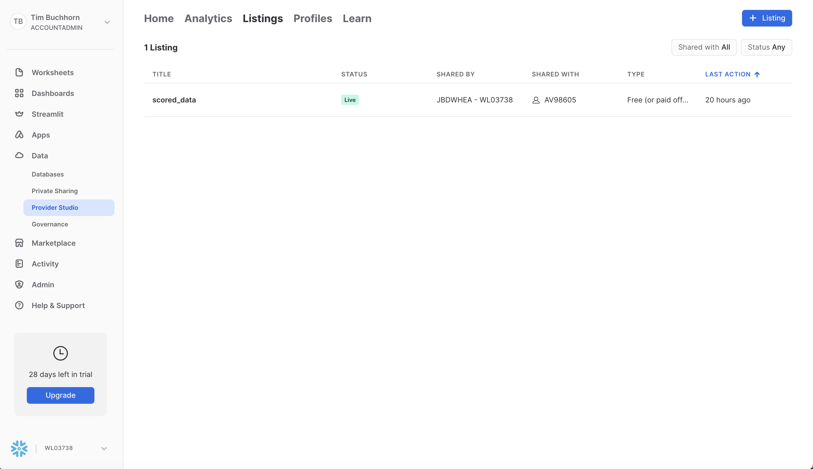

Next select the "Live" button in the top right and select "Unpublish". After that, select the bin icon and delete the listing. A screenshot is below 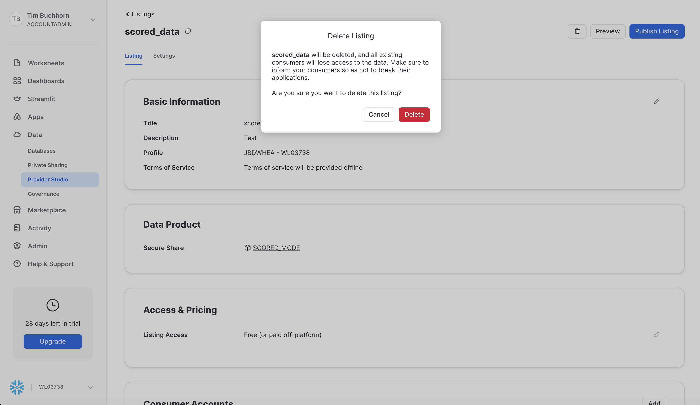

```SQL
DROP SHARE SCORED_MODEL;
```

```SQL
DROP DATABASE SCORED_MODEL CASCADE;
DROP DATABASE CC_DEFAULT_TRAINING_DATA;
DROP WAREHOUSE TRAINING_WH;
DROP WAREHOUSE QUERY_WH;
```

Next we repeat the steps for SnowBank.

Open up the account and navigate to Data > Provider Studio > Listings, and select the listing "cc_default_training_data". A screenshot is below 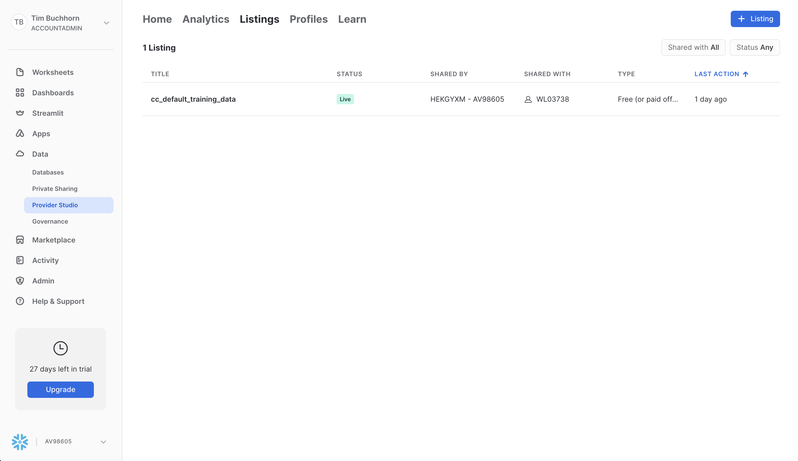

Next select the "Live" button in the top right and select "Unpublish". The following modal should appear. Click "Unpublish" 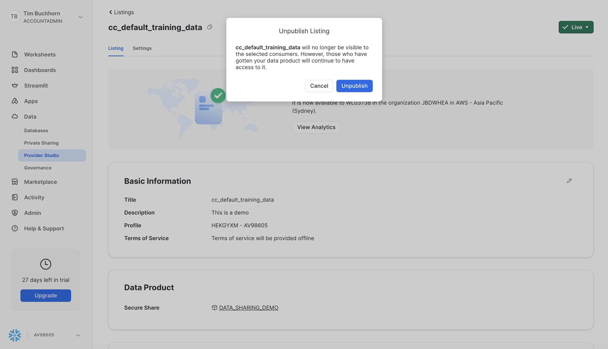

Next, click the trash can icon and delete the listing. Screenshot is below 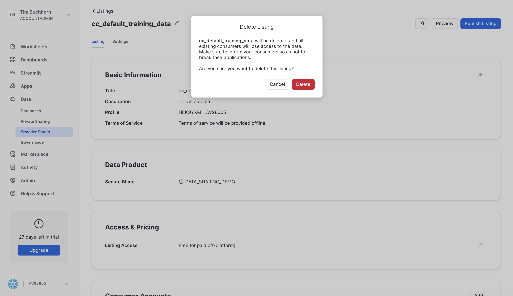

```SQL
DROP SHARE DATA_SHARING_DEMO;
```

```SQL
DROP DATABASE DATA_SHARING_DEMO CASCADE;
DROP DATABASE SCORED_DATA;
DROP WAREHOUSE QUERY_WH;
```